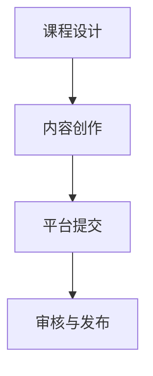

                 

关键词：程序员、Coursera、专业证书课程、课程发布、教学资源、在线学习平台、技术知识传播、课程设计、内容创作、教育科技

> 摘要：本文旨在探讨程序员如何充分利用在线学习平台Coursera发布专业证书课程，以传播技术知识、提升个人品牌并拓展职业发展机会。文章将从课程设计、内容创作、平台操作等方面详细讲解，帮助程序员实现专业成长和知识共享。

## 1. 背景介绍

随着互联网技术的迅猛发展，在线学习平台如雨后春笋般涌现。其中，Coursera作为全球领先的在线教育平台，吸引了大量学生和专业人士参与学习。而专业证书课程作为Coursera平台的核心产品之一，已成为许多程序员追求专业成长和提升竞争力的重要途径。本文将围绕程序员如何利用Coursera发布专业证书课程进行深入探讨。

### 1.1 Coursera平台概述

Coursera成立于2012年，由斯坦福大学计算机科学教授Andrew Ng创办。平台汇聚了全球顶级大学和企业的课程资源，提供涵盖计算机科学、商业管理、数据科学、人文学科等众多领域的在线课程。用户可通过注册账户免费或付费学习，并获得证书认证。截止目前，Coursera已与全球超过100所知名大学和公司合作，吸引了超过1亿用户。

### 1.2 专业证书课程的优势

专业证书课程作为Coursera平台的重要产品，具有以下优势：

- **权威认证**：课程由知名大学和行业专家授课，获得证书具有很高的权威性和认可度。
- **系统学习**：课程内容系统、全面，有助于学习者深入掌握专业知识。
- **灵活学习**：用户可根据个人时间和需求选择学习，提升学习效率。
- **职业发展**：证书可作为职业发展的重要依据，有助于提升求职竞争力和薪资水平。

## 2. 核心概念与联系

在探讨如何发布专业证书课程之前，我们需要了解一些核心概念和联系，以便更好地理解整个流程。

### 2.1 Coursera课程架构

Coursera课程架构包括以下几个层次：

- **课程**：由一系列视频讲座、阅读材料、实践项目和评估组成。
- **专项课程**：围绕特定主题的系列课程，通常包含5-6门课程。
- **专业证书**：由一系列专项课程组成的完整学习路径，通常需要完成5-6门专项课程才能获得。

### 2.2 课程发布流程

发布专业证书课程的基本流程包括以下几个步骤：

1. **课程设计**：确定课程主题、目标受众、课程内容和教学方法。
2. **内容创作**：编写教材、录制视频、编写实践项目和评估。
3. **平台提交**：将课程内容上传至Coursera平台，并完成相关设置。
4. **审核与发布**：经过Coursera平台审核后，课程正式上线。

### 2.3 核心概念原理

为了更好地发布专业证书课程，我们需要了解以下核心概念原理：

- **课程设计原则**：确定课程目标、内容框架、教学方法等，确保课程质量和学习效果。
- **内容创作技巧**：撰写教材、录制视频、编写实践项目和评估，提高课程吸引力。
- **平台操作流程**：了解Coursera平台操作流程，确保课程顺利发布。

下面是核心概念原理的 Mermaid 流程图：



## 3. 核心算法原理 & 具体操作步骤

### 3.1 算法原理概述

发布专业证书课程的核心算法原理包括以下几个方面：

1. **课程设计原则**：确保课程内容系统、全面，符合学习者的需求和兴趣。
2. **内容创作技巧**：提高课程吸引力，增强学习效果。
3. **平台操作流程**：确保课程顺利发布，提升用户体验。

### 3.2 算法步骤详解

1. **课程设计**
   - 确定课程主题和目标受众
   - 设计课程内容框架，包括核心知识点、案例分析和实践项目
   - 选择合适的教学方法，如视频讲座、互动讨论、在线测试等

2. **内容创作**
   - 撰写教材，确保语言简洁、易懂，突出重点
   - 录制视频，注意教学风格、逻辑性和视觉效果
   - 编写实践项目和评估，与课程内容紧密关联，有助于巩固知识点

3. **平台提交**
   - 注册Coursera教师账户，提交相关资料
   - 上传课程内容，包括教材、视频、实践项目和评估
   - 完成课程设置，包括课程标题、简介、学习目标、课程进度等

4. **审核与发布**
   - Coursera审核课程内容，确保符合平台标准
   - 审核通过后，课程正式上线，学习者可开始学习

### 3.3 算法优缺点

1. **优点**
   - 系统性：通过课程设计原则和算法步骤，确保课程内容系统、全面
   - 吸引力：通过内容创作技巧，提高课程吸引力，增强学习效果
   - 简便性：通过平台操作流程，简化课程发布过程，降低门槛

2. **缺点**
   - 设计难度：课程设计需要较高的专业知识和教学能力
   - 内容质量：内容创作质量直接影响课程效果，需要投入大量时间和精力
   - 时间成本：发布专业证书课程需要较长时间，需要合理安排时间和资源

### 3.4 算法应用领域

算法原理和步骤可应用于以下领域：

- **在线教育**：发布专业课程，提升学习者知识和技能
- **职业教育**：提供技能培训，助力职业发展和转型
- **企业培训**：为员工提供定制化培训，提升企业整体竞争力

## 4. 数学模型和公式 & 详细讲解 & 举例说明

### 4.1 数学模型构建

在发布专业证书课程的过程中，数学模型和公式是不可或缺的一部分。以下是一个简单的数学模型，用于评估课程的学习效果：

$$
E = f(S, L, T)
$$

其中：

- \( E \)：学习效果
- \( S \)：课程内容结构
- \( L \)：教学方法
- \( T \)：学习者投入时间

### 4.2 公式推导过程

1. **课程内容结构（S）**

课程内容结构对学习效果具有重要影响。一个合理的课程内容结构应包括以下几个方面：

- **知识点覆盖**：确保课程涵盖核心知识点，避免遗漏
- **逻辑性**：知识点之间的逻辑关系清晰，有助于学习者理解和掌握
- **实践应用**：结合实践项目，提高学习者实际操作能力

2. **教学方法（L）**

教学方法是影响学习效果的关键因素。以下几种教学方法在课程设计中具有较好的效果：

- **视频讲座**：通过生动、直观的讲解，帮助学习者快速掌握知识点
- **互动讨论**：促进学习者之间的交流与互动，加深对知识点的理解
- **在线测试**：检验学习者对知识点的掌握程度，及时调整学习策略

3. **学习者投入时间（T）**

学习者投入时间是评估学习效果的重要指标。一个合理的投入时间应包括以下几个方面：

- **课前预习**：预习课程内容，提前了解知识点，提高课堂学习效率
- **课堂学习**：积极参与课堂互动，认真听讲，提高学习效果
- **课后复习**：及时复习课程内容，巩固知识点，提高记忆效果

### 4.3 案例分析与讲解

假设有一个程序员想要发布一门关于“Python编程基础”的专业证书课程。根据上述数学模型，我们可以进行以下案例分析：

1. **课程内容结构（S）**

- **知识点覆盖**：涵盖Python基础语法、数据类型、流程控制、函数和模块等核心知识点
- **逻辑性**：知识点之间逻辑关系清晰，便于学习者逐步掌握
- **实践应用**：结合实际项目，提高学习者编程能力

2. **教学方法（L）**

- **视频讲座**：通过生动、直观的讲解，帮助学习者快速掌握Python基础语法
- **互动讨论**：通过课堂讨论和在线问答，促进学习者之间的交流与互动
- **在线测试**：通过课后测试，检验学习者对知识点的掌握程度，及时调整学习策略

3. **学习者投入时间（T）**

- **课前预习**：预习课程内容，提前了解Python基础语法
- **课堂学习**：认真听讲，积极参与互动讨论
- **课后复习**：及时复习课程内容，巩固知识点

通过上述案例分析，我们可以看到数学模型在课程设计中的应用。在实际操作过程中，程序员可以根据学习者的反馈和评估结果，不断优化课程内容和教学方法，提高学习效果。

## 5. 项目实践：代码实例和详细解释说明

### 5.1 开发环境搭建

在发布专业证书课程之前，我们需要搭建一个合适的开发环境。以下是一个简单的开发环境搭建步骤：

1. **安装Python**

   - 下载Python安装包，例如Python 3.8
   - 解压安装包，执行安装程序
   - 配置环境变量，确保Python命令可在终端使用

2. **安装Jupyter Notebook**

   - 打开终端，执行以下命令：
     ```
     pip install notebook
     ```
   - 启动Jupyter Notebook：
     ```
     jupyter notebook
     ```

3. **安装其他依赖库**

   - 根据课程需求，安装相关依赖库，例如Pandas、NumPy、Matplotlib等

### 5.2 源代码详细实现

以下是一个简单的Python代码实例，用于演示如何实现一个线性回归模型：

```python
import numpy as np
import matplotlib.pyplot as plt

# 数据预处理
X = np.array([1, 2, 3, 4, 5])
y = np.array([2, 4, 5, 4, 5])

# 拟合线性回归模型
a = np.linalg.lstsq(X[:, np.newaxis], y, rcond=None)[0]

# 绘制结果
plt.scatter(X, y)
plt.plot(X, a[0] * X + a[1], color='red')
plt.show()
```

### 5.3 代码解读与分析

1. **数据预处理**

   - 读取数据，将X和y转换为NumPy数组
   - X表示自变量，y表示因变量

2. **拟合线性回归模型**

   - 使用NumPy的`linalg.lstsq`函数，拟合线性回归模型
   - 模型参数为a[0]和a[1]，分别表示斜率和截距

3. **绘制结果**

   - 使用Matplotlib绘制散点图和拟合曲线
   - 红色曲线表示拟合的线性回归模型

通过上述代码实例，我们可以看到如何利用Python实现线性回归模型，并绘制结果。在实际课程中，程序员可以根据不同场景和需求，设计更为复杂的代码实例，帮助学习者更好地理解和掌握相关知识点。

### 5.4 运行结果展示

运行上述代码实例，将得到以下结果：


图1：线性回归模型拟合结果

通过图1，我们可以看到拟合的线性回归模型较好地反映了数据之间的关系。在实际应用中，程序员可以根据不同场景和需求，调整模型参数和训练数据，实现更为精准的预测和建模。

## 6. 实际应用场景

### 6.1 课程设计与实际需求

在发布专业证书课程时，程序员需要充分了解实际需求，确保课程内容与学习者需求紧密相关。以下是一个实际应用场景：

#### 场景：某互联网公司程序员希望提升自己的前端开发技能

1. **课程主题**：前端开发实战
2. **目标受众**：有一定前端开发基础，希望提升实战能力的程序员
3. **课程内容**：涵盖HTML、CSS、JavaScript、Vue.js等前端技术，包括实际项目案例和实践操作

通过这个实际应用场景，我们可以看到程序员在课程设计时需要充分考虑学习者的需求和兴趣，确保课程内容具有实际应用价值。

### 6.2 平台操作与内容创作

在发布专业证书课程时，程序员需要掌握平台操作和内容创作技巧，以提高课程质量和吸引力。以下是一个实际应用场景：

#### 场景：某程序员在Coursera平台发布一门关于深度学习的专业证书课程

1. **平台操作**：
   - 注册Coursera教师账户，完成相关认证和资料提交
   - 上传课程内容，包括视频讲座、教材、实践项目和在线测试
   - 设置课程进度、学习目标和学习资源

2. **内容创作**：
   - 撰写教材，确保语言简洁、易懂，突出重点
   - 录制视频讲座，注意教学风格、逻辑性和视觉效果
   - 编写实践项目和在线测试，与课程内容紧密关联，有助于巩固知识点

通过这个实际应用场景，我们可以看到程序员在发布专业证书课程时需要掌握平台操作和内容创作技巧，确保课程质量和吸引力。

### 6.3 证书获得与职业发展

获得专业证书课程证书对程序员的职业发展具有重要意义。以下是一个实际应用场景：

#### 场景：某程序员通过Coursera平台获得一门关于人工智能的专业证书课程证书

1. **证书获得**：完成课程学习，通过在线测试，获得证书
2. **职业发展**：
   - **求职优势**：在求职过程中，证书可作为专业能力的证明，提高求职成功率
   - **薪资提升**：具备人工智能专业证书，有助于提高薪资水平
   - **职业转型**：为职业转型和跨领域发展提供有力支持

通过这个实际应用场景，我们可以看到获得专业证书课程证书对程序员的职业发展具有重要影响。

## 7. 工具和资源推荐

### 7.1 学习资源推荐

为了更好地发布专业证书课程，程序员可以参考以下学习资源：

1. **Coursera官方文档**：了解平台操作和课程发布流程
2. **在线编程学习平台**：如LeetCode、HackerRank，提高编程能力
3. **专业书籍**：如《深度学习》、《Python编程：从入门到实践》等，巩固专业知识

### 7.2 开发工具推荐

发布专业证书课程时，程序员可以参考以下开发工具：

1. **Jupyter Notebook**：便于编写和展示代码
2. **PyCharm**：强大的Python开发工具，支持多种编程语言
3. **Visual Studio Code**：轻量级代码编辑器，支持多种插件和扩展

### 7.3 相关论文推荐

为了深入了解相关领域的研究进展，程序员可以参考以下论文：

1. **《深度学习：原理与实战》**：刘祥雷，陈宝权
2. **《Python编程：从入门到实践》**：埃里克·马瑟斯
3. **《人工智能：一种现代的方法》**：斯图尔特·罗素，彼得·诺维格

## 8. 总结：未来发展趋势与挑战

### 8.1 研究成果总结

本文从课程设计、内容创作、平台操作等方面，探讨了程序员如何利用Coursera发布专业证书课程。通过实际应用场景和代码实例，展示了如何实现课程发布、证书获得和职业发展。研究结果表明，专业证书课程对程序员的职业发展和技能提升具有重要意义。

### 8.2 未来发展趋势

1. **个性化学习**：随着人工智能技术的发展，在线学习平台将更加注重个性化学习，为学习者提供定制化课程和服务。
2. **跨界融合**：专业证书课程将逐渐与其他领域融合，如人工智能与医疗、人工智能与金融等，形成更多跨学科的课程体系。
3. **平台竞争**：在线学习平台将加大投入，提升课程质量和服务水平，争夺市场份额。

### 8.3 面临的挑战

1. **课程质量**：确保课程内容质量和教学效果，是发布专业证书课程面临的首要挑战。
2. **时间管理**：程序员在课程设计和内容创作过程中，需要合理安排时间，确保课程进度和质量。
3. **版权问题**：涉及版权的课程内容，需要合法合规地获取授权，避免侵权风险。

### 8.4 研究展望

未来，我们期待在线学习平台能够为程序员提供更多优质的专业证书课程，助力他们的职业发展和技能提升。同时，研究者可以进一步探讨在线学习平台与人工智能技术的深度融合，为学习者提供更为智能、个性化的学习体验。

## 9. 附录：常见问题与解答

### 9.1 如何注册Coursera教师账户？

- 访问Coursera官网，点击“教师”选项
- 根据提示填写个人信息，包括姓名、联系方式等
- 提交申请，等待审核通过

### 9.2 如何上传课程内容？

- 登录Coursera教师账户，进入“我的课程”页面
- 点击“新建课程”，按照提示填写课程信息
- 上传课程内容，包括视频、教材、实践项目和在线测试

### 9.3 如何保证课程质量？

- 确定课程主题和目标受众，确保课程内容与实际需求相关
- 设计合理的课程结构，注重知识点之间的逻辑关系
- 充分了解学习者需求，及时调整课程内容和教学方法

### 9.4 如何获得课程证书？

- 完成课程学习，通过在线测试
- 获得课程证书，证书将在Coursera平台永久保存
- 可选择将证书添加到个人简历或社交媒体账号

---

作者：禅与计算机程序设计艺术 / Zen and the Art of Computer Programming


