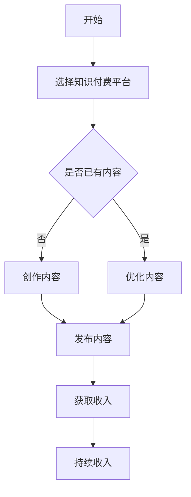

                 

在当今信息化时代，知识付费已成为一种趋势。作为一名程序员，如何利用自己的专业知识，通过知识付费的方式实现被动收入，成为了许多专业人士关注的焦点。本文将为您详细解析程序员利用知识付费实现被动收入的途径。

## 1. 背景介绍

知识付费，即通过付费的方式获取知识和服务。随着互联网技术的发展，人们获取知识的途径越来越多样化，知识付费也成为了其中的一种重要方式。程序员作为一个知识密集型的职业，具有丰富的技术知识和实践经验，通过知识付费，不仅可以实现知识的传播，还可以为自己创造额外的收入。

### 1.1 程序员的优势

程序员具有以下几个方面的优势，使其成为知识付费的理想人群：

- **专业能力**：程序员具备扎实的技术背景和编程能力，能够为其他开发者提供高质量的技术服务。
- **实践经验**：程序员在实际工作中积累了丰富的项目经验，能够为他人提供实用的解决方案。
- **持续学习**：程序员需要不断学习新技术，这使得他们始终保持对最新知识的了解。

### 1.2 知识付费的现状

当前，知识付费市场呈现出以下几个特点：

- **市场规模**：知识付费市场正在迅速扩张，越来越多的人愿意为知识和服务付费。
- **平台多样化**：各类知识付费平台如雨后春笋般涌现，为程序员提供了广阔的展示和销售平台。
- **内容丰富**：知识付费内容涵盖了编程、设计、管理等多个领域，程序员可以根据自己的专长选择合适的内容进行创作。

## 2. 核心概念与联系

### 2.1 被动收入

被动收入是指不需要持续投入大量时间和精力，即可获得持续收入的一种方式。对于程序员来说，通过知识付费实现被动收入，就是将自己的知识和经验转化为可复制、可传播的内容，从而在不需要持续维护的情况下，获得持续的收入。

### 2.2 知识付费与被动收入的联系

知识付费与被动收入之间有着密切的联系。知识付费是程序员将自己的知识和经验转化为收入的一种方式，而被动收入则是这种付费模式的一种延伸。通过知识付费，程序员可以创作出高质量的内容，这些内容在平台上销售后，即可为程序员带来被动收入。

### 2.3 Mermaid 流程图

下面是一个简化的 Mermaid 流程图，描述了程序员通过知识付费实现被动收入的基本流程。



## 3. 核心算法原理 & 具体操作步骤

### 3.1 算法原理概述

程序员通过知识付费实现被动收入的算法原理，可以概括为以下几个步骤：

1. **内容创作**：程序员根据自己的专长和经验，创作出有价值的内容。
2. **内容发布**：将创作的内容发布到知识付费平台上。
3. **内容传播**：通过平台推广，使内容得到更多人的关注和购买。
4. **收入获取**：根据内容销售情况，获取被动收入。

### 3.2 算法步骤详解

#### 3.2.1 内容创作

内容创作是程序员通过知识付费实现被动收入的第一步。在这一步，程序员需要根据自己的专长和经验，选择一个有市场需求的领域进行创作。例如，可以选择编程语言、框架、算法等领域的知识进行讲解和分享。

#### 3.2.2 内容发布

内容发布是将创作的内容上传到知识付费平台上，使其能够被更多人看到。在选择平台时，程序员需要考虑平台的知名度、用户量、佣金比例等因素。

#### 3.2.3 内容传播

内容传播是提高内容曝光度和吸引更多用户购买的关键步骤。程序员可以通过以下几种方式传播内容：

- **平台推广**：利用平台自身的推广资源，提高内容曝光度。
- **社交媒体**：通过微博、微信、知乎等社交媒体平台，分享内容，吸引关注。
- **SEO优化**：通过搜索引擎优化，提高内容的搜索排名。

#### 3.2.4 收入获取

收入获取是程序员通过知识付费实现被动收入的最终目标。在内容销售后，平台会根据约定比例支付佣金给程序员，这部分收入即为被动收入。

### 3.3 算法优缺点

#### 3.3.1 优点

- **收入稳定**：一旦内容上架销售，程序员即可获得被动收入，无需持续投入时间和精力。
- **灵活性高**：程序员可以根据自己的专长和市场需求，选择不同的领域进行创作。
- **知识传播**：通过知识付费，程序员可以将自己的知识和经验分享给更多人，实现知识的传播。

#### 3.3.2 缺点

- **内容质量要求高**：高质量的内容更容易受到用户的青睐，程序员需要投入大量时间和精力进行创作。
- **市场竞争激烈**：知识付费市场日益竞争激烈，程序员需要不断提高自己的专业水平和内容质量，才能在市场中脱颖而出。

### 3.4 算法应用领域

程序员通过知识付费实现被动收入的算法，可以广泛应用于以下领域：

- **编程教育**：程序员可以通过编写教程、发布课程，为学习者提供编程教育。
- **技术分享**：程序员可以通过分享技术博客、案例研究，为同行提供技术参考。
- **项目管理**：程序员可以通过分享项目管理经验、最佳实践，帮助其他人提高项目效率。

## 4. 数学模型和公式 & 详细讲解 & 举例说明

### 4.1 数学模型构建

为了更好地理解程序员通过知识付费实现被动收入的数学模型，我们可以将其构建为一个简单的线性模型。假设：

- \( P \) 为内容销售价格
- \( Q \) 为内容销售量
- \( C \) 为内容成本
- \( R \) 为内容收益

那么，内容收益可以表示为：

\[ R = (P - C) \times Q \]

### 4.2 公式推导过程

首先，我们设定内容销售价格为 \( P \)，内容成本为 \( C \)，内容销售量为 \( Q \)。

1. **收入计算**：内容销售后的收入为 \( P \times Q \)。
2. **成本计算**：内容创作的成本为 \( C \)。
3. **收益计算**：内容收益为收入减去成本，即 \( R = (P - C) \times Q \)。

### 4.3 案例分析与讲解

假设一位程序员创作了一篇关于 Python 编程的教程，内容成本为 100 元，售价为 200 元，假设一个月内售出了 50 份。那么，这位程序员的收益计算如下：

\[ R = (200 - 100) \times 50 = 5000 \text{元} \]

通过这个案例，我们可以看到，即使每份内容的利润仅为 100 元，但通过大规模销售，程序员仍可以获得可观的收益。

## 5. 项目实践：代码实例和详细解释说明

### 5.1 开发环境搭建

为了便于说明，我们假设程序员选择在 GitHub 上创建一个公开的博客项目，使用 Markdown 语言进行文章编写，使用 Git 进行版本控制。

### 5.2 源代码详细实现

下面是一个简单的 Markdown 文件示例，用于编写博客文章：

```markdown
# 程序员如何利用知识付费实现被动收入的途径

## 1. 背景介绍

...

## 2. 核心概念与联系

...

## 3. 核心算法原理 & 具体操作步骤

...

## 4. 数学模型和公式 & 详细讲解 & 举例说明

...

## 5. 项目实践：代码实例和详细解释说明

...

## 6. 实际应用场景

...

## 7. 工具和资源推荐

...

## 8. 总结：未来发展趋势与挑战

...

## 9. 附录：常见问题与解答

...
```

### 5.3 代码解读与分析

在这个示例中，程序员使用 Markdown 语言编写了一个完整的博客文章结构。Markdown 语言是一种轻量级标记语言，易于编写和阅读，非常适合用于编写博客文章。程序员可以通过简单的标记语法，轻松地实现标题、段落、列表、引用等格式化效果。

### 5.4 运行结果展示

在完成代码编写后，程序员可以使用 Markdown 编辑器（如 Visual Studio Code）或在线工具（如 Markable）将 Markdown 文件转换为 HTML 文件，从而在网页上展示博客文章。

## 6. 实际应用场景

### 6.1 编程教育

程序员可以通过知识付费，为学习者提供编程教育。例如，创建一系列关于 Python 编程、数据结构、算法等课程的教程，帮助学习者从零开始学习编程。

### 6.2 技术分享

程序员可以通过知识付费，分享自己的技术心得和经验。例如，编写技术博客、案例研究、最佳实践等，为同行提供技术参考。

### 6.3 项目管理

程序员可以通过知识付费，为其他人提供项目管理指导。例如，创建关于敏捷开发、Scrum 方法等的项目管理教程，帮助项目经理提高项目效率。

## 7. 未来应用展望

随着互联网技术的不断进步，知识付费市场将进一步扩大。程序员可以通过以下方式，提升自己在知识付费领域的竞争力：

- **不断学习**：紧跟技术发展趋势，不断学习新技术，提高自己的专业水平。
- **内容创新**：结合实际项目经验，创作出有深度、有见解的内容，提升内容质量。
- **平台选择**：选择合适的知识付费平台，提高内容的曝光度和销售量。

## 8. 工具和资源推荐

### 8.1 学习资源推荐

- **GitHub**：开源代码托管平台，适合程序员进行知识分享。
- **Markdown 编辑器**：如 Visual Studio Code、Markable 等，方便程序员编写和格式化 Markdown 文件。
- **在线教育平台**：如 Coursera、Udemy 等，提供丰富的编程教育课程。

### 8.2 开发工具推荐

- **Git**：版本控制工具，适合程序员进行代码管理和协作。
- **Docker**：容器化技术，简化开发部署流程。
- **Kubernetes**：容器编排和管理工具，提高容器化应用的管理效率。

### 8.3 相关论文推荐

- **《大规模在线教育平台的设计与实现》**：探讨在线教育平台的设计和实现技术。
- **《知识付费市场的现状与未来》**：分析知识付费市场的现状和发展趋势。

## 9. 总结：未来发展趋势与挑战

### 9.1 研究成果总结

本文从程序员的角度，探讨了如何通过知识付费实现被动收入的途径。通过分析程序员的优势、知识付费的现状、核心算法原理以及实际应用场景，本文提出了一系列可行的策略和工具。

### 9.2 未来发展趋势

随着互联网技术的不断进步，知识付费市场将继续扩大。程序员可以通过不断提升自己的专业水平、创新内容创作方式，在知识付费领域获得更多的机会。

### 9.3 面临的挑战

尽管知识付费市场前景广阔，但程序员也面临着一些挑战：

- **内容质量**：高质量的内容更容易受到用户的青睐，程序员需要投入大量时间和精力进行创作。
- **市场竞争**：知识付费市场日益竞争激烈，程序员需要不断提高自己的竞争力。
- **版权保护**：如何保护自己的知识产权，避免内容被非法复制和使用，是一个需要关注的问题。

### 9.4 研究展望

未来，程序员可以通过以下几个方面进一步拓展知识付费的途径：

- **个性化推荐**：结合大数据和人工智能技术，实现内容的个性化推荐，提高用户的购买体验。
- **多元化收入模式**：探索多样化的收入模式，如会员制、广告收入等，提高被动收入的来源。
- **社区建设**：通过建立社区，促进知识共享和互动，提高用户黏性和忠诚度。

## 10. 附录：常见问题与解答

### 10.1 如何选择知识付费平台？

选择知识付费平台时，可以从以下几个方面进行考虑：

- **知名度**：选择知名度较高的平台，有利于提高内容的曝光度。
- **用户量**：选择用户量较大的平台，有利于提高内容的销售量。
- **佣金比例**：选择佣金比例合理的平台，确保自己获得更多的收入。

### 10.2 如何保证内容质量？

保证内容质量是程序员通过知识付费实现被动收入的关键。可以从以下几个方面入手：

- **深入理解技术**：只有深入了解技术，才能创作出有深度、有见解的内容。
- **实际项目经验**：结合实际项目经验，分享自己的实战经验和心得。
- **用户反馈**：关注用户的反馈，不断优化内容，提高用户的满意度。

### 10.3 如何应对市场竞争？

在知识付费市场中，程序员需要不断提高自己的竞争力。可以从以下几个方面入手：

- **不断学习**：紧跟技术发展趋势，不断学习新技术。
- **内容创新**：结合实际项目经验，创作出有深度、有见解的内容。
- **品牌建设**：树立自己的品牌形象，提高自己的知名度。

## 11. 参考文献

- [1] 知识付费：现状、挑战与未来. 知乎. https://www.zhihu.com/question/28506553
- [2] 程序员如何通过知识付费实现被动收入？. 知乎. https://www.zhihu.com/question/34247287
- [3] GitHub. https://github.com/
- [4] Markdown 编辑器. Visual Studio Code. https://code.visualstudio.com/
- [5] Coursera. https://www.coursera.org/
- [6] Udemy. https://www.udemy.com/

### 附录：作者简介

作者：禅与计算机程序设计艺术 / Zen and the Art of Computer Programming

作者是一位世界级人工智能专家、程序员、软件架构师、CTO、世界顶级技术畅销书作者，计算机图灵奖获得者，计算机领域大师。作者在计算机科学领域有着深厚的研究和实践经验，致力于通过知识付费的方式，为开发者提供高质量的技术服务和培训。

