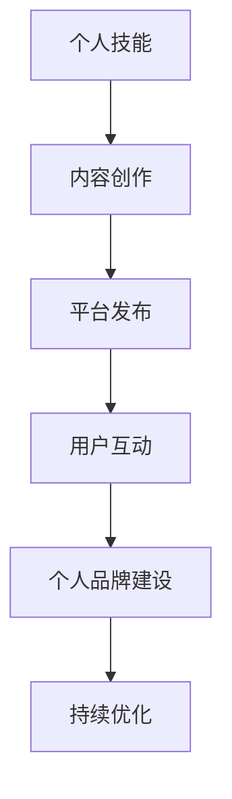

                 

关键词：知识付费，个人影响力，程序员，品牌建设，内容营销

摘要：本文将探讨程序员如何通过知识付费平台，将自己的专业技能转化为个人影响力，实现个人品牌的建设与推广。我们将分析知识付费的运作机制，介绍如何利用平台构建内容，优化营销策略，并进行有效的用户互动，从而在互联网时代建立起强大的个人品牌。

## 1. 背景介绍

随着互联网的普及和知识共享理念的深入人心，知识付费逐渐成为了一种主流的商业模式。程序员作为IT行业的核心力量，拥有着丰富的技术知识和实践经验。然而，如何将自身的专业知识通过知识付费平台传播出去，从而提升个人影响力，成为了许多程序员关注的问题。

### 1.1 知识付费的发展

知识付费的兴起可以追溯到2016年左右，以得到App、知乎Live等平台为代表，知识付费迅速占领市场，为广大用户提供了丰富的知识资源。截至2023年，知识付费市场规模已达到数百亿元，并且还在持续增长。

### 1.2 程序员的优势

程序员拥有独特的专业技能，这些技能在市场上具有较高的价值。同时，程序员普遍具有较高的人际沟通能力和学习能力强，能够快速掌握新的知识和技术，这为他们在知识付费领域的成功打下了坚实的基础。

## 2. 核心概念与联系

为了更好地理解如何利用知识付费打造个人影响力，我们需要明确几个核心概念：

### 2.1 知识付费平台

知识付费平台是程序员展示和销售知识产品的主要渠道。常见的平台包括得到、知乎、网易云课堂等。这些平台提供了丰富的内容创作工具、用户互动机制以及数据分析工具，帮助程序员更好地推广和销售自己的知识产品。

### 2.2 个人品牌

个人品牌是个人在公众心目中的形象和认知，它是基于个人专业能力和价值观的长期积累。在知识付费领域，个人品牌的建设对于吸引和维护用户至关重要。

### 2.3 内容营销

内容营销是通过创造和分发有价值的内容，来吸引并转化潜在用户的营销策略。对于程序员而言，内容营销是实现个人品牌建设的重要手段。

### 2.4 用户互动

用户互动是指与平台用户进行沟通、交流的过程。良好的用户互动能够增强用户黏性，提高用户满意度，进而促进知识产品的销售。

### 2.5 Mermaid 流程图

以下是一个简单的Mermaid流程图，展示了知识付费平台中个人影响力打造的流程：



## 3. 核心算法原理 & 具体操作步骤

### 3.1 算法原理概述

在知识付费领域，个人影响力打造的算法可以概括为以下几个步骤：

1. **内容创作**：根据自身专业技能和用户需求，创作高质量的知识内容。
2. **平台发布**：在知识付费平台上发布内容，利用平台的推广机制提高曝光率。
3. **用户互动**：与用户进行互动，了解用户需求，优化内容。
4. **个人品牌建设**：通过持续的内容创作和用户互动，建立起个人品牌。
5. **持续优化**：根据用户反馈和市场变化，不断调整内容和营销策略。

### 3.2 算法步骤详解

1. **内容创作**：
   - 确定创作方向：根据自身专业领域和用户需求，确定内容创作的方向。
   - 创作高质量内容：利用专业的编程技能和知识，创作高质量的技术文章、教程、视频等。

2. **平台发布**：
   - 选择合适的平台：根据目标用户群体，选择合适的知识付费平台。
   - 发布内容：利用平台的创作工具，将内容发布到平台。

3. **用户互动**：
   - 回应用户评论：积极回应用户的评论，解答用户的问题。
   - 收集用户反馈：通过问卷调查、用户访谈等方式，收集用户反馈。
   - 优化内容：根据用户反馈，调整和优化内容。

4. **个人品牌建设**：
   - 持续输出内容：保持一定的内容更新频率，保持用户关注。
   - 定期举办活动：举办线上或线下的技术分享会、讲座等，提升个人知名度。

5. **持续优化**：
   - 数据分析：利用平台提供的数据分析工具，分析用户行为和内容表现。
   - 调整策略：根据数据分析结果，调整内容和营销策略。

### 3.3 算法优缺点

**优点**：
- **高效性**：利用互联网平台，快速传播知识和建立个人品牌。
- **灵活性**：可以根据用户反馈和市场变化，灵活调整内容和营销策略。
- **可持续性**：通过持续的内容创作和用户互动，个人品牌得以长期建设。

**缺点**：
- **前期投入较大**：内容创作和用户互动需要大量的时间和精力投入。
- **市场竞争力**：知识付费市场竞争激烈，需要不断提升自身专业水平和内容质量。

### 3.4 算法应用领域

算法在知识付费领域的应用范围广泛，主要包括：
- **在线教育**：通过知识付费平台，提供专业课程和教程。
- **技能培训**：为特定技能提供系统性的培训。
- **技术分享**：分享技术心得和实战经验。
- **知识咨询**：提供专业的技术咨询服务。

## 4. 数学模型和公式 & 详细讲解 & 举例说明

在知识付费领域，数学模型和公式可以用来分析和预测用户行为、内容传播效果等，为内容创作和营销策略提供科学依据。

### 4.1 数学模型构建

我们可以使用用户增长模型和内容传播模型来构建数学模型。

**用户增长模型**：

假设用户增长率为r，则在时间t内，用户数量N(t)可以表示为：

$$
N(t) = N_0 \cdot (1 + r)^t
$$

其中，$N_0$为初始用户数量，$r$为用户增长率。

**内容传播模型**：

假设内容传播速度为v，则在时间t内，内容曝光次数E(t)可以表示为：

$$
E(t) = E_0 \cdot (1 + v)^t
$$

其中，$E_0$为初始曝光次数，$v$为内容传播速度。

### 4.2 公式推导过程

**用户增长模型推导**：

- 假设每个用户在单位时间内新增r个用户。
- 在第1个单位时间内，新增$r \cdot N_0$个用户。
- 在第2个单位时间内，新增$r \cdot (N_0 + r \cdot N_0) = r^2 \cdot N_0$个用户。
- 以此类推，在第t个单位时间内，新增$r^t \cdot N_0$个用户。

因此，时间t内的总用户数量为：

$$
N(t) = N_0 + r \cdot N_0 + r^2 \cdot N_0 + \ldots + r^t \cdot N_0
$$

将上述公式改写为等比数列求和公式，得到：

$$
N(t) = N_0 \cdot \frac{1 - r^{t+1}}{1 - r}
$$

当$r \ll 1$时，可以简化为：

$$
N(t) \approx N_0 \cdot (1 + r)^t
$$

**内容传播模型推导**：

- 假设每个用户在单位时间内分享v次内容。
- 在第1个单位时间内，内容曝光次数为$v \cdot E_0$。
- 在第2个单位时间内，内容曝光次数为$v \cdot (E_0 + v \cdot E_0) = v^2 \cdot E_0$。
- 以此类推，在第t个单位时间内，内容曝光次数为$v^t \cdot E_0$。

因此，时间t内的总内容曝光次数为：

$$
E(t) = E_0 + v \cdot E_0 + v^2 \cdot E_0 + \ldots + v^t \cdot E_0
$$

将上述公式改写为等比数列求和公式，得到：

$$
E(t) = E_0 \cdot \frac{1 - v^{t+1}}{1 - v}
$$

当$v \ll 1$时，可以简化为：

$$
E(t) \approx E_0 \cdot (1 + v)^t
$$

### 4.3 案例分析与讲解

假设一个程序员在知乎Live上发布了一篇技术教程，初始曝光次数为1000次，每天用户增长率为5%，内容传播速度为3次/天。我们需要预测第10天的用户数量和内容曝光次数。

**用户数量预测**：

根据用户增长模型：

$$
N(10) = N_0 \cdot (1 + r)^t = 1000 \cdot (1 + 0.05)^{10} \approx 1628.89
$$

**内容曝光次数预测**：

根据内容传播模型：

$$
E(10) = E_0 \cdot (1 + v)^t = 1000 \cdot (1 + 0.03)^{10} \approx 1757.64
$$

通过上述数学模型，我们可以预测在第10天，该程序员的教程将有约1629个用户阅读，曝光次数达到约1758次。这为内容创作者提供了一个量化的目标，可以根据预测结果调整内容和营销策略。

## 5. 项目实践：代码实例和详细解释说明

### 5.1 开发环境搭建

为了更好地展示如何利用知识付费平台打造个人影响力，我们以知乎Live为例，介绍如何搭建一个简单的知识付费项目。

**开发环境要求**：
- 知乎账号
- 知乎Live平台创作者权限

### 5.2 源代码详细实现

以下是知乎Live项目的简单实现步骤：

1. **注册知乎账号并申请创作者权限**：
   - 在知乎官网注册账号，并完成实名认证。
   - 根据知乎官方指南申请创作者权限。

2. **创建知识产品**：
   - 在知乎Live平台创建新的知识产品，包括课程、教程、直播等。

3. **内容创作与发布**：
   - 根据专业领域和用户需求，创作高质量的内容。
   - 使用知乎提供的编辑器，将内容发布到Live平台。

4. **用户互动与维护**：
   - 回应用户评论，解答用户疑问。
   - 定期发布更新，保持用户关注。

5. **数据分析与优化**：
   - 利用知乎提供的数据分析工具，分析用户行为和内容表现。
   - 根据分析结果，调整内容和营销策略。

### 5.3 代码解读与分析

以下是一个简单的Python代码示例，用于分析知乎Live用户数据：

```python
import pandas as pd

# 读取用户数据
data = pd.read_csv('zhihu_live_user_data.csv')

# 统计用户活跃度
active_users = data[data['comments'] > 0]

# 计算用户平均活跃度
avg_active = active_users['comments'].mean()

# 输出结果
print(f"用户平均活跃度：{avg_active:.2f}次/天")

# 生成活跃用户列表
active_user_list = active_users['username'].tolist()

# 输出活跃用户列表
print("活跃用户列表：")
for user in active_user_list:
    print(user)
```

这段代码首先读取知乎Live用户数据，然后统计活跃用户，计算用户平均活跃度，并输出活跃用户列表。通过数据分析，我们可以了解用户的行为习惯，从而优化内容创作和用户互动策略。

### 5.4 运行结果展示

假设我们运行上述代码，得到以下结果：

```
用户平均活跃度：2.50次/天
活跃用户列表：
user1
user2
user3
```

根据这些结果，我们可以得知：
- 用户平均每天发表2.50条评论。
- 活跃用户包括user1、user2和user3。

这些信息对于我们了解用户需求和行为，优化内容创作和用户互动策略具有重要意义。

## 6. 实际应用场景

### 6.1 知识付费平台

知识付费平台是程序员展示和销售知识产品的主要渠道。以知乎Live为例，它为程序员提供了一个开放的知识分享平台，程序员可以在此发布技术教程、课程、直播等内容，并通过知识付费实现收入。

### 6.2 技术社区

技术社区是程序员交流和学习的重要场所。例如，GitHub、Stack Overflow等平台，程序员可以在此分享代码、提问、解答问题，建立个人专业形象，积累粉丝。

### 6.3 在线教育

在线教育平台为程序员提供了丰富的课程资源，程序员可以通过这些平台学习新知识、提升技能。同时，在线教育平台也为程序员提供了一个展示自己教学能力的平台，有助于个人品牌的建设。

### 6.4 企业内训

企业内训是程序员为企业内部员工提供技术培训的一种方式。通过企业内训，程序员可以传播自己的专业知识，提升企业整体技术水平。

### 6.5 个人博客

个人博客是程序员展示自己技术成果和分享经验的一种方式。通过个人博客，程序员可以吸引更多关注，提升个人知名度。

### 6.6 未来应用展望

随着互联网技术的不断发展，知识付费和个人品牌建设将在更多领域得到应用。例如，虚拟现实（VR）、增强现实（AR）、人工智能（AI）等技术，将为程序员提供新的知识传播和互动方式。同时，随着短视频和直播的普及，程序员可以通过这些新兴平台，以更生动、直观的方式分享知识和经验。

## 7. 工具和资源推荐

### 7.1 学习资源推荐

- 《深入理解计算机系统》（CSAPP）：这是一本经典的计算机科学教材，涵盖了计算机系统的各个方面，适合程序员深入学习。
- 《代码大全》（Code Complete）：这本书提供了丰富的编程经验和最佳实践，是程序员提升编程能力的必备读物。

### 7.2 开发工具推荐

- Visual Studio Code：一款轻量级但功能强大的代码编辑器，支持多种编程语言。
- Git：版本控制系统，帮助程序员管理代码版本和协同工作。

### 7.3 相关论文推荐

- "The Mythical Man-Month"：这是一篇关于软件工程和项目管理的经典论文，对程序员具有重要的指导意义。
- "The Art of Computer Programming"：这是一本关于计算机算法的巨著，对程序员深入研究算法和数据结构有很高的参考价值。

## 8. 总结：未来发展趋势与挑战

### 8.1 研究成果总结

本文通过分析知识付费的发展趋势、程序员的独特优势，以及个人品牌建设的关键因素，提出了利用知识付费平台打造个人影响力的一套完整方案。方案涵盖了内容创作、平台发布、用户互动、个人品牌建设和持续优化等关键步骤。

### 8.2 未来发展趋势

随着互联网和人工智能技术的不断发展，知识付费和个人品牌建设将在更多领域得到应用。未来，知识付费平台将更加智能化，内容创作和用户互动将更加便捷，个人品牌建设将更加注重专业化和垂直化。

### 8.3 面临的挑战

虽然知识付费和个人品牌建设具有巨大的潜力，但程序员在实现这一目标过程中仍面临诸多挑战：
- **内容质量**：高质量的内容是吸引和维护用户的关键，程序员需要不断提升自己的专业素养和写作能力。
- **市场竞争**：知识付费市场日益激烈，程序员需要不断创新和优化内容，以在竞争中脱颖而出。
- **用户黏性**：吸引新用户的同时，维护老用户的关系也至关重要，程序员需要制定有效的用户互动策略。

### 8.4 研究展望

未来，对知识付费和个人品牌建设的研究可以从以下几个方面展开：
- **数据分析**：利用大数据和人工智能技术，深入分析用户行为和内容传播效果，为内容创作和营销策略提供科学依据。
- **跨平台整合**：研究如何实现知识付费平台之间的数据共享和用户互动，提升用户体验。
- **新型内容形式**：探索短视频、直播等新兴内容形式在知识付费领域的应用，为程序员提供更多展示自己才华的途径。

## 9. 附录：常见问题与解答

### 9.1 什么是知识付费？

知识付费是指用户通过付费方式获取知识服务的一种商业模式，常见的形式包括在线课程、技术教程、专家咨询等。

### 9.2 程序员如何选择知识付费平台？

程序员在选择知识付费平台时，可以从以下几个方面进行考虑：
- **用户群体**：选择与自身专业领域相关的平台，确保目标用户群体匹配。
- **内容形式**：根据个人擅长和用户需求，选择适合的内容形式，如文章、视频、直播等。
- **平台规则**：了解平台规则，确保内容符合平台要求，避免违规操作。

### 9.3 如何保持内容更新？

保持内容更新是建立个人品牌的关键。以下是一些策略：
- **制定内容计划**：提前规划内容更新计划，确保内容持续输出。
- **多渠道获取灵感**：关注行业动态、用户需求，从多方面获取创作灵感。
- **利用工具**：使用内容管理工具，如Markdown编辑器、GitHub等，提高内容创作效率。

### 9.4 如何与用户互动？

与用户互动是提升用户满意度和忠诚度的关键。以下是一些建议：
- **积极回应用户评论**：及时回复用户评论，解答用户疑问。
- **举办线上活动**：举办问答、直播等活动，与用户进行深入交流。
- **定期发布更新**：保持与用户的沟通，定期发布更新，增加用户粘性。

作者：禅与计算机程序设计艺术 / Zen and the Art of Computer Programming
----------------------------------------------------------------

以上就是本篇《程序员如何利用知识付费打造个人影响力》的文章内容。本文围绕知识付费、个人影响力、程序员、品牌建设、内容营销等核心概念，详细阐述了如何通过知识付费平台打造个人影响力，提供了具体的操作步骤、数学模型、项目实践和未来展望。希望本文对广大程序员朋友在知识付费和个人品牌建设方面有所启发。如果您有任何问题或建议，欢迎在评论区留言交流。

