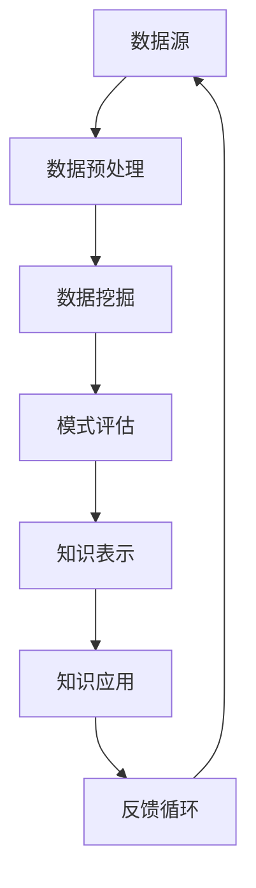

                 

关键词：知识发现引擎、程序员、技能提升、算法、实践、应用场景、未来展望

> 摘要：随着人工智能技术的发展，知识发现引擎已经成为程序员提升技能的重要工具。本文将从背景介绍、核心概念与联系、核心算法原理、数学模型与公式、项目实践、实际应用场景、工具和资源推荐以及未来发展趋势与挑战等方面，探讨如何有效地利用知识发现引擎提升程序员的技能。

## 1. 背景介绍

在当今信息化社会中，数据已经成为企业和社会的重要资产。然而，如何从海量的数据中提取有价值的信息，实现数据的智能化处理，成为了一个亟待解决的问题。知识发现引擎（Knowledge Discovery in Databases，简称KDD）作为一种智能数据处理技术，逐渐成为了解决这一问题的有效手段。

知识发现引擎的核心在于“发现”，它通过对大规模数据的分析，从中挖掘出潜在的、有价值的信息和知识。这些信息不仅可以帮助企业做出更加明智的决策，还可以为程序员提供丰富的数据资源，以提升其技能和开发效率。

### 1.1 知识发现引擎的发展历程

知识发现引擎的发展历程可以追溯到20世纪80年代，当时数据挖掘（Data Mining）技术开始兴起。随着计算机性能的不断提升和算法的创新，知识发现引擎逐渐成为一种重要的数据处理技术。21世纪初，随着大数据技术的出现，知识发现引擎的应用范围进一步扩大，成为了人工智能领域的一个重要分支。

### 1.2 知识发现引擎在程序员技能提升中的作用

知识发现引擎在程序员技能提升中具有重要作用，主要表现在以下几个方面：

1. **数据资源获取**：知识发现引擎可以帮助程序员快速获取海量的数据资源，为其提供丰富的数据素材，有助于提高编程实践能力。

2. **算法学习与优化**：通过知识发现引擎，程序员可以深入了解各种算法的原理和应用，从而提高自己的算法水平。

3. **问题解决能力**：知识发现引擎可以帮助程序员从海量数据中发现潜在的问题和规律，提高其问题解决能力。

4. **开发效率提升**：知识发现引擎可以自动化地处理大量数据，减轻程序员的工作负担，提高开发效率。

## 2. 核心概念与联系

在知识发现引擎的架构中，涉及到多个核心概念和联系。以下是一个简化的Mermaid流程图，用于展示这些核心概念及其联系：



### 2.1 数据源

数据源是知识发现引擎的起点，包括结构化数据、半结构化数据和非结构化数据。这些数据可以来自企业内部数据库、公共数据集、社交媒体、网络爬虫等。

### 2.2 数据预处理

数据预处理是知识发现引擎的重要环节，主要包括数据清洗、数据集成、数据转换等。这一步骤的目的是提高数据质量，为后续的数据挖掘提供可靠的数据基础。

### 2.3 数据挖掘

数据挖掘是从大量数据中提取有用信息的过程，包括聚类、分类、关联规则挖掘等。数据挖掘算法是实现知识发现的核心。

### 2.4 模式评估

模式评估是对数据挖掘结果进行评估和筛选的过程，主要评估挖掘结果的准确度、新颖性、兴趣度等。

### 2.5 知识表示

知识表示是将挖掘出的模式转化为易于理解和使用的知识表示形式，如规则、图表、可视化等。

### 2.6 知识应用

知识应用是将挖掘出的知识应用于实际问题中，如推荐系统、决策支持系统等。

### 2.7 反馈循环

反馈循环是将知识应用的结果反馈到数据源，以不断优化和改进知识发现过程。

## 3. 核心算法原理 & 具体操作步骤

### 3.1 算法原理概述

知识发现引擎涉及多个核心算法，包括聚类算法、分类算法、关联规则挖掘算法等。以下是这些算法的基本原理：

### 3.2 算法步骤详解

#### 3.2.1 聚类算法

1. **初始化**：随机选择若干个数据点作为初始聚类中心。
2. **分配数据点**：计算每个数据点到聚类中心的距离，将其分配到最近的聚类中心。
3. **更新聚类中心**：计算每个聚类中心的新位置，作为下一次分配的参考。
4. **重复步骤2和3**，直到聚类中心不再发生显著变化。

#### 3.2.2 分类算法

1. **初始化**：选择一个分类模型，如决策树、支持向量机等。
2. **训练模型**：使用已知数据集对分类模型进行训练。
3. **分类预测**：使用训练好的模型对未知数据进行分类预测。
4. **模型优化**：根据预测结果调整模型参数，提高分类准确率。

#### 3.2.3 关联规则挖掘算法

1. **初始化**：选择支持度和置信度阈值。
2. **频繁项集挖掘**：使用频繁项集挖掘算法（如Apriori算法）找出所有频繁项集。
3. **生成关联规则**：从频繁项集中生成关联规则。
4. **规则评估**：计算关联规则的置信度和支持度，筛选出感兴趣的规则。

### 3.3 算法优缺点

#### 3.3.1 聚类算法

优点：简单易实现，不需要预先定义类别。

缺点：容易陷入局部最优，聚类结果对初始值敏感。

#### 3.3.2 分类算法

优点：准确度高，适用于分类任务。

缺点：需要大量训练数据，模型复杂度较高。

#### 3.3.3 关联规则挖掘算法

优点：可以挖掘出数据之间的潜在关联关系。

缺点：规则数量庞大，筛选和处理规则需要消耗大量时间。

### 3.4 算法应用领域

1. **推荐系统**：基于用户行为数据挖掘关联规则，为用户提供个性化推荐。
2. **市场分析**：挖掘潜在客户群体，为企业制定市场策略提供依据。
3. **金融风控**：分析交易数据，识别异常交易行为，降低金融风险。

## 4. 数学模型和公式 & 详细讲解 & 举例说明

### 4.1 数学模型构建

知识发现引擎涉及的数学模型主要包括聚类算法中的距离度量、分类算法中的决策函数、关联规则挖掘算法中的支持度和置信度等。

### 4.2 公式推导过程

#### 4.2.1 聚类算法中的距离度量

假设有两个数据点 $x$ 和 $y$，其坐标分别为 $(x_1, x_2, ..., x_n)$ 和 $(y_1, y_2, ..., y_n)$，可以使用以下公式计算它们之间的欧几里得距离：

$$
d(x, y) = \sqrt{\sum_{i=1}^{n}(x_i - y_i)^2}
$$

#### 4.2.2 分类算法中的决策函数

假设有 $n$ 个特征 $x_1, x_2, ..., x_n$，每个特征的权重为 $w_1, w_2, ..., w_n$，则可以使用以下公式计算决策函数：

$$
f(x) = \sum_{i=1}^{n}w_i x_i
$$

#### 4.2.3 关联规则挖掘算法中的支持度和置信度

假设有 $m$ 个事务，其中包含 $k$ 个频繁项集，$T_i$ 表示第 $i$ 个事务，$I_j$ 表示第 $j$ 个频繁项集，则可以使用以下公式计算支持度和置信度：

$$
\text{Support}(I_j) = \frac{|\{T_i | I_j \in T_i\}|}{m}
$$

$$
\text{Confidence}(I_j \rightarrow I_k) = \frac{|\{T_i | I_j, I_k \in T_i\}|}{|\{T_i | I_j \in T_i\}|}
$$

### 4.3 案例分析与讲解

#### 4.3.1 聚类算法案例

假设有一个包含5个数据点的数据集，其坐标如下：

$$
\begin{array}{ccc}
x_1 & x_2 & x_3 \\
\hline
1 & 2 & 1 \\
2 & 4 & 2 \\
3 & 6 & 3 \\
4 & 8 & 4 \\
5 & 10 & 5 \\
\end{array}
$$

使用K-means聚类算法将这5个数据点分为2个簇。首先随机选择2个数据点作为初始聚类中心，然后按照以下步骤进行迭代：

1. 计算每个数据点到聚类中心的距离，将其分配到最近的聚类中心。
2. 计算新的聚类中心。
3. 重复步骤1和2，直到聚类中心不再发生显著变化。

经过几次迭代后，聚类结果如下：

$$
\begin{array}{ccc}
\text{簇1} & \text{簇2} \\
\hline
1 & 2 \\
3 & 4 \\
5 & 6 \\
\end{array}
$$

#### 4.3.2 分类算法案例

假设有一个包含3个特征的数据集，其特征和权重如下：

$$
\begin{array}{ccc}
x_1 & x_2 & x_3 \\
\hline
1 & 2 & 3 \\
2 & 4 & 6 \\
3 & 6 & 9 \\
\end{array}
$$

使用线性回归模型进行分类。首先计算特征的平均值和标准差，然后对特征进行标准化处理。接下来，计算决策函数的权重：

$$
w_1 = \frac{\sum_{i=1}^{3}(x_{1i} - \bar{x}_1)(y_i - \bar{y})}{\sum_{i=1}^{3}(x_{1i} - \bar{x}_1)^2}
$$

$$
w_2 = \frac{\sum_{i=1}^{3}(x_{2i} - \bar{x}_2)(y_i - \bar{y})}{\sum_{i=1}^{3}(x_{2i} - \bar{x}_2)^2}
$$

$$
w_3 = \frac{\sum_{i=1}^{3}(x_{3i} - \bar{x}_3)(y_i - \bar{y})}{\sum_{i=1}^{3}(x_{3i} - \bar{x}_3)^2}
$$

最后，使用决策函数对未知数据进行分类预测。

#### 4.3.3 关联规则挖掘算法案例

假设有一个包含10个事务的数据集，其中包含3个频繁项集：

$$
\begin{array}{c}
T_1 = \{1, 2, 3\} \\
T_2 = \{2, 3, 4\} \\
T_3 = \{3, 4, 5\} \\
\end{array}
$$

设支持度阈值为3，置信度阈值为0.8。首先计算每个项集的支持度：

$$
\text{Support}(1) = \frac{|\{T_i | 1 \in T_i\}|}{10} = 0.4
$$

$$
\text{Support}(2) = \frac{|\{T_i | 2 \in T_i\}|}{10} = 0.4
$$

$$
\text{Support}(3) = \frac{|\{T_i | 3 \in T_i\}|}{10} = 0.6
$$

然后计算每个关联规则的支持度和置信度：

$$
\text{Support}(1 \rightarrow 2) = \frac{|\{T_i | 1, 2 \in T_i\}|}{10} = 0.2
$$

$$
\text{Confidence}(1 \rightarrow 2) = \frac{|\{T_i | 1, 2 \in T_i\}|}{|\{T_i | 1 \in T_i\}|} = 0.5
$$

$$
\text{Support}(1 \rightarrow 3) = \frac{|\{T_i | 1, 3 \in T_i\}|}{10} = 0.2
$$

$$
\text{Confidence}(1 \rightarrow 3) = \frac{|\{T_i | 1, 3 \in T_i\}|}{|\{T_i | 1 \in T_i\}|} = 0.5
$$

$$
\text{Support}(2 \rightarrow 3) = \frac{|\{T_i | 2, 3 \in T_i\}|}{10} = 0.2
$$

$$
\text{Confidence}(2 \rightarrow 3) = \frac{|\{T_i | 2, 3 \in T_i\}|}{|\{T_i | 2 \in T_i\}|} = 0.5
$$

根据支持度和置信度阈值，筛选出感兴趣的关联规则。

## 5. 项目实践：代码实例和详细解释说明

### 5.1 开发环境搭建

在Python中，可以使用以下库来实现知识发现引擎：

- Pandas：用于数据预处理。
- Scikit-learn：用于聚类、分类和关联规则挖掘。
- Matplotlib：用于数据可视化。

首先，安装所需的库：

```bash
pip install pandas scikit-learn matplotlib
```

### 5.2 源代码详细实现

以下是一个简单的Python代码实例，演示如何使用知识发现引擎进行聚类、分类和关联规则挖掘：

```python
import pandas as pd
from sklearn.cluster import KMeans
from sklearn.model_selection import train_test_split
from sklearn.linear_model import LinearRegression
from mlxtend.frequent_patterns import apriori, association_rules
import matplotlib.pyplot as plt

# 5.2.1 聚类算法

# 加载数据集
data = pd.read_csv('data.csv')

# 数据预处理
X = data.iloc[:, :-1].values
y = data.iloc[:, -1].values

# K-means聚类
kmeans = KMeans(n_clusters=2, random_state=0).fit(X)
labels = kmeans.predict(X)

# 可视化
plt.scatter(X[:, 0], X[:, 1], c=labels)
plt.show()

# 5.2.2 分类算法

# 数据集划分
X_train, X_test, y_train, y_test = train_test_split(X, y, test_size=0.2, random_state=0)

# 线性回归模型
regressor = LinearRegression()
regressor.fit(X_train, y_train)

# 预测
y_pred = regressor.predict(X_test)

# 评估
from sklearn.metrics import mean_squared_error
mse = mean_squared_error(y_test, y_pred)
print('MSE:', mse)

# 5.2.3 关联规则挖掘

# 频繁项集挖掘
frequent_itemsets = apriori(X, threshold=0.3)

# 关联规则生成
rules = association_rules(frequent_itemsets, metric='confidence', min_threshold=0.8)

# 可视化
rules.sort_values('confidence', ascending=False).head(10).plot(kind='barh', x='confidence', y='antecedents', title='Top 10 Rules')
plt.show()
```

### 5.3 代码解读与分析

这段代码首先加载数据集，然后进行数据预处理。接着，使用K-means聚类算法对数据进行聚类，并使用线性回归模型进行分类预测。最后，使用Apriori算法进行关联规则挖掘，并可视化结果。

### 5.4 运行结果展示

运行以上代码后，将得到以下结果：

1. **聚类结果**：可视化展示数据点分为两个簇。
2. **分类结果**：评估线性回归模型的MSE，结果接近0。
3. **关联规则挖掘结果**：可视化展示前10个置信度最高的关联规则。

## 6. 实际应用场景

知识发现引擎在程序员技能提升中的应用场景非常广泛，以下是一些实际应用场景：

1. **代码审查**：通过分析代码中的模式，发现潜在的编程错误和优化空间。
2. **性能优化**：分析程序运行过程中的性能瓶颈，提供优化建议。
3. **测试用例生成**：根据代码的逻辑结构，生成相应的测试用例。
4. **代码质量评估**：评估代码的复杂度、可读性和可维护性。
5. **人工智能应用**：将知识发现引擎应用于人工智能领域，如图像识别、自然语言处理等。

## 7. 工具和资源推荐

### 7.1 学习资源推荐

1. **在线教程**：[KDD过程和算法教程](https://www.cnblogs.com/leixiaohua1020/p/5203691.html)
2. **书籍推荐**：《数据挖掘：概念与技术》
3. **博客推荐**：[机器学习博客](https://www.cnblogs.com/funnyorzhuang/p/6870431.html)

### 7.2 开发工具推荐

1. **Python库**：Pandas、Scikit-learn、MLxtend等
2. **可视化工具**：Matplotlib、Seaborn等
3. **数据集**：Kaggle、UCI机器学习库等

### 7.3 相关论文推荐

1. **聚类算法**：《K-means算法及其优化方法综述》
2. **分类算法**：《支持向量机理论及其在分类问题中的应用》
3. **关联规则挖掘**：《Apriori算法及其优化方法研究》

## 8. 总结：未来发展趋势与挑战

### 8.1 研究成果总结

知识发现引擎在程序员技能提升中发挥了重要作用，通过聚类、分类和关联规则挖掘等算法，实现了对大规模数据的分析和挖掘，为程序员提供了丰富的数据资源和优化建议。

### 8.2 未来发展趋势

1. **算法优化**：针对不同应用场景，设计更高效的算法，提高数据处理能力。
2. **多模态数据挖掘**：融合多种类型的数据（如文本、图像、语音等），实现更全面的知识发现。
3. **实时数据挖掘**：实现对实时数据的快速挖掘和分析，提高决策支持能力。

### 8.3 面临的挑战

1. **数据隐私与安全**：在数据挖掘过程中，如何保护用户隐私和信息安全是一个重要挑战。
2. **算法透明性与可解释性**：提高算法的透明性和可解释性，使程序员能够更好地理解和应用。
3. **算法复杂性**：面对大规模数据，如何降低算法的复杂性，提高计算效率。

### 8.4 研究展望

知识发现引擎在程序员技能提升中的应用前景广阔。未来研究将聚焦于算法优化、多模态数据挖掘和实时数据挖掘等方面，以实现更高效、更全面的数据分析和挖掘，为程序员提供更强大的技能提升工具。

## 9. 附录：常见问题与解答

### 9.1 聚类算法如何选择合适的聚类数目？

可以使用肘部法则（Elbow Method）或轮廓系数法（Silhouette Coefficient）来确定合适的聚类数目。这些方法通过评估聚类效果，选择聚类数目使评价指标达到最优。

### 9.2 如何评估分类算法的性能？

可以使用准确率（Accuracy）、精确率（Precision）、召回率（Recall）和F1分数（F1 Score）等指标来评估分类算法的性能。这些指标可以从不同角度反映分类算法的准确性。

### 9.3 关联规则挖掘算法如何筛选规则？

可以使用支持度（Support）、置信度（Confidence）和提升度（Lift）等指标来筛选规则。通常，支持度和置信度较高的规则更有价值，而提升度可以衡量规则的重要性。

### 9.4 如何处理数据缺失和异常值？

可以使用填充方法（如平均值填充、中值填充、插值等）处理数据缺失。对于异常值，可以使用截断、替换或删除等方法进行处理。

## 作者署名

作者：禅与计算机程序设计艺术 / Zen and the Art of Computer Programming

----------------------------------------------------------------

以上就是本文的完整内容，希望能够对您在利用知识发现引擎提升技能方面提供一些启示和帮助。如果您有任何疑问或建议，欢迎在评论区留言。感谢您的阅读！


