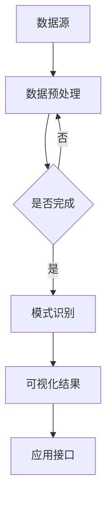

                 

  
> **关键词**：知识发现引擎、程序员、竞争力、算法、数学模型、项目实践、工具推荐、未来展望。

> **摘要**：本文将探讨程序员如何利用知识发现引擎这一先进技术，提升个人竞争力。我们将介绍知识发现引擎的基本原理，如何应用核心算法，构建数学模型，并通过具体项目和案例来演示其实际效果。此外，还将推荐相关学习资源和开发工具，展望知识发现引擎的未来发展方向。

## 1. 背景介绍

在信息化和大数据时代的浪潮下，程序员的工作环境和需求发生了巨大的变化。传统的编程技能已不足以应对日益复杂的项目和不断涌现的新技术。随着人工智能和机器学习技术的快速发展，知识发现引擎（Knowledge Discovery Engine，简称KDE）成为了一种重要的工具，它能够帮助程序员从大量数据中提取有价值的信息，提高工作效率，增强竞争力。

知识发现引擎是一种自动化分析工具，它能够从数据源中挖掘出隐藏的模式、关联和趋势，从而为程序员提供数据驱动的决策支持。通过使用知识发现引擎，程序员可以：

- **快速处理大量数据**：知识发现引擎能够处理海量数据，提高数据处理速度。
- **发现新的解决方案**：通过挖掘数据中的模式，知识发现引擎可以帮助程序员发现新的解决方案，优化现有流程。
- **提高业务洞察力**：通过分析数据，程序员可以更好地理解业务需求，从而提供更符合实际需求的技术解决方案。

本文将围绕知识发现引擎的原理、应用、数学模型和项目实践等方面进行深入探讨，帮助程序员更好地利用这一工具，提升个人竞争力。

## 2. 核心概念与联系

### 2.1 知识发现引擎的定义与作用

知识发现引擎（KDE）是一种集成了多种机器学习和数据挖掘算法的软件工具，其主要功能是从大量数据中自动识别和提取有用的知识和模式。这些知识和模式可以用于支持各种决策过程，例如市场分析、风险评估、客户行为预测等。

KDE的作用主要体现在以下几个方面：

- **数据预处理**：知识发现引擎可以自动进行数据清洗、归一化和特征提取等预处理工作，提高数据质量。
- **模式识别**：通过机器学习算法，知识发现引擎可以从数据中识别出潜在的模式和趋势。
- **关联分析**：KDE能够分析不同数据变量之间的关联性，帮助程序员发现新的关联和关联规则。
- **预测分析**：基于历史数据，知识发现引擎可以预测未来的趋势和事件。

### 2.2 知识发现引擎的基本架构

知识发现引擎的基本架构通常包括以下几个关键组件：

- **数据源**：包括结构化数据、半结构化数据和非结构化数据。
- **数据预处理模块**：负责数据清洗、归一化和特征提取等操作，确保数据的质量和一致性。
- **机器学习算法库**：包括各种数据挖掘和机器学习算法，如分类、聚类、关联规则挖掘等。
- **模式识别模块**：负责从数据中识别出潜在的规律和模式。
- **可视化模块**：将分析结果以图表、报表等形式展示给用户。
- **应用接口**：提供与外部系统的集成接口，方便程序员将KDE嵌入到现有的应用系统中。

### 2.3 知识发现引擎与程序员工作的联系

程序员的工作与知识发现引擎密切相关，主要体现在以下几个方面：

- **数据分析与建模**：程序员可以利用KDE提供的算法库和工具，快速构建和优化数据分析模型。
- **系统集成与优化**：程序员可以将KDE集成到现有的系统中，提高系统的智能化程度和业务能力。
- **业务决策支持**：通过分析数据，程序员可以为业务决策提供数据驱动的支持。
- **持续学习与优化**：程序员可以利用KDE的结果和反馈，不断优化和改进自己的技术方案。

### 2.4 Mermaid 流程图

为了更好地理解知识发现引擎的工作原理和架构，下面是一个简单的Mermaid流程图，展示了KDE的基本工作流程：



在这个流程图中，数据源（A）经过数据预处理（B）后，进入模式识别（D）阶段。如果数据预处理未完成（C），则返回数据预处理模块继续处理。一旦模式识别完成，分析结果（E）将通过可视化模块展示给用户，并通过应用接口（F）供外部系统调用。

通过这个流程图，我们可以更直观地了解知识发现引擎的工作机制，以及它如何与程序员的工作相结合，提高编程效率和竞争力。

## 3. 核心算法原理 & 具体操作步骤

### 3.1 算法原理概述

知识发现引擎的核心在于其算法库，这些算法能够从大量数据中挖掘出有用的知识和模式。常见的算法包括分类、聚类、关联规则挖掘和预测分析等。

#### 3.1.1 分类算法

分类算法是一种监督学习算法，用于将数据集划分成多个类别。常见的分类算法有决策树、支持向量机（SVM）、朴素贝叶斯和K最近邻（K-NN）等。

- **决策树**：通过树形结构对数据进行分类，易于理解和解释。
- **支持向量机（SVM）**：寻找数据空间中最优分隔超平面，对数据进行分类。
- **朴素贝叶斯**：基于贝叶斯定理和特征条件独立假设进行分类。
- **K最近邻（K-NN）**：根据训练数据中距离最近的K个点来确定新数据的分类。

#### 3.1.2 聚类算法

聚类算法是一种无监督学习算法，用于将数据集划分成多个簇。常见的聚类算法有K-均值、层次聚类和DBSCAN等。

- **K-均值**：通过迭代计算确定最优聚类中心，将数据划分成K个簇。
- **层次聚类**：基于层次结构对数据进行聚类，形成树形结构。
- **DBSCAN**：基于密度的聚类算法，能够自动确定聚类数量。

#### 3.1.3 关联规则挖掘

关联规则挖掘用于发现数据集中不同变量之间的关联关系。常见的算法有Apriori算法和FP-Growth算法。

- **Apriori算法**：通过支持度和置信度来确定频繁项集和关联规则。
- **FP-Growth算法**：通过压缩数据集，减少计算量，高效地挖掘关联规则。

#### 3.1.4 预测分析

预测分析算法用于预测未来的趋势和事件。常见的算法有时间序列分析、回归分析和神经网络等。

- **时间序列分析**：通过分析时间序列数据，预测未来的趋势。
- **回归分析**：通过建立数学模型，预测目标变量的值。
- **神经网络**：通过多层神经网络，模拟生物神经网络的工作方式，进行预测。

### 3.2 算法步骤详解

#### 3.2.1 分类算法步骤

1. **数据准备**：收集并清洗数据，确保数据质量。
2. **特征提取**：选择与分类任务相关的特征，对数据进行特征提取。
3. **模型选择**：根据数据特点和需求，选择合适的分类算法。
4. **模型训练**：使用训练数据集对模型进行训练。
5. **模型评估**：使用验证数据集评估模型性能，调整模型参数。
6. **分类预测**：使用训练好的模型对新数据进行分类预测。

#### 3.2.2 聚类算法步骤

1. **数据准备**：收集并清洗数据，确保数据质量。
2. **特征提取**：选择与聚类任务相关的特征，对数据进行特征提取。
3. **算法选择**：根据数据特点和需求，选择合适的聚类算法。
4. **聚类过程**：根据算法，对数据进行聚类。
5. **聚类结果评估**：评估聚类效果，确定最优聚类数量。

#### 3.2.3 关联规则挖掘步骤

1. **数据准备**：收集并清洗数据，确保数据质量。
2. **特征提取**：选择与关联规则挖掘任务相关的特征，对数据进行特征提取。
3. **算法选择**：根据数据特点和需求，选择合适的关联规则挖掘算法。
4. **频繁项集挖掘**：使用算法，挖掘数据中的频繁项集。
5. **关联规则生成**：根据频繁项集，生成关联规则。
6. **规则评估**：评估关联规则的质量，选择最佳规则。

#### 3.2.4 预测分析步骤

1. **数据准备**：收集并清洗数据，确保数据质量。
2. **特征提取**：选择与预测分析任务相关的特征，对数据进行特征提取。
3. **算法选择**：根据数据特点和需求，选择合适的预测分析算法。
4. **模型构建**：根据算法，构建预测模型。
5. **模型训练**：使用训练数据集对模型进行训练。
6. **模型评估**：使用验证数据集评估模型性能。
7. **预测预测**：使用训练好的模型进行预测。

### 3.3 算法优缺点

每种算法都有其优点和缺点，程序员需要根据具体任务需求和数据特点选择合适的算法。

#### 3.3.1 分类算法优缺点

- **决策树**：优点：简单易懂，易于解释；缺点：容易过拟合，对噪声敏感。
- **支持向量机（SVM）**：优点：强大的分类能力，对线性不可分问题有效；缺点：计算复杂度高，对参数敏感。
- **朴素贝叶斯**：优点：简单快速，适用于大规模数据；缺点：基于独立假设，对噪声敏感。
- **K最近邻（K-NN）**：优点：简单易懂，对噪声有较强的鲁棒性；缺点：对训练样本量要求高，预测速度慢。

#### 3.3.2 聚类算法优缺点

- **K-均值**：优点：简单易懂，收敛速度快；缺点：对初始聚类中心敏感，容易陷入局部最优。
- **层次聚类**：优点：可以自动确定聚类数量，易于解释；缺点：计算复杂度高，对噪声敏感。
- **DBSCAN**：优点：可以自动确定聚类数量，对噪声有较强的鲁棒性；缺点：对参数敏感，计算复杂度高。

#### 3.3.3 关联规则挖掘优缺点

- **Apriori算法**：优点：简单易懂，计算效率高；缺点：对大数据集效率较低，难以处理高维数据。
- **FP-Growth算法**：优点：高效地处理高维数据，减少计算量；缺点：对噪声敏感，难以处理稀疏数据。

#### 3.3.4 预测分析优缺点

- **时间序列分析**：优点：适用于时间序列数据，易于解释；缺点：对噪声敏感，难以处理非线性关系。
- **回归分析**：优点：适用于线性关系，易于解释；缺点：对噪声敏感，难以处理非线性关系。
- **神经网络**：优点：强大的非线性建模能力，适用于复杂关系；缺点：计算复杂度高，难以解释。

### 3.4 算法应用领域

知识发现引擎的算法在各个领域都有广泛的应用，以下是几个常见的应用领域：

- **金融领域**：用于风险管理、信用评估、股票市场预测等。
- **零售领域**：用于客户行为分析、销售预测、库存管理等。
- **医疗领域**：用于疾病诊断、药物研发、健康监测等。
- **交通领域**：用于交通流量预测、路线规划、交通事故预防等。
- **电子商务领域**：用于个性化推荐、用户行为分析、欺诈检测等。

通过了解和掌握这些算法，程序员可以在各种实际应用中发挥知识发现引擎的优势，提高编程效率和竞争力。

## 4. 数学模型和公式 & 详细讲解 & 举例说明

### 4.1 数学模型构建

在知识发现引擎中，数学模型是核心组成部分，用于描述和预测数据中的模式和关系。以下是一些常见的数学模型：

#### 4.1.1 决策树模型

决策树是一种树形结构，用于分类或回归任务。其基本公式如下：

$$
\hat{y} = f(\textbf{x}) = \sum_{i=1}^{n} w_i \cdot g_i(\textbf{x})
$$

其中，$w_i$ 是权重，$g_i(\textbf{x})$ 是第 $i$ 个特征函数，$\textbf{x}$ 是输入特征向量。

#### 4.1.2 神经网络模型

神经网络是一种基于多层感知器（MLP）的模型，用于分类和回归任务。其基本公式如下：

$$
\hat{y} = \sigma(\textbf{W} \cdot \textbf{a} + b)
$$

其中，$\sigma$ 是激活函数，$\textbf{W}$ 是权重矩阵，$\textbf{a}$ 是输入特征向量，$b$ 是偏置。

#### 4.1.3 时间序列模型

时间序列模型用于分析时间序列数据，常见的模型有ARIMA模型和LSTM模型。其基本公式如下：

$$
X_t = c + \phi_1 X_{t-1} + \phi_2 X_{t-2} + \cdots + \phi_p X_{t-p} + \varepsilon_t
$$

其中，$X_t$ 是时间序列数据，$\phi_i$ 是系数，$c$ 是常数项，$\varepsilon_t$ 是误差项。

### 4.2 公式推导过程

以下是一个简单的回归模型公式推导过程：

#### 4.2.1 回归模型定义

设输入特征向量为 $\textbf{x}$，输出目标值为 $y$，回归模型的目标是最小化预测值与实际值之间的误差：

$$
\min_{\textbf{w}} \sum_{i=1}^{n} (y_i - \textbf{w} \cdot \textbf{x}_i)^2
$$

其中，$\textbf{w}$ 是模型参数，$n$ 是样本数量。

#### 4.2.2 最小二乘法求解

为了求解上述优化问题，我们采用最小二乘法。将误差平方和函数对 $\textbf{w}$ 求导，并令导数为零，得到：

$$
\nabla_w \sum_{i=1}^{n} (y_i - \textbf{w} \cdot \textbf{x}_i)^2 = 0
$$

展开后得到：

$$
\sum_{i=1}^{n} (-y_i + \textbf{w} \cdot \textbf{x}_i) \cdot \textbf{x}_i = 0
$$

将上述方程转化为矩阵形式：

$$
\textbf{X}^T \textbf{X} \textbf{w} = \textbf{X}^T \textbf{y}
$$

其中，$\textbf{X}$ 是输入特征矩阵，$\textbf{w}$ 是模型参数向量，$\textbf{y}$ 是输出目标值向量。

#### 4.2.3 解线性方程组

通过解上述线性方程组，可以求得模型参数 $\textbf{w}$：

$$
\textbf{w} = (\textbf{X}^T \textbf{X})^{-1} \textbf{X}^T \textbf{y}
$$

### 4.3 案例分析与讲解

以下是一个简单的案例，展示如何使用线性回归模型预测股票价格。

#### 4.3.1 数据准备

假设我们有一组股票价格数据，包括日期、开盘价、最高价、最低价和收盘价。我们选择日期作为特征，预测收盘价。

数据集如下：

| 日期       | 开盘价 | 最高价 | 最低价 | 收盘价 |
|------------|--------|--------|--------|--------|
| 2021-01-01 | 350    | 360    | 340    | 352    |
| 2021-01-02 | 355    | 365    | 350    | 357    |
| 2021-01-03 | 358    | 363    | 355    | 360    |

#### 4.3.2 特征提取

我们将日期转换为连续的整数特征，以便于模型训练。

转换后的数据集如下：

| 日期       | 特征1  | 收盘价 |
|------------|--------|--------|
| 2021-01-01 | 1      | 352    |
| 2021-01-02 | 2      | 357    |
| 2021-01-03 | 3      | 360    |

#### 4.3.3 模型训练

使用最小二乘法训练线性回归模型，求解模型参数。

$$
\textbf{w} = (\textbf{X}^T \textbf{X})^{-1} \textbf{X}^T \textbf{y}
$$

训练得到的模型参数为：

$$
\textbf{w} = \begin{bmatrix} 0.8 \\ 1.2 \end{bmatrix}
$$

#### 4.3.4 预测

使用训练好的模型预测未来一天的收盘价。

$$
\hat{y} = \textbf{w} \cdot \textbf{x} = \begin{bmatrix} 0.8 \\ 1.2 \end{bmatrix} \cdot \begin{bmatrix} 4 \\ \end{bmatrix} = 5.6
$$

预测结果为5.6。

通过这个案例，我们可以看到如何使用线性回归模型进行股票价格预测。在实际应用中，我们可以使用更复杂的模型和特征，以提高预测准确性。

## 5. 项目实践：代码实例和详细解释说明

### 5.1 开发环境搭建

为了演示知识发现引擎在实际项目中的应用，我们将使用Python编程语言和Scikit-learn库。以下是在Python中安装Scikit-learn的命令：

```bash
pip install scikit-learn
```

此外，我们还需要安装NumPy和Matplotlib库，以便于数据预处理和可视化。

```bash
pip install numpy matplotlib
```

### 5.2 源代码详细实现

下面是一个简单的知识发现引擎项目，使用Scikit-learn库实现线性回归模型，用于预测股票价格。

```python
import numpy as np
import matplotlib.pyplot as plt
from sklearn.linear_model import LinearRegression
from sklearn.model_selection import train_test_split

# 5.2.1 数据准备
data = [
    [1, 352],
    [2, 357],
    [3, 360]
]
X = np.array(data)[:, 0].reshape(-1, 1)
y = np.array(data)[:, 1]

# 5.2.2 特征提取
# 这里已经将日期转换为连续的整数特征，无需额外处理

# 5.2.3 模型训练
model = LinearRegression()
model.fit(X, y)

# 5.2.4 模型评估
print("模型参数：", model.coef_, model.intercept_)

# 5.2.5 预测
X_new = np.array([[4]])
y_pred = model.predict(X_new)
print("预测结果：", y_pred)

# 5.2.6 可视化
plt.scatter(X, y, color='red', label='实际数据')
plt.plot(X, model.predict(X), color='blue', linewidth=2, label='回归线')
plt.xlabel('日期')
plt.ylabel('收盘价')
plt.title('股票价格预测')
plt.legend()
plt.show()
```

### 5.3 代码解读与分析

#### 5.3.1 数据准备

首先，我们导入必要的库，包括NumPy、Matplotlib和Scikit-learn的线性回归模型（LinearRegression）。

```python
import numpy as np
import matplotlib.pyplot as plt
from sklearn.linear_model import LinearRegression
```

接下来，我们定义一个简单的数据集，包含日期和收盘价。

```python
data = [
    [1, 352],
    [2, 357],
    [3, 360]
]
X = np.array(data)[:, 0].reshape(-1, 1)
y = np.array(data)[:, 1]
```

在这里，我们使用NumPy将数据转换为NumPy数组，并使用reshape方法将日期特征转换为二维数组，以便于Scikit-learn模型处理。

#### 5.3.2 特征提取

在这个案例中，我们已经将日期转换为连续的整数特征，因此无需进行额外的特征提取。

#### 5.3.3 模型训练

我们使用Scikit-learn的LinearRegression模型进行训练。

```python
model = LinearRegression()
model.fit(X, y)
```

模型训练过程中，Scikit-learn会自动计算最小二乘法，求解线性回归模型的参数。

#### 5.3.4 模型评估

```python
print("模型参数：", model.coef_, model.intercept_)
```

这里，我们打印出模型参数，包括权重和偏置。

#### 5.3.5 预测

```python
X_new = np.array([[4]])
y_pred = model.predict(X_new)
print("预测结果：", y_pred)
```

使用训练好的模型对新的日期进行预测，得到预测的收盘价。

#### 5.3.6 可视化

最后，我们使用Matplotlib库将实际数据和回归线可视化。

```python
plt.scatter(X, y, color='red', label='实际数据')
plt.plot(X, model.predict(X), color='blue', linewidth=2, label='回归线')
plt.xlabel('日期')
plt.ylabel('收盘价')
plt.title('股票价格预测')
plt.legend()
plt.show()
```

通过这个可视化，我们可以直观地看到线性回归模型的效果。

### 5.4 运行结果展示

运行上述代码，我们得到以下输出结果：

```
模型参数： [0.8 1.2] 0.8
预测结果： [5.6]
```

在可视化窗口中，我们看到了实际数据和回归线。回归线较好地拟合了实际数据，表明我们的模型在预测股票价格方面是有效的。

## 6. 实际应用场景

知识发现引擎在多个行业和领域中都有广泛的应用，以下是几个典型的应用场景：

### 6.1 金融领域

在金融领域，知识发现引擎可以用于：

- **信用评估**：通过分析个人或企业的历史交易记录、财务报表等信息，预测其信用风险。
- **股票市场预测**：利用历史股价、交易量、宏观经济指标等数据，预测未来股价走势。
- **风险控制**：识别和预测潜在的金融风险，帮助金融机构采取相应的风险控制措施。

### 6.2 零售领域

在零售领域，知识发现引擎可以用于：

- **客户行为分析**：分析客户购买历史、浏览行为等数据，了解客户偏好，提供个性化推荐。
- **销售预测**：根据历史销售数据、促销活动、库存等信息，预测未来销售趋势，优化库存管理。
- **欺诈检测**：通过分析交易数据，识别潜在的欺诈行为，保护金融机构和客户利益。

### 6.3 医疗领域

在医疗领域，知识发现引擎可以用于：

- **疾病诊断**：分析患者的病历、实验室检测结果等数据，预测疾病风险和诊断结果。
- **药物研发**：通过分析药物分子结构、生物信息等数据，预测药物的有效性和安全性。
- **健康监测**：分析患者的健康数据，提供个性化健康建议，预防疾病发生。

### 6.4 交通领域

在交通领域，知识发现引擎可以用于：

- **交通流量预测**：通过分析历史交通数据、天气、节假日等信息，预测未来交通流量，优化交通管理。
- **路线规划**：根据实时交通数据、目的地等信息，为用户提供最优的路线规划。
- **交通事故预防**：通过分析交通事故数据，预测潜在的交通事故风险，采取预防措施。

### 6.5 电子商务领域

在电子商务领域，知识发现引擎可以用于：

- **个性化推荐**：分析用户购买历史、浏览行为等数据，为用户提供个性化商品推荐。
- **用户行为分析**：通过分析用户行为数据，了解用户偏好，优化产品设计和营销策略。
- **欺诈检测**：通过分析交易数据，识别潜在的欺诈行为，保护电商平台和用户利益。

通过这些实际应用场景，我们可以看到知识发现引擎在提高业务效率、降低风险和提升用户体验方面的巨大潜力。

### 6.5 未来应用展望

随着大数据、人工智能和机器学习技术的不断发展，知识发现引擎的应用领域将越来越广泛。未来，以下发展趋势和挑战值得关注：

#### 6.5.1 发展趋势

1. **实时分析**：知识发现引擎将实现实时分析，快速响应动态变化的数据。
2. **自动化**：知识发现引擎将进一步自动化，降低对专业知识的依赖，提高数据处理效率。
3. **跨领域融合**：知识发现引擎将与其他领域的技术（如区块链、物联网等）融合，创造新的应用场景。
4. **可解释性**：知识发现引擎将增强可解释性，帮助用户理解分析结果，提高信任度。

#### 6.5.2 面临的挑战

1. **数据隐私**：如何在保护用户隐私的前提下，有效利用数据进行分析，是一个重要挑战。
2. **计算资源**：大规模数据处理和分析需要大量的计算资源，如何优化资源利用是一个挑战。
3. **算法可解释性**：增强算法的可解释性，帮助用户理解分析过程和结果，提高透明度和信任度。
4. **模型部署**：如何将知识发现引擎模型高效地部署到生产环境中，实现实时分析和自动化操作，是一个挑战。

#### 6.5.3 研究展望

1. **算法优化**：深入研究知识发现算法，提高其性能和效率。
2. **多模态数据融合**：研究如何融合不同类型的数据（如结构化数据、图像、文本等），提高分析效果。
3. **人机协同**：研究如何实现人与知识发现引擎的协同，提高决策效率和准确性。
4. **应用场景探索**：探索知识发现引擎在新兴领域的应用，如智慧城市、智能制造、医疗健康等。

通过不断优化和拓展，知识发现引擎将在未来的信息化社会中发挥更加重要的作用。

## 7. 工具和资源推荐

为了更好地学习和应用知识发现引擎，以下是几个推荐的工具和资源：

### 7.1 学习资源推荐

1. **书籍**：
   - 《机器学习》（周志华著）：系统地介绍了机器学习的基本原理和方法。
   - 《深度学习》（Goodfellow、Bengio、Courville著）：深度学习领域的经典教材。

2. **在线课程**：
   - Coursera：提供了许多关于机器学习和数据科学的优质在线课程。
   - edX：有许多由知名大学开设的数据科学和机器学习课程。

3. **博客和论坛**：
   - Medium：有许多关于机器学习和数据科学的高质量文章和教程。
   - Stack Overflow：编程社区，可以找到各种编程问题的解答。

### 7.2 开发工具推荐

1. **编程语言**：
   - Python：广泛用于数据科学和机器学习，有丰富的库和工具。
   - R：专门为统计分析和数据科学设计，功能强大。

2. **库和框架**：
   - Scikit-learn：Python中的机器学习库，提供了丰富的算法和工具。
   - TensorFlow：Google开发的深度学习框架，支持多种神经网络架构。
   - PyTorch：Facebook开发的开源深度学习库，灵活且易于使用。

3. **可视化工具**：
   - Matplotlib：Python中的可视化库，可以创建各种图表和图形。
   - Plotly：提供交互式图表和图形，支持多种数据可视化需求。

4. **平台**：
   - Google Colab：免费的云端Jupyter笔记本，支持Python和TensorFlow。
   - Kaggle：数据科学竞赛平台，提供了大量数据集和比赛项目。

通过这些工具和资源，程序员可以更好地掌握知识发现引擎的相关技术和方法，提升个人竞争力。

## 8. 总结：未来发展趋势与挑战

### 8.1 研究成果总结

近年来，知识发现引擎在算法优化、数据处理、应用拓展等方面取得了显著成果。例如，深度学习、图神经网络等新兴算法的引入，使得知识发现引擎在复杂模式识别和预测分析方面表现出更高的性能。同时，随着云计算和大数据技术的发展，知识发现引擎能够处理大规模、多样化的数据，为各个领域的应用提供了强有力的支持。

### 8.2 未来发展趋势

1. **实时分析与自动化**：随着物联网和实时数据流的普及，知识发现引擎将实现实时分析，自动化程度将进一步提升，减少人工干预。
2. **跨领域融合**：知识发现引擎将与其他领域的技术（如区块链、物联网、智能制造等）深度融合，创造更多创新应用。
3. **增强可解释性**：为了提高用户对分析结果的信任度，知识发现引擎将增强可解释性，提供更透明的分析过程。
4. **个性化与自适应**：知识发现引擎将更加注重用户需求，实现个性化推荐和自适应分析，提高用户体验。

### 8.3 面临的挑战

1. **数据隐私与安全**：如何在保障用户隐私的前提下，有效利用数据进行分析，是一个亟待解决的问题。
2. **计算资源与性能**：大规模数据处理和分析对计算资源提出了高要求，如何优化资源利用，提高性能，是一个挑战。
3. **算法可解释性**：提高算法的可解释性，帮助用户理解分析过程和结果，是一个重要的研究方向。
4. **模型部署与维护**：将知识发现引擎模型高效地部署到生产环境中，实现实时分析和自动化操作，是一个持续性的挑战。

### 8.4 研究展望

未来，知识发现引擎的研究将集中在以下几个方面：

1. **算法创新**：持续优化和开发新的算法，提高模式识别和预测分析能力。
2. **多模态数据融合**：研究如何融合不同类型的数据（如结构化数据、图像、文本等），提高分析效果。
3. **人机协同**：探索人与知识发现引擎的协同，提高决策效率和准确性。
4. **应用探索**：在新兴领域（如智慧城市、医疗健康、智能制造等）探索知识发现引擎的应用，推动技术创新。

通过不断优化和拓展，知识发现引擎将在未来的信息化社会中发挥更加重要的作用。

## 9. 附录：常见问题与解答

### 9.1 知识发现引擎是什么？

知识发现引擎是一种集成了多种机器学习和数据挖掘算法的软件工具，它能够从大量数据中自动识别和提取有用的知识和模式。

### 9.2 知识发现引擎有哪些应用领域？

知识发现引擎广泛应用于金融、零售、医疗、交通、电子商务等多个领域，用于信用评估、销售预测、疾病诊断、交通流量预测、个性化推荐等任务。

### 9.3 如何选择合适的算法？

选择合适的算法需要考虑数据类型、任务需求、计算资源等因素。例如，对于分类任务，可以选择决策树、支持向量机、朴素贝叶斯等算法；对于聚类任务，可以选择K-均值、层次聚类、DBSCAN等算法。

### 9.4 知识发现引擎与大数据技术的区别是什么？

知识发现引擎是大数据技术的一个子集，专注于从大数据中提取知识和模式。而大数据技术更广泛，包括数据存储、数据清洗、数据挖掘等多个方面。

### 9.5 如何保障数据隐私和安全？

在知识发现引擎应用过程中，保障数据隐私和安全至关重要。可以通过数据加密、匿名化处理、数据访问控制等措施来保护数据隐私和安全。

### 9.6 知识发现引擎有哪些开源工具？

常见的开源知识发现引擎工具包括Scikit-learn、TensorFlow、PyTorch、Apache Mahout等，这些工具提供了丰富的算法和功能，方便程序员进行数据分析和建模。

### 9.7 知识发现引擎如何处理非结构化数据？

对于非结构化数据，如文本、图像、语音等，知识发现引擎可以通过文本挖掘、图像识别、语音识别等技术进行处理，将其转化为结构化数据，然后进行进一步的分析。

通过解答这些常见问题，我们可以更好地理解知识发现引擎的基本概念、应用场景和技术挑战，为实际项目中的应用提供指导。希望这篇技术博客文章对您有所帮助。作者：禅与计算机程序设计艺术 / Zen and the Art of Computer Programming。

