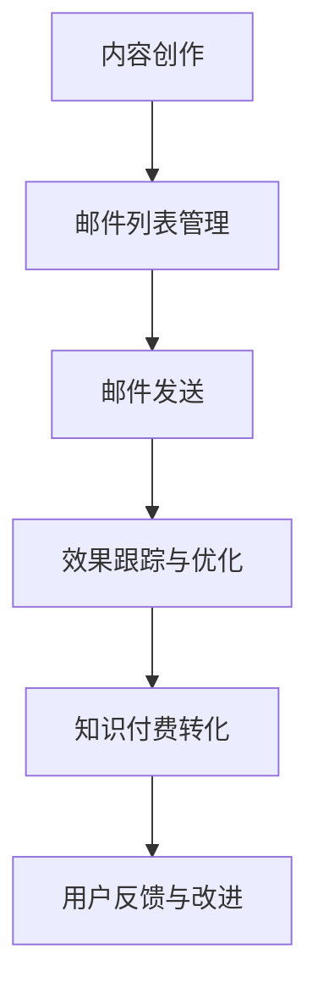

                 

在当今的信息化时代，邮件营销作为最传统的数字营销手段之一，仍然具有重要的战略地位。对于程序员而言，通过邮件营销推广知识付费项目不仅能够扩大影响力，还能够实现收入的增长。本文将深入探讨程序员如何利用邮件营销来推广知识付费，包括策略、工具和实际操作步骤。

## 文章关键词

- 邮件营销
- 知识付费
- 程序员
- 数字营销
- 内容推广
- 收入增长

## 文章摘要

本文将帮助程序员了解如何通过邮件营销来推广知识付费。我们将探讨邮件营销的基本策略，介绍适合程序员使用的邮件营销工具，并提供详细的操作步骤，从内容创作到邮件发送，再到效果跟踪和优化。通过本文，程序员可以掌握一套完整的邮件营销推广知识付费的实战方法。

## 1. 背景介绍

### 1.1 邮件营销的兴起与发展

邮件营销起源于20世纪90年代，随着互联网的普及而迅速发展。它通过发送电子邮件向用户传递信息，具有成本低、覆盖面广、灵活性强等优点。在数字营销手段层出不穷的今天，邮件营销依然以其独特的方式吸引着众多企业和个人。

### 1.2 知识付费的市场趋势

随着知识经济的兴起，知识付费已成为一种重要的商业模式。程序员作为知识工作者，通过提供专业知识和技能获得收益已成为一种趋势。知识付费的市场规模不断扩大，为程序员提供了丰富的机会。

### 1.3 程序员与邮件营销的结合

程序员具备技术背景，擅长解决问题，而邮件营销则是一种有效的信息传递工具。将二者结合，程序员可以通过邮件营销更好地推广自己的知识付费项目，实现个人品牌和收入的提升。

## 2. 核心概念与联系

### 2.1 邮件营销的概念

邮件营销是指通过电子邮件的方式，向用户传递有价值的信息，以达到营销目的的一种手段。它包括邮件内容策划、邮件列表管理、邮件发送和效果跟踪等环节。

### 2.2 知识付费的核心

知识付费是基于用户对知识的购买和付费行为，通过提供专业知识和技能，实现价值交换的过程。它包括内容创作、产品定价、用户反馈等环节。

### 2.3 邮件营销与知识付费的关联

邮件营销可以有效地推广知识付费项目，将潜在用户转化为付费用户。通过邮件营销，程序员可以建立与用户的联系，传递有价值的内容，引导用户进行购买。

## 2.4 Mermaid 流程图



## 3. 核心算法原理 & 具体操作步骤

### 3.1 算法原理概述

邮件营销的核心在于吸引潜在用户，并通过持续的价值传递，建立信任关系，最终实现知识付费转化。这一过程可以看作是一个算法，涉及用户行为分析、内容创作、邮件发送和效果跟踪等多个方面。

### 3.2 算法步骤详解

#### 3.2.1 用户行为分析

首先，程序员需要通过网站分析工具（如Google Analytics）收集用户行为数据，包括访问时间、页面停留时间、访问路径等。这些数据有助于了解用户兴趣和行为模式。

#### 3.2.2 内容创作

基于用户行为分析结果，程序员需要创作有价值的内容，包括技术文章、教程、案例研究等。内容要具备实用性和专业性，能够解决用户问题。

#### 3.2.3 邮件列表管理

程序员需要建立邮件列表，通过在线表单、社交媒体、活动报名等方式收集用户邮箱。邮件列表管理包括用户分群、邮件发送频率控制等。

#### 3.2.4 邮件发送

在邮件发送环节，程序员需要设计吸引人的邮件模板，包括标题、正文和附件等。邮件内容要简洁明了，突出价值，引导用户点击链接或进行购买。

#### 3.2.5 效果跟踪与优化

通过邮件发送后，程序员需要跟踪邮件的打开率、点击率、转化率等关键指标。根据数据反馈，对邮件内容、发送时间和频率进行优化。

### 3.3 算法优缺点

#### 优点

- 成本低：邮件营销相较于其他数字营销手段，成本较低，适合中小型程序员。
- 覆盖面广：邮件可以触及全球用户，不受地域限制。
- 灵活性强：邮件内容可以根据用户需求进行定制。

#### 缺点

- 用户体验问题：邮件营销容易引起用户反感，影响用户体验。
- 需要持续投入：邮件营销需要持续的内容创作和数据分析，需要投入时间和精力。

### 3.4 算法应用领域

邮件营销可以广泛应用于程序员的各个领域，包括技术分享、在线课程、技术咨询服务等。通过邮件营销，程序员可以更好地推广自己的知识付费项目，提高知名度和收入。

## 4. 数学模型和公式 & 详细讲解 & 举例说明

### 4.1 数学模型构建

邮件营销的数学模型可以基于用户行为数据，通过回归分析等方法，预测用户购买概率。假设用户行为数据为\( X \)，购买概率为\( P \)，则可以使用以下公式进行预测：

$$
P = f(X)
$$

其中，\( f \) 为预测函数，可以通过机器学习算法训练得到。

### 4.2 公式推导过程

假设用户行为数据包括访问次数、页面停留时间、点击次数等，每个特征对购买概率的影响不同。可以使用多元线性回归模型进行推导：

$$
P = \beta_0 + \beta_1X_1 + \beta_2X_2 + ... + \beta_nX_n
$$

其中，\( \beta_0 \) 为截距，\( \beta_1, \beta_2, ..., \beta_n \) 为各个特征的权重。

### 4.3 案例分析与讲解

假设某程序员通过邮件营销推广一门编程课程，收集了以下用户行为数据：

- 访问次数：100次
- 页面停留时间：平均5分钟
- 点击次数：30次

使用多元线性回归模型预测购买概率，得到以下结果：

$$
P = 0.5 + 0.1X_1 + 0.05X_2
$$

代入数据，购买概率为：

$$
P = 0.5 + 0.1 \times 100 + 0.05 \times 5 = 0.65
$$

这意味着该用户购买编程课程的概率为65%。

## 5. 项目实践：代码实例和详细解释说明

### 5.1 开发环境搭建

程序员需要搭建邮件营销的开发环境，包括邮件服务提供商（如SendGrid、Mailgun）、邮件列表管理工具（如Mailchimp、ConvertKit）和数据分析工具（如Google Analytics）。

### 5.2 源代码详细实现

以下是一个简单的Python示例，演示如何使用SendGrid发送邮件：

```python
import sendgrid
from sendgrid.helpers.mail import Mail

sg = sendgrid.SendGridAPIClient(api_key='your_api_key')

from_email = 'your_email@example.com'
to_email = 'user_email@example.com'
subject = '邀请您加入我们的编程课程'
content = '欢迎加入我们的编程课程，让我们一起学习吧！'

mail = Mail(from_email, to_email, subject, content)
response = sg.client.mail.send.post(request_body=mail.get())

print(response.status_code)
print(response.body)
print(response.headers)
```

### 5.3 代码解读与分析

上述代码使用SendGrid API发送一封邀请用户加入编程课程的邮件。程序首先导入必要的库和模块，然后配置邮件服务提供商的API密钥。接着定义邮件的发送者、接收者、主题和内容，最后调用SendGrid API发送邮件。

### 5.4 运行结果展示

运行上述代码后，会在控制台输出邮件发送的结果，包括状态码、响应体和响应头。如果邮件发送成功，状态码为200。

## 6. 实际应用场景

### 6.1 技术分享与培训

程序员可以通过邮件营销分享技术心得和经验，举办在线培训课程，吸引学员报名。

### 6.2 技术咨询服务

程序员可以通过邮件营销提供技术咨询和解决方案，吸引潜在客户。

### 6.3 技术社区运营

程序员可以通过邮件营销运营技术社区，吸引开发者参与，提高社区活跃度。

## 6.4 未来应用展望

随着人工智能和大数据技术的发展，邮件营销将变得更加智能化和个性化。程序员可以利用这些技术，实现更精准的邮件营销，提高转化率。

## 7. 工具和资源推荐

### 7.1 学习资源推荐

- 《邮件营销实战》
- 《Python 邮件编程》
- 《数据分析实战》

### 7.2 开发工具推荐

- SendGrid
- Mailchimp
- ConvertKit

### 7.3 相关论文推荐

- "Email Marketing in the Digital Age"
- "Data-Driven Email Marketing: Strategies and Techniques"
- "The Impact of Personalization on Email Marketing Performance"

## 8. 总结：未来发展趋势与挑战

### 8.1 研究成果总结

本文总结了程序员如何利用邮件营销推广知识付费的核心方法，包括用户行为分析、内容创作、邮件发送和效果跟踪等。

### 8.2 未来发展趋势

随着人工智能和大数据技术的发展，邮件营销将更加智能化和个性化。

### 8.3 面临的挑战

邮件营销需要持续的内容创作和数据分析，程序员需要投入时间和精力。

### 8.4 研究展望

未来，程序员可以利用人工智能技术，实现更精准的邮件营销，提高转化率。

## 9. 附录：常见问题与解答

### 9.1 邮件营销是否过时？

邮件营销并未过时，反而随着技术的发展，其效果和影响力正在不断提升。

### 9.2 如何避免邮件营销引起的用户反感？

通过用户行为分析和个性化内容，避免大规模群发邮件，提高邮件质量和用户体验。

### 9.3 邮件营销的数据分析如何进行？

可以通过网站分析工具、邮件服务提供商的数据分析功能，以及自定义数据分析脚本，进行邮件营销的数据分析。

---

作者：禅与计算机程序设计艺术 / Zen and the Art of Computer Programming

[END]

