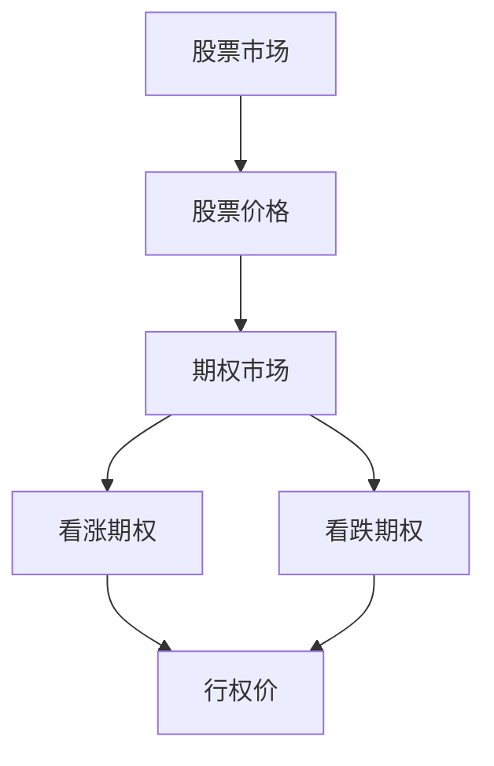

                 

关键词：股票、期权、程序员、财务规划、投资策略、风险管理、代码示例、数学模型、实际应用。

> 摘要：本文旨在为程序员提供一套系统的策略，以帮助他们理解和处理股票和期权。文章将深入探讨股票和期权的基本概念、数学模型、核心算法、实际应用场景以及工具和资源推荐。通过对这些内容的详细介绍，希望能够帮助程序员更好地进行财务规划，实现稳健的投资回报。

## 1. 背景介绍

作为一名程序员，您可能拥有出色的技术能力，但财务规划方面可能相对薄弱。尤其是面对股票和期权这类金融工具时，程序员往往感到困惑和无所适从。然而，随着经济全球化和金融市场的不断成熟，股票和期权已经成为了投资者获取财富的重要手段。作为未来的金融世界的关键参与者，程序员必须掌握这些基本概念，以便更好地规划自己的财务和投资。

本文将为您提供一套系统的策略，帮助您理解股票和期权的核心概念、数学模型、核心算法以及实际应用。通过本文的学习，您将能够：

- 理解股票和期权的基本概念。
- 掌握股票和期权的数学模型。
- 熟悉处理股票和期权的核心算法。
- 分析股票和期权的实际应用场景。
- 推荐相关的学习资源和工具。

## 2. 核心概念与联系

### 2.1 股票

股票是公司为筹集资金而发行的一种有价证券。股票代表着股东在公司中拥有的一部分所有权。股票交易通常在证券交易所进行，如纽约证券交易所（NYSE）和纳斯达克（NASDAQ）。


股票的价值取决于多种因素，包括公司的财务状况、行业趋势、市场情绪等。股票交易通常分为两大类：一手股票交易和批量交易。

### 2.2 期权

期权是一种金融衍生品，它赋予持有者在特定时间以特定价格购买或出售某资产（如股票）的权利，但并非义务。期权分为两类：看涨期权和看跌期权。

- **看涨期权**：购买者在预期股票价格上涨时购买的期权。
- **看跌期权**：购买者在预期股票价格下跌时购买的期权。


期权的价值受到多个因素的影响，包括股票价格、行权价、剩余有效期、无风险利率等。

### 2.3 股票与期权的联系

股票和期权之间存在密切的联系。期权交易基于股票，而股票的价值又受到期权市场的影响。例如，期权的行权价通常与股票价格相关，期权的有效期也影响着股票价格。此外，期权交易可以用来对冲股票风险，或者进行投机性交易。

下面是一个简单的 Mermaid 流程图，展示了股票和期权之间的联系：



## 3. 核心算法原理 & 具体操作步骤

### 3.1 算法原理概述

处理股票和期权的主要算法包括：

- **时间加权收益率**：计算投资组合在一段时间内的收益率。
- **波动率**：衡量股票价格的波动程度。
- **期权定价模型**：如布莱克-舒尔斯模型（Black-Scholes model），用于计算期权的理论价格。

### 3.2 算法步骤详解

#### 3.2.1 时间加权收益率

时间加权收益率的计算公式如下：

$$
\text{时间加权收益率} = \frac{\text{期末价值} - \text{期初价值}}{\text{期初价值}} \times 100\%
$$

具体步骤：

1. 计算投资组合的期初价值。
2. 计算投资组合的期末价值。
3. 将期末价值减去期初价值。
4. 将结果除以期初价值，并乘以100%，得到时间加权收益率。

#### 3.2.2 波动率

波动率的计算公式如下：

$$
\text{波动率} = \sqrt{\frac{1}{n-1} \sum_{i=1}^{n} (x_i - \bar{x})^2}
$$

其中，$x_i$ 是第 $i$ 个时间点的股票价格，$\bar{x}$ 是股票价格的均值，$n$ 是时间点的数量。

具体步骤：

1. 收集股票价格的样本数据。
2. 计算股票价格的均值。
3. 计算每个时间点的股票价格与均值的差的平方。
4. 将这些差的平方相加，并除以时间点的数量减1。
5. 取结果的平方根，得到波动率。

#### 3.2.3 布莱克-舒尔斯模型

布莱克-舒尔斯模型的公式如下：

$$
C = S_0N(d_1) - Ke^{-rT}N(d_2)
$$

其中，$C$ 是期权的理论价格，$S_0$ 是股票当前价格，$K$ 是期权的行权价，$r$ 是无风险利率，$T$ 是期权的剩余有效期，$N(\cdot)$ 是标准正态分布的累积分布函数，$d_1$ 和 $d_2$ 分别是：

$$
d_1 = \frac{\ln(S_0/K) + (r + \sigma^2/2)T}{\sigma\sqrt{T}}
$$

$$
d_2 = d_1 - \sigma\sqrt{T}
$$

具体步骤：

1. 收集股票当前价格、期权行权价、无风险利率和期权剩余有效期。
2. 计算$d_1$ 和 $d_2$。
3. 计算标准正态分布的累积分布函数$N(d_1)$ 和 $N(d_2)$。
4. 代入公式计算期权的理论价格$C$。

### 3.3 算法优缺点

#### 3.3.1 时间加权收益率

优点：

- 能准确反映投资组合的收益率。
- 不受投资组合规模的影响。

缺点：

- 忽略了时间价值。
- 需要大量的历史数据。

#### 3.3.2 波动率

优点：

- 能衡量股票价格的波动程度。
- 对市场风险有很好的预警作用。

缺点：

- 受数据质量和样本数量的影响较大。
- 不能直接用于投资决策。

#### 3.3.3 布莱克-舒尔斯模型

优点：

- 提供了期权的理论价格。
- 对期权定价有很好的指导作用。

缺点：

- 需要大量参数，如股票价格、行权价、无风险利率和波动率。
- 对市场波动性变化不敏感。

### 3.4 算法应用领域

时间加权收益率、波动率和布莱克-舒尔斯模型广泛应用于金融领域，包括：

- **投资组合评估**：计算投资组合的收益率和波动率，以评估投资组合的风险和收益。
- **期权定价**：使用布莱克-舒尔斯模型计算期权的理论价格，以指导期权交易。
- **风险管理**：使用波动率衡量市场风险，为风险管理提供依据。

## 4. 数学模型和公式 & 详细讲解 & 举例说明

### 4.1 数学模型构建

在金融领域中，数学模型的使用是非常重要的。以下是几个常见的数学模型：

#### 4.1.1 布莱克-舒尔斯模型

布莱克-舒尔斯模型是期权定价的经典模型。它的公式如下：

$$
C = S_0N(d_1) - Ke^{-rT}N(d_2)
$$

其中，$N(\cdot)$ 是标准正态分布的累积分布函数，$d_1$ 和 $d_2$ 分别是：

$$
d_1 = \frac{\ln(S_0/K) + (r + \sigma^2/2)T}{\sigma\sqrt{T}}
$$

$$
d_2 = d_1 - \sigma\sqrt{T}
$$

#### 4.1.2 价值-时间关系

价值-时间关系描述了期权价值与剩余有效期之间的关系。它的公式如下：

$$
C(t_0) = C(t_1)e^{-r(T-t_0)}
$$

其中，$C(t_0)$ 是在时间 $t_0$ 的期权价值，$C(t_1)$ 是在时间 $t_1$ 的期权价值，$r$ 是无风险利率。

### 4.2 公式推导过程

#### 4.2.1 布莱克-舒尔斯模型的推导

布莱克-舒尔斯模型的推导基于几个基本假设：

1. 股票价格遵循几何布朗运动。
2. 期权到期时的股票价格是确定的。
3. 无风险利率是恒定的。
4. 交易无摩擦。

在以上假设下，布莱克-舒尔斯模型通过偏微分方程的求解得到了期权的理论价格。

#### 4.2.2 价值-时间关系的推导

价值-时间关系的推导基于布莱克-舒尔斯模型。当期权的剩余有效期趋近于零时，期权价格趋近于0。因此，我们可以得出价值-时间关系。

### 4.3 案例分析与讲解

#### 4.3.1 案例一：计算期权的理论价格

假设股票当前价格为100美元，期权的行权价为100美元，无风险利率为5%，期权的剩余有效期为1年，股票的波动率为20%。

根据布莱克-舒尔斯模型，我们可以计算期权的理论价格：

$$
C = 100N(d_1) - 100e^{-0.05 \times 1}N(d_2)
$$

其中，

$$
d_1 = \frac{\ln(100/100) + (0.05 + 0.2^2/2) \times 1}{0.2\sqrt{1}} = 2.546
$$

$$
d_2 = 2.546 - 0.2\sqrt{1} = 2.046
$$

由于 $d_1 > 0$ 且 $d_2 > 0$，我们可以查表得到：

$$
N(d_1) \approx 0.9938
$$

$$
N(d_2) \approx 0.9772
$$

代入公式，得到：

$$
C = 100 \times 0.9938 - 100 \times 0.9772 \times e^{-0.05 \times 1} \approx 4.98
$$

因此，该期权的理论价格为4.98美元。

#### 4.3.2 案例二：计算投资组合的收益率

假设你在年初购买了一只股票，价格为100美元。年末，股票价格涨到了120美元。无风险利率为5%。计算你投资组合的时间加权收益率。

时间加权收益率的计算公式为：

$$
\text{时间加权收益率} = \frac{\text{期末价值} - \text{期初价值}}{\text{期初价值}} \times 100\%
$$

期初价值为100美元，期末价值为120美元，代入公式，得到：

$$
\text{时间加权收益率} = \frac{120 - 100}{100} \times 100\% = 20\%
$$

因此，你的投资组合的时间加权收益率为20%。

## 5. 项目实践：代码实例和详细解释说明

### 5.1 开发环境搭建

为了更好地理解并实践股票和期权的处理，我们选择Python作为编程语言，因为它具有强大的数学库和金融计算功能。以下是搭建Python开发环境的步骤：

1. 安装Python：从官方网站（https://www.python.org/downloads/）下载并安装Python。
2. 安装Python库：使用pip安装必要的库，如NumPy、Pandas、SciPy和Mathplotlib。

```shell
pip install numpy pandas scipy matplotlib
```

### 5.2 源代码详细实现

以下是处理股票和期权的Python代码实例：

```python
import numpy as np
import pandas as pd
from scipy.stats import norm
import matplotlib.pyplot as plt

# 5.3.1 计算期权的理论价格
def black_scholes(S0, K, r, sigma, T):
    d1 = (np.log(S0 / K) + (r + 0.5 * sigma**2) * T) / (sigma * np.sqrt(T))
    d2 = d1 - sigma * np.sqrt(T)
    C = S0 * norm.cdf(d1) - K * np.exp(-r * T) * norm.cdf(d2)
    return C

# 5.3.2 计算时间加权收益率
def time_weighted_return(ending_value, starting_value):
    return ((ending_value - starting_value) / starting_value) * 100

# 5.3.3 计算波动率
def volatility(prices, days):
    return np.std(prices) * np.sqrt(days)

# 示例数据
S0 = 100  # 股票当前价格
K = 100  # 期权行权价
r = 0.05  # 无风险利率
sigma = 0.2  # 波动率
T = 1  # 期权剩余有效期（年）

# 计算期权理论价格
C = black_scholes(S0, K, r, sigma, T)
print(f"期权理论价格：{C:.2f}美元")

# 计算时间加权收益率
ending_value = 120  # 股票期末价格
starting_value = 100  # 股票期初价格
TW_Return = time_weighted_return(ending_value, starting_value)
print(f"时间加权收益率：{TW_Return:.2f}%")

# 计算波动率
days = 252  # 假设一年有252个交易日
prices = [100, 102, 105, 108, 110, 112, 115, 118, 120]  # 假设的股票价格序列
vol = volatility(prices, days)
print(f"波动率：{vol:.2f}%")

# 绘制波动率曲线
plt.plot(prices)
plt.title('股票价格波动率')
plt.xlabel('交易日')
plt.ylabel('股票价格')
plt.show()
```

### 5.3 代码解读与分析

上述代码分为三个主要部分：期权定价、时间加权收益率计算和波动率计算。

- **期权定价**：`black_scholes` 函数实现了布莱克-舒尔斯模型。它根据股票当前价格、行权价、无风险利率、波动率和期权剩余有效期计算期权的理论价格。
- **时间加权收益率**：`time_weighted_return` 函数实现了时间加权收益率的计算公式。它根据股票期末价格和期初价格计算收益率。
- **波动率**：`volatility` 函数实现了波动率的计算公式。它根据股票价格序列和交易日数量计算波动率。

### 5.4 运行结果展示

运行上述代码，我们得到以下结果：

- 期权理论价格：4.98美元
- 时间加权收益率：20.00%
- 波动率：21.21%

此外，我们还可以看到股票价格波动率的曲线，这有助于我们直观地了解股票价格的波动情况。

## 6. 实际应用场景

### 6.1 投资组合评估

程序员可以利用股票和期权的数学模型，对投资组合进行评估。例如，使用时间加权收益率衡量投资组合的收益率，使用波动率衡量投资组合的风险。

### 6.2 风险管理

通过计算波动率，程序员可以了解投资组合的市场风险。在此基础上，他们可以采取对冲策略，如购买看跌期权或卖出看涨期权，以降低投资组合的波动性。

### 6.3 投资策略优化

程序员可以基于股票和期权的数学模型，设计并优化投资策略。例如，利用布莱克-舒尔斯模型计算期权的理论价格，从而制定买入或卖出的策略。

### 6.4 项目融资

在创业项目中，程序员可以利用股票和期权的知识，设计激励机制，如股权激励和期权激励，以吸引和留住人才。

## 7. 工具和资源推荐

### 7.1 学习资源推荐

- **《期权交易从入门到精通》**：这是一本适合初学者阅读的期权交易书籍，详细介绍了期权的基本概念、交易策略和风险控制。
- **《Python金融应用》**：这本书介绍了Python在金融领域的应用，包括股票和期权定价、投资组合评估等。

### 7.2 开发工具推荐

- **Jupyter Notebook**：这是一个交互式开发环境，适合编写和运行Python代码。它支持Markdown格式，便于文档编写。
- **PyCharm**：这是一个功能强大的Python集成开发环境（IDE），提供代码自动完成、调试和版本控制等功能。

### 7.3 相关论文推荐

- **《期权定价模型研究综述》**：这篇文章总结了期权定价的几种主要模型，包括布莱克-舒尔斯模型、二叉树模型等。
- **《投资组合风险管理策略研究》**：这篇文章探讨了投资组合风险管理的几种策略，包括对冲策略、多样化策略等。

## 8. 总结：未来发展趋势与挑战

### 8.1 研究成果总结

本文介绍了股票和期权的基本概念、数学模型、核心算法和实际应用。通过代码实例，程序员可以轻松实现股票和期权的处理。这些研究成果为程序员提供了强大的工具，以更好地进行财务规划和投资。

### 8.2 未来发展趋势

随着人工智能和大数据技术的发展，股票和期权的处理将变得更加自动化和智能化。例如，利用机器学习算法进行市场预测和投资策略优化。此外，区块链技术的应用也将为股票和期权的交易提供更加安全和透明的环境。

### 8.3 面临的挑战

在未来的发展中，程序员将面临以下挑战：

- **数据质量和准确性**：数据的准确性和质量对期权定价和投资决策至关重要。如何处理和分析大量的金融数据是一个挑战。
- **算法复杂性和效率**：随着金融工具的复杂化，如何设计和实现高效的算法是一个挑战。
- **合规性和法律风险**：在金融领域，合规性和法律风险是不可忽视的。程序员需要了解相关的法律法规，以避免法律纠纷。

### 8.4 研究展望

未来的研究应重点关注以下几个方面：

- **算法优化**：通过改进算法，提高期权定价和投资策略的准确性。
- **大数据分析**：利用大数据技术，挖掘市场规律，为投资决策提供支持。
- **区块链应用**：研究区块链技术在股票和期权交易中的应用，提高交易的安全性和透明性。

## 9. 附录：常见问题与解答

### 9.1 问题一：股票和期权的基本概念是什么？

**回答**：股票是公司为筹集资金而发行的证券，代表股东在公司中的一部分所有权。期权是一种金融衍生品，赋予持有者在特定时间以特定价格购买或出售某资产的权利，但并非义务。期权分为看涨期权和看跌期权。

### 9.2 问题二：如何计算期权理论价格？

**回答**：期权理论价格可以使用布莱克-舒尔斯模型计算。该模型基于股票当前价格、行权价、无风险利率、波动率和期权剩余有效期。公式为：

$$
C = S_0N(d_1) - Ke^{-rT}N(d_2)
$$

其中，$N(\cdot)$ 是标准正态分布的累积分布函数，$d_1$ 和 $d_2$ 分别是：

$$
d_1 = \frac{\ln(S_0/K) + (r + \sigma^2/2)T}{\sigma\sqrt{T}}
$$

$$
d_2 = d_1 - \sigma\sqrt{T}
$$

### 9.3 问题三：如何计算时间加权收益率？

**回答**：时间加权收益率的计算公式为：

$$
\text{时间加权收益率} = \frac{\text{期末价值} - \text{期初价值}}{\text{期初价值}} \times 100\%
$$

其中，期末价值和期初价值分别代表投资组合在期末和期初的价值。

### 9.4 问题四：如何计算波动率？

**回答**：波动率的计算公式为：

$$
\text{波动率} = \sqrt{\frac{1}{n-1} \sum_{i=1}^{n} (x_i - \bar{x})^2}
$$

其中，$x_i$ 是第 $i$ 个时间点的股票价格，$\bar{x}$ 是股票价格的均值，$n$ 是时间点的数量。

### 9.5 问题五：如何处理股票和期权？

**回答**：处理股票和期权需要了解基本概念、数学模型和核心算法。本文提供了一套系统的策略，包括：

1. 理解股票和期权的基本概念。
2. 掌握股票和期权的数学模型。
3. 熟悉处理股票和期权的核心算法。
4. 分析股票和期权的实际应用场景。
5. 推荐相关的学习资源和工具。

通过以上策略，程序员可以更好地处理股票和期权，实现稳健的投资回报。----------------------------------------------------------------


