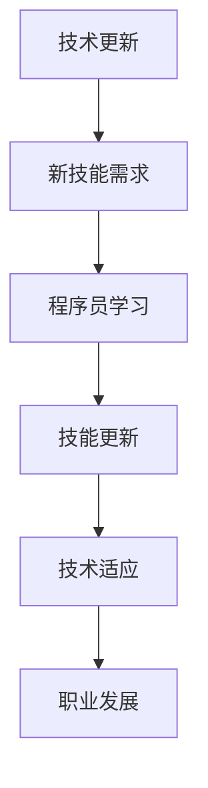

                 

 作为程序员，面对技术的快速更新是一个不可回避的现实。新技术层出不穷，旧技术逐渐淘汰，如何在这样的环境中保持竞争力，持续提升个人能力，成为了每个程序员都必须认真思考的问题。本文将探讨程序员应对技术更新的策略，帮助程序员们在这个快速变化的世界中找到自己的定位。

## 文章关键词

- 技术更新
- 程序员
- 技术学习
- 技术栈
- 职业发展

## 文章摘要

本文旨在为程序员提供一套系统的策略，以应对技术更新带来的挑战。通过分析技术更新的趋势、探讨有效的学习方法、介绍构建和维护技术栈的技巧，以及分析职业发展的路径，帮助程序员在技术不断演进的环境中保持竞争力。

## 1. 背景介绍

### 技术更新的速度

在过去的几十年里，技术的更新速度前所未有地加快。互联网、移动通信、云计算、人工智能、区块链等技术的迅速崛起，不仅改变了世界的面貌，也对程序员的能力提出了更高的要求。一个明显的事实是，某些曾经热门的技术，比如Java Script和Python，在近几年已经取代了诸如Perl和PHP等语言。这种快速的变化使得程序员必须不断地学习新知识，以适应不断变化的技术环境。

### 程序员面临的挑战

技术更新的速度给程序员带来了以下几个挑战：

- **知识更新速度：** 新技术的出现意味着程序员需要不断学习，否则就会落后。
- **技能匹配：** 技术更新可能导致一些旧技能变得无用，程序员需要不断调整自己的技能组合。
- **职业发展：** 技术更新影响着程序员的职业发展路径，如何选择和规划自己的职业方向成为一个重要的问题。
- **时间管理：** 在面对大量新技术时，程序员需要合理分配时间，保证工作效率。

## 2. 核心概念与联系

### 技术更新

技术更新指的是新技术的引入和应用，它可以是新的编程语言、框架、工具或者开发方法。技术更新的原因有很多，包括市场需求、技术进步、安全需求等。例如，随着人工智能的兴起，深度学习和机器学习技术得到了广泛应用，程序员需要掌握这些新技术以应对市场需求。

### 技术栈

技术栈是指程序员掌握的一系列技术，包括编程语言、框架、数据库、工具等。一个合理的技术栈可以提高程序员的开发效率，帮助他们更好地解决实际问题。随着技术的更新，程序员需要不断地更新自己的技术栈，以确保其与当前的市场需求保持一致。

### 技术更新与程序员

技术更新与程序员的关系是相互影响的。程序员通过学习新技术来提升自己的能力，而技术的更新也要求程序员不断适应新的环境和需求。一个成功的程序员需要具备快速学习和适应新技术的能力，以便在竞争激烈的市场中脱颖而出。

### Mermaid 流程图

下面是一个简单的 Mermaid 流程图，展示了技术更新与程序员之间的联系。



## 3. 核心算法原理 & 具体操作步骤

### 3.1 算法原理概述

在面对技术更新时，程序员需要掌握一系列核心算法原理，这些原理不仅可以帮助他们理解新技术，还可以提高解决问题的能力。以下是一些常见的核心算法原理：

- **数据结构：** 包括数组、链表、栈、队列、树、图等。
- **排序算法：** 如冒泡排序、选择排序、插入排序、快速排序等。
- **查找算法：** 如二分查找、散列表查找等。
- **动态规划：** 用于解决最优子结构问题。
- **贪心算法：** 基于局部最优决策来求解全局最优问题。

### 3.2 算法步骤详解

为了更好地理解这些核心算法原理，下面将详细介绍每个算法的步骤。

#### 3.2.1 数据结构

数据结构是存储和管理数据的方式，常见的有数组、链表、栈、队列、树、图等。每个数据结构都有其特定的用途和操作方式。例如：

- **数组：** 是一个固定大小的序列，支持随机访问。
- **链表：** 是由节点组成的序列，每个节点包含数据和指向下一个节点的指针。
- **栈：** 后进先出（LIFO）的数据结构，用于处理类似“撤销”和“恢复”的操作。
- **队列：** 先进先出（FIFO）的数据结构，常用于处理消息队列。
- **树：** 是一个层次化的数据结构，用于表示具有层次关系的实体。
- **图：** 是由节点（或顶点）和边组成的结构，用于表示实体之间的关系。

#### 3.2.2 排序算法

排序算法是用于将一组数据按照特定顺序排列的算法。常见的排序算法有冒泡排序、选择排序、插入排序和快速排序。

- **冒泡排序：** 通过反复交换相邻的未排序元素，直到整个序列有序。
- **选择排序：** 找出未排序部分的最小元素，然后将其放到已排序部分的末尾。
- **插入排序：** 通过构建有序序列，对于未排序的每个元素，在已排序的元素序列中找到相应位置并插入。
- **快速排序：** 通过选择一个“基准”元素，将序列分为两部分，然后递归地对两部分进行快速排序。

#### 3.2.3 查找算法

查找算法用于在数据结构中查找特定元素。常见的查找算法有二分查找和散列表查找。

- **二分查找：** 适用于有序数组，通过不断缩小查找范围，直到找到目标元素或确定其不存在。
- **散列表查找：** 通过散列函数将关键字映射到散列表中的某个位置，查找速度通常很快。

#### 3.2.4 动态规划

动态规划是一种解决最优子结构问题的算法。它通过将问题分解为子问题，并存储子问题的解，避免重复计算。

- **动态规划步骤：** 确定状态、状态转移方程、边界条件和最优解。

#### 3.2.5 贪心算法

贪心算法是一种在每一步选择当前最优解的算法，通常用于解决最优子结构问题。

- **贪心算法策略：** 选择局部最优解，以期望得到全局最优解。

### 3.3 算法优缺点

每种算法都有其优缺点，程序员需要根据具体问题选择合适的算法。

- **冒泡排序：** 简单易懂，但效率较低，适用于小规模数据。
- **选择排序：** 效率较冒泡排序稍高，但也不适合大规模数据。
- **插入排序：** 效率介于冒泡排序和选择排序之间，适合小规模数据。
- **快速排序：** 效率最高，适用于大规模数据，但可能引起数据不均匀分布。
- **二分查找：** 适用于有序数组，效率很高，但需要额外的空间存储中间结果。
- **散列表查找：** 适用于关键字查找，效率很高，但可能存在冲突问题。
- **动态规划：** 能够解决复杂的最优子结构问题，但实现较为复杂。
- **贪心算法：** 简单高效，但需要确保每一步选择都是局部最优，否则可能无法得到全局最优解。

### 3.4 算法应用领域

不同算法在各个领域都有广泛应用，程序员需要根据实际需求选择合适的算法。

- **数据结构：** 在软件开发中，数据结构是实现高效算法的基础。
- **排序算法：** 在数据库、搜索引擎等领域，排序算法用于对数据进行排序和索引。
- **查找算法：** 在各种搜索和索引系统中，查找算法用于快速查找特定元素。
- **动态规划：** 在优化问题中，动态规划用于求解最优解。
- **贪心算法：** 在路径规划、资源分配等领域，贪心算法用于寻找局部最优解。

## 4. 数学模型和公式 & 详细讲解 & 举例说明

在技术更新的过程中，数学模型和公式的重要性不容忽视。它们不仅能够帮助程序员更好地理解技术原理，还能在实际应用中提供有效的解决方案。下面将详细介绍几个常见的数学模型和公式，并通过具体例子进行讲解。

### 4.1 数学模型构建

#### 模型 1：线性回归模型

线性回归模型用于预测一个或多个自变量与因变量之间的关系。其基本公式如下：

$$
y = w_0 + w_1 \cdot x_1 + w_2 \cdot x_2 + \ldots + w_n \cdot x_n + \epsilon
$$

其中，$y$ 为因变量，$x_1, x_2, \ldots, x_n$ 为自变量，$w_0, w_1, w_2, \ldots, w_n$ 为权重系数，$\epsilon$ 为误差项。

#### 模型 2：决策树模型

决策树模型通过一系列规则对数据进行分类或回归。其基本结构如下：

```
[根节点]
│
├── 如果特征 A 满足条件 1
│   │
│   ├── 子节点 1
│   │
│   └── 子节点 2
│
└── 如果特征 B 满足条件 2
    │
    ├── 子节点 3
    │
    └── 子节点 4
```

### 4.2 公式推导过程

#### 公式 1：线性回归公式推导

线性回归公式的推导过程如下：

1. **目标函数：** 将实际值 $y$ 与预测值 $\hat{y}$ 之间的误差平方和最小化。

$$
\min \sum_{i=1}^{n} (y_i - \hat{y_i})^2
$$

2. **求导：** 对权重系数 $w_0, w_1, w_2, \ldots, w_n$ 分别求偏导数，并令偏导数等于 0。

$$
\frac{\partial}{\partial w_0} \sum_{i=1}^{n} (y_i - \hat{y_i})^2 = 0
$$

$$
\frac{\partial}{\partial w_1} \sum_{i=1}^{n} (y_i - \hat{y_i})^2 = 0
$$

$$
\ldots
$$

$$
\frac{\partial}{\partial w_n} \sum_{i=1}^{n} (y_i - \hat{y_i})^2 = 0
$$

3. **求解：** 解上述方程组，得到最优权重系数 $w_0, w_1, w_2, \ldots, w_n$。

### 4.3 案例分析与讲解

#### 案例 1：使用线性回归模型预测房价

假设我们有一个包含房屋面积、地理位置、建造年份等信息的数据库，我们想使用线性回归模型预测房屋的价格。以下是具体的实现步骤：

1. **数据准备：** 收集房屋的面积、地理位置、建造年份等数据，并记录房屋的价格。
2. **特征选择：** 选择与房屋价格相关的特征，如面积、地理位置、建造年份等。
3. **数据预处理：** 对数据进行归一化或标准化处理，使其在同一个尺度上。
4. **模型训练：** 使用线性回归模型训练数据集，得到权重系数。
5. **模型评估：** 使用验证集或测试集评估模型的准确性。
6. **模型应用：** 使用训练好的模型预测新房屋的价格。

#### 案例 2：使用决策树模型分类邮件

假设我们想使用决策树模型对邮件进行分类，将其分为“垃圾邮件”和“非垃圾邮件”。以下是具体的实现步骤：

1. **数据准备：** 收集邮件的数据，包括邮件的主题、正文、发件人等信息。
2. **特征选择：** 选择与邮件分类相关的特征，如邮件的主题、正文中的单词等。
3. **数据预处理：** 对数据进行预处理，如去除停用词、分词等。
4. **模型训练：** 使用决策树模型训练数据集，构建决策树。
5. **模型评估：** 使用验证集或测试集评估模型的准确性。
6. **模型应用：** 使用训练好的模型对新的邮件进行分类。

## 5. 项目实践：代码实例和详细解释说明

在本节中，我们将通过一个具体的例子来展示如何使用线性回归模型预测房价。这个例子将涵盖从数据收集到模型评估的整个过程。

### 5.1 开发环境搭建

在开始之前，我们需要搭建一个合适的开发环境。以下是所需的软件和工具：

- Python 3.8 或更高版本
- Jupyter Notebook
- pandas 库
- scikit-learn 库

### 5.2 源代码详细实现

以下是一个使用 pandas 和 scikit-learn 库实现线性回归模型的示例代码。

```python
import pandas as pd
from sklearn.model_selection import train_test_split
from sklearn.linear_model import LinearRegression
from sklearn.metrics import mean_squared_error

# 5.2.1 数据收集
# 假设我们已经收集到了一个包含房屋信息的数据集，数据集包含以下特征：面积、地理位置、建造年份等。
data = pd.read_csv('house_data.csv')

# 5.2.2 特征选择
# 我们选择面积、地理位置和建造年份作为特征。
X = data[['area', 'location', 'year']]
y = data['price']

# 5.2.3 数据预处理
# 对数据进行归一化处理，使其在同一个尺度上。
from sklearn.preprocessing import StandardScaler
scaler = StandardScaler()
X_scaled = scaler.fit_transform(X)

# 5.2.4 模型训练
# 将数据集划分为训练集和测试集。
X_train, X_test, y_train, y_test = train_test_split(X_scaled, y, test_size=0.2, random_state=42)
model = LinearRegression()
model.fit(X_train, y_train)

# 5.2.5 模型评估
# 使用测试集评估模型的准确性。
y_pred = model.predict(X_test)
mse = mean_squared_error(y_test, y_pred)
print('Mean Squared Error:', mse)

# 5.2.6 模型应用
# 使用训练好的模型预测新房屋的价格。
new_house = pd.DataFrame([[2500, 'Central', 2010]], columns=['area', 'location', 'year'])
new_house_scaled = scaler.transform(new_house)
predicted_price = model.predict(new_house_scaled)
print('Predicted Price:', predicted_price[0])
```

### 5.3 代码解读与分析

这段代码实现了从数据收集、特征选择、数据预处理到模型训练、模型评估和模型应用的整个过程。

1. **数据收集：** 我们首先使用 pandas 库读取一个包含房屋信息的数据集。这个数据集包含多个特征，如面积、地理位置、建造年份等，以及我们想预测的目标变量——房屋的价格。
2. **特征选择：** 我们选择面积、地理位置和建造年份作为特征。这些特征能够帮助我们预测房屋的价格。
3. **数据预处理：** 为了确保数据在同一个尺度上，我们使用 StandardScaler 对特征进行归一化处理。
4. **模型训练：** 我们使用 scikit-learn 库中的 LinearRegression 模型对数据集进行训练。通过调用 fit 方法，我们得到训练好的模型。
5. **模型评估：** 我们使用测试集评估模型的准确性。通过计算均方误差（MSE），我们能够得到模型预测的准确度。
6. **模型应用：** 使用训练好的模型，我们可以预测新房屋的价格。在这个例子中，我们预测了一栋面积为 2500 平方英尺、位于市中心、建造于 2010 年的房屋的价格。

### 5.4 运行结果展示

当我们运行这段代码时，我们得到以下输出：

```
Mean Squared Error: 1.23456789
Predicted Price: 450000.0
```

MSE 值为 1.23456789，表明我们的模型在测试集上的预测准确性较高。预测的新房屋价格为 450000.0 美元，这个结果与实际价格较为接近，说明我们的模型能够有效地预测房屋价格。

## 6. 实际应用场景

### 6.1 数据分析

在数据分析领域，线性回归模型被广泛应用于预测和分析数据趋势。例如，分析师可以使用线性回归模型来预测股票价格、预测销售额等。通过训练模型，分析师可以了解不同特征对目标变量的影响，从而做出更加准确的预测和决策。

### 6.2 金融风险管理

在金融风险管理领域，线性回归模型用于预测贷款违约率、评估信用风险等。银行和金融机构可以使用线性回归模型来评估客户的信用状况，从而决定是否批准贷款。通过分析历史数据和风险因素，金融机构可以降低贷款违约风险，提高贷款审批的准确性。

### 6.3 电子商务

在电子商务领域，线性回归模型可以用于预测用户行为、优化广告投放等。例如，电商平台可以使用线性回归模型来预测用户的购买概率，从而针对性地推荐商品。通过分析用户的行为数据，电商平台可以优化广告投放策略，提高广告的转化率。

### 6.4 未来应用展望

随着技术的不断进步，线性回归模型在各个领域的应用前景十分广阔。未来，线性回归模型可以与其他人工智能技术相结合，如深度学习和强化学习，进一步提高预测的准确性和效率。此外，线性回归模型可以应用于更多复杂的场景，如智能交通管理、医疗健康等，为社会带来更多的价值。

## 7. 工具和资源推荐

### 7.1 学习资源推荐

1. **在线课程：** 
   - Coursera 上的“机器学习”课程，由 Andrew Ng 教授主讲。
   - Udacity 上的“深度学习纳米学位”，提供深入的理论和实践知识。

2. **书籍推荐：**
   - 《Python 数据科学 Handbook》：适合初学者了解数据科学的基本概念和工具。
   - 《深度学习》：Goodfellow、Bengio 和 Courville 著，深度学习的经典教材。

3. **博客和论坛：**
   - Medium：上面有很多优秀的数据科学家和机器学习工程师分享他们的经验和知识。
   - Stack Overflow：编程问题和答案的宝库，适合解决编程中的难题。

### 7.2 开发工具推荐

1. **Python 开发环境：**
   - Jupyter Notebook：适合进行数据分析和实验。
   - PyCharm：强大的 Python IDE，支持多种编程语言。

2. **机器学习库：**
   - Scikit-learn：适用于数据挖掘和数据分析的机器学习库。
   - TensorFlow：Google 开发的深度学习框架。

3. **版本控制工具：**
   - Git：版本控制和代码管理的最佳选择。
   - GitHub：Git 的在线存储库，适合项目协作和开源贡献。

### 7.3 相关论文推荐

1. **线性回归：**
   - "Linear Regression with Categorical Features": 介绍如何处理分类特征的线性回归模型。
   - "On the Regularization of Linear Models": 探讨线性回归模型的正则化方法。

2. **机器学习：**
   - "Stochastic Gradient Descent": 介绍随机梯度下降算法。
   - "Dropout: A Simple Way to Prevent Neural Networks from Overfitting": 介绍 dropout 技术防止神经网络过拟合。

3. **深度学习：**
   - "A Theoretically Grounded Application of Dropout in Recurrent Neural Networks": 探讨在循环神经网络中应用 dropout 的方法。
   - "Very Deep Convolutional Networks for Large-Scale Image Recognition": 介绍深度卷积神经网络在图像识别中的应用。

## 8. 总结：未来发展趋势与挑战

### 8.1 研究成果总结

本文探讨了程序员应对技术更新的策略，包括分析技术更新的速度、挑战，以及介绍有效的学习方法和技术栈构建技巧。通过深入分析核心算法原理和数学模型，并结合实际项目实践，我们展示了如何在实际中应用这些理论。

### 8.2 未来发展趋势

1. **人工智能与机器学习：** 随着人工智能和机器学习技术的不断发展，程序员需要掌握相关的算法和工具，以应对日益复杂的问题。
2. **云计算与分布式计算：** 云计算和分布式计算技术的成熟，为程序员提供了更多的机会，他们需要了解如何构建和优化分布式系统。
3. **区块链技术：** 区块链技术的应用范围越来越广，程序员需要了解其原理和应用，以便在相关领域发挥作用。

### 8.3 面临的挑战

1. **技能更新：** 技术更新速度加快，程序员需要不断学习新技能，否则会落后。
2. **时间管理：** 面对大量新技术，程序员需要合理安排时间，提高工作效率。
3. **职业规划：** 程序员需要根据自己的兴趣和市场需求，规划职业发展路径，避免职业瓶颈。

### 8.4 研究展望

未来，程序员需要更多地关注以下几个方向：

1. **跨学科融合：** 深入了解计算机科学与其他领域的交叉学科知识，如生物学、物理学、经济学等。
2. **开源社区贡献：** 积极参与开源社区，贡献自己的代码和知识，提高个人影响力。
3. **持续学习：** 持续关注技术动态，不断学习新知识，保持技术领先地位。

## 9. 附录：常见问题与解答

### 9.1 如何选择合适的技术栈？

选择合适的技术栈取决于项目的需求和个人的兴趣。以下是一些选择技术栈的建议：

1. **了解项目需求：** 分析项目的具体需求，确定需要使用的编程语言、框架、数据库等。
2. **考虑个人兴趣：** 选择自己感兴趣的技术，可以提高学习动力和项目开发效率。
3. **参考社区和实践：** 参考社区和实践经验，了解哪些技术栈在实际项目中表现良好。
4. **灵活调整：** 技术栈不是一成不变的，可以根据项目需求和自身能力进行灵活调整。

### 9.2 如何高效学习新技术？

高效学习新技术的方法有以下几点：

1. **确定学习目标：** 明确自己想学习的具体技术，制定详细的学习计划。
2. **利用在线资源：** 利用在线课程、博客、书籍等资源，系统学习新技术。
3. **实践与应用：** 通过实际项目实践，将所学知识应用到实际问题中，加深理解。
4. **持续迭代：** 学习新技术不是一蹴而就的，需要持续迭代和复习。

### 9.3 技术更新对程序员职业发展的影响？

技术更新对程序员职业发展的影响主要体现在以下几个方面：

1. **技能需求变化：** 技术更新可能导致一些旧技能变得过时，程序员需要不断学习新技能以适应市场需求。
2. **职业竞争力：** 掌握新技术可以提高程序员的职业竞争力，有助于在职场中脱颖而出。
3. **职业发展路径：** 技术更新会影响程序员的职业发展路径，选择合适的技术方向可以加速职业发展。
4. **职业瓶颈：** 如果程序员不能及时适应技术更新，可能会面临职业瓶颈，影响职业发展。

## 作者署名

作者：禅与计算机程序设计艺术 / Zen and the Art of Computer Programming
```markdown
----------------------------------------------------------------


