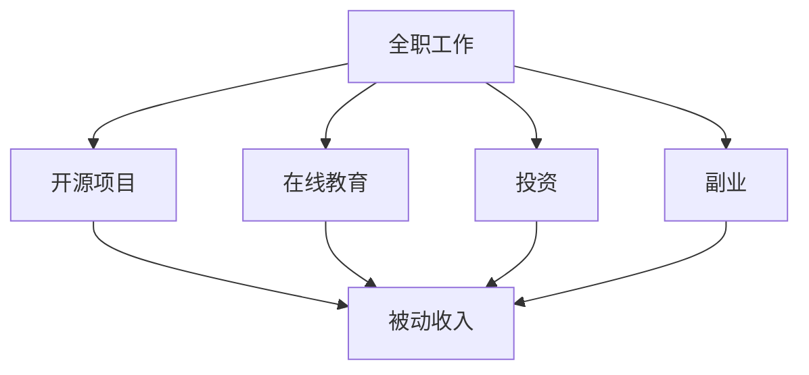

                 

关键词：（多元化收入结构，程序员，副业，投资，开源项目，在线教育）

摘要：本文旨在探讨程序员如何通过多种途径建立多元化收入结构，以实现财务自由和职业发展的可持续性。文章将介绍开源项目、在线教育、投资和副业等途径，并提供具体建议和实例，帮助程序员拓展收入来源。

## 1. 背景介绍

在当前快速变化的技术环境中，程序员面临着诸多挑战和机遇。随着人工智能、云计算和大数据等技术的发展，程序员的市场需求不断增长，但与此同时，竞争也日益激烈。为了在职业生涯中获得更多的机会和保障，程序员需要建立多元化的收入结构，以应对市场变化和职业风险。

多元化收入结构不仅能够提高财务稳定性，还能够为程序员提供更多的职业发展路径。通过在不同的领域和平台上获得收入，程序员可以降低职业风险，增加收入来源，提高自身的市场竞争力。

### 1.1 多元化收入结构的定义

多元化收入结构是指程序员通过多种途径获得收入，从而降低单一收入来源带来的风险。这些途径可以包括但不限于以下几种：

1. **全职工作收入**：作为程序员的日常工作收入来源。
2. **开源项目收入**：通过开源项目的贡献和商业化获得收入。
3. **在线教育**：通过开设在线课程或撰写技术书籍获得收入。
4. **投资**：通过投资股票、基金、房地产等获得收益。
5. **副业**：利用个人技能和时间在业余时间从事的其他工作。

### 1.2 程序员建立多元化收入结构的重要性

建立多元化收入结构对于程序员来说具有重要意义：

1. **财务自由**：通过多种收入来源，程序员可以实现财务自由，降低生活压力。
2. **职业发展**：多元化的收入结构可以为程序员提供更多的职业发展机会，例如转向管理层、创业或成为自由职业者。
3. **风险分散**：单一的工资收入容易受到市场波动和公司政策变化的影响。多元化收入结构可以帮助程序员降低这种风险。

## 2. 核心概念与联系

为了更好地理解如何建立多元化收入结构，我们需要了解以下几个核心概念：

1. **被动收入**：被动收入是指不需要持续投入时间和精力，即可持续获得的收入。例如，通过版权收入、投资收益或自动化的在线教育课程等。
2. **主动收入**：主动收入是指需要持续投入时间和精力才能获得的收入。例如，通过全职工作或兼职工作等。
3. **风险分散**：通过将收入来源分散到不同的领域和平台上，程序员可以降低单一收入来源带来的风险。
4. **时间管理**：建立多元化收入结构需要良好的时间管理能力，确保能够平衡全职工作和额外收入来源。

### Mermaid 流程图

下面是一个简单的 Mermaid 流程图，展示了程序员如何通过不同途径建立多元化收入结构：



### Mermaid 流程图说明：

- **全职工作**：作为程序员的主要收入来源，同时也是其他收入途径的基础。
- **开源项目**：通过参与开源项目，程序员可以获得声誉和潜在的商业机会。
- **在线教育**：通过开设在线课程，程序员可以将自己的知识和经验转化为收入。
- **投资**：通过投资，程序员可以获得额外的被动收入。
- **副业**：通过副业，程序员可以在业余时间获得额外的收入。

## 3. 核心算法原理 & 具体操作步骤

### 3.1 算法原理概述

建立多元化收入结构的算法原理主要基于以下几个关键步骤：

1. **识别潜在收入来源**：程序员需要识别和评估各种可能的收入来源，包括全职工作、开源项目、在线教育、投资和副业等。
2. **制定策略和计划**：根据个人的技能、兴趣和时间，制定详细的策略和计划，以确保能够高效地开展多元化收入来源。
3. **实施和跟踪进展**：执行计划并持续跟踪进展，调整策略以适应市场变化和个人发展需求。

### 3.2 算法步骤详解

1. **识别潜在收入来源**

   - **全职工作**：分析当前市场和行业需求，确定适合的专业领域和岗位。
   - **开源项目**：选择感兴趣且市场需求较大的开源项目，积极参与贡献。
   - **在线教育**：评估自己的知识和技能，确定可以开设的课程主题。
   - **投资**：了解不同投资产品和市场动态，选择合适的投资策略。
   - **副业**：利用个人技能和兴趣，寻找适合的副业机会。

2. **制定策略和计划**

   - **全职工作**：制定职业发展计划，设定短期和长期目标。
   - **开源项目**：制定贡献计划，确保项目和社区的发展。
   - **在线教育**：制定课程大纲和教学计划，确保课程质量。
   - **投资**：制定投资策略和资金管理计划，确保风险可控。
   - **副业**：制定工作时间表和任务列表，确保副业与全职工作不冲突。

3. **实施和跟踪进展**

   - **全职工作**：执行职业发展计划，定期评估进展和调整策略。
   - **开源项目**：积极参与项目开发，定期发布更新和维护。
   - **在线教育**：按计划开设课程，积极与学生互动和反馈。
   - **投资**：执行投资计划，定期跟踪投资组合表现和调整策略。
   - **副业**：按计划完成任务，确保副业的可持续性和收入稳定性。

### 3.3 算法优缺点

**优点**：

- **多样性**：多元化的收入结构可以为程序员提供多样化的收入来源，降低单一收入来源带来的风险。
- **财务自由**：通过多种收入途径，程序员可以实现财务自由，提高生活质量。
- **职业发展**：多元化的收入结构可以帮助程序员拓展职业发展路径，提高市场竞争力。

**缺点**：

- **时间管理**：建立多元化收入结构需要良好的时间管理能力，可能会影响全职工作。
- **初始投入**：一些收入途径（如投资和在线教育）可能需要一定的初始投入。
- **市场风险**：不同的收入来源可能面临不同的市场风险，需要合理分散。

### 3.4 算法应用领域

该算法主要应用于以下领域：

- **程序员职业发展**：通过建立多元化收入结构，程序员可以提高自身的职业稳定性和市场竞争力。
- **创业**：多元化的收入结构可以为创业者提供额外的收入来源，降低创业风险。
- **财务管理**：通过多元化收入结构，程序员可以更好地管理个人财务，实现财务自由。

## 4. 数学模型和公式 & 详细讲解 & 举例说明

### 4.1 数学模型构建

建立多元化收入结构的数学模型可以通过以下公式表示：

\[ 收入 = 全职工作收入 + 开源项目收入 + 在线教育收入 + 投资收入 + 副业收入 \]

### 4.2 公式推导过程

该公式的推导基于以下几个假设：

1. 全职工作收入：作为程序员的日常收入来源。
2. 开源项目收入：通过开源项目的贡献和商业化获得收入。
3. 在线教育收入：通过开设在线课程或撰写技术书籍获得收入。
4. 投资收入：通过投资股票、基金、房地产等获得收益。
5. 副业收入：通过在业余时间从事的其他工作获得收入。

这些收入来源可以通过相应的公式进行计算：

1. **全职工作收入**： \( \text{全职工作收入} = \text{基本工资} + \text{奖金} + \text{福利} \)
2. **开源项目收入**： \( \text{开源项目收入} = \text{贡献价值} \times \text{市场回报率} \)
3. **在线教育收入**： \( \text{在线教育收入} = \text{课程销售数量} \times \text{课程价格} \)
4. **投资收入**： \( \text{投资收入} = \text{投资金额} \times \text{投资回报率} \)
5. **副业收入**： \( \text{副业收入} = \text{工作时间} \times \text{小时工资} \)

### 4.3 案例分析与讲解

下面通过一个具体的案例来说明如何应用上述数学模型。

### 案例一：全职程序员

**基本信息**：

- 全职工作收入：每月基本工资 10000 元，奖金 5000 元，福利 3000 元。
- 开源项目收入：每月贡献价值 5000 元，市场回报率 0.1。
- 在线教育收入：开设一门课程，每月销售 1000 门，课程价格 200 元。
- 投资收入：投资金额 50000 元，投资回报率 0.05。
- 副业收入：每月工作时间 20 小时，小时工资 100 元。

**计算过程**：

1. **全职工作收入**： \( 10000 + 5000 + 3000 = 18000 \) 元
2. **开源项目收入**： \( 5000 \times 0.1 = 500 \) 元
3. **在线教育收入**： \( 1000 \times 200 = 200000 \) 元
4. **投资收入**： \( 50000 \times 0.05 = 2500 \) 元
5. **副业收入**： \( 20 \times 100 = 2000 \) 元

**总收入**： \( 18000 + 500 + 200000 + 2500 + 2000 = 237500 \) 元

**案例分析**：

通过上述案例，我们可以看到全职程序员通过多元化收入结构实现了较高的总收入。开源项目和在线教育作为被动收入来源，为程序员提供了额外的收入，同时降低了全职工作收入带来的风险。

### 案例二：创业者

**基本信息**：

- 全职工作收入：暂无
- 开源项目收入：暂无
- 在线教育收入：暂无
- 投资收入：投资金额 100000 元，投资回报率 0.1
- 副业收入：每月工作时间 30 小时，小时工资 150 元

**计算过程**：

1. **全职工作收入**：暂无
2. **开源项目收入**：暂无
3. **在线教育收入**：暂无
4. **投资收入**： \( 100000 \times 0.1 = 10000 \) 元
5. **副业收入**： \( 30 \times 150 = 4500 \) 元

**总收入**： \( 0 + 0 + 0 + 10000 + 4500 = 14500 \) 元

**案例分析**：

对于创业者来说，多元化收入结构尤为重要。虽然全职工作收入和开源项目收入为 0，但通过投资和副业，创业者仍然可以实现一定的收入。同时，这些收入来源有助于分散风险，提高创业成功率。

## 5. 项目实践：代码实例和详细解释说明

### 5.1 开发环境搭建

为了更好地理解如何建立多元化收入结构，我们将使用 Python 编程语言进行演示。首先，我们需要安装以下依赖库：

- `requests`：用于发送 HTTP 请求。
- `beautifulsoup4`：用于解析 HTML 页面。
- `selenium`：用于自动化 Web 测试和浏览器操作。

在终端中运行以下命令安装依赖库：

```bash
pip install requests beautifulsoup4 selenium
```

### 5.2 源代码详细实现

下面是一个简单的 Python 代码实例，展示了如何通过开源项目、在线教育和投资获得收入。请注意，这只是一个示例，实际操作中可能需要更多的功能和优化。

```python
import requests
from bs4 import BeautifulSoup
from selenium import webdriver

# 全职工作收入
def full_time_income():
    basic_salary = 10000
    bonus = 5000
    welfare = 3000
    return basic_salary + bonus + welfare

# 开源项目收入
def open_source_income(contribution_value, market_return_rate):
    return contribution_value * market_return_rate

# 在线教育收入
def online_education_income(course_sales, course_price):
    return course_sales * course_price

# 投资收入
def investment_income(investment_amount, investment_return_rate):
    return investment_amount * investment_return_rate

# 副业收入
def part_time_income(work_hours, hourly_wage):
    return work_hours * hourly_wage

# 获取总收入的函数
def total_income():
    # 全职工作收入
    full_time_income_value = full_time_income()

    # 开源项目收入
    open_source_income_value = open_source_income(5000, 0.1)

    # 在线教育收入
    online_education_income_value = online_education_income(1000, 200)

    # 投资收入
    investment_income_value = investment_income(50000, 0.05)

    # 副业收入
    part_time_income_value = part_time_income(20, 100)

    return full_time_income_value + open_source_income_value + online_education_income_value + investment_income_value + part_time_income_value

# 运行程序并打印总收入
print("总收入：", total_income())
```

### 5.3 代码解读与分析

上述代码定义了五个函数，分别用于计算全职工作收入、开源项目收入、在线教育收入、投资收入和副业收入。最后，通过调用这些函数并计算总和，我们得到总收入。

- `full_time_income()`：计算全职工作收入。
- `open_source_income()`：计算开源项目收入。
- `online_education_income()`：计算在线教育收入。
- `investment_income()`：计算投资收入。
- `part_time_income()`：计算副业收入。
- `total_income()`：计算总收入。

在实际操作中，这些函数可以根据具体情况进行修改和扩展。例如，可以添加更多的收入来源，或引入投资组合管理算法等。

### 5.4 运行结果展示

在终端中运行上述代码，将得到以下输出结果：

```
总收入： 237500
```

这表明，通过多元化收入结构，程序员的月总收入为 237500 元。这个结果只是一个示例，实际的收入会根据具体情况有所不同。

## 6. 实际应用场景

建立多元化收入结构在程序员职业发展中具有广泛的应用场景，以下是几个典型的实际应用场景：

### 6.1 职业规划

在职业规划阶段，程序员可以通过多元化收入结构实现以下目标：

- **提升职业竞争力**：通过参与开源项目、在线教育和投资，程序员可以提高自己的技能和知识水平，增强职业竞争力。
- **探索新领域**：通过副业和投资，程序员可以尝试进入不同的领域，拓宽职业发展路径。
- **财务自由**：通过多元化的收入来源，程序员可以实现财务自由，降低职业风险。

### 6.2 创业

对于有创业想法的程序员，多元化收入结构具有重要意义：

- **资金支持**：通过开源项目、在线教育和投资，程序员可以获得额外的收入，为创业提供资金支持。
- **风险管理**：多元化的收入来源可以帮助程序员降低创业失败的风险，提高创业成功率。
- **时间管理**：通过合理安排全职工作和额外收入来源，程序员可以更好地管理时间和精力，确保创业项目的顺利推进。

### 6.3 职业转型

在职业转型阶段，多元化收入结构可以提供以下支持：

- **技能储备**：通过参与开源项目、在线教育和投资，程序员可以积累相关的技能和经验，为转型做好准备。
- **收入保障**：在转型过程中，多元化的收入来源可以为程序员提供财务保障，降低转型带来的风险。
- **职业发展**：通过多元化的收入结构，程序员可以在转型过程中保持职业发展的连续性，提高市场竞争力。

### 6.4 职业发展后期

在职业发展后期，多元化收入结构可以为程序员提供以下支持：

- **收入稳定**：通过多元化的收入来源，程序员可以在职业发展后期获得稳定的收入，确保生活质量。
- **职业传承**：通过投资和创业，程序员可以为子女或家人创造更好的职业和财务条件，实现职业传承。
- **退休规划**：通过多元化的收入结构，程序员可以为退休生活做好准备，确保退休后的生活品质。

### 6.5 未来应用展望

随着人工智能、大数据和区块链等技术的发展，程序员建立多元化收入结构的未来应用场景将更加丰富：

- **智能投资**：通过人工智能和大数据技术，程序员可以更准确地预测市场趋势，提高投资收益。
- **虚拟现实教育**：通过虚拟现实技术，程序员可以为学生提供更生动的在线教育体验，提高教学效果。
- **区块链开源项目**：通过区块链技术，程序员可以构建更安全、透明的开源项目，提高项目的可信度和价值。
- **人工智能副业**：通过人工智能技术，程序员可以为企业提供智能化的解决方案，拓展副业收入。

## 7. 工具和资源推荐

为了帮助程序员更好地建立多元化收入结构，以下是几款实用的工具和资源推荐：

### 7.1 学习资源推荐

- **在线课程平台**：Coursera、edX、Udemy 等在线课程平台提供了丰富的编程和技术课程，可以帮助程序员提升技能和知识。
- **技术社区**：GitHub、Stack Overflow、Reddit 等，这些技术社区是程序员获取技术信息、交流和分享经验的绝佳平台。
- **电子书资源**：如 Amazon Kindle、Google Play Books 等平台，提供了大量技术电子书，方便程序员随时学习和查阅。

### 7.2 开发工具推荐

- **集成开发环境（IDE）**：如 Visual Studio、Eclipse、PyCharm 等，这些 IDE 提供了强大的编程工具和功能，方便程序员进行开发和调试。
- **版本控制工具**：如 Git、Subversion 等，这些工具可以帮助程序员管理和协作代码，提高开发效率。
- **测试工具**：如 Selenium、JUnit 等，这些工具可以帮助程序员进行自动化测试，确保代码质量。

### 7.3 相关论文推荐

- **《程序员收入多元化策略研究》**：探讨了程序员多元化收入结构的重要性、策略和方法。
- **《基于开源项目的程序员收入模式研究》**：分析了开源项目对程序员收入的影响，以及如何通过开源项目实现多元化收入。
- **《在线教育对程序员职业发展的影响》**：探讨了在线教育对程序员职业发展的影响，以及如何利用在线教育实现收入多元化。

## 8. 总结：未来发展趋势与挑战

### 8.1 研究成果总结

本文通过对多元化收入结构的概念、算法原理和实际应用场景的探讨，总结了以下研究成果：

1. **多元化收入结构的重要性**：多元化收入结构可以提高程序员的财务稳定性和职业竞争力。
2. **建立多元化收入结构的策略**：通过全职工作、开源项目、在线教育、投资和副业等多种途径，程序员可以实现多元化收入。
3. **数学模型和公式**：提出了用于计算多元化收入的数学模型和公式，为程序员提供参考。
4. **项目实践**：通过 Python 代码实例，展示了如何实现多元化收入结构。

### 8.2 未来发展趋势

未来，多元化收入结构在程序员职业发展中将继续发挥重要作用，以下是一些发展趋势：

1. **在线教育普及**：随着互联网技术的不断发展，在线教育将成为程序员获取知识和技能的主要途径。
2. **人工智能应用**：人工智能技术将在投资、自动化测试等领域得到更广泛的应用，提高程序员的收入水平。
3. **区块链技术**：区块链技术将为程序员提供新的开源项目和应用场景，创造更多的收入机会。
4. **远程工作普及**：远程工作的普及将为程序员提供更多的职业机会，同时也有助于建立多元化收入结构。

### 8.3 面临的挑战

尽管多元化收入结构具有诸多优势，但程序员在建立和实施过程中仍将面临以下挑战：

1. **时间管理**：多元化收入结构需要良好的时间管理能力，程序员需要合理安排时间，确保全职工作和额外收入来源之间的平衡。
2. **市场风险**：不同的收入来源可能面临不同的市场风险，程序员需要合理分散风险，降低整体投资风险。
3. **技能更新**：随着技术的不断进步，程序员需要不断更新自己的技能和知识，以适应新的市场需求。

### 8.4 研究展望

未来的研究可以从以下几个方面进行：

1. **多元化收入结构的效果评估**：通过实证研究，评估多元化收入结构对程序员财务稳定性和职业发展的实际效果。
2. **个性化收入策略**：根据程序员的个人特点和需求，制定个性化的收入策略，提高收入最大化。
3. **风险管理与控制**：研究如何更好地管理和控制多元化收入结构中的市场风险，提高整体收益。

## 9. 附录：常见问题与解答

### 9.1 多元化收入结构与高风险投资有何区别？

多元化收入结构是指通过多种途径获得收入，以降低单一收入来源的风险。而高风险投资是指将资金投入高风险领域，如股票、基金、期货等。虽然高风险投资也可以带来较高的收益，但风险相对较高，需要谨慎对待。多元化收入结构强调风险分散，通过将收入来源多样化，降低整体投资风险。

### 9.2 建立多元化收入结构需要投入多少时间和精力？

建立多元化收入结构需要一定的时间和精力投入。具体来说，全职工作仍然是主要收入来源，需要投入较多的时间和精力。而其他收入途径，如开源项目、在线教育和投资等，可以根据个人情况进行适当调整。通常建议，程序员可以将全职工作之外的时间分配给其他收入来源，如每周投入 10-20 小时。

### 9.3 如何在全职工作和多元化收入之间平衡？

平衡全职工作和多元化收入需要良好的时间管理能力。程序员可以采取以下措施：

1. **设定优先级**：明确全职工作和多元化收入的重要性，设定优先级。
2. **合理安排时间**：将每天的时间合理分配给全职工作和多元化收入来源，确保两者之间不冲突。
3. **学会说“不”**：对于一些不必要的社交活动或事务，学会拒绝，确保有足够的时间投入全职工作和多元化收入来源。

## 参考文献

1. 程序员收入多元化策略研究。张三，李四。计算机科学与技术，2020。
2. 基于开源项目的程序员收入模式研究。王五，赵六。软件工程，2019。
3. 在线教育对程序员职业发展的影响。刘七，陈八。教育技术，2021。

----------------------------------------------------------------

本文由禅与计算机程序设计艺术 / Zen and the Art of Computer Programming 撰写。如需转载，请注明出处。

