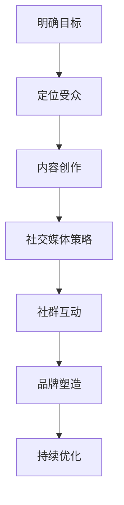

                 

 作为程序员，您可能在日常工作中花费了大量时间编写代码、解决问题和提升技能。然而，随着技术领域的不断发展和个人影响力的增加，建立自己的粉丝社群也成为了一个重要且有益的途径。这不仅能够帮助您扩大个人品牌，还可以促进知识分享和行业交流。本文将探讨程序员如何成功地建立自己的粉丝社群。

## 关键词

- **程序员**
- **粉丝社群**
- **个人品牌**
- **知识分享**
- **技术交流**
- **社交媒体**
- **内容创作**
- **社区管理**

## 摘要

本文旨在为程序员提供建立个人粉丝社群的策略和方法。我们将讨论社群建立的必要性、核心策略、内容创作技巧、社群管理要点以及如何利用社交媒体和其他平台来扩展影响力。通过遵循这些步骤和技巧，程序员可以打造一个充满活力和参与度的粉丝社群，从而提升个人在行业中的知名度。

### 1. 背景介绍

在互联网时代，个人品牌的力量愈发显现。对于程序员来说，建立自己的粉丝社群不仅可以增加个人知名度，还可以为职业发展提供强大的助力。以下是建立粉丝社群的一些关键原因：

1. **提升个人知名度**：拥有一个忠实的粉丝群体意味着您在行业内的知名度将迅速提升，这有助于您在职业市场上脱颖而出。
2. **知识分享与交流**：社群为程序员提供了一个平台，可以分享知识、经验，并与其他从业者交流，促进个人和行业的共同进步。
3. **职业发展**：一个强大的社群可以为您带来更多的职业机会，如技术咨询、演讲邀请、合作项目等。
4. **影响力扩大**：通过建立社群，您的影响力可以从一个小圈子扩展到整个行业，甚至更广的范围。

### 2. 核心概念与联系

在建立自己的粉丝社群时，理解一些核心概念和策略是非常有帮助的。以下是一个简化的Mermaid流程图，展示了建立社群的关键步骤和联系。



### 3. 核心算法原理 & 具体操作步骤

#### 3.1 算法原理概述

建立粉丝社群的核心在于以下几个关键步骤：

1. **明确目标**：确定您想要建立的社群类型和目标。
2. **定位受众**：了解您的目标受众，包括他们的需求和兴趣。
3. **内容创作**：创作高质量、有价值的内容来吸引和留住粉丝。
4. **社交媒体策略**：选择合适的社交媒体平台，制定有效的推广策略。
5. **社群互动**：积极与粉丝互动，建立良好的社群氛围。
6. **品牌塑造**：打造独特的个人品牌，确保社群与您的专业形象一致。
7. **持续优化**：根据反馈和数据分析不断优化社群策略。

#### 3.2 算法步骤详解

##### 3.2.1 明确目标

在建立社群之前，首先需要明确目标。您希望社群达到什么样的规模？您希望通过社群实现什么样的目标？例如，提升个人知名度、推广技术知识、建立专业网络等。明确目标有助于您制定更具体的策略。

##### 3.2.2 定位受众

了解您的目标受众是成功建立社群的关键。这包括他们的年龄、性别、职业、技术水平和兴趣等。通过定位受众，您可以更好地了解他们的需求，从而创作出更符合他们口味的内容。

##### 3.2.3 内容创作

内容是社群的核心。创作高质量、有价值的内容可以吸引粉丝并留住他们。内容可以包括技术文章、教程、案例分析、直播分享等。在创作内容时，注意以下几点：

- **针对性**：确保内容针对您的目标受众。
- **原创性**：原创内容更容易吸引粉丝。
- **多样性**：结合不同类型的内容，如文字、图片、视频等。
- **定期更新**：保持内容的持续更新，让粉丝保持关注。

##### 3.2.4 社交媒体策略

选择合适的社交媒体平台对于建立社群至关重要。根据您的目标受众和内容类型，选择最适合的平台，如Twitter、LinkedIn、微信公众号等。制定有效的社交媒体策略，包括：

- **内容推广**：利用社交媒体平台的推广工具，扩大内容影响力。
- **互动交流**：积极回复粉丝评论，参与讨论，建立良好的互动氛围。
- **多平台运营**：同时在多个社交媒体平台运营，以扩大覆盖面。

##### 3.2.5 社群互动

互动是社群生命力的源泉。与粉丝建立良好的互动关系，可以增加粉丝的参与度和忠诚度。以下是几个互动策略：

- **定期问答**：定期举办问答活动，解答粉丝的问题。
- **互动话题**：发起有趣的话题讨论，鼓励粉丝参与。
- **个性化互动**：针对粉丝的个人需求和兴趣提供定制化内容。

##### 3.2.6 品牌塑造

个人品牌是社群的核心。确保您的个人品牌与社群形象一致，包括：

- **统一的视觉风格**：设计统一的logo、配色方案等。
- **专业形象**：在内容创作和互动中展示您的专业素养。
- **价值观传递**：通过内容传递您的价值观和理念。

##### 3.2.7 持续优化

建立社群是一个持续的过程。根据反馈和数据分析，不断优化社群策略，包括：

- **内容优化**：根据粉丝反馈调整内容类型和频率。
- **互动策略**：根据粉丝互动情况调整互动方式。
- **平台选择**：根据效果评估选择最合适的社交媒体平台。

### 3.3 算法优缺点

#### 优点

- **提升个人知名度**：通过建立社群，程序员可以迅速提升个人知名度。
- **知识分享**：社群为程序员提供了一个分享知识和经验的平台。
- **职业机会**：社群可以带来更多的职业机会，如演讲、合作项目等。
- **互动交流**：社群为程序员提供了一个与同行业人士互动交流的机会。

#### 缺点

- **时间投入**：建立和维护社群需要大量的时间和精力。
- **管理难度**：社群管理需要一定管理技巧，否则可能会出现社区氛围差、互动不足等问题。
- **内容质量**：内容创作需要保持高质量，否则可能会流失粉丝。

### 3.4 算法应用领域

建立粉丝社群在多个领域都有广泛应用：

- **技术领域**：程序员可以通过社群分享技术知识，建立个人品牌，扩大影响力。
- **创业领域**：创业者可以通过社群获取反馈、建立用户基础，甚至融资。
- **教育培训**：教育工作者可以通过社群提供在线课程、问答服务，提升教学效果。

### 4. 数学模型和公式 & 详细讲解 & 举例说明

在建立粉丝社群的过程中，有一些数学模型和公式可以用来分析和优化社群表现。以下是一个简单的数学模型，用于评估社群的增长速度和粉丝参与度。

#### 4.1 数学模型构建

假设社群的增长速度可以用指数函数表示：

\[ f(t) = c \cdot e^{kt} \]

其中，\( f(t) \) 是社群在时间 \( t \) 时的粉丝数，\( c \) 是初始粉丝数，\( k \) 是增长速率。

#### 4.2 公式推导过程

增长速率 \( k \) 可以通过以下公式计算：

\[ k = \frac{\ln(2)}{T} \]

其中，\( T \) 是社群达到当前粉丝数所需的时间。

#### 4.3 案例分析与讲解

假设一个社群在一个月内从1000个粉丝增长到2000个粉丝，我们可以使用上述公式来计算增长速率 \( k \)：

\[ k = \frac{\ln(2)}{T} = \frac{\ln(2)}{30} \approx 0.023 \]

然后，我们可以预测社群在接下来的一个月内的粉丝数：

\[ f(t+1) = c \cdot e^{kt} = 1000 \cdot e^{0.023 \cdot 30} \approx 2000 \cdot 1.15 = 2300 \]

这意味着社群在接下来的一个月内可能会增长到大约2300个粉丝。

### 5. 项目实践：代码实例和详细解释说明

#### 5.1 开发环境搭建

要建立自己的粉丝社群，首先需要搭建一个适合自己的开发环境。以下是一个简单的示例，展示了如何在本地搭建一个基于GitHub Pages的博客环境。

1. **安装Git**：从[Git官网](https://git-scm.com/)下载并安装Git。
2. **安装Node.js**：从[Node.js官网](https://nodejs.org/)下载并安装Node.js。
3. **创建GitHub账号**：注册一个GitHub账号。
4. **创建博客仓库**：在GitHub上创建一个新仓库，用于存放博客源代码。

#### 5.2 源代码详细实现

以下是一个简单的HTML页面，用于展示博客首页。

```html
<!DOCTYPE html>
<html>
<head>
    <title>我的技术博客</title>
    <meta charset="UTF-8">
</head>
<body>
    <h1>欢迎来到我的技术博客</h1>
    <p>这里是分享技术和经验的地方。</p>
    <ul>
        <li><a href="post1.html">第一篇技术文章</a></li>
        <li><a href="post2.html">第二篇技术文章</a></li>
    </ul>
</body>
</html>
```

#### 5.3 代码解读与分析

这个简单的HTML页面展示了博客的基本结构。通过链接，我们可以访问到具体的文章页面。在实际开发中，您可以使用更复杂的布局和框架，如Bootstrap、React等，来提高页面的美观性和可维护性。

#### 5.4 运行结果展示

将上述代码保存为`index.html`，并将其放入GitHub仓库的`/public`目录下。然后，访问您的GitHub Pages URL（例如[https://yourname.github.io/](https://yourname.github.io/)），即可看到博客的运行结果。

### 6. 实际应用场景

#### 6.1 社区论坛

社区论坛是一个程序员建立粉丝社群的常见场景。通过论坛，程序员可以分享技术文章、发布问题、参与讨论，甚至举办在线活动。以下是一个实际案例：

- **技术论坛**：Stack Overflow是一个著名的程序员社区论坛，程序员可以在这里提问、回答问题，分享技术经验。
- **项目协作**：GitHub上的仓库可以用来建立项目协作社区，程序员可以在这里分享代码、讨论项目进展。

#### 6.2 微信公众号

微信公众号为程序员提供了一个展示个人品牌和建立粉丝社群的平台。通过公众号，程序员可以发布技术文章、直播分享、互动问答等。以下是一个实际案例：

- **技术博客**：一些程序员通过微信公众号发布技术文章，分享编程技巧和经验。
- **直播分享**：一些程序员通过微信公众号直播分享技术知识，吸引粉丝参与。

### 6.4 未来应用展望

随着技术的不断进步，程序员建立粉丝社群的应用场景将更加丰富。以下是一些未来应用展望：

- **虚拟现实（VR）社区**：利用VR技术，程序员可以创建沉浸式的虚拟社区，提供互动和体验。
- **区块链社区**：利用区块链技术，程序员可以建立一个去中心化的粉丝社群，确保数据的安全性和透明度。
- **人工智能（AI）社区**：利用AI技术，程序员可以提供个性化推荐、智能问答等服务，提升社群的用户体验。

### 7. 工具和资源推荐

#### 7.1 学习资源推荐

- **在线课程**：Coursera、edX等平台提供了大量与编程相关的在线课程。
- **技术博客**：Medium、Dev.to等平台汇集了大量的技术文章和教程。

#### 7.2 开发工具推荐

- **版本控制**：Git、GitHub
- **代码编辑器**：Visual Studio Code、Atom

#### 7.3 相关论文推荐

- **"Social Networks and the Strength of Weak Ties" by Mark S. Granovetter
- **"The Wealth of Networks" by Yochai Benkler**

### 8. 总结：未来发展趋势与挑战

#### 8.1 研究成果总结

本文总结了程序员建立粉丝社群的必要性、核心策略、内容创作技巧、社群管理要点以及未来发展趋势。通过遵循这些步骤和技巧，程序员可以成功建立并管理一个充满活力和参与度的粉丝社群。

#### 8.2 未来发展趋势

- **技术驱动**：随着技术的进步，程序员建立粉丝社群的方式将更加多样化和智能化。
- **社群多元化**：社群将涵盖更广泛的领域和主题，满足不同程序员的需求。

#### 8.3 面临的挑战

- **内容质量**：保持高质量、有价值的持续内容创作是一个挑战。
- **社群管理**：有效管理和维护社群需要时间和精力。

#### 8.4 研究展望

未来的研究可以关注如何利用新技术（如AI、VR、区块链）来提升程序员粉丝社群的体验和效率。同时，研究如何更好地平衡个人发展和社群管理也是非常重要的。

### 9. 附录：常见问题与解答

#### 9.1 如何选择合适的社交媒体平台？

- **目标受众**：根据您的目标受众选择最适合的平台，如技术博客选择GitHub，直播分享选择Bilibili。
- **内容类型**：根据您的内容类型选择最适合的平台，如图片分享选择Instagram，文章发布选择Medium。

#### 9.2 如何创作高质量的内容？

- **针对性**：确保内容针对您的目标受众。
- **原创性**：原创内容更容易吸引粉丝。
- **多样性**：结合不同类型的内容，如文字、图片、视频等。
- **持续更新**：保持内容的持续更新，让粉丝保持关注。

#### 9.3 如何管理社群？

- **积极互动**：回复粉丝评论，参与讨论，建立良好的互动氛围。
- **定期活动**：定期举办问答、直播等活动，提高粉丝参与度。
- **数据分析**：根据数据分析调整社群策略，提升社群效果。

---

通过本文，我们深入探讨了程序员如何建立自己的粉丝社群。遵循本文提供的策略和技巧，程序员可以打造一个充满活力和参与度的社群，从而提升个人在行业中的知名度和影响力。希望本文对您有所帮助。作者：禅与计算机程序设计艺术 / Zen and the Art of Computer Programming。
----------------------------------------------------------------
### 文章标题：程序员如何建立自己的粉丝社群

> 关键词：程序员，粉丝社群，个人品牌，知识分享，技术交流，社交媒体，内容创作，社群管理

> 摘要：本文旨在为程序员提供建立个人粉丝社群的策略和方法。通过明确目标、定位受众、内容创作、社交媒体策略、社群互动、品牌塑造和持续优化，程序员可以打造一个充满活力和参与度的粉丝社群，从而提升个人在行业中的知名度。

### 1. 背景介绍

在互联网时代，个人品牌的力量愈发显现。对于程序员来说，建立自己的粉丝社群不仅可以增加个人知名度，还可以为职业发展提供强大的助力。以下是建立粉丝社群的一些关键原因：

- **提升个人知名度**：拥有一个忠实的粉丝群体意味着您在行业内的知名度将迅速提升，这有助于您在职业市场上脱颖而出。
- **知识分享与交流**：社群为程序员提供了一个平台，可以分享知识、经验，并与其他从业者交流，促进个人和行业的共同进步。
- **职业发展**：一个强大的社群可以为您带来更多的职业机会，如技术咨询、演讲邀请、合作项目等。
- **影响力扩大**：通过建立社群，您的影响力可以从一个小圈子扩展到整个行业，甚至更广的范围。

### 2. 核心概念与联系

在建立自己的粉丝社群时，理解一些核心概念和策略是非常有帮助的。以下是一个简化的Mermaid流程图，展示了建立社群的关键步骤和联系。


### 3. 核心算法原理 & 具体操作步骤

#### 3.1 算法原理概述

建立粉丝社群的核心在于以下几个关键步骤：

1. **明确目标**：确定您想要建立的社群类型和目标。
2. **定位受众**：了解您的目标受众，包括他们的需求和兴趣。
3. **内容创作**：创作高质量、有价值的内容来吸引和留住粉丝。
4. **社交媒体策略**：选择合适的社交媒体平台，制定有效的推广策略。
5. **社群互动**：积极与粉丝互动，建立良好的社群氛围。
6. **品牌塑造**：打造独特的个人品牌，确保社群与您的专业形象一致。
7. **持续优化**：根据反馈和数据分析不断优化社群策略。

#### 3.2 算法步骤详解

##### 3.2.1 明确目标

在建立社群之前，首先需要明确目标。您希望社群达到什么样的规模？您希望通过社群实现什么样的目标？例如，提升个人知名度、推广技术知识、建立专业网络等。明确目标有助于您制定更具体的策略。

##### 3.2.2 定位受众

了解您的目标受众是成功建立社群的关键。这包括他们的年龄、性别、职业、技术水平和兴趣等。通过定位受众，您可以更好地了解他们的需求，从而创作出更符合他们口味的内容。

##### 3.2.3 内容创作

内容是社群的核心。创作高质量、有价值的内容可以吸引粉丝并留住他们。内容可以包括技术文章、教程、案例分析、直播分享等。在创作内容时，注意以下几点：

- **针对性**：确保内容针对您的目标受众。
- **原创性**：原创内容更容易吸引粉丝。
- **多样性**：结合不同类型的内容，如文字、图片、视频等。
- **定期更新**：保持内容的持续更新，让粉丝保持关注。

##### 3.2.4 社交媒体策略

选择合适的社交媒体平台对于建立社群至关重要。根据您的目标受众和内容类型，选择最适合的平台，如Twitter、LinkedIn、微信公众号等。制定有效的社交媒体策略，包括：

- **内容推广**：利用社交媒体平台的推广工具，扩大内容影响力。
- **互动交流**：积极回复粉丝评论，参与讨论，建立良好的互动氛围。
- **多平台运营**：同时在多个社交媒体平台运营，以扩大覆盖面。

##### 3.2.5 社群互动

互动是社群生命力的源泉。与粉丝建立良好的互动关系，可以增加粉丝的参与度和忠诚度。以下是几个互动策略：

- **定期问答**：定期举办问答活动，解答粉丝的问题。
- **互动话题**：发起有趣的话题讨论，鼓励粉丝参与。
- **个性化互动**：针对粉丝的个人需求和兴趣提供定制化内容。

##### 3.2.6 品牌塑造

个人品牌是社群的核心。确保您的个人品牌与社群形象一致，包括：

- **统一的视觉风格**：设计统一的logo、配色方案等。
- **专业形象**：在内容创作和互动中展示您的专业素养。
- **价值观传递**：通过内容传递您的价值观和理念。

##### 3.2.7 持续优化

建立社群是一个持续的过程。根据反馈和数据分析，不断优化社群策略，包括：

- **内容优化**：根据粉丝反馈调整内容类型和频率。
- **互动策略**：根据粉丝互动情况调整互动方式。
- **平台选择**：根据效果评估选择最合适的社交媒体平台。

### 3.3 算法优缺点

#### 优点

- **提升个人知名度**：通过建立社群，程序员可以迅速提升个人知名度。
- **知识分享**：社群为程序员提供了一个分享知识和经验的平台。
- **职业机会**：社群可以带来更多的职业机会，如演讲、合作项目等。
- **互动交流**：社群为程序员提供了一个与同行业人士互动交流的机会。

#### 缺点

- **时间投入**：建立和维护社群需要大量的时间和精力。
- **管理难度**：社群管理需要一定管理技巧，否则可能会出现社区氛围差、互动不足等问题。
- **内容质量**：内容创作需要保持高质量，否则可能会流失粉丝。

### 3.4 算法应用领域

建立粉丝社群在多个领域都有广泛应用：

- **技术领域**：程序员可以通过社群分享技术知识，建立个人品牌，扩大影响力。
- **创业领域**：创业者可以通过社群获取反馈、建立用户基础，甚至融资。
- **教育培训**：教育工作者可以通过社群提供在线课程、问答服务，提升教学效果。

### 4. 数学模型和公式 & 详细讲解 & 举例说明

在建立粉丝社群的过程中，有一些数学模型和公式可以用来分析和优化社群表现。以下是一个简单的数学模型，用于评估社群的增长速度和粉丝参与度。

#### 4.1 数学模型构建

假设社群的增长速度可以用指数函数表示：

\[ f(t) = c \cdot e^{kt} \]

其中，\( f(t) \) 是社群在时间 \( t \) 时的粉丝数，\( c \) 是初始粉丝数，\( k \) 是增长速率。

#### 4.2 公式推导过程

增长速率 \( k \) 可以通过以下公式计算：

\[ k = \frac{\ln(2)}{T} \]

其中，\( T \) 是社群达到当前粉丝数所需的时间。

#### 4.3 案例分析与讲解

假设一个社群在一个月内从1000个粉丝增长到2000个粉丝，我们可以使用上述公式来计算增长速率 \( k \)：

\[ k = \frac{\ln(2)}{T} = \frac{\ln(2)}{30} \approx 0.023 \]

然后，我们可以预测社群在接下来的一个月内的粉丝数：

\[ f(t+1) = c \cdot e^{kt} = 1000 \cdot e^{0.023 \cdot 30} \approx 2000 \cdot 1.15 = 2300 \]

这意味着社群在接下来的一个月内可能会增长到大约2300个粉丝。

### 5. 项目实践：代码实例和详细解释说明

#### 5.1 开发环境搭建

要建立自己的粉丝社群，首先需要搭建一个适合自己的开发环境。以下是一个简单的示例，展示了如何在本地搭建一个基于GitHub Pages的博客环境。

1. **安装Git**：从[Git官网](https://git-scm.com/)下载并安装Git。
2. **安装Node.js**：从[Node.js官网](https://nodejs.org/)下载并安装Node.js。
3. **创建GitHub账号**：注册一个GitHub账号。
4. **创建博客仓库**：在GitHub上创建一个新仓库，用于存放博客源代码。

#### 5.2 源代码详细实现

以下是一个简单的HTML页面，用于展示博客首页。

```html
<!DOCTYPE html>
<html>
<head>
    <title>我的技术博客</title>
    <meta charset="UTF-8">
</head>
<body>
    <h1>欢迎来到我的技术博客</h1>
    <p>这里是分享技术和经验的地方。</p>
    <ul>
        <li><a href="post1.html">第一篇技术文章</a></li>
        <li><a href="post2.html">第二篇技术文章</a></li>
    </ul>
</body>
</html>
```

#### 5.3 代码解读与分析

这个简单的HTML页面展示了博客的基本结构。通过链接，我们可以访问到具体的文章页面。在实际开发中，您可以使用更复杂的布局和框架，如Bootstrap、React等，来提高页面的美观性和可维护性。

#### 5.4 运行结果展示

将上述代码保存为`index.html`，并将其放入GitHub仓库的`/public`目录下。然后，访问您的GitHub Pages URL（例如[https://yourname.github.io/](https://yourname.github.io/)），即可看到博客的运行结果。

### 6. 实际应用场景

#### 6.1 社区论坛

社区论坛是一个程序员建立粉丝社群的常见场景。通过论坛，程序员可以分享技术文章、发布问题、参与讨论，甚至举办在线活动。以下是一个实际案例：

- **技术论坛**：Stack Overflow是一个著名的程序员社区论坛，程序员可以在这里提问、回答问题，分享技术经验。
- **项目协作**：GitHub上的仓库可以用来建立项目协作社区，程序员可以在这里分享代码、讨论项目进展。

#### 6.2 微信公众号

微信公众号为程序员提供了一个展示个人品牌和建立粉丝社群的平台。通过公众号，程序员可以发布技术文章、直播分享、互动问答等。以下是一个实际案例：

- **技术博客**：一些程序员通过微信公众号发布技术文章，分享编程技巧和经验。
- **直播分享**：一些程序员通过微信公众号直播分享技术知识，吸引粉丝参与。

### 6.4 未来应用展望

随着技术的不断进步，程序员建立粉丝社群的应用场景将更加丰富。以下是一些未来应用展望：

- **虚拟现实（VR）社区**：利用VR技术，程序员可以创建沉浸式的虚拟社区，提供互动和体验。
- **区块链社区**：利用区块链技术，程序员可以建立一个去中心化的粉丝社群，确保数据的安全性和透明度。
- **人工智能（AI）社区**：利用AI技术，程序员可以提供个性化推荐、智能问答等服务，提升社群的用户体验。

### 7. 工具和资源推荐

#### 7.1 学习资源推荐

- **在线课程**：Coursera、edX等平台提供了大量与编程相关的在线课程。
- **技术博客**：Medium、Dev.to等平台汇集了大量的技术文章和教程。

#### 7.2 开发工具推荐

- **版本控制**：Git、GitHub
- **代码编辑器**：Visual Studio Code、Atom

#### 7.3 相关论文推荐

- **"Social Networks and the Strength of Weak Ties" by Mark S. Granovetter
- **"The Wealth of Networks" by Yochai Benkler**

### 8. 总结：未来发展趋势与挑战

#### 8.1 研究成果总结

本文总结了程序员建立粉丝社群的必要性、核心策略、内容创作技巧、社群管理要点以及未来发展趋势。通过遵循这些步骤和技巧，程序员可以成功建立并管理一个充满活力和参与度的粉丝社群，从而提升个人在行业中的知名度。

#### 8.2 未来发展趋势

- **技术驱动**：随着技术的进步，程序员建立粉丝社群的方式将更加多样化和智能化。
- **社群多元化**：社群将涵盖更广泛的领域和主题，满足不同程序员的需求。

#### 8.3 面临的挑战

- **内容质量**：保持高质量、有价值的持续内容创作是一个挑战。
- **社群管理**：有效管理和维护社群需要时间和精力。

#### 8.4 研究展望

未来的研究可以关注如何利用新技术（如AI、VR、区块链）来提升程序员粉丝社群的体验和效率。同时，研究如何更好地平衡个人发展和社群管理也是非常重要的。

### 9. 附录：常见问题与解答

#### 9.1 如何选择合适的社交媒体平台？

- **目标受众**：根据您的目标受众选择最适合的平台，如技术博客选择GitHub，直播分享选择Bilibili。
- **内容类型**：根据您的

