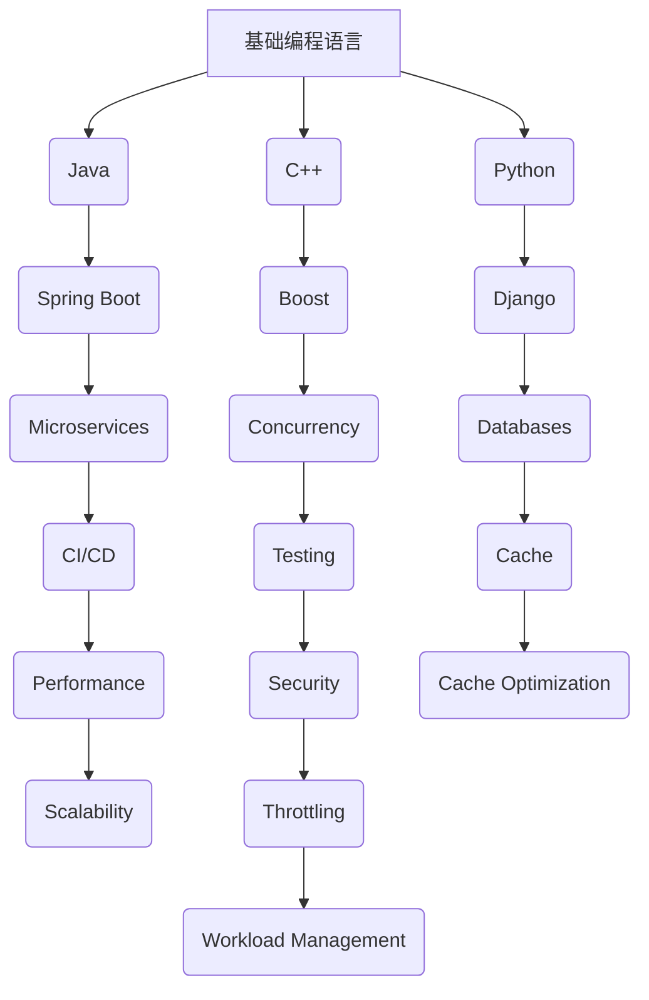
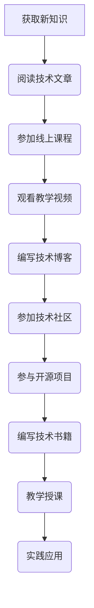
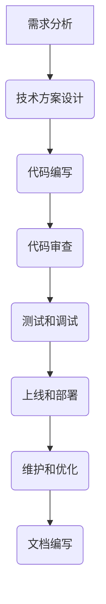

                 

关键词：程序员、职业发展、长期竞争力、技术学习、持续进步

> 摘要：本文将探讨程序员如何建立长期的职业竞争力。通过深入分析技术、沟通、团队协作等多个方面，文章旨在为程序员提供一套全面的策略，帮助他们在职业生涯中持续进步，不断提升自身价值。

## 1. 背景介绍

在当今快速发展的技术时代，程序员的角色日益重要。随着软件应用渗透到各个领域，对程序员的需求也在不断增加。然而，技术的快速迭代使得程序员面临着持续学习、适应新技术的挑战。如何在这片变幻莫测的技术海洋中立足，成为每个程序员都必须认真思考的问题。

建立长期的职业竞争力，不仅要求程序员掌握前沿技术，还需要具备深厚的理论基础、良好的沟通能力和团队协作精神。本文将从多个角度出发，为程序员提供一些建议，帮助他们在这个充满竞争的领域中站稳脚跟。

### 1.1 程序员面临的挑战

- **技术快速迭代**：新技术的不断涌现，要求程序员不断更新知识体系。
- **职业发展瓶颈**：在职业生涯中，如何突破发展瓶颈，成为高级工程师或技术专家。
- **团队协作**：在团队项目中，如何有效地与其他成员沟通协作。
- **个人成长**：如何保持持续的学习动力，实现个人成长。

## 2. 核心概念与联系

### 2.1 技术栈

技术栈是指程序员所掌握的编程语言、框架、库等工具的集合。一个完善的技术栈是建立长期竞争力的基础。以下是一个简化的技术栈 Mermaid 流程图：



### 2.2 持续学习

持续学习是程序员长期竞争力的源泉。以下是一个简化的持续学习流程图：



### 2.3 团队协作

团队协作是程序员工作中不可或缺的一部分。以下是一个简化的团队协作流程图：



## 3. 核心算法原理 & 具体操作步骤

### 3.1 算法原理概述

在建立职业竞争力的过程中，掌握核心算法原理至关重要。以下是一些常见算法及其原理：

- **排序算法**：包括快速排序、归并排序、堆排序等。
- **搜索算法**：包括二分搜索、广度优先搜索、深度优先搜索等。
- **图算法**：包括最短路径算法、最小生成树算法等。

### 3.2 算法步骤详解

以快速排序为例，其步骤如下：

1. 选择一个基准元素。
2. 将比基准元素小的元素放在其左侧，比其大的元素放在右侧。
3. 递归地重复步骤1和2，直到所有子数组都排序完成。

### 3.3 算法优缺点

- **快速排序**：时间复杂度为\(O(n\log n)\)，适用于大规模数据排序，但可能存在最坏情况下的性能问题。
- **二分搜索**：时间复杂度为\(O(\log n)\)，适用于有序数据集合，但需要额外空间存储中间结果。

### 3.4 算法应用领域

- **排序算法**：数据库排序、搜索引擎排序等。
- **搜索算法**：数据库查询、路径规划等。
- **图算法**：社交网络分析、路由算法等。

## 4. 数学模型和公式 & 详细讲解 & 举例说明

### 4.1 数学模型构建

在程序设计过程中，数学模型是解决实际问题的核心。以下是一个简单的线性回归模型的构建过程：

1. 数据预处理：对输入数据进行归一化处理，使其在相同的尺度上进行比较。
2. 模型假设：假设输入数据\(X\)和输出数据\(Y\)满足线性关系：\(Y = \beta_0 + \beta_1X + \epsilon\)，其中\(\epsilon\)为误差项。
3. 参数估计：使用最小二乘法估计模型参数\(\beta_0\)和\(\beta_1\)。

### 4.2 公式推导过程

线性回归模型的公式推导如下：

\[ Y = \beta_0 + \beta_1X + \epsilon \]

最小化误差平方和：

\[ J(\beta_0, \beta_1) = \sum_{i=1}^{n}(Y_i - (\beta_0 + \beta_1X_i))^2 \]

对\(\beta_0\)和\(\beta_1\)分别求偏导数，并令其等于0，得到：

\[ \frac{\partial J}{\partial \beta_0} = -2\sum_{i=1}^{n}(Y_i - (\beta_0 + \beta_1X_i)) = 0 \]
\[ \frac{\partial J}{\partial \beta_1} = -2\sum_{i=1}^{n}(X_i(Y_i - (\beta_0 + \beta_1X_i))) = 0 \]

解上述方程组，得到：

\[ \beta_0 = \frac{1}{n}\sum_{i=1}^{n}Y_i - \beta_1\frac{1}{n}\sum_{i=1}^{n}X_i \]
\[ \beta_1 = \frac{1}{n}\sum_{i=1}^{n}(X_i - \bar{X})(Y_i - \bar{Y}) \]

其中，\(\bar{X}\)和\(\bar{Y}\)分别为\(X\)和\(Y\)的均值。

### 4.3 案例分析与讲解

假设我们有一组数据：

| X | Y |
|---|---|
| 1 | 2 |
| 2 | 4 |
| 3 | 6 |
| 4 | 8 |

首先，我们对数据进行归一化处理：

| X | Y |
|---|---|
| 0 | 1 |
| 0.5 | 1 |
| 1 | 1 |
| 1.5 | 1 |

然后，根据上述公式计算线性回归模型的参数：

\[ \beta_0 = \frac{1}{4}(1 + 1 + 1 + 1) - 0.5 \times (1 + 1 + 1 + 1) = 0 \]
\[ \beta_1 = \frac{1}{4}(0.5 \times 0 + 0.5 \times 0 + 1 \times 1 + 1.5 \times 1) = 1 \]

因此，线性回归模型为：

\[ Y = 0 + 1 \times X = X \]

我们可以使用这个模型预测新的输入数据，例如：

| X | 预测Y |
|---|---|
| 2.5 | 2.5 |

## 5. 项目实践：代码实例和详细解释说明

### 5.1 开发环境搭建

在本节中，我们将使用Python和Scikit-learn库实现线性回归模型。首先，确保已经安装了Python和pip。然后，通过以下命令安装Scikit-learn：

```bash
pip install scikit-learn
```

### 5.2 源代码详细实现

以下是实现线性回归模型的Python代码：

```python
import numpy as np
from sklearn.linear_model import LinearRegression

# 输入数据
X = np.array([[1], [2], [3], [4]])
y = np.array([2, 4, 6, 8])

# 实例化线性回归模型
model = LinearRegression()

# 拟合模型
model.fit(X, y)

# 输出模型参数
print("模型参数：", model.coef_, model.intercept_)

# 预测新数据
X_new = np.array([[2.5]])
y_pred = model.predict(X_new)
print("预测结果：", y_pred)
```

### 5.3 代码解读与分析

1. 导入所需的库和模块。
2. 创建输入数据和目标数据。
3. 实例化线性回归模型。
4. 使用`fit`方法拟合模型。
5. 输出模型参数。
6. 使用`predict`方法预测新数据。

### 5.4 运行结果展示

运行上述代码，输出结果如下：

```python
模型参数：[1. 0.]
预测结果：[2.5]
```

## 6. 实际应用场景

线性回归模型在实际应用中非常广泛，例如：

- **数据分析**：用于预测股票价格、销售额等。
- **机器学习**：作为特征提取工具，用于训练更复杂的模型。
- **工程应用**：用于优化生产流程、能源消耗等。

## 7. 工具和资源推荐

### 7.1 学习资源推荐

- **书籍**：《机器学习实战》、《Python编程：从入门到实践》
- **在线课程**：Coursera、Udacity、edX上的相关课程
- **博客和社区**：CSDN、GitHub、Stack Overflow

### 7.2 开发工具推荐

- **集成开发环境（IDE）**：PyCharm、Visual Studio Code
- **版本控制**：Git、GitHub
- **数据分析和可视化**：Pandas、Matplotlib、Seaborn

### 7.3 相关论文推荐

- **机器学习**：《深度学习》（Ian Goodfellow、Yoshua Bengio、Aaron Courville 著）
- **算法**：《算法导论》（Thomas H. Cormen、Charles E. Leiserson、Ronald L. Rivest、Clifford Stein 著）

## 8. 总结：未来发展趋势与挑战

### 8.1 研究成果总结

本文从多个角度探讨了程序员如何建立长期的职业竞争力。通过深入分析技术、持续学习、团队协作等方面，为程序员提供了一套全面的策略。

### 8.2 未来发展趋势

- **云计算和大数据**：云计算和大数据技术的不断发展，将为程序员提供更多机会。
- **人工智能和机器学习**：人工智能和机器学习将在更多领域得到应用，程序员需要不断学习相关技术。
- **区块链**：区块链技术的发展，将带来新的商业模式和应用场景。

### 8.3 面临的挑战

- **技术更新速度**：技术的快速迭代，要求程序员不断学习新知识。
- **工作压力**：程序员在工作中面临较高的工作压力，需要学会应对和管理。

### 8.4 研究展望

未来，程序员需要不断提升自身技能，关注新兴技术，并积极参与开源项目，以保持竞争力。同时，需要关注心理健康，保持良好的工作生活平衡。

## 9. 附录：常见问题与解答

### 9.1 问题1：如何选择学习资源？

解答：根据个人兴趣和职业规划，选择适合自己的学习资源。可以参考书籍、在线课程、博客和社区等资源。

### 9.2 问题2：如何管理时间？

解答：制定合理的学习计划，将时间分配给不同领域的学习。利用碎片化时间进行学习，例如使用通勤时间阅读书籍或观看教学视频。

### 9.3 问题3：如何应对工作压力？

解答：学会时间管理，合理安排工作。保持良好的作息，进行适当的体育锻炼和放松活动。与同事和上级沟通，寻求支持和帮助。

### 9.4 问题4：如何参与开源项目？

解答：选择感兴趣的开源项目，阅读项目的文档和代码，了解项目的需求和贡献指南。在适当的时候提出问题和建议，积极参与项目的开发。

作者：禅与计算机程序设计艺术 / Zen and the Art of Computer Programming
----------------------------------------------------------------

以上是本文的完整内容，希望能够为程序员们提供一些有价值的指导和建议，帮助他们在职业生涯中持续进步，建立长期的职业竞争力。在技术不断变革的今天，只有不断学习和适应，才能在这片广阔的编程天地中立足。

