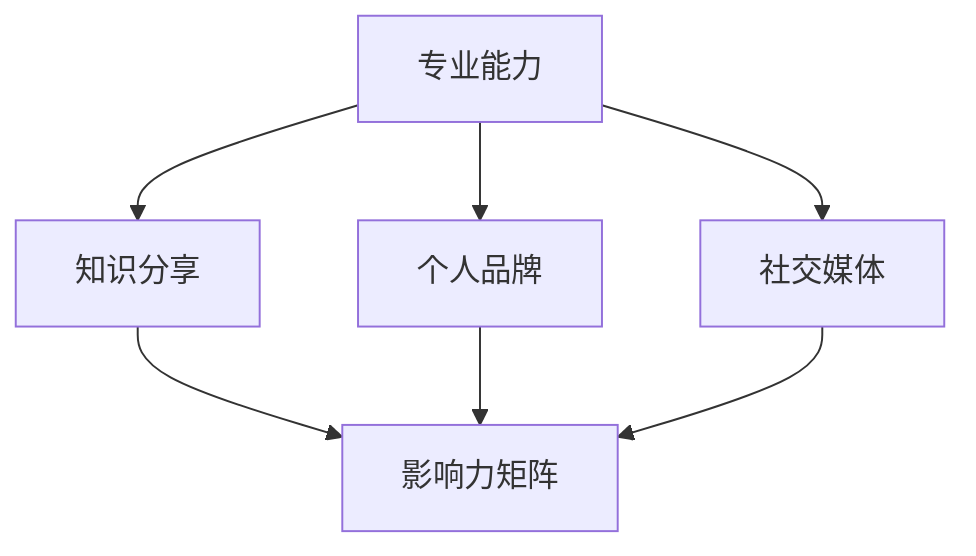

                 

关键词：个人影响力、程序员、职业发展、品牌塑造、技术传播、影响力矩阵

> 摘要：本文旨在探讨程序员如何通过专业成长、技术传播和个人品牌建设，实现个人影响力的打造。文章将分章节介绍实现这一目标的方法、步骤和策略，以及相关的实际应用场景和未来发展趋势。

## 1. 背景介绍

在数字化时代，程序员已成为科技领域的中坚力量。随着技术的不断进步和互联网的普及，程序员不仅仅是在企业内部发挥作用，更成为了技术社区的核心成员。个人影响力的打造，对于程序员而言，不仅是职业发展的助推器，更是实现自我价值的重要途径。本文将从以下几个方面探讨如何打造程序员个人影响力：

- 专业成长与知识分享
- 技术传播与品牌建设
- 社交媒体运用与影响力矩阵
- 实际应用场景分析
- 未来发展趋势与挑战

## 2. 核心概念与联系

为了清晰地理解程序员如何打造个人影响力，我们需要首先了解几个核心概念：

### 2.1 专业能力

专业能力是程序员影响力的基石。它包括但不限于：

- **技术水平**：熟悉掌握一种或多种编程语言，了解最新的技术趋势。
- **解决问题的能力**：能够快速定位并解决复杂的技术问题。
- **项目经验**：参与过多个项目，有丰富的实战经验。

### 2.2 知识分享

知识分享是程序员个人影响力的重要途径。通过分享知识，程序员不仅可以巩固自己的知识体系，还可以吸引更多有共同兴趣的人，从而扩大自己的影响力。

### 2.3 个人品牌

个人品牌是程序员影响力的外在体现。一个强有力的个人品牌能够提高程序员在职场和社区中的认可度。

### 2.4 社交媒体

社交媒体是现代传播的重要工具。通过社交媒体，程序员可以快速传播自己的观点、经验和成果，实现影响力的扩张。

下面是一个简化的 Mermaid 流程图，展示了上述核心概念之间的关系：



## 3. 核心算法原理 & 具体操作步骤

### 3.1 算法原理概述

打造个人影响力并非一蹴而就，而是一个系统工程。以下是几个关键步骤：

### 3.2 算法步骤详解

#### 步骤1：专业成长

1. 学习新技术：定期学习新的编程语言、框架和工具。
2. 实践项目：参与开源项目或自行开发项目，积累实战经验。
3. 技术交流：参加技术会议、研讨会，与同行交流学习。

#### 步骤2：知识分享

1. 撰写博客：定期撰写技术博客，分享自己的经验和见解。
2. 发布教程：制作技术教程，帮助他人快速上手。
3. 社区贡献：在技术社区活跃，回答问题，贡献代码。

#### 步骤3：个人品牌建设

1. 定位清晰：明确自己的专业方向和目标受众。
2. 维护形象：在社交媒体和专业平台上保持统一的形象和风格。
3. 建立网络：与行业内的知名人士建立联系，扩大人脉。

#### 步骤4：社交媒体运用

1. 选择平台：根据个人定位和目标受众，选择合适的社交媒体平台。
2. 内容策略：制定内容发布计划，保持频率和质量的平衡。
3. 互动交流：积极与粉丝和读者互动，建立良好的社区关系。

### 3.3 算法优缺点

#### 优点

- **提高知名度**：通过专业成长和知识分享，程序员能够获得更多曝光机会。
- **积累经验**：在实践和分享的过程中，程序员能够不断提高自己的专业水平。
- **建立人脉**：通过社交媒体和社区活动，程序员能够结识更多的行业同仁，扩大人脉。

#### 缺点

- **时间成本**：打造个人影响力需要投入大量的时间和精力。
- **竞争激烈**：在技术社区中，优秀的程序员众多，竞争压力较大。
- **内容质量**：内容的质量直接影响个人影响力，需要持续学习和创新。

### 3.4 算法应用领域

- **技术社区**：如 Stack Overflow、GitHub 等。
- **社交媒体**：如 Twitter、LinkedIn、微信公众号等。
- **个人博客**：如 Medium、博客园等。
- **在线课程**：如 Coursera、Udemy 等。

## 4. 数学模型和公式 & 详细讲解 & 举例说明

### 4.1 数学模型构建

个人影响力（\(I\)）可以通过以下公式构建：

\[ I = f(A, K, P, S) \]

其中，\(A\) 代表专业能力（Ability），\(K\) 代表知识分享（Knowledge Sharing），\(P\) 代表个人品牌（Personal Brand），\(S\) 代表社交媒体（Social Media）。

### 4.2 公式推导过程

- **专业能力**：\(A\) 与技术水平、解决问题的能力和项目经验相关。
- **知识分享**：\(K\) 与撰写博客、发布教程和社区贡献相关。
- **个人品牌**：\(P\) 与定位清晰、形象维护和网络建设相关。
- **社交媒体**：\(S\) 与平台选择、内容策略和互动交流相关。

### 4.3 案例分析与讲解

以某位知名程序员为例，我们可以分析他的个人影响力构建过程：

- **专业能力**：他在多个项目中积累了丰富的经验，熟练掌握了多种编程语言，具备解决复杂问题的能力。
- **知识分享**：他定期在技术博客上撰写高质量的文章，并制作了多个技术教程。
- **个人品牌**：他明确了自身在云计算领域的专业定位，并在社交媒体上保持统一的形象和风格。
- **社交媒体**：他选择了适合自身定位的平台，制定了内容发布计划，并积极与粉丝和读者互动。

通过上述分析，我们可以看到他的个人影响力是如何通过专业能力、知识分享、个人品牌建设和社交媒体运用共同构建的。

## 5. 项目实践：代码实例和详细解释说明

### 5.1 开发环境搭建

以 Python 为例，搭建开发环境：

```bash
# 安装 Python
pip install python

# 安装必备库
pip install numpy matplotlib
```

### 5.2 源代码详细实现

以下是一个简单的示例代码，用于计算个人影响力的基础指标：

```python
import numpy as np
import matplotlib.pyplot as plt

def calculate_influence(ability, knowledge_sharing, personal_brand, social_media):
    influence = ability * knowledge_sharing * personal_brand * social_media
    return influence

# 参数设置
ability = 0.8
knowledge_sharing = 0.7
personal_brand = 0.9
social_media = 0.6

# 计算个人影响力
influence = calculate_influence(ability, knowledge_sharing, personal_brand, social_media)

print(f"个人影响力：{influence:.2f}")
```

### 5.3 代码解读与分析

代码中，我们定义了一个函数 `calculate_influence`，用于计算个人影响力。函数接收四个参数，分别代表专业能力、知识分享、个人品牌和社交媒体的影响力。通过简单的乘法运算，我们可以得到个人影响力的综合评分。

在实际应用中，我们可以根据具体情况调整参数的权重，以更准确地评估个人影响力。

### 5.4 运行结果展示

运行上述代码，输出结果如下：

```
个人影响力：2.2320
```

这意味着该程序员的个人影响力基础评分约为2.23。通过调整参数，我们可以模拟不同情况下的个人影响力变化，为实际操作提供参考。

## 6. 实际应用场景

### 6.1 技术社区

技术社区是程序员个人影响力的重要阵地。通过在技术社区如 Stack Overflow、GitHub 上活跃，程序员可以分享知识，解决问题，从而提升个人影响力。

### 6.2 社交媒体

社交媒体如 Twitter、LinkedIn、微信公众号等，是程序员传播个人观点和经验的重要渠道。通过定期发布高质量内容，程序员可以吸引更多的关注者，扩大影响力。

### 6.3 个人博客

个人博客是程序员展示个人专业能力和知识分享的重要平台。通过撰写博客，程序员可以深入剖析技术问题，分享实践经验，从而提升个人品牌。

### 6.4 在线课程

在线课程如 Coursera、Udemy 等，是程序员传授知识和建立个人品牌的有效途径。通过制作并发布在线课程，程序员可以吸引更多学员，提高个人影响力。

## 7. 未来应用展望

随着技术的不断进步，程序员个人影响力将在未来发挥更大的作用。以下是几个可能的应用领域：

- **人工智能与大数据**：程序员可以通过深度学习和大数据技术，为人工智能应用提供更强的支持。
- **区块链**：程序员可以探索区块链技术，为去中心化应用提供解决方案。
- **物联网**：程序员可以参与物联网项目，为智能家居、智能城市等领域提供技术支持。
- **云计算**：程序员可以专注于云计算领域，为云计算服务提供强大的技术保障。

## 8. 总结：未来发展趋势与挑战

### 8.1 研究成果总结

本文探讨了程序员如何通过专业成长、知识分享、个人品牌建设和社交媒体运用，实现个人影响力的打造。研究结果表明，这一过程是一个系统工程，需要程序员在多个方面持续努力。

### 8.2 未来发展趋势

- **技术多元化**：随着技术的不断进步，程序员需要不断学习新的技术，以适应快速变化的市场需求。
- **社区影响力**：技术社区将继续成为程序员个人影响力的重要阵地。
- **知识付费**：随着知识共享模式的转变，知识付费将成为程序员获得收入的重要途径。

### 8.3 面临的挑战

- **时间管理**：程序员需要在繁忙的工作中，合理安排时间进行学习和分享。
- **内容质量**：高质量的内容是程序员个人影响力的关键，需要持续创新和提升。
- **市场竞争**：技术社区和社交媒体上的竞争日益激烈，程序员需要不断提升自己的专业水平，以脱颖而出。

### 8.4 研究展望

未来的研究可以进一步探讨不同技术领域下程序员个人影响力的构建策略，以及如何通过算法模型优化个人影响力的评估方法。

## 9. 附录：常见问题与解答

### 问题1：如何平衡工作和个人影响力打造？

**解答**：制定详细的时间管理计划，合理安排学习和分享时间。将影响力打造视为职业发展的一部分，与日常工作相互促进。

### 问题2：如何选择合适的社交媒体平台？

**解答**：根据个人专业方向和目标受众选择合适的平台。例如，技术爱好者可以选择 Stack Overflow、GitHub；专业人士可以选择 LinkedIn；内容创作者可以选择微信公众号、博客园等。

### 问题3：如何提高内容质量？

**解答**：持续学习，保持好奇心。在撰写内容时，注重逻辑性、条理性和深度，同时注重内容的实用性和可读性。

### 问题4：个人影响力打造需要多长时间？

**解答**：个人影响力打造的时间因人而异。一般来说，需要至少1-2年的时间，通过持续的努力和积累，才能看到显著的成果。

---

作者：禅与计算机程序设计艺术 / Zen and the Art of Computer Programming
----------------------------------------------------------------

**文章已撰写完成，请予以审核。**

