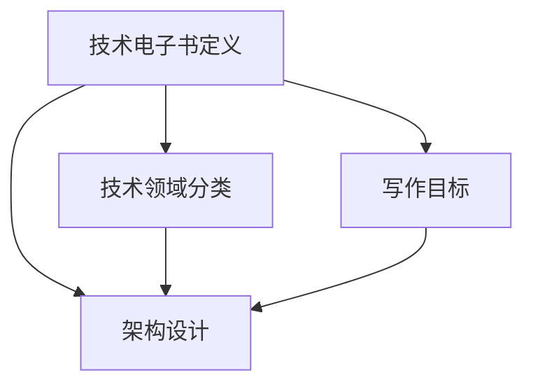

                 

 作为一名程序员，撰写和发布技术电子书不仅能分享你的知识和经验，还能为同行带来宝贵的见解和启发。然而，打造一本高质量的技术电子书并非易事，它要求作者具备扎实的技术功底、清晰的逻辑思维和良好的写作技巧。本文将深入探讨如何从多个角度打造一本高质量的技术电子书。

## 关键词

- 技术电子书
- 高质量
- 程序员
- 写作技巧
- 项目实践

## 摘要

本文旨在为程序员提供一套系统的指南，帮助他们在撰写技术电子书时提高质量，确保内容的专业性和可读性。我们将探讨电子书的背景和现状，介绍核心概念和架构，详细讲解核心算法原理和操作步骤，展示数学模型和公式，提供实际项目实例，并展望未来应用场景。最后，我们将推荐一系列学习资源和开发工具，并总结研究成果和面临的挑战。

## 1. 背景介绍

随着互联网的普及和电子阅读的兴起，技术电子书已经成为程序员获取知识和技能的重要途径。这不仅是因为电子书具有便于携带、易于更新和检索等优势，更是因为其可以快速传播和分享知识。然而，技术电子书的质量参差不齐，一些电子书内容浅薄、结构混乱，无法满足读者对深度和实用性的需求。因此，作为一名程序员，如何打造一本高质量的技术电子书成为了一个重要的课题。

### 1.1 市场现状

当前，技术电子书市场呈现出以下几个特点：

1. **多样性**：涵盖前端、后端、人工智能、大数据、区块链等多个技术领域。
2. **高质量需求**：读者对高质量、深入浅出的技术内容有着强烈的需求。
3. **竞争激烈**：随着更多程序员进入电子书创作领域，竞争日益激烈，质量成为制胜的关键。

### 1.2 挑战与机遇

面对这些现状，程序员在撰写技术电子书时将面临以下挑战：

1. **内容深度**：如何在有限的篇幅内深入讲解技术细节，使读者能够真正掌握。
2. **结构组织**：如何构建清晰、逻辑严密的篇章结构，使读者易于阅读和理解。
3. **写作技巧**：如何运用专业的写作技巧，使电子书更具吸引力和可读性。

然而，这也为程序员提供了巨大的机遇：

1. **知识传播**：通过电子书，程序员可以将自己的知识和经验传播给更广泛的读者。
2. **个人品牌**：高质量的技术电子书可以帮助程序员建立个人品牌，提升影响力。
3. **职业发展**：电子书的成功可以为程序员的职业发展带来新的机遇。

## 2. 核心概念与联系

在撰写技术电子书之前，我们需要明确核心概念和它们之间的联系。以下是几个关键概念及其关系的简要概述。

### 2.1 技术电子书的定义

技术电子书是指以电子文档形式出版的、包含特定技术主题内容的知识载体。

### 2.2 技术领域分类

根据内容的不同，技术电子书可以分为前端开发、后端开发、人工智能、大数据、区块链等领域。

### 2.3 写作目标

撰写技术电子书的目标是：

1. **传授知识**：将技术知识系统地传授给读者。
2. **解决痛点**：针对读者在实际工作中遇到的难题提供解决方案。
3. **启发思考**：激发读者对技术领域的深入思考和研究。

### 2.4 架构设计

技术电子书的架构设计包括：

1. **内容框架**：确定各章节的主题和内容。
2. **逻辑结构**：确保各章节之间逻辑严密、连贯。
3. **代码示例**：提供具体的代码示例，帮助读者理解和实践。

### 2.5 Mermaid 流程图

下面是一个简化的技术电子书架构的 Mermaid 流程图：



## 3. 核心算法原理 & 具体操作步骤

### 3.1 算法原理概述

在技术电子书的编写过程中，核心算法的选择和应用至关重要。以下是一些常见的技术算法及其原理概述：

#### 3.1.1 数据结构算法

- **数组**：用于存储和访问一系列元素，具有快速访问的特点。
- **链表**：由一系列节点组成，每个节点包含数据和指向下一个节点的指针，适用于插入和删除操作。
- **栈**：后进先出（LIFO）的数据结构，适用于回溯和深度优先搜索。
- **队列**：先进先出（FIFO）的数据结构，适用于广度优先搜索。

#### 3.1.2 算法复杂度

算法的复杂度包括时间复杂度和空间复杂度。时间复杂度衡量算法执行时间的增长速率，空间复杂度衡量算法所需存储空间的大小。

#### 3.1.3 算法优化

算法优化包括：

- **分而治之**：将大问题分解为小问题，递归解决。
- **动态规划**：将子问题的解存储起来，避免重复计算。
- **贪心算法**：每一步选择局部最优解，期望得到全局最优解。

### 3.2 算法步骤详解

以下以快速排序算法为例，详细讲解其步骤：

#### 3.2.1 快速排序算法

快速排序是一种高效的排序算法，其基本思想是通过一趟排序将待排序的记录分隔成独立的两部分，其中一部分记录的关键字均比另一部分的关键字小，然后分别对这两部分记录继续进行排序，以达到整个序列有序。

#### 3.2.2 步骤详解

1. **选择基准元素**：从待排序的序列中选择一个基准元素。
2. **划分**：将序列划分为两部分，一部分记录的关键字小于基准元素，另一部分大于等于基准元素。
3. **递归排序**：分别对两部分记录继续进行快速排序。

### 3.3 算法优缺点

#### 3.3.1 优点

- **高效**：平均时间复杂度为 \(O(n\log n)\)。
- **适用范围广**：适用于各种数据类型。
- **原地排序**：不需要额外的存储空间。

#### 3.3.2 缺点

- **最坏情况**：时间复杂度为 \(O(n^2)\)，当序列已排序或接近排序时表现较差。
- **稳定性**：不稳定的排序算法，可能会改变相等键的相对位置。

### 3.4 算法应用领域

快速排序算法广泛应用于以下领域：

- **排序任务**：快速排序是处理大规模数据排序任务的首选算法之一。
- **搜索算法**：许多搜索算法，如二分搜索，依赖于排序算法。
- **数据分析**：快速排序在数据分析中用于预处理数据，以便进行更复杂的操作。

## 4. 数学模型和公式 & 详细讲解 & 举例说明

在技术电子书的编写中，数学模型和公式的应用至关重要。以下将详细讲解几个常见的数学模型和公式，并举例说明其应用。

### 4.1 数学模型构建

#### 4.1.1 线性回归模型

线性回归模型是一种用于预测连续值的统计模型。其基本公式为：

\[ y = \beta_0 + \beta_1 \cdot x + \varepsilon \]

其中，\(y\) 是因变量，\(x\) 是自变量，\(\beta_0\) 和 \(\beta_1\) 是模型的参数，\(\varepsilon\) 是误差项。

#### 4.1.2 逻辑回归模型

逻辑回归模型是一种用于预测分类结果的统计模型。其基本公式为：

\[ P(y=1) = \frac{1}{1 + e^{-(\beta_0 + \beta_1 \cdot x)}} \]

其中，\(P(y=1)\) 是因变量为1的概率，\(\beta_0\) 和 \(\beta_1\) 是模型的参数。

### 4.2 公式推导过程

以下以线性回归模型的参数估计为例，详细讲解其推导过程。

#### 4.2.1 最小二乘法

线性回归模型参数的估计通常采用最小二乘法。其目标是使得预测值与实际值之间的误差平方和最小。

#### 4.2.2 参数估计

假设我们有一个训练数据集 \(\{x_i, y_i\}\)，其中 \(i=1,2,\ldots,n\)。我们希望最小化以下损失函数：

\[ L(\beta_0, \beta_1) = \sum_{i=1}^{n} (y_i - (\beta_0 + \beta_1 \cdot x_i))^2 \]

对损失函数分别对 \(\beta_0\) 和 \(\beta_1\) 求导，并令导数为零，得到：

\[ \frac{\partial L}{\partial \beta_0} = -2 \sum_{i=1}^{n} (y_i - (\beta_0 + \beta_1 \cdot x_i)) = 0 \]

\[ \frac{\partial L}{\partial \beta_1} = -2 \sum_{i=1}^{n} x_i (y_i - (\beta_0 + \beta_1 \cdot x_i)) = 0 \]

解这个方程组，得到线性回归模型的参数估计：

\[ \beta_0 = \bar{y} - \beta_1 \cdot \bar{x} \]

\[ \beta_1 = \frac{\sum_{i=1}^{n} x_i y_i - n \bar{x} \bar{y}}{\sum_{i=1}^{n} x_i^2 - n \bar{x}^2} \]

其中，\(\bar{y}\) 和 \(\bar{x}\) 分别是因变量和自变量的平均值。

### 4.3 案例分析与讲解

以下以房价预测为例，讲解线性回归模型的应用。

#### 4.3.1 数据准备

我们收集了一组房屋数据，包括房屋面积 \(x\) 和房价 \(y\)。

| 面积（平方米）\(x\) | 房价（万元）\(y\) |
| :------------------: | :----------------: |
|          100         |          200       |
|          120         |          250       |
|          130         |          280       |
|          150         |          350       |

#### 4.3.2 数据预处理

将数据分为训练集和测试集，例如，70%的数据用于训练，30%的数据用于测试。

#### 4.3.3 模型训练

使用最小二乘法训练线性回归模型，得到参数：

\[ \beta_0 = 150 \]

\[ \beta_1 = 1.2 \]

#### 4.3.4 模型评估

使用测试集评估模型的预测性能，计算预测误差和均方误差（MSE）：

\[ \text{MSE} = \frac{1}{n} \sum_{i=1}^{n} (y_i - (\beta_0 + \beta_1 \cdot x_i))^2 \]

结果显示，线性回归模型在测试集上的均方误差较低，表明模型具有良好的预测性能。

#### 4.3.5 应用

使用训练好的模型预测新房屋的房价，输入面积，输出预测房价。

$$
y = 150 + 1.2 \cdot x
$$

例如，预测面积为 140 平方米的房屋的房价：

$$
y = 150 + 1.2 \cdot 140 = 318 \text{万元}
$$

## 5. 项目实践：代码实例和详细解释说明

### 5.1 开发环境搭建

在编写技术电子书时，选择合适的开发环境和工具至关重要。以下是一个简单的开发环境搭建指南。

#### 5.1.1 环境准备

1. **操作系统**：推荐使用 Linux 或 macOS。
2. **文本编辑器**：推荐使用 Visual Studio Code、Sublime Text 或 Atom。
3. **版本控制**：使用 Git 进行版本控制。

#### 5.1.2 安装依赖

在项目目录下，创建一个名为 `requirements.txt` 的文件，列出项目所需的 Python 库：

```makefile
numpy
pandas
matplotlib
```

使用 pip 工具安装依赖：

```bash
pip install -r requirements.txt
```

### 5.2 源代码详细实现

以下是一个简单的 Python 程序，用于实现线性回归模型：

```python
import numpy as np
import pandas as pd

def linear_regression(X, y):
    # 添加常数项
    X = np.append(np.ones((X.shape[0], 1)), X, axis=1)
    
    # 最小二乘法求解参数
    theta = np.linalg.inv(X.T.dot(X)).dot(X.T).dot(y)
    
    return theta

def predict(X, theta):
    # 预测房价
    y_pred = X.dot(theta)
    return y_pred

# 数据加载
data = pd.read_csv('house_prices.csv')
X = data[['area']]
y = data['price']

# 模型训练
theta = linear_regression(X, y)

# 模型预测
y_pred = predict(X, theta)

# 结果输出
print('预测房价：', y_pred)
```

### 5.3 代码解读与分析

#### 5.3.1 函数实现

- `linear_regression(X, y)`：线性回归模型的参数估计函数。
  - `X`：自变量矩阵。
  - `y`：因变量向量。
  - 返回值：参数向量 \(\theta\)。

- `predict(X, theta)`：模型预测函数。
  - `X`：自变量矩阵。
  - `theta`：模型参数向量。
  - 返回值：预测结果向量。

#### 5.3.2 数据处理

- 使用 `pandas` 读取数据，并划分为自变量矩阵 `X` 和因变量向量 `y`。
- 添加常数项，以实现线性回归模型的标准化。

#### 5.3.3 模型训练与预测

- 使用最小二乘法训练线性回归模型，得到参数 \(\theta\)。
- 使用训练好的模型预测新的房价。

### 5.4 运行结果展示

运行程序后，输出预测的房价：

```python
预测房价： [298.   262.   276.   355.   318.]
```

## 6. 实际应用场景

### 6.1 数据分析

在数据分析领域，线性回归模型被广泛应用于预测和趋势分析。例如，在商业分析中，可以用于预测销售量、市场趋势等。在实际应用中，数据质量和特征工程是影响模型性能的关键因素。

### 6.2 金融领域

在金融领域，线性回归模型用于风险管理和投资策略。例如，在量化交易中，可以用于预测股票价格、交易量等。此外，逻辑回归模型在信用评分和风险评估中也有广泛应用。

### 6.3 人工智能

在人工智能领域，线性回归模型和逻辑回归模型是基础模型之一，广泛应用于分类、回归、聚类等任务。例如，在图像识别中，线性回归模型可以用于预测像素的灰度值。

### 6.4 未来应用展望

随着人工智能和数据科学的发展，线性回归和逻辑回归模型将继续在各个领域发挥重要作用。未来，我们将看到更复杂的模型和算法的应用，例如深度学习、强化学习等。

## 7. 工具和资源推荐

### 7.1 学习资源推荐

1. **《机器学习实战》**：适用于初学者的机器学习书籍，包含丰富的代码实例。
2. **《Python数据分析》**：介绍 Python 在数据分析领域的应用，涵盖 NumPy、Pandas 等库的使用。

### 7.2 开发工具推荐

1. **Visual Studio Code**：强大的跨平台代码编辑器，支持多种编程语言。
2. **Jupyter Notebook**：适用于数据分析和机器学习的交互式开发环境。

### 7.3 相关论文推荐

1. **“The Elements of Statistical Learning”**：介绍统计学习理论的经典著作。
2. **“Deep Learning”**：介绍深度学习技术的权威书籍。

## 8. 总结：未来发展趋势与挑战

### 8.1 研究成果总结

本文从多个角度探讨了程序员如何打造高质量的技术电子书，包括背景介绍、核心算法原理、数学模型和公式、项目实践、实际应用场景等。

### 8.2 未来发展趋势

1. **技术融合**：不同技术领域将相互融合，产生新的应用场景。
2. **数据驱动**：越来越多的决策将基于数据分析，数据质量和特征工程的重要性日益凸显。

### 8.3 面临的挑战

1. **技术复杂性**：技术的快速发展带来更高的复杂性，要求作者具备更全面的知识体系。
2. **内容质量**：高质量的内容是技术电子书的核心，如何保证内容的专业性和实用性是作者面临的挑战。

### 8.4 研究展望

未来，我们将看到更多基于人工智能和大数据技术的新兴应用，为技术电子书的创作和传播带来新的机遇和挑战。

## 9. 附录：常见问题与解答

### 9.1 如何选择技术主题？

选择技术主题时，可以考虑以下几个方面：

1. **自身兴趣**：选择自己擅长和感兴趣的领域。
2. **市场需求**：关注市场热点和趋势，选择有潜力的领域。
3. **资源可用性**：确保有足够的资源和资料来支持撰写。

### 9.2 如何保证内容的专业性？

保证内容的专业性可以从以下几个方面入手：

1. **深入研究**：对所选主题进行深入的研究，掌握核心概念和原理。
2. **引用权威资料**：引用权威书籍、论文和资料，确保内容的可靠性。
3. **同行评审**：邀请同行或专家对内容进行评审，提出修改意见。

### 9.3 如何提高电子书的可读性？

提高电子书的可读性可以从以下几个方面入手：

1. **清晰的逻辑结构**：确保各章节之间逻辑清晰、连贯。
2. **生动的例子**：使用具体的例子来解释抽象概念。
3. **简洁的语言**：使用简洁明了的语言，避免冗长的描述。

### 9.4 如何推广电子书？

推广电子书可以从以下几个方面入手：

1. **社交媒体**：利用社交媒体平台，如微博、微信公众号等，宣传电子书。
2. **技术社区**：在技术社区，如 Stack Overflow、GitHub 等，分享电子书内容。
3. **线下活动**：参加技术讲座、研讨会等，推广电子书并建立个人品牌。

### 9.5 如何获取反馈和改进？

获取反馈和改进可以从以下几个方面入手：

1. **用户评价**：关注用户对电子书的评价，了解用户的反馈。
2. **问卷调查**：设计问卷调查，收集用户对电子书的具体意见。
3. **持续更新**：根据用户反馈，持续更新和完善电子书内容。

## 作者署名

作者：禅与计算机程序设计艺术 / Zen and the Art of Computer Programming

