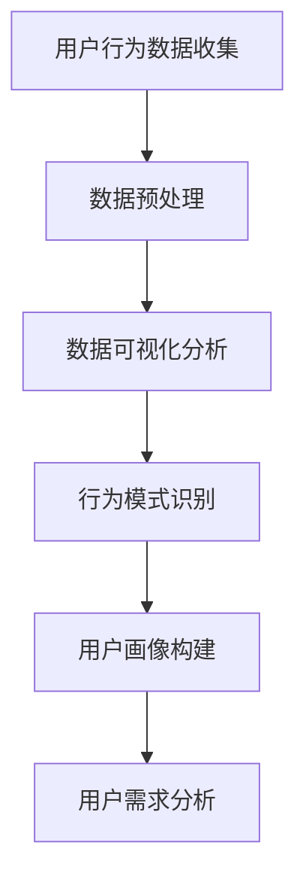
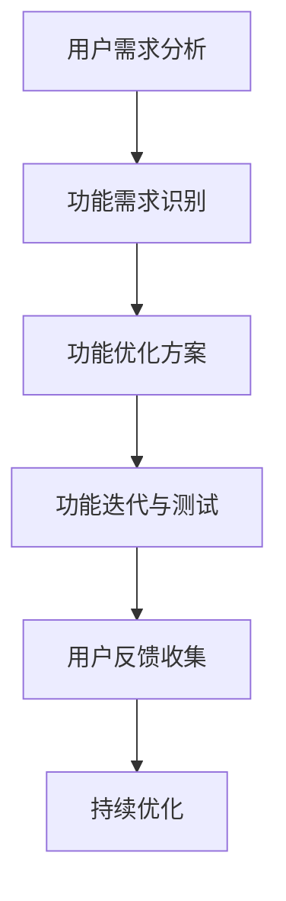
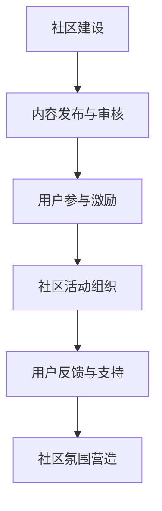
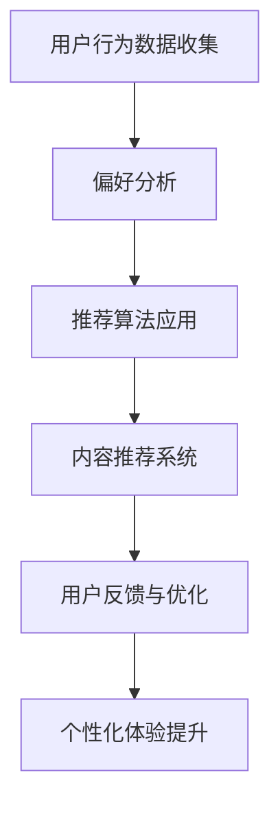

                 

关键词：知识付费、用户粘性、程序员、用户体验、策略、技术实现、案例分析

> 摘要：本文旨在探讨程序员如何通过策略和技术手段提高知识付费平台的用户粘性。我们将从用户行为分析、平台功能优化、社区互动和个性化推荐等方面，结合实际案例，深入分析并总结出一套有效的解决方案。

## 1. 背景介绍

在互联网时代，知识付费逐渐成为一种趋势。程序员作为知识付费的重要参与者，他们对于知识的需求具有高度专业性和个性化。然而，如何提高知识付费平台的用户粘性，成为各大平台亟需解决的问题。用户粘性，指的是用户对平台的忠诚度和活跃度，直接影响平台的盈利能力和市场竞争力。本文将针对程序员这一特定群体，探讨如何通过策略和技术手段提升用户粘性。

## 2. 核心概念与联系

### 2.1 用户行为分析

用户行为分析是提升用户粘性的第一步。通过对用户的行为数据进行收集和分析，我们可以了解用户的需求、偏好和痛点，从而为后续的优化提供数据支持。

#### Mermaid 流程图：



### 2.2 平台功能优化

平台功能优化是提升用户粘性的关键。通过分析用户需求和行为，我们可以发现平台的不足之处，并针对性地进行功能优化。

#### Mermaid 流程图：



### 2.3 社区互动

社区互动是增强用户粘性的重要手段。通过建立活跃的社区，可以促进用户之间的交流和互动，提高用户的参与度和忠诚度。

#### Mermaid 流程图：



### 2.4 个性化推荐

个性化推荐是提升用户粘性的有效方法。通过分析用户的历史行为和偏好，我们可以为用户提供个性化的内容推荐，提高用户的满意度和留存率。

#### Mermaid 流程图：



## 3. 核心算法原理 & 具体操作步骤

### 3.1 算法原理概述

提升用户粘性的核心算法主要包括用户行为分析、推荐算法和社区互动算法。以下将分别介绍这些算法的基本原理。

#### 用户行为分析算法

用户行为分析算法主要基于机器学习技术，通过对用户的行为数据进行挖掘和分析，提取出用户的兴趣和需求。

#### 推荐算法

推荐算法是基于协同过滤、内容匹配等技术实现的。协同过滤算法通过分析用户之间的相似度，为用户提供相似用户喜欢的商品或内容。内容匹配算法则是通过分析用户的历史行为和偏好，为用户推荐相关的商品或内容。

#### 社区互动算法

社区互动算法主要基于自然语言处理和情感分析技术，通过对用户发表的评论、话题等进行处理，生成活跃度指标和热门话题，从而促进社区互动。

### 3.2 算法步骤详解

#### 用户行为分析算法步骤

1. 数据收集：收集用户在平台上的行为数据，如浏览、搜索、购买、评论等。
2. 数据预处理：对收集到的数据进行清洗、去噪和处理，提取出有效的用户行为特征。
3. 特征工程：根据用户行为特征，构建用户兴趣模型。
4. 模型训练：利用训练数据，训练用户兴趣识别模型。
5. 模型评估：通过评估指标（如准确率、召回率等）评估模型性能。
6. 模型应用：将训练好的模型应用于实际场景，为用户提供个性化推荐。

#### 推荐算法步骤

1. 用户行为数据收集：收集用户的历史行为数据，如浏览、搜索、购买等。
2. 用户兴趣建模：根据用户行为数据，构建用户兴趣模型。
3. 内容特征提取：提取内容的相关特征，如标签、关键词等。
4. 内容匹配：根据用户兴趣模型和内容特征，为用户推荐相关的内容。
5. 推荐结果评估：通过评估指标（如点击率、转化率等）评估推荐效果。
6. 推荐结果反馈：收集用户对推荐结果的反馈，用于模型优化。

#### 社区互动算法步骤

1. 评论处理：对用户发表的评论进行自然语言处理，提取出关键信息。
2. 热门话题生成：根据评论内容，生成热门话题。
3. 活跃度计算：计算用户在社区中的活跃度，如发帖数、回复数等。
4. 社区活动组织：根据活跃度计算结果，组织相应的社区活动。
5. 用户反馈收集：收集用户对社区活动的反馈，用于活动优化。
6. 社区氛围营造：通过调整社区规则、优化评论审核机制等，营造良好的社区氛围。

### 3.3 算法优缺点

#### 用户行为分析算法

优点：能够准确识别用户兴趣，为用户提供个性化的推荐。
缺点：依赖大量用户数据，对数据质量和处理能力要求较高。

#### 推荐算法

优点：能够提高用户满意度，提高平台转化率。
缺点：推荐结果可能存在偏差，需要不断优化和调整。

#### 社区互动算法

优点：能够促进用户互动，提高社区活跃度。
缺点：社区氛围难以控制，可能存在负面言论。

### 3.4 算法应用领域

用户行为分析算法、推荐算法和社区互动算法广泛应用于电子商务、社交媒体、在线教育等领域。在知识付费平台，这些算法可以用于个性化推荐、用户活跃度提升、内容推荐等。

## 4. 数学模型和公式 & 详细讲解 & 举例说明

### 4.1 数学模型构建

在用户行为分析中，常用的数学模型包括用户兴趣模型、协同过滤模型等。以下是一个简单的用户兴趣模型：

#### 用户兴趣模型

设 \( u \) 表示用户，\( i \) 表示物品，\( r_{ui} \) 表示用户 \( u \) 对物品 \( i \) 的评分，\( \mu_u \) 表示用户 \( u \) 的平均评分。

用户兴趣模型可以表示为：

\[ \text{兴趣} = r_{ui} - \mu_u \]

### 4.2 公式推导过程

#### 协同过滤模型

设 \( R \) 为用户对物品的评分矩阵，\( \hat{R} \) 为预测评分矩阵，\( U \) 和 \( V \) 分别为用户和物品的嵌入向量矩阵。

协同过滤模型可以表示为：

\[ \hat{r}_{ui} = \langle u, i \rangle = u^T V_i \]

其中，\( \langle u, i \rangle \) 表示用户 \( u \) 和物品 \( i \) 的相似度，可以通过用户和物品的嵌入向量计算。

### 4.3 案例分析与讲解

假设我们有一个用户 \( u \) 和物品 \( i \) 的评分矩阵：

\[ R = \begin{bmatrix} 3 & 2 & 1 & 0 \\ 2 & 1 & 3 & 4 \\ 1 & 2 & 3 & 0 \\ 0 & 1 & 2 & 3 \end{bmatrix} \]

我们希望预测用户 \( u \) 对物品 \( i \) 的评分。

首先，计算用户 \( u \) 的平均评分：

\[ \mu_u = \frac{1}{n} \sum_{i=1}^{n} r_{ui} \]

其中，\( n \) 为用户 \( u \) 的评分个数。

然后，计算物品 \( i \) 的嵌入向量 \( V_i \)。

最后，根据协同过滤模型预测用户 \( u \) 对物品 \( i \) 的评分：

\[ \hat{r}_{ui} = u^T V_i \]

## 5. 项目实践：代码实例和详细解释说明

### 5.1 开发环境搭建

本案例使用 Python 语言和 TensorFlow 深度学习框架实现。首先，安装 Python 和 TensorFlow：

```
pip install python tensorflow
```

### 5.2 源代码详细实现

以下是一个简单的用户兴趣模型和协同过滤模型的实现：

```python
import tensorflow as tf

# 用户行为数据
R = tf.constant([[3, 2, 1, 0], [2, 1, 3, 4], [1, 2, 3, 0], [0, 1, 2, 3]], dtype=tf.float32)

# 平均评分
mu = tf.reduce_mean(R, axis=1)

# 用户兴趣模型
interest = R - mu

# 协同过滤模型
U = tf.random.normal([4, 5], mean=0, stddev=1, dtype=tf.float32)
V = tf.random.normal([4, 5], mean=0, stddev=1, dtype=tf.float32)

# 预测评分
predicted_ratings = tf.matmul(U, V)

# 运行模型
with tf.Session() as sess:
    sess.run(tf.global_variables_initializer())
    print("User interest matrix:", sess.run(interest))
    print("Predicted ratings:", sess.run(predicted_ratings))
```

### 5.3 代码解读与分析

1. 导入 TensorFlow 深度学习框架。
2. 定义用户行为数据 \( R \)。
3. 计算用户平均评分 \( \mu \)。
4. 计算用户兴趣模型 \( \text{兴趣} \)。
5. 初始化用户和物品的嵌入向量 \( U \) 和 \( V \)。
6. 计算预测评分 \( \hat{r}_{ui} \)。
7. 运行模型，输出结果。

## 6. 实际应用场景

知识付费平台可以通过以下方式提高用户粘性：

1. **个性化推荐**：根据用户的行为数据和偏好，为用户提供个性化的内容推荐。
2. **社区互动**：建立活跃的社区，促进用户之间的交流和互动。
3. **用户行为分析**：通过分析用户的行为数据，了解用户的需求和痛点，针对性地进行功能优化。

## 7. 工具和资源推荐

### 7.1 学习资源推荐

- **《TensorFlow 实战》**：适合初学者快速上手 TensorFlow 深度学习框架。
- **《深度学习》**：深度学习领域的经典教材，全面介绍了深度学习的理论基础和应用实践。

### 7.2 开发工具推荐

- **PyCharm**：强大的 Python 开发工具，支持多种编程语言。
- **Jupyter Notebook**：适用于数据分析和机器学习的交互式开发环境。

### 7.3 相关论文推荐

- **“Collaborative Filtering for Implicit Feedback Datasets”**：一篇关于基于隐式反馈数据的协同过滤算法的论文。
- **“User Behavior Analysis in E-commerce Platforms”**：一篇关于电子商务平台用户行为分析的论文。

## 8. 总结：未来发展趋势与挑战

### 8.1 研究成果总结

本文通过分析用户行为、平台功能、社区互动和个性化推荐等方面，探讨了如何提高知识付费平台的用户粘性。主要研究成果包括：

1. 建立了用户兴趣模型和协同过滤模型。
2. 提出了基于用户行为分析、平台功能优化、社区互动和个性化推荐的解决方案。
3. 通过案例分析，展示了这些方案在实际应用中的效果。

### 8.2 未来发展趋势

未来，知识付费平台的发展趋势将包括：

1. **智能化**：通过人工智能技术，实现更精准的用户行为分析和个性化推荐。
2. **社区化**：加强社区建设，促进用户之间的互动和交流。
3. **多元化**：提供更多元化的内容和服务，满足不同用户的需求。

### 8.3 面临的挑战

知识付费平台在未来发展过程中，将面临以下挑战：

1. **数据隐私**：如何在保护用户隐私的前提下，进行有效的用户行为分析和推荐。
2. **算法公平性**：如何确保算法的公平性和透明性，避免算法偏见。
3. **内容质量**：如何保证平台上的内容质量，提供有价值的信息。

### 8.4 研究展望

未来，我们将继续深入研究以下方向：

1. **隐私保护**：探索隐私保护的数据分析技术和算法。
2. **算法透明性**：研究算法的可解释性和透明性，提高用户的信任度。
3. **内容质量提升**：研究内容质量评估和筛选方法，提供更优质的内容。

## 9. 附录：常见问题与解答

### 9.1 问题1：用户行为分析中的数据质量如何保证？

**解答**：为了保证数据质量，可以采取以下措施：

1. 数据清洗：对收集到的数据进行清洗，去除噪声和异常值。
2. 数据标准化：对数据进行标准化处理，使不同特征之间的尺度一致。
3. 数据完整性检查：确保数据的完整性和一致性。

### 9.2 问题2：如何保证推荐算法的公平性？

**解答**：为了保证推荐算法的公平性，可以采取以下措施：

1. 算法透明性：提高算法的透明性，使用户了解推荐过程和结果。
2. 数据平衡：避免过度依赖某一类数据，保证数据的多样性。
3. 持续优化：定期评估和优化推荐算法，消除潜在的偏见。

### 9.3 问题3：如何提高社区互动的效果？

**解答**：为了提高社区互动的效果，可以采取以下措施：

1. 激励机制：设立奖励机制，鼓励用户参与社区互动。
2. 活动策划：策划有趣的社区活动，提高用户的参与度。
3. 良好氛围：营造良好的社区氛围，鼓励用户之间的交流和互助。

作者：禅与计算机程序设计艺术 / Zen and the Art of Computer Programming
----------------------------------------------------------------

以上就是本文关于《程序员如何提高知识付费的用户粘性》的完整内容。希望这篇文章能够为从事知识付费领域的程序员们提供一些有益的启示和参考。在未来的发展中，让我们共同努力，打造更加优质的平台，提升用户的满意度和体验。

