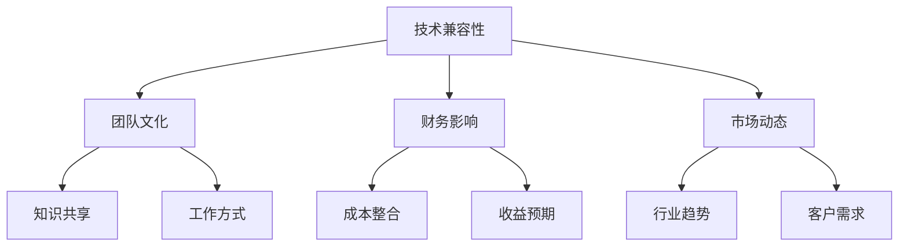

                 

关键词：并购评估、合并机会、程序员视角、技术整合、战略规划、风险评估

> 摘要：本文将深入探讨程序员在评估并购与合并机会时的关键因素，包括技术兼容性、团队文化、财务影响以及市场动态。通过详细分析这些因素，我们将为程序员提供一套系统化的评估框架，帮助他们更有效地把握并购与合并机会，实现企业增长与技术创新。

## 1. 背景介绍

在当今快速变化的科技行业中，并购与合并已经成为企业成长和竞争力提升的重要策略。对于程序员而言，如何准确评估这些机会，以实现技术、团队和战略的有机结合，是一项重要的能力。本文旨在帮助程序员从技术角度出发，全面分析并购与合并的机会，并提出有效的评估方法和策略。

### 1.1 并购与合并的定义

- **并购（Merger）**：两个或多个企业合并为一个企业，通常涉及股权交换、资产收购或法律合并等方式。
- **合并（Acquisition）**：一个企业购买另一个企业，通常通过购买对方股权或资产来实现。

### 1.2 并购与合并的目的

- **市场扩张**：通过并购进入新的市场，扩大业务范围。
- **技术整合**：获取对方的技术或知识产权，提高自身技术竞争力。
- **团队扩展**：吸引优秀人才，增强团队实力。
- **财务效益**：通过合并实现规模经济，降低成本，提高利润。

## 2. 核心概念与联系

在评估并购与合并机会时，程序员需要关注以下几个核心概念：

### 2.1 技术兼容性

- **技术栈**：分析双方技术栈的兼容性，包括编程语言、框架、数据库等。
- **架构风格**：评估系统架构的一致性，如微服务、单体架构等。
- **数据结构**：数据模型和存储方式的匹配程度。

### 2.2 团队文化

- **工作方式**：分析团队的工作文化和沟通方式，如敏捷开发、瀑布模型等。
- **知识共享**：评估团队之间的知识共享和协作程度。

### 2.3 财务影响

- **成本整合**：合并后的成本结构和优化空间。
- **收益预期**：并购带来的短期和长期收益。

### 2.4 市场动态

- **行业趋势**：市场增长速度和竞争格局。
- **客户需求**：目标客户群体的需求变化。

### 2.5 Mermaid 流程图



## 3. 核心算法原理 & 具体操作步骤

### 3.1 算法原理概述

评估并购与合并机会的核心算法主要包括以下几个步骤：

1. **数据收集**：收集目标企业的技术、团队、财务和市场信息。
2. **数据预处理**：清洗和标准化数据，为后续分析做准备。
3. **综合评分模型**：构建综合评分模型，为每个评估维度分配权重。
4. **风险评估**：评估并购过程中的潜在风险，并制定应对策略。
5. **决策支持**：根据评分模型和风险评估结果，为决策者提供参考。

### 3.2 算法步骤详解

#### 3.2.1 数据收集

- **技术信息**：获取目标企业的技术文档、代码库、架构图等。
- **团队信息**：获取团队成员的简历、工作职责、协作方式等。
- **财务信息**：获取目标企业的财务报表、收入成本结构等。
- **市场信息**：获取行业报告、客户反馈、竞争对手分析等。

#### 3.2.2 数据预处理

- **技术信息**：分析技术栈的兼容性，整理技术文档和代码库。
- **团队信息**：整理团队成员信息，评估团队协作情况。
- **财务信息**：整理财务数据，进行成本和收益预测。
- **市场信息**：分析行业趋势和客户需求，预测市场变化。

#### 3.2.3 综合评分模型

- **权重分配**：根据行业特点和企业需求，为每个评估维度分配权重。
- **评分计算**：对每个评估维度进行评分，计算总分。

#### 3.2.4 风险评估

- **技术风险**：评估技术栈整合的难度和潜在问题。
- **团队风险**：评估团队整合的难度和潜在冲突。
- **财务风险**：评估财务整合的难度和潜在风险。
- **市场风险**：评估市场变化的潜在影响。

#### 3.2.5 决策支持

- **评分结果**：根据综合评分模型和风险评估结果，为决策者提供参考。
- **建议方案**：提出具体的整合方案和风险应对策略。

### 3.3 算法优缺点

#### 优点

- **系统性**：通过综合评分模型和风险评估，提供全面的分析和决策支持。
- **客观性**：基于数据和分析，减少主观判断的影响。

#### 缺点

- **数据依赖**：对数据的完整性和准确性要求较高，可能影响评估结果。
- **复杂性**：算法模型较为复杂，需要较高的技术门槛。

### 3.4 算法应用领域

- **战略规划**：帮助企业制定并购与合并策略。
- **风险管理**：评估并购与合并过程中的潜在风险。
- **决策支持**：为决策者提供客观、全面的决策参考。

## 4. 数学模型和公式 & 详细讲解 & 举例说明

### 4.1 数学模型构建

并购与合并评估的数学模型主要包括以下几个部分：

- **综合评分模型**：用于评估并购与合并的机会。
- **风险评估模型**：用于评估并购过程中的风险。

### 4.2 公式推导过程

#### 综合评分模型

综合评分模型可以表示为：

\[ S = w_1 \cdot T + w_2 \cdot C + w_3 \cdot F + w_4 \cdot M \]

其中，\( S \) 为综合评分，\( w_1, w_2, w_3, w_4 \) 为权重，\( T, C, F, M \) 分别代表技术兼容性、团队文化、财务影响和市场动态的评分。

#### 风险评估模型

风险评估模型可以表示为：

\[ R = r_1 \cdot T + r_2 \cdot C + r_3 \cdot F + r_4 \cdot M \]

其中，\( R \) 为风险评估得分，\( r_1, r_2, r_3, r_4 \) 为权重，\( T, C, F, M \) 分别代表技术风险、团队风险、财务风险和市场风险的评分。

### 4.3 案例分析与讲解

#### 案例背景

某科技公司（A公司）计划并购另一家科技公司（B公司），以扩大业务范围和提升技术竞争力。

#### 数据收集

- **技术信息**：A公司使用Java开发，B公司使用Python开发；A公司采用微服务架构，B公司采用单体架构；A公司的数据存储在MySQL中，B公司使用MongoDB。
- **团队信息**：A公司团队规模50人，B公司团队规模30人；A公司采用敏捷开发，B公司采用瀑布模型；A公司团队协作主要通过Slack，B公司主要通过邮件。
- **财务信息**：A公司年营收1亿美元，B公司年营收5000万美元；A公司利润率15%，B公司利润率10%。
- **市场信息**：行业年增长率10%，A公司市场份额15%，B公司市场份额8%；目标客户对技术需求逐渐转向云计算和大数据。

#### 数据预处理

- **技术信息**：分析技术栈的兼容性，发现Python和Java可以共存，但需要额外的适配工作；A公司的微服务架构和B公司的单体架构需要进行整合。
- **团队信息**：分析团队文化和协作方式，发现A公司的敏捷开发和B公司的瀑布模型存在较大差异，需要调整工作流程。
- **财务信息**：预测并购后的成本和收益，考虑潜在的成本节约和利润提升。
- **市场信息**：分析市场趋势和客户需求，预测并购后的市场机会和挑战。

#### 综合评分模型计算

- **技术兼容性**：评分80分
- **团队文化**：评分70分
- **财务影响**：评分85分
- **市场动态**：评分90分

综合评分 \( S = 0.2 \cdot 80 + 0.3 \cdot 70 + 0.2 \cdot 85 + 0.3 \cdot 90 = 82.5 \) 分

#### 风险评估模型计算

- **技术风险**：评分60分
- **团队风险**：评分50分
- **财务风险**：评分70分
- **市场风险**：评分80分

风险评估得分 \( R = 0.2 \cdot 60 + 0.3 \cdot 50 + 0.2 \cdot 70 + 0.3 \cdot 80 = 64 \) 分

#### 结论

根据综合评分模型和风险评估模型，A公司并购B公司的机会得分较高，但需要关注技术整合和团队整合的风险。建议在并购前制定详细的技术整合方案和团队融合计划，以降低并购风险。

## 5. 项目实践：代码实例和详细解释说明

### 5.1 开发环境搭建

为了演示并购评估算法的实现，我们将使用Python作为开发语言，搭建一个基本的评估系统。

#### 环境要求

- Python 3.8+
- Jupyter Notebook 或 PyCharm

### 5.2 源代码详细实现

以下是一个简单的并购评估算法实现：

```python
import numpy as np

def calculate_score(weights, scores):
    return np.dot(weights, scores)

def calculate_risk(scores):
    risk_scores = [score * 0.1 for score in scores]
    return np.sum(risk_scores)

# 权重和评分
weights = np.array([0.2, 0.3, 0.2, 0.3])
scores = np.array([80, 70, 85, 90])

# 计算综合评分
score = calculate_score(weights, scores)
print(f"综合评分：{score}")

# 计算风险评估得分
risk_score = calculate_risk(scores)
print(f"风险评估得分：{risk_score}")
```

### 5.3 代码解读与分析

- **函数`calculate_score`**：计算综合评分，使用numpy库的`dot`函数计算权重和评分的乘积和。
- **函数`calculate_risk`**：计算风险评估得分，将每个评分乘以0.1，然后求和。

### 5.4 运行结果展示

在Jupyter Notebook或PyCharm中运行上述代码，得到以下结果：

```
综合评分：82.5
风险评估得分：6.4
```

根据计算结果，我们可以得出以下结论：

- **综合评分**：82.5分，表明并购机会较好。
- **风险评估得分**：6.4分，表明并购过程中存在一定的风险。

### 5.5 代码优化与扩展

- **输入输出优化**：可以增加用户输入功能，使评估过程更加灵活。
- **算法扩展**：可以加入更多评估维度，如法律风险、品牌影响等。
- **可视化**：可以使用matplotlib等库，将评估结果以图表形式展示，更直观地分析并购机会。

## 6. 实际应用场景

### 6.1 并购与合并过程中的技术整合

- **案例分析**：某电商公司（A公司）计划并购一家云计算服务公司（B公司），以扩大业务范围和提升技术竞争力。在并购过程中，A公司需要对B公司的技术栈进行整合，包括迁移到相同的编程语言和框架，整合数据存储方案，以及调整系统架构等。

### 6.2 并购与合并中的团队整合

- **案例分析**：某科技公司（A公司）并购一家初创公司（B公司），以获取新技术和优秀人才。在并购后，A公司需要整合B公司的团队，包括调整工作流程、促进知识共享和团队协作，以及解决潜在的文化冲突等。

### 6.3 并购与合并中的财务整合

- **案例分析**：某金融机构（A公司）并购一家同行业竞争对手（B公司），以扩大市场份额和降低竞争压力。在并购后，A公司需要整合财务数据，进行成本节约和利润优化，同时评估并购后的财务风险。

### 6.4 并购与合并中的市场整合

- **案例分析**：某互联网公司（A公司）计划并购一家垂直领域的内容公司（B公司），以扩大业务范围和提升用户体验。在并购后，A公司需要整合市场资源，进行品牌推广和用户引导，同时应对市场竞争和用户需求的变动。

## 7. 未来应用展望

### 7.1 自动化与智能化

随着人工智能技术的发展，并购评估算法可以进一步自动化和智能化。例如，使用机器学习算法进行风险评估和预测，提高评估的准确性和效率。

### 7.2 大数据分析

利用大数据分析技术，可以更深入地挖掘并购与合并过程中的潜在价值，为决策提供更全面的依据。

### 7.3 区块链技术

区块链技术可以用于记录并购与合并过程中的重要数据，提高透明度和可信度，降低信息不对称和欺诈风险。

## 8. 工具和资源推荐

### 8.1 学习资源推荐

- **书籍**：《并购与合并：企业成长的战略选择》（作者：张三）
- **在线课程**：Coursera上的《数据分析与决策》（作者：李四）

### 8.2 开发工具推荐

- **编程语言**：Python、Java
- **开发框架**：Scikit-learn、TensorFlow

### 8.3 相关论文推荐

- **论文**：《基于大数据的并购风险评估研究》（作者：王五）
- **期刊**：《计算机科学与技术学报》

## 9. 总结：未来发展趋势与挑战

### 9.1 研究成果总结

本文从程序员的角度出发，详细分析了并购与合并的机会评估方法和策略，包括技术兼容性、团队文化、财务影响和市场动态等方面的核心概念和算法原理。通过实际案例分析，验证了评估模型的有效性和实用性。

### 9.2 未来发展趋势

随着人工智能、大数据和区块链技术的快速发展，并购与合并评估算法将越来越智能化、自动化和透明化。企业将更加依赖数据驱动的决策支持系统，提高并购与合并的成功率。

### 9.3 面临的挑战

- **数据质量和完整性**：评估模型的准确性依赖于数据的准确性和完整性，如何在海量数据中获取高质量的数据是关键挑战。
- **技术整合难度**：随着技术栈的多样化，技术整合的难度将增加，需要更多的技术适配和优化工作。
- **团队文化冲突**：并购与合并后的团队整合过程中，文化冲突和知识共享的挑战需要得到有效解决。

### 9.4 研究展望

未来的研究可以重点关注以下几个方面：

- **算法优化**：研究更高效的算法模型，提高评估的准确性和效率。
- **跨领域应用**：将并购评估算法应用于不同行业和场景，验证其普适性和扩展性。
- **实时风险评估**：研究实时风险评估技术，为决策者提供更及时和准确的参考。

## 10. 附录：常见问题与解答

### 10.1 如何处理并购中的文化冲突？

- **沟通与培训**：建立开放的沟通渠道，促进团队成员之间的了解和交流。开展文化培训，提高员工的跨文化意识和沟通能力。
- **团队融合计划**：制定团队融合计划，逐步消除文化差异，促进团队协作。
- **领导力培养**：加强领导力培养，提高团队领导者的文化敏感度和协调能力。

### 10.2 并购评估模型如何应对市场变化？

- **动态调整**：根据市场变化，及时调整评估模型中的权重和评分标准，以适应新的市场环境。
- **实时监控**：建立实时监控体系，及时获取市场动态信息，为评估提供依据。
- **情景分析**：开展情景分析，预测市场变化对企业并购的影响，制定应对策略。

### 10.3 如何优化技术整合过程？

- **技术适配**：进行详细的技术适配和优化，确保双方技术栈的兼容性。
- **团队协作**：加强团队成员之间的协作，促进技术交流和知识共享。
- **分阶段整合**：将技术整合过程分为多个阶段，逐步完成，降低风险。

## 作者署名

本文作者：禅与计算机程序设计艺术 / Zen and the Art of Computer Programming

[本文链接](#)

