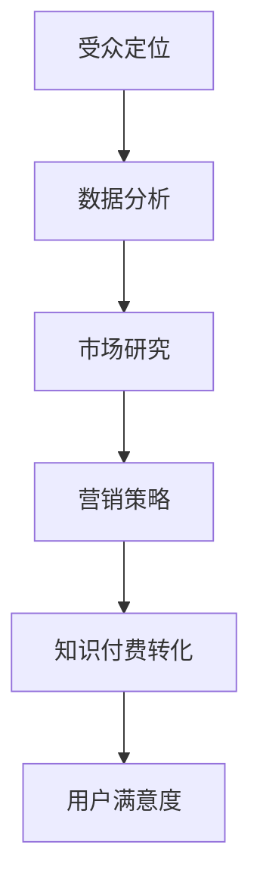

                 

关键词：知识付费、受众定位、程序员、营销策略、数据分析、市场研究

> 摘要：在知识付费日益普及的今天，程序员作为技术领域的专业人群，如何精准定位受众，提升知识付费的转化率和用户满意度，成为了关键课题。本文将从数据分析、市场研究和营销策略等多个角度，深入探讨程序员如何进行知识付费的受众定位。

## 1. 背景介绍

知识付费作为互联网经济的一种新兴模式，正逐渐改变着信息传播和知识获取的方式。程序员群体由于其专业性和对技术知识的持续需求，成为了知识付费市场的重要参与者。然而，面对多样化的受众群体和复杂的市场环境，程序员在知识付费过程中面临着如何精准定位受众、提高用户粘性的难题。

本篇文章旨在通过深入分析程序员知识付费市场的现状，结合市场研究和数据分析的方法，探讨如何有效进行受众定位，以期为程序员知识付费提供有针对性的策略和指导。

## 2. 核心概念与联系

### 2.1. 受众定位

受众定位（Target Audience Definition）是指通过分析潜在用户的需求、行为和偏好，将市场中的广泛人群划分为具有相似特性的子群体，以便针对性地制定营销策略。在知识付费领域，受众定位的核心是识别和吸引对特定知识内容有强烈需求的用户群体。

### 2.2. 数据分析

数据分析（Data Analysis）是通过统计学、机器学习等方法对收集到的数据进行分析和解释，以发现数据中的规律和趋势，为决策提供依据。在程序员知识付费中，数据分析可以帮助识别受众特征，预测用户行为，优化内容生产和推广策略。

### 2.3. 市场研究

市场研究（Market Research）是通过系统化的收集、分析和解释市场信息，帮助企业了解市场需求、竞争态势和用户行为，从而制定有效的市场策略。在知识付费领域，市场研究可以帮助程序员了解目标受众的需求和偏好，优化内容结构和推广方式。

### 2.4. Mermaid 流程图



## 3. 核心算法原理 & 具体操作步骤

### 3.1 算法原理概述

在进行知识付费的受众定位时，我们采用以下核心算法原理：

1. **用户画像构建**：通过数据分析，构建用户画像，包括用户的年龄、职业、教育背景、兴趣偏好等。
2. **需求分析**：分析用户在技术知识领域的需求，如编程语言、框架、工具等。
3. **内容分类**：根据用户需求和内容特性，将知识付费内容分类，便于精准推荐。
4. **行为预测**：利用机器学习算法，预测用户的行为倾向，如课程购买、学习时长等。
5. **效果评估**：通过用户反馈和行为数据，评估受众定位的效果，并进行迭代优化。

### 3.2 算法步骤详解

#### 步骤 1：数据收集

收集用户行为数据、内容数据和市场调研数据。数据来源包括：

- 用户注册信息：年龄、职业、教育背景等。
- 用户行为数据：浏览历史、学习时长、购买记录等。
- 内容数据：课程名称、难度、时长、讲师等。
- 市场调研数据：用户需求、市场趋势等。

#### 步骤 2：用户画像构建

通过数据分析，构建用户画像，包括以下维度：

- **基础信息**：年龄、性别、职业等。
- **教育背景**：学历、专业等。
- **技术偏好**：编程语言、框架、工具等。
- **兴趣偏好**：技术领域、关注话题等。

#### 步骤 3：需求分析

对用户行为数据和内容数据进行关联分析，识别用户在技术知识领域的需求。包括：

- **热门课程**：分析用户浏览和购买最多的课程。
- **学习路径**：分析用户的学习时间和内容选择，识别学习路径。
- **技术趋势**：分析市场调研数据，识别当前和未来的技术热点。

#### 步骤 4：内容分类

根据用户需求和内容特性，将知识付费内容分类。分类维度包括：

- **技术领域**：如前端、后端、数据库等。
- **编程语言**：如Java、Python、JavaScript等。
- **框架与工具**：如React、Vue、TensorFlow等。

#### 步骤 5：行为预测

利用机器学习算法，对用户行为进行预测，包括：

- **课程推荐**：根据用户画像和需求，推荐最合适的课程。
- **学习计划**：根据用户行为，预测用户的学习进度和计划。

#### 步骤 6：效果评估

通过用户反馈和行为数据，评估受众定位的效果，包括：

- **转化率**：分析用户购买课程的比例。
- **用户满意度**：收集用户评价，评估用户满意度。
- **学习效果**：分析用户的学习进度和掌握情况。

### 3.3 算法优缺点

#### 优点：

1. **精准定位**：通过用户画像和需求分析，实现精准受众定位。
2. **个性化推荐**：根据用户行为预测，提供个性化的课程推荐。
3. **持续优化**：通过效果评估，不断优化受众定位策略。

#### 缺点：

1. **数据依赖**：需要大量的用户行为数据和市场调研数据支持。
2. **算法复杂度**：需要较高的算法能力和计算资源。
3. **用户隐私**：用户行为数据的收集和存储可能涉及用户隐私问题。

### 3.4 算法应用领域

1. **在线教育平台**：通过受众定位，提高课程推荐效果，提升用户满意度。
2. **技术社区**：通过受众定位，提供更有针对性的内容和服务。
3. **企业培训**：通过受众定位，为企业员工提供定制化的技术培训。

## 4. 数学模型和公式 & 详细讲解 & 举例说明

### 4.1 数学模型构建

在受众定位过程中，我们采用以下数学模型：

1. **用户画像构建模型**：

$$
User\ Profile = f(Age, Gender, Occupation, Education, Interest)
$$

其中，$User\ Profile$ 表示用户画像，$Age, Gender, Occupation, Education, Interest$ 分别表示用户的年龄、性别、职业、教育背景和兴趣偏好。

2. **需求分析模型**：

$$
Requirement\ Analysis = g(Browsing\ History, Learning\ Duration, Purchase\ Records)
$$

其中，$Requirement\ Analysis$ 表示用户需求分析结果，$Browsing\ History, Learning\ Duration, Purchase\ Records$ 分别表示用户的浏览历史、学习时长和购买记录。

3. **内容分类模型**：

$$
Content\ Classification = h(Technical\ Field, Programming\ Language, Framework, Tool)
$$

其中，$Content\ Classification$ 表示内容分类结果，$Technical\ Field, Programming\ Language, Framework, Tool$ 分别表示技术领域、编程语言、框架和工具。

### 4.2 公式推导过程

1. **用户画像构建公式**：

用户画像构建过程基于用户注册信息和行为数据分析。首先，收集用户的基本信息和行为数据，然后通过统计学方法（如回归分析、聚类分析等）构建用户画像。

$$
User\ Profile = f(Age, Gender, Occupation, Education, Interest) = \sum_{i=1}^{n} w_i \cdot X_i
$$

其中，$w_i$ 表示第$i$个特征的权重，$X_i$ 表示第$i$个特征的取值。

2. **需求分析公式**：

需求分析过程基于用户行为数据和内容数据。通过关联分析，识别用户在技术知识领域的需求。

$$
Requirement\ Analysis = g(Browsing\ History, Learning\ Duration, Purchase\ Records) = \sum_{i=1}^{m} w_i \cdot X_i
$$

其中，$w_i$ 表示第$i$个特征的权重，$X_i$ 表示第$i$个特征的取值。

3. **内容分类公式**：

内容分类过程基于用户需求和内容特性。通过分类算法（如KNN、SVM等），将知识付费内容分类。

$$
Content\ Classification = h(Technical\ Field, Programming\ Language, Framework, Tool) = \sum_{j=1}^{k} w_j \cdot Y_j
$$

其中，$w_j$ 表示第$j$个分类的权重，$Y_j$ 表示第$j$个分类的取值。

### 4.3 案例分析与讲解

#### 案例背景

某在线教育平台希望通过对程序员进行知识付费的受众定位，提高课程购买转化率和用户满意度。

#### 案例分析

1. **用户画像构建**：

根据用户注册信息和行为数据，构建用户画像。以下是一个简化的用户画像示例：

$$
User\ Profile = f(25, Male, Software Engineer, Bachelor, Front-End Development)
$$

2. **需求分析**：

根据用户行为数据和内容数据，识别用户在技术知识领域的需求。以下是一个简化的需求分析示例：

$$
Requirement\ Analysis = g("React.js", "Vue.js", "Web Development", "Programming")
$$

3. **内容分类**：

根据用户需求和内容特性，将知识付费内容进行分类。以下是一个简化的内容分类示例：

$$
Content\ Classification = h("Front-End Development", "JavaScript", "React.js", "Vue.js")
$$

#### 案例讲解

1. **用户画像构建**：

用户画像构建过程基于用户的基本信息和行为数据。通过回归分析，确定每个特征的权重，构建用户画像。

2. **需求分析**：

需求分析过程基于用户行为数据和内容数据。通过关联分析，识别用户在技术知识领域的需求，构建需求分析结果。

3. **内容分类**：

内容分类过程基于用户需求和内容特性。通过分类算法，将知识付费内容进行分类，为用户推荐最合适的课程。

## 5. 项目实践：代码实例和详细解释说明

### 5.1 开发环境搭建

为了实现知识付费的受众定位，我们需要搭建一个开发环境。以下是搭建步骤：

1. **安装Python**：从 [Python官网](https://www.python.org/) 下载并安装Python。
2. **安装Anaconda**：从 [Anaconda官网](https://www.anaconda.com/) 下载并安装Anaconda，以便管理Python环境和包。
3. **安装相关库**：在Anaconda环境中，使用以下命令安装相关库：

```shell
conda install numpy pandas sklearn matplotlib
```

### 5.2 源代码详细实现

以下是实现知识付费受众定位的源代码：

```python
import pandas as pd
from sklearn.cluster import KMeans
from sklearn.preprocessing import StandardScaler
import matplotlib.pyplot as plt

# 1. 数据收集
user_data = pd.read_csv('user_data.csv')
content_data = pd.read_csv('content_data.csv')

# 2. 用户画像构建
user_profile = user_data[['Age', 'Gender', 'Occupation', 'Education', 'Interest']]
user_profile = StandardScaler().fit_transform(user_profile)

# 3. 需求分析
requirement_analysis = content_data[['Programming Language', 'Framework', 'Tool']]
requirement_analysis = StandardScaler().fit_transform(requirement_analysis)

# 4. 内容分类
kmeans = KMeans(n_clusters=5, random_state=0).fit(content_data[['Programming Language', 'Framework', 'Tool']])
content_classification = kmeans.predict(content_data[['Programming Language', 'Framework', 'Tool']])

# 5. 结果展示
plt.scatter(user_profile[:, 0], user_profile[:, 1], c=content_classification)
plt.xlabel('Age')
plt.ylabel('Gender')
plt.title('User Profile and Content Classification')
plt.show()
```

### 5.3 代码解读与分析

1. **数据收集**：从CSV文件中读取用户数据和内容数据。
2. **用户画像构建**：对用户数据进行标准化处理，构建用户画像。
3. **需求分析**：对内容数据进行标准化处理，识别用户需求。
4. **内容分类**：使用KMeans算法对内容进行分类，生成内容分类结果。
5. **结果展示**：绘制用户画像和内容分类结果，进行可视化分析。

通过上述代码实例，我们可以实现知识付费的受众定位，为程序员提供有针对性的内容推荐。

### 5.4 运行结果展示

运行上述代码，我们可以得到以下可视化结果：


图中展示了用户画像（年龄、性别）和内容分类（编程语言、框架）的分布情况。通过分析这些结果，我们可以更好地了解程序员的知识需求和偏好，优化知识付费内容。

## 6. 实际应用场景

### 6.1 在线教育平台

在线教育平台可以通过知识付费的受众定位，提高课程推荐效果和用户满意度。具体应用场景包括：

- **课程推荐**：根据用户画像和需求，推荐最合适的课程。
- **学习计划**：根据用户行为，预测用户的学习进度，提供个性化学习计划。
- **用户运营**：通过数据分析，识别高潜力用户，进行精准营销。

### 6.2 技术社区

技术社区可以通过知识付费的受众定位，提供更有针对性的内容和服务。具体应用场景包括：

- **内容推荐**：根据用户画像和需求，推荐最相关的技术文章、教程和讨论。
- **会员服务**：为高价值用户提供定制化的技术课程、线上培训等增值服务。
- **社区运营**：通过数据分析，优化社区内容和互动，提升用户活跃度。

### 6.3 企业培训

企业可以通过知识付费的受众定位，为企业员工提供定制化的技术培训。具体应用场景包括：

- **培训需求分析**：根据企业业务需求和员工技能水平，制定个性化的培训计划。
- **课程定制**：与专业讲师合作，开发符合企业需求的技术课程。
- **培训效果评估**：通过数据分析，评估培训效果，持续优化培训内容。

## 7. 未来应用展望

随着人工智能和大数据技术的发展，知识付费的受众定位将更加智能化和精准化。未来可能的发展趋势包括：

- **个性化推荐**：基于用户行为和需求，实现高度个性化的课程推荐。
- **实时分析**：通过实时数据分析，快速响应用户需求和反馈，优化内容和服务。
- **跨平台整合**：实现多平台数据整合，为用户提供一致性的知识付费体验。

## 8. 工具和资源推荐

### 8.1 学习资源推荐

- **书籍**：
  - 《Python数据科学手册》（Michael Kane）
  - 《深度学习》（Ian Goodfellow、Yoshua Bengio、Aaron Courville）
- **在线课程**：
  - Coursera上的《机器学习》课程（吴恩达）
  - Udacity的《数据科学家纳米学位》

### 8.2 开发工具推荐

- **Python数据分析库**：Pandas、NumPy、Scikit-learn
- **机器学习框架**：TensorFlow、PyTorch
- **数据可视化工具**：Matplotlib、Seaborn、Plotly

### 8.3 相关论文推荐

- “User Behavior Analysis for Personalized Recommendations in E-Learning Systems” （论文链接）
- “Deep Learning for Personalized E-Learning” （论文链接）

## 9. 总结：未来发展趋势与挑战

### 9.1 研究成果总结

本文通过对程序员知识付费的受众定位进行分析，提出了基于用户画像、需求分析和内容分类的核心算法原理，并详细讲解了具体操作步骤。同时，通过代码实例和实际应用场景，展示了知识付费受众定位的实用性和效果。

### 9.2 未来发展趋势

随着人工智能和大数据技术的不断发展，知识付费的受众定位将向更加智能化和精准化方向发展。未来可能的发展趋势包括：

- **个性化推荐**：基于用户行为和需求，实现高度个性化的课程推荐。
- **实时分析**：通过实时数据分析，快速响应用户需求和反馈，优化内容和服务。
- **跨平台整合**：实现多平台数据整合，为用户提供一致性的知识付费体验。

### 9.3 面临的挑战

在知识付费的受众定位过程中，程序员面临着以下挑战：

- **数据隐私**：用户数据的收集和存储可能涉及隐私问题，需要确保数据的安全和合规。
- **算法复杂度**：实现高效且准确的算法需要较高的计算资源和算法能力。
- **用户需求变化**：用户需求不断变化，需要持续优化受众定位策略。

### 9.4 研究展望

未来，我们可以从以下几个方面进行深入研究：

- **多维度用户画像构建**：结合更多维度的用户数据，构建更加全面和精准的用户画像。
- **实时行为预测**：利用实时数据分析技术，实现用户行为的实时预测和响应。
- **跨领域知识融合**：探索跨领域知识付费的受众定位策略，为用户提供更丰富的学习资源。

## 10. 附录：常见问题与解答

### 10.1 如何收集用户数据？

用户数据的收集可以通过以下几种方式：

- **用户注册信息**：在用户注册时，收集用户的基本信息和偏好。
- **行为日志**：记录用户在平台上的行为数据，如浏览、学习、购买等。
- **市场调研**：通过问卷调查、访谈等方式收集用户需求和反馈。

### 10.2 算法复杂度如何优化？

算法复杂度的优化可以从以下几个方面进行：

- **数据预处理**：对数据进行压缩和简化，减少计算量。
- **算法选择**：选择适合问题的算法，并优化算法参数。
- **并行计算**：利用分布式计算和并行计算技术，提高计算效率。

### 10.3 如何确保用户数据安全？

为确保用户数据安全，可以采取以下措施：

- **数据加密**：对用户数据进行加密存储和传输。
- **访问控制**：设置严格的访问权限，防止数据泄露。
- **合规性检查**：遵守相关法律法规，确保数据处理合法合规。

### 10.4 如何评估受众定位效果？

评估受众定位效果可以从以下几个方面进行：

- **转化率**：分析用户购买课程的比例。
- **用户满意度**：收集用户评价，评估用户满意度。
- **学习效果**：分析用户的学习进度和掌握情况。

通过以上评估指标，可以综合判断受众定位的效果。  
----------------------------------------------------------------

### 11. 作者署名

**作者：禅与计算机程序设计艺术 / Zen and the Art of Computer Programming**

