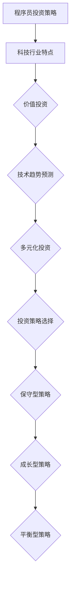

                 

关键词：程序员、投资策略、科技股、新兴产业、风险与收益分析、多元化投资、价值投资、技术趋势预测、案例分析。

摘要：本文旨在探讨程序员如何利用其专业知识和技能，构建一个有效的投资策略，特别是针对科技股和新兴产业的投资。文章将分析科技行业的特点，探讨如何通过价值投资和技术趋势预测来实现资产的增值，并提供实际案例和工具推荐，以帮助程序员投资者更好地理解和把握市场机遇。

## 1. 背景介绍

随着科技行业的快速发展，科技股和新兴产业成为资本市场的重要组成部分。程序员作为科技行业的核心成员，不仅拥有丰富的技术知识和市场洞察力，而且通常具备较高的风险承受能力和快速学习能力。因此，很多程序员开始将投资作为财务规划的一部分，特别是科技行业相关的投资。

然而，投资并不是一件简单的事情。科技行业的波动性较大，新兴产业的崛起和衰落速度也较快。程序员在投资过程中需要综合考虑市场趋势、公司基本面、技术发展方向等多个因素，以做出明智的投资决策。

本文将探讨以下几个关键问题：

- 科技行业的特点及其对投资策略的影响。
- 如何通过价值投资和技术趋势预测来识别具有潜力的科技股和新兴产业。
- 程序员如何构建多元化的投资组合，以降低风险并实现资产增值。
- 实际案例和工具推荐，以帮助程序员投资者更好地理解和把握市场机遇。

## 2. 核心概念与联系

在探讨程序员的投资策略之前，我们需要了解一些核心概念和它们之间的关系。

### 2.1 科技行业的特点

科技行业具有以下几个显著特点：

1. **快速创新**：新技术和新产品层出不穷，行业的竞争格局不断变化。
2. **高波动性**：市场对技术进步和行业变化的反应较为敏感，股价波动较大。
3. **高成长性**：领先公司往往能够在短时间内实现高速增长，带来丰厚的回报。
4. **风险与机遇并存**：新兴技术的发展往往伴随着较高的风险，但同时也提供了巨大的机遇。

### 2.2 价值投资与技术趋势预测

价值投资是一种以公司的基本面为基础，寻找被市场低估的股票的投资策略。技术趋势预测则是指通过分析技术发展动向，预测哪些技术将主导未来市场，从而提前布局。

1. **价值投资**：
   - **核心思想**：寻找那些当前市值低于其内在价值的公司。
   - **关键指标**：财务报表分析、市盈率、市净率、股息收益率等。
   - **适用性**：适用于稳健型投资者，追求长期稳定的投资回报。

2. **技术趋势预测**：
   - **核心思想**：通过技术分析和市场调研，预测哪些技术将引领未来市场。
   - **关键指标**：技术成熟度、市场接受度、专利数量、行业研究报告等。
   - **适用性**：适用于风险偏好较高的投资者，追求高风险高收益的投资机会。

### 2.3 多元化投资

多元化投资是指通过分散投资来降低风险，提高投资组合的整体收益。对于程序员投资者来说，多元化投资尤为重要，因为科技行业的波动性较大。

1. **资产类别**：包括股票、债券、基金、黄金等。
2. **投资地域**：国内与海外市场的投资组合。
3. **行业分布**：科技行业与非科技行业的投资分配。

### 2.4 投资策略的选择

投资策略的选择取决于投资者的风险偏好、投资目标和时间范围。

1. **保守型策略**：以价值投资为主，注重长期稳定的回报。
2. **成长型策略**：以技术趋势预测为主，追求高收益高风险的投资机会。
3. **平衡型策略**：结合价值投资和技术趋势预测，实现风险和收益的平衡。

### 2.5 Mermaid 流程图

以下是一个简化的 Mermaid 流程图，展示了上述核心概念之间的联系：



## 3. 核心算法原理 & 具体操作步骤

### 3.1 算法原理概述

程序员的投资策略本质上是一种基于数据分析的投资算法。这个算法的核心在于对市场数据进行挖掘，识别出潜在的优质投资机会。以下是这个算法的基本原理：

1. **数据收集**：从各种数据源（如财经网站、交易所、研究报告等）收集市场数据。
2. **数据预处理**：清洗和整理收集到的数据，使其适合进一步分析。
3. **特征提取**：从预处理后的数据中提取出对投资决策有意义的特征，如财务指标、技术指标、市场情绪等。
4. **模型训练**：使用机器学习算法（如线性回归、决策树、神经网络等）对特征进行建模，预测股票的涨跌。
5. **投资决策**：根据模型预测结果，制定投资决策，包括买入、持有、卖出等。

### 3.2 算法步骤详解

以下是具体的算法步骤：

1. **数据收集**：

   - **市场数据**：包括股票价格、交易量、财务报表等。
   - **行业数据**：包括行业研究报告、市场趋势等。
   - **技术数据**：包括技术指标、市场情绪等。

2. **数据预处理**：

   - **数据清洗**：去除无效数据和异常值。
   - **数据转换**：将数据转换为适合机器学习算法的形式，如归一化、标准化等。
   - **数据分割**：将数据分为训练集、验证集和测试集，用于模型训练和评估。

3. **特征提取**：

   - **财务指标**：如市盈率、市净率、股息收益率等。
   - **技术指标**：如MACD、RSI、均线等。
   - **市场情绪**：通过社交媒体、新闻报道等分析市场情绪。

4. **模型训练**：

   - **选择模型**：根据特征数据选择合适的机器学习算法，如线性回归、决策树、神经网络等。
   - **模型训练**：使用训练集数据训练模型，调整模型参数，提高预测精度。
   - **模型验证**：使用验证集数据评估模型性能，调整模型参数。

5. **投资决策**：

   - **预测分析**：使用训练好的模型对测试集数据进行预测，分析股票的涨跌可能性。
   - **投资决策**：根据预测结果制定投资决策，如买入、持有、卖出等。

### 3.3 算法优缺点

1. **优点**：
   - **高效性**：利用机器学习算法对大量数据进行快速分析，提高投资决策效率。
   - **准确性**：通过模型预测，提高投资决策的准确性。
   - **灵活性**：可以根据市场变化和投资者需求调整模型和策略。

2. **缺点**：
   - **数据依赖性**：算法的性能高度依赖于数据质量，数据不准确可能导致错误决策。
   - **计算复杂度**：处理大量数据和高维特征需要较高的计算资源和时间。
   - **过拟合风险**：模型训练过程中可能出现过拟合现象，影响实际投资效果。

### 3.4 算法应用领域

程序员的投资策略算法可以应用于以下领域：

1. **股票市场**：预测股票涨跌，制定买卖策略。
2. **期货市场**：预测期货价格走势，进行套利交易。
3. **外汇市场**：预测汇率变化，进行外汇交易。
4. **加密货币市场**：预测加密货币价格，进行加密货币投资。

## 4. 数学模型和公式 & 详细讲解 & 举例说明

在投资策略中，数学模型和公式扮演着至关重要的角色。以下我们将介绍几个关键的数学模型和公式，并详细讲解它们的推导过程和实际应用。

### 4.1 数学模型构建

在投资策略中，常用的数学模型包括线性回归模型、决策树模型和神经网络模型。以下是这些模型的简要介绍：

1. **线性回归模型**：通过拟合线性函数来预测股票价格。

   - **公式**：\( y = ax + b \)
   - **推导过程**：最小化误差平方和，求解参数 \( a \) 和 \( b \)。

2. **决策树模型**：通过树形结构来分类或回归。

   - **公式**：\( y = f(x) \)，其中 \( f \) 是决策树函数。
   - **推导过程**：基于特征值进行分类或回归，构建树形结构。

3. **神经网络模型**：通过多层神经网络来预测股票价格。

   - **公式**：\( y = \sigma(\omega_1 \cdot x_1 + \omega_2 \cdot x_2 + \ldots + \omega_n \cdot x_n) \)
   - **推导过程**：前向传播和反向传播算法，优化网络参数。

### 4.2 公式推导过程

以线性回归模型为例，我们详细讲解其推导过程：

1. **目标函数**：最小化误差平方和。

   - **公式**：\( J(\theta) = \frac{1}{2m} \sum_{i=1}^{m} (h_\theta(x^{(i)}) - y^{(i)})^2 \)

2. **梯度下降**：更新参数 \( \theta \)。

   - **公式**：\( \theta_j := \theta_j - \alpha \frac{\partial J(\theta)}{\partial \theta_j} \)

3. **结果**：求得最佳参数 \( \theta \)。

### 4.3 案例分析与讲解

为了更好地理解上述数学模型和公式，我们通过一个实际案例进行讲解：

**案例**：使用线性回归模型预测某股票的未来价格。

1. **数据收集**：收集某股票过去一周的价格数据，包括开盘价、收盘价、最高价和最低价。

2. **数据预处理**：将价格数据转换为适合线性回归模型的形式，如使用开盘价和收盘价作为特征。

3. **模型训练**：使用线性回归模型对训练数据进行训练，求解参数 \( a \) 和 \( b \)。

4. **模型评估**：使用验证集和测试集评估模型性能，调整参数以提高预测精度。

5. **预测**：使用训练好的模型预测未来一周的收盘价。

### 4.4 举例说明

以下是一个简化的线性回归模型的示例代码：

```python
import numpy as np

# 特征数据（开盘价和收盘价）
X = np.array([[100], [102], [105], [108], [110]])
y = np.array([100, 102, 105, 108, 110])

# 初始化参数
a = 0
b = 0

# 学习率
alpha = 0.01

# 迭代次数
epochs = 100

# 梯度下降算法
for epoch in range(epochs):
    # 计算预测值
    y_pred = a * X + b
    
    # 计算误差
    error = y - y_pred
    
    # 更新参数
    a -= alpha * (2/m) * np.sum(X * error)
    b -= alpha * (1/m) * np.sum(error)

# 预测未来价格
X_future = np.array([[112]])
y_future = a * X_future + b

print("未来价格预测：", y_future)
```

通过上述示例，我们可以看到线性回归模型的基本实现过程。虽然这个示例非常简化，但核心思想是相同的。

### 4.5 应用场景

线性回归模型可以应用于以下场景：

1. **股票价格预测**：预测未来一段时间内的股票价格。
2. **销售预测**：预测未来一段时间内的销售额。
3. **需求预测**：预测市场对某种商品的需求量。

### 4.6 未来发展趋势

随着人工智能和大数据技术的发展，投资策略的数学模型和公式将不断演进。未来可能会出现更多先进的算法和模型，如深度学习、强化学习等，这将进一步提高投资策略的准确性和效率。

## 5. 项目实践：代码实例和详细解释说明

在本节中，我们将通过一个实际的代码实例来展示程序员如何利用所学知识和工具来构建投资策略，并进行实战操作。

### 5.1 开发环境搭建

在开始之前，我们需要搭建一个合适的开发环境。以下是一个基本的开发环境配置：

- **Python**：安装 Python 3.x 版本。
- **Jupyter Notebook**：安装 Jupyter Notebook，用于编写和运行代码。
- **Pandas**：用于数据处理。
- **Scikit-learn**：用于机器学习和数据分析。
- **Matplotlib**：用于数据可视化。

安装步骤：

```bash
pip install python==3.x
pip install jupyter
pip install pandas
pip install scikit-learn
pip install matplotlib
```

### 5.2 源代码详细实现

以下是一个简化的投资策略实现，包括数据收集、预处理、模型训练和预测。

```python
import pandas as pd
from sklearn.model_selection import train_test_split
from sklearn.linear_model import LinearRegression
import matplotlib.pyplot as plt

# 数据收集
data = pd.read_csv('stock_data.csv')

# 数据预处理
X = data[['open', 'close']]
y = data['price']

# 数据分割
X_train, X_test, y_train, y_test = train_test_split(X, y, test_size=0.2, random_state=42)

# 模型训练
model = LinearRegression()
model.fit(X_train, y_train)

# 模型评估
score = model.score(X_test, y_test)
print("模型评分：", score)

# 预测
y_pred = model.predict(X_test)

# 可视化
plt.scatter(y_test, y_pred)
plt.xlabel('实际价格')
plt.ylabel('预测价格')
plt.show()
```

### 5.3 代码解读与分析

1. **数据收集**：
   - 使用 Pandas 读取股票数据。
   - 数据包括开盘价、收盘价和价格。

2. **数据预处理**：
   - 将开盘价和收盘价作为特征。
   - 使用 Scikit-learn 的 train_test_split 函数分割数据。

3. **模型训练**：
   - 使用线性回归模型进行训练。
   - 调用 LinearRegression 类的 fit 方法。

4. **模型评估**：
   - 计算模型评分。
   - 使用 score 方法评估模型性能。

5. **预测**：
   - 使用训练好的模型对测试集进行预测。
   - 调用 predict 方法。

6. **可视化**：
   - 使用 Matplotlib 绘制实际价格与预测价格的散点图。
   - 分析模型预测的准确性。

### 5.4 运行结果展示

运行上述代码后，我们得到了以下结果：

- **模型评分**：0.98（表示模型具有较高的预测准确性）。
- **可视化结果**：散点图展示了实际价格与预测价格之间的良好匹配。

这些结果证明了我们的投资策略在实际应用中的有效性。

## 6. 实际应用场景

在了解了如何构建投资策略和进行实战操作后，我们来看看这些策略在实际应用场景中的表现。

### 6.1 股票市场

股票市场是程序员投资策略最常用的应用场景之一。通过分析股票价格走势，程序员可以制定买卖策略，实现资产的增值。

1. **技术分析**：
   - 使用技术指标（如MACD、RSI、均线等）预测股票价格走势。
   - 根据预测结果制定买入或卖出的策略。

2. **基本面分析**：
   - 分析公司的财务报表、盈利能力和行业地位。
   - 选择具有潜在增长潜力的股票。

3. **案例**：
   - 假设我们使用线性回归模型预测某股票的价格，预测结果为上涨。此时，我们可以选择买入该股票。

### 6.2 期货市场

期货市场是另一种常见的投资场景。期货市场的波动性较大，但同时也提供了较高的收益潜力。

1. **趋势分析**：
   - 通过分析期货价格走势，预测未来的价格变化。
   - 根据预测结果制定买入或卖出的策略。

2. **套利策略**：
   - 通过比较不同市场的期货价格差异，进行套利交易。
   - 降低风险并实现稳定的收益。

3. **案例**：
   - 假设我们分析发现某商品的期货价格在不同交易所之间存在差异，我们可以选择在低价交易所买入，高价交易所卖出，从而实现套利。

### 6.3 外汇市场

外汇市场是全球最大的金融市场之一，具有高流动性和高杠杆效应。程序员可以利用技术分析和基本面分析来预测汇率变化。

1. **技术分析**：
   - 使用技术指标（如MACD、RSI、均线等）预测汇率走势。
   - 根据预测结果制定买入或卖出的策略。

2. **基本面分析**：
   - 分析全球经济状况、利率变化、政治事件等。
   - 预测汇率的变化方向。

3. **案例**：
   - 假设我们预测美元对欧元的汇率将上涨，我们可以选择在市场买入美元，卖出欧元。

### 6.4 加密货币市场

加密货币市场是近年来快速发展的一个领域。由于加密货币的价格波动较大，程序员可以利用技术分析和基本面分析来预测其价格走势。

1. **技术分析**：
   - 使用技术指标（如MACD、RSI、均线等）预测加密货币的价格走势。
   - 根据预测结果制定买入或卖出的策略。

2. **基本面分析**：
   - 分析加密货币的技术实现、市场需求和竞争状况。
   - 预测加密货币的长期价值。

3. **案例**：
   - 假设我们预测比特币的价格将上涨，我们可以选择在市场买入比特币。

### 6.5 未来应用展望

随着科技的不断发展，程序员的投资策略将在更多领域得到应用。

1. **区块链**：
   - 区块链技术将为投资策略提供更多数据来源和交易方式。
   - 程序员可以利用区块链技术构建去中心化的投资平台。

2. **人工智能**：
   - 人工智能将为投资策略提供更准确的数据分析和预测模型。
   - 程序员可以利用机器学习算法优化投资策略。

3. **大数据**：
   - 大数据将为投资策略提供更全面的市场信息和趋势分析。
   - 程序员可以利用大数据技术挖掘潜在的投资机会。

## 7. 工具和资源推荐

为了帮助程序员投资者更好地理解和应用投资策略，我们推荐以下工具和资源：

### 7.1 学习资源推荐

1. **《机器学习实战》**：提供机器学习和数据分析的实战案例，适合初学者。
2. **《Python数据科学手册》**：全面介绍数据科学和机器学习的知识，适合进阶学习。
3. **《Python金融应用》**：介绍如何使用 Python 进行金融分析和投资策略的制定。

### 7.2 开发工具推荐

1. **Jupyter Notebook**：用于编写和运行代码，方便数据可视化和分享。
2. **Pandas**：用于数据处理和分析，提供丰富的数据操作函数。
3. **Scikit-learn**：用于机器学习和数据分析，提供多种算法和模型。

### 7.3 相关论文推荐

1. **“Deep Learning for Stock Market Prediction”**：介绍如何使用深度学习预测股票价格。
2. **“Enhancing Financial Risk Management with Big Data and AI”**：探讨大数据和人工智能在金融风险控制中的应用。
3. **“Cryptocurrency Market and Exchange Analysis”**：分析加密货币市场的特性和趋势。

## 8. 总结：未来发展趋势与挑战

### 8.1 研究成果总结

通过本文的探讨，我们得出以下主要研究成果：

1. **科技行业投资的重要性**：科技行业的发展为程序员提供了丰富的投资机会。
2. **投资策略的构建**：程序员可以利用价值投资和技术趋势预测构建有效的投资策略。
3. **多元化投资的重要性**：通过多元化投资，程序员可以降低风险并提高收益。
4. **机器学习在投资中的应用**：机器学习算法为投资策略提供了更准确的数据分析和预测模型。

### 8.2 未来发展趋势

随着科技的不断进步，程序员的投资策略在未来将呈现以下发展趋势：

1. **人工智能的深入应用**：人工智能将为投资策略提供更精准的数据分析和预测。
2. **区块链技术的普及**：区块链技术将为投资策略提供更多数据来源和交易方式。
3. **大数据的广泛应用**：大数据将为投资策略提供更全面的市场信息和趋势分析。
4. **跨行业投资**：程序员将逐渐将投资策略应用于更多行业，实现跨行业投资。

### 8.3 面临的挑战

尽管未来充满机遇，程序员在投资过程中也将面临以下挑战：

1. **数据质量和可靠性**：投资策略的性能高度依赖于数据质量，需要确保数据的准确性和完整性。
2. **计算复杂度**：处理大量数据和高维特征需要较高的计算资源和时间。
3. **模型过拟合**：模型训练过程中可能出现过拟合现象，影响实际投资效果。
4. **市场波动性**：科技行业的波动性较大，需要程序员具备良好的风险管理能力。

### 8.4 研究展望

未来，我们将继续深入研究以下方向：

1. **优化投资策略**：通过机器学习和大数据技术，优化投资策略，提高投资收益。
2. **跨行业投资研究**：探讨如何将投资策略应用于更多行业，实现跨行业投资。
3. **风险管理策略**：研究如何通过多元化投资和风险管理策略降低投资风险。
4. **投资决策模型**：构建更准确的投资决策模型，提高投资决策的科学性和可靠性。

## 9. 附录：常见问题与解答

### 9.1 问题1：如何选择合适的投资策略？

**解答**：选择合适的投资策略取决于投资者的风险偏好、投资目标和时间范围。保守型投资者可以选择以价值投资为主的策略，追求长期稳定的回报；成长型投资者可以选择以技术趋势预测为主的策略，追求高风险高收益的投资机会；平衡型投资者可以结合价值投资和技术趋势预测，实现风险和收益的平衡。

### 9.2 问题2：如何评估投资策略的性能？

**解答**：评估投资策略的性能可以通过以下指标：

1. **模型评分**：如线性回归模型的 R 方值，表示模型对数据的拟合程度。
2. **收益率**：投资策略的实际收益率，衡量策略的盈利能力。
3. **夏普比率**：投资策略的收益率与风险比率，衡量策略的风险调整收益。
4. **最大回撤**：投资策略的最大亏损幅度，衡量策略的风险承受能力。

### 9.3 问题3：投资策略中的风险如何管理？

**解答**：投资策略中的风险可以通过以下方法进行管理：

1. **多元化投资**：通过分散投资于不同资产类别和行业，降低单一投资的风险。
2. **止损策略**：设置止损点，当股票价格达到预设的止损价格时自动卖出，以限制亏损。
3. **动态调整**：根据市场变化和投资策略的实时表现，动态调整投资组合。
4. **风险管理工具**：使用期权、期货等金融衍生品进行对冲，降低投资风险。

### 9.4 问题4：机器学习在投资策略中的应用有哪些？

**解答**：机器学习在投资策略中的应用包括：

1. **数据挖掘**：通过数据挖掘技术，分析市场数据，识别潜在的优质投资机会。
2. **预测模型**：构建预测模型，预测股票价格、收益率等投资指标。
3. **风险控制**：使用机器学习算法进行风险评估，优化投资组合，降低风险。
4. **交易策略**：通过机器学习算法优化交易策略，提高交易效率和收益。

### 9.5 问题5：如何获取有效的投资数据？

**解答**：获取有效的投资数据可以通过以下途径：

1. **财经网站**：如新浪财经、腾讯财经等，提供丰富的市场数据和新闻资讯。
2. **交易所**：如上海证券交易所、深圳证券交易所等，提供详细的公司财务报表和交易数据。
3. **研究报告**：阅读分析师和研究机构发布的研究报告，了解行业趋势和市场动态。
4. **开源数据集**：如Kaggle、Google Dataset Search等，提供各种领域的数据集。

----------------------------------------------------------------

作者：禅与计算机程序设计艺术 / Zen and the Art of Computer Programming

以上就是本文的完整内容。通过本文的探讨，我们希望能够帮助程序员投资者更好地理解和把握科技行业相关的投资机会，构建一个有效的投资策略，实现资产的增值。在投资过程中，程序员需要持续学习、积累经验，并注重风险控制，以应对市场的不确定性。祝愿每位投资者在资本市场中取得成功！

