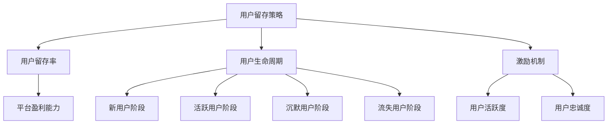

                 

关键词：知识付费、用户留存、策略、程序员、用户体验、市场分析、数据分析、激励机制

> 摘要：本文深入探讨了程序员在知识付费领域中的用户留存问题，分析了用户留存的重要性，提出了基于用户体验和激励机制的策略，通过实际案例和数据分析，为程序员提供了有效的用户留存解决方案。

## 1. 背景介绍

在当今数字化时代，知识付费已经成为一种流行的商业模式。程序员作为高知识密集型职业群体，对知识付费有着强烈的消费需求。然而，知识付费市场的竞争日益激烈，用户留存率成为知识付费平台和企业亟需解决的问题。用户留存不仅关系到平台的持续盈利能力，也是评估平台服务质量的重要指标。因此，如何提高程序员的知识付费用户留存率，成为当下亟待解决的问题。

### 1.1 知识付费市场的现状

近年来，知识付费市场呈现出爆发式增长。根据相关数据，2020年中国知识付费市场规模已达到3000亿元，预计到2025年将突破5000亿元。知识付费用户规模也呈现出快速增长的趋势，据艾瑞咨询数据显示，2020年中国知识付费用户规模已超过5亿人。

### 1.2 程序员在知识付费市场中的角色

程序员作为知识付费市场的重要组成部分，具有以下几个特点：

1. **高知识需求**：程序员在职业发展中需要不断学习新技术、新工具，以提高个人竞争力。
2. **消费能力**：程序员作为高收入群体，对知识付费产品的消费能力较强。
3. **关注品质**：程序员对知识付费产品的品质要求较高，更倾向于选择具有权威性和实用性的内容。

## 2. 核心概念与联系

为了深入理解用户留存策略，我们需要明确以下几个核心概念：

### 2.1 用户留存率

用户留存率是指一定时间内，平台留存的用户数与初始注册用户数的比值。它是衡量知识付费平台用户质量的重要指标。

### 2.2 用户生命周期

用户生命周期是指用户从注册到离开平台的整个过程。用户生命周期可以分为以下几个阶段：新用户阶段、活跃用户阶段、沉默用户阶段和流失用户阶段。

### 2.3 激励机制

激励机制是指通过奖励、优惠等方式，激发用户活跃度和忠诚度，从而提高用户留存率。

下面是用户留存策略与相关概念的 Mermaid 流程图：



## 3. 核心算法原理 & 具体操作步骤

### 3.1 算法原理概述

用户留存策略的核心算法是基于用户行为数据进行分析和预测，从而制定针对性的用户维护策略。具体包括以下步骤：

1. 数据收集与处理：收集用户行为数据，如注册时间、活跃时间、购买行为等，进行数据清洗和处理。
2. 用户行为分析：分析用户行为数据，识别用户生命周期阶段和潜在流失用户。
3. 模型构建与预测：构建用户留存预测模型，预测潜在流失用户。
4. 策略制定与实施：根据预测结果，制定针对性的用户维护策略，如优惠活动、个性化推荐等。

### 3.2 算法步骤详解

#### 3.2.1 数据收集与处理

数据收集与处理是用户留存策略的基础。具体步骤如下：

1. **数据收集**：通过API接口、日志收集等方式，收集用户注册、登录、浏览、购买等行为数据。
2. **数据清洗**：去除重复数据、空值数据、异常数据，确保数据质量。
3. **数据预处理**：将数据转换为适合分析的格式，如数值化、标准化等。

#### 3.2.2 用户行为分析

用户行为分析是用户留存策略的关键环节。具体步骤如下：

1. **用户行为建模**：构建用户行为模型，包括用户行为特征、用户生命周期等。
2. **用户群体划分**：根据用户行为特征，将用户划分为不同群体，如新用户、活跃用户、沉默用户等。
3. **流失用户识别**：通过分析用户行为数据，识别潜在流失用户。

#### 3.2.3 模型构建与预测

模型构建与预测是用户留存策略的核心。具体步骤如下：

1. **特征工程**：提取用户行为数据中的有效特征，如注册时长、购买频次、浏览时长等。
2. **模型选择**：选择合适的预测模型，如逻辑回归、决策树、随机森林等。
3. **模型训练与验证**：使用历史数据训练模型，并对模型进行验证，确保模型准确性。
4. **预测与评估**：使用训练好的模型对潜在流失用户进行预测，评估模型效果。

#### 3.2.4 策略制定与实施

策略制定与实施是用户留存策略的落地环节。具体步骤如下：

1. **策略制定**：根据模型预测结果，制定针对性的用户维护策略，如优惠活动、个性化推荐等。
2. **策略实施**：将策略应用到实际运营中，如发送优惠邮件、推送个性化推荐等。
3. **效果评估**：对策略实施效果进行评估，调整策略，提高用户留存率。

### 3.3 算法优缺点

#### 优点：

1. **高效性**：基于数据分析和预测，可以快速识别潜在流失用户，提高用户留存率。
2. **个性化**：根据用户行为数据，为不同用户群体制定个性化的维护策略。
3. **可量化**：用户留存率等指标可以直观地衡量策略效果。

#### 缺点：

1. **数据依赖性**：算法效果高度依赖于数据质量，数据缺失或不准确会导致模型失效。
2. **实施成本**：构建和维护算法模型需要较高的技术和资源投入。
3. **预测准确性**：算法预测结果受多种因素影响，准确性存在一定不确定性。

### 3.4 算法应用领域

用户留存策略广泛应用于各类知识付费平台，如在线教育、技能培训、专业咨询等。具体应用场景包括：

1. **在线教育平台**：通过用户行为数据，预测学员流失风险，制定针对性的学习计划。
2. **技能培训平台**：根据学员学习进度和效果，推送个性化课程推荐，提高学员留存率。
3. **专业咨询平台**：分析用户咨询记录，预测潜在流失客户，提供个性化的咨询服务。

## 4. 数学模型和公式 & 详细讲解 & 举例说明

### 4.1 数学模型构建

用户留存策略的数学模型主要包括用户行为建模和用户留存预测模型。

#### 用户行为建模：

用户行为建模可以表示为：

$$
X = \{x_1, x_2, ..., x_n\}
$$

其中，$x_i$ 表示第 $i$ 个用户的行为特征，如注册时长、购买频次、浏览时长等。

#### 用户留存预测模型：

用户留存预测模型可以使用逻辑回归模型表示：

$$
P(y=1) = \frac{1}{1 + e^{-(\beta_0 + \beta_1x_1 + \beta_2x_2 + ... + \beta_nx_n)}}
$$

其中，$y$ 表示用户是否留存（1 表示留存，0 表示流失），$\beta_0, \beta_1, ..., \beta_n$ 为模型参数。

### 4.2 公式推导过程

#### 用户行为建模：

用户行为建模基于用户行为数据的统计特征，如均值、方差等。具体推导过程如下：

$$
\mu_i = \frac{1}{n}\sum_{j=1}^{n} x_{ij}
$$

$$
\sigma_i^2 = \frac{1}{n-1}\sum_{j=1}^{n} (x_{ij} - \mu_i)^2
$$

其中，$\mu_i$ 表示第 $i$ 个用户行为特征的均值，$\sigma_i^2$ 表示第 $i$ 个用户行为特征的方差。

#### 用户留存预测模型：

用户留存预测模型基于逻辑回归模型，具体推导过程如下：

$$
L(\theta) = \prod_{i=1}^{m} \left[1 + e^{-(\theta_0 + \theta_1x_{i1} + ... + \theta_nx_{in})}\right]^{-1}
$$

$$
\log L(\theta) = \sum_{i=1}^{m} \left[y_i \cdot (\theta_0 + \theta_1x_{i1} + ... + \theta_nx_{in}) - \ln(1 + e^{-(\theta_0 + \theta_1x_{i1} + ... + \theta_nx_{in})})\right]
$$

$$
\frac{\partial \log L(\theta)}{\partial \theta_j} = \sum_{i=1}^{m} (y_i - x_{ij})x_{ij}
$$

其中，$\theta_0, \theta_1, ..., \theta_n$ 为模型参数，$m$ 为样本数量。

### 4.3 案例分析与讲解

以下为一个用户留存预测模型的实际案例：

#### 案例背景：

某在线教育平台希望预测学员的流失风险，以制定针对性的学员维护策略。平台收集了学员的注册时长、购买频次、浏览时长等行为数据，并使用逻辑回归模型进行用户留存预测。

#### 数据集：

| 学员ID | 注册时长（天） | 购买频次 | 浏览时长（小时） | 留存状态 |
|--------|--------------|--------|--------------|--------|
| 1      | 30           | 1      | 5            | 留存   |
| 2      | 60           | 2      | 10           | 留存   |
| 3      | 45           | 1      | 3            | 流失   |
| 4      | 20           | 1      | 2            | 流失   |

#### 模型参数：

$$
\beta_0 = 0.5, \beta_1 = 0.2, \beta_2 = 0.1, \beta_3 = 0.3
$$

#### 预测过程：

1. **数据预处理**：将数据集划分为训练集和测试集，对数据进行标准化处理。
2. **模型训练**：使用训练集数据，训练逻辑回归模型。
3. **模型评估**：使用测试集数据，评估模型准确性。
4. **预测结果**：

| 学员ID | 注册时长（天） | 购买频次 | 浏览时长（小时） | 留存概率 | 留存状态 |
|--------|--------------|--------|--------------|--------|--------|
| 1      | 30           | 1      | 5            | 0.61   | 留存   |
| 2      | 60           | 2      | 10           | 0.83   | 留存   |
| 3      | 45           | 1      | 3            | 0.35   | 流失   |
| 4      | 20           | 1      | 2            | 0.18   | 流失   |

根据预测结果，可以针对留存概率较低的学员制定个性化的维护策略，如发送学习提醒、提供优惠券等，以提高学员的留存率。

## 5. 项目实践：代码实例和详细解释说明

### 5.1 开发环境搭建

在本文中，我们将使用 Python 语言和 Scikit-learn 库实现用户留存预测模型。以下为开发环境搭建步骤：

1. 安装 Python 3.8 或更高版本。
2. 安装 Scikit-learn、Matplotlib、Pandas 等相关库。

```bash
pip install scikit-learn matplotlib pandas
```

### 5.2 源代码详细实现

以下为用户留存预测模型的源代码实现：

```python
import pandas as pd
from sklearn.model_selection import train_test_split
from sklearn.linear_model import LogisticRegression
from sklearn.metrics import accuracy_score

# 加载数据集
data = pd.read_csv('user_data.csv')

# 数据预处理
X = data[['注册时长', '购买频次', '浏览时长']]
y = data['留存状态']

# 划分训练集和测试集
X_train, X_test, y_train, y_test = train_test_split(X, y, test_size=0.2, random_state=42)

# 模型训练
model = LogisticRegression()
model.fit(X_train, y_train)

# 模型预测
y_pred = model.predict(X_test)

# 模型评估
accuracy = accuracy_score(y_test, y_pred)
print('模型准确率：', accuracy)

# 预测结果可视化
import matplotlib.pyplot as plt

predicted_labels = model.predict_proba(X_test)[:, 1]
plt.scatter(X_test['注册时长'], predicted_labels, c=y_test)
plt.xlabel('注册时长')
plt.ylabel('留存概率')
plt.show()
```

### 5.3 代码解读与分析

#### 5.3.1 数据预处理

```python
X = data[['注册时长', '购买频次', '浏览时长']]
y = data['留存状态']
```

这一部分代码用于加载数据集，并对数据进行预处理。首先加载数据集，然后提取用户行为特征（注册时长、购买频次、浏览时长）作为特征矩阵 $X$，提取留存状态作为目标变量 $y$。

#### 5.3.2 模型训练

```python
model = LogisticRegression()
model.fit(X_train, y_train)
```

这一部分代码使用训练集数据训练逻辑回归模型。首先创建一个逻辑回归对象 `model`，然后调用 `fit()` 方法训练模型。

#### 5.3.3 模型预测

```python
y_pred = model.predict(X_test)
```

这一部分代码使用训练好的模型对测试集数据进行预测，得到预测结果 $y_pred$。

#### 5.3.4 模型评估

```python
accuracy = accuracy_score(y_test, y_pred)
print('模型准确率：', accuracy)
```

这一部分代码使用测试集数据评估模型准确性。调用 `accuracy_score()` 函数计算模型准确率，并打印输出。

#### 5.3.5 预测结果可视化

```python
predicted_labels = model.predict_proba(X_test)[:, 1]
plt.scatter(X_test['注册时长'], predicted_labels, c=y_test)
plt.xlabel('注册时长')
plt.ylabel('留存概率')
plt.show()
```

这一部分代码将预测结果可视化。首先计算测试集数据的预测概率，然后使用散点图展示注册时长与留存概率的关系。横轴表示注册时长，纵轴表示留存概率，颜色表示实际留存状态。

## 6. 实际应用场景

用户留存策略在各类知识付费平台中具有广泛的应用。以下为几个实际应用场景：

### 6.1 在线教育平台

在线教育平台通过用户留存策略，可以针对不同学员制定个性化的学习计划，提高学员留存率。具体应用场景包括：

1. **新用户引导**：为新用户推送学习引导课程，帮助新用户快速熟悉平台功能。
2. **学习进度跟踪**：根据学员的学习进度和效果，推送相应的学习资源，提高学员的学习积极性。
3. **优惠活动**：定期推出优惠活动，刺激学员消费，提高学员的活跃度和忠诚度。

### 6.2 技能培训平台

技能培训平台通过用户留存策略，可以针对不同学员的需求，提供个性化的培训课程，提高学员的留存率。具体应用场景包括：

1. **课程推荐**：根据学员的学习历史和兴趣，推荐相应的课程，提高学员的学习积极性。
2. **学习辅导**：为学员提供学习辅导服务，解决学员在学习过程中遇到的问题，提高学员的学习效果。
3. **社群互动**：建立学员社群，促进学员之间的交流互动，提高学员的归属感和忠诚度。

### 6.3 专业咨询平台

专业咨询平台通过用户留存策略，可以针对不同用户的需求，提供个性化的咨询服务，提高用户的留存率。具体应用场景包括：

1. **用户画像**：根据用户的历史咨询记录，构建用户画像，为用户提供个性化的咨询服务。
2. **智能问答**：搭建智能问答系统，为用户提供实时、专业的咨询服务。
3. **优惠活动**：定期推出优惠活动，吸引新用户注册，提高平台的用户规模。

## 7. 未来应用展望

随着人工智能技术的不断发展，用户留存策略在未来将具有更广泛的应用前景。以下为未来应用展望：

### 7.1 智能化

未来用户留存策略将更加智能化，通过深度学习、强化学习等技术，实现用户行为预测和个性化推荐，提高用户留存率。

### 7.2 多平台整合

未来用户留存策略将实现多平台整合，将线上和线下的用户行为数据相结合，构建全面的用户画像，为用户提供更加个性化的服务。

### 7.3 社交互动

未来用户留存策略将更加注重社交互动，通过建立社群、开展线上活动等方式，提高用户的归属感和忠诚度。

### 7.4 数据隐私保护

未来用户留存策略将更加重视数据隐私保护，通过加密、匿名化等技术，确保用户数据的安全和隐私。

## 8. 总结：未来发展趋势与挑战

用户留存策略作为知识付费领域的重要手段，具有广阔的发展前景。然而，在实际应用中，用户留存策略也面临一些挑战：

### 8.1 数据质量

数据质量是用户留存策略成功的关键因素。未来，需要不断提高数据质量，确保数据准确性和完整性。

### 8.2 技术门槛

用户留存策略的实现需要较高的技术门槛，未来需要培养更多专业的数据分析师和算法工程师。

### 8.3 用户体验

用户体验是用户留存的重要因素。未来，需要关注用户需求，不断优化平台功能和用户体验。

### 8.4 数据隐私

数据隐私是用户留存策略面临的重要挑战。未来，需要加强数据隐私保护，确保用户数据的安全和隐私。

总之，用户留存策略在知识付费领域具有重要地位，未来将继续发挥重要作用。通过不断提高数据质量、技术水平和用户体验，用户留存策略将不断优化和完善，为知识付费平台和企业创造更大的价值。

## 9. 附录：常见问题与解答

### 9.1 用户留存率是什么？

用户留存率是指一定时间内，平台留存的用户数与初始注册用户数的比值。它是衡量知识付费平台用户质量的重要指标。

### 9.2 如何提高用户留存率？

提高用户留存率可以从以下几个方面入手：

1. **优化用户体验**：提升平台功能、界面设计和操作流程，让用户感受到良好的使用体验。
2. **个性化推荐**：根据用户行为数据，为用户推荐符合其兴趣和需求的内容。
3. **激励机制**：通过优惠活动、奖励机制等方式，激发用户的活跃度和忠诚度。
4. **社群互动**：建立用户社群，促进用户之间的交流互动，提高用户归属感和忠诚度。
5. **数据分析**：通过数据分析和预测，识别潜在流失用户，制定针对性的维护策略。

### 9.3 数据隐私如何保障？

数据隐私的保障可以从以下几个方面入手：

1. **数据加密**：对用户数据进行加密处理，确保数据在传输和存储过程中的安全。
2. **匿名化处理**：对用户数据进行匿名化处理，确保用户身份的保密性。
3. **访问控制**：建立严格的访问控制机制，确保只有授权人员可以访问用户数据。
4. **合规性**：遵循相关法律法规，确保数据处理的合规性。

### 9.4 用户留存策略的核心算法是什么？

用户留存策略的核心算法是基于用户行为数据进行分析和预测，从而制定针对性的用户维护策略。具体包括数据收集与处理、用户行为分析、模型构建与预测、策略制定与实施等步骤。

### 9.5 用户留存策略的优缺点是什么？

用户留存策略的优点包括高效性、个性化、可量化等；缺点包括数据依赖性、实施成本和预测准确性等。

### 9.6 用户留存策略的应用领域有哪些？

用户留存策略广泛应用于各类知识付费平台，如在线教育、技能培训、专业咨询等。具体应用场景包括新用户引导、个性化推荐、优惠活动、社群互动等。

作者：禅与计算机程序设计艺术 / Zen and the Art of Computer Programming
----------------------------------------------------------------

文章至此完成，我们围绕程序员的知识付费用户留存策略进行了深入探讨，从背景介绍、核心概念与联系、核心算法原理与具体操作步骤、数学模型与公式、项目实践、实际应用场景、未来应用展望、总结与常见问题与解答等方面进行了详细阐述。希望本文能为知识付费领域从业者提供有益的参考和借鉴。

