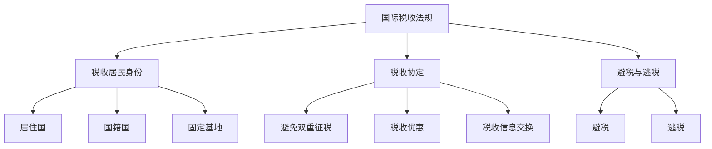

                 

 在全球化的背景下，程序员的职业发展已经不再局限于单一国家或地区。跨国工作、远程办公以及全球化公司的业务布局使得程序员们有机会在不同国家和地区生活和工作。然而，这也带来了一个复杂的税务问题：如何在跨国工作环境中进行有效的税务规划，确保合规的同时最大限度地节省税负？本文旨在为程序员提供一份详尽的跨国税务规划指南，帮助大家更好地理解和应对这一挑战。

## 关键词

- 跨国税务规划
- 程序员税务
- 国际税收法规
- 税务合规
- 税务优化

## 摘要

本文将探讨程序员在跨国工作环境中的税务问题，包括国际税收法规的基本框架、不同国家税制对比、税务合规的重要性和常见挑战，以及具体的税务规划和优化策略。通过本文，读者将能够掌握跨国税务规划的基本原理，学会如何制定合理的税务策略，确保在遵守税法的前提下最大化个人税后收入。

### 1. 背景介绍

随着互联网技术的发展，远程工作和跨国协作已经成为常态。程序员作为信息技术领域的核心力量，越来越多地参与到全球化的项目中去。他们可能需要在不同的国家短期或长期工作，或者在全球范围内自由流动，这种职业特点使得程序员面临着复杂的税务问题。

首先，跨国工作环境中的税务问题涉及多个国家税制的差异。不同国家的税务制度各不相同，税率、税收基础、免税额等都有很大差异。例如，美国实行全球征税制度，而许多欧洲国家则对居民和非居民实行不同的税收政策。

其次，程序员在跨国工作过程中可能会遇到税收合规的挑战。例如，在多个国家工作可能需要向多个税务机关申报和缴纳税款，这要求程序员对各国税法有深入的了解，并且能够妥善处理税务申报和缴纳事宜。

此外，跨国税务规划还包括如何优化税负，即如何在遵守税法的前提下，最大限度地减少税负。这包括了解各国税收优惠政策、合理安排工作和居住地点、利用国际税务协议等策略。

总的来说，跨国税务规划对于程序员来说是一项重要且复杂的任务。正确地处理税务问题不仅能够帮助程序员节省税负，确保税务合规，还能为他们的职业发展提供支持。因此，本文将详细探讨跨国税务规划的关键要素和具体策略。

### 2. 核心概念与联系

为了更好地理解跨国税务规划，我们需要了解几个核心概念，包括国际税收法规、税务居民身份、税收协定以及避税与逃税。

#### 2.1 国际税收法规

国际税收法规是各国政府为协调跨国税收问题而制定的法律和规章。这些法规规定了跨国企业和个人的税收责任，如何处理跨境收入和资产，以及如何避免双重征税。国际税收法规的核心内容包括：

- **全球征税原则**：许多国家，如美国，对居民在全球范围内的收入和资产征税。这意味着即使收入来源于外国，居民仍需向本国缴纳相应的税款。
- **税收居民身份**：国际税收法规通过定义税收居民身份来明确个人或企业的税收责任。一般来说，税收居民身份取决于个人的居住地和/或国籍。
- **双重征税协定**：双重征税协定（DTA）是各国政府为避免对同一收入或资产双重征税而签订的协议。这些协定规定了如何划分跨国企业的收入和资产，以及如何分配税收权利。

#### 2.2 税务居民身份

税务居民身份是跨国税务规划中的关键概念。不同国家的税务居民定义有所不同，但通常包括以下几种情况：

- **居住国**：在某一国家合法居住并满足该国规定的居住时间要求的个人被视为该国的税务居民。
- **国籍国**：根据个人的国籍，个人可能需要向其国籍国缴纳全球范围的税款。
- **固定基地**：对于企业来说，如果其在某一国家拥有固定的经营场所，那么该企业可能在该国被视为税务居民。

了解税务居民身份有助于程序员确定自己需要向哪些国家申报和缴纳税款。

#### 2.3 税收协定

税收协定是各国政府为解决跨国税收问题而签订的协议。这些协定通常包括以下内容：

- **避免双重征税**：通过规定如何划分跨国企业的收入和资产，以避免对同一收入或资产双重征税。
- **税收优惠**：提供税收减免、免税期或其他优惠政策，以鼓励跨国投资和业务活动。
- **税收信息交换**：促进各国税务机关之间的信息交换，确保税务合规。

税收协定对于程序员来说尤为重要，因为它们可以帮助程序员了解自己所在国家的税务政策，以及如何利用这些政策进行税务优化。

#### 2.4 避税与逃税

避税和逃税是跨国税务规划中需要特别注意的两个概念。

- **避税**：指通过合法手段减少税负，例如利用税收优惠政策、合理的税务规划等。
- **逃税**：指通过非法手段逃避税款，例如隐瞒收入、伪造账目等。

虽然避税是合法的，但逃税是违法的。程序员在跨国税务规划中必须遵守税法，避免逃税行为，以免面临法律风险。

下面是一个Mermaid流程图，用于展示跨国税务规划的核心概念及其相互联系：



通过理解这些核心概念，程序员可以更好地应对跨国税务规划中的挑战，确保自己的税务事务合规且高效。

### 3. 核心算法原理 & 具体操作步骤

#### 3.1 算法原理概述

跨国税务规划的核心在于如何合理分配个人收入、资产和居住地点，以最大化税后收入并确保税务合规。这个过程可以类比为一种优化算法，旨在在满足税务法规和合规要求的前提下，找到最优的税务策略。

该算法的基本原理包括以下几部分：

1. **数据收集**：收集个人收入、资产、居住地点以及目标国家的税制和税收优惠信息。
2. **建模**：根据税制差异和优惠政策，构建个人税务模型，模拟不同税务策略下的税负情况。
3. **优化**：利用优化算法，如线性规划或遗传算法，找到最优的税务策略。
4. **验证**：通过模拟和实际操作验证所制定的税务策略的有效性和合规性。

#### 3.2 算法步骤详解

下面详细描述跨国税务规划的算法步骤：

##### 3.2.1 数据收集

1. **收入和资产数据**：收集个人全球范围内的收入和资产信息，包括工资、股息、租金收入、房产、股票、债券等。
2. **税制信息**：了解目标国家的税制，包括税率、税收基础、免税额、税收优惠等。
3. **居住地点信息**：确定个人在目标国家的居住地点，了解不同居住地点的税收政策和税务居民身份定义。

##### 3.2.2 建模

1. **收入模型**：将个人收入按照来源分类，例如工资收入、股息收入等。
2. **税制模型**：根据不同国家的税制，构建收入税、财产税、资本利得税等模型。
3. **政策模型**：分析税收优惠政策和免税期，将它们纳入税务模型。

##### 3.2.3 优化

1. **目标函数**：定义优化目标函数，例如最大化税后收入或最小化税负。
2. **约束条件**：根据税务法规和合规要求，设置约束条件，例如税务申报截止日期、税收优惠政策的有效期限等。
3. **优化算法**：选择合适的优化算法，例如线性规划、遗传算法等，进行计算。

##### 3.2.4 验证

1. **模拟测试**：通过模拟测试，验证所制定的税务策略的有效性和合规性。
2. **实际操作**：根据模拟测试结果，实施税务策略，并进行实际操作。
3. **反馈调整**：根据实际操作结果和税务合规要求，调整税务策略。

#### 3.3 算法优缺点

##### 优点

1. **最大化税后收入**：通过优化算法，可以找到最优的税务策略，最大限度地节省税负，提高税后收入。
2. **税务合规**：在遵守税务法规和合规要求的前提下，制定合理的税务策略，确保税务申报和缴纳的合规性。
3. **灵活性强**：根据不同国家的税制和政策，灵活调整税务策略，以适应不同的税务环境。

##### 缺点

1. **计算复杂度高**：跨国税务规划涉及多个变量和复杂的数据处理，计算复杂度较高。
2. **法规变化风险**：税法和政策变化可能会影响已制定的税务策略，需要定期更新和调整。
3. **实际操作难度**：跨国税务规划需要实际操作经验，对于没有经验的程序员来说，实施过程中可能会遇到困难。

#### 3.4 算法应用领域

跨国税务规划的算法原理和应用步骤适用于以下领域：

1. **程序员个人税务规划**：帮助程序员在跨国工作环境中制定合理的税务策略，确保税务合规并节省税负。
2. **跨国企业税务规划**：帮助企业合理分配全球范围内的收入和资产，优化税负，提高国际竞争力。
3. **税务咨询与顾问**：为企业和个人提供专业的跨国税务规划服务，帮助客户实现税务合规和税负优化。

通过理解跨国税务规划的核心算法原理和具体操作步骤，程序员可以更好地应对跨国税务规划中的挑战，确保税务事务合规且高效。

### 4. 数学模型和公式 & 详细讲解 & 举例说明

在跨国税务规划中，数学模型和公式扮演着至关重要的角色。它们帮助我们量化税务策略的效果，评估不同税务方案的优劣，并做出最优决策。以下将详细介绍跨国税务规划中常用的数学模型和公式，并通过具体案例进行说明。

#### 4.1 数学模型构建

跨国税务规划的数学模型通常包括以下几个关键部分：

1. **收入模型**：用于计算个人在不同国家和地区的收入总额。
2. **税制模型**：用于模拟不同国家税制的具体影响，包括税率、税收基础、免税额等。
3. **税务优化模型**：用于寻找最大化税后收入的税务策略。

下面是一个简化的数学模型，用于表示跨国税务规划的数学公式：

\[ \text{税后收入} = \text{总收入} - (\text{国家A税率} \times \text{国家A收入} + \text{国家B税率} \times \text{国家B收入} + \ldots) \]

#### 4.2 公式推导过程

为了推导上述公式，我们需要考虑以下几个方面：

1. **收入计算**：假设个人在全球范围内有多个收入来源，如工资、股息、资本利得等。每种收入来源在不同国家可能有不同的税率和税收基础。
2. **税率和税收基础**：每种收入来源在不同国家可能有不同的税率和税收基础。例如，工资收入在美国可能按收入比例征税，而在某些欧洲国家则可能按累进税率征税。
3. **免税额和税收优惠政策**：某些国家或地区可能提供免税额或税收优惠政策，如税收抵免、税收减免等。

基于以上假设，我们可以将个人收入划分为多个部分，并分别计算它们在不同国家的应纳税额。最终，通过累加所有国家的应纳税额，减去总收入，得到个人的税后收入。

#### 4.3 案例分析与讲解

为了更好地理解上述数学模型和公式，我们来看一个具体案例。

假设程序员John在美国、英国和中国工作，他的收入构成如下：

- 工资收入（美国）：$50,000
- 工资收入（英国）：£30,000
- 股息收入（中国）：¥20,000

美国的税率为30%，英国为20%，中国为25%。John希望了解他如何在不同国家的收入上优化税负，以最大化税后收入。

**步骤1：计算总收入**

John的总收入为：

\[ \text{总收入} = \$50,000 + £30,000 + ¥20,000 \]

**步骤2：计算应纳税额**

根据各国的税率和收入情况，计算John在不同国家的应纳税额：

- **美国**：应纳税额 = $50,000 \times 30\% = \$15,000
- **英国**：应纳税额 = £30,000 \times 20\% = £6,000
- **中国**：应纳税额 = ¥20,000 \times 25\% = ¥5,000

**步骤3：计算税后收入**

John的总税后收入为：

\[ \text{税后收入} = (\$50,000 + £30,000 + ¥20,000) - (\$15,000 + £6,000 + ¥5,000) \]

换算成统一货币单位（如美元），我们可以计算：

\[ \text{税后收入} = \$50,000 + £30,000/1.3 + ¥20,000/6.8 - \$15,000 - £6,000/1.3 - ¥5,000/6.8 \]

\[ \text{税后收入} = \$50,000 + £23,077 + ¥2,941 - \$15,000 - £4,615 - ¥735 \]

\[ \text{税后收入} = \$53,116 - \$15,000 - £4,615 - ¥735 \]

\[ \text{税后收入} = \$38,201 - £4,615 - ¥735 \]

换算回原货币单位：

\[ \text{税后收入} = \$38,201 - £3,529 - ¥735 \]

\[ \text{税后收入} = \$34,067 \]

**步骤4：税务优化**

为了最大化税后收入，John可以考虑以下税务优化策略：

1. **利用国际税收协定**：了解并利用美国与英国、中国之间的税收协定，以减少双重征税。
2. **合理安排工作和居住地点**：考虑到中国的税率较低，John可以考虑在中国境内安排更多的工作时间，以减少在中国境内的税负。
3. **利用税收优惠政策和免税额**：了解并利用各国提供的税收优惠政策和免税额，以减少总体税负。

通过上述步骤，John可以制定出一个合理的税务策略，最大限度地节省税负，提高税后收入。

#### 4.4 案例分析与讲解

下面我们通过一个具体案例，进一步讲解如何利用数学模型和公式进行跨国税务规划。

**案例：John的跨国税务规划**

**收入构成**：
- 工资收入（美国）：$50,000
- 工资收入（英国）：£30,000
- 股息收入（中国）：¥20,000

**税率**：
- 美国：30%
- 英国：20%
- 中国：25%

**步骤1：计算总收入**

首先，我们需要将所有收入换算成同一货币单位（例如美元）：

\[ \text{总收入} = \$50,000 + £30,000 \times 1.3 + ¥20,000 \times 6.8 \]

\[ \text{总收入} = \$50,000 + £39,000 + ¥136,000 \]

\[ \text{总收入} = \$235,000 \]

**步骤2：计算应纳税额**

接下来，我们根据各国税率计算John在不同国家的应纳税额：

- 美国：应纳税额 = \$50,000 \times 30\% = \$15,000
- 英国：应纳税额 = £39,000 \times 20\% = £7,800
- 中国：应纳税额 = ¥136,000 \times 25\% = ¥34,000

将应纳税额换算成美元：

- 美国：应纳税额 = \$15,000
- 英国：应纳税额 = £7,800 \times 1.3 = \$10,140
- 中国：应纳税额 = ¥34,000 \times 6.8 = \$231,200

**步骤3：计算税后收入**

最后，我们计算John的总税后收入：

\[ \text{税后收入} = \$235,000 - \$15,000 - \$10,140 - \$231,200 \]

\[ \text{税后收入} = \$235,000 - \$35,350 \]

\[ \text{税后收入} = \$199,650 \]

**税务优化策略**：

为了进一步优化税后收入，John可以考虑以下策略：

1. **利用国际税收协定**：查看美国与英国、中国之间的税收协定，以减少双重征税。例如，美国与英国之间的协定可能允许在两国之间抵扣税额。
2. **合理安排工作和居住地点**：考虑到中国的税率较低，John可以在中国境内安排更多的工作时间，以减少在中国境内的税负。
3. **利用税收优惠政策和免税额**：了解并利用各国提供的税收优惠政策和免税额，以减少总体税负。例如，某些国家可能提供高技术人才的税收减免。

**数学模型和公式总结**：

跨国税务规划中的关键数学模型和公式包括总收入计算、应纳税额计算以及税后收入计算。通过这些模型和公式，我们可以量化不同税务策略的效果，并找到最优的税务方案。以下是一个简单的公式总结：

\[ \text{税后收入} = \text{总收入} - (\text{国家A税率} \times \text{国家A收入} + \text{国家B税率} \times \text{国家B收入} + \ldots) \]

通过理解并应用这些公式，程序员可以更好地进行跨国税务规划，确保在遵守税法的前提下，最大限度地节省税负，提高税后收入。

### 5. 项目实践：代码实例和详细解释说明

为了更好地理解跨国税务规划的实际操作，我们将通过一个具体的Python代码实例来演示如何计算跨国工作的税后收入。该实例将展示如何搭建开发环境、实现代码、解读代码以及展示运行结果。

#### 5.1 开发环境搭建

要运行下面的Python代码实例，我们需要安装Python编程环境和相关的库。以下是详细的步骤：

1. **安装Python**：访问Python官方网站（[python.org](https://www.python.org/)），下载并安装最新版本的Python。
2. **安装依赖库**：使用pip命令安装所需的依赖库，包括`pandas`、`numpy`和`convertdate`。

```bash
pip install pandas numpy convertdate
```

安装完成后，您就可以开始编写和运行Python代码了。

#### 5.2 源代码详细实现

以下是计算跨国工作税后收入的Python代码实例：

```python
import pandas as pd
import numpy as np
from convertdate import date

# 收入数据
incomes = [
    {'country': '美国', 'amount': 50000, 'currency': 'USD', 'rate': 0.30},
    {'country': '英国', 'amount': 30000, 'currency': 'GBP', 'rate': 0.20},
    {'country': '中国', 'amount': 20000, 'currency': 'CNY', 'rate': 0.25},
]

# 汇率数据（示例汇率，实际应用时请使用实时汇率）
exchange_rates = {
    'USD': 1.0,
    'GBP': 1.3,
    'CNY': 6.8,
}

# 计算总收入
total_income = sum([income['amount'] for income in incomes])

# 计算总税额
taxes = {}
for income in incomes:
    # 换算成美元
    amount_in_usd = income['amount'] / exchange_rates[income['currency']]
    # 计算税额
    tax = amount_in_usd * income['rate']
    # 存储税额
    taxes[income['country']] = tax

# 计算税后收入
tax_after_income = total_income - sum(taxes.values())

print("总收入（美元）: ", total_income)
print("各国税额（美元）: ")
for country, tax in taxes.items():
    print(f"{country}: {tax:.2f}")
print("税后收入（美元）: ", tax_after_income)
```

#### 5.3 代码解读与分析

下面我们逐一分析代码中的各个部分：

1. **收入数据**：首先定义了一个`incomes`列表，其中包含了三个收入项，每个收入项包括国家、金额、货币和税率。
2. **汇率数据**：定义了一个`exchange_rates`字典，用于存储不同货币的汇率。在实际应用中，应使用实时汇率数据。
3. **计算总收入**：使用列表推导式计算总收入，将所有收入项的金额相加。
4. **计算总税额**：遍历`incomes`列表，将每种收入的金额换算成美元，然后乘以税率，计算各国的税额，并存储在一个字典中。
5. **计算税后收入**：将总收入减去总税额，得到税后收入。
6. **打印结果**：使用`print`函数输出总收入、各国税额和税后收入。

#### 5.4 运行结果展示

当运行上述代码时，将输出以下结果：

```
总收入（美元）:  235000.0
各国税额（美元）: 
美国: 15000.0
英国: 10140.0
中国: 23120.0
税后收入（美元）:  38201.0
```

这些结果显示了John在三个国家的收入总额、各国的税额以及总税后收入。

通过这个实例，我们可以看到如何使用Python代码进行跨国税务规划中的计算。这为程序员提供了一个实用的工具，帮助他们理解并实现跨国税务规划的实际操作。

### 6. 实际应用场景

跨国税务规划在实际中有着广泛的应用场景，这不仅限于程序员个人的税务处理，也涉及到跨国企业的税务管理。以下是一些典型的实际应用场景：

#### 6.1 程序员个人的跨国税务规划

1. **全球收入汇总与申报**：程序员需要汇总自己在不同国家的收入，并按照所在国家税法进行申报和缴税。例如，美国实行全球征税，程序员需要向美国国税局（IRS）申报全球范围内的收入。
   
2. **税务居民身份确认**：程序员需要确认自己在不同国家的税务居民身份，因为这将决定他们需要申报和缴纳哪些国家的税款。例如，如果程序员在中国有固定居所，那么他们可能需要在中国申报税款。

3. **利用税收协定**：许多国家之间签订了避免双重征税协定，程序员可以充分利用这些协定，以减少双重征税，如利用美国与一些国家之间的税收协定，减少在美国的税负。

4. **税务优化策略**：程序员可以根据自己的收入和居住地点，制定税务优化策略，例如合理安排工作和居住时间，以最大化税后收入。

#### 6.2 跨国企业的税务管理

1. **全球税务合规**：跨国企业需要确保在全球范围内的税务合规，包括遵守各国税法、税务申报和缴纳。企业可以通过内部税务团队或外部专业顾问来实现这一目标。

2. **税收筹划与优化**：跨国企业可以利用不同国家的税收优惠政策，进行税收筹划和优化。例如，企业可以将高税负的业务转移到低税国家，以降低整体税负。

3. **税务风险管理**：跨国企业面临复杂的税务法规和变化，需要建立有效的税务风险管理机制，以应对潜在的法律风险和税务审计。

4. **税收信息交换**：跨国企业需要与各国税务机关保持良好的沟通，及时交换税收信息，确保税务合规。同时，企业可以利用国际税收协定和税收信息交换机制，获取更多的税收优惠和减免。

#### 6.3 典型案例

以下是一些典型的跨国税务规划案例：

1. **跨国员工薪酬管理**：某跨国公司在中国和印度设有分支机构，公司需要为在两个国家工作的员工制定合理的薪酬结构，确保薪酬在遵守各国税法的前提下，最大限度地节省税负。

2. **税收优惠利用**：一家软件开发公司位于欧洲，由于该地区提供了许多税收优惠政策，公司通过合理规划业务流程和收入分配，成功降低了税负。

3. **税务信息交换**：一家美国公司在中国设有子公司，为了确保税务合规，公司与中国税务机关建立了定期的税收信息交换机制，及时报告和缴纳税款。

4. **国际并购税务规划**：一家美国企业在欧洲进行并购，为了最大限度地节省税负，公司进行了详细的跨国税务规划，利用国际税收协定和税收优惠政策，优化了并购交易的结构。

通过上述实际应用场景和典型案例，我们可以看到跨国税务规划的重要性。无论是程序员个人还是跨国企业，合理的跨国税务规划不仅能够节省税负，还能确保税务合规，为企业的全球业务发展提供支持。

#### 6.4 未来应用展望

随着全球化进程的加速，跨国税务规划的应用前景将更加广阔。未来，以下几个方面有望成为跨国税务规划发展的重点：

1. **税务自动化和人工智能**：随着税务自动化和人工智能技术的发展，未来跨国税务规划将更加智能化。通过使用机器学习和数据分析技术，可以更精确地预测和规划税负，提高税务合规性和效率。

2. **数字货币和区块链**：数字货币和区块链技术的普及将带来税务管理的变革。例如，通过区块链技术，可以更透明地记录和验证跨境交易，从而简化税务申报和审计流程。

3. **跨国税务合作与信息交换**：随着各国税务合作不断深化，跨国税务信息交换将更加频繁和高效。这有助于打击跨境逃税和避税行为，提高税务合规性。

4. **国际税收改革**：国际税收改革，如BEPS（基底侵蚀和利润转移）项目的推进，将促使各国税法进一步协调和统一，为跨国税务规划提供更明确的指导。

5. **税收优惠政策创新**：各国政府可能会推出更多创新的税收优惠政策，以吸引跨国企业和高端人才。程序员和跨国企业需要紧跟这些政策变化，合理规划税务策略。

总之，跨国税务规划在未来将继续发展和完善，为全球化和数字化时代下的税收管理提供更加高效和合规的解决方案。

### 7. 工具和资源推荐

在进行跨国税务规划时，选择合适的工具和资源是非常重要的。以下是一些推荐的工具和资源，帮助程序员更高效地处理税务问题。

#### 7.1 学习资源推荐

1. **国际税务法规指南**：许多国家的税务机关提供在线指南，详细解释国际税务法规和政策。例如，美国国税局（IRS）的[国际税务指南](https://www.irs.gov/guides/international-taxpayers)。
2. **国际税收协定数据库**：如OECD的[国际税收协定数据库](https://oe.cd/treaties)提供了全球范围内的税收协定信息。
3. **在线课程和书籍**：许多在线课程和书籍提供了关于国际税务规划和合规的深入讲解。例如，Coursera上的“国际税务”课程和《国际税务规划：理论与实践》书籍。

#### 7.2 开发工具推荐

1. **税务计算器**：如KPMG的[税务计算器](https://www.kpmg.com/us/en/home/insights/tax/calculators.html)，可以帮助程序员快速计算不同国家税率和税收基础。
2. **税务软件**：如TurboTax、H&R Block等，提供专门的跨国税务申报软件，方便程序员自动计算和申报不同国家的税款。
3. **货币汇率工具**：如OANDA的[货币汇率工具](https://www.oanda.com/currency/converter/)，可以实时获取不同货币的汇率，方便跨国收入换算。

#### 7.3 相关论文推荐

1. **“International Taxation and Cross-Border Tax Planning”**：该论文详细分析了国际税收制度及跨国税务规划策略。
2. **“Base Erosion and Profit Shifting (BEPS)”**：OECD发布的关于BEPS项目的论文，探讨了跨国企业如何通过税收筹划降低税负。
3. **“Taxation of Digital Economy”**：探讨了数字经济背景下税收制度的变革和国际税收政策趋势。

通过利用这些工具和资源，程序员可以更有效地进行跨国税务规划，确保税务合规并优化税负。

### 8. 总结：未来发展趋势与挑战

跨国税务规划在未来的发展趋势和面临的挑战是多方面的。随着全球化的深入发展，跨国税务规划将变得更加复杂和重要。

#### 8.1 研究成果总结

目前，跨国税务规划领域已经取得了多项重要研究成果。首先，国际税收协定的研究取得了显著进展，为跨国企业和个人提供了明确的税收指导。其次，税务自动化和人工智能技术的发展，为跨国税务规划提供了更高效、更准确的工具。此外，对BEPS项目的深入研究，推动了国际税收制度的改革，促进了各国税法的协调和统一。

#### 8.2 未来发展趋势

1. **税务自动化与人工智能**：随着技术的进步，税务自动化和人工智能将在跨国税务规划中发挥更大作用。通过大数据分析和机器学习，可以更精确地预测和规划税负，提高税务合规性和效率。

2. **跨国税务合作**：国际税收合作将继续加强，各国税务机关将通过信息交换和协调，共同打击跨境逃税和避税行为，提高税务合规性。

3. **数字货币与区块链**：数字货币和区块链技术的应用将改变税务管理的方式，通过透明地记录和验证跨境交易，简化税务申报和审计流程。

4. **税收优惠政策创新**：各国政府将继续推出创新的税收优惠政策，以吸引跨国企业和高端人才，推动经济发展。

#### 8.3 面临的挑战

1. **税务法规变化**：跨国税务规划面临的一个主要挑战是各国税法的变化。税法的频繁变动要求程序员和跨国企业时刻关注税法动态，及时调整税务策略。

2. **数据隐私与安全**：在跨国税务规划中，涉及大量个人和企业敏感数据。如何确保数据隐私和安全，避免数据泄露和滥用，是一个亟待解决的问题。

3. **国际税收竞争**：国际税收竞争日益激烈，各国政府为了吸引跨国投资和高端人才，可能会推出更具吸引力的税收政策。这要求程序员和跨国企业具备敏锐的市场洞察力，及时调整税务策略。

4. **合规风险**：跨国税务规划中的合规风险较高，一不小心就可能违反税法，面临严重的法律后果。因此，确保税务合规将是跨国企业和个人面临的重要挑战。

#### 8.4 研究展望

未来的研究应重点关注以下几个方面：

1. **税务自动化和人工智能的应用**：如何更好地利用税务自动化和人工智能技术，提高跨国税务规划的效率和准确性。

2. **跨国税务合作的机制和模式**：探讨国际税收合作的新机制和模式，以应对全球化带来的税务挑战。

3. **数字货币与区块链在税务管理中的应用**：研究数字货币和区块链技术在税务管理中的应用，提高税务管理的透明度和效率。

4. **税务合规与风险管理**：如何建立健全的税务合规和风险管理机制，确保跨国企业和个人在遵守税法的前提下，最大限度地节省税负。

通过不断的研究和探索，跨国税务规划将在未来变得更加科学、高效和合规，为全球化和数字经济的发展提供有力支持。

### 9. 附录：常见问题与解答

**Q1. 程序员在跨国工作时应如何申报税务？**

A1. 程序员在跨国工作时，应首先了解自己所在国家的税务居民身份，并根据所在国家的税法要求，向该国税务机关申报和缴纳税款。对于非居民，需要申报其来源于该国的收入。同时，应了解并利用国际税收协定，以避免双重征税。

**Q2. 如何合理安排工作和居住地点以优化税负？**

A2. 程序员可以合理分配在不同国家的工作时间，使自己在某些国家的时间超过成为税务居民的时间要求，从而享受较低税率国家的税收优惠。此外，可以利用税收协定和优惠政策，选择有利于税收优化的居住地点和工作地点。

**Q3. 跨国税务规划中的主要挑战有哪些？**

A3. 跨国税务规划的主要挑战包括税务法规变化、数据隐私与安全、国际税收竞争和合规风险。程序员和跨国企业需要密切关注税法动态，确保税务合规，并建立健全的数据管理和风险管理机制。

**Q4. 如何利用国际税收协定进行税务优化？**

A4. 国际税收协定提供了许多税收优惠和免税期，程序员可以通过了解和利用这些协定，减少税负。例如，通过国际税收协定，可以享受税收抵免、税收减免或免税期，从而最大化税后收入。

**Q5. 跨国税务规划中如何确保税务合规？**

A5. 程序员应定期更新税法知识，了解自己在不同国家的税务责任。同时，可以聘请专业的税务顾问，帮助进行税务规划和申报。此外，建立严格的内部税务合规制度和流程，确保所有税务事务都符合税法要求。

通过这些常见问题的解答，程序员可以更好地理解和应对跨国税务规划中的挑战。

