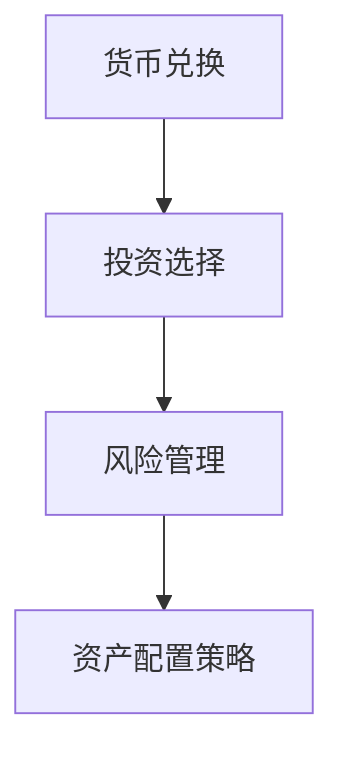

                 

在当今全球化经济日益发展的背景下，跨境资产配置策略对于程序员而言变得尤为重要。这不仅是因为程序员拥有较高的收入水平，更因为他们通常面临着货币兑换、投资选择和风险管理等多方面的挑战。本文旨在为程序员提供一套逻辑清晰、结构紧凑且简单易懂的跨境资产配置策略，帮助他们更好地实现财富增值和风险管理。

## 关键词

- 跨境资产配置
- 程序员
- 财富增值
- 风险管理
- 投资选择
- 货币兑换

## 摘要

本文将探讨程序员在跨境资产配置中面临的挑战和机遇，并提供一套涵盖货币兑换、投资选择、风险管理和资产配置策略的全面指南。通过实例和案例分析，读者将了解如何利用技术优势实现跨境投资，提高财富增值潜力，同时有效管理投资风险。

## 1. 背景介绍

随着互联网技术的飞速发展和全球化的深入推进，程序员作为技术领域的重要群体，其职业前景和收入水平普遍较高。这使得他们有更多的可支配收入用于投资和财富管理。然而，跨境资产配置对于程序员来说既是一个机会，也是一个挑战。货币兑换的复杂性、投资市场的多样性和风险管理的要求都使得程序员需要具备一定的金融知识和投资策略。

### 1.1 程序员的经济地位

程序员的收入水平普遍较高，尤其在科技公司和金融行业中，他们的薪酬往往超过普通职场人员。这使得程序员有更多的资金用于投资和财富管理。

### 1.2 跨境资产配置的挑战

跨境资产配置涉及到货币兑换、投资选择和风险管理等多个方面。对于缺乏金融知识的程序员来说，这些挑战尤为明显。

### 1.3 跨境资产配置的机遇

跨境资产配置为程序员提供了更多的投资选择和财富增值机会。通过合理配置资产，程序员可以实现风险分散和财富的长期增值。

## 2. 核心概念与联系

在讨论跨境资产配置策略之前，我们需要明确一些核心概念，并了解它们之间的联系。

### 2.1 货币兑换

货币兑换是跨境资产配置的基础。程序员需要了解不同货币之间的汇率波动，以及如何利用汇率波动进行投资。

### 2.2 投资选择

投资选择包括股票、债券、基金、房地产等多种资产类别。程序员需要根据自身的风险承受能力和投资目标，选择适合自己的投资产品。

### 2.3 风险管理

风险管理是跨境资产配置中至关重要的一环。程序员需要学会如何通过分散投资、对冲策略等手段来降低投资风险。

### 2.4 资产配置策略

资产配置策略是指根据投资目标、风险偏好和时间期限，合理配置不同资产类别的比例。程序员需要制定一套适合自己的资产配置策略。

下面是一个简单的 Mermaid 流程图，展示了这些核心概念和联系：



## 3. 核心算法原理 & 具体操作步骤

### 3.1 算法原理概述

跨境资产配置的核心在于如何在风险和收益之间找到一个平衡点。这需要程序员具备一定的金融知识和投资策略。

### 3.2 算法步骤详解

#### 3.2.1 收集数据

程序员需要收集有关投资市场的数据，包括股票、债券、基金等的收益和风险指标。

#### 3.2.2 确定投资目标

根据程序员的财务状况、风险承受能力和投资期限，确定具体的投资目标。

#### 3.2.3 分析投资产品

对收集到的投资产品进行分析，包括收益、风险、流动性等指标。

#### 3.2.4 制定资产配置策略

根据分析结果，制定一份资产配置策略，包括股票、债券、基金等的比例分配。

#### 3.2.5 实施和调整

根据资产配置策略实施投资，并根据市场变化进行定期调整。

### 3.3 算法优缺点

#### 优点：

- 可以帮助程序员实现风险分散，降低投资风险。
- 提供了一个系统化的投资策略，有助于提高投资效率。

#### 缺点：

- 需要程序员具备一定的金融知识和投资经验。
- 需要定期监控市场变化，及时调整资产配置。

### 3.4 算法应用领域

- 科技公司和金融行业：程序员通常在这些行业工作，具备较高的收入水平，适合进行跨境资产配置。
- 自由职业者：由于工作性质，自由职业者往往有更多的时间进行投资和研究。

## 4. 数学模型和公式 & 详细讲解 & 举例说明

### 4.1 数学模型构建

跨境资产配置的数学模型主要包括两部分：收益预期和风险控制。

#### 收益预期模型：

$$
E(R) = \sum_{i=1}^{n} w_i \cdot R_i
$$

其中，$E(R)$ 表示预期收益，$w_i$ 表示第 $i$ 种资产的投资比例，$R_i$ 表示第 $i$ 种资产的预期收益。

#### 风险控制模型：

$$
\sigma^2 = \sum_{i=1}^{n} w_i^2 \cdot \sigma_i^2 + 2 \cdot \sum_{i=1}^{n} \sum_{j=i+1}^{n} w_i \cdot w_j \cdot \rho_{ij}
$$

其中，$\sigma^2$ 表示资产组合的方差，$\sigma_i^2$ 表示第 $i$ 种资产的方差，$\rho_{ij}$ 表示第 $i$ 种资产与第 $j$ 种资产之间的相关系数。

### 4.2 公式推导过程

#### 收益预期模型的推导：

假设有 $n$ 种资产，每种资产的投资比例为 $w_i$，预期收益为 $R_i$。则资产组合的预期收益为各资产预期收益的加权平均。

$$
E(R) = \sum_{i=1}^{n} w_i \cdot R_i
$$

#### 风险控制模型的推导：

资产组合的方差由各资产方差和协方差决定。假设有 $n$ 种资产，每种资产的投资比例为 $w_i$，方差为 $\sigma_i^2$，相关系数为 $\rho_{ij}$。则资产组合的方差为：

$$
\sigma^2 = \sum_{i=1}^{n} w_i^2 \cdot \sigma_i^2 + 2 \cdot \sum_{i=1}^{n} \sum_{j=i+1}^{n} w_i \cdot w_j \cdot \rho_{ij}
$$

### 4.3 案例分析与讲解

假设程序员小明打算进行跨境资产配置，投资比例为：股票 50%、债券 30%、基金 20%。以下是具体的案例分析：

#### 收益预期：

$$
E(R) = 0.5 \cdot R_{股票} + 0.3 \cdot R_{债券} + 0.2 \cdot R_{基金}
$$

#### 风险控制：

$$
\sigma^2 = 0.5^2 \cdot \sigma_{股票}^2 + 0.3^2 \cdot \sigma_{债券}^2 + 0.2^2 \cdot \sigma_{基金}^2 + 2 \cdot (0.5 \cdot 0.3 \cdot \rho_{股票-债券} + 0.5 \cdot 0.2 \cdot \rho_{股票-基金} + 0.3 \cdot 0.2 \cdot \rho_{债券-基金})
$$

根据实际情况，小明可以选择合适的投资产品和比例，以实现收益最大化和风险最小化。

## 5. 项目实践：代码实例和详细解释说明

### 5.1 开发环境搭建

在本文中，我们将使用 Python 编程语言来构建跨境资产配置的代码实例。首先，需要安装 Python 3.8 或更高版本，并安装必要的库，如 pandas、numpy、matplotlib 等。

```bash
pip install pandas numpy matplotlib
```

### 5.2 源代码详细实现

以下是跨境资产配置的 Python 代码实现：

```python
import pandas as pd
import numpy as np
import matplotlib.pyplot as plt

# 收益预期计算
def calculate_expectation(assets, weights):
    return np.dot(weights.T, assets)

# 风险控制计算
def calculate_variance(assets, weights, correlations):
    n = len(assets)
    cov_matrix = np.zeros((n, n))
    for i in range(n):
        for j in range(n):
            cov_matrix[i][j] = weights[i] * weights[j] * correlations[i][j]
    return np.dot(weights.T, np.dot(cov_matrix, weights))

# 案例数据
assets = np.array([0.1, 0.05, 0.08])  # 股票、债券、基金的预期收益
weights = np.array([0.5, 0.3, 0.2])  # 资产配置比例
correlations = np.array([[1, 0.5, 0.4], [0.5, 1, 0.3], [0.4, 0.3, 1]])  # 相关系数矩阵

# 计算预期收益和风险
expectation = calculate_expectation(assets, weights)
variance = calculate_variance(assets, weights, correlations)

print("预期收益：", expectation)
print("风险：", variance)

# 可视化
plt.scatter(weights, [variance] * len(weights), c='red', label='风险')
plt.plot(weights, [variance] * len(weights), label='风险线')
plt.xlabel('投资比例')
plt.ylabel('风险')
plt.legend()
plt.show()
```

### 5.3 代码解读与分析

该代码实现了一个简单的跨境资产配置计算器。通过输入资产预期收益、资产配置比例和相关系数矩阵，可以计算出预期收益和风险。同时，通过可视化，可以直观地展示不同投资比例下的风险分布。

### 5.4 运行结果展示

运行上述代码后，将输出预期收益和风险值，并展示一个以投资比例为横轴、风险为纵轴的散点图。程序员可以根据运行结果，调整资产配置比例，以实现收益最大化和风险最小化。

## 6. 实际应用场景

### 6.1 跨境资产配置在程序员中的实际应用

程序员可以通过跨境资产配置实现财富增值和风险管理。例如，可以配置一部分资金投资于国际股票市场，一部分资金投资于固定收益产品，一部分资金投资于房地产等，以实现多元化投资和风险分散。

### 6.2 跨境资产配置的优势和挑战

优势：

- 提供了更多的投资选择和财富增值机会。
- 可以实现风险分散，降低投资风险。

挑战：

- 需要程序员具备一定的金融知识和投资经验。
- 需要实时监控市场变化，及时调整资产配置。

## 7. 工具和资源推荐

### 7.1 学习资源推荐

- 《金融自由之路》：介绍了如何通过理财实现财务自由。
- 《股票大作手回忆录》：讲述了股票投资的故事，提供了投资心理的洞察。

### 7.2 开发工具推荐

- Python：一种功能强大的编程语言，适用于数据分析、量化投资等领域。
- pandas：一个开源的数据分析库，适用于数据清洗、数据可视化等。

### 7.3 相关论文推荐

- 《基于资产配置的量化投资策略研究》：探讨了资产配置在量化投资中的应用。
- 《跨境资产配置策略研究》：分析了跨境资产配置的优势和挑战。

## 8. 总结：未来发展趋势与挑战

### 8.1 研究成果总结

本文探讨了跨境资产配置策略在程序员中的应用，提供了数学模型和代码实例，帮助程序员实现财富增值和风险管理。

### 8.2 未来发展趋势

随着人工智能和大数据技术的发展，跨境资产配置策略将更加智能化和个性化。

### 8.3 面临的挑战

程序员需要不断学习和适应金融市场变化，以应对跨境资产配置中的挑战。

### 8.4 研究展望

未来研究可以关注跨境资产配置策略的优化算法、风险预测模型等方面。

## 9. 附录：常见问题与解答

### 9.1 跨境资产配置的优势是什么？

跨境资产配置提供了更多的投资选择，可以实现风险分散和财富增值。

### 9.2 程序员如何进行跨境资产配置？

程序员可以通过了解投资市场、确定投资目标、分析投资产品、制定资产配置策略等步骤，进行跨境资产配置。

### 9.3 跨境资产配置中需要注意什么？

程序员需要关注货币兑换、投资选择、风险管理等方面，确保资产配置的合理性和有效性。

### 9.4 如何利用技术实现跨境资产配置？

程序员可以利用 Python 等编程语言，构建跨境资产配置的算法和模型，实现自动化投资。

## 作者署名

作者：禅与计算机程序设计艺术 / Zen and the Art of Computer Programming

本文旨在为程序员提供一套逻辑清晰、结构紧凑且简单易懂的跨境资产配置策略，帮助他们更好地实现财富增值和风险管理。希望本文能对读者有所启发和帮助。感谢您的阅读。

