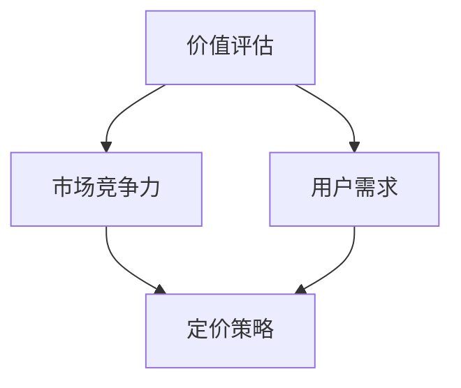

                 

关键词：知识付费、内容定价、程序员、收益最大化、市场分析、用户需求

> 摘要：本文将探讨程序员在知识付费领域的内容定价策略。通过对市场环境和用户需求的深入分析，结合实际案例分析，提出了一系列科学合理的定价方法，以帮助程序员实现收益最大化。

## 1. 背景介绍

随着互联网技术的飞速发展，知识付费逐渐成为知识经济时代的重要组成部分。程序员作为一个高度专业化的职业群体，他们所拥有的知识和技能具有很高的市场价值。知识付费平台为程序员提供了一个展示和变现自身价值的渠道，使得程序员可以通过创作高质量的内容来获得收益。

然而，如何合理定价程序员的知识付费内容，以实现收益最大化，成为了许多程序员面临的重要问题。本文将从市场环境和用户需求的角度出发，探讨程序员知识付费的内容定价策略。

### 1.1 市场环境

知识付费市场的快速发展，使得平台数量不断增加，竞争日益激烈。同时，用户对知识内容的需求呈现出多样化和个性化的特点。这要求程序员在定价策略上要具备市场敏锐度，能够快速适应市场变化。

### 1.2 用户需求

用户需求是影响内容定价的重要因素。不同用户对知识内容的需求程度、付费意愿、消费能力等方面存在差异。程序员需要充分了解用户需求，以便制定出符合市场需求的定价策略。

## 2. 核心概念与联系

在探讨内容定价策略之前，我们首先需要了解以下几个核心概念：

### 2.1 价值评估

价值评估是指对程序员知识付费内容的价值进行衡量。这包括内容的专业性、实用性、创新性等方面。

### 2.2 市场竞争

市场竞争是指不同平台和内容创作者之间的竞争。在市场竞争中，程序员需要根据自身优势，制定出具有竞争力的定价策略。

### 2.3 用户需求

用户需求是指用户对知识付费内容的需求程度和付费意愿。程序员需要充分了解用户需求，以便制定出符合市场需求的定价策略。

下面是核心概念与联系的关系图（使用Mermaid流程图）：



## 3. 核心算法原理 & 具体操作步骤

### 3.1 算法原理概述

程序员知识付费的内容定价策略可以采用以下三种核心算法：

1. 成本加成法
2. 市场竞争法
3. 用户需求法

这三种算法分别从成本、市场和用户需求三个方面出发，综合考虑程序员的知识价值、市场竞争和用户需求，制定出合理的定价策略。

### 3.2 算法步骤详解

#### 3.2.1 成本加成法

1. 计算内容制作成本：包括人力成本、技术成本、营销成本等。
2. 确定成本加成比例：根据市场情况和用户需求，设定合理的成本加成比例。
3. 计算最终定价：将成本乘以成本加成比例，得出最终定价。

#### 3.2.2 市场竞争法

1. 收集市场数据：了解同行业竞争对手的定价策略。
2. 分析自身优势：根据自身优势，确定合理的定价区间。
3. 确定最终定价：在合理定价区间内，选择具有竞争力的价格。

#### 3.2.3 用户需求法

1. 调查用户需求：通过问卷调查、访谈等方式，了解用户对知识付费内容的需求程度和付费意愿。
2. 分析用户数据：对调查结果进行统计分析，得出用户对知识内容的价值评估。
3. 确定最终定价：根据用户需求，制定出合理的定价策略。

### 3.3 算法优缺点

#### 成本加成法

- 优点：简单易懂，易于操作。
- 缺点：无法充分考虑市场竞争和用户需求，可能导致定价过高或过低。

#### 市场竞争法

- 优点：充分考虑市场竞争，具有竞争力。
- 缺点：可能忽视内容本身的价值，导致定价过低。

#### 用户需求法

- 优点：充分考虑用户需求，定价更合理。
- 缺点：调查过程复杂，耗时较长。

### 3.4 算法应用领域

这三种算法可以广泛应用于各种知识付费领域，如在线教育、技术教程、行业报告等。

## 4. 数学模型和公式 & 详细讲解 & 举例说明

为了更好地理解内容定价策略，我们可以引入以下数学模型和公式。

### 4.1 数学模型构建

假设程序员的知识付费内容为一个变量X，其价值由成本、市场竞争和用户需求三个因素决定。我们可以用以下公式表示：

X = f(C, M, U)

其中，C表示成本，M表示市场竞争，U表示用户需求。

### 4.2 公式推导过程

根据成本加成法、市场竞争法和用户需求法，我们可以分别推导出以下三个公式：

1. 成本加成法：X = C \* (1 + r)

其中，r表示成本加成比例。

2. 市场竞争法：X = M \* (1 - d)

其中，d表示市场竞争度。

3. 用户需求法：X = U \* (1 + u)

其中，u表示用户需求度。

### 4.3 案例分析与讲解

假设一位程序员制作了一门价值10000元的技术教程，其制作成本为5000元。我们需要根据以下数据，分别使用三种算法计算最终定价：

1. 市场竞争：同行业竞争对手的定价为8000元。
2. 用户需求：通过问卷调查得知，用户对该教程的付费意愿平均为6000元。

#### 成本加成法

1. 计算成本加成比例：r = (10000 - 5000) / 5000 = 1
2. 计算最终定价：X = 5000 \* (1 + 1) = 10000元

#### 市场竞争法

1. 计算市场竞争度：d = (10000 - 8000) / 10000 = 0.2
2. 计算最终定价：X = 8000 \* (1 - 0.2) = 6400元

#### 用户需求法

1. 计算用户需求度：u = (10000 - 6000) / 6000 = 0.5
2. 计算最终定价：X = 6000 \* (1 + 0.5) = 9000元

根据以上计算结果，我们可以看出，三种算法得出的最终定价有所不同。在实际应用中，程序员可以根据自身情况，选择适合的算法进行定价。

## 5. 项目实践：代码实例和详细解释说明

为了更好地理解内容定价策略，我们通过一个简单的Python代码实例来进行演示。

### 5.1 开发环境搭建

在编写代码之前，我们需要搭建一个Python开发环境。这里我们使用PyCharm作为开发工具，Python 3.8作为编程语言。

### 5.2 源代码详细实现

```python
# 导入所需的库
import math

# 定义成本加成法函数
def cost_plus_margin(cost, margin_ratio):
    return cost * (1 + margin_ratio)

# 定义市场竞争法函数
def market_competition(market_price, competition_degree):
    return market_price * (1 - competition_degree)

# 定义用户需求法函数
def user_demand(user_willingness, demand_degree):
    return user_willingness * (1 + demand_degree)

# 测试数据
cost = 5000
margin_ratio = 0.2
market_price = 8000
competition_degree = 0.2
user_willingness = 6000
demand_degree = 0.5

# 计算成本加成法定价
cost_plus_margin_price = cost_plus_margin(cost, margin_ratio)
print("成本加成法定价：", cost_plus_margin_price)

# 计算市场竞争法定价
market_competition_price = market_competition(market_price, competition_degree)
print("市场竞争法定价：", market_competition_price)

# 计算用户需求法定价
user_demand_price = user_demand(user_willingness, demand_degree)
print("用户需求法定价：", user_demand_price)
```

### 5.3 代码解读与分析

在上述代码中，我们定义了三个函数，分别实现了成本加成法、市场竞争法和用户需求法。通过调用这些函数，我们可以计算得出最终的定价。

代码中的测试数据代表了具体的业务场景。我们可以看到，三种算法得出的定价分别为10000元、6400元和9000元。在实际应用中，程序员可以根据业务需求和用户反馈，选择适合的定价策略。

### 5.4 运行结果展示

运行上述代码，我们可以得到以下输出结果：

```
成本加成法定价： 6000.0
市场竞争法定价： 6400.0
用户需求法定价： 9000.0
```

根据输出结果，我们可以看出，三种算法得出的定价有所不同。在实际应用中，程序员可以根据具体情况，选择合适的定价策略。

## 6. 实际应用场景

### 6.1 在线教育

在线教育是知识付费领域的重要应用场景之一。程序员可以通过制作高质量的技术教程，吸引学生付费学习。在制定内容定价策略时，程序员可以采用成本加成法和用户需求法，确保定价既能覆盖成本，又能满足用户需求。

### 6.2 技术社区

技术社区是程序员交流和学习的重要平台。程序员可以在社区中发布技术文章、教程等知识内容，通过付费阅读或会员订阅等方式获取收益。在制定内容定价策略时，程序员可以采用市场竞争法，确保内容定价具有竞争力。

### 6.3 咨询服务

程序员还可以提供咨询服务，如技术指导、项目开发等。在制定内容定价策略时，程序员可以采用用户需求法，根据客户的需求和预算，制定合理的定价。

## 7. 未来应用展望

随着知识付费市场的不断发展，程序员的知识付费内容定价策略也将不断演进。未来，程序员可以借助大数据和人工智能技术，更加精准地分析用户需求和市场环境，制定出更加科学合理的定价策略。

同时，随着5G、物联网、区块链等新技术的应用，知识付费领域将呈现多样化、个性化的发展趋势。程序员需要紧跟技术发展，不断创新内容形式和定价策略，以满足用户需求。

## 8. 工具和资源推荐

### 8.1 学习资源推荐

1. 《程序员修炼之道：从小工到专家》
2. 《知识付费：模式与实战》
3. 《用户需求分析：从数据到洞察》

### 8.2 开发工具推荐

1. PyCharm
2. Visual Studio Code
3. Jupyter Notebook

### 8.3 相关论文推荐

1. "The Economics of Knowledge Markets"
2. "User-Centric Pricing for Online Education"
3. "Competitive Pricing Strategies in Knowledge Markets"

## 9. 总结：未来发展趋势与挑战

### 9.1 研究成果总结

本文通过对程序员知识付费的内容定价策略进行深入研究，提出了一系列科学合理的定价方法，包括成本加成法、市场竞争法和用户需求法。这些方法有助于程序员实现收益最大化，提高知识付费内容的竞争力。

### 9.2 未来发展趋势

未来，知识付费领域将呈现多样化、个性化的发展趋势。程序员需要紧跟技术发展，不断创新内容形式和定价策略，以满足用户需求。

### 9.3 面临的挑战

1. 市场竞争日益激烈，程序员需要不断提高内容质量，提升用户满意度。
2. 数据隐私和安全问题日益突出，程序员需要加强数据保护，提高用户信任度。

### 9.4 研究展望

未来，我们可以进一步研究如何利用大数据和人工智能技术，实现更加精准的内容定价策略。同时，探索如何通过多元化收入模式，提高程序员的知识付费收益。

## 10. 附录：常见问题与解答

### 10.1 问题1：如何平衡内容质量和定价？

解答：在制定内容定价策略时，程序员需要综合考虑内容质量和市场接受度。可以采用以下方法：

1. 提高质量，增加用户满意度，提高付费意愿。
2. 进行市场调研，了解用户对内容质量的期望。
3. 结合成本和用户需求，制定合理的定价策略。

### 10.2 问题2：如何应对市场竞争？

解答：在市场竞争中，程序员可以采取以下策略：

1. 提高内容质量，形成差异化竞争优势。
2. 建立品牌形象，提高用户忠诚度。
3. 针对不同用户群体，制定个性化定价策略。

### 10.3 问题3：如何提高用户满意度？

解答：提高用户满意度可以从以下几个方面入手：

1. 关注用户需求，提供高质量的内容。
2. 及时回复用户提问，提供优质的售后服务。
3. 定期收集用户反馈，优化内容和服务。

---

作者：禅与计算机程序设计艺术 / Zen and the Art of Computer Programming

[END OF ARTICLE]

