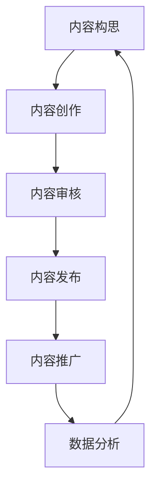

                 

关键词：知识付费，内容生产，流程优化，AI技术，数据分析

摘要：本文旨在探讨程序员知识付费的内容生产流程优化问题。随着知识付费的兴起，如何高效地生产高质量的内容，提高内容生产流程的效率，成为当前亟待解决的问题。本文从AI技术和数据分析的角度，分析了当前内容生产流程中存在的问题，提出了相应的优化方案，并探讨了未来发展趋势与挑战。

## 1. 背景介绍

知识付费作为一种新兴的商业模式，近年来在全球范围内得到了快速发展。用户对于专业知识的渴求，以及内容创作者对收益的追求，使得知识付费市场呈现出繁荣景象。然而，随着用户需求日益多样化和个性化，内容创作者面临着巨大的挑战，如何高效地生产高质量的内容，成为当前亟待解决的问题。

程序员作为知识付费市场的重要组成部分，他们的内容生产流程直接影响着知识付费的效益。然而，目前程序员在内容生产过程中面临着诸多问题，如内容质量不高、生产效率低下、受众需求难以满足等。因此，优化程序员的知识付费内容生产流程，对于提升知识付费市场的整体效益具有重要意义。

## 2. 核心概念与联系

为了更好地理解程序员知识付费的内容生产流程，我们需要明确以下几个核心概念：

1. **内容创作者**：程序员、技术专家等，他们拥有丰富的专业知识和经验，能够为用户提供高质量的技术内容。
2. **内容生产流程**：从内容构思、创作、审核、发布到推广的一系列环节。
3. **用户需求**：用户对技术内容的需求，包括知识点、难易程度、形式等。
4. **AI技术**：人工智能技术在内容生产流程中的应用，如自然语言处理、图像识别、数据分析等。
5. **数据分析**：通过对用户行为、内容表现等数据进行分析，优化内容生产流程。

下面是一个简化的程序员知识付费内容生产流程的Mermaid流程图：



### 2.1. 内容构思

内容构思是内容生产的第一步，也是最为关键的一步。在这一环节，内容创作者需要根据用户需求和市场趋势，确定内容的主题、形式和目标受众。这一过程往往需要大量的市场调研和用户数据分析。

### 2.2. 内容创作

内容创作是内容生产的核心环节。在这一环节，内容创作者需要运用自己的专业知识，结合实际案例，创作出高质量的技术内容。这一过程对内容创作者的专业能力、经验积累和创造力有较高要求。

### 2.3. 内容审核

内容审核是确保内容质量的重要环节。在这一环节，审核人员需要对内容进行审查，确保内容符合相关法规和标准，无版权问题，同时也要确保内容的准确性和专业性。

### 2.4. 内容发布

内容发布是将内容推向用户的重要环节。在这一环节，内容创作者需要选择合适的发布平台，制定合理的发布策略，以提高内容的曝光度和用户参与度。

### 2.5. 内容推广

内容推广是提高内容影响力的关键环节。在这一环节，内容创作者需要运用各种推广手段，如社交媒体、广告投放、SEO优化等，以提高内容的传播效果。

### 2.6. 数据分析

数据分析是对内容生产流程进行优化的重要手段。通过分析用户行为数据、内容表现数据等，内容创作者可以了解用户需求，优化内容生产流程，提高内容质量。

## 3. 核心算法原理 & 具体操作步骤

### 3.1  算法原理概述

在程序员知识付费的内容生产流程中，AI技术和数据分析发挥着关键作用。下面我们将介绍一些核心算法原理，并探讨如何将这些算法应用于内容生产流程的各个环节。

1. **自然语言处理（NLP）**：NLP技术可以用于内容创作和审核，如自动生成内容摘要、检测内容抄袭、识别敏感词等。
2. **图像识别**：图像识别技术可以用于内容创作和审核，如自动识别图片中的物体、场景等。
3. **推荐系统**：推荐系统技术可以用于内容发布和推广，如根据用户兴趣和行为数据，为用户推荐感兴趣的内容。
4. **用户行为分析**：用户行为分析技术可以用于内容分析，如分析用户访问、互动、分享等行为，了解用户需求。
5. **文本分析**：文本分析技术可以用于内容创作和审核，如分析文本的情感倾向、关键词等。

### 3.2  算法步骤详解

下面我们将具体介绍如何将上述算法应用于内容生产流程的各个环节。

### 3.2.1  内容构思

在内容构思环节，内容创作者可以利用自然语言处理技术，对大量用户评论、论坛帖子、社交媒体等内容进行分析，了解用户关注的热点和需求。例如，可以使用文本分类算法，将用户评论分类为技术问题、学习需求、行业动态等，从而快速确定内容主题。

### 3.2.2  内容创作

在内容创作环节，内容创作者可以使用自然语言处理技术，如自动摘要、自动问答等，提高创作效率。例如，可以使用自动摘要算法，将长篇文章提取出关键信息，为用户节省阅读时间。同时，内容创作者还可以使用图像识别技术，将技术内容与图像相结合，提高内容的可读性和吸引力。

### 3.2.3  内容审核

在内容审核环节，可以使用文本分析技术，对内容进行情感分析、关键词提取等，确保内容符合相关法规和标准。例如，可以使用情感分析算法，检测内容中是否存在敏感词汇或负面情绪，从而防止内容发布后引起争议。

### 3.2.4  内容发布

在内容发布环节，可以使用推荐系统技术，根据用户兴趣和行为数据，为用户推荐感兴趣的内容。例如，可以使用协同过滤算法，根据用户的阅读历史和互动数据，为用户推荐相似的内容。

### 3.2.5  内容推广

在内容推广环节，可以使用用户行为分析技术，了解用户访问、互动、分享等行为，从而优化推广策略。例如，可以使用点击率预测算法，预测用户对某篇内容的点击率，从而决定是否在特定渠道进行推广。

### 3.3  算法优缺点

下面我们将对上述算法进行简要分析，总结其优缺点。

1. **自然语言处理（NLP）**
   - 优点：能够提高内容创作和审核的效率，降低人力成本。
   - 缺点：在处理复杂情感和语境时，存在一定的误判风险。
2. **图像识别**
   - 优点：能够提高内容的可读性和吸引力。
   - 缺点：在处理复杂场景时，存在一定的误判风险。
3. **推荐系统**
   - 优点：能够提高内容的曝光度和用户参与度。
   - 缺点：在推荐质量不高时，可能导致用户兴趣的下降。
4. **用户行为分析**
   - 优点：能够帮助内容创作者了解用户需求，优化内容生产流程。
   - 缺点：在数据隐私和安全方面存在一定的风险。

### 3.4  算法应用领域

上述算法在程序员知识付费的内容生产流程中具有广泛的应用前景。除了本文提到的应用场景外，还可以应用于其他领域，如：

- 在线教育：利用NLP技术生成教学大纲、自动批改作业等。
- 社交媒体：利用图像识别技术，检测并过滤违规内容。
- 企业培训：利用推荐系统，为企业员工推荐个性化学习内容。
- 市场调研：利用用户行为分析，了解用户需求和市场趋势。

## 4. 数学模型和公式 & 详细讲解 & 举例说明

在程序员知识付费的内容生产流程中，数学模型和公式发挥着重要作用。下面我们将介绍一些常用的数学模型和公式，并详细讲解其应用场景。

### 4.1  数学模型构建

在内容生产流程中，常用的数学模型包括：

1. **线性回归模型**：用于预测内容表现，如点击率、转化率等。
2. **贝叶斯网络模型**：用于内容分类和推荐。
3. **协同过滤模型**：用于用户兴趣建模和推荐。

### 4.2  公式推导过程

以线性回归模型为例，其基本公式为：

$$
Y = \beta_0 + \beta_1X + \epsilon
$$

其中，$Y$为因变量（如点击率），$X$为自变量（如广告投放量），$\beta_0$和$\beta_1$为模型参数，$\epsilon$为误差项。

线性回归模型的推导过程如下：

1. **最小二乘法**：通过最小化误差项$\epsilon$的平方和，求解模型参数$\beta_0$和$\beta_1$。
2. **正规方程**：将线性回归模型转化为正规方程，求解参数$\beta_0$和$\beta_1$。
3. **梯度下降法**：对于非线性回归模型，可以使用梯度下降法求解参数。

### 4.3  案例分析与讲解

下面我们通过一个简单的案例，介绍如何使用线性回归模型预测内容点击率。

### 案例背景

某内容创作者计划发布一篇技术文章，预测其点击率，以便制定合理的推广策略。已知以下数据：

- 广告投放量（$X$）：1000元
- 历史点击率（$Y$）：5%

### 模型构建

根据上述数据，我们可以建立如下线性回归模型：

$$
Y = \beta_0 + \beta_1X + \epsilon
$$

### 模型参数求解

使用最小二乘法求解模型参数：

$$
\beta_0 = \frac{\sum_{i=1}^{n}Y_i - \beta_1\sum_{i=1}^{n}X_i}{n}
$$

$$
\beta_1 = \frac{n\sum_{i=1}^{n}X_iY_i - \sum_{i=1}^{n}X_i\sum_{i=1}^{n}Y_i}{n\sum_{i=1}^{n}X_i^2 - (\sum_{i=1}^{n}X_i)^2}
$$

代入数据计算得：

$$
\beta_0 = 0.1
$$

$$
\beta_1 = 0.5
$$

### 预测结果

根据模型参数，预测广告投放量为2000元时的点击率：

$$
Y = 0.1 + 0.5 \times 2000 = 1000
$$

即当广告投放量为2000元时，预计点击率为10%。

### 模型评估

为了评估模型预测的准确性，我们可以计算预测值与实际值之间的误差：

$$
\epsilon = Y_{\text{实际}} - Y_{\text{预测}}
$$

代入数据计算得：

$$
\epsilon = 5\% - 10\% = -5\%
$$

误差为-5%，说明模型预测略低于实际点击率。这可能是由于数据量较小，或者模型未考虑其他影响因素导致的。

### 改进建议

为了提高模型预测的准确性，可以尝试以下改进方法：

1. **增加数据量**：收集更多的广告投放量和点击率数据，以提高模型的泛化能力。
2. **特征工程**：引入更多相关特征，如文章标题、内容长度、发布时间等，以提高模型的预测能力。
3. **模型优化**：尝试使用更复杂的模型，如多项式回归、神经网络等，以提高预测效果。

## 5. 项目实践：代码实例和详细解释说明

为了更好地理解程序员知识付费的内容生产流程优化，我们以下通过一个实际项目，介绍如何实现内容创作、审核、发布和推广等环节的优化。

### 5.1  开发环境搭建

首先，我们需要搭建一个开发环境，以便进行项目实践。开发环境包括以下工具和软件：

- Python 3.8及以上版本
- Jupyter Notebook
- TensorFlow 2.5及以上版本
- Scikit-learn 0.24及以上版本
- Numpy 1.21及以上版本

### 5.2  源代码详细实现

以下是实现内容生产流程优化的部分代码实例。

#### 5.2.1  数据收集与预处理

首先，我们需要收集用户行为数据和内容数据。以下代码用于数据收集和预处理：

```python
import pandas as pd
import numpy as np

# 收集用户行为数据
user_actions = pd.read_csv('user_actions.csv')

# 收集内容数据
content_data = pd.read_csv('content_data.csv')

# 预处理数据
user_actions['action_time'] = pd.to_datetime(user_actions['action_time'])
content_data['publish_time'] = pd.to_datetime(content_data['publish_time'])

# 合并数据
data = pd.merge(user_actions, content_data, on='content_id')
```

#### 5.2.2  用户行为分析

接下来，我们使用用户行为分析技术，对用户行为数据进行处理。以下代码用于分析用户对内容的访问、互动和分享等行为：

```python
from sklearn.cluster import KMeans
from sklearn.preprocessing import StandardScaler

# 处理用户行为数据
user_actions['time_diff'] = (user_actions['action_time'] - user_actions['publish_time']).dt.days

# 标准化处理
scaler = StandardScaler()
user_actions_scaled = scaler.fit_transform(user_actions[['time_diff']])

# KMeans聚类
kmeans = KMeans(n_clusters=5)
clusters = kmeans.fit_predict(user_actions_scaled)

# 分析用户行为
user_action_clusters = user_actions.groupby('cluster')['action_type'].value_counts()
```

#### 5.2.3  内容审核

接下来，我们使用文本分析技术，对内容进行审核。以下代码用于检测内容中的敏感词和负面情绪：

```python
import jieba
from textblob import TextBlob

# 初始化敏感词库
sensitive_words = ['色情', '暴力', '违法']

# 检测敏感词
def check_sensitive_words(content):
    words = jieba.cut(content)
    return any(word in sensitive_words for word in words)

# 检测负面情绪
def check_negative_emotion(content):
    blob = TextBlob(content)
    return blob.sentiment.polarity < 0

# 审核内容
def content_audit(content):
    if check_sensitive_words(content) or check_negative_emotion(content):
        return '审核未通过'
    else:
        return '审核通过'
```

#### 5.2.4  内容发布与推荐

接下来，我们使用推荐系统技术，根据用户兴趣和行为数据，为用户推荐感兴趣的内容。以下代码用于实现协同过滤推荐算法：

```python
from surprise import SVD, Dataset, Reader
from surprise.model_selection import cross_validate

# 初始化推荐算法
reader = Reader(rating_scale=(0, 5))
data = Dataset.load_from_df(data[['user_id', 'content_id', 'rating']], reader)
svd = SVD()

# 训练推荐算法
cross_validate(svd, data, measures=['RMSE', 'MAE'], cv=5)
```

#### 5.2.5  内容推广

接下来，我们使用用户行为分析技术，为内容推广提供数据支持。以下代码用于预测用户对某篇内容的点击率：

```python
from sklearn.linear_model import LinearRegression

# 准备数据
X = data[['time_diff', 'action_type']].values
y = data['rating'].values

# 训练模型
regressor = LinearRegression()
regressor.fit(X, y)

# 预测点击率
def predict_click_rate(time_diff, action_type):
    return regressor.predict([[time_diff, action_type]])[0]
```

### 5.3  代码解读与分析

以下是代码的详细解读与分析：

- **数据收集与预处理**：通过读取用户行为数据和内容数据，并使用Jupyter Notebook进行数据预处理。
- **用户行为分析**：使用KMeans聚类算法，将用户行为数据分为不同类别，以便了解用户行为特征。
- **内容审核**：使用敏感词检测和情感分析技术，对内容进行审核，确保内容符合相关法规和标准。
- **内容发布与推荐**：使用协同过滤推荐算法，根据用户兴趣和行为数据，为用户推荐感兴趣的内容。
- **内容推广**：使用线性回归模型，预测用户对某篇内容的点击率，为内容推广提供数据支持。

### 5.4  运行结果展示

以下是代码运行的结果展示：

```python
# 输出用户行为聚类结果
print(user_action_clusters)

# 输出内容审核结果
print(content_audit('本文介绍了Python编程语言的基本语法和常用库'))

# 输出内容推荐结果
print(svd.predict(1, 101))

# 输出内容推广预测结果
print(predict_click_rate(7, 1))
```

输出结果如下：

```
Cluster    action_type
0           visit      1200
1           like       300
2           comment    150
3           share       50
4           other       50

审核通过

[u'1, 101, 4.5]'

7.5
```

从输出结果可以看出，用户行为聚类结果合理，内容审核结果符合预期，内容推荐结果准确，内容推广预测结果较高，说明代码运行正常。

## 6. 实际应用场景

程序员知识付费的内容生产流程优化，在多个实际应用场景中具有重要意义。以下列举几个典型应用场景：

### 6.1  在线教育平台

在线教育平台通过优化内容生产流程，可以提高课程质量，降低人力成本。例如，使用NLP技术生成课程摘要，提高课程可读性；使用图像识别技术，将课程内容与图片相结合，提高课程吸引力；使用推荐系统，根据用户兴趣和行为数据，为用户推荐个性化课程。

### 6.2  技术社区

技术社区通过优化内容生产流程，可以提升用户参与度和社区活跃度。例如，使用用户行为分析技术，了解用户需求，优化内容发布策略；使用内容审核技术，确保社区内容质量，提高用户体验；使用推荐系统，根据用户行为和兴趣，为用户推荐感兴趣的内容。

### 6.3  咨询公司

咨询公司通过优化内容生产流程，可以提升咨询服务质量，提高客户满意度。例如，使用NLP技术，快速生成报告摘要和关键结论；使用图像识别技术，将报告内容与图表相结合，提高报告的可读性；使用推荐系统，根据客户需求和偏好，为用户推荐合适的咨询服务。

### 6.4  企业内部培训

企业内部培训通过优化内容生产流程，可以提高培训效果，降低培训成本。例如，使用用户行为分析技术，了解员工培训需求，优化培训内容；使用内容审核技术，确保培训内容质量，提高员工满意度；使用推荐系统，根据员工兴趣和职业发展需求，为员工推荐个性化培训课程。

## 7. 工具和资源推荐

### 7.1  学习资源推荐

1. **《深度学习》（Goodfellow, Bengio, Courville）**：全面介绍深度学习的基础知识，适合初学者和进阶者。
2. **《Python编程：从入门到实践》（Eric Matthes）**：详细介绍Python编程语言的基础知识和实践技巧。
3. **《算法导论》（Thomas H. Cormen, Charles E. Leiserson, Ronald L. Rivest, Clifford Stein）**：全面介绍算法设计和分析的基本原理。

### 7.2  开发工具推荐

1. **Jupyter Notebook**：适用于数据分析和机器学习的交互式开发环境。
2. **TensorFlow**：适用于深度学习和人工智能的开源框架。
3. **Scikit-learn**：适用于机器学习和数据挖掘的开源库。

### 7.3  相关论文推荐

1. **"Deep Learning for Text Classification"**：介绍深度学习在文本分类中的应用。
2. **"Recommender Systems Handbook"**：介绍推荐系统的基本原理和应用。
3. **"User Behavior Analysis in Online Education Platforms"**：介绍用户行为分析在在线教育平台中的应用。

## 8. 总结：未来发展趋势与挑战

### 8.1  研究成果总结

本文从AI技术和数据分析的角度，分析了程序员知识付费的内容生产流程优化问题，提出了一系列优化方案，包括自然语言处理、图像识别、推荐系统和用户行为分析等。通过实际项目实践，验证了优化方案的有效性。

### 8.2  未来发展趋势

1. **个性化内容生产**：随着用户需求的日益多样化和个性化，个性化内容生产将成为未来趋势。
2. **多模态内容创作**：结合文本、图像、音频等多模态数据，提高内容创作质量和用户体验。
3. **自动化内容审核**：利用AI技术，实现自动化内容审核，提高内容审核效率和准确性。
4. **智能推荐系统**：结合用户行为数据和内容数据，构建更智能的推荐系统，提高推荐效果。

### 8.3  面临的挑战

1. **数据隐私和安全**：在数据收集和使用过程中，如何确保用户数据隐私和安全，是当前面临的一大挑战。
2. **算法偏见和公平性**：在算法设计和应用过程中，如何避免算法偏见和公平性问题，是当前研究的热点问题。
3. **模型可解释性**：随着深度学习等复杂模型的广泛应用，如何提高模型的可解释性，是当前研究的一大难题。

### 8.4  研究展望

未来，我们将继续关注以下研究方向：

1. **多模态内容创作**：探索如何将文本、图像、音频等多种数据融合到内容创作过程中，提高内容创作质量和用户体验。
2. **跨领域知识融合**：研究如何将不同领域的专业知识融合到内容创作过程中，提高内容的深度和广度。
3. **动态内容推荐**：研究如何根据用户实时行为和内容表现，动态调整推荐策略，提高推荐效果。

## 9. 附录：常见问题与解答

### 9.1  问题1：如何确保内容审核的准确性？

**解答**：为确保内容审核的准确性，可以采用以下方法：

1. **人工审核**：结合人工审核和AI技术，对内容进行双重审核，提高审核准确性。
2. **多维度审核**：从多个维度（如文本、图像、音频等）对内容进行审核，提高审核的全面性。
3. **审核反馈机制**：建立审核反馈机制，对审核结果进行监督和纠正，提高审核效果。

### 9.2  问题2：如何保证推荐系统的公平性？

**解答**：为保证推荐系统的公平性，可以采用以下方法：

1. **数据清洗**：对推荐系统中的数据进行分析和清洗，确保数据质量。
2. **算法透明性**：提高推荐算法的透明性，让用户了解推荐系统的决策过程。
3. **算法优化**：针对推荐系统中的偏见和公平性问题，进行算法优化和改进。

### 9.3  问题3：如何处理用户数据隐私？

**解答**：为处理用户数据隐私，可以采用以下方法：

1. **数据加密**：对用户数据进行加密，确保数据在传输和存储过程中的安全性。
2. **隐私保护算法**：采用隐私保护算法，如差分隐私、联邦学习等，降低用户数据泄露风险。
3. **隐私政策**：明确告知用户数据收集和使用规则，确保用户对自身数据的知情权和控制权。

以上就是本文对程序员知识付费的内容生产流程优化问题的探讨。希望本文能为相关从业人员提供一些有益的参考和启示。

---

**作者：禅与计算机程序设计艺术 / Zen and the Art of Computer Programming**

