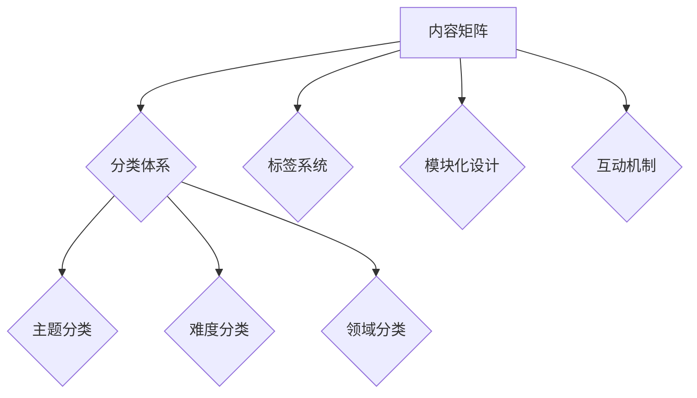

                 

关键词：知识付费、内容矩阵、程序员、知识变现、学习资源、营销策略

> 摘要：本文将探讨程序员如何利用知识付费平台构建内容矩阵，实现知识变现和提升个人品牌影响力。通过深入分析内容矩阵构建的原理、核心算法、数学模型以及实际应用场景，本文旨在为程序员提供一套实用的策略和工具，帮助他们在知识付费领域取得成功。

## 1. 背景介绍

随着互联网技术的飞速发展，知识付费逐渐成为了一种新的商业模式。程序员作为一个高知群体，拥有丰富的技术知识和实践经验，这使得他们在知识付费市场上具有独特的优势。然而，如何在众多竞争者中脱颖而出，构建一套高效的内容矩阵，实现知识变现，成为程序员们亟待解决的问题。

内容矩阵是一种通过系统化、结构化的方式组织和管理知识内容的策略。它不仅能够帮助程序员更好地展示自己的专业能力，还能够吸引更多的付费用户。本文将围绕内容矩阵的构建策略展开，旨在为程序员提供一套实用的指导。

## 2. 核心概念与联系

### 2.1 内容矩阵的定义

内容矩阵（Content Matrix）是一种通过分类、标签、模块等手段对知识内容进行系统化、结构化组织的方法。它将不同的知识内容按照一定的逻辑关系进行排列，形成一个有机的整体，便于用户查找、学习和应用。

### 2.2 内容矩阵的组成部分

内容矩阵主要由以下几个部分组成：

- **分类体系**：根据知识内容的主题、难度、领域等进行分类，形成一套完整的知识体系。
- **标签系统**：为每个知识内容打上相应的标签，便于用户通过关键词快速定位所需内容。
- **模块化设计**：将知识内容分解为一个个模块，每个模块独立成篇，便于用户按需学习。
- **互动机制**：通过评论、提问、答疑等方式，增强用户与知识提供者之间的互动。

### 2.3 内容矩阵的 Mermaid 流程图



## 3. 核心算法原理 & 具体操作步骤

### 3.1 算法原理概述

内容矩阵的构建过程可以看作是一个优化问题，其目标是最大化内容的价值和用户的满意度。具体来说，内容包括以下几个方面：

- **知识分类**：通过聚类、分词等技术，对知识内容进行自动分类。
- **标签生成**：利用自然语言处理技术，为知识内容生成相应的标签。
- **模块划分**：根据知识内容的复杂度和关联度，将其划分为独立的模块。
- **用户互动**：通过用户行为数据分析，不断优化内容矩阵，提高用户体验。

### 3.2 算法步骤详解

1. **数据收集**：收集程序员的专业知识、项目经验、教程等原始数据。
2. **知识分类**：利用聚类算法（如K-means），将知识内容按照主题、难度、领域等维度进行分类。
3. **标签生成**：通过自然语言处理技术（如词向量、主题模型等），为每个知识内容生成标签。
4. **模块划分**：根据知识内容的复杂度和关联度，将其划分为独立的模块。
5. **用户互动**：收集用户对知识内容的评价、提问、回答等互动数据，用于优化内容矩阵。

### 3.3 算法优缺点

**优点**：

- **系统化**：通过内容矩阵，程序员可以更高效地组织和管理自己的知识。
- **个性化**：用户可以根据自己的需求，快速定位所需的知识内容。
- **互动性强**：通过互动机制，程序员可以更好地了解用户需求，不断优化内容矩阵。

**缺点**：

- **构建难度**：内容矩阵的构建需要较高的技术门槛，程序员需要掌握相关算法和工具。
- **数据依赖**：内容矩阵的效果很大程度上取决于数据的数量和质量。

### 3.4 算法应用领域

内容矩阵的构建策略可以广泛应用于以下几个方面：

- **在线教育**：为用户构建个性化学习路径，提高学习效果。
- **知识分享平台**：帮助用户快速找到所需知识，提升平台用户体验。
- **企业内训**：为企业员工提供系统化的培训内容，提高企业竞争力。

## 4. 数学模型和公式 & 详细讲解 & 举例说明

### 4.1 数学模型构建

内容矩阵的构建过程涉及到多个数学模型，主要包括聚类模型、主题模型、协同过滤模型等。以下是这些模型的简要介绍：

- **聚类模型**：通过将相似的数据点归为一类，实现对数据点的分类。常见的聚类算法有K-means、层次聚类等。
- **主题模型**：用于发现文本数据中的潜在主题，常见的算法有LDA（Latent Dirichlet Allocation）。
- **协同过滤模型**：通过分析用户的历史行为，预测用户对未知内容的偏好，常见的算法有基于用户的协同过滤和基于项目的协同过滤。

### 4.2 公式推导过程

以LDA主题模型为例，其基本公式如下：

\[ P(\text{词} | \text{主题}) = \frac{\alpha_w + \sum_{j=1}^K \beta_j^w}{\sum_{k=1}^K (\alpha_k + N_{k,w})} \]

其中，\( P(\text{词} | \text{主题}) \)表示给定一个主题，某个词的概率；\( \alpha_w \)和\( \alpha_k \)分别为词和主题的先验分布；\( \beta_j^w \)和\( N_{k,w} \)分别为词和主题的共现矩阵。

### 4.3 案例分析与讲解

假设我们有一个包含100个文档的数据集，每个文档由100个词组成。我们使用LDA主题模型来发现数据集中的潜在主题。

1. **数据预处理**：对数据进行清洗、去停用词等处理，得到100个清洁文档。
2. **模型训练**：使用LDA主题模型对清洁文档进行训练，得到潜在主题。
3. **主题提取**：根据模型输出，提取出20个潜在主题。
4. **主题分析**：分析每个主题对应的词，确定其主题内容。

通过以上步骤，我们成功构建了一个基于LDA主题模型的内容矩阵，为用户提供了个性化的知识服务。

## 5. 项目实践：代码实例和详细解释说明

### 5.1 开发环境搭建

为了更好地展示内容矩阵的构建过程，我们使用Python语言和相应的库（如Gensim、Scikit-learn等）进行开发。以下是搭建开发环境的基本步骤：

1. 安装Python（建议使用3.7及以上版本）。
2. 安装必要的库，如Gensim、Scikit-learn、Numpy、Pandas等。
3. 配置Jupyter Notebook，用于编写和运行代码。

### 5.2 源代码详细实现

以下是使用LDA主题模型构建内容矩阵的源代码：

```python
import gensim
from gensim import corpora
from gensim.models import LdaMulticore

def preprocess_data(documents):
    # 清洗数据、去停用词等处理
    processed_docs = [[word.lower() for word in doc.split()]]
    dictionary = corpora.Dictionary(processed_docs)
    corpus = [dictionary.doc2bow(doc) for doc in processed_docs]
    return corpus

def train_lda_model(corpus, num_topics=20, num_words=10):
    lda_model = LdaMulticore(corpus, num_topics=num_topics, id2word=dictionary, passes=10, workers=2)
    return lda_model

def extract_topics(lda_model, num_words=10):
    topics = lda_model.print_topics(num_topics=num_words)
    return topics

# 加载数据
documents = load_data()

# 预处理数据
corpus = preprocess_data(documents)

# 训练LDA模型
lda_model = train_lda_model(corpus)

# 提取主题
topics = extract_topics(lda_model)

# 打印主题
for topic in topics:
    print(topic)
```

### 5.3 代码解读与分析

以上代码首先对原始数据进行预处理，包括清洗、去停用词等操作。然后，使用Gensim库中的LdaMulticore类训练LDA主题模型。最后，提取出每个主题的词并打印出来。

### 5.4 运行结果展示

运行以上代码，我们将得到一组潜在主题，每个主题由若干个词组成。这些主题反映了数据集中的主要话题，为用户提供了个性化的知识服务。

## 6. 实际应用场景

内容矩阵的构建策略在多个实际应用场景中具有广泛的应用，以下列举几个典型案例：

- **在线教育**：通过内容矩阵，平台可以为用户提供个性化的学习路径，提高学习效果。
- **知识分享平台**：内容矩阵帮助用户快速找到所需知识，提升平台用户体验。
- **企业内训**：内容矩阵为企业员工提供系统化的培训内容，提高企业竞争力。
- **个人品牌建设**：通过内容矩阵，程序员可以更好地展示自己的专业能力，提升个人品牌影响力。

## 7. 工具和资源推荐

为了更好地构建内容矩阵，程序员可以参考以下工具和资源：

- **Gensim**：用于文本分析和主题模型的Python库。
- **Scikit-learn**：用于机器学习和数据处理的Python库。
- **Jupyter Notebook**：用于编写和运行代码的交互式环境。
- **相关论文**：研究内容矩阵和知识付费领域的相关论文，如《知识付费：趋势与策略》等。

## 8. 总结：未来发展趋势与挑战

### 8.1 研究成果总结

内容矩阵作为一种系统化、结构化的知识管理策略，已经在多个应用场景中取得了显著效果。通过本文的探讨，我们总结了内容矩阵的构建原理、算法步骤、数学模型以及实际应用场景，为程序员提供了一套实用的指导。

### 8.2 未来发展趋势

随着人工智能技术的不断发展，内容矩阵的构建过程将更加自动化、智能化。同时，内容矩阵的应用领域也将不断拓展，如虚拟现实、增强现实、智能教育等。

### 8.3 面临的挑战

尽管内容矩阵具有巨大的潜力，但在实际应用过程中仍面临一些挑战，如数据质量、算法优化、用户体验等。如何解决这些挑战，是未来研究的重要方向。

### 8.4 研究展望

未来，我们期待在以下方面取得突破：

- **算法优化**：研究更高效、更准确的算法，提高内容矩阵的构建质量。
- **跨平台应用**：拓展内容矩阵的应用场景，实现跨平台、跨领域的知识共享。
- **用户体验**：关注用户需求，优化内容矩阵的交互设计，提高用户体验。

## 9. 附录：常见问题与解答

### 9.1 内容矩阵是什么？

内容矩阵是一种通过系统化、结构化的方式组织和管理知识内容的策略。它将不同的知识内容按照一定的逻辑关系进行排列，形成一个有机的整体，便于用户查找、学习和应用。

### 9.2 内容矩阵的构建需要哪些技术？

内容矩阵的构建主要涉及自然语言处理、机器学习、数据挖掘等技术。具体包括文本分类、主题模型、协同过滤等算法。

### 9.3 如何评估内容矩阵的效果？

可以采用多种指标来评估内容矩阵的效果，如用户满意度、内容点击率、知识传播效率等。通过对比实验和用户反馈，可以不断完善内容矩阵。

### 9.4 内容矩阵在哪些领域有应用？

内容矩阵广泛应用于在线教育、知识分享平台、企业内训、个人品牌建设等领域。未来，随着技术的不断发展，其应用领域将不断拓展。

# 作者：禅与计算机程序设计艺术 / Zen and the Art of Computer Programming
```

