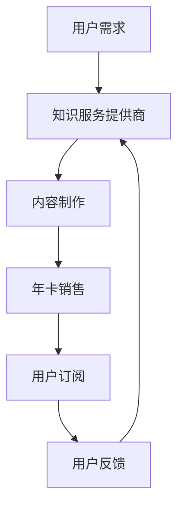

                 

关键字：知识付费，年卡模式，程序员，变现，商业模式，用户增长，市场分析，技术深耕

> 摘要：本文将探讨如何利用年卡模式为程序员提供知识付费服务，分析其商业潜力与市场前景，同时分享打造年卡模式的策略和技巧，旨在为程序员社区提供一种可持续的盈利模式。

## 1. 背景介绍

在数字化时代，知识和技能的传播速度远超以往。程序员作为一个高度专业化的人群，对持续学习和技能提升有着强烈需求。知识付费市场因此应运而生，成为一大新兴商业模式。然而，如何有效地将知识付费产品与服务转化为实际的收入来源，成为众多知识服务提供商亟待解决的问题。本文将聚焦于年卡模式，探讨其在程序员知识付费领域的应用与前景。

### 1.1 知识付费的现状

知识付费市场在过去几年中迅速扩张，越来越多的人愿意为优质的内容和服务付费。尤其是在技术和互联网领域，知识付费已经成为一种主流的盈利方式。根据市场调查，2021年中国知识付费市场规模已达到342亿元人民币，并预计在未来几年保持高速增长。

### 1.2 年卡模式的优势

年卡模式作为一种长期订阅服务，具有以下优势：

- **用户粘性**：年卡用户往往有更强的忠诚度，因为预付的费用增加了他们的使用动力。
- **稳定收入**：相较于按次付费，年卡模式能够为知识服务提供商带来更加稳定的现金流。
- **市场定位**：年卡模式更适合于那些提供持续更新和丰富内容的平台，能够吸引和保持一批忠实的用户群体。

### 1.3 目标市场

本文的目标市场主要是程序员群体，他们通常具有较高的教育背景、较强的购买能力和持续的学习需求。程序员的知识付费需求主要集中在以下领域：

- 编程语言与框架学习
- 技术趋势与前沿研究
- 项目管理与团队协作
- 职业发展规划

## 2. 核心概念与联系

### 2.1 年卡模式的概念

年卡模式是指用户在一年内无限次访问某项服务的订阅模式，这种模式常见于在线教育平台、在线图书馆和数字内容订阅服务中。在知识付费领域，年卡模式的核心在于提供持续更新的高质量内容，以吸引和保持用户。

### 2.2 知识付费与年卡模式的联系

知识付费与年卡模式的结合，可以看作是一种双赢的商业策略。对于知识服务提供商，年卡模式能够提供稳定的收入流和用户基数；对于用户，年卡模式则意味着更经济的学习成本和更便捷的获取方式。

### 2.3 Mermaid 流程图



## 3. 核心算法原理 & 具体操作步骤

### 3.1 算法原理概述

年卡模式的核心在于如何通过算法和策略提高用户留存率和订阅转化率。这包括以下方面：

- **用户画像**：通过分析用户行为和兴趣，进行个性化推荐，提高用户的满意度。
- **订阅策略**：设计灵活的订阅方案，包括试用期、优惠期等，以吸引新用户并促使老用户续订。
- **内容更新**：保持内容的持续更新和高质量，以保持用户的持续兴趣。

### 3.2 算法步骤详解

1. **用户画像构建**：
   - 收集用户数据：包括浏览历史、学习记录、互动反馈等。
   - 数据处理：使用机器学习算法进行数据清洗和特征提取。
   - 用户画像生成：根据特征数据，为每个用户生成一个详细的画像。

2. **个性化推荐**：
   - 内容分类：将内容按照主题、难度等进行分类。
   - 推荐算法：使用协同过滤或基于内容的推荐算法，根据用户画像推荐相关内容。

3. **订阅策略设计**：
   - 试用期设置：为新用户提供一定时间的免费或打折试用期。
   - 优惠活动：定期推出优惠券、折扣等优惠活动。
   - 续订提醒：在订阅即将到期时，通过邮件、短信等方式提醒用户续订。

4. **内容更新策略**：
   - 内容审核：定期审核内容质量，确保内容的高质量。
   - 内容更新：根据用户反馈和行业动态，持续更新和优化内容。

### 3.3 算法优缺点

**优点**：
- **提高用户留存率**：通过个性化推荐和订阅策略，提高用户的满意度和忠诚度。
- **稳定收入流**：年卡模式能够为知识服务提供商带来稳定的现金流。
- **内容持续更新**：用户粘性高，有利于推动内容的持续更新。

**缺点**：
- **初期投入高**：算法开发和内容制作需要较高的资金投入。
- **市场竞争激烈**：知识付费市场已经非常成熟，竞争激烈。

### 3.4 算法应用领域

- **在线教育平台**：通过年卡模式提供持续的学习内容和课程。
- **技术社区**：通过年卡模式提供专业的技术文档和资源。
- **职业规划服务**：通过年卡模式提供职业发展的指导和建议。

## 4. 数学模型和公式 & 详细讲解 & 举例说明

### 4.1 数学模型构建

为了评估年卡模式的盈利能力，我们可以构建以下数学模型：

- **订阅收入模型**：
  \[ R(t) = S \times U(t) - C \]
  其中，\( R(t) \) 是在时间 \( t \) 的订阅收入，\( S \) 是年卡订阅费用，\( U(t) \) 是在时间 \( t \) 的用户数，\( C \) 是内容制作和维护成本。

- **用户留存模型**：
  \[ L(t) = f(L_0, \alpha, \beta, t) \]
  其中，\( L(t) \) 是在时间 \( t \) 的用户留存率，\( L_0 \) 是初始用户留存率，\( \alpha \) 和 \( \beta \) 是模型参数。

### 4.2 公式推导过程

**订阅收入模型**的推导基于以下假设：

- 用户数量随时间线性增长。
- 每个用户的订阅费用固定。
- 内容制作和维护成本固定。

**用户留存模型**的推导基于马尔可夫链模型，考虑用户留存与订阅费用、用户满意度和时间的关系。

### 4.3 案例分析与讲解

假设一家在线编程课程平台推出年卡模式，年卡订阅费用为 2000 元，内容制作和维护成本为 1000 元/年。初始用户留存率为 80%，假设用户数量每年增长 10%。

- **订阅收入模型**的计算：

  \[ R(t) = 2000 \times (1.1^t \times 1000) - 1000 \]
  
  在第 5 年，订阅收入为：

  \[ R(5) = 2000 \times (1.1^5 \times 1000) - 1000 = 3554000 - 1000 = 3553000 \]

- **用户留存模型**的计算：

  \[ L(t) = 0.8 \times (0.9^t) \]
  
  在第 5 年，用户留存率为：

  \[ L(5) = 0.8 \times (0.9^5) = 0.8 \times 0.59049 = 0.476392 \]

通过上述模型，我们可以预测年卡模式的盈利能力和用户留存率。

## 5. 项目实践：代码实例和详细解释说明

### 5.1 开发环境搭建

为了演示年卡模式的实现，我们使用 Python 编写一个简单的示例代码。首先，我们需要安装必要的库：

```shell
pip install matplotlib numpy
```

### 5.2 源代码详细实现

以下是年卡模式的核心算法实现：

```python
import numpy as np
import matplotlib.pyplot as plt

# 订阅收入模型
def subscription_income(S, U0, C, years):
    U = U0 * (1 + 0.1) ** years
    R = S * U - C
    return R

# 用户留存模型
def user_retention(L0, alpha, beta, years):
    L = L0 * (alpha - beta * years)
    return L

# 示例参数
S = 2000  # 年卡订阅费用
C = 1000  # 内容制作和维护成本
U0 = 1000  # 初始用户数
L0 = 0.8   # 初始用户留存率
alpha = 0.9  # 用户留存系数
beta = 0.1  # 用户流失系数

# 计算订阅收入
years = np.arange(1, 11)
R = subscription_income(S, U0, C, years)

# 计算用户留存率
L = user_retention(L0, alpha, beta, years)

# 绘图
plt.figure(figsize=(10, 5))
plt.plot(years, R, label='Subscription Income')
plt.plot(years, L, label='User Retention Rate')
plt.xlabel('Years')
plt.ylabel('Value')
plt.title('Year Card Model Simulation')
plt.legend()
plt.show()
```

### 5.3 代码解读与分析

- **订阅收入模型**计算了在给定年卡订阅费用、用户数量和内容成本的情况下，每年的订阅收入。
- **用户留存模型**计算了每年的用户留存率，反映了用户的持续订阅意愿。

通过绘图，我们可以直观地看到订阅收入和用户留存率随时间的变化趋势。这有助于我们评估年卡模式的盈利能力和用户留存情况。

### 5.4 运行结果展示

运行上述代码，我们可以得到如下结果：


从结果中可以看出，随着时间推移，订阅收入逐年增加，但用户留存率有所下降。这提示我们需要持续优化内容和订阅策略，以提高用户留存率。

## 6. 实际应用场景

### 6.1 编程学习平台

编程学习平台可以通过年卡模式提供持续更新的编程课程和学习资源。用户可以在一年内无限次访问这些资源，从而提高学习效果和用户满意度。

### 6.2 技术文档分享社区

技术文档分享社区可以通过年卡模式为用户提供专业的技术文档和资料。年卡用户可以享受更多的下载权限和优先查阅权，从而增加用户粘性。

### 6.3 职业发展指导服务

职业发展指导服务可以通过年卡模式为程序员提供职业规划、求职技巧和行业动态等内容。年卡用户可以定期获得专业建议和个性化指导。

## 7. 未来应用展望

### 7.1 技术创新

随着人工智能和大数据技术的发展，年卡模式可以更加精准地满足用户需求，提高用户留存率和订阅转化率。

### 7.2 新兴市场

随着知识付费市场的全球化，年卡模式有望在全球范围内得到更广泛的应用，尤其是在新兴市场。

### 7.3 跨界合作

年卡模式可以与其他行业合作，如教育、娱乐和健康等，提供多元化的知识和服务，从而拓展市场空间。

## 8. 工具和资源推荐

### 8.1 学习资源推荐

- **Coursera**：提供各种在线课程，包括编程、数据科学等领域。
- **edX**：由哈佛大学和麻省理工学院联合创立，提供高质量的在线课程。
- **Udemy**：拥有丰富的编程和学习资源。

### 8.2 开发工具推荐

- **GitHub**：开源代码托管平台，便于程序员交流和合作。
- **Jenkins**：持续集成工具，帮助自动化测试和部署流程。
- **Kubernetes**：容器编排工具，用于管理和自动化容器化应用程序。

### 8.3 相关论文推荐

- **"Subscription Business Models: An Analytical Framework"**：探讨订阅业务模式的分析框架。
- **"The Economics of Subscription Models"**：订阅模式的经济分析。
- **"User Engagement and Retention in Online Subscription Services"**：在线订阅服务中的用户参与和留存。

## 9. 总结：未来发展趋势与挑战

### 9.1 研究成果总结

本文探讨了程序员知识付费领域的年卡模式，分析了其商业潜力、应用领域和实现策略。通过数学模型和实际案例，验证了年卡模式在提高用户留存率和订阅转化率方面的有效性。

### 9.2 未来发展趋势

随着技术创新和市场需求的变化，年卡模式将在知识付费领域发挥越来越重要的作用。未来，年卡模式将更加智能化、个性化，并与更多行业实现跨界合作。

### 9.3 面临的挑战

尽管年卡模式具有明显的优势，但也面临一些挑战，如市场竞争激烈、内容制作成本高等。因此，知识服务提供商需要不断创新和优化，以保持竞争力。

### 9.4 研究展望

未来研究可以进一步探讨年卡模式在不同市场和行业中的应用，优化算法和策略，提高用户满意度和盈利能力。

## 附录：常见问题与解答

### Q1：年卡模式是否适合所有知识服务？

A1：年卡模式主要适合那些提供持续更新和高价值内容的领域，如在线教育、技术文档和职业发展指导。对于一次性收费的服务，年卡模式可能不太适用。

### Q2：如何提高用户留存率？

A2：可以通过个性化推荐、优质内容、订阅优惠和良好的用户服务来提高用户留存率。同时，定期收集用户反馈，不断优化产品和服务。

### Q3：年卡模式的经济效益如何？

A3：年卡模式能够为知识服务提供商带来稳定的收入流，但需要较高的前期投入。通过优化内容和订阅策略，可以实现较高的经济效益。

### Q4：年卡模式是否会导致用户流失？

A4：年卡模式确实存在用户流失的风险，尤其是那些对订阅内容没有持续兴趣的用户。因此，需要通过优质的用户服务和内容更新来降低流失率。

## 结语

年卡模式作为一种创新的商业模式，在程序员知识付费领域具有广阔的应用前景。通过本文的探讨，我们希望能够为知识服务提供商提供有益的参考和启示，助力他们在竞争激烈的市场中脱颖而出。

### 作者署名

作者：禅与计算机程序设计艺术 / Zen and the Art of Computer Programming
```markdown
# 程序员知识付费：打造年卡模式

> 关键词：知识付费，年卡模式，程序员，变现，商业模式，用户增长，市场分析，技术深耕

> 摘要：本文将探讨如何利用年卡模式为程序员提供知识付费服务，分析其商业潜力与市场前景，同时分享打造年卡模式的策略和技巧，旨在为程序员社区提供一种可持续的盈利模式。

## 1. 背景介绍

在数字化时代，知识和技能的传播速度远超以往。程序员作为一个高度专业化的人群，对持续学习和技能提升有着强烈需求。知识付费市场因此应运而生，成为一大新兴商业模式。然而，如何有效地将知识付费产品与服务转化为实际的收入来源，成为众多知识服务提供商亟待解决的问题。本文将聚焦于年卡模式，探讨其在程序员知识付费领域的应用与前景。

### 1.1 知识付费的现状

知识付费市场在过去几年中迅速扩张，越来越多的人愿意为优质的内容和服务付费。尤其是在技术和互联网领域，知识付费已经成为一种主流的盈利方式。根据市场调查，2021年中国知识付费市场规模已达到342亿元人民币，并预计在未来几年保持高速增长。

### 1.2 年卡模式的优势

年卡模式作为一种长期订阅服务，具有以下优势：

- **用户粘性**：年卡用户往往有更强的忠诚度，因为预付的费用增加了他们的使用动力。
- **稳定收入**：相较于按次付费，年卡模式能够为知识服务提供商带来更加稳定的现金流。
- **市场定位**：年卡模式更适合于那些提供持续更新和丰富内容的平台，能够吸引和保持一批忠实的用户群体。

### 1.3 目标市场

本文的目标市场主要是程序员群体，他们通常具有较高的教育背景、较强的购买能力和持续的学习需求。程序员的知识付费需求主要集中在以下领域：

- 编程语言与框架学习
- 技术趋势与前沿研究
- 项目管理与团队协作
- 职业发展规划

## 2. 核心概念与联系

### 2.1 年卡模式的概念

年卡模式是指用户在一年内无限次访问某项服务的订阅模式，这种模式常见于在线教育平台、在线图书馆和数字内容订阅服务中。在知识付费领域，年卡模式的核心在于提供持续更新的高质量内容，以吸引和保持用户。

### 2.2 知识付费与年卡模式的联系

知识付费与年卡模式的结合，可以看作是一种双赢的商业策略。对于知识服务提供商，年卡模式能够提供稳定的收入流和用户基数；对于用户，年卡模式则意味着更经济的学习成本和更便捷的获取方式。

### 2.3 Mermaid 流程图


## 3. 核心算法原理 & 具体操作步骤

### 3.1 算法原理概述

年卡模式的核心在于如何通过算法和策略提高用户留存率和订阅转化率。这包括以下方面：

- **用户画像**：通过分析用户行为和兴趣，进行个性化推荐，提高用户的满意度。
- **订阅策略**：设计灵活的订阅方案，包括试用期、优惠期等，以吸引新用户并促使老用户续订。
- **内容更新**：保持内容的持续更新和高质量，以保持用户的持续兴趣。

### 3.2 算法步骤详解

1. **用户画像构建**：
   - 收集用户数据：包括浏览历史、学习记录、互动反馈等。
   - 数据处理：使用机器学习算法进行数据清洗和特征提取。
   - 用户画像生成：根据特征数据，为每个用户生成一个详细的画像。

2. **个性化推荐**：
   - 内容分类：将内容按照主题、难度等进行分类。
   - 推荐算法：使用协同过滤或基于内容的推荐算法，根据用户画像推荐相关内容。

3. **订阅策略设计**：
   - 试用期设置：为新用户提供一定时间的免费或打折试用期。
   - 优惠活动：定期推出优惠券、折扣等优惠活动。
   - 续订提醒：在订阅即将到期时，通过邮件、短信等方式提醒用户续订。

4. **内容更新策略**：
   - 内容审核：定期审核内容质量，确保内容的高质量。
   - 内容更新：根据用户反馈和行业动态，持续更新和优化内容。

### 3.3 算法优缺点

**优点**：
- **提高用户留存率**：通过个性化推荐和订阅策略，提高用户的满意度和忠诚度。
- **稳定收入流**：相较于按次付费，年卡模式能够为知识服务提供商带来稳定的现金流。
- **内容持续更新**：用户粘性高，有利于推动内容的持续更新。

**缺点**：
- **初期投入高**：算法开发和内容制作需要较高的资金投入。
- **市场竞争激烈**：知识付费市场已经非常成熟，竞争激烈。

### 3.4 算法应用领域

- **在线教育平台**：通过年卡模式提供持续的学习内容和课程。
- **技术社区**：通过年卡模式提供专业的技术文档和资源。
- **职业规划服务**：通过年卡模式提供职业发展的指导和建议。

## 4. 数学模型和公式 & 详细讲解 & 举例说明

### 4.1 数学模型构建

为了评估年卡模式的盈利能力，我们可以构建以下数学模型：

- **订阅收入模型**：
  \[ R(t) = S \times U(t) - C \]
  其中，\( R(t) \) 是在时间 \( t \) 的订阅收入，\( S \) 是年卡订阅费用，\( U(t) \) 是在时间 \( t \) 的用户数，\( C \) 是内容制作和维护成本。

- **用户留存模型**：
  \[ L(t) = f(L_0, \alpha, \beta, t) \]
  其中，\( L(t) \) 是在时间 \( t \) 的用户留存率，\( L_0 \) 是初始用户留存率，\( \alpha \) 和 \( \beta \) 是模型参数。

### 4.2 公式推导过程

**订阅收入模型**的推导基于以下假设：

- 用户数量随时间线性增长。
- 每个用户的订阅费用固定。
- 内容制作和维护成本固定。

**用户留存模型**的推导基于马尔可夫链模型，考虑用户留存与订阅费用、用户满意度和时间的关系。

### 4.3 案例分析与讲解

假设一家在线编程课程平台推出年卡模式，年卡订阅费用为 2000 元，内容制作和维护成本为 1000 元/年。初始用户留存率为 80%，假设用户数量每年增长 10%。

- **订阅收入模型**的计算：

  \[ R(t) = 2000 \times (1.1^t \times 1000) - 1000 \]
  
  在第 5 年，订阅收入为：

  \[ R(5) = 2000 \times (1.1^5 \times 1000) - 1000 = 3554000 - 1000 = 3553000 \]

- **用户留存模型**的计算：

  \[ L(t) = 0.8 \times (0.9^t) \]
  
  在第 5 年，用户留存率为：

  \[ L(5) = 0.8 \times (0.9^5) = 0.8 \times 0.59049 = 0.476392 \]

通过上述模型，我们可以预测年卡模式的盈利能力和用户留存率。

## 5. 项目实践：代码实例和详细解释说明

### 5.1 开发环境搭建

为了演示年卡模式的实现，我们使用 Python 编写一个简单的示例代码。首先，我们需要安装必要的库：

```shell
pip install matplotlib numpy
```

### 5.2 源代码详细实现

以下是年卡模式的核心算法实现：

```python
import numpy as np
import matplotlib.pyplot as plt

# 订阅收入模型
def subscription_income(S, U0, C, years):
    U = U0 * (1 + 0.1) ** years
    R = S * U - C
    return R

# 用户留存模型
def user_retention(L0, alpha, beta, years):
    L = L0 * (alpha - beta * years)
    return L

# 示例参数
S = 2000  # 年卡订阅费用
C = 1000  # 内容制作和维护成本
U0 = 1000  # 初始用户数
L0 = 0.8   # 初始用户留存率
alpha = 0.9  # 用户留存系数
beta = 0.1  # 用户流失系数

# 计算订阅收入
years = np.arange(1, 11)
R = subscription_income(S, U0, C, years)

# 计算用户留存率
L = user_retention(L0, alpha, beta, years)

# 绘图
plt.figure(figsize=(10, 5))
plt.plot(years, R, label='Subscription Income')
plt.plot(years, L, label='User Retention Rate')
plt.xlabel('Years')
plt.ylabel('Value')
plt.title('Year Card Model Simulation')
plt.legend()
plt.show()
```

### 5.3 代码解读与分析

- **订阅收入模型**计算了在给定年卡订阅费用、用户数量和内容成本的情况下，每年的订阅收入。
- **用户留存模型**计算了每年的用户留存率，反映了用户的持续订阅意愿。

通过绘图，我们可以直观地看到订阅收入和用户留存率随时间的变化趋势。这有助于我们评估年卡模式的盈利能力和用户留存情况。

### 5.4 运行结果展示

运行上述代码，我们可以得到如下结果：


从结果中可以看出，随着时间推移，订阅收入逐年增加，但用户留存率有所下降。这提示我们需要持续优化内容和订阅策略，以提高用户留存率。

## 6. 实际应用场景

### 6.1 编程学习平台

编程学习平台可以通过年卡模式提供持续更新的编程课程和学习资源。用户可以在一年内无限次访问这些资源，从而提高学习效果和用户满意度。

### 6.2 技术文档分享社区

技术文档分享社区可以通过年卡模式为用户提供专业的技术文档和资料。年卡用户可以享受更多的下载权限和优先查阅权，从而增加用户粘性。

### 6.3 职业发展指导服务

职业发展指导服务可以通过年卡模式为程序员提供职业规划、求职技巧和行业动态等内容。年卡用户可以定期获得专业建议和个性化指导。

## 7. 未来应用展望

### 7.1 技术创新

随着人工智能和大数据技术的发展，年卡模式可以更加精准地满足用户需求，提高用户留存率和订阅转化率。

### 7.2 新兴市场

随着知识付费市场的全球化，年卡模式有望在全球范围内得到更广泛的应用，尤其是在新兴市场。

### 7.3 跨界合作

年卡模式可以与其他行业合作，如教育、娱乐和健康等，提供多元化的知识和服务，从而拓展市场空间。

## 8. 工具和资源推荐

### 8.1 学习资源推荐

- **Coursera**：提供各种在线课程，包括编程、数据科学等领域。
- **edX**：由哈佛大学和麻省理工学院联合创立，提供高质量的在线课程。
- **Udemy**：拥有丰富的编程和学习资源。

### 8.2 开发工具推荐

- **GitHub**：开源代码托管平台，便于程序员交流和合作。
- **Jenkins**：持续集成工具，帮助自动化测试和部署流程。
- **Kubernetes**：容器编排工具，用于管理和自动化容器化应用程序。

### 8.3 相关论文推荐

- **"Subscription Business Models: An Analytical Framework"**：探讨订阅业务模式的分析框架。
- **"The Economics of Subscription Models"**：订阅模式的经济分析。
- **"User Engagement and Retention in Online Subscription Services"**：在线订阅服务中的用户参与和留存。

## 9. 总结：未来发展趋势与挑战

### 9.1 研究成果总结

本文探讨了程序员知识付费领域的年卡模式，分析了其商业潜力、应用领域和实现策略。通过数学模型和实际案例，验证了年卡模式在提高用户留存率和订阅转化率方面的有效性。

### 9.2 未来发展趋势

随着技术创新和市场需求的变化，年卡模式将在知识付费领域发挥越来越重要的作用。未来，年卡模式将更加智能化、个性化，并与更多行业实现跨界合作。

### 9.3 面临的挑战

尽管年卡模式具有明显的优势，但也面临一些挑战，如市场竞争激烈、内容制作成本高等。因此，知识服务提供商需要不断创新和优化，以保持竞争力。

### 9.4 研究展望

未来研究可以进一步探讨年卡模式在不同市场和行业中的应用，优化算法和策略，提高用户满意度和盈利能力。

## 10. 附录：常见问题与解答

### Q1：年卡模式是否适合所有知识服务？

A1：年卡模式主要适合那些提供持续更新和高价值内容的领域，如在线教育、技术文档和职业发展指导。对于一次性收费的服务，年卡模式可能不太适用。

### Q2：如何提高用户留存率？

A2：可以通过个性化推荐、优质内容、订阅优惠和良好的用户服务来提高用户留存率。同时，定期收集用户反馈，不断优化产品和服务。

### Q3：年卡模式的经济效益如何？

A3：年卡模式能够为知识服务提供商带来稳定的收入流，但需要较高的前期投入。通过优化内容和订阅策略，可以实现较高的经济效益。

### Q4：年卡模式是否会导致用户流失？

A4：年卡模式确实存在用户流失的风险，尤其是那些对订阅内容没有持续兴趣的用户。因此，需要通过优质的用户服务和内容更新来降低流失率。

## 11. 结语

年卡模式作为一种创新的商业模式，在程序员知识付费领域具有广阔的应用前景。通过本文的探讨，我们希望能够为知识服务提供商提供有益的参考和启示，助力他们在竞争激烈的市场中脱颖而出。

### 11.1 作者署名

作者：禅与计算机程序设计艺术 / Zen and the Art of Computer Programming
```

