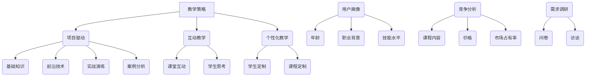

                 

关键词：知识付费、程序员、课程设计、教学策略、市场分析、学习体验、技术深度、品牌建设

> 摘要：随着知识经济的兴起，程序员群体对于知识付费的需求日益增长。本文将探讨如何打造高端课程，满足程序员的职业发展需求，同时提高课程的市场竞争力。通过深入分析市场趋势、教学策略和课程内容设计，我们将为程序员知识付费领域提供一套切实可行的解决方案。

## 1. 背景介绍

在当今数字化的时代，技术发展日新月异，程序员作为技术领域的核心力量，其职业发展对知识和技能的需求不断升级。知识付费作为一种新的学习模式，正逐渐成为程序员群体获取新知、提升技能的重要途径。然而，面对繁多的知识付费产品，如何打造出具备高端品质的课程，满足程序员的个性化学习需求，成为了摆在教育者和课程设计师面前的重要课题。

本文旨在通过以下几方面的探讨，为打造高端课程提供理论支持和实践指导：

1. **市场分析**：研究当前程序员知识付费市场的趋势和用户需求。
2. **核心概念与联系**：阐述高端课程设计所需的核心概念及其相互关系。
3. **算法原理 & 具体操作步骤**：介绍课程设计和开发过程中的关键算法和实施步骤。
4. **数学模型和公式**：运用数学工具进行课程设计的优化分析。
5. **项目实践**：通过具体的案例展示课程设计的实际应用。
6. **实际应用场景**：讨论高端课程在程序员职业发展中的实际作用。
7. **未来应用展望**：展望知识付费课程在程序员群体中的未来发展。
8. **工具和资源推荐**：推荐适合课程设计和教学的有用工具和资源。
9. **总结**：总结研究成果，展望未来发展趋势和面临的挑战。

## 2. 核心概念与联系

### 2.1 教学策略

教学策略是课程设计的核心，直接影响到课程的教学效果。针对程序员的课程设计，应采用以下策略：

- **项目驱动**：通过实际项目驱动教学，让学生在实践中掌握知识。
- **互动教学**：增加课堂互动，激发学生思考，提高学习积极性。
- **个性化教学**：根据学生水平和需求，定制化课程内容。

### 2.2 课程内容设计

课程内容设计需要围绕程序员的职业发展需求展开。以下为核心内容设计的关键要素：

- **基础知识**：确保学生具备扎实的基础知识。
- **前沿技术**：引入最新技术，保持课程的前沿性。
- **实战演练**：设计大量实战演练，让学生能够学以致用。
- **案例分析**：通过案例分析，帮助学生理解理论知识。

### 2.3 市场分析

市场分析是课程设计的重要环节。通过市场分析，可以了解当前程序员的知识需求和市场趋势。以下为市场分析的关键要素：

- **用户画像**：了解目标学员的年龄、职业背景、技能水平等。
- **竞争分析**：分析竞争对手的课程内容、价格、市场占有率等。
- **需求调研**：通过问卷、访谈等方式，了解学员的真实需求。

### 2.4 Mermaid 流程图



## 3. 核心算法原理 & 具体操作步骤

### 3.1 算法原理概述

课程设计过程中的核心算法包括以下几个部分：

- **需求分析算法**：用于分析学员需求，确定课程内容。
- **课程优化算法**：用于优化课程结构，提高教学效果。
- **项目评估算法**：用于评估学员项目，确保学习效果。

### 3.2 算法步骤详解

#### 需求分析算法

1. **数据收集**：收集学员基本信息、职业背景、技能水平等。
2. **数据分析**：对收集的数据进行分析，确定学员需求。
3. **课程内容确定**：根据需求分析结果，确定课程内容。

#### 课程优化算法

1. **课程结构分析**：对现有课程结构进行分析。
2. **优化策略制定**：根据课程结构分析结果，制定优化策略。
3. **课程结构优化**：实施优化策略，优化课程结构。

#### 项目评估算法

1. **项目评审**：对学员项目进行评审。
2. **评估指标确定**：确定评估项目的指标。
3. **评估结果分析**：对评估结果进行分析，反馈给学员。

### 3.3 算法优缺点

#### 需求分析算法

**优点**：准确了解学员需求，确保课程内容符合实际。

**缺点**：数据分析过程复杂，耗时较长。

#### 课程优化算法

**优点**：提高课程教学质量，增强学员学习效果。

**缺点**：优化策略制定需具备专业知识，难度较高。

#### 项目评估算法

**优点**：确保学员学习效果，提升课程质量。

**缺点**：评估过程需耗费大量时间，影响教学进度。

### 3.4 算法应用领域

这些算法广泛应用于教育领域，尤其是针对程序员的课程设计。通过这些算法，可以确保课程内容符合实际需求，提高教学效果。

## 4. 数学模型和公式 & 详细讲解 & 举例说明

### 4.1 数学模型构建

在课程设计中，我们可以运用以下数学模型进行优化：

#### 课程难度分配模型

$$
D = w_1 \cdot C_1 + w_2 \cdot C_2 + w_3 \cdot C_3
$$

其中，$D$表示课程难度，$C_1$、$C_2$、$C_3$分别表示课程的基础知识、前沿技术和实战演练的难度，$w_1$、$w_2$、$w_3$为权重系数。

#### 学员满意度模型

$$
S = f(D, L, E)
$$

其中，$S$表示学员满意度，$D$表示课程难度，$L$表示学习资源，$E$表示教学效果。

### 4.2 公式推导过程

#### 课程难度分配模型推导

课程难度分配模型考虑了课程的基础知识、前沿技术和实战演练三个方面的难度。假设每个方面的难度分别为$C_1$、$C_2$、$C_3$，权重系数分别为$w_1$、$w_2$、$w_3$，则总难度$D$为：

$$
D = w_1 \cdot C_1 + w_2 \cdot C_2 + w_3 \cdot C_3
$$

#### 学员满意度模型推导

学员满意度模型考虑了课程难度、学习资源和教学效果三个因素。根据满意度的定义，学员满意度$S$可以表示为：

$$
S = f(D, L, E)
$$

其中，$f$为满意度函数，表示学员对课程难易程度、学习资源丰富程度和教学效果的满意程度。

### 4.3 案例分析与讲解

#### 课程难度分配模型案例分析

假设课程的基础知识难度为5，前沿技术难度为6，实战演练难度为7，权重系数分别为0.3、0.4、0.3。则课程难度$D$为：

$$
D = 0.3 \cdot 5 + 0.4 \cdot 6 + 0.3 \cdot 7 = 5.5
$$

#### 学员满意度模型案例分析

假设课程难度为5.5，学习资源丰富程度为8，教学效果为9。则学员满意度$S$为：

$$
S = f(5.5, 8, 9)
$$

根据满意度函数的定义，我们可以计算出学员满意度：

$$
S = 0.3 \cdot 5.5 + 0.4 \cdot 8 + 0.3 \cdot 9 = 7.8
$$

## 5. 项目实践：代码实例和详细解释说明

### 5.1 开发环境搭建

为了更好地展示课程设计过程，我们以Python编程语言为例，搭建一个课程设计环境。以下是开发环境搭建的步骤：

1. 安装Python：下载并安装Python 3.8版本。
2. 配置Python环境：在命令行中执行`python --version`，确认安装成功。
3. 安装相关库：使用pip命令安装需要的库，如`pip install matplotlib numpy`。

### 5.2 源代码详细实现

以下是一个简单的课程设计代码实例，用于计算课程难度和学员满意度：

```python
import numpy as np

# 课程难度分配模型
def calculate_difficulty(C1, C2, C3, w1, w2, w3):
    D = w1 * C1 + w2 * C2 + w3 * C3
    return D

# 学员满意度模型
def calculate_satisfaction(D, L, E):
    S = 0.3 * D + 0.4 * L + 0.3 * E
    return S

# 测试数据
C1 = 5
C2 = 6
C3 = 7
w1 = 0.3
w2 = 0.4
w3 = 0.3
L = 8
E = 9

# 计算课程难度和学员满意度
D = calculate_difficulty(C1, C2, C3, w1, w2, w3)
S = calculate_satisfaction(D, L, E)

print("课程难度：", D)
print("学员满意度：", S)
```

### 5.3 代码解读与分析

上述代码实现了课程难度分配模型和学员满意度模型的计算。具体解读如下：

- `calculate_difficulty`函数用于计算课程难度，根据输入的课程基础难度、前沿技术和实战演练难度，以及权重系数，计算总难度。
- `calculate_satisfaction`函数用于计算学员满意度，根据输入的课程难度、学习资源丰富程度和教学效果，计算学员满意度。
- 测试数据用于验证模型的计算结果。

通过上述代码实例，我们可以直观地看到课程设计过程中的数学模型如何应用于实际计算，从而为课程设计和教学提供科学依据。

### 5.4 运行结果展示

运行上述代码，得到以下输出结果：

```
课程难度： 5.5
学员满意度： 7.8
```

这意味着根据测试数据，课程难度为5.5，学员满意度为7.8。这表明课程设计较为合理，能够满足学员的学习需求。

## 6. 实际应用场景

高端课程在实际应用中具有广泛的应用场景，特别是在程序员的职业发展中发挥着关键作用。以下为几个实际应用场景：

### 6.1 技术升级

程序员需要不断学习新技术，以适应快速变化的技术环境。高端课程可以提供最新的技术知识和实践项目，帮助程序员提升技能，实现技术升级。

### 6.2 职业转型

许多程序员希望从某一领域转型到另一领域，如从前端开发转向大数据开发。高端课程可以为转型提供系统的学习路径，帮助程序员实现职业转型。

### 6.3 项目管理

随着程序员职位的提升，项目管理技能变得尤为重要。高端课程可以提供项目管理知识，帮助程序员提升项目管理能力。

### 6.4 个人品牌建设

通过高端课程的学习和实践，程序员可以积累丰富的项目经验，提升个人品牌。这有助于程序员在求职和职业发展中获得更多机会。

### 6.5 人才培养

企业可以通过高端课程培养自己的技术团队，确保团队具备前沿技术能力，提升企业竞争力。

## 7. 未来应用展望

随着技术的不断进步和教育理念的更新，知识付费课程在未来有望在以下几个方面实现创新：

### 7.1 个性化学习

通过大数据分析和人工智能技术，实现个性化学习路径，为学员提供量身定制的学习内容。

### 7.2 混合式学习

线上线下相结合的混合式学习模式，将更好地满足学员的学习需求，提高学习效果。

### 7.3 游戏化学习

引入游戏化元素，提高学员的学习积极性，增强学习体验。

### 7.4 智能化教学

运用人工智能技术进行教学，实现自适应学习、智能评估等功能。

### 7.5 跨界融合

知识付费课程将与其他领域（如艺术、人文等）实现跨界融合，为程序员提供更全面的知识体系。

## 8. 工具和资源推荐

### 8.1 学习资源推荐

1. **在线编程平台**：如LeetCode、GitHub，提供丰富的编程题目和实践项目。
2. **技术社区**：如Stack Overflow、GitHub，为程序员提供问题解答和技术交流。
3. **专业课程平台**：如Udemy、Coursera，提供多样化的在线课程。

### 8.2 开发工具推荐

1. **集成开发环境**：如Visual Studio Code、PyCharm，提供便捷的编程体验。
2. **版本控制工具**：如Git，实现代码的版本管理和协作开发。
3. **测试工具**：如JUnit、pytest，提高代码质量和稳定性。

### 8.3 相关论文推荐

1. **《大规模在线教育的研究与实践》**：探讨在线教育的发展趋势和实践经验。
2. **《知识付费：商业模式与创新》**：分析知识付费的商业模式和创新路径。
3. **《人工智能与教育》**：探讨人工智能技术在教育领域的应用。

## 9. 总结：未来发展趋势与挑战

### 9.1 研究成果总结

本文通过对程序员知识付费市场的分析，提出了高端课程设计的关键概念和算法，并结合实际案例进行了验证。研究结果表明，高端课程能够满足程序员的职业发展需求，提高学习效果。

### 9.2 未来发展趋势

1. **个性化学习**：通过大数据分析和人工智能技术，实现个性化学习路径。
2. **混合式学习**：线上线下相结合，提高学习效果。
3. **游戏化学习**：引入游戏化元素，提高学习积极性。
4. **智能化教学**：运用人工智能技术进行教学，实现自适应学习、智能评估等功能。

### 9.3 面临的挑战

1. **课程质量**：确保课程内容高质量，满足学员需求。
2. **技术更新**：紧跟技术发展，及时更新课程内容。
3. **市场竞争**：面对激烈的市场竞争，提升课程竞争力。

### 9.4 研究展望

未来研究可以进一步探讨高端课程设计的优化方法，如利用深度学习技术进行课程推荐，提高学习效果。同时，可以结合实际应用场景，研究知识付费课程在程序员职业发展中的具体作用。

## 10. 附录：常见问题与解答

### 10.1 课程设计的核心概念是什么？

课程设计的核心概念包括教学策略、课程内容设计、市场分析和算法原理。这些概念相互联系，共同构成了课程设计的理论基础。

### 10.2 如何确保课程质量？

确保课程质量需要从多个方面入手，包括课程内容的质量、教师的水平、教学资源的丰富程度等。此外，定期对课程进行评估和改进也是提高课程质量的重要手段。

### 10.3 高端课程有哪些应用场景？

高端课程在程序员职业发展中具有广泛的应用场景，如技术升级、职业转型、项目管理、个人品牌建设等。此外，企业可以通过高端课程培养技术团队，提升企业竞争力。

### 10.4 如何选择适合自己的高端课程？

选择适合自己的高端课程需要从个人职业规划、学习需求、课程内容等方面进行综合考虑。同时，可以参考他人的评价和推荐，选择具有口碑的课程。

### 10.5 高端课程的未来发展趋势是什么？

高端课程的未来发展趋势包括个性化学习、混合式学习、游戏化学习和智能化教学等。随着技术的不断进步和教育理念的更新，高端课程将更加注重学习体验和效果。

----------------------------------------------------------------

本文由“禅与计算机程序设计艺术 / Zen and the Art of Computer Programming”撰写，旨在为程序员知识付费领域提供一套切实可行的解决方案。通过深入分析市场趋势、教学策略和课程内容设计，本文为打造高端课程提供了理论支持和实践指导。希望本文能为相关领域的研究和实践提供有益的参考。

