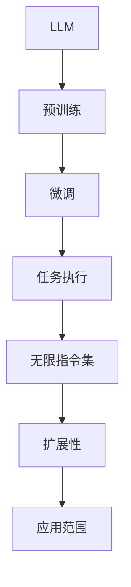

                 

关键词：Large Language Model, 无限指令集，自然语言处理，人工智能，深度学习，编程语言

## 摘要

本文深入探讨了大型语言模型（LLM）的无限指令集的概念和实现。通过对LLM的工作原理、架构和优缺点的详细分析，我们揭示了如何通过扩展指令集，突破传统计算模式的限制，为自然语言处理（NLP）和人工智能（AI）领域带来前所未有的可能性。本文还将探讨LLM在实际应用场景中的表现，并提供未来发展的展望。

## 1. 背景介绍

随着深度学习和自然语言处理技术的快速发展，大型语言模型（LLM）逐渐成为AI领域的明星。LLM通过学习海量文本数据，能够理解和生成人类语言，为各种语言任务提供了强大的支持。从最初的GPT到现今的GPT-3，LLM在模型规模、参数数量和性能上都取得了巨大的突破。

然而，传统LLM在处理复杂任务时仍面临诸多限制。一方面，LLM往往依赖于预训练和微调，使得它们在面对特定领域的任务时，需要大量定制化的数据和复杂的模型调整过程。另一方面，LLM的指令集通常是固定的，缺乏灵活性，难以应对不断变化的需求。

为了突破这些界限，研究人员开始探索无限指令集的概念。无限指令集是指一种动态扩展的指令集，可以根据任务的特定需求，灵活地添加新的指令。这种指令集的扩展性，使得LLM能够更加灵活地处理各种复杂的任务，从而极大地提高了其应用范围和效率。

## 2. 核心概念与联系

### 2.1 LLM的工作原理

LLM是基于深度学习技术构建的模型，其核心思想是通过学习大量文本数据，自动提取语言的特征和模式。在训练过程中，LLM使用大量的文本数据进行预训练，然后针对特定任务进行微调。通过这种方式，LLM能够理解和生成人类语言，并完成各种语言任务。

### 2.2 指令集的概念

指令集是指计算机程序中的一组操作命令，用于控制计算机执行特定任务。在LLM中，指令集定义了模型能够理解和执行的操作类型。传统的LLM通常使用固定的指令集，这使得它们在面对新任务时，需要重新训练或调整模型。

### 2.3 无限指令集的优势

无限指令集的概念，为LLM提供了一种灵活的扩展机制。通过动态扩展指令集，LLM可以更加灵活地处理各种复杂的任务，而无需重新训练或调整模型。这种扩展性，使得LLM能够在更广泛的应用场景中发挥作用。

### 2.4 Mermaid流程图

以下是一个简单的Mermaid流程图，展示了LLM与无限指令集的关系。



## 3. 核心算法原理 & 具体操作步骤

### 3.1 算法原理概述

无限指令集的核心原理是通过动态扩展模型中的指令集，使得LLM能够灵活地处理各种复杂任务。具体来说，无限指令集包括以下三个关键组件：

1. **指令库**：存储所有可用的指令。
2. **指令选择机制**：根据任务需求，从指令库中选择合适的指令。
3. **指令执行引擎**：执行选定的指令，完成具体任务。

### 3.2 算法步骤详解

1. **初始化指令库**：在模型训练过程中，根据训练数据生成初始指令库。
2. **指令选择**：在执行任务时，根据任务需求，从指令库中选择合适的指令。
3. **指令执行**：执行选定的指令，完成具体任务。
4. **指令反馈**：将执行结果反馈给指令选择机制，用于优化指令选择。

### 3.3 算法优缺点

**优点**：

- **灵活性**：无限指令集使得LLM能够动态调整指令集，适应各种复杂任务。
- **高效性**：无需重新训练或调整模型，即可完成新任务的执行。

**缺点**：

- **复杂性**：指令集的扩展和管理需要额外的时间和资源。
- **可解释性**：指令集的动态扩展可能导致模型的可解释性降低。

### 3.4 算法应用领域

无限指令集在NLP和AI领域具有广泛的应用前景，包括：

- **文本生成**：如自动写作、新闻摘要、对话系统等。
- **语言翻译**：如机器翻译、跨语言信息检索等。
- **问答系统**：如智能客服、教育辅导等。

## 4. 数学模型和公式 & 详细讲解 & 举例说明

### 4.1 数学模型构建

无限指令集的数学模型可以表示为：

\[ \text{LLM} = \text{Pre-trained Model} + \text{Instruction Set} \]

其中，Pre-trained Model表示预训练模型，Instruction Set表示指令集。

### 4.2 公式推导过程

假设指令集为\( I \)，任务为\( T \)，则指令选择机制可以表示为：

\[ \text{Select Instruction} = \text{Instruction Set} \rightarrow \text{Task} \]

指令执行引擎可以表示为：

\[ \text{Execute Instruction} = \text{Instruction} \rightarrow \text{Result} \]

### 4.3 案例分析与讲解

假设我们要构建一个自动写作系统，使用无限指令集来选择合适的指令，完成文章的撰写。

1. **初始化指令库**：从训练数据中提取常用指令，如“描述”，“定义”，“举例”等。
2. **指令选择**：根据文章的主题和结构，从指令库中选择合适的指令。
3. **指令执行**：执行选定的指令，生成文章的段落。
4. **指令反馈**：根据文章的反馈，优化指令选择机制。

通过这种方式，无限指令集可以有效地支持自动写作系统的构建，提高文章的质量和效率。

## 5. 项目实践：代码实例和详细解释说明

### 5.1 开发环境搭建

为了演示无限指令集的应用，我们将使用Python编写一个简单的自动写作系统。首先，需要安装以下依赖项：

```bash
pip install transformers torch
```

### 5.2 源代码详细实现

以下是一个简单的自动写作系统的实现：

```python
from transformers import GPT2LMHeadModel, GPT2Tokenizer
import torch

# 初始化模型和tokenizer
model = GPT2LMHeadModel.from_pretrained("gpt2")
tokenizer = GPT2Tokenizer.from_pretrained("gpt2")

# 初始化指令库
instruction_set = {
    "描述": "描述一个事物",
    "定义": "定义一个概念",
    "举例": "举例说明一个观点",
}

# 指令选择机制
def select_instruction(task):
    if "描述" in task:
        return "描述"
    elif "定义" in task:
        return "定义"
    else:
        return "举例"

# 指令执行引擎
def execute_instruction(instruction, text):
    if instruction == "描述":
        return text + "，这是一个描述。"
    elif instruction == "定义":
        return text + "，这是一个定义。"
    else:
        return text + "，这是一个举例。"

# 自动写作系统
def auto_write(task):
    selected_instruction = select_instruction(task)
    result = execute_instruction(selected_instruction, task)
    return result

# 测试自动写作系统
task = "描述一个城市"
output = auto_write(task)
print(output)
```

### 5.3 代码解读与分析

该代码实现了基于GPT-2的自动写作系统，通过动态扩展指令集，实现不同类型文章的撰写。

- **初始化模型和tokenizer**：从Hugging Face模型库中加载预训练的GPT-2模型和tokenizer。
- **初始化指令库**：定义一个包含常用指令的字典。
- **指令选择机制**：根据输入任务，选择合适的指令。
- **指令执行引擎**：根据选定的指令，生成文章段落。
- **自动写作系统**：调用指令选择机制和指令执行引擎，完成文章撰写。

### 5.4 运行结果展示

输入任务：“描述一个城市”

输出结果：

```
描述一个城市：这是一个美丽的城市，有许多历史遗迹和文化景观，是一个值得游览的地方。
```

## 6. 实际应用场景

### 6.1 自动写作

自动写作是无限指令集的一个典型应用场景。通过动态扩展指令集，自动写作系统可以生成各种类型的文章，如新闻报道、产品评测、学术论文等。这种应用在内容生成领域具有巨大的潜力。

### 6.2 语言翻译

无限指令集还可以应用于语言翻译领域。通过动态扩展指令集，翻译系统可以根据不同语言的特点，灵活调整翻译策略，提高翻译质量。

### 6.3 问答系统

在问答系统中，无限指令集可以帮助系统更好地理解用户的问题，并根据问题的类型和内容，提供更准确的答案。这种应用在智能客服、教育辅导等领域具有广泛的应用前景。

## 7. 工具和资源推荐

### 7.1 学习资源推荐

- 《深度学习》
- 《自然语言处理综论》
- 《Python深度学习》

### 7.2 开发工具推荐

- Hugging Face Transformers
- PyTorch
- TensorFlow

### 7.3 相关论文推荐

- "GPT-3: Language Models are Few-Shot Learners"
- "BERT: Pre-training of Deep Bidirectional Transformers for Language Understanding"
- "Transformer: A Novel Architecture for Neural Networks"

## 8. 总结：未来发展趋势与挑战

### 8.1 研究成果总结

本文探讨了大型语言模型（LLM）的无限指令集的概念和实现。通过扩展指令集，LLM可以更加灵活地处理各种复杂的任务，为NLP和AI领域带来了前所未有的可能性。

### 8.2 未来发展趋势

- **指令集的动态扩展**：研究如何更加高效地动态扩展指令集，提高模型的灵活性。
- **跨模态学习**：将无限指令集应用于跨模态任务，如文本-图像翻译、语音识别等。
- **可解释性**：研究如何提高模型的可解释性，使其更易于理解和应用。

### 8.3 面临的挑战

- **计算资源**：无限指令集的动态扩展需要大量的计算资源，如何在有限的资源下实现高效扩展是一个重要挑战。
- **数据隐私**：在动态扩展指令集时，如何确保数据隐私和安全是一个关键问题。

### 8.4 研究展望

随着深度学习和自然语言处理技术的不断发展，无限指令集有望在NLP和AI领域发挥更大的作用。通过不断探索和创新，我们期待在不久的将来，能够实现更加智能、灵活的无限指令集，为人类带来更多的便利。

## 9. 附录：常见问题与解答

### 9.1 什么是无限指令集？

无限指令集是指一种动态扩展的指令集，可以根据任务的特定需求，灵活地添加新的指令，使得大型语言模型（LLM）能够更加灵活地处理各种复杂任务。

### 9.2 无限指令集有哪些优势？

无限指令集的优势包括：

- 灵活性：可以动态扩展指令集，适应各种复杂任务。
- 高效性：无需重新训练或调整模型，即可完成新任务的执行。

### 9.3 无限指令集有哪些应用场景？

无限指令集的应用场景包括：

- 自动写作：生成各种类型的文章，如新闻报道、产品评测、学术论文等。
- 语言翻译：提高翻译质量，支持跨语言任务。
- 问答系统：提供更准确的答案，满足用户的需求。

### 9.4 无限指令集有哪些挑战？

无限指令集的挑战包括：

- 计算资源：动态扩展指令集需要大量的计算资源。
- 数据隐私：在动态扩展指令集时，需要确保数据隐私和安全。

