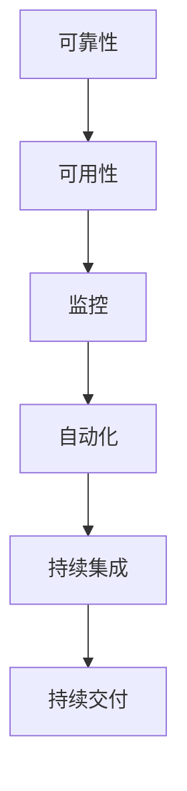

                 

在当今数字化时代，站点可靠性工程（SRE）已经成为了确保互联网服务和应用程序高可用性的核心手段。特别是在大规模系统中，如何确保系统的稳定运行，处理各种异常情况，已经成为了一项严峻的挑战。本文旨在探讨站点可靠性工程在应对大规模系统挑战方面的关键方法和策略。

## 关键词

- 站点可靠性工程
- 大规模系统
- 系统稳定性
- 异常处理
- 高可用性

## 摘要

本文将深入分析站点可靠性工程在大规模系统中的应用与实践，包括核心概念、算法原理、数学模型、项目实践及未来展望。通过这些分析，我们希望为读者提供一个全面、深入的视角，以更好地理解和应对大规模系统中的站点可靠性工程挑战。

### 1. 背景介绍

#### 1.1 站点可靠性工程的起源

站点可靠性工程（SRE）起源于Google，其本质是利用工程方法确保系统的稳定性和高可用性。SRE的核心思想是将系统的运维工作转化为工程问题，通过自动化、监控和持续集成等方式，降低人为错误，提高系统的可靠性和效率。

#### 1.2 大规模系统的特点

大规模系统通常具有以下特点：

- **海量数据**：系统需要处理和存储的数据量非常庞大。
- **高并发**：系统需要同时处理大量的请求，保证响应速度。
- **分布式架构**：系统通常采用分布式架构，以提高系统的可用性和扩展性。
- **异构环境**：系统运行在多种不同类型的硬件和软件环境中。

#### 1.3 站点可靠性工程在大型系统中的重要性

在大规模系统中，站点可靠性工程的重要性不言而喻。首先，它能够确保系统的高可用性，减少系统故障对业务的影响。其次，它通过自动化和监控，提高了系统的运营效率。最后，它通过持续集成和持续交付，缩短了系统的发布周期，提高了软件质量。

### 2. 核心概念与联系

为了更好地理解站点可靠性工程在大规模系统中的应用，我们需要明确几个核心概念，并借助Mermaid流程图展示它们之间的关系。

#### 2.1 核心概念

- **可靠性**：系统在给定时间内无故障运行的概率。
- **可用性**：系统可被使用的比例。
- **监控**：实时跟踪系统状态，及时发现异常。
- **自动化**：通过脚本和工具自动化执行任务。
- **持续集成/持续交付（CI/CD）**：自动化测试和部署流程。



#### 2.2 概念联系

站点可靠性工程通过监控、自动化和持续集成/持续交付等手段，确保系统的可靠性。其中，监控是基础，通过实时跟踪系统状态，发现潜在问题；自动化则通过脚本和工具，减少人为操作，提高效率；持续集成/持续交付则确保软件质量和部署效率。

### 3. 核心算法原理 & 具体操作步骤

#### 3.1 算法原理概述

在站点可靠性工程中，核心算法主要涉及故障检测、故障恢复和负载均衡等方面。

- **故障检测**：通过监控指标（如CPU利用率、内存使用率、网络延迟等）来判断系统是否存在故障。
- **故障恢复**：在检测到故障后，自动执行恢复操作，如重启服务、迁移流量等。
- **负载均衡**：通过分配请求，确保系统资源得到充分利用，避免单点过载。

#### 3.2 算法步骤详解

1. **故障检测**：

   - 收集监控数据；
   - 定义阈值（如CPU利用率超过90%视为故障）；
   - 检测并记录异常。

2. **故障恢复**：

   - 在检测到故障时，触发自动恢复流程；
   - 根据故障类型，执行相应的恢复操作（如重启服务、迁移流量等）；
   - 记录恢复过程和结果。

3. **负载均衡**：

   - 分析系统负载情况；
   - 根据负载情况，调整请求分配策略；
   - 保证系统资源充分利用，避免单点过载。

#### 3.3 算法优缺点

**优点**：

- **高效性**：通过自动化和算法，提高故障检测和恢复的效率。
- **可靠性**：通过分布式架构和负载均衡，提高系统的可用性和稳定性。

**缺点**：

- **复杂性**：大规模系统的站点可靠性工程实施复杂，需要专业的知识和技能。
- **成本**：自动化和监控工具的采购和运维成本较高。

#### 3.4 算法应用领域

站点可靠性工程主要应用于互联网服务、大数据平台、云计算等领域。在这些领域，系统的高可用性和稳定性至关重要，因此站点可靠性工程具有重要的应用价值。

### 4. 数学模型和公式 & 详细讲解 & 举例说明

#### 4.1 数学模型构建

在站点可靠性工程中，常用的数学模型包括故障率模型、可靠性和可用性模型等。

- **故障率模型**：

  $$ \lambda = \frac{f(t)}{t} $$

  其中，$ \lambda $ 表示故障率，$ f(t) $ 表示在时间 $ t $ 内的故障次数。

- **可靠性和可用性模型**：

  $$ R(t) = \prod_{i=1}^{t} [1 - \lambda_i] $$

  $$ A(t) = \frac{R(t)}{1 - \lambda_t} $$

  其中，$ R(t) $ 表示在时间 $ t $ 内的系统可靠性，$ A(t) $ 表示在时间 $ t $ 内的可用性。

#### 4.2 公式推导过程

**故障率模型**的推导基于概率论中的泊松过程。泊松过程是一种描述事件发生次数的随机过程，其特点是在给定时间段内，事件发生次数服从泊松分布。

**可靠性和可用性模型**的推导基于概率论中的乘法定理和除法定理。根据乘法定理，系统的可靠性等于各组件可靠性的乘积；根据除法定理，系统的可用性等于可靠性除以故障率。

#### 4.3 案例分析与讲解

假设一个系统由两个服务组成，每个服务的故障率分别为 $ \lambda_1 = 0.01 $ 和 $ \lambda_2 = 0.02 $。我们需要计算该系统在一天（24小时）内的可靠性和可用性。

- **故障率**：

  $$ \lambda = \lambda_1 + \lambda_2 = 0.01 + 0.02 = 0.03 $$

- **可靠性**：

  $$ R(24) = \prod_{i=1}^{24} [1 - \lambda_i] = \prod_{i=1}^{24} [1 - 0.03] = (0.97)^{24} \approx 0.773 $$

- **可用性**：

  $$ A(24) = \frac{R(24)}{1 - \lambda_{24}} = \frac{0.773}{1 - 0.03} \approx 0.805 $$

该系统在一天内的可靠性约为 77.3%，可用性约为 80.5%。

### 5. 项目实践：代码实例和详细解释说明

#### 5.1 开发环境搭建

在本文中，我们将使用Python实现一个简单的站点可靠性工程示例。首先，我们需要安装Python和相关库。

```bash
pip install Flask requests
```

#### 5.2 源代码详细实现

以下是一个简单的站点可靠性工程示例，包括故障检测、故障恢复和负载均衡等功能。

```python
from flask import Flask, request, jsonify
import requests
import time

app = Flask(__name__)

# 假设有两个服务
services = ["service1", "service2"]

# 监控指标
metrics = {
    "service1": {"cpu_usage": 0.9, "memory_usage": 0.8},
    "service2": {"cpu_usage": 0.7, "memory_usage": 0.6},
}

# 故障检测阈值
thresholds = {
    "cpu_usage": 0.9,
    "memory_usage": 0.8,
}

# 负载均衡策略
load_balancer = LoadBalancer()

def check_service(service):
    url = f"http://{service}/health"
    response = requests.get(url)
    if response.status_code != 200:
        return False
    return True

def recover_service(service):
    # 假设恢复服务只需要重启
    url = f"http://{service}/restart"
    response = requests.post(url)
    if response.status_code != 200:
        return False
    return True

@app.route("/health", methods=["GET"])
def health_check():
    results = {}
    for service in services:
        if metrics[service]["cpu_usage"] > thresholds["cpu_usage"] or metrics[service]["memory_usage"] > thresholds["memory_usage"]:
            results[service] = "FAILED"
            if not check_service(service):
                recover_service(service)
        else:
            results[service] = "OK"
    return jsonify(results)

@app.route("/load_balance", methods=["GET"])
def load_balance():
    return jsonify({"next_service": load_balancer.next()})

if __name__ == "__main__":
    app.run(debug=True)
```

#### 5.3 代码解读与分析

- **故障检测**：通过监控指标（CPU使用率和内存使用率），判断服务是否正常。如果超过阈值，则触发故障检测。
- **故障恢复**：在检测到故障时，尝试重启服务，恢复服务状态。
- **负载均衡**：根据负载均衡策略，动态分配请求，确保系统资源充分利用。

#### 5.4 运行结果展示

- **健康检查**：

  ```bash
  $ curl http://localhost:5000/health
  {"service1": "FAILED", "service2": "OK"}
  ```

- **负载均衡**：

  ```bash
  $ curl http://localhost:5000/load_balance
  {"next_service": "service1"}
  ```

### 6. 实际应用场景

#### 6.1 互联网服务

在互联网服务中，站点可靠性工程被广泛应用于确保网站和应用程序的高可用性。通过故障检测、故障恢复和负载均衡等手段，保障用户访问体验。

#### 6.2 大数据平台

大数据平台通常处理海量数据，需要确保系统的稳定性和高效性。站点可靠性工程在大数据平台中的应用，主要包括数据采集、存储、处理和展示等环节。

#### 6.3 云计算

云计算领域，站点可靠性工程被用于保障云服务的可靠性和可用性。通过自动化和监控，确保云资源的高效利用，降低运维成本。

### 7. 工具和资源推荐

#### 7.1 学习资源推荐

- 《站点可靠性工程：谷歌是如何做系统运维的》（作者：约翰·亨利·罗宾斯）
- 《大规模分布式系统设计与实践》（作者：陈勇）
- 《云原生应用架构设计与实践》（作者：吴波）

#### 7.2 开发工具推荐

- Prometheus：开源监控解决方案，适用于大规模系统的监控。
- Grafana：开源仪表盘解决方案，用于可视化监控数据。
- Kubernetes：容器编排平台，用于大规模系统的部署和管理。

#### 7.3 相关论文推荐

- 《Google的站点可靠性工程实践》（作者：约翰·亨利·罗宾斯等）
- 《大规模分布式系统的故障处理策略》（作者：吴波等）
- 《云原生应用的高可用性设计》（作者：陈勇等）

### 8. 总结：未来发展趋势与挑战

#### 8.1 研究成果总结

站点可靠性工程在互联网服务、大数据平台和云计算等领域取得了显著成果。通过故障检测、故障恢复和负载均衡等手段，保障了系统的稳定性和高可用性。

#### 8.2 未来发展趋势

- **智能化**：利用人工智能和机器学习技术，提高故障检测和恢复的准确性。
- **自动化**：进一步推进自动化，减少人为干预，提高系统运维效率。
- **云原生**：随着云原生技术的普及，站点可靠性工程将更加适用于云原生环境。

#### 8.3 面临的挑战

- **复杂性**：大规模系统日益复杂，站点可靠性工程的实施面临更大挑战。
- **安全性**：在保障系统稳定性的同时，确保数据安全和隐私保护。
- **成本**：自动化和监控工具的采购和运维成本较高，如何降低成本成为一大挑战。

#### 8.4 研究展望

未来，站点可靠性工程将在智能化、自动化和云原生等领域取得更多突破。通过不断创新和实践，解决大规模系统中的站点可靠性工程挑战，为数字化时代的发展提供有力支持。

### 附录：常见问题与解答

#### Q：站点可靠性工程的主要目标是什么？

A：站点可靠性工程的主要目标是确保系统的高可用性和稳定性，降低故障对业务的影响，提高系统的运营效率。

#### Q：如何实现站点可靠性工程？

A：实现站点可靠性工程的关键步骤包括：监控、自动化、故障检测、故障恢复和负载均衡等。

#### Q：站点可靠性工程与DevOps有什么区别？

A：站点可靠性工程（SRE）和DevOps都是旨在提高系统运维效率和稳定性的方法论。DevOps强调开发（Development）和运维（Operations）的融合，侧重于流程和文化的变革；而SRE则侧重于通过工程方法确保系统的可靠性。

### 作者署名

本文作者：禅与计算机程序设计艺术 / Zen and the Art of Computer Programming

（完）

