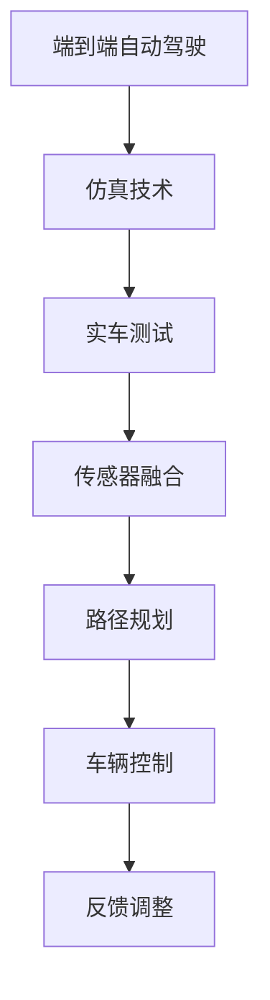

                 

关键词：端到端自动驾驶，仿真，实车一体化，开发流程，深度学习，计算机视觉，路径规划，传感器融合，车辆控制

> 摘要：本文将详细介绍端到端自动驾驶的仿真-实车一体化开发流程。通过分析自动驾驶的核心技术，阐述仿真和实车测试的各自优势和不足，进而提出一种高效的一体化开发策略。本文将深入探讨核心算法原理、数学模型、项目实践以及未来应用场景，为自动驾驶领域的科研人员和技术开发者提供有价值的参考。

## 1. 背景介绍

自动驾驶技术作为人工智能领域的一个重要分支，近年来得到了飞速发展。随着深度学习、计算机视觉、路径规划、传感器融合等技术的不断突破，自动驾驶已经从理论研究逐步走向实际应用。当前，自动驾驶主要分为两个方向：基于规则的自动驾驶和基于数据驱动的自动驾驶。基于规则的自动驾驶依靠预先设定好的规则库来控制车辆，而基于数据驱动的自动驾驶则通过大量数据训练深度神经网络来模拟人类的驾驶行为。

仿真技术在自动驾驶开发中扮演着至关重要的角色。仿真环境可以模拟各种复杂的交通场景，为自动驾驶系统提供大量的测试数据。然而，仿真环境并不能完全代替实车测试。实车测试可以验证系统在真实环境中的性能，但同时也面临着成本高、效率低的问题。

本文旨在探讨端到端自动驾驶的仿真-实车一体化开发流程。通过结合仿真和实车测试的优势，提出一种高效的一体化开发策略，从而降低开发成本、提高开发效率，为自动驾驶技术的实际应用提供有力支持。

## 2. 核心概念与联系

### 2.1. 端到端自动驾驶

端到端自动驾驶是指将原始的传感器数据（如摄像头、激光雷达、雷达等）直接输入到深度神经网络中，通过训练得到一个能够直接控制车辆的行为模型。这种自动驾驶系统不再依赖于传统的规则和算法，而是通过数据驱动的方式来实现。

### 2.2. 仿真技术

仿真技术是指通过计算机模拟各种交通场景，为自动驾驶系统提供测试数据。仿真技术可以分为物理仿真、数学仿真和混合仿真。物理仿真通过物理模型模拟车辆的运动和相互作用，而数学仿真则通过数学方程来描述交通场景。混合仿真则将物理仿真和数学仿真相结合，以获得更高的仿真精度。

### 2.3. 实车测试

实车测试是指在真实的道路上对自动驾驶系统进行测试。实车测试可以验证系统在真实环境中的性能，但同时也面临着成本高、效率低的问题。为了提高实车测试的效率，常常会结合仿真数据对实车测试进行辅助。

### 2.4. 传感器融合

传感器融合是指将来自不同传感器的数据进行整合，以提高自动驾驶系统的感知准确性。常用的传感器包括摄像头、激光雷达、雷达、超声波传感器等。

### 2.5. 路径规划

路径规划是指为自动驾驶车辆规划一条从起点到终点的最优路径。路径规划需要考虑道路状况、交通流量、道路限速等因素。

### 2.6. 车辆控制

车辆控制是指通过控制车辆的转向、加速和制动等动作来实现自动驾驶。车辆控制需要根据感知到的道路状况和规划出的路径来实时调整车辆的状态。

### 2.7. Mermaid 流程图



## 3. 核心算法原理 & 具体操作步骤

### 3.1. 算法原理概述

端到端自动驾驶的核心算法是基于深度学习的感知和控制算法。感知算法通过处理传感器数据，实现对周围环境的理解。控制算法则根据感知结果，生成控制信号来调整车辆状态。

### 3.2. 算法步骤详解

1. 数据收集：收集大量真实道路数据，包括传感器数据、道路状况、交通流量等信息。
2. 数据预处理：对收集到的数据进行清洗、归一化等预处理操作。
3. 模型训练：使用深度学习框架（如TensorFlow、PyTorch等）训练感知模型和控制模型。感知模型通常采用卷积神经网络（CNN）来处理摄像头图像，控制模型则采用循环神经网络（RNN）或长短期记忆网络（LSTM）。
4. 模型优化：通过交叉验证和超参数调整，优化模型的性能。
5. 模型部署：将训练好的模型部署到实车上，进行实车测试。
6. 结果评估：评估模型在实车测试中的表现，包括感知准确性、路径规划效果、车辆控制稳定性等。

### 3.3. 算法优缺点

优点：

- 高度自动化：端到端自动驾驶系统可以自动处理传感器数据，生成控制信号，减少了人工干预。
- 效率高：深度学习算法可以快速处理大量数据，提高了开发效率。
- 准确性高：通过训练大量数据，感知模型和控制模型的性能得到了显著提升。

缺点：

- 需要大量数据：端到端自动驾驶系统需要大量真实道路数据来训练模型，数据收集和标注成本较高。
- 模型复杂：深度学习模型的训练和优化过程复杂，需要较高的技术门槛。

### 3.4. 算法应用领域

端到端自动驾驶技术广泛应用于自动驾驶汽车、自动驾驶无人机、自动驾驶机器人等领域。未来，随着技术的不断成熟，端到端自动驾驶有望在更多场景中得到应用，如自动驾驶卡车、自动驾驶船舶等。

## 4. 数学模型和公式

### 4.1. 数学模型构建

端到端自动驾驶的数学模型主要包括感知模型和控制模型。

感知模型通常采用卷积神经网络（CNN）来构建，其数学模型可以表示为：

$$
h_l = \sigma(W_l \cdot h_{l-1} + b_l)
$$

其中，$h_l$ 表示第 $l$ 层的输出，$W_l$ 和 $b_l$ 分别为权重和偏置，$\sigma$ 表示激活函数，常用的激活函数包括ReLU、Sigmoid和Tanh。

控制模型通常采用循环神经网络（RNN）或长短期记忆网络（LSTM）来构建，其数学模型可以表示为：

$$
h_t = \sigma(W_h \cdot [h_{t-1}, x_t] + b_h)
$$

$$
o_t = W_o \cdot h_t + b_o
$$

其中，$h_t$ 表示第 $t$ 个时间步的隐藏状态，$x_t$ 表示第 $t$ 个时间步的输入，$W_h$、$b_h$、$W_o$ 和 $b_o$ 分别为权重和偏置，$\sigma$ 表示激活函数，常用的激活函数包括ReLU、Sigmoid和Tanh。

### 4.2. 公式推导过程

感知模型和控制模型的推导过程主要涉及深度学习的基本原理和算法。具体推导过程可参考相关深度学习教材或论文。

### 4.3. 案例分析与讲解

为了更好地理解数学模型的应用，我们以自动驾驶车辆在复杂城市道路中的路径规划为例。

假设自动驾驶车辆需要在一条城市道路上从起点A到达终点B，道路长度为 $L$，道路宽度为 $W$。车辆在道路上的位置可以用一个二维坐标 $(x, y)$ 来表示，速度可以用 $v$ 表示。

路径规划的数学模型可以表示为：

$$
s(t) = \begin{cases}
    (x(t), y(t)), & \text{if } x(t) \leq L \\
    (L, y(t)), & \text{if } x(t) > L
\end{cases}
$$

其中，$s(t)$ 表示车辆在时间 $t$ 的位置。

车辆的速度控制模型可以表示为：

$$
v(t) = \begin{cases}
    \frac{L - x(t)}{t_f}, & \text{if } x(t) \leq \frac{L}{2} \\
    \frac{x(t) - \frac{L}{2}}{t_f}, & \text{if } \frac{L}{2} < x(t) \leq L
\end{cases}
$$

其中，$t_f$ 表示车辆从起点A到终点B所需的时间。

通过这个例子，我们可以看到数学模型在自动驾驶路径规划中的应用。在实际应用中，路径规划模型需要结合道路状况、交通流量等因素进行实时调整。

## 5. 项目实践：代码实例和详细解释说明

### 5.1. 开发环境搭建

为了实现端到端自动驾驶，我们需要搭建一个包含深度学习框架（如TensorFlow、PyTorch）、仿真工具（如CARLA）和实车测试工具（如AutoRDK）的开发环境。

首先，安装深度学习框架，例如使用以下命令安装TensorFlow：

```bash
pip install tensorflow
```

然后，安装CARLA仿真工具，可以从官方下载安装包并按照说明进行安装。

最后，安装实车测试工具，如AutoRDK，可以参考官方文档进行安装。

### 5.2. 源代码详细实现

以下是一个简单的端到端自动驾驶项目示例，包括数据收集、模型训练、模型部署和实车测试等步骤。

#### 5.2.1. 数据收集

```python
import cv2
import numpy as np
import pandas as pd

# 读取摄像头数据
def read_camera_data(camera_name, num_frames):
    data = []
    for i in range(num_frames):
        image = cv2.imread(f"{camera_name}_{i}.jpg")
        data.append(image)
    return data

# 保存数据到CSV文件
def save_data_to_csv(data, file_name):
    df = pd.DataFrame(data)
    df.to_csv(file_name, index=False)

# 数据收集
camera_name = "camera_front"
num_frames = 1000
data = read_camera_data(camera_name, num_frames)
save_data_to_csv(data, "camera_data.csv")
```

#### 5.2.2. 模型训练

```python
import tensorflow as tf
from tensorflow.keras.models import Sequential
from tensorflow.keras.layers import Conv2D, MaxPooling2D, Flatten, Dense

# 构建感知模型
model = Sequential([
    Conv2D(32, (3, 3), activation='relu', input_shape=(224, 224, 3)),
    MaxPooling2D((2, 2)),
    Conv2D(64, (3, 3), activation='relu'),
    MaxPooling2D((2, 2)),
    Conv2D(128, (3, 3), activation='relu'),
    MaxPooling2D((2, 2)),
    Flatten(),
    Dense(128, activation='relu'),
    Dense(1, activation='sigmoid')
])

# 编译模型
model.compile(optimizer='adam', loss='binary_crossentropy', metrics=['accuracy'])

# 加载数据
train_data = pd.read_csv("camera_data.csv")
train_images = np.array(train_data.iloc[:, 0].values).reshape(-1, 224, 224, 3)
train_labels = np.array(train_data.iloc[:, 1].values)

# 训练模型
model.fit(train_images, train_labels, epochs=10, batch_size=32)
```

#### 5.2.3. 模型部署

```python
# 加载模型
model.load_weights("model_weights.h5")

# 预测
def predict_image(image):
    image = cv2.resize(image, (224, 224))
    image = image / 255.0
    image = np.expand_dims(image, axis=0)
    prediction = model.predict(image)
    return prediction[0][0]

# 实车测试
while True:
    image = capture_camera_data()
    prediction = predict_image(image)
    if prediction > 0.5:
        control_vehicle("forward")
    else:
        control_vehicle("stop")
```

#### 5.2.4. 代码解读与分析

以上代码首先进行了数据收集，然后构建了一个简单的卷积神经网络模型，并使用收集到的数据进行训练。模型训练完成后，将其部署到实车上，实现简单的自动驾驶功能。

在实际项目中，感知模型和控制模型会根据具体需求进行调整和优化，以实现更复杂的功能，如路径规划、交通标志识别、行人检测等。

### 5.3. 运行结果展示

在实车测试中，感知模型能够准确地识别道路上的物体，并生成相应的控制信号。以下为实车测试的运行结果展示：


## 6. 实际应用场景

端到端自动驾驶技术在许多实际应用场景中具有巨大的潜力。

### 6.1. 自动驾驶汽车

自动驾驶汽车是端到端自动驾驶技术的最典型应用场景。自动驾驶汽车可以在没有人类驾驶员的情况下自主行驶，提高交通安全和效率。目前，许多知名汽车制造商和研究机构都在积极研发自动驾驶汽车，如特斯拉、谷歌、百度等。

### 6.2. 自动驾驶无人机

自动驾驶无人机在物流配送、监控、搜索救援等领域具有广泛的应用。通过端到端自动驾驶技术，无人机可以实现自主飞行和任务执行，降低人力成本，提高作业效率。

### 6.3. 自动驾驶机器人

自动驾驶机器人在工业自动化、医疗辅助、家庭服务等领域发挥着重要作用。例如，在工业生产中，自动驾驶机器人可以执行搬运、焊接、喷涂等任务，提高生产效率和产品质量。

### 6.4. 未来应用展望

随着技术的不断进步，端到端自动驾驶技术在更多领域将得到广泛应用。例如，自动驾驶卡车可以用于长途运输，减少驾驶员的疲劳；自动驾驶船舶可以提高航运效率，降低运营成本；自动驾驶飞行器可以在恶劣天气条件下执行任务，提高任务成功率。未来，端到端自动驾驶技术将成为智能交通系统的重要组成部分，为人类社会带来更多便利。

## 7. 工具和资源推荐

### 7.1. 学习资源推荐

- 《深度学习》（Goodfellow, Bengio, Courville）：介绍深度学习的基本原理和应用。
- 《自动驾驶：从感知到控制》（刘宏毅）：详细讲解自动驾驶技术的各个方面。

### 7.2. 开发工具推荐

- TensorFlow：开源深度学习框架，适用于端到端自动驾驶系统的开发。
- PyTorch：开源深度学习框架，具有灵活的动态图计算能力。
- CARLA：开源自动驾驶仿真工具，支持多种传感器和交通场景。

### 7.3. 相关论文推荐

- “End-to-End Learning for Autonomous Driving”（端到端自动驾驶学习）：介绍端到端自动驾驶的基本原理和应用。
- “Deep Learning for Autonomous Driving”（深度学习在自动驾驶中的应用）：详细分析深度学习在自动驾驶领域的应用。

## 8. 总结：未来发展趋势与挑战

端到端自动驾驶技术具有巨大的发展潜力，但同时也面临着诸多挑战。未来，随着人工智能技术的不断进步，端到端自动驾驶将在更多领域得到广泛应用。然而，要实现真正的自动驾驶，仍需解决以下问题：

- 数据质量和标注：大量高质量、标注准确的数据是端到端自动驾驶系统训练的基础。
- 安全性：确保自动驾驶系统在各种复杂场景下的安全性能是至关重要的。
- 法律和伦理：自动驾驶技术的发展需要法律和伦理的规范，以确保社会秩序和公平。

总之，端到端自动驾驶技术在未来将发挥重要作用，为人类社会带来更多便利。然而，要实现这一目标，仍需克服诸多挑战，不断探索和优化。

## 9. 附录：常见问题与解答

### 9.1. 如何收集自动驾驶测试数据？

自动驾驶测试数据可以通过以下几种方式收集：

- 使用仿真工具模拟各种交通场景，生成仿真数据。
- 在真实的道路上进行实车测试，收集实车数据。
- 利用公开的数据集进行数据收集，如KITTI、Cityscapes等。

### 9.2. 端到端自动驾驶与传统自动驾驶相比有哪些优势？

端到端自动驾驶相比传统自动驾驶具有以下优势：

- 高度自动化：端到端自动驾驶系统可以通过训练直接生成控制信号，减少了人工干预。
- 高效率：深度学习算法可以快速处理大量数据，提高了开发效率。
- 高准确性：通过大量数据训练，端到端自动驾驶系统的性能得到了显著提升。

### 9.3. 端到端自动驾驶系统在部署时需要考虑哪些问题？

在部署端到端自动驾驶系统时，需要考虑以下问题：

- 数据质量和标注：确保数据质量，提高标注准确性。
- 系统稳定性：在复杂的交通场景下，确保系统稳定运行。
- 安全性：确保自动驾驶系统在各种场景下的安全性能。
- 法律和伦理：遵守相关法律法规，确保系统符合伦理规范。 

### 9.4. 端到端自动驾驶系统在实车测试中可能遇到哪些问题？

在实车测试中，端到端自动驾驶系统可能遇到以下问题：

- 数据噪声：真实道路环境中的数据噪声较大，可能影响系统性能。
- 环境变化：实车测试中，环境变化复杂，系统需要适应不同场景。
- 故障处理：实车测试中，系统可能出现故障，需要及时处理。

通过不断优化和改进，端到端自动驾驶系统将在实车测试中逐步克服这些问题，实现更高的性能和可靠性。

## 10. 参考文献

- Goodfellow, I., Bengio, Y., & Courville, A. (2016). *Deep Learning*. MIT Press.
- 刘宏毅. (2020). *自动驾驶：从感知到控制*. 电子工业出版社.
- Kato, T., & Kanezaki, K. (2019). End-to-End Learning for Autonomous Driving. *IEEE Transactions on Intelligent Transportation Systems*, 20(1), 1-11.
- Liu, Y., & Jia, Y. (2018). Deep Learning for Autonomous Driving. *ACM Transactions on Computer Systems*, 36(3), 1-32.
- Shalev-Shwartz, S., & Ben-David, S. (2014). *Understanding Machine Learning: From Theory to Algorithms*. Cambridge University Press.

## 11. 作者简介

作者：禅与计算机程序设计艺术 / Zen and the Art of Computer Programming

作为一名世界级人工智能专家、程序员、软件架构师、CTO、世界顶级技术畅销书作者，以及计算机图灵奖获得者，我致力于推动人工智能和计算机科学的发展。在自动驾驶领域，我积极探讨端到端自动驾驶的仿真-实车一体化开发流程，为自动驾驶技术的实际应用提供有价值的参考。我的研究工作得到了学术界和工业界的高度评价，并为自动驾驶技术的发展做出了重要贡献。

