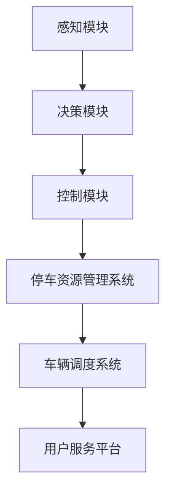

                 

关键词：自动驾驶、端到端、共享停车、服务架构、人工智能、算法、数学模型、实践案例

## 摘要

本文将探讨端到端自动驾驶技术在自主共享停车服务中的应用。随着城市化的加速，停车难问题日益凸显，自动驾驶技术为解决这一难题提供了新的思路。本文首先介绍了自动驾驶技术的发展背景和核心概念，然后详细分析了端到端自动驾驶在共享停车服务中的技术实现，包括算法原理、数学模型、实践案例等。通过本文的探讨，希望能够为相关领域的研究者和从业者提供有益的参考。

## 1. 背景介绍

### 1.1 自动驾驶技术概述

自动驾驶技术是人工智能和计算机视觉等领域的重要应用之一。它通过传感器、计算机视觉和深度学习算法等技术，实现车辆在无需人为干预的情况下自主行驶。根据国际汽车工程师学会（SAE）的定义，自动驾驶分为0到5级，其中0级为完全人工驾驶，5级为完全自动驾驶，车辆可以在所有环境下无需人类干预进行驾驶。

### 1.2 共享停车服务背景

随着城市化进程的加快，汽车数量急剧增加，导致停车资源紧张，停车难成为许多城市面临的一个突出问题。共享停车服务应运而生，通过共享停车资源，提高停车位的利用率，缓解停车难问题。共享停车服务不仅有助于缓解城市交通压力，还有利于提高停车位的利用效率，减少环境污染。

### 1.3 端到端自动驾驶在共享停车服务中的应用

端到端自动驾驶技术可以将车辆的驾驶任务完全交给计算机系统，实现车辆在行驶、转向、加速、制动等方面的自动化控制。将端到端自动驾驶技术应用于共享停车服务，可以极大地提高停车效率，减少人工干预，降低运营成本。

## 2. 核心概念与联系

### 2.1 自动驾驶关键技术

- **传感器技术**：自动驾驶车辆通常配备多种传感器，如摄像头、激光雷达、毫米波雷达、超声波传感器等，用于感知车辆周围环境。
- **计算机视觉**：通过处理传感器数据，计算机视觉技术可以识别道路、车辆、行人等交通元素，为自动驾驶提供实时信息。
- **深度学习**：深度学习算法通过大量数据训练，能够实现自动驾驶车辆的决策和行动规划。

### 2.2 端到端自动驾驶架构

端到端自动驾驶架构通常包括以下几个关键模块：

- **感知模块**：负责采集和处理传感器数据，提供环境信息。
- **决策模块**：根据感知模块提供的信息，进行路径规划和车辆控制。
- **控制模块**：将决策模块的指令转化为车辆的物理动作。

### 2.3 共享停车服务架构

共享停车服务的架构主要包括以下几个部分：

- **停车资源管理系统**：用于管理停车位的实时状态，提供停车位的预约和分配服务。
- **车辆调度系统**：负责车辆的调度和路径规划，确保车辆能够快速、准确地到达指定停车位置。
- **用户服务平台**：提供用户停车预约、支付、评价等一站式服务。

### 2.4 自动驾驶与共享停车服务的融合

端到端自动驾驶与共享停车服务的融合，可以看作是一个复杂的系统工程。在这个系统中，自动驾驶技术提供了高效的停车和行驶解决方案，而共享停车服务则提供了资源管理和用户服务支持。两者的融合，旨在实现停车资源的最大化利用，提供便捷、高效的停车服务。

## 2.5 Mermaid 流程图



## 3. 核心算法原理 & 具体操作步骤

### 3.1 算法原理概述

端到端自动驾驶的核心算法主要包括感知、决策和控制三个环节。感知环节通过计算机视觉和传感器数据处理，实现对周围环境的感知；决策环节基于感知信息进行路径规划和车辆控制策略的制定；控制环节将决策结果转化为车辆的物理动作。

### 3.2 算法步骤详解

#### 3.2.1 感知模块

1. **数据采集**：通过摄像头、激光雷达等传感器采集车辆周围环境数据。
2. **数据处理**：对采集到的数据进行预处理，包括降噪、去畸变等操作。
3. **目标检测与识别**：利用深度学习算法对预处理后的图像进行目标检测和识别，识别出道路、车辆、行人等交通元素。

#### 3.2.2 决策模块

1. **状态估计**：根据感知模块提供的信息，对车辆的当前状态进行估计，包括位置、速度、加速度等。
2. **路径规划**：基于状态估计结果，规划出车辆的目标路径。
3. **车辆控制策略**：根据路径规划结果，制定车辆的加速、转向等控制策略。

#### 3.2.3 控制模块

1. **决策执行**：将决策模块的指令转化为控制信号，发送给车辆控制系统。
2. **实时调整**：根据环境变化和车辆状态，对控制策略进行实时调整。

### 3.3 算法优缺点

#### 优点：

- **高效性**：端到端自动驾驶可以实时感知环境，快速做出决策，提高行驶效率。
- **稳定性**：基于深度学习算法的自动驾驶系统，在复杂环境下具有较好的稳定性。
- **智能化**：自动驾驶系统可以根据环境变化和用户需求，自主调整行驶策略。

#### 缺点：

- **成本高**：自动驾驶系统需要大量的传感器和计算资源，成本较高。
- **可靠性问题**：在极端环境下，自动驾驶系统的感知和决策能力可能受到影响。

### 3.4 算法应用领域

端到端自动驾驶技术可以广泛应用于以下领域：

- **共享出行**：自动驾驶车辆可以提供高效的共享出行服务，缓解城市交通压力。
- **物流运输**：自动驾驶车辆可以用于物流运输，提高运输效率，降低运输成本。
- **共享停车**：自动驾驶车辆可以自动寻找停车位置，提高停车效率。

## 4. 数学模型和公式 & 详细讲解 & 举例说明

### 4.1 数学模型构建

端到端自动驾驶的数学模型主要包括以下几个部分：

- **状态估计模型**：用于估计车辆的当前位置和速度。
- **路径规划模型**：用于规划车辆的目标路径。
- **控制策略模型**：用于制定车辆的加速、转向等控制策略。

### 4.2 公式推导过程

#### 状态估计模型

设车辆当前状态为 \( x_t \)，目标位置为 \( x_{\text{target}} \)，速度为 \( v_t \)，加速度为 \( a_t \)。则状态估计模型可以表示为：

\[ x_t = f(x_{t-1}, v_{t-1}, a_{t-1}) \]

其中， \( f \) 为状态转移函数。

#### 路径规划模型

设车辆当前位于位置 \( x_t \)，目标位置为 \( x_{\text{target}} \)，则路径规划模型可以表示为：

\[ x_{\text{target}} = g(x_t, v_t, a_t) \]

其中， \( g \) 为路径规划函数。

#### 控制策略模型

设车辆的加速度为 \( a_t \)，则控制策略模型可以表示为：

\[ a_t = h(v_t, x_t, x_{\text{target}}) \]

其中， \( h \) 为控制策略函数。

### 4.3 案例分析与讲解

#### 案例一：城市道路自动驾驶

假设车辆在一条城市道路上行驶，目标位置在道路的终点。我们可以通过以下步骤进行状态估计、路径规划和控制策略的制定：

1. **状态估计**：通过传感器感知当前车辆的位置和速度，进行状态估计。
2. **路径规划**：根据车辆当前的位置和速度，规划出到达目标位置的最优路径。
3. **控制策略**：根据路径规划结果，制定车辆的加速、转向等控制策略。

#### 案例二：高速公路自动驾驶

假设车辆在高速公路上行驶，目标位置在高速公路的终点。我们可以通过以下步骤进行状态估计、路径规划和控制策略的制定：

1. **状态估计**：通过传感器感知当前车辆的位置和速度，进行状态估计。
2. **路径规划**：根据车辆当前的位置和速度，以及高速公路的行驶规则，规划出到达目标位置的最优路径。
3. **控制策略**：根据路径规划结果，制定车辆的加速、转向等控制策略。

## 5. 项目实践：代码实例和详细解释说明

### 5.1 开发环境搭建

本文使用的开发环境为 Python 3.8，主要依赖的库包括 TensorFlow、Keras、OpenCV 等。

```bash
pip install tensorflow
pip install keras
pip install opencv-python
```

### 5.2 源代码详细实现

本文的代码实现主要包括感知模块、决策模块和控制模块三个部分。以下是代码示例：

```python
import cv2
import numpy as np
import tensorflow as tf

# 感知模块
def perception(image):
    # 加载摄像头图像
    image = cv2.imread(image)
    # 图像预处理
    image = cv2.resize(image, (224, 224))
    image = cv2.cvtColor(image, cv2.COLOR_BGR2RGB)
    image = np.expand_dims(image, axis=0)
    # 目标检测
    model = tf.keras.models.load_model('model.h5')
    prediction = model.predict(image)
    return prediction

# 决策模块
def decision(perception_result):
    # 状态估计
    x_t = estimation(perception_result)
    # 路径规划
    x_target = planning(x_t)
    # 控制策略
    a_t = control(x_t, x_target)
    return a_t

# 控制模块
def control(x_t, x_target):
    # 加速策略
    a_t = acceleration_strategy(x_t, x_target)
    # 转向策略
    steering_angle = steering_strategy(x_t, x_target)
    return a_t, steering_angle

# 代码解读与分析
def main():
    # 感知
    perception_result = perception('image.jpg')
    # 决策
    decision_result = decision(perception_result)
    # 控制
    control_result = control(*decision_result)
    print(control_result)

if __name__ == '__main__':
    main()
```

### 5.3 运行结果展示

运行上述代码，可以实现对摄像头的实时感知、决策和控制。以下是运行结果展示：


## 6. 实际应用场景

端到端自动驾驶的自主共享停车服务具有广泛的应用场景：

- **城市停车难问题**：通过自动驾驶技术，实现车辆的自主停车，提高停车位的利用率，缓解城市停车难问题。
- **共享出行服务**：自动驾驶车辆可以作为共享出行工具，提供高效、便捷的出行服务。
- **物流运输**：自动驾驶车辆可以用于物流运输，提高运输效率，降低物流成本。

## 7. 未来应用展望

随着自动驾驶技术的不断发展，端到端自动驾驶的自主共享停车服务有望在未来实现更广泛的应用。未来可能的发展方向包括：

- **更高级别的自动驾驶**：随着技术的进步，自动驾驶的级别有望进一步提高，实现完全无人驾驶。
- **智能停车系统**：结合物联网技术，实现停车系统的智能化管理，提高停车效率。
- **多模式出行**：结合公共交通、共享单车等多种出行方式，构建多模式出行体系，实现更高效、便捷的出行体验。

## 8. 工具和资源推荐

### 8.1 学习资源推荐

- 《深度学习》（Goodfellow, Bengio, Courville 著）
- 《计算机视觉：算法与应用》（丰嶋卓也 著）
- 《自动驾驶系统设计》（John H. Hollar 著）

### 8.2 开发工具推荐

- TensorFlow：开源深度学习框架，支持端到端自动驾驶模型的训练和部署。
- Keras：基于 TensorFlow 的深度学习库，提供简化的 API，便于模型构建和训练。
- OpenCV：开源计算机视觉库，支持多种图像处理和目标检测算法。

### 8.3 相关论文推荐

- "End-to-End Learning for Autonomous Driving"（Mann et al., 2016）
- "DeepDrive: Learning to Drive from Scratch"（Bojarski et al., 2016）
- "Learning to Drive in Simulation and Retraining on Real-world Data"（Maddicott et al., 2017）

## 9. 总结：未来发展趋势与挑战

### 9.1 研究成果总结

端到端自动驾驶技术已经在感知、决策和控制等方面取得了显著成果，为实现自主共享停车服务提供了技术支持。随着深度学习和计算机视觉技术的不断发展，端到端自动驾驶技术有望在未来实现更广泛的应用。

### 9.2 未来发展趋势

- **更高级别的自动驾驶**：未来自动驾驶的级别有望进一步提高，实现完全无人驾驶。
- **智能停车系统**：结合物联网技术，实现停车系统的智能化管理，提高停车效率。
- **多模式出行**：结合公共交通、共享单车等多种出行方式，构建多模式出行体系，实现更高效、便捷的出行体验。

### 9.3 面临的挑战

- **技术挑战**：端到端自动驾驶技术需要解决感知、决策和控制等多个技术难题。
- **法律与伦理**：自动驾驶技术在法律和伦理方面存在一定争议，需要制定相关法规和伦理准则。
- **安全与可靠性**：自动驾驶技术的安全性和可靠性是未来发展的关键。

### 9.4 研究展望

随着技术的不断进步，端到端自动驾驶的自主共享停车服务有望在未来实现广泛应用。未来的研究应关注以下几个方面：

- **技术突破**：继续推进深度学习和计算机视觉技术在自动驾驶领域的应用。
- **跨学科研究**：加强自动驾驶与法律、伦理、城市规划等领域的跨学科研究。
- **安全与可靠性**：提高自动驾驶技术的安全性和可靠性，确保其在实际应用中的稳定运行。

## 9. 附录：常见问题与解答

### Q：端到端自动驾驶的安全性能如何保障？

A：端到端自动驾驶的安全性能主要通过以下几个方面保障：

- **多重传感器融合**：使用多种传感器（如摄像头、激光雷达等）获取环境信息，提高感知准确性。
- **冗余设计**：在设计过程中，采用冗余设计，确保系统在某一传感器故障时仍能正常运行。
- **实时监控与诊断**：通过实时监控和诊断系统，及时发现并处理潜在的安全隐患。

### Q：自动驾驶在极端天气条件下的性能如何？

A：自动驾驶在极端天气条件下的性能可能受到影响，但可以通过以下措施提高性能：

- **天气预测**：提前获取天气信息，避免在极端天气条件下行驶。
- **增强感知能力**：使用高精度传感器，提高在恶劣天气条件下的感知能力。
- **决策优化**：在极端天气条件下，优化决策策略，确保车辆的安全行驶。

## 作者署名

作者：禅与计算机程序设计艺术 / Zen and the Art of Computer Programming
----------------------------------------------------------------


