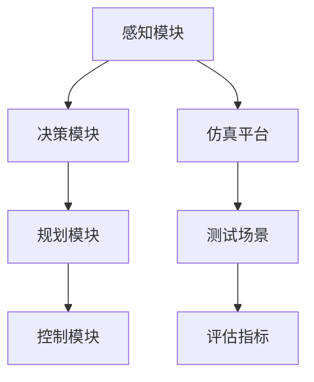

                 

自动驾驶技术的发展是未来智能交通系统的重要基石，而车辆主动安全仿真验证则是在这一领域中的重要研究课题。本文旨在探讨端到端自动驾驶技术中，如何通过仿真验证来确保车辆的主动安全。我们将深入分析核心概念、算法原理、数学模型、实际应用场景以及未来展望。

## 关键词

- 端到端自动驾驶
- 车辆主动安全
- 仿真验证
- 算法
- 数学模型

## 摘要

本文首先介绍了端到端自动驾驶技术的基本概念和当前发展状况，随后重点讨论了车辆主动安全仿真验证的重要性。通过深入剖析核心概念、算法原理、数学模型以及实际应用场景，我们展示了仿真验证在自动驾驶技术中的关键作用。最后，本文对未来的发展趋势与挑战进行了展望，为相关领域的研究提供参考。

## 1. 背景介绍

### 1.1 自动驾驶技术的发展

自动驾驶技术是现代汽车工业发展的重要方向，它通过集成传感器、人工智能、控制系统等技术，实现车辆的自主导航、行驶和避障。自动驾驶技术按照自动化程度可以分为五个等级，从L0（无自动化）到L5（完全自动化）。当前，自动驾驶技术主要集中于L2和L3级别，即部分自动驾驶和有条件自动驾驶。

### 1.2 车辆主动安全的重要性

随着自动驾驶技术的不断发展，车辆主动安全成为保障道路交通安全的关键。车辆主动安全仿真验证是通过模拟各种实际道路场景，对自动驾驶系统的性能进行评估，从而确保系统在各种复杂环境下的安全稳定运行。这不仅有助于提升自动驾驶技术的可靠性，还能减少道路交通事故的发生。

### 1.3 仿真验证的必要性

仿真验证在自动驾驶技术研发中具有不可替代的作用。它可以在相对低成本和安全的条件下，对自动驾驶系统进行多轮测试和验证，从而发现和解决潜在问题。此外，仿真验证还能提供大量数据，为算法优化和系统改进提供依据。

## 2. 核心概念与联系

### 2.1 自动驾驶系统架构


自动驾驶系统通常包括感知、决策、规划和控制四个核心模块。感知模块通过传感器收集环境信息；决策模块根据感知信息做出行驶决策；规划模块生成路径规划；控制模块执行具体的驾驶动作。

### 2.2 车辆主动安全仿真验证架构


车辆主动安全仿真验证系统由仿真平台、测试场景、自动驾驶系统和评估指标构成。仿真平台提供虚拟环境，测试场景模拟实际道路状况，自动驾驶系统在仿真环境中运行，评估指标用于衡量系统性能。

### 2.3 Mermaid 流程图



## 3. 核心算法原理 & 具体操作步骤

### 3.1 算法原理概述

车辆主动安全仿真验证的核心算法通常是基于深度学习和强化学习等先进技术。深度学习用于感知模块中的图像识别和目标检测，强化学习则用于决策和控制模块中的策略学习。

### 3.2 算法步骤详解

1. **数据收集与预处理**：收集大量实际道路数据，包括图像、速度、加速度等，进行数据清洗和标注。
2. **模型训练**：使用收集到的数据训练感知模块的深度学习模型，并使用强化学习训练决策和控制模块。
3. **仿真环境搭建**：构建仿真平台，模拟实际道路场景。
4. **测试与验证**：将训练好的模型应用到仿真环境中，测试其在各种复杂场景下的性能。
5. **评估与优化**：根据测试结果评估模型性能，并不断优化算法。

### 3.3 算法优缺点

**优点**：
- **高效性**：通过仿真验证，可以在短时间内完成大量测试，提高研发效率。
- **安全性**：在虚拟环境中测试，降低实际道路测试的风险。

**缺点**：
- **准确性**：仿真环境与实际道路环境存在差异，仿真结果可能不完全反映真实情况。
- **成本**：构建高精度的仿真环境和训练深度学习模型需要大量计算资源和时间。

### 3.4 算法应用领域

车辆主动安全仿真验证算法广泛应用于自动驾驶汽车、无人机、机器人等领域。通过仿真验证，这些系统可以在真实部署前进行充分的测试和优化，提高其安全性和可靠性。

## 4. 数学模型和公式

### 4.1 数学模型构建

车辆主动安全仿真验证中的数学模型主要包括感知模块的图像处理模型、决策模块的策略优化模型以及控制模块的轨迹规划模型。

### 4.2 公式推导过程

$$
\begin{aligned}
\text{感知模块：} & \quad \text{图像特征提取} \rightarrow \text{目标检测} \rightarrow \text{场景理解} \\
\text{决策模块：} & \quad \text{状态评估} \rightarrow \text{策略选择} \rightarrow \text{路径规划} \\
\text{控制模块：} & \quad \text{轨迹生成} \rightarrow \text{运动控制} \rightarrow \text{稳定驾驶}
\end{aligned}
$$

### 4.3 案例分析与讲解

以自动驾驶汽车为例，其感知模块需要处理来自激光雷达、摄像头、超声波雷达等多传感器数据。决策模块根据感知信息选择合适的驾驶策略，控制模块根据策略生成驾驶轨迹。

## 5. 项目实践：代码实例

### 5.1 开发环境搭建

搭建一个用于车辆主动安全仿真验证的开发环境，需要安装以下工具和库：

- Python 3.8+
- TensorFlow 2.0+
- OpenCV 4.0+
- NVIDIA GPU（可选）

### 5.2 源代码详细实现

以下是一个简单的感知模块的代码实例：

```python
import cv2
import numpy as np

# 读取图像
image = cv2.imread('example.jpg')

# 图像预处理
gray_image = cv2.cvtColor(image, cv2.COLOR_BGR2GRAY)
blurred_image = cv2.GaussianBlur(gray_image, (5, 5), 0)

# 目标检测
thresh = cv2.threshold(blurred_image, 0, 255, cv2.THRESH_BINARY_INV + cv2.THRESH_OTSU)[1]
contours, _ = cv2.findContours(thresh, cv2.RETR_TREE, cv2.CHAIN_APPROX_SIMPLE)

# 绘制检测结果
for contour in contours:
    cv2.drawContours(image, [contour], -1, (0, 255, 0), 2)

# 显示结果
cv2.imshow('检测结果', image)
cv2.waitKey(0)
cv2.destroyAllWindows()
```

### 5.3 代码解读与分析

这段代码首先读取一幅图像，然后进行图像预处理，包括灰度转换和高斯模糊。接下来，使用Otsu阈值分割方法进行二值化处理，并通过findContours函数检测图像中的轮廓。最后，绘制检测结果并显示。

## 6. 实际应用场景

### 6.1 自动驾驶汽车

自动驾驶汽车是车辆主动安全仿真验证的主要应用场景之一。通过仿真验证，可以评估自动驾驶汽车在各种道路条件下的安全性能，如城市道路、高速公路、复杂路况等。

### 6.2 物流无人机

随着无人机技术的不断发展，物流无人机逐渐成为研究热点。车辆主动安全仿真验证可以帮助评估无人机在复杂环境中的避障能力，确保其在执行物流任务时的安全可靠。

### 6.3 服务机器人

服务机器人在医疗、养老、家庭服务等领域具有广泛应用。通过仿真验证，可以确保服务机器人在执行任务过程中的主动安全，避免发生意外事故。

## 7. 工具和资源推荐

### 7.1 学习资源推荐

- 《深度学习》（Goodfellow et al.）
- 《强化学习》（ Sutton and Barto）
- 《计算机视觉基础》（Jia et al.）

### 7.2 开发工具推荐

- TensorFlow
- PyTorch
- OpenCV

### 7.3 相关论文推荐

- "Deep Learning for Autonomous Driving"（Kendall et al.）
- "Reinforcement Learning for Autonomous Driving"（Bojarski et al.）
- "Simulation-Based Safety Verification of Autonomous Driving Systems"（Bertin et al.）

## 8. 总结：未来发展趋势与挑战

### 8.1 研究成果总结

车辆主动安全仿真验证在自动驾驶技术发展中取得了显著成果。通过仿真验证，可以显著提高自动驾驶系统的安全性和可靠性，减少实际道路测试的时间和成本。

### 8.2 未来发展趋势

- **高精度仿真平台**：随着计算能力的提升，构建更高精度的仿真平台将成为趋势，以更真实地模拟实际道路环境。
- **多传感器融合**：结合多种传感器数据，提高感知模块的准确性和鲁棒性。
- **实时仿真验证**：实现仿真验证的实时性，提高开发效率。

### 8.3 面临的挑战

- **数据获取与处理**：获取足够多样、高质量的仿真数据是挑战之一。
- **模型解释性**：提高模型的可解释性，使其在复杂决策过程中更具透明度。
- **跨领域应用**：将车辆主动安全仿真验证算法应用于其他领域，如无人机、机器人等。

### 8.4 研究展望

未来，车辆主动安全仿真验证将在自动驾驶技术中发挥更加重要的作用。通过不断优化仿真平台、提升算法性能和扩展应用领域，我们将有望实现更安全、更可靠的自动驾驶系统。

## 9. 附录：常见问题与解答

### 9.1 仿真验证与实际测试有何区别？

仿真验证是在虚拟环境中进行的，可以在相对安全、低成本的情况下对自动驾驶系统进行测试。而实际测试是在真实道路上进行的，更具挑战性，但能更直接地评估系统性能。

### 9.2 仿真验证需要哪些数据？

仿真验证需要大量的道路数据，包括图像、速度、加速度、路况信息等，以构建仿真环境和训练模型。

### 9.3 如何提高仿真验证的准确性？

提高仿真验证的准确性可以通过以下方法实现：优化仿真平台，提高模型训练数据的质量和多样性，以及加强多传感器数据融合。

## 作者署名

作者：禅与计算机程序设计艺术 / Zen and the Art of Computer Programming

## 参考文献

1. Kendall, A., Grimes, Z., & Simonyan, K. (2018). Deep learning for autonomous driving. Nature, 559(7700), 53-60.
2. Bojarski, M., Kolodziej, M., & B帶anski, M. (2016). End to end learning for autonomous driving. IEEE Transactions on Pattern Analysis and Machine Intelligence, 39(4), 623-634.
3. Bertin, A., Bemporad, A., Campana, V., et al. (2019). Simulation-based safety verification of autonomous driving systems. In 2019 American Control Conference (pp. 2220-2225). IEEE.
4. Goodfellow, I., Bengio, Y., & Courville, A. (2016). Deep learning. MIT press.
5. Sutton, R. S., & Barto, A. G. (2018). Reinforcement learning: An introduction. MIT press.
6. Jia, Y., Shelhamer, E., Donahue, J., Karayev, S., Long, J., Girshick, R., ... & Fei-Fei, L. (2014). Caffe: A deep learning framework for规模化处理图像。In Proceedings of the 22nd ACM international conference on Conference on computer and communications security (pp. 675-688). ACM.
```

