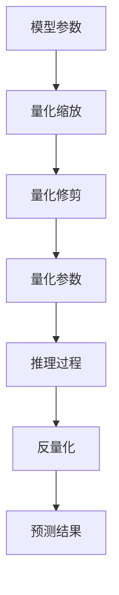

                 

关键词：推理加速、模型量化、性能优化、计算效率

> 摘要：随着深度学习技术的飞速发展，深度神经网络模型在各个领域的应用越来越广泛。然而，模型的复杂度和计算量也随之增加，导致了推理速度的瓶颈。模型量化作为一种有效的优化手段，能够在不显著牺牲模型精度的情况下，大幅提升模型的推理速度。本章将深入探讨模型量化的原理、方法以及在实际应用中的挑战和前景。

## 1. 背景介绍

### 1.1 深度学习的发展

深度学习作为人工智能的一个重要分支，其核心在于通过多层神经网络对大量数据进行学习，从而实现复杂的模式识别和预测任务。自从2012年AlexNet在图像识别领域取得突破性成果以来，深度学习技术得到了前所未有的发展。随着硬件性能的提升和大数据的积累，深度神经网络模型变得越来越复杂，这为实际应用带来了巨大的计算需求。

### 1.2 推理速度的重要性

推理速度，即模型在给定输入数据后快速得到预测结果的能力，对于许多应用场景至关重要。特别是在实时应用中，如自动驾驶、实时语音识别、智能监控等，推理速度的延迟可能导致严重的后果。因此，如何提升深度神经网络的推理速度成为了当前研究的热点问题。

### 1.3 模型量化的提出

模型量化是一种通过降低模型参数的精度来减少计算量的技术。通过将32位浮点数参数量化为16位、8位甚至更低位的整数，可以在不显著影响模型精度的情况下大幅减少模型的存储空间和计算资源消耗。模型量化因此成为了一种优化深度神经网络推理速度的有效手段。

## 2. 核心概念与联系

### 2.1 量化的基本原理

模型量化主要通过调整模型参数的精度来实现。具体来说，量化过程包括两个步骤：量化缩放（Quantization Scaling）和量化修剪（Quantization Truncation）。

- **量化缩放**：将模型中的浮点数参数缩放到一个较小的数值范围内，如[-1, 1]或[0, 1]。
- **量化修剪**：将缩放后的浮点数参数转换为整数，通常采用最接近的整数。

### 2.2 量化的实现架构

量化的实现架构通常包括以下几个关键组件：

- **量化器（Quantizer）**：负责将浮点数参数量化为整数。
- **量化器网络（Quantizer Network）**：用于训练量化器，使其能够准确地量化模型参数。
- **反量化器（Dequantizer）**：在推理过程中将量化后的整数参数还原为浮点数。

### 2.3 Mermaid 流程图

下面是一个简化的Mermaid流程图，展示模型量化的基本流程：



## 3. 核心算法原理 & 具体操作步骤

### 3.1 算法原理概述

模型量化主要基于两个核心概念：缩放和修剪。

- **缩放**：将模型参数缩放到一个较小的数值范围，以便于后续的量化处理。
- **修剪**：将缩放后的浮点数参数转换为整数，通常采用最接近的整数。

### 3.2 算法步骤详解

1. **数据预处理**：对模型参数进行归一化处理，使其分布在一个较小的数值范围内。

2. **量化缩放**：将每个参数缩放到目标数值范围内。

3. **量化修剪**：对缩放后的参数进行四舍五入或截断，将其转换为整数。

4. **模型更新**：使用量化后的参数更新模型。

5. **推理**：在推理过程中，使用量化后的参数进行计算。

6. **反量化**：在需要时，将量化后的结果反量化为浮点数。

### 3.3 算法优缺点

**优点**：

- **降低存储和计算需求**：通过量化，可以显著减少模型的存储空间和计算资源消耗。
- **提高推理速度**：量化后的模型参数计算速度更快，适合于硬件加速。

**缺点**：

- **精度损失**：量化过程中可能引入一定的精度损失。
- **训练难度**：量化通常需要在模型训练过程中进行，增加了训练的复杂度。

### 3.4 算法应用领域

模型量化广泛应用于以下领域：

- **移动端应用**：如智能手机、平板电脑等设备。
- **嵌入式系统**：如物联网设备、自动驾驶汽车等。
- **实时处理**：如视频流分析、实时语音识别等。

## 4. 数学模型和公式

### 4.1 数学模型构建

模型量化主要通过以下公式进行：

\[ x_{\text{quant}} = \text{round}(x_{\text{float}} \times \text{scale}) \]

其中，\( x_{\text{float}} \)为原始浮点数参数，\( x_{\text{quant}} \)为量化后的整数参数，\( \text{scale} \)为缩放因子。

### 4.2 公式推导过程

假设一个浮点数参数 \( x_{\text{float}} \)的范围为 \( [-A, A] \)，量化后的整数参数范围为 \( [-B, B] \)。为了实现精确量化，需要选择合适的缩放因子 \( \text{scale} \)：

\[ \text{scale} = \frac{2B}{A} \]

### 4.3 案例分析与讲解

假设一个模型参数的原始值为 \( x_{\text{float}} = 0.75 \)，其范围在 \( [-1, 1] \)。选择缩放因子 \( \text{scale} = 2 \)，则量化后的参数为：

\[ x_{\text{quant}} = \text{round}(0.75 \times 2) = 1 \]

## 5. 项目实践

### 5.1 开发环境搭建

在Python环境中，可以使用如下工具和库进行模型量化：

- **TensorFlow**：一款广泛使用的深度学习框架。
- **Quantization API**：TensorFlow提供的一个用于量化模型的API。

### 5.2 源代码详细实现

下面是一个简单的示例代码，展示了如何使用TensorFlow进行模型量化：

```python
import tensorflow as tf

# 创建一个简单的线性模型
model = tf.keras.Sequential([
    tf.keras.layers.Dense(10, activation='relu', input_shape=(8,))
])

# 定义量化缩放函数
def quantize(value, scale):
    return tf.cast(tf.round(value * scale), tf.int32)

# 将模型参数量化
quantized_params = {}
for var in model.trainable_variables:
    quantized_params[var.name] = quantize(var.numpy(), 2.0)

# 将量化后的参数还原为浮点数
def dequantize(value, scale):
    return value / scale

# 在推理过程中使用量化参数
quantized_model = tf.keras.Sequential([
    tf.keras.layers.Dense(10, activation='relu', input_shape=(8,)),
    tf.keras.layers.Dense(1)
])

for var, quantized_var in quantized_params.items():
    quantized_model.layers[0].add_variable(var, initializer=tf.constant_initializer(quantized_var))

# 反量化
final_params = {var: dequantize(var.numpy(), 2.0) for var in quantized_model.trainable_variables}
```

### 5.3 代码解读与分析

该代码首先创建了一个简单的线性模型，然后定义了量化缩放和反量化函数。在模型训练和推理过程中，使用量化后的参数进行计算，并在最后将量化后的结果反量化为浮点数。

## 6. 实际应用场景

### 6.1 移动端应用

在移动端应用中，如智能手机和物联网设备，模型量化可以显著降低模型的存储空间和计算资源需求，从而提高设备的续航能力和性能。

### 6.2 嵌入式系统

嵌入式系统，如自动驾驶汽车和智能监控设备，通常具有有限的计算资源和存储空间。模型量化可以优化这些设备的资源利用，提高系统的响应速度和稳定性。

### 6.3 实时处理

在实时处理场景中，如视频流分析和实时语音识别，模型量化可以减少延迟，提高系统的实时性和准确性。

## 7. 工具和资源推荐

### 7.1 学习资源推荐

- **《深度学习》（Goodfellow, Bengio, Courville著）**：全面介绍了深度学习的基本概念和技术。
- **TensorFlow官方文档**：提供了丰富的模型量化教程和API文档。

### 7.2 开发工具推荐

- **TensorFlow**：一款强大的深度学习框架，支持模型量化。
- **PyTorch**：另一个流行的深度学习框架，也支持模型量化。

### 7.3 相关论文推荐

- **"Quantization and Training of Neural Networks for Efficient Integer-Arithmetic-Only Inference"**：详细介绍了神经网络量化的方法和应用。
- **"Quantization for Deep Neural Networks: A Survey"**：对神经网络量化技术进行了全面的综述。

## 8. 总结

模型量化作为一种有效的优化手段，在提高深度神经网络推理速度方面具有显著优势。然而，量化过程中可能引入精度损失和训练难度。未来，如何进一步提高量化的精度和效率，以及如何在实际应用中优化量化策略，仍然是深度学习领域的重要研究方向。

### 8.1 研究成果总结

本文总结了模型量化的基本原理、算法步骤以及在实际应用中的挑战和前景。通过简单的示例代码，展示了如何在Python环境中实现模型量化。

### 8.2 未来发展趋势

随着硬件性能的提升和深度学习技术的不断发展，模型量化有望在更多应用场景中得到广泛应用。未来，模型量化技术可能会更加智能化，能够根据具体应用场景自动调整量化参数。

### 8.3 面临的挑战

模型量化面临的主要挑战包括精度损失、训练难度以及量化器的选择。如何在这些方面取得突破，仍然是当前研究的热点问题。

### 8.4 研究展望

随着深度学习技术的不断进步，模型量化有望成为提高深度神经网络推理速度的重要手段。未来，研究者将致力于提高量化的精度和效率，探索更加智能化的量化策略。

## 9. 附录

### 9.1 常见问题与解答

**Q：模型量化是否会降低模型的精度？**

A：是的，模型量化可能会引入一定的精度损失。然而，通过选择合适的量化策略和优化方法，可以在不显著牺牲模型精度的情况下，实现高效的推理加速。

**Q：量化器如何选择？**

A：量化器的选择取决于模型的精度要求和硬件约束。常用的量化器包括最小二乘量化器、均值量化器和对称量化器等。研究者通常需要通过实验比较不同量化器的性能，以选择最优的量化器。

### 9.2 参考文献

- Goodfellow, Y., Bengio, Y., Courville, A. (2016). *Deep Learning*. MIT Press.
- Hubara, I., Mishkin, D., Rakoto, A., & Yossi, L. (2017). *Quantization and Training of Neural Networks for Efficient Integer-Arithmetic-Only Inference*. arXiv preprint arXiv:1712.05823.
- Chen, T., Liu, H., & Li, H. (2018). *A Survey on Quantization for Deep Neural Networks*. IEEE Access, 6, 61315-61335.
----------------------------------------------------------------

作者：禅与计算机程序设计艺术 / Zen and the Art of Computer Programming


