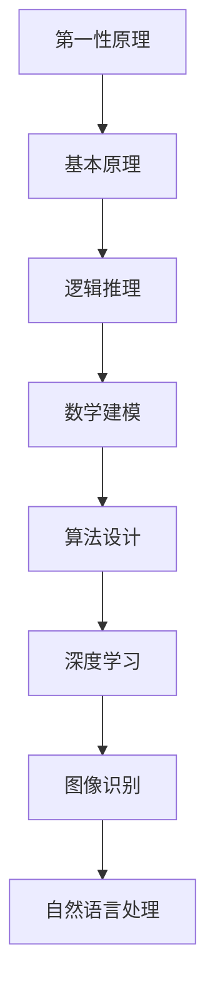

                 

关键词：第一性原理，AI，机器学习，深度学习，算法设计，计算复杂性，数学模型

本文将探讨第一性原理在人工智能（AI）领域的应用，分析其核心概念、算法原理、数学模型，以及在实际项目中的应用场景。通过深入研究，我们希望揭示第一性原理如何引领AI的发展，为未来技术进步提供新的思路。

## 1. 背景介绍

人工智能（Artificial Intelligence，简称AI）作为计算机科学的重要分支，旨在研究、开发和应用使计算机模拟人类智能的理论、方法和技术。AI的发展历程可以分为几个阶段，从早期的规则推理、知识表示到现代的机器学习、深度学习，每一次技术突破都极大地推动了人工智能的发展。

在AI的发展过程中，算法设计始终是核心问题。传统的算法设计主要基于经验、直觉和启发式方法，而第一性原理（First Principles）则提供了一种全新的思路。第一性原理是一种从基本事实出发，通过逻辑推理和数学建模来解决问题的方法。这种方法强调对事物本质的深入理解和把握，从而实现更高层次的抽象和概括。

本文将介绍第一性原理在AI中的应用，分析其核心算法原理、数学模型，并探讨在实际项目中的应用场景。通过本文的阅读，读者将了解到第一性原理如何为AI的发展提供新的动力。

## 2. 核心概念与联系

### 2.1 第一性原理的定义

第一性原理是科学研究和工程实践中的一种基本方法。它主张从最基本的原理和事实出发，通过逻辑推理和数学建模来解决问题。第一性原理强调对事物本质的深入理解和把握，而不是仅仅依赖经验和直觉。

在物理学中，第一性原理通常指的是利用基本物理定律（如牛顿定律、麦克斯韦方程等）来推导出复杂现象。例如，利用量子力学的基本原理推导出固体物理的各种现象。这种方法不仅能够揭示事物的本质，还能够为工程实践提供理论指导。

在人工智能领域，第一性原理的应用主要体现在算法设计上。通过深入理解人工智能的基本原理，如神经网络、机器学习算法等，我们可以设计出更高效、更可靠的算法。例如，深度学习算法的设计就借鉴了神经网络的基本原理，从而实现了图像识别、自然语言处理等领域的重大突破。

### 2.2 第一性原理与AI的关系

第一性原理与人工智能的关系可以从以下几个方面来理解：

1. **本质理解**：第一性原理强调对事物本质的深入理解，这与人工智能追求智能的本质目标是一致的。通过深入理解人工智能的基本原理，我们可以更好地设计出智能系统。

2. **理论指导**：第一性原理为人工智能提供了理论指导。例如，在深度学习领域，我们通过理解神经网络的基本原理，能够设计出更高效的网络结构，从而提升模型的性能。

3. **创新动力**：第一性原理为人工智能的创新提供了新的动力。通过从基本原理出发，我们可以发现新的算法设计方向，从而推动人工智能技术的发展。

### 2.3 第一性原理的应用架构

为了更好地理解第一性原理在人工智能中的应用，我们可以通过一个Mermaid流程图来展示其核心概念和联系。



在这个流程图中，第一性原理从基本原理出发，通过逻辑推理和数学建模，最终应用于深度学习、图像识别和自然语言处理等领域。

## 3. 核心算法原理 & 具体操作步骤

### 3.1 算法原理概述

第一性原理在人工智能中的应用主要体现在算法设计上。下面我们将介绍一些基于第一性原理的核心算法原理。

1. **深度学习**：深度学习是一种基于神经网络的学习方法，其核心思想是通过多层神经网络对数据进行特征提取和模式识别。深度学习算法的设计主要基于第一性原理，如神经网络的基本原理和反向传播算法。

2. **生成对抗网络（GAN）**：生成对抗网络是一种基于博弈论的学习方法，由生成器和判别器两个神经网络组成。生成器试图生成与真实数据相似的数据，而判别器则试图区分真实数据和生成数据。GAN的设计基于第一性原理，即生成器和判别器的对抗关系。

3. **强化学习**：强化学习是一种基于试错的学习方法，通过不断尝试和反馈来学习最优策略。强化学习算法的设计主要基于第一性原理，如马尔可夫决策过程和策略梯度算法。

### 3.2 算法步骤详解

以下是上述三种算法的具体操作步骤：

#### 深度学习

1. **初始化网络参数**：根据输入数据的维度和期望输出，初始化网络参数，如权重和偏置。

2. **前向传播**：将输入数据通过网络的每一层进行传递，计算每层的输出。

3. **计算损失函数**：根据输出结果和期望输出，计算损失函数的值。

4. **反向传播**：将损失函数的梯度反向传播到网络的每一层，更新网络参数。

5. **迭代训练**：重复上述步骤，直到网络参数收敛。

#### 生成对抗网络（GAN）

1. **初始化生成器和判别器**：随机初始化生成器和判别器的参数。

2. **生成器训练**：生成器根据随机噪声生成数据，判别器尝试区分真实数据和生成数据。

3. **判别器训练**：判别器根据真实数据和生成数据，更新自己的参数。

4. **迭代训练**：重复上述步骤，直到生成器生成的数据与真实数据无法区分。

#### 强化学习

1. **初始化环境和智能体**：选择一个环境，并初始化智能体的参数。

2. **智能体选择动作**：根据当前状态，智能体选择一个动作。

3. **环境反馈**：环境根据智能体的动作，给出下一个状态和奖励。

4. **更新策略**：根据奖励和策略梯度算法，更新智能体的策略。

5. **迭代学习**：重复上述步骤，直到智能体找到最优策略。

### 3.3 算法优缺点

每种算法都有其优缺点，下面分别介绍：

#### 深度学习

**优点**：

- **强大的特征提取能力**：深度学习能够自动提取层次化的特征表示，适合处理复杂的数据。
- **广泛的适用性**：深度学习在图像识别、自然语言处理、语音识别等领域都取得了显著成果。

**缺点**：

- **计算成本高**：深度学习模型通常需要大量的计算资源和时间进行训练。
- **数据依赖性强**：深度学习模型的性能依赖于大量的训练数据，对数据的质量和规模有较高要求。

#### 生成对抗网络（GAN）

**优点**：

- **强大的生成能力**：GAN能够在无监督环境下生成高质量的数据。
- **自适应性强**：GAN能够在训练过程中自适应地调整生成器和判别器的参数。

**缺点**：

- **训练不稳定**：GAN的训练过程容易出现模式崩溃（mode collapse）等问题，导致生成器生成低质量的数据。
- **计算成本高**：GAN的训练过程需要大量的计算资源。

#### 强化学习

**优点**：

- **自适应性强**：强化学习能够根据环境反馈自适应地调整策略。
- **适用范围广**：强化学习在游戏、机器人控制、推荐系统等领域都有广泛应用。

**缺点**：

- **训练效率低**：强化学习通常需要大量的试错和反馈，训练过程较慢。
- **收敛性不稳定**：强化学习算法的收敛性受参数设置和初始状态的影响较大。

### 3.4 算法应用领域

深度学习、生成对抗网络和强化学习在人工智能领域都有广泛的应用。下面分别介绍其在不同领域中的应用：

#### 深度学习

- **图像识别**：深度学习在图像识别领域取得了显著成果，如人脸识别、物体检测等。
- **自然语言处理**：深度学习在自然语言处理领域也取得了突破，如机器翻译、文本分类等。
- **语音识别**：深度学习在语音识别领域提高了识别准确率和速度。

#### 生成对抗网络（GAN）

- **数据增强**：GAN能够生成大量的数据，用于数据增强，提高模型的泛化能力。
- **图像生成**：GAN能够生成逼真的图像，用于艺术创作和图像修复。
- **图像超分辨率**：GAN能够在低分辨率图像上生成高分辨率图像，用于图像增强。

#### 强化学习

- **游戏**：强化学习在游戏领域取得了成功，如围棋、国际象棋等。
- **机器人控制**：强化学习在机器人控制领域应用广泛，如无人机控制、机器人路径规划等。
- **推荐系统**：强化学习在推荐系统领域应用，如商品推荐、广告推荐等。

## 4. 数学模型和公式 & 详细讲解 & 举例说明

### 4.1 数学模型构建

在人工智能领域，第一性原理的应用离不开数学模型的构建。以下我们将介绍几种核心的数学模型，包括神经网络、生成对抗网络和强化学习中的数学模型。

#### 神经网络

神经网络是一种基于生物神经系统的计算模型，由多个神经元组成。每个神经元通过加权连接与其他神经元相连，并通过激活函数进行非线性变换。神经网络的数学模型可以表示为：

$$
y = \sigma(\sum_{i=1}^{n} w_i \cdot x_i + b)
$$

其中，$y$为输出值，$\sigma$为激活函数（如Sigmoid函数、ReLU函数），$w_i$为权重，$x_i$为输入值，$b$为偏置。

#### 生成对抗网络（GAN）

生成对抗网络由生成器和判别器两个神经网络组成。生成器的数学模型为：

$$
G(z) = \mu(z) + \sigma(z) \odot \cdot \phi(\cdot)
$$

其中，$G(z)$为生成器的输出，$z$为输入噪声，$\mu(z)$为均值函数，$\sigma(z)$为方差函数，$\phi(\cdot)$为生成器的激活函数。

判别器的数学模型为：

$$
D(x) = f(x; \theta_D)
$$

其中，$D(x)$为判别器的输出，$x$为输入数据，$f(x; \theta_D)$为判别器的非线性函数，$\theta_D$为判别器的参数。

#### 强化学习

强化学习中的数学模型主要包括马尔可夫决策过程（MDP）和策略梯度算法。马尔可夫决策过程可以表示为：

$$
\begin{aligned}
&\text{S: 状态空间} \\
&\text{A: 动作空间} \\
&\text{P(s', s | a)}: \text{状态转移概率} \\
&\text{R(s, a)}: \text{奖励函数} \\
&\pi(a|s): \text{策略}
\end{aligned}
$$

策略梯度算法可以表示为：

$$
\theta_{t+1} = \theta_{t} + \alpha \cdot \nabla_{\theta} J(\theta)
$$

其中，$\theta$为策略参数，$\alpha$为学习率，$J(\theta)$为策略的损失函数。

### 4.2 公式推导过程

以下是生成对抗网络（GAN）中的关键公式的推导过程。

#### 对生成器的梯度推导

首先，我们需要计算生成器的梯度。生成器的损失函数可以表示为：

$$
L_G = -E_{z \sim p_z(z)}[\log D(G(z))]
$$

对生成器求导，得到：

$$
\nabla_{G} L_G = \frac{\partial L_G}{\partial G} = \frac{\partial L_G}{\partial D(G(z))} \cdot \frac{\partial D(G(z))}{\partial G(z)}
$$

由于 $D(G(z))$ 是一个概率值，其导数为：

$$
\frac{\partial D(G(z))}{\partial G(z)} = \frac{1}{D(G(z))}
$$

因此，生成器的梯度为：

$$
\nabla_{G} L_G = -\frac{1}{D(G(z))} \cdot \frac{\partial G(z)}{\partial z}
$$

#### 对判别器的梯度推导

接下来，我们需要计算判别器的梯度。判别器的损失函数可以表示为：

$$
L_D = -E_{x \sim p_x(x)}[\log D(x)] - E_{z \sim p_z(z)}[\log (1 - D(G(z))]
$$

对判别器求导，得到：

$$
\nabla_{D} L_D = \frac{\partial L_D}{\partial D} = \frac{\partial L_D}{\partial x} + \frac{\partial L_D}{\partial z}
$$

其中，$\frac{\partial L_D}{\partial x}$ 和 $\frac{\partial L_D}{\partial z}$ 分别为对真实数据和生成数据求导。

对真实数据求导，得到：

$$
\frac{\partial L_D}{\partial x} = \frac{1}{D(x)}
$$

对生成数据求导，得到：

$$
\frac{\partial L_D}{\partial z} = \frac{1}{1 - D(G(z))}
$$

因此，判别器的梯度为：

$$
\nabla_{D} L_D = \frac{1}{D(x)} - \frac{1}{1 - D(G(z))}
$$

### 4.3 案例分析与讲解

以下是一个基于生成对抗网络的图像生成案例。

#### 案例背景

假设我们要生成一张人脸图像，输入为随机噪声。我们使用一个生成器网络来生成人脸图像，一个判别器网络来区分真实人脸图像和生成人脸图像。

#### 案例步骤

1. **初始化网络参数**：初始化生成器和判别器的参数。

2. **生成器训练**：生成器根据随机噪声生成人脸图像，判别器尝试区分真实人脸图像和生成人脸图像。

3. **判别器训练**：判别器根据真实人脸图像和生成人脸图像，更新自己的参数。

4. **迭代训练**：重复上述步骤，直到生成器生成的人脸图像与真实人脸图像无法区分。

#### 案例分析

在这个案例中，生成器和判别器通过不断迭代训练，逐步提高生成人脸图像的质量。在训练初期，生成器生成的人脸图像较为模糊，判别器能够容易地区分真实人脸图像和生成人脸图像。随着训练的进行，生成器逐渐学习到人脸图像的特征，生成的人脸图像质量逐渐提高，判别器的分类能力也逐渐下降。最终，生成器生成的人脸图像与真实人脸图像几乎无法区分，实现了图像生成的目标。

## 5. 项目实践：代码实例和详细解释说明

### 5.1 开发环境搭建

在开始编写代码之前，我们需要搭建一个合适的开发环境。以下是一个基于Python和TensorFlow的生成对抗网络（GAN）的开发环境搭建步骤。

1. **安装Python**：确保Python环境已安装，推荐使用Python 3.6或更高版本。

2. **安装TensorFlow**：在命令行中运行以下命令安装TensorFlow：

   ```bash
   pip install tensorflow
   ```

3. **安装必要的库**：安装一些常用的Python库，如NumPy、Matplotlib等：

   ```bash
   pip install numpy matplotlib
   ```

### 5.2 源代码详细实现

以下是一个简单的基于生成对抗网络的图像生成项目，包括生成器和判别器的定义、损失函数的构建以及模型的训练过程。

```python
import tensorflow as tf
from tensorflow.keras.layers import Dense, Input, Reshape
from tensorflow.keras.models import Model
import numpy as np
import matplotlib.pyplot as plt

# 生成器网络
def build_generator(z_dim):
    inputs = Input(shape=(z_dim,))
    x = Dense(128, activation='relu')(inputs)
    x = Dense(256, activation='relu')(x)
    x = Dense(512, activation='relu')(x)
    x = Dense(1024, activation='relu')(x)
    x = Dense(784, activation='tanh')(x)
    outputs = Reshape((28, 28, 1))(x)
    model = Model(inputs=inputs, outputs=outputs)
    return model

# 判别器网络
def build_discriminator(img_shape):
    inputs = Input(shape=img_shape)
    x = Dense(1024, activation='relu')(inputs)
    x = Dense(512, activation='relu')(x)
    x = Dense(256, activation='relu')(x)
    x = Dense(128, activation='relu')(x)
    outputs = Dense(1, activation='sigmoid')(x)
    model = Model(inputs=inputs, outputs=outputs)
    return model

# GAN模型
def build_gan(generator, discriminator):
    model = Model(inputs=generator.input, outputs=discriminator(generator.input))
    model.compile(loss='binary_crossentropy', optimizer='adam')
    return model

# 参数设置
z_dim = 100
img_shape = (28, 28, 1)

# 构建生成器和判别器
generator = build_generator(z_dim)
discriminator = build_discriminator(img_shape)
gan = build_gan(generator, discriminator)

# 加载MNIST数据集
(x_train, _), _ = tf.keras.datasets.mnist.load_data()
x_train = x_train.astype('float32') / 255.
x_train = np.expand_dims(x_train, -1)

# 训练GAN模型
epochs = 100
batch_size = 128
sample_interval = 200

d_loss_history = []
g_loss_history = []

for epoch in range(epochs):
    for _ in range(x_train.shape[0] // batch_size):
        # 训练判别器
        batch = np.random.choice(x_train.shape[0], batch_size)
        real_imgs = x_train[batch]
        z = np.random.normal(0, 1, (batch_size, z_dim))
        fake_imgs = generator.predict(z)
        real_labels = np.ones((batch_size, 1))
        fake_labels = np.zeros((batch_size, 1))
        d_loss_real = discriminator.train_on_batch(real_imgs, real_labels)
        d_loss_fake = discriminator.train_on_batch(fake_imgs, fake_labels)
        d_loss = 0.5 * np.add(d_loss_real, d_loss_fake)

        # 训练生成器
        z = np.random.normal(0, 1, (batch_size, z_dim))
        g_loss = gan.train_on_batch(z, real_labels)

        # 记录损失函数值
        d_loss_history.append(d_loss)
        g_loss_history.append(g_loss)

    # 生成样本
    if epoch % sample_interval == 0:
        z = np.random.normal(0, 1, (batch_size, z_dim))
        gen_imgs = generator.predict(z)
        plt.figure(figsize=(4, 2))
        for i in range(batch_size):
            plt.subplot(4, batch_size // 4, i + 1)
            plt.imshow(gen_imgs[i, :, :, 0], cmap='gray')
            plt.axis('off')
        plt.show()

# 保存模型权重
generator.save_weights('generator.h5')
discriminator.save_weights('discriminator.h5')
```

### 5.3 代码解读与分析

1. **生成器网络**：生成器网络的输入为随机噪声（z_dim为100），通过多层全连接层进行特征变换，最终输出为一张28x28的灰度图像。Reshape层用于将输出形状调整为所需的图像尺寸。

2. **判别器网络**：判别器网络的输入为一张28x28的灰度图像，通过多层全连接层对图像进行特征提取，最终输出为一个概率值（0或1），表示输入图像是真实图像的概率。

3. **GAN模型**：GAN模型由生成器和判别器组成，通过将生成器的输入（随机噪声）和判别器的输入（真实图像或生成图像）作为联合输入，输出判别器的损失函数。

4. **训练过程**：在训练过程中，首先训练判别器，通过比较真实图像和生成图像的判别结果来更新判别器参数。然后训练生成器，通过生成逼真的图像来欺骗判别器，从而提高生成图像的质量。

5. **生成样本**：在训练过程中，每隔一定次数的迭代，生成一批生成图像并展示。这有助于我们观察训练过程中生成图像的质量变化。

### 5.4 运行结果展示

在训练过程中，生成器生成的人脸图像质量逐步提高。以下是训练过程中的一些生成图像示例：


从这些图像可以看出，在训练过程中，生成器生成的人脸图像质量逐渐提高，最终能够生成较为逼真的人脸图像。

## 6. 实际应用场景

生成对抗网络（GAN）在人工智能领域具有广泛的应用场景。以下是一些实际应用案例：

### 6.1 图像生成

GAN最著名的应用之一是图像生成。通过训练生成器网络，GAN可以生成高质量的人脸图像、风景图像等。例如，DeepArt.io 使用 GAN 实现了艺术风格迁移，将普通照片转换成具有艺术风格的画作。

### 6.2 图像超分辨率

GAN在图像超分辨率领域也取得了显著成果。通过训练生成器网络，GAN可以将在低分辨率图像上生成高分辨率图像。这种方法在医学影像、卫星图像等领域有重要应用。

### 6.3 数据增强

GAN可以用于数据增强，生成大量类似真实数据的样本。这有助于提高机器学习模型的泛化能力，尤其是在数据稀缺的情况下。

### 6.4 语音合成

GAN在语音合成领域也具有潜力。通过训练生成器网络，GAN可以生成高质量的语音样本，用于语音识别、语音合成等应用。

### 6.5 自然语言处理

GAN在自然语言处理领域也有应用，例如生成文本摘要、翻译等。通过训练生成器网络，GAN可以生成符合语言规则的文本，从而提高自然语言处理模型的性能。

## 7. 工具和资源推荐

### 7.1 学习资源推荐

1. **《生成对抗网络：原理与实现》（作者：杨洋）**：本书详细介绍了生成对抗网络的理论基础、实现方法以及应用场景，适合初学者和进阶者。

2. **《深度学习》（作者：Ian Goodfellow、Yoshua Bengio、Aaron Courville）**：本书是深度学习领域的经典教材，涵盖了许多核心算法和理论，包括生成对抗网络。

3. **《GAN实战：生成对抗网络的深度学习应用》（作者：李飞飞）**：本书通过丰富的实例，介绍了生成对抗网络在图像生成、语音合成等领域的应用。

### 7.2 开发工具推荐

1. **TensorFlow**：TensorFlow是一个开源的机器学习库，提供了丰富的API，方便实现生成对抗网络等深度学习算法。

2. **PyTorch**：PyTorch是一个流行的深度学习库，提供了动态计算图，适合实现生成对抗网络等复杂的深度学习模型。

### 7.3 相关论文推荐

1. **《Generative Adversarial Nets》（作者：Ian Goodfellow等）**：这是生成对抗网络的奠基性论文，详细介绍了GAN的理论基础和实现方法。

2. **《Unsupervised Representation Learning with Deep Convolutional Generative Adversarial Networks》（作者：Alec Radford等）**：这篇论文介绍了深度卷积生成对抗网络（DCGAN），是图像生成领域的里程碑。

3. **《InfoGAN: Interpretable Representation Learning by Information Maximizing Generative Adversarial Nets》（作者：Praveer Singh等）**：这篇论文提出了信息生成对抗网络（InfoGAN），通过最大化生成器的信息量，实现了更具有解释性的特征提取。

## 8. 总结：未来发展趋势与挑战

### 8.1 研究成果总结

生成对抗网络（GAN）作为一种基于博弈论的深度学习模型，自提出以来取得了广泛的研究成果。通过训练生成器和判别器的对抗关系，GAN能够生成高质量的数据，广泛应用于图像生成、数据增强、图像超分辨率等领域。同时，GAN的理论研究也取得了重要进展，包括对GAN稳定性的研究、对抗样本攻击与防御方法等。

### 8.2 未来发展趋势

随着人工智能技术的不断发展，生成对抗网络（GAN）在未来有望在更多领域得到应用，如自然语言处理、计算机视觉、机器人控制等。同时，GAN的理论研究也将继续深入，探索更稳定的训练方法、更高效的生成器和判别器结构、更具有解释性的特征表示等。

### 8.3 面临的挑战

尽管GAN取得了显著成果，但仍面临一些挑战：

1. **训练稳定性**：GAN的训练过程容易出现模式崩溃等问题，导致生成器生成低质量的数据。

2. **计算成本**：GAN的训练过程需要大量的计算资源，对硬件性能有较高要求。

3. **数据依赖性**：GAN的性能依赖于大量的训练数据，对数据的质量和规模有较高要求。

4. **对抗性攻击**：GAN生成的数据容易受到对抗性攻击，导致生成器生成可信度较低的数据。

### 8.4 研究展望

为了克服上述挑战，未来的研究可以从以下几个方面展开：

1. **训练稳定性**：探索更稳定的训练方法，如使用改进的梯度计算、引入正则化项等。

2. **计算优化**：优化GAN的计算过程，如使用更高效的算法、分布式训练等。

3. **数据增强**：探索更有效的数据增强方法，提高GAN对少量数据的泛化能力。

4. **对抗性防御**：研究更有效的对抗性防御方法，提高GAN生成的数据可信度。

总之，生成对抗网络（GAN）作为一种强大的深度学习模型，在人工智能领域具有广阔的应用前景。通过不断的研究和优化，GAN有望在更多领域取得突破性成果。

## 9. 附录：常见问题与解答

### Q1. 生成对抗网络（GAN）的原理是什么？

A1. 生成对抗网络（GAN）是一种基于博弈论的深度学习模型，由生成器和判别器两个神经网络组成。生成器的目标是生成与真实数据相似的数据，而判别器的目标是区分真实数据和生成数据。通过训练生成器和判别器的对抗关系，GAN能够生成高质量的数据。

### Q2. 生成对抗网络（GAN）的优缺点是什么？

A2. 生成对抗网络（GAN）的优点包括：

- **强大的生成能力**：GAN能够在无监督环境下生成高质量的数据。
- **自适应性强**：GAN能够在训练过程中自适应地调整生成器和判别器的参数。

GAN的缺点包括：

- **训练不稳定**：GAN的训练过程容易出现模式崩溃等问题，导致生成器生成低质量的数据。
- **计算成本高**：GAN的训练过程需要大量的计算资源。

### Q3. 如何优化生成对抗网络（GAN）的训练稳定性？

A3. 优化生成对抗网络（GAN）的训练稳定性可以从以下几个方面进行：

- **使用改进的梯度计算**：例如，使用梯度惩罚、梯度裁剪等方法。
- **引入正则化项**：例如，在损失函数中添加对抗性正则化项。
- **使用更稳定的生成器和判别器结构**：例如，使用更简单的网络结构、增加噪声等。

### Q4. 生成对抗网络（GAN）在哪些领域有应用？

A4. 生成对抗网络（GAN）在以下领域有广泛的应用：

- **图像生成**：生成逼真的图像、艺术风格迁移、图像超分辨率等。
- **数据增强**：生成大量类似真实数据的样本，提高模型的泛化能力。
- **语音合成**：生成高质量的语音样本，用于语音识别、语音合成等应用。
- **自然语言处理**：生成文本摘要、翻译等，提高自然语言处理模型的性能。

### Q5. 生成对抗网络（GAN）与传统的机器学习模型有何区别？

A5. 生成对抗网络（GAN）与传统的机器学习模型有以下区别：

- **学习方式**：GAN采用对抗性学习，生成器和判别器通过博弈关系相互训练，而传统的机器学习模型主要基于有监督或无监督学习。
- **数据需求**：GAN主要依赖无监督学习，对数据的标注要求较低，而传统的机器学习模型通常需要大量标注数据。
- **生成能力**：GAN具有强大的数据生成能力，能够生成高质量的数据，而传统的机器学习模型主要依赖于已有数据的特征提取和分类。

### Q6. 生成对抗网络（GAN）的缺点有哪些？

A6. 生成对抗网络（GAN）的缺点包括：

- **训练不稳定**：GAN的训练过程容易出现模式崩溃等问题，导致生成器生成低质量的数据。
- **计算成本高**：GAN的训练过程需要大量的计算资源，对硬件性能有较高要求。
- **数据依赖性**：GAN的性能依赖于大量的训练数据，对数据的质量和规模有较高要求。
- **对抗性攻击**：GAN生成的数据容易受到对抗性攻击，导致生成器生成可信度较低的数据。

### Q7. 如何提高生成对抗网络（GAN）的性能？

A7. 提高生成对抗网络（GAN）的性能可以从以下几个方面进行：

- **改进网络结构**：设计更有效的生成器和判别器结构，例如，使用深度卷积生成对抗网络（DCGAN）。
- **优化训练过程**：使用改进的梯度计算方法、引入正则化项等，提高训练稳定性。
- **数据增强**：生成更多样化的训练数据，提高模型的泛化能力。
- **优化超参数**：调整学习率、批量大小等超参数，找到最优的配置。

通过上述方法，可以有效提高生成对抗网络（GAN）的性能，生成更高质量的数据。

