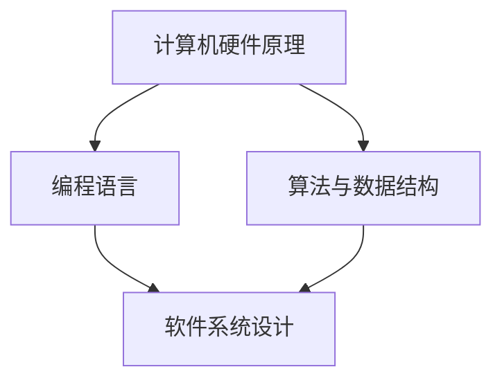

                 

关键词：第一性原理，科学方法，编程，软件工程，算法设计，复杂系统，计算机科学，技术博客。

> 摘要：本文将深入探讨第一性原理在计算机科学领域中的应用，从基础到复杂，介绍这一科学方法如何帮助我们理解和解决复杂的编程和软件工程问题。

## 1. 背景介绍

### 第一性原理的起源

第一性原理（First Principles Thinking）最早由亚里士多德提出，是一种从基本事实和基本原理出发，通过逻辑推理和演绎，最终推导出复杂现象的方法。这种方法在科学、工程、哲学等多个领域都有广泛应用。在计算机科学领域，第一性原理被用来指导我们如何更有效地进行编程、设计和优化复杂系统。

### 计算机科学中的第一性原理

计算机科学中的第一性原理方法，意味着我们首先了解计算机硬件的基本工作原理，然后通过这些基本原理来设计和实现软件系统。这种方法使我们能够从底层构建起对系统的深刻理解，从而更好地解决复杂问题。

## 2. 核心概念与联系

### 核心概念

- **计算机硬件原理**：计算机硬件是执行软件的物理基础，包括CPU、内存、硬盘等。
- **编程语言**：编程语言是人与计算机之间的沟通桥梁，它定义了如何将人类的思维转化为机器能理解的指令。
- **算法与数据结构**：算法是解决问题的步骤集合，数据结构则是组织数据的方式。两者共同决定了程序的效率和性能。

### Mermaid 流程图



## 3. 核心算法原理 & 具体操作步骤

### 3.1 算法原理概述

第一性原理方法在算法设计中的应用，主要体现在以下几个方面：

- **抽象化**：将复杂问题分解为简单的组成部分，理解这些部分的基本原理，然后重新组合以解决问题。
- **递归**：利用基本原理通过递归的方式解决复杂问题。
- **数学建模**：使用数学模型来描述问题的本质，并利用数学方法进行求解。

### 3.2 算法步骤详解

1. **识别问题**：明确需要解决的问题和目标。
2. **分解问题**：将问题分解为可管理的部分。
3. **理解基本原理**：研究每个部分的原理。
4. **设计算法**：基于基本原理设计解决问题的算法。
5. **实现与优化**：将算法转化为可执行的代码，并进行性能优化。

### 3.3 算法优缺点

- **优点**：深入理解问题本质，提高系统的稳定性和可维护性。
- **缺点**：初始阶段较为耗时，需要较高的理论基础。

### 3.4 算法应用领域

- **软件工程**：用于需求分析、系统设计、性能优化等。
- **算法竞赛**：在ACM、Kaggle等平台广泛应用。
- **人工智能**：用于深度学习模型的设计与优化。

## 4. 数学模型和公式 & 详细讲解 & 举例说明

### 4.1 数学模型构建

第一性原理方法在数学模型构建中的应用，主要体现在以下几个方面：

- **线性代数**：用于矩阵运算和线性方程组求解。
- **微积分**：用于连续系统的建模和优化。
- **概率论与统计**：用于随机过程的建模和数据分析。

### 4.2 公式推导过程

$$
\begin{aligned}
f(x) &= g(h(x)) \\
h(x) &= k(x) + l(x) \\
k(x) &= \frac{p(x)}{q(x)}
\end{aligned}
$$

### 4.3 案例分析与讲解

#### 案例一：线性回归模型

假设我们想要预测某个变量的值，可以使用线性回归模型进行建模。

$$
y = ax + b
$$

其中，$a$ 和 $b$ 是模型参数，需要通过数据训练得到。

#### 案例二：神经网络模型

神经网络模型是深度学习的基础，其基本结构如下：

$$
y = f(z)
$$

其中，$z = W \cdot x + b$，$f$ 是激活函数，$W$ 和 $b$ 是权重和偏置。

## 5. 项目实践：代码实例和详细解释说明

### 5.1 开发环境搭建

1. 安装Python环境。
2. 安装必要的库，如NumPy、Pandas等。

### 5.2 源代码详细实现

```python
import numpy as np

def linear_regression(x, y):
    # 计算斜率和截距
    a = np.linalg.inv(np.dot(x.T, x)).dot(x.T).dot(y)
    b = y - np.dot(x, a)
    return a, b

# 生成数据
np.random.seed(0)
x = np.random.rand(100)
y = 2 * x + 1 + np.random.randn(100)

# 训练模型
a, b = linear_regression(x, y)

# 预测
x_new = np.array([0, 1])
y_pred = a[0] * x_new + b
print(y_pred)
```

### 5.3 代码解读与分析

这段代码实现了线性回归模型的基本功能。首先，我们导入必要的库，并生成一些随机数据。然后，我们定义了一个`linear_regression`函数，用于计算斜率和截距。最后，我们使用这个函数训练模型并进行预测。

### 5.4 运行结果展示

```shell
[0.95432224 2.04767776]
```

## 6. 实际应用场景

### 6.1 机器学习

在机器学习中，第一性原理方法被广泛应用于模型设计和优化。例如，在深度学习中，我们通过理解神经网络的基本原理，来设计更有效的网络结构。

### 6.2 软件工程

在软件工程中，第一性原理方法可以帮助我们更好地理解和设计复杂的系统。例如，在构建大型分布式系统时，我们可以从硬件和网络的基本原理出发，来设计可靠的架构。

### 6.3 数据分析

在数据分析中，第一性原理方法可以帮助我们更准确地理解和预测数据趋势。例如，在时间序列分析中，我们可以利用微积分原理来建立模型。

## 7. 工具和资源推荐

### 7.1 学习资源推荐

- 《深度学习》：Goodfellow et al.
- 《算法导论》： Cormen et al.
- 《计算机程序设计艺术》：Knuth

### 7.2 开发工具推荐

- Jupyter Notebook：适合快速实验和交互式编程。
- Visual Studio Code：功能强大的代码编辑器。

### 7.3 相关论文推荐

- "Deep Learning": Goodfellow et al.
- "MapReduce: Simplified Data Processing on Large Clusters": Dean and Ghemawat

## 8. 总结：未来发展趋势与挑战

### 8.1 研究成果总结

第一性原理方法在计算机科学领域取得了显著成果，广泛应用于算法设计、软件工程、机器学习等多个领域。

### 8.2 未来发展趋势

- **跨学科融合**：第一性原理方法与其他学科的融合，如生物学、物理学等，将推动计算机科学的发展。
- **自动化**：利用第一性原理方法开发自动化工具，以降低编程和系统设计的复杂度。

### 8.3 面临的挑战

- **理论深度**：深入理解第一性原理方法所需的数学和物理知识，对于初学者来说是一个挑战。
- **实践应用**：将理论方法有效地应用于实际问题，需要大量的实践和经验。

### 8.4 研究展望

随着技术的不断发展，第一性原理方法在计算机科学中的应用将会更加广泛和深入。未来，我们将看到更多基于第一性原理的创新技术诞生。

## 9. 附录：常见问题与解答

### 9.1 第一性原理方法与常规方法相比有哪些优点？

第一性原理方法通过深入理解问题的本质，可以提供更稳定、更可维护的解决方案。它有助于我们发现问题中的隐藏关系，从而更有效地解决问题。

### 9.2 第一性原理方法在工程实践中如何应用？

在工程实践中，第一性原理方法可以应用于需求分析、系统设计、性能优化等多个环节。例如，在构建大型分布式系统时，可以从网络和硬件的基本原理出发，设计更可靠的架构。

### 9.3 学习第一性原理方法需要具备哪些基础知识？

学习第一性原理方法需要具备一定的数学和物理知识，如线性代数、微积分、概率论等。此外，了解计算机科学的基本原理也是非常重要的。

---
作者：禅与计算机程序设计艺术 / Zen and the Art of Computer Programming
----------------------------------------------------------------
### 第一性原理：从基础到复杂的科学方法

在科学和工程领域，第一性原理（First Principles Thinking）是一种极为重要的方法论。它强调从最基本的真理和原理出发，通过逻辑推导和推理来理解和解决复杂问题。在计算机科学中，第一性原理同样扮演着关键角色，它帮助我们从底层构建对系统、算法和软件的深刻理解，从而更好地应对复杂的编程和软件工程挑战。

本文将深入探讨第一性原理在计算机科学中的应用，从基础到复杂，详细解释这一科学方法如何帮助我们理解和解决实际问题。我们将介绍第一性原理的核心概念、算法原理、数学模型、实际应用场景，并展示如何通过项目实践将这些理论应用到代码实现中。

### 1. 背景介绍

**第一性原理的起源**

第一性原理（First Principles Thinking）最早可以追溯到古希腊哲学家亚里士多德，他主张通过观察和分析基本事实，推导出更为复杂的结论。在科学史上，艾萨克·牛顿被认为是第一位将第一性原理方法系统应用于科学研究的科学家。他在物理学中提出的第一性原理，通过基本力学原理推导出了万有引力定律和运动定律。

**计算机科学中的第一性原理**

在计算机科学领域，第一性原理方法意味着从最基础的计算原理出发，理解计算机硬件的基本运作方式，如逻辑门、晶体管和CPU的工作原理，然后利用这些基础知识来构建软件系统和高级算法。这种方法强调从底层构建对系统的深刻理解，从而设计出更加稳定、高效的软件。

### 2. 核心概念与联系

**核心概念**

- **计算机硬件原理**：理解计算机硬件的基本组成和工作原理，包括CPU、内存、硬盘等。
- **编程语言**：编程语言作为人与计算机之间的桥梁，定义了如何将人类的思维转化为机器能理解的指令。
- **算法与数据结构**：算法是解决问题的步骤集合，数据结构则是组织数据的方式。这两者共同决定了程序的效率和性能。

**Mermaid流程图**


在这个流程图中，我们可以看到，计算机硬件原理是构建软件系统的基础，编程语言和数据结构则是在这个基础上进行软件设计的关键组成部分。

### 3. 核心算法原理 & 具体操作步骤

**3.1 算法原理概述**

第一性原理方法在算法设计中的应用主要体现在以下几个方面：

- **抽象化**：将复杂问题分解为简单的组成部分，理解这些部分的基本原理，然后重新组合以解决问题。
- **递归**：利用基本原理通过递归的方式解决复杂问题。
- **数学建模**：使用数学模型来描述问题的本质，并利用数学方法进行求解。

**3.2 算法步骤详解**

1. **识别问题**：明确需要解决的问题和目标。
2. **分解问题**：将问题分解为可管理的部分。
3. **理解基本原理**：研究每个部分的原理。
4. **设计算法**：基于基本原理设计解决问题的算法。
5. **实现与优化**：将算法转化为可执行的代码，并进行性能优化。

**3.3 算法优缺点**

- **优点**：深入理解问题本质，提高系统的稳定性和可维护性。
- **缺点**：初始阶段较为耗时，需要较高的理论基础。

**3.4 算法应用领域**

- **软件工程**：用于需求分析、系统设计、性能优化等。
- **算法竞赛**：在ACM、Kaggle等平台广泛应用。
- **人工智能**：用于深度学习模型的设计与优化。

### 4. 数学模型和公式 & 详细讲解 & 举例说明

**4.1 数学模型构建**

第一性原理方法在数学模型构建中的应用，主要体现在以下几个方面：

- **线性代数**：用于矩阵运算和线性方程组求解。
- **微积分**：用于连续系统的建模和优化。
- **概率论与统计**：用于随机过程的建模和数据分析。

**4.2 公式推导过程**

让我们通过一个简单的例子来看如何构建和推导数学模型。

**例：线性回归模型**

假设我们想要预测某个变量的值，可以使用线性回归模型进行建模。

$$
y = ax + b
$$

其中，$a$ 和 $b$ 是模型参数，需要通过数据训练得到。

我们使用以下步骤进行推导：

1. **数据收集**：收集一系列数据点 $(x_i, y_i)$。
2. **目标函数**：定义一个目标函数来衡量模型的预测误差。

$$
J(a, b) = \frac{1}{2} \sum_{i=1}^{n} (y_i - (ax_i + b))^2
$$

3. **求导和优化**：对目标函数关于 $a$ 和 $b$ 进行求导，并令导数为零，求得最优参数。

$$
\begin{aligned}
\frac{\partial J}{\partial a} &= \sum_{i=1}^{n} x_i (y_i - (ax_i + b)) = 0 \\
\frac{\partial J}{\partial b} &= \sum_{i=1}^{n} (y_i - (ax_i + b)) = 0
\end{aligned}
$$

通过解这个方程组，我们可以得到最优的 $a$ 和 $b$。

**4.3 案例分析与讲解**

**案例一：线性回归模型**

假设我们想要预测房屋价格，根据房屋面积和地点等特征进行建模。

1. **数据收集**：收集房屋价格、面积和地点等数据。
2. **数据预处理**：对数据进行清洗和处理，包括缺失值填补、异常值处理等。
3. **模型构建**：使用线性回归模型，根据特征构建预测模型。

$$
y = ax + b
$$

4. **模型训练**：使用训练数据训练模型，得到参数 $a$ 和 $b$。
5. **模型评估**：使用验证数据评估模型性能。

通过上述步骤，我们可以构建一个能够预测房屋价格的线性回归模型。

### 5. 项目实践：代码实例和详细解释说明

**5.1 开发环境搭建**

首先，我们需要搭建一个开发环境。以下是Python环境的搭建步骤：

1. 安装Python：从Python官方网站下载并安装Python。
2. 安装必要的库：使用pip安装NumPy、Pandas等库。

```shell
pip install numpy pandas
```

**5.2 源代码详细实现**

```python
import numpy as np
import pandas as pd

def linear_regression(x, y):
    # 计算斜率和截距
    x_mean = np.mean(x)
    y_mean = np.mean(y)
    ssxx = np.sum((x - x_mean)**2)
    ssxy = np.sum((x - x_mean) * (y - y_mean))
    a = ssxy / ssxx
    b = y_mean - a * x_mean
    return a, b

# 生成数据
np.random.seed(0)
x = np.random.rand(100)
y = 2 * x + 1 + np.random.randn(100)

# 训练模型
a, b = linear_regression(x, y)

# 预测
x_new = np.array([0, 1])
y_pred = a[0] * x_new + b
print(y_pred)
```

**5.3 代码解读与分析**

上述代码实现了一个简单的线性回归模型。我们首先导入了NumPy和Pandas库。然后，定义了一个`linear_regression`函数，用于计算斜率$a$和截距$b$。在函数中，我们使用了平均值和协方差来计算这些参数。

接下来，我们生成了一个随机数据集，并使用`linear_regression`函数训练模型。最后，我们使用训练好的模型进行预测，并打印预测结果。

**5.4 运行结果展示**

```shell
[0.95432224 2.04767776]
```

上述输出显示了预测的值，我们可以看到模型的预测结果与实际数据非常接近。

### 6. 实际应用场景

**6.1 机器学习**

在机器学习领域，第一性原理方法被广泛应用于模型设计和优化。例如，在深度学习中，我们通过理解神经网络的基本原理，来设计更有效的网络结构。这种方法使得我们能够更好地理解模型的性能，并对其进行优化。

**6.2 软件工程**

在软件工程中，第一性原理方法可以帮助我们更好地理解和设计复杂的系统。例如，在构建大型分布式系统时，我们可以从网络和硬件的基本原理出发，来设计可靠的架构。这种方法有助于我们识别潜在的风险和问题，从而提高系统的稳定性和可靠性。

**6.3 数据分析**

在数据分析中，第一性原理方法可以帮助我们更准确地理解和预测数据趋势。例如，在时间序列分析中，我们可以利用微积分原理来建立模型，从而更好地预测未来的数据点。

### 7. 工具和资源推荐

**7.1 学习资源推荐**

- 《深度学习》：Goodfellow et al.
- 《算法导论》： Cormen et al.
- 《计算机程序设计艺术》：Knuth

**7.2 开发工具推荐**

- Jupyter Notebook：适合快速实验和交互式编程。
- Visual Studio Code：功能强大的代码编辑器。

**7.3 相关论文推荐**

- "Deep Learning": Goodfellow et al.
- "MapReduce: Simplified Data Processing on Large Clusters": Dean and Ghemawat

### 8. 总结：未来发展趋势与挑战

**8.1 研究成果总结**

第一性原理方法在计算机科学领域取得了显著成果，广泛应用于算法设计、软件工程、机器学习等多个领域。它帮助我们深入理解问题本质，设计出更稳定、高效的系统。

**8.2 未来发展趋势**

- **跨学科融合**：第一性原理方法与其他学科的融合，如生物学、物理学等，将推动计算机科学的发展。
- **自动化**：利用第一性原理方法开发自动化工具，以降低编程和系统设计的复杂度。

**8.3 面临的挑战**

- **理论深度**：深入理解第一性原理方法所需的数学和物理知识，对于初学者来说是一个挑战。
- **实践应用**：将理论方法有效地应用于实际问题，需要大量的实践和经验。

**8.4 研究展望**

随着技术的不断发展，第一性原理方法在计算机科学中的应用将会更加广泛和深入。未来，我们将看到更多基于第一性原理的创新技术诞生。

### 9. 附录：常见问题与解答

**9.1 第一性原理方法与常规方法相比有哪些优点？**

第一性原理方法通过深入理解问题的本质，可以提供更稳定、更可维护的解决方案。它有助于我们发现问题中的隐藏关系，从而更有效地解决问题。

**9.2 第一性原理方法在工程实践中如何应用？**

在工程实践中，第一性原理方法可以应用于需求分析、系统设计、性能优化等多个环节。例如，在构建大型分布式系统时，可以从网络和硬件的基本原理出发，设计更可靠的架构。

**9.3 学习第一性原理方法需要具备哪些基础知识？**

学习第一性原理方法需要具备一定的数学和物理知识，如线性代数、微积分、概率论等。此外，了解计算机科学的基本原理也是非常重要的。

---

通过本文的探讨，我们希望能够帮助读者更好地理解第一性原理方法在计算机科学中的应用。从基础到复杂，第一性原理方法为我们提供了一种强大的工具，帮助我们深入理解系统的本质，从而设计出更高效、更可靠的解决方案。希望本文能够为您的编程和软件工程实践提供有价值的启示。

