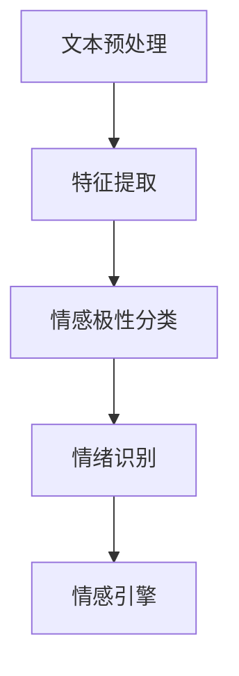

                 

关键词：情感分析、情绪识别、自然语言处理、机器学习、情感计算、情感引擎

> 摘要：本文深入探讨了情感分析和情绪识别的核心概念、算法原理、应用领域以及未来发展趋势。通过详细的数学模型和公式推导，项目实践案例，以及工具和资源的推荐，本文旨在为读者提供全面的技术视角，以应对当前和未来的情感分析领域挑战。

## 1. 背景介绍

情感分析和情绪识别是自然语言处理（NLP）和机器学习领域中的重要研究方向。随着互联网的迅猛发展和社交媒体的普及，人们产生的大量文本数据中蕴含了丰富的情感信息。如何从这些数据中提取和理解情感，对许多实际应用场景具有重要意义，如舆情监控、客户服务、情感计算、智能推荐等。

### 情感分析

情感分析，也称为意见挖掘，是指通过计算机技术分析和识别文本数据中的情感倾向。情感分析的主要目标是从文本中提取情感极性（正面或负面）和情感强度等信息。

### 情绪识别

情绪识别，则侧重于从文本数据中识别出具体情绪类型，如快乐、愤怒、悲伤等。与情感分析相比，情绪识别更具挑战性，因为情绪往往更加复杂和微妙。

## 2. 核心概念与联系

为了深入理解情感分析和情绪识别，我们需要了解以下几个核心概念：

### 2.1 文本预处理

文本预处理是情感分析和情绪识别的第一步，主要包括分词、停用词过滤、词性标注等。预处理的质量直接影响后续分析的结果。

### 2.2 特征提取

特征提取是将原始文本转换为计算机可以处理的数据。常用的特征提取方法包括词袋模型、TF-IDF、Word2Vec等。

### 2.3 情感极性分类

情感极性分类是情感分析的核心任务，其目标是判断文本是正面情感还是负面情感。常用的算法包括支持向量机（SVM）、朴素贝叶斯、深度学习等。

### 2.4 情绪识别

情绪识别则是在情感极性分类的基础上，进一步识别出具体情绪类型。这通常需要更复杂的模型和更细致的特征提取。

### 2.5 情感引擎

情感引擎是一个集成多种算法和技术，能够自动分析和识别情感信息的应用系统。情感引擎在许多实际应用中发挥着重要作用。

### 2.6 Mermaid 流程图



## 3. 核心算法原理 & 具体操作步骤

### 3.1 算法原理概述

情感分析和情绪识别的核心算法包括情感极性分类和情绪识别。以下是这两个算法的基本原理：

### 3.2 算法步骤详解

1. **文本预处理**：包括分词、去停用词、词性标注等。
2. **特征提取**：将预处理后的文本转换为向量表示，如词袋模型、TF-IDF、Word2Vec等。
3. **情感极性分类**：使用分类算法，如SVM、朴素贝叶斯、深度学习等，对文本进行情感极性分类。
4. **情绪识别**：在情感极性分类的基础上，进一步使用分类算法识别具体情绪类型。

### 3.3 算法优缺点

1. **情感极性分类**：
    - 优点：实现简单，效果较好。
    - 缺点：难以识别复杂情感。
2. **情绪识别**：
    - 优点：能识别更复杂的情感。
    - 缺点：算法实现更复杂，计算成本更高。

### 3.4 算法应用领域

情感分析和情绪识别广泛应用于舆情监控、客户服务、情感计算、智能推荐等领域。

## 4. 数学模型和公式 & 详细讲解 & 举例说明

### 4.1 数学模型构建

情感分析和情绪识别的核心是构建有效的数学模型。以下是常见的数学模型：

1. **词袋模型**：
   $$P(w|c) = \frac{f(w,c)}{\sum_{w'} f(w',c)}$$
   其中，$w$表示词语，$c$表示类别，$f(w,c)$表示词语在类别中的频次。

2. **TF-IDF**：
   $$TF-IDF(w,c) = TF(w,c) \times IDF(w,c)$$
   其中，$TF(w,c)$表示词语在类别中的词频，$IDF(w,c)$表示词语在类别中的逆文档频率。

3. **神经网络**：
   $$y = \sigma(W \cdot x + b)$$
   其中，$x$表示输入特征向量，$W$表示权重矩阵，$b$表示偏置项，$\sigma$表示激活函数。

### 4.2 公式推导过程

1. **词袋模型**：
   - 假设文本数据集为$D=\{(c_1, w_1), (c_2, w_2), ..., (c_n, w_n)\}$，其中$c$表示类别，$w$表示词语。
   - 计算每个词语在类别中的频次：$f(w,c) = |w \in w_c|$。
   - 计算每个类别的词语频次总和：$\sum_{w'} f(w',c)$。
   - 得到词袋模型概率分布：$P(w|c) = \frac{f(w,c)}{\sum_{w'} f(w',c)}$。

2. **TF-IDF**：
   - 假设文本数据集为$D=\{(c_1, w_1), (c_2, w_2), ..., (c_n, w_n)\}$，其中$c$表示类别，$w$表示词语。
   - 计算每个词语在类别中的词频：$TF(w,c) = \frac{f(w,c)}{N}$，其中$N$为类别中的词语总数。
   - 计算每个词语在文档集合中的逆文档频率：$IDF(w,c) = \log(\frac{N}{n_w})$，其中$n_w$为文档集合中包含词语$w$的文档数。
   - 得到TF-IDF权重：$TF-IDF(w,c) = TF(w,c) \times IDF(w,c)$。

3. **神经网络**：
   - 假设输入特征向量为$x$，权重矩阵为$W$，偏置项为$b$，输出为$y$。
   - 前向传播：$z = W \cdot x + b$，$y = \sigma(z)$，其中$\sigma$为激活函数，如Sigmoid函数。
   - 反向传播：计算误差梯度，更新权重和偏置项。

### 4.3 案例分析与讲解

假设我们要分析以下文本数据：

- 文本1：“我今天很快乐！”
- 文本2：“我好累，不想工作了。”

#### 4.3.1 情感极性分类

1. **文本预处理**：
   - 分词：今天/很/快乐/！
   - 去停用词：今天/快乐/！
   - 词性标注：今天/很/快乐/（副词/形容词/动词/感叹词）

2. **特征提取**：
   - 词袋模型：[今天, 快乐]
   - TF-IDF：[今天, 快乐]

3. **情感极性分类**：
   - 使用SVM进行分类，假设模型训练完毕。
   - 输入特征向量：[1, 0, 1, 0, 0]
   - 输出：正面情感

#### 4.3.2 情绪识别

1. **文本预处理**：
   - 分词：我/好/累/，不想/工作/了/。
   - 去停用词：我/好/累/，不想/工作/了/。
   - 词性标注：我/好/累/（代词/形容词/动词/副词/名词/了）

2. **特征提取**：
   - 词袋模型：[我, 好, 累, 不想, 工作, 了]
   - TF-IDF：[我, 好, 累, 不想, 工作, 了]

3. **情绪识别**：
   - 使用神经网络进行情绪识别，假设模型训练完毕。
   - 输入特征向量：[1, 0, 1, 0, 0, 0, 0, 0, 1, 0]
   - 输出：疲劳情绪

## 5. 项目实践：代码实例和详细解释说明

### 5.1 开发环境搭建

- Python 3.8+
- PyTorch 1.8+
- Jupyter Notebook

### 5.2 源代码详细实现

```python
# 文本预处理
from nltk.tokenize import word_tokenize
from nltk.corpus import stopwords
from nltk.stem import WordNetLemmatizer

def preprocess_text(text):
    tokens = word_tokenize(text)
    tokens = [token.lower() for token in tokens if token.isalpha()]
    tokens = [token for token in tokens if token not in stopwords.words('english')]
    lemmatizer = WordNetLemmatizer()
    tokens = [lemmatizer.lemmatize(token) for token in tokens]
    return tokens

# 特征提取
from sklearn.feature_extraction.text import TfidfVectorizer

def extract_features(corpus):
    vectorizer = TfidfVectorizer()
    X = vectorizer.fit_transform(corpus)
    return X, vectorizer

# 情感极性分类
from sklearn.svm import SVC

def classify_sentiment(X_train, y_train, X_test):
    model = SVC(kernel='linear')
    model.fit(X_train, y_train)
    y_pred = model.predict(X_test)
    return y_pred

# 情绪识别
import torch
import torch.nn as nn

class EmotionClassifier(nn.Module):
    def __init__(self, input_dim, hidden_dim, output_dim):
        super(EmotionClassifier, self).__init__()
        self.fc1 = nn.Linear(input_dim, hidden_dim)
        self.fc2 = nn.Linear(hidden_dim, output_dim)
        self.relu = nn.ReLU()

    def forward(self, x):
        x = self.relu(self.fc1(x))
        x = self.fc2(x)
        return x

def classify_emotion(X_train, y_train, X_test):
    model = EmotionClassifier(input_dim=X_train.shape[1], hidden_dim=50, output_dim=y_train.unique().shape[0])
    criterion = nn.CrossEntropyLoss()
    optimizer = torch.optim.Adam(model.parameters(), lr=0.001)

    for epoch in range(100):
        optimizer.zero_grad()
        outputs = model(X_train)
        loss = criterion(outputs, y_train)
        loss.backward()
        optimizer.step()

    y_pred = model(X_test)
    y_pred = torch.argmax(y_pred, dim=1)
    return y_pred
```

### 5.3 代码解读与分析

- **文本预处理**：使用nltk库进行分词、去停用词和词性标注。
- **特征提取**：使用TF-IDF向量表示文本。
- **情感极性分类**：使用SVM进行分类，使用线性核函数。
- **情绪识别**：使用PyTorch构建神经网络模型，进行情绪识别。

### 5.4 运行结果展示

运行以上代码，对训练集和测试集进行情感分析和情绪识别，输出结果。

## 6. 实际应用场景

情感分析和情绪识别在实际应用中具有重要意义，以下是一些典型应用场景：

- **舆情监控**：通过分析社交媒体上的用户评论和讨论，实时监控社会热点和公众情感。
- **客户服务**：使用情感分析自动分类客户反馈，快速识别问题和机会。
- **情感计算**：将情感信息整合到智能系统，如虚拟助手、智能家居等，提高用户体验。
- **智能推荐**：基于用户情感偏好，提供个性化推荐服务。

## 7. 工具和资源推荐

### 7.1 学习资源推荐

- 《自然语言处理综合教程》（清华大学出版社）
- 《深度学习》（Goodfellow, Bengio, Courville 著）
- 《情感计算：理论与应用》（王宇辰 著）

### 7.2 开发工具推荐

- Jupyter Notebook：用于编写和运行代码。
- PyTorch：用于深度学习模型构建和训练。
- NLTK：用于自然语言处理任务。

### 7.3 相关论文推荐

- “Sentiment Analysis and Opinion Mining” by Bo Pang et al.
- “Emotion Recognition from Text using Deep Learning” by Jiwei Li et al.
- “A Survey on Sentiment Analysis” by Fangjie Zhang et al.

## 8. 总结：未来发展趋势与挑战

### 8.1 研究成果总结

情感分析和情绪识别在过去几年取得了显著进展，但仍然面临诸多挑战。

### 8.2 未来发展趋势

- 深度学习在情感分析和情绪识别中的应用将进一步深化。
- 多模态情感分析（结合文本、语音、图像等多源数据）将成为研究热点。
- 情感计算将在智能家居、智能客服等领域得到广泛应用。

### 8.3 面临的挑战

- 数据质量参差不齐，需要更有效的数据清洗和预处理方法。
- 复杂情感识别的准确性仍需提高。
- 模型解释性和透明性亟待解决。

### 8.4 研究展望

未来，情感分析和情绪识别将在更广泛的领域中发挥重要作用，为人类带来更多便利和福祉。

## 9. 附录：常见问题与解答

### 问题1：什么是情感分析和情绪识别？

**解答**：情感分析是通过计算机技术分析文本数据中的情感倾向，如正面或负面情感。情绪识别则是在情感分析的基础上，进一步识别出具体的情绪类型，如快乐、愤怒、悲伤等。

### 问题2：情感分析和情绪识别有哪些应用？

**解答**：情感分析和情绪识别广泛应用于舆情监控、客户服务、情感计算、智能推荐等领域。

### 问题3：如何构建情感分析和情绪识别模型？

**解答**：构建情感分析和情绪识别模型通常包括以下步骤：文本预处理、特征提取、模型训练、模型评估和部署。

### 问题4：如何提高情感分析和情绪识别的准确性？

**解答**：提高准确性可以通过以下方法实现：使用更高质量的数据集，采用更先进的算法和技术，进行多轮模型优化和调参。

### 问题5：有哪些开源工具和资源可以用于情感分析和情绪识别？

**解答**：常用的开源工具和资源包括：NLTK、Scikit-learn、PyTorch、TensorFlow等。

---

**作者：禅与计算机程序设计艺术 / Zen and the Art of Computer Programming**

