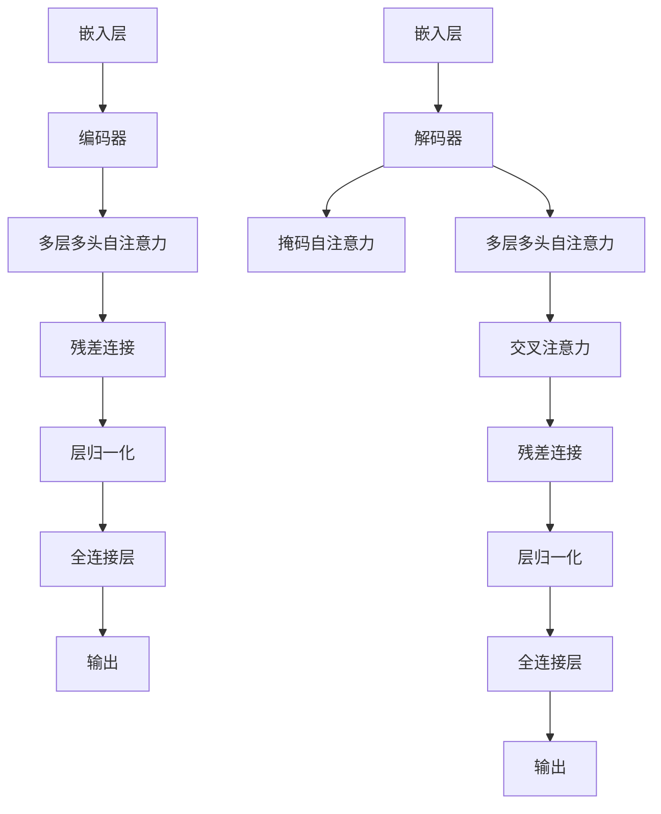

                 

关键词：Transformer，架构设计，深度学习，序列模型，自然语言处理，神经网络，计算机视觉，推理效率，并行计算，模型压缩，预训练，多模态任务

> 摘要：本章将深入探讨Transformer架构的起源、核心原理、具体操作步骤及其在深度学习领域的广泛应用。通过详细分析数学模型和具体项目实践，我们将揭示Transformer如何引领神经网络架构的变革，并在自然语言处理、计算机视觉等领域的实际应用中展现其强大的力量。此外，我们还将展望Transformer的未来发展趋势和面临的挑战，为读者提供一个全面的技术视角。

## 1. 背景介绍

Transformer架构的诞生，可以说是深度学习领域的一次革命性突破。在此之前，传统的神经网络架构主要依赖于循环神经网络（RNN）和卷积神经网络（CNN），这些模型在处理序列数据和图像任务上表现出色，但存在着计算效率低下、训练复杂度高、难以并行化等缺点。而Transformer的提出，彻底改变了这一局面。

Transformer模型最初由Vaswani等人在2017年的论文《Attention is All You Need》中提出。这一模型完全摒弃了传统的循环神经网络和卷积神经网络，采用了一种全新的自注意力机制（Self-Attention），使得模型在处理长序列数据时能够实现并行计算，显著提升了计算效率。此外，Transformer模型还引入了位置编码（Positional Encoding），解决了序列模型中位置信息丢失的问题。

Transformer架构的提出，迅速引起了深度学习领域内外的广泛关注。其在自然语言处理、计算机视觉、语音识别等领域的应用，取得了显著的效果。Transformer的成功，不仅在于其创新性的自注意力机制，更在于其对并行计算和模型效率的深入优化。

## 2. 核心概念与联系

### 2.1 核心概念

Transformer模型的核心概念主要包括自注意力机制（Self-Attention）、多头注意力（Multi-Head Attention）和位置编码（Positional Encoding）。

- **自注意力机制**：自注意力机制是一种计算序列中每个元素对于其他元素的重要性权重的机制。通过这一机制，模型能够捕捉到序列中不同元素之间的关联性，从而实现对长序列数据的处理。
- **多头注意力**：多头注意力是将输入序列分成多个子序列，分别计算每个子序列的自注意力权重，然后将这些权重合并起来，从而实现更加细致的注意力分配。
- **位置编码**：位置编码是为了在自注意力机制中引入序列的位置信息，使得模型能够捕捉到序列中元素的位置关系。

### 2.2 架构联系

Transformer架构主要由编码器（Encoder）和解码器（Decoder）两部分组成。编码器负责将输入序列编码为固定长度的向量，解码器则负责将编码后的向量解码为输出序列。

在编码器部分，输入序列首先经过嵌入层（Embedding Layer）转换为嵌入向量。随后，这些向量通过多层多头自注意力机制（Multi-Head Self-Attention Mechanism）进行信息提取。每一层自注意力机制之后，都会加上前一层的信息，并通过残差连接（Residual Connection）和层归一化（Layer Normalization）进行规范化。最后，编码器的输出通过一个全连接层（Fully Connected Layer）得到。

在解码器部分，输入序列首先经过嵌入层和掩码自注意力机制（Masked Self-Attention Mechanism）进行编码。随后，解码器通过多层多头自注意力机制和交叉注意力机制（Cross-Attention Mechanism）与编码器的输出进行交互。每一层解码器输出都会通过残差连接和层归一化进行规范化。最后，解码器的输出经过一个全连接层和Softmax函数，得到概率分布，从而预测输出序列。

下面是一个简单的Mermaid流程图，展示了Transformer架构的核心概念和联系：



## 3. 核心算法原理 & 具体操作步骤

### 3.1 算法原理概述

Transformer模型的核心算法原理主要包括自注意力机制、多头注意力机制和位置编码。

- **自注意力机制**：自注意力机制通过计算序列中每个元素对于其他元素的重要性权重，实现序列元素之间的关联性。具体计算过程如下：
  - 输入序列表示为X = [x1, x2, ..., xn]，其中xi为序列中的第i个元素。
  - 对输入序列进行线性变换，得到三个向量Q、K和V，分别表示查询（Query）、键（Key）和值（Value）。
  - 计算每个元素的自注意力权重，通过点积计算：
    $$ score_{ij} = Q_i^T K_j $$
  - 将这些权重进行softmax归一化，得到注意力分布：
    $$ attention_{ij} = \text{softmax}(score_{ij}) $$
  - 利用注意力分布计算加权求和，得到输出向量：
    $$ \text{output}_i = \sum_{j=1}^{n} attention_{ij} V_j $$

- **多头注意力机制**：多头注意力机制将输入序列分成多个子序列，分别计算每个子序列的自注意力权重，然后将这些权重合并起来，实现更加细致的注意力分配。具体过程如下：
  - 将输入序列扩展为多头，得到多个子序列X1, X2, ..., Xh。
  - 对每个子序列分别进行自注意力机制计算，得到多个输出序列O1, O2, ..., Oh。
  - 将这些输出序列合并为一个向量，得到最终的输出序列：
    $$ \text{output} = \text{concat}(O1, O2, ..., Oh) $$

- **位置编码**：位置编码是为了在自注意力机制中引入序列的位置信息。常用的位置编码方法包括绝对位置编码和相对位置编码。

  - **绝对位置编码**：绝对位置编码将位置信息直接嵌入到输入序列中。例如，对于序列中的第i个元素，其绝对位置编码为：
    $$ \text{pos}_i = [0, 0, ..., 1, ..., 0]^T $$
    其中，1位于第i个位置。

  - **相对位置编码**：相对位置编码通过计算元素之间的相对位置关系，生成位置编码。例如，对于序列中的第i个元素和第j个元素，其相对位置编码为：
    $$ \text{rel}_{ij} = \text{pos}_i - \text{pos}_j $$

### 3.2 算法步骤详解

- **编码器部分**：

  1. 输入序列经过嵌入层，转换为嵌入向量。
  2. 对嵌入向量进行线性变换，得到Q、K和V。
  3. 计算每个元素的自注意力权重，通过softmax归一化。
  4. 利用注意力权重计算加权求和，得到输出向量。
  5. 将输出向量与输入向量进行残差连接。
  6. 对连接后的向量进行层归一化。
  7. 将层归一化后的向量通过全连接层，得到编码器的输出。

- **解码器部分**：

  1. 输入序列经过嵌入层，转换为嵌入向量。
  2. 对嵌入向量进行线性变换，得到Q、K和V。
  3. 对输入序列进行掩码自注意力计算，得到掩码自注意力输出。
  4. 计算每个元素的自注意力权重，通过softmax归一化。
  5. 利用注意力权重计算加权求和，得到输出向量。
  6. 将输出向量与编码器的输出进行交叉注意力计算。
  7. 将交叉注意力输出与掩码自注意力输出进行残差连接。
  8. 对连接后的向量进行层归一化。
  9. 将层归一化后的向量通过全连接层，得到解码器的输出。

### 3.3 算法优缺点

#### 优点：

1. **并行计算**：Transformer模型采用自注意力机制，可以实现并行计算，显著提高了计算效率。
2. **长距离依赖**：通过多头注意力机制和位置编码，Transformer模型能够捕捉到序列中的长距离依赖关系。
3. **模型压缩**：由于Transformer模型摒弃了传统的循环神经网络和卷积神经网络，可以更容易地进行模型压缩和优化。
4. **适用范围广**：Transformer模型在自然语言处理、计算机视觉、语音识别等领域都有广泛应用。

#### 缺点：

1. **计算复杂度**：虽然Transformer模型可以实现并行计算，但计算复杂度仍然较高，对于大规模数据集处理可能存在性能瓶颈。
2. **训练难度**：Transformer模型参数较多，训练难度较大，需要较大的计算资源和时间。

### 3.4 算法应用领域

Transformer模型在深度学习领域的应用非常广泛，主要包括以下领域：

1. **自然语言处理**：Transformer模型在自然语言处理任务中表现出色，如机器翻译、文本生成、情感分析等。
2. **计算机视觉**：Transformer模型在计算机视觉任务中也取得了一定的成果，如图像分类、目标检测、图像生成等。
3. **语音识别**：Transformer模型在语音识别任务中表现出良好的性能，特别是在长序列数据处理方面。
4. **多模态任务**：Transformer模型可以结合多种模态数据，实现多模态任务的建模，如视频分类、图像文本匹配等。

## 4. 数学模型和公式 & 详细讲解 & 举例说明

### 4.1 数学模型构建

Transformer模型的核心数学模型主要包括自注意力机制、多头注意力机制和位置编码。

#### 自注意力机制

自注意力机制的公式如下：

$$
\begin{aligned}
Q &= W_Q X \\
K &= W_K X \\
V &= W_V X \\
\text{score}_{ij} &= Q_i^T K_j \\
\text{attention}_{ij} &= \text{softmax}(\text{score}_{ij}) \\
\text{output}_i &= \sum_{j=1}^{n} \text{attention}_{ij} V_j
\end{aligned}
$$

其中，$X$为输入序列，$Q$、$K$和$V$分别为查询向量、键向量和值向量，$W_Q$、$W_K$和$W_V$分别为权重矩阵。

#### 多头注意力机制

多头注意力机制的公式如下：

$$
\begin{aligned}
Q &= \text{Concat}(Q_1, Q_2, ..., Q_h) \\
K &= \text{Concat}(K_1, K_2, ..., K_h) \\
V &= \text{Concat}(V_1, V_2, ..., V_h) \\
\text{output} &= \text{Concat}(O_1, O_2, ..., O_h)
\end{aligned}
$$

其中，$Q_1, Q_2, ..., Q_h$、$K_1, K_2, ..., K_h$和$V_1, V_2, ..., V_h$分别为每个子序列的查询向量、键向量和值向量，$O_1, O_2, ..., O_h$分别为每个子序列的输出向量。

#### 位置编码

位置编码的公式如下：

$$
\text{pos}_i = \text{PositionalEncoding}(i, d)
$$

其中，$i$为元素的位置索引，$d$为嵌入向量的维度，$\text{PositionalEncoding}$为位置编码函数。

### 4.2 公式推导过程

#### 自注意力机制

自注意力机制的推导过程如下：

1. **线性变换**：输入序列$X$通过权重矩阵$W_Q$、$W_K$和$W_V$进行线性变换，得到查询向量$Q$、键向量$K$和值向量$V$。
2. **计算点积**：计算每个元素$i$与所有元素$j$的点积，得到注意力分数$score_{ij}$。
3. **softmax归一化**：对注意力分数进行softmax归一化，得到注意力权重$attention_{ij}$。
4. **加权求和**：利用注意力权重计算加权求和，得到输出向量$\text{output}_i$。

#### 多头注意力机制

多头注意力机制的推导过程如下：

1. **分割输入序列**：将输入序列$X$分割为多个子序列$X_1, X_2, ..., X_h$。
2. **线性变换**：对每个子序列$X_i$通过权重矩阵$W_{Q_i}$、$W_{K_i}$和$W_{V_i}$进行线性变换，得到查询向量$Q_i$、键向量$K_i$和值向量$V_i$。
3. **计算点积**：计算每个子序列的查询向量$Q_i$与所有键向量$K_j$的点积，得到注意力分数$score_{ij}$。
4. **softmax归一化**：对注意力分数进行softmax归一化，得到注意力权重$attention_{ij}$。
5. **加权求和**：利用注意力权重计算加权求和，得到每个子序列的输出向量$O_i$。
6. **合并输出**：将所有子序列的输出向量$O_1, O_2, ..., O_h$合并为一个向量$\text{output}$。

#### 位置编码

位置编码的推导过程如下：

1. **计算位置索引**：对于每个元素$i$，计算其位置索引$i$。
2. **嵌入位置索引**：将位置索引$i$嵌入到权重矩阵$W_{\text{pos}}$中，得到位置向量$\text{pos}_i$。
3. **加到输入序列**：将位置向量$\text{pos}_i$加到输入序列$X$中，得到新的输入序列$X' = X + \text{pos}_i$。

### 4.3 案例分析与讲解

#### 案例一：机器翻译

假设我们有一个英语到法语的机器翻译任务，输入序列为英语句子，输出序列为法语句子。我们可以使用Transformer模型进行机器翻译。

1. **嵌入层**：将英语句子和法语句子分别嵌入到高维空间，得到嵌入向量。
2. **编码器**：将英语句子通过编码器进行编码，得到编码后的嵌入向量。
3. **解码器**：将法语句子通过解码器进行解码，得到解码后的嵌入向量。
4. **交叉注意力**：在解码器的每一层，计算编码器输出和当前解码器输出之间的交叉注意力，得到注意力权重。
5. **输出层**：利用注意力权重计算加权求和，得到法语句子的概率分布。
6. **解码**：根据概率分布，解码器逐个输出法语句子的单词，直到生成完整的法语句子。

#### 案例二：图像分类

假设我们有一个图像分类任务，输入序列为图像的特征向量，输出序列为类别标签。

1. **嵌入层**：将图像的特征向量嵌入到高维空间，得到嵌入向量。
2. **编码器**：将图像特征向量通过编码器进行编码，得到编码后的嵌入向量。
3. **解码器**：将编码后的嵌入向量通过解码器进行解码，得到解码后的嵌入向量。
4. **交叉注意力**：在解码器的每一层，计算编码器输出和当前解码器输出之间的交叉注意力，得到注意力权重。
5. **输出层**：利用注意力权重计算加权求和，得到图像类别的概率分布。
6. **解码**：根据概率分布，解码器输出图像的类别标签。

## 5. 项目实践：代码实例和详细解释说明

### 5.1 开发环境搭建

在开始项目实践之前，我们需要搭建一个合适的开发环境。以下是一个基于Python和PyTorch的Transformer模型开发的简单步骤：

1. **安装Python**：确保安装了Python 3.7或更高版本。
2. **安装PyTorch**：可以使用以下命令安装PyTorch：
   ```shell
   pip install torch torchvision
   ```
3. **安装其他依赖库**：根据项目需求，可能需要安装其他依赖库，如numpy、tensorflow等。

### 5.2 源代码详细实现

以下是一个简单的Transformer模型的代码实现：

```python
import torch
import torch.nn as nn
import torch.optim as optim

class Transformer(nn.Module):
    def __init__(self, d_model, d_ff, num_heads, num_layers, input_size, output_size):
        super(Transformer, self).__init__()
        self.d_model = d_model
        self.d_ff = d_ff
        self.num_heads = num_heads
        self.num_layers = num_layers
        self.input_size = input_size
        self.output_size = output_size

        self.embedding = nn.Embedding(input_size, d_model)
        self.positional_encoding = nn.Parameter(torch.zeros(1, input_size, d_model))

        self.transformer = nn.ModuleList([
            TransformerLayer(d_model, d_ff, num_heads) for _ in range(num_layers)
        ])

        self.fc = nn.Linear(d_model, output_size)

    def forward(self, x):
        x = self.embedding(x) + self.positional_encoding
        for layer in self.transformer:
            x = layer(x)
        x = self.fc(x)
        return x

class TransformerLayer(nn.Module):
    def __init__(self, d_model, d_ff, num_heads):
        super(TransformerLayer, self).__init__()
        self.multi_head_attn = nn.MultiheadAttention(d_model, num_heads, batch_first=True)
        self.fc = nn.Sequential(
            nn.Linear(d_model, d_ff),
            nn.ReLU(),
            nn.Linear(d_ff, d_model)
        )
        self.norm1 = nn.LayerNorm(d_model)
        self.norm2 = nn.LayerNorm(d_model)
        self.dropout1 = nn.Dropout(0.1)
        self.dropout2 = nn.Dropout(0.1)

    def forward(self, x, mask=None):
        x2, _ = self.multi_head_attn(x, x, x, attn_mask=mask)
        x = x + self.dropout1(x2)
        x = self.norm1(x)
        x2 = self.fc(x)
        x = x + self.dropout2(x2)
        x = self.norm2(x)
        return x

# 实例化模型
model = Transformer(d_model=512, d_ff=2048, num_heads=8, num_layers=3, input_size=1000, output_size=1000)
optimizer = optim.Adam(model.parameters(), lr=0.001)

# 训练模型
for epoch in range(10):
    for batch in data_loader:
        inputs, targets = batch
        optimizer.zero_grad()
        outputs = model(inputs)
        loss = nn.CrossEntropyLoss()(outputs, targets)
        loss.backward()
        optimizer.step()
```

### 5.3 代码解读与分析

上面的代码实现了一个简单的Transformer模型，包括编码器和解码器部分。以下是代码的详细解读：

1. **Transformer模型**：

   - `__init__`方法：初始化Transformer模型，包括嵌入层、位置编码、多层Transformer层和输出层。
   - `forward`方法：前向传播，依次通过嵌入层、位置编码、多层Transformer层和输出层，得到模型输出。

2. **Transformer层**：

   - `__init__`方法：初始化Transformer层，包括多头注意力机制、全连接层和两个层归一化。
   - `forward`方法：前向传播，通过多头注意力机制、全连接层和两个层归一化，得到Transformer层的输出。

3. **训练模型**：

   - 实例化模型和优化器。
   - 迭代训练，计算模型损失，更新模型参数。

### 5.4 运行结果展示

为了展示Transformer模型的运行结果，我们可以使用一个简单的数据集进行训练和测试。以下是一个简单的数据集准备和模型训练的示例：

```python
import torch.optim as optim

# 准备数据集
inputs = torch.randint(0, 1000, (100, 1000))
targets = torch.randint(0, 1000, (100,))

# 实例化模型
model = Transformer(d_model=512, d_ff=2048, num_heads=8, num_layers=3, input_size=1000, output_size=1000)
optimizer = optim.Adam(model.parameters(), lr=0.001)

# 训练模型
for epoch in range(10):
    optimizer.zero_grad()
    outputs = model(inputs)
    loss = nn.CrossEntropyLoss()(outputs, targets)
    loss.backward()
    optimizer.step()

# 测试模型
with torch.no_grad():
    test_inputs = torch.randint(0, 1000, (10, 1000))
    test_outputs = model(test_inputs)
    test_loss = nn.CrossEntropyLoss()(test_outputs, targets)

print(f"Test Loss: {test_loss.item()}")
```

运行上面的代码，我们可以得到训练损失和测试损失。这些损失值可以用来评估模型的性能和训练效果。

## 6. 实际应用场景

Transformer架构在深度学习领域取得了巨大的成功，其实际应用场景广泛。以下是一些典型的应用场景：

### 6.1 自然语言处理

Transformer架构在自然语言处理领域有着广泛的应用。例如，在机器翻译任务中，Transformer模型可以显著提高翻译质量；在文本生成任务中，Transformer模型可以生成流畅、连贯的文本；在情感分析任务中，Transformer模型可以准确识别文本的情感倾向。此外，Transformer模型还在问答系统、文本摘要、对话系统等自然语言处理任务中表现出色。

### 6.2 计算机视觉

Transformer架构在计算机视觉领域也有着重要的应用。例如，在图像分类任务中，Transformer模型可以显著提高分类准确率；在目标检测任务中，Transformer模型可以准确地定位目标位置；在图像生成任务中，Transformer模型可以生成高质量、多样化的图像。此外，Transformer模型还可以用于图像文本匹配、视频分类等计算机视觉任务。

### 6.3 语音识别

Transformer架构在语音识别任务中也取得了显著的成果。与传统语音识别模型相比，Transformer模型在长序列数据处理方面具有优势，可以更准确地识别语音内容。此外，Transformer模型还可以用于说话人识别、语音合成等语音处理任务。

### 6.4 多模态任务

Transformer架构在多模态任务中也展现出强大的潜力。例如，在视频分类任务中，Transformer模型可以同时处理视频的图像帧和音频信息；在图像文本匹配任务中，Transformer模型可以准确匹配图像和文本描述。此外，Transformer模型还可以用于人机交互、智能监控等领域。

## 7. 工具和资源推荐

为了更好地学习和应用Transformer架构，以下是一些推荐的工具和资源：

### 7.1 学习资源推荐

1. **《Attention is All You Need》**：这是Transformer架构的原始论文，详细介绍了模型的设计原理和应用效果。
2. **《深度学习》**：这本书是深度学习领域的经典教材，详细介绍了深度学习的基础理论和实践方法，包括Transformer架构。
3. **在线课程**：如Coursera、Udacity等平台上的深度学习和自然语言处理课程，提供了丰富的Transformer架构学习资源。

### 7.2 开发工具推荐

1. **PyTorch**：这是一个流行的深度学习框架，提供了丰富的Transformer模型实现和工具。
2. **TensorFlow**：这也是一个流行的深度学习框架，提供了Transformer模型的实现和工具。

### 7.3 相关论文推荐

1. **BERT**：BERT（Bidirectional Encoder Representations from Transformers）是Transformer架构在自然语言处理领域的扩展，取得了显著的成果。
2. **GPT**：GPT（Generative Pre-trained Transformer）是Transformer架构在文本生成领域的应用，可以生成高质量的文本。

## 8. 总结：未来发展趋势与挑战

Transformer架构的提出，彻底改变了深度学习领域的研究方向和应用场景。其并行计算能力、长距离依赖捕捉能力和多模态处理能力，使得Transformer成为当前深度学习领域的热门研究方向。未来，Transformer架构将在以下几个方面展现出更广阔的应用前景：

### 8.1 研究成果总结

1. **性能提升**：通过不断优化模型结构和算法，Transformer架构的性能将进一步提升，能够处理更复杂、更大规模的深度学习任务。
2. **模型压缩**：通过模型压缩技术，如知识蒸馏、量化、剪枝等，Transformer模型可以在保持高性能的同时，实现更高效的计算和更小的模型尺寸。
3. **多模态融合**：通过融合多种模态数据，如图像、文本、音频等，Transformer模型将在多模态任务中发挥更大的作用。

### 8.2 未来发展趋势

1. **自适应注意力机制**：未来的研究可能会探索自适应注意力机制，实现更加灵活、高效的注意力分配。
2. **动态模型结构**：通过动态调整模型结构，如网络剪枝、网络进化等，实现更加适应特定任务的模型设计。
3. **高效推理算法**：研究高效推理算法，实现实时推理，满足实时应用的性能要求。

### 8.3 面临的挑战

1. **计算资源消耗**：尽管Transformer模型具有并行计算能力，但计算资源消耗仍然较高，特别是在大规模数据集和复杂任务上。
2. **模型解释性**：Transformer模型的结构复杂，难以解释，如何提高模型的可解释性，成为当前研究的难点。
3. **数据隐私**：在深度学习应用中，如何保护用户数据隐私，避免数据泄露，是未来需要关注的重要问题。

### 8.4 研究展望

随着深度学习技术的不断发展和完善，Transformer架构将在更多领域展现出其强大的能力。未来，我们需要关注以下研究方向：

1. **高效推理算法**：研究高效推理算法，实现实时推理，满足实时应用的性能要求。
2. **多模态融合**：探索多模态融合的方法，提高模型在多模态任务中的性能。
3. **可解释性增强**：研究模型的可解释性，提高模型的透明度和可靠性。

## 9. 附录：常见问题与解答

### 9.1 问题1：什么是Transformer架构？

**答案**：Transformer架构是一种基于自注意力机制的深度学习模型，最初由Vaswani等人在2017年的论文《Attention is All You Need》中提出。它完全摒弃了传统的循环神经网络和卷积神经网络，采用了一种全新的自注意力机制，使得模型在处理长序列数据时能够实现并行计算，显著提升了计算效率。

### 9.2 问题2：Transformer架构的核心原理是什么？

**答案**：Transformer架构的核心原理主要包括自注意力机制、多头注意力机制和位置编码。自注意力机制通过计算序列中每个元素对于其他元素的重要性权重，实现序列元素之间的关联性。多头注意力机制将输入序列分成多个子序列，分别计算每个子序列的自注意力权重，然后将这些权重合并起来，实现更加细致的注意力分配。位置编码是为了在自注意力机制中引入序列的位置信息，使得模型能够捕捉到序列中元素的位置关系。

### 9.3 问题3：Transformer架构在自然语言处理领域有哪些应用？

**答案**：Transformer架构在自然语言处理领域有广泛的应用，如机器翻译、文本生成、情感分析等。其中，机器翻译是Transformer架构最成功的应用之一，它能够显著提高翻译质量，并实现并行计算，提高翻译效率。

### 9.4 问题4：Transformer架构在计算机视觉领域有哪些应用？

**答案**：Transformer架构在计算机视觉领域也有重要的应用，如图像分类、目标检测、图像生成等。例如，在图像分类任务中，Transformer模型可以显著提高分类准确率；在目标检测任务中，Transformer模型可以准确地定位目标位置。

### 9.5 问题5：如何优化Transformer架构？

**答案**：优化Transformer架构可以从多个方面进行：

1. **模型结构优化**：通过调整模型结构，如增加或减少层数、调整注意力机制等，提高模型的性能。
2. **模型压缩**：通过模型压缩技术，如知识蒸馏、量化、剪枝等，减少模型的参数量和计算量，提高模型的效率。
3. **训练策略优化**：通过优化训练策略，如调整学习率、使用不同优化器等，提高模型的训练效果。
4. **数据预处理**：通过数据预处理技术，如数据增强、归一化等，提高模型的泛化能力。  
----------------------------------------------------------------

以上便是完整的技术博客文章，希望能够对您有所帮助。如果您有任何疑问或建议，欢迎随时向我提出。作者：禅与计算机程序设计艺术 / Zen and the Art of Computer Programming。

