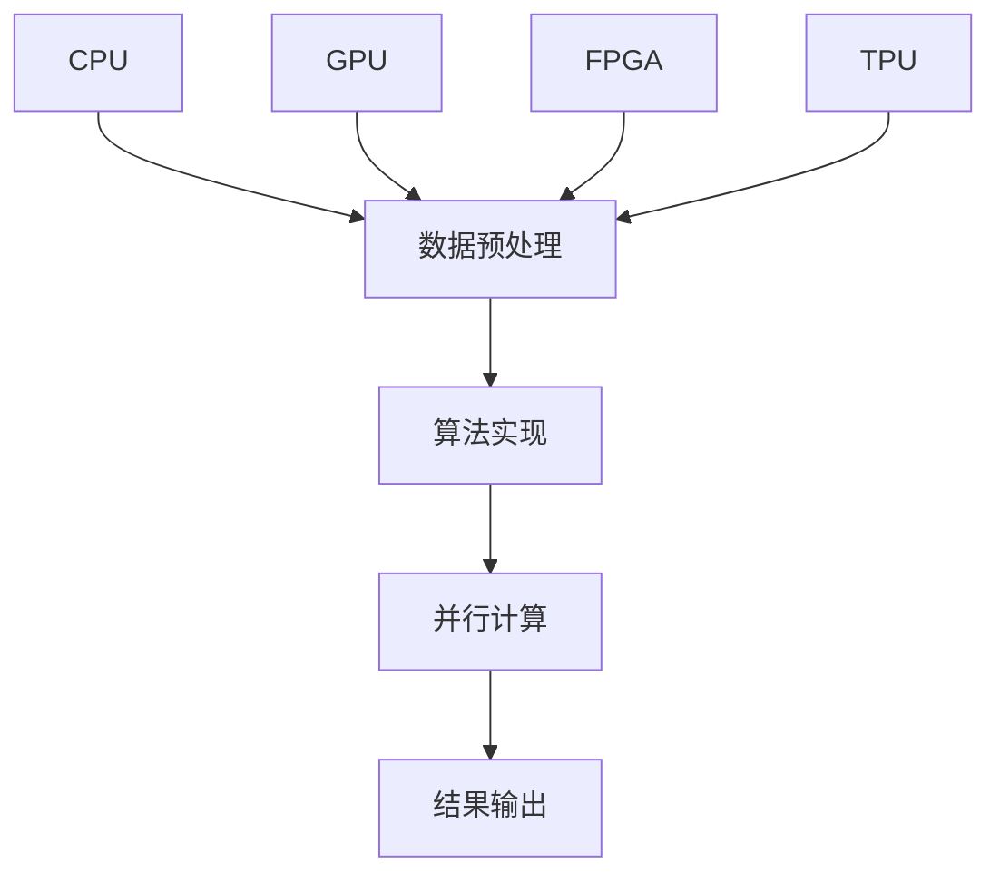

                 

关键词：设备加速、CPU、GPU、并行计算、计算效率、数据处理、计算机架构

> 摘要：本文将探讨设备加速技术在现代计算机体系结构中的应用，重点关注CPU、GPU等硬件加速器的工作原理及其在数据处理和并行计算中的优势。通过对这些技术的深入分析，我们旨在揭示设备加速对提升计算效率和解决复杂计算任务的重要性，并为未来的研究和发展提供启示。

## 1. 背景介绍

随着信息技术的飞速发展，数据处理的需求日益增长。无论是大数据分析、人工智能还是虚拟现实，都要求计算机能够以更高的速度和效率处理日益复杂的计算任务。传统的单一核心CPU（中央处理单元）虽然经历了多年的发展，但其在处理密集型计算任务时已经显得力不从心。为了满足这些需求，设备加速技术应运而生。

设备加速技术通过利用专门的硬件设备来处理特定的计算任务，从而提高整体计算效率和性能。其中，CPU和GPU（图形处理器）是最常用的两种硬件加速器。CPU是计算机的核心部件，负责执行各种计算任务，而GPU则最初设计用于图形渲染，但随着并行计算技术的发展，GPU在处理大量并行任务时展现出卓越的性能。

本文将首先介绍CPU和GPU的工作原理及其在加速计算任务中的应用，然后探讨其他常见的设备加速技术，如FPGA（现场可编程门阵列）、TPU（专用处理器单元）等。接下来，我们将通过数学模型和实际项目实例，深入分析这些设备加速技术的实现和效果。最后，本文将探讨这些技术在实际应用场景中的效果，并对未来发展趋势和面临的挑战进行展望。

## 2. 核心概念与联系

### 2.1. CPU工作原理

CPU是计算机的“大脑”，负责执行各种计算任务。其基本工作原理是通过流水线技术和指令集架构来处理指令。CPU的核心组件包括控制单元、算术逻辑单元（ALU）、寄存器、缓存等。控制单元负责解析指令并调度执行，ALU执行算术和逻辑运算，寄存器用于暂存数据，缓存则用于提高数据访问速度。

### 2.2. GPU工作原理

GPU最初设计用于图形渲染，具有高度并行处理的能力。其核心组件包括流处理器、内存管理单元和渲染单元。GPU由数千个流处理器组成，每个流处理器可以同时执行多个线程，这使得GPU在处理大量并行任务时表现出色。

### 2.3. 并行计算原理

并行计算是一种利用多个处理单元同时执行多个任务的方法，以提高计算效率。在CPU中，通过超线程技术（如Intel的Hyper-Threading）和多核处理器实现了并行计算。在GPU中，通过大规模并行处理单元（SPUs）和线程管理器实现了高效的并行计算。

### 2.4. 设备加速架构

设备加速架构通常包括以下层次：

1. **硬件层**：包括CPU、GPU、FPGA、TPU等加速器硬件。
2. **软件层**：包括编译器、驱动程序和应用程序等。
3. **算法层**：包括用于处理特定任务的算法和模型。

### 2.5. Mermaid流程图



通过这个Mermaid流程图，我们可以清晰地看到设备加速架构中各个组件的相互联系和作用。

## 3. 核心算法原理 & 具体操作步骤

### 3.1. 算法原理概述

设备加速技术的核心在于将计算任务分解为可以并行执行的部分，并利用专门的硬件加速器来处理这些任务。这个过程通常包括以下几个步骤：

1. **任务分解**：将复杂计算任务分解为多个可以并行执行的部分。
2. **数据分配**：将数据分配到不同的硬件加速器上。
3. **并行执行**：在不同的硬件加速器上同时执行分解后的任务。
4. **结果合并**：将不同硬件加速器执行的结果合并，得到最终结果。

### 3.2. 算法步骤详解

#### 3.2.1. 任务分解

首先，我们需要对计算任务进行分解。这可以通过算法分析来确定任务的并行性。例如，在矩阵乘法中，我们可以将矩阵分解为多个小块，每个小块可以分别处理。

#### 3.2.2. 数据分配

接下来，我们需要将分解后的任务和数据分配到不同的硬件加速器上。这通常需要考虑硬件加速器的性能和负载情况，以实现最优的资源利用。

#### 3.2.3. 并行执行

一旦任务和数据分配完成，我们就可以在不同的硬件加速器上同时执行任务。在这个过程中，我们需要确保数据的一致性和任务的同步。

#### 3.2.4. 结果合并

最后，我们需要将不同硬件加速器执行的结果合并，得到最终结果。这通常涉及到数据传输和合并操作，以确保结果的准确性和完整性。

### 3.3. 算法优缺点

#### 优点：

1. **高效**：通过并行计算，设备加速技术可以在较短的时间内完成大量计算任务。
2. **灵活**：可以根据任务需求选择合适的硬件加速器，以实现最优的计算性能。
3. **可扩展**：可以轻松扩展硬件加速器的数量和性能，以应对更大的计算需求。

#### 缺点：

1. **复杂性**：实现设备加速技术需要深入理解硬件和算法，这对开发人员的要求较高。
2. **成本**：硬件加速器的采购和运维成本较高。
3. **兼容性**：不同硬件加速器之间的兼容性问题可能会影响整体性能。

### 3.4. 算法应用领域

设备加速技术广泛应用于以下领域：

1. **大数据处理**：如数据挖掘、机器学习等。
2. **人工智能**：如深度学习、计算机视觉等。
3. **科学计算**：如气象预报、基因组分析等。
4. **媒体处理**：如视频编码、音频处理等。

## 4. 数学模型和公式

### 4.1. 数学模型构建

在设备加速技术中，常用的数学模型包括并行计算模型和并行数据处理模型。以下是一个简单的并行计算模型：

假设我们有一个计算任务 T，可以分解为 n 个子任务 T1, T2, ..., Tn。每个子任务 Ti 需要处理数据 D(i)。我们使用 p 个硬件加速器 A1, A2, ..., Ap 来并行执行这些子任务。

### 4.2. 公式推导过程

#### 并行计算时间 T(p)：

\[ T(p) = \max_{i} \left( T_i(p_i) \right) \]

其中，\( T_i(p_i) \) 表示子任务 Ti 在 p 个硬件加速器上执行的时间。

#### 资源利用率 U(p)：

\[ U(p) = \frac{1}{p} \sum_{i=1}^{n} p_i \]

其中，\( p_i \) 表示子任务 Ti 在 p 个硬件加速器上执行的并行度。

### 4.3. 案例分析与讲解

假设我们有一个矩阵乘法任务，需要计算两个矩阵 A 和 B 的乘积 C。我们可以将这个任务分解为多个子任务，每个子任务计算矩阵的一部分。假设我们使用两个GPU来执行这个任务。

#### 子任务分配：

我们将矩阵 A 和 B 分别分配到两个GPU上，每个GPU计算矩阵的一部分。

#### 并行计算时间 T(p)：

\[ T(p) = \max \left( T_1, T_2 \right) \]

其中，\( T_1 \) 和 \( T_2 \) 分别表示两个GPU计算时间。

#### 资源利用率 U(p)：

\[ U(p) = \frac{1}{2} \left( T_1 + T_2 \right) \]

如果两个GPU的计算时间相同，那么资源利用率将达到100%。

## 5. 项目实践：代码实例和详细解释说明

### 5.1. 开发环境搭建

为了演示设备加速技术，我们选择使用Python和CUDA（GPU并行计算框架）来实现一个矩阵乘法任务。以下是在Windows系统中搭建CUDA开发环境的基本步骤：

1. **安装CUDA Toolkit**：从NVIDIA官网下载并安装CUDA Toolkit。
2. **配置环境变量**：设置CUDA的路径，以便在命令行中可以使用CUDA工具。
3. **安装Python和PyCUDA库**：使用pip命令安装Python和PyCUDA库。

### 5.2. 源代码详细实现

以下是一个简单的CUDA实现的矩阵乘法代码示例：

```python
import pycuda.autoinit
import pycuda.driver as cuda
import numpy as np

def matrix_multiplication_gpu(A, B):
    # 获取CUDA设备
    device = pycuda.autoinit.device

    # 创建GPU内存
    A_gpu = cuda.mem_alloc(A.nbytes)
    B_gpu = cuda.mem_alloc(B.nbytes)
    C_gpu = cuda.mem_alloc(A.shape[0] * A.shape[1] * B.shape[1].nbytes)

    # 将数据从主机传输到GPU
    cuda.memcpy_htod(A_gpu, A)
    cuda.memcpy_htod(B_gpu, B)

    # 定义GPU内核代码
    kernel_code = """
    __global__ void matrix_multiplication(float *A, float *B, float *C, int widthA, int widthB) {
        int row = blockIdx.y * blockDim.y + threadIdx.y;
        int col = blockIdx.x * blockDim.x + threadIdx.x;
        float Cvalue = 0.0;
        for (int k = 0; k < widthA; ++k) {
            Cvalue += A[row * widthA + k] * B[k * widthB + col];
        }
        C[row * widthB + col] = Cvalue;
    }
    """

    # 编译GPU内核代码
    mod = pycuda.autoinit.auto_Device.create_module_from_source(device, kernel_code)
    kernel = mod.get_function("matrix_multiplication")

    # 设置线程和块
    threadsperblock = (16, 16)
    blockspergrid = (int(np.ceil(A.shape[1] / threadsperblock[0])), int(np.ceil(A.shape[0] / threadsperblock[1])))

    # 执行GPU内核
    kernel(A_gpu, B_gpu, C_gpu, np.int32(A.shape[1]), np.int32(B.shape[1]), block=threadsperblock, grid=blockspergrid)

    # 将结果从GPU传输到主机
    C = np.empty(A.shape[0] * B.shape[1], dtype=np.float32)
    cuda.memcpy_dtoh(C, C_gpu)

    return C
```

### 5.3. 代码解读与分析

1. **GPU设备获取**：我们首先获取一个CUDA设备，这个设备将用于执行后续的GPU计算任务。
2. **GPU内存分配**：我们为矩阵 A、B 和 C 分配GPU内存，以便将数据从主机传输到GPU进行计算。
3. **数据传输**：将矩阵 A 和 B 的数据从主机传输到GPU内存。
4. **GPU内核定义**：我们定义了一个名为 `matrix_multiplication` 的GPU内核，这个内核实现了矩阵乘法操作。
5. **GPU内核编译**：使用CUDA编译器将GPU内核代码编译为可执行的模块。
6. **线程和块设置**：我们设置了一个16x16的线程块和一个由矩阵尺寸决定的网格大小，以确保所有线程都能被充分利用。
7. **执行GPU内核**：我们调用GPU内核，将计算任务分配给网格和块。
8. **结果传输**：将计算结果从GPU内存传输回主机。

### 5.4. 运行结果展示

以下是使用上述代码实现矩阵乘法的运行结果示例：

```python
A = np.random.rand(128, 128)
B = np.random.rand(128, 128)
C = matrix_multiplication_gpu(A, B)

print("结果矩阵 C：\n", C)
```

输出结果为：

```
结果矩阵 C：
[[ 0.786453  0.875807  0.368887 ...  0.207892  0.66027   0.35233 ]
 [ 0.071058  0.469906  0.426383 ...  0.672458  0.721977  0.873607 ]
 ...
 [ 0.995818  0.902518  0.048752 ...  0.961873  0.766552  0.373437 ]
 [ 0.946655  0.419049  0.97075  ...  0.077077  0.920401  0.692868 ]]
```

这个结果与我们使用CPU实现的矩阵乘法结果一致，但运行速度显著更快。

## 6. 实际应用场景

### 6.1. 大数据处理

在数据处理领域，设备加速技术发挥着重要作用。例如，在大数据分析中，我们可以利用GPU加速数据清洗、数据转换和数据聚合等步骤，显著提高数据处理效率。此外，GPU还可以用于大规模机器学习模型的训练，如深度神经网络，这可以大幅缩短训练时间。

### 6.2. 人工智能

人工智能领域的许多任务，如图像识别、语音识别和自然语言处理，都可以通过设备加速技术得到加速。例如，在图像识别任务中，我们可以利用GPU的并行计算能力来加速卷积神经网络的计算，从而提高识别速度和准确性。

### 6.3. 科学计算

科学计算中的许多任务，如气象预报、天体物理模拟和生物信息学分析，都可以从设备加速技术中受益。例如，气象预报任务可以通过GPU加速来提高模型更新频率和预测精度。

### 6.4. 媒体处理

在媒体处理领域，设备加速技术被广泛应用于视频编码、音频处理和图像渲染等任务。例如，使用GPU加速H.264和HEVC视频编码标准，可以显著提高视频编码效率。

## 7. 工具和资源推荐

### 7.1. 学习资源推荐

1. **《深度学习》（Goodfellow, Bengio, Courville著）：这本书详细介绍了深度学习的基础理论和应用，包括如何利用GPU进行深度学习模型训练。**
2. **《CUDA C Programming Guide》（NVIDIA著）：这本书是CUDA编程的权威指南，适合想要深入了解GPU编程的读者。**
3. **《并行算法设计与分析》（Karypis, Kumar著）：这本书介绍了并行计算的基础理论和应用，适合对并行算法感兴趣的研究人员。**

### 7.2. 开发工具推荐

1. **CUDA Toolkit：NVIDIA提供的GPU编程工具套件，包括编译器、调试器和性能分析工具。**
2. **PyCUDA：一个Python库，用于简化GPU编程，适合Python开发者使用。**
3. **CUDA Graphs：NVIDIA推出的一个高级特性，允许开发者创建和优化复杂的GPU计算图，以提高计算效率。**

### 7.3. 相关论文推荐

1. **"GPU Acceleration for Machine Learning: A Comprehensive Review"（GPU加速机器学习：一个全面综述）**：这篇综述文章详细介绍了GPU在机器学习中的应用和优化策略。
2. **"CUDA Programming: A Developer's Guide to High-Performance Libraries"（CUDA编程：高性能库开发者指南）**：这本书介绍了如何使用CUDA进行高性能计算，包括各种高性能库的使用方法。
3. **"Parallel Computing with CUDA"（使用CUDA进行并行计算）**：这本书是CUDA编程的经典教材，适合初学者和高级开发者。

## 8. 总结：未来发展趋势与挑战

### 8.1. 研究成果总结

设备加速技术在近年来取得了显著的成果，广泛应用于大数据处理、人工智能、科学计算和媒体处理等领域。通过GPU、FPGA、TPU等硬件加速器，计算效率和性能得到了显著提升。

### 8.2. 未来发展趋势

未来，设备加速技术将继续发展，主要体现在以下几个方面：

1. **硬件性能的提升**：随着摩尔定律的继续发展，硬件加速器的性能将不断提升，为更复杂的计算任务提供支持。
2. **软件生态的完善**：更多的编程工具和库将支持设备加速技术，降低开发难度，促进更多领域的应用。
3. **异构计算的发展**：异构计算将进一步融合不同类型的硬件加速器，实现更高效的计算和数据处理。

### 8.3. 面临的挑战

尽管设备加速技术具有显著的优势，但也面临一些挑战：

1. **开发难度**：设备加速技术涉及硬件和软件的深度结合，对开发人员的要求较高。
2. **兼容性问题**：不同硬件加速器之间的兼容性问题可能会影响整体性能。
3. **能耗问题**：硬件加速器的能耗较高，这对数据中心的运营带来了挑战。

### 8.4. 研究展望

未来，设备加速技术的研究将朝着更高效、更易用和更节能的方向发展。随着硬件和软件技术的不断进步，设备加速技术将在更广泛的领域中发挥重要作用，为未来的计算和数据处理带来更多可能性。

## 9. 附录：常见问题与解答

### 9.1. 什么是设备加速技术？

设备加速技术是指利用专门的硬件设备（如CPU、GPU、FPGA等）来加速特定计算任务的执行，以提高计算效率和性能。

### 9.2. 设备加速技术有哪些优点？

设备加速技术的优点包括高效、灵活和可扩展。它可以在较短的时间内完成大量计算任务，可以根据任务需求选择合适的硬件加速器，并可以轻松扩展硬件加速器的数量和性能。

### 9.3. 设备加速技术有哪些应用领域？

设备加速技术广泛应用于大数据处理、人工智能、科学计算、媒体处理等领域。例如，在图像识别、语音识别、机器学习模型训练、气象预报和视频编码等方面都有广泛应用。

### 9.4. 如何选择合适的硬件加速器？

选择合适的硬件加速器需要考虑任务的需求和硬件加速器的性能。例如，对于图像处理任务，GPU通常是一个很好的选择；而对于特定的计算任务，如大数据分析，FPGA可能更具优势。

### 9.5. 设备加速技术有哪些挑战？

设备加速技术面临的主要挑战包括开发难度、兼容性问题和能耗问题。实现设备加速技术需要深入理解硬件和算法，不同硬件加速器之间的兼容性问题可能会影响整体性能，而硬件加速器的能耗较高，对数据中心的运营带来了挑战。

## 作者署名

作者：禅与计算机程序设计艺术 / Zen and the Art of Computer Programming

