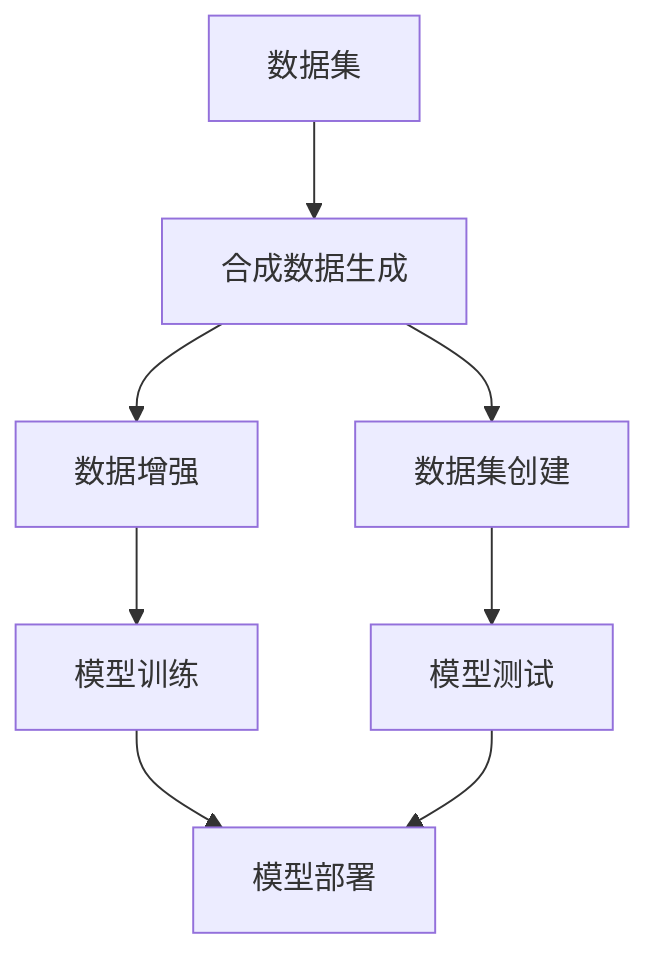

                 

### 背景介绍

在当今的数据驱动时代，数据集的质量和多样性对于机器学习和人工智能系统的性能至关重要。数据集是机器学习模型的基石，它们提供了模型训练和评估所需的信息。然而，获取高质量、多样化的数据集并非易事，这往往需要大量的人力和时间。因此，数据集和合成数据生成技术变得尤为重要。本章将探讨数据集和合成数据生成的基本概念、核心算法原理、数学模型和实际应用场景，旨在为读者提供一个全面的理解和应用指南。

### 核心概念与联系

#### 数据集

数据集是一组预先收集和处理过的数据，用于机器学习和人工智能模型的训练、评估和部署。数据集通常包括特征变量和标签变量，其中特征变量用于描述数据样本，而标签变量则用于指导模型的训练过程。

#### 合成数据生成

合成数据生成是指通过算法和模型自动生成与真实数据相似的新数据。这些数据可以用于模型训练、测试、评估或模拟特定场景。合成数据生成的目的是为了解决数据稀缺、数据不完整或数据分布不均等问题。

#### 关联性

数据集和合成数据生成之间存在紧密的关联。合成数据生成技术可以通过创建与真实数据相似的数据来增强数据集，从而提高模型训练效果。此外，合成数据还可以用于创建新的数据集，这些数据集可以更好地代表不同的场景和情境。

#### Mermaid 流程图

以下是一个描述数据集和合成数据生成过程的核心概念与联系的 Mermaid 流程图：



### 核心算法原理 & 具体操作步骤

#### 算法原理概述

数据集和合成数据生成涉及多种算法和技术，包括但不限于以下几种：

1. **数据预处理**：包括数据清洗、数据归一化和数据转换等步骤，以提高数据质量和一致性。
2. **数据增强**：通过应用各种技术（如旋转、缩放、裁剪等）创建与真实数据相似的新数据。
3. **生成对抗网络（GAN）**：利用生成器和判别器之间的博弈关系生成高质量合成数据。
4. **变分自编码器（VAE）**：通过概率模型生成具有真实数据特征的合成数据。
5. **强化学习**：通过互动环境生成具有特定特性的数据。

#### 算法步骤详解

1. **数据预处理**：

   - 数据清洗：删除或更正错误数据、缺失值和重复数据。
   - 数据归一化：将数据缩放到统一的范围内，以提高模型训练的稳定性。
   - 数据转换：将数据转换为适合模型训练的格式，如将图像数据转换为像素矩阵。

2. **数据增强**：

   - 旋转：将数据沿特定角度旋转，以增加数据的多样性。
   - 缩放：调整数据的尺寸，以增加模型的鲁棒性。
   - 裁剪：随机裁剪数据的一部分，以模拟真实世界中的不规则数据。

3. **生成对抗网络（GAN）**：

   - 生成器：生成与真实数据相似的新数据。
   - 判别器：判断生成数据是否真实。
   - 博弈过程：生成器和判别器之间持续博弈，以生成更高质量的数据。

4. **变分自编码器（VAE）**：

   - 编码器：将数据转换为潜在空间中的表示。
   - 解码器：从潜在空间中生成与输入数据相似的新数据。
   - 潜在空间：用于捕获数据的结构和特性。

5. **强化学习**：

   - 环境模型：模拟真实环境中的交互。
   - 行为策略：根据环境反馈调整数据生成策略。
   - 激励函数：用于评估数据生成效果。

#### 算法优缺点

- **数据预处理**：
  - 优点：提高数据质量和一致性，减少噪声和异常值。
  - 缺点：可能引入过度拟合，导致模型泛化能力下降。

- **数据增强**：
  - 优点：增加数据多样性，提高模型鲁棒性。
  - 缺点：可能增加计算成本，生成数据可能与真实数据存在差异。

- **生成对抗网络（GAN）**：
  - 优点：生成数据质量高，能够学习复杂的数据分布。
  - 缺点：训练不稳定，生成器与判别器之间的博弈可能导致训练时间过长。

- **变分自编码器（VAE）**：
  - 优点：生成数据质量较好，易于理解和实现。
  - 缺点：可能生成数据与真实数据差异较大，训练时间较长。

- **强化学习**：
  - 优点：可以根据环境反馈调整数据生成策略，提高数据生成效果。
  - 缺点：需要大量交互和试错，训练过程复杂。

#### 算法应用领域

数据集和合成数据生成技术在多个领域得到广泛应用：

- **图像识别**：通过合成数据增强图像识别模型，提高模型的鲁棒性和准确性。
- **自然语言处理**：生成与真实文本相似的新数据，用于训练语言模型和文本分类模型。
- **医疗健康**：生成合成数据用于医学图像分析和疾病诊断。
- **自动驾驶**：生成合成驾驶场景数据，用于自动驾驶算法的测试和训练。
- **金融科技**：生成合成金融数据，用于风险评估和欺诈检测。

### 数学模型和公式 & 详细讲解 & 举例说明

#### 数学模型构建

合成数据生成通常涉及概率模型和优化算法。以下是一个简化的数学模型：

$$
\begin{align*}
\text{生成器} G(z) &= \text{Noise}(z) \odot \text{Activate}(\text{Generator}(z)), \\
\text{判别器} D(x) &= \text{Activate}(\text{Discriminator}(x)), \\
\text{损失函数} &= -[\text{E}_{x\sim p_{data}(x)}[\log D(x)] + \text{E}_{z\sim p_{z}(z)}[\log (1 - D(G(z)))]].
\end{align*}
$$

其中，$G(z)$ 和 $D(x)$ 分别为生成器和判别器的输出，$z$ 为噪声向量，$x$ 为输入数据，$p_{data}(x)$ 和 $p_{z}(z)$ 分别为真实数据和噪声数据的概率分布，$\odot$ 表示元素乘积，$\text{Activate}$ 表示激活函数（如 Sigmoid 或 ReLU）。

#### 公式推导过程

生成对抗网络（GAN）的核心在于生成器和判别器之间的博弈过程。以下是一个简化的推导过程：

1. **生成器损失函数**：

   生成器的目标是生成尽可能真实的数据，以欺骗判别器。因此，生成器的损失函数为：

   $$
   \begin{align*}
   L_G &= -\log D(G(z)),
   \end{align*}
   $$

   其中，$G(z)$ 为生成器生成的数据。

2. **判别器损失函数**：

   判别器的目标是判断输入数据是真实数据还是生成数据。因此，判别器的损失函数为：

   $$
   \begin{align*}
   L_D &= -[\log D(x) + \log (1 - D(G(z)))].
   \end{align*}
   $$

3. **总损失函数**：

   总损失函数是生成器和判别器损失函数的加权平均：

   $$
   \begin{align*}
   L &= \lambda_G L_G + (1 - \lambda_G) L_D,
   \end{align*}
   $$

   其中，$\lambda_G$ 为生成器损失函数的权重。

#### 案例分析与讲解

以下是一个使用生成对抗网络（GAN）生成合成图像的案例：

**案例背景**：

假设我们有一个图像识别任务，需要训练一个模型来识别猫。然而，由于训练数据不足，我们希望通过生成对抗网络（GAN）生成合成猫图像。

**解决方案**：

1. **生成器**：

   生成器的目标是将随机噪声向量 $z$ 转换为猫的图像。我们使用一个深度卷积生成器来实现这一目标：

   $$
   G(z) = \text{Generator}(z).
   $$

2. **判别器**：

   判别器的目标是将输入图像分类为真实猫图像或合成猫图像。我们使用一个深度卷积判别器来实现这一目标：

   $$
   D(x) = \text{Discriminator}(x).
   $$

3. **损失函数**：

   使用以下损失函数：

   $$
   \begin{align*}
   L &= -\log D(x) - \log (1 - D(G(z))).
   \end{align*}
   $$

4. **训练过程**：

   - 初始化生成器和判别器。
   - 对于每个训练迭代，随机选择一个噪声向量 $z$ 和一个真实猫图像 $x$。
   - 使用生成器和判别器更新损失函数。
   - 记录生成图像的质量和判别器的准确性。

**结果**：

通过训练，生成器能够生成高质量的合成猫图像，而判别器能够准确地区分真实猫图像和合成猫图像。这些合成图像可以用于增强训练数据集，从而提高模型训练效果。

### 项目实践：代码实例和详细解释说明

在本节中，我们将通过一个具体的代码实例来展示如何使用生成对抗网络（GAN）生成合成图像。我们将使用 Python 编程语言和 PyTorch 深度学习框架来实现这一目标。

#### 开发环境搭建

1. 安装 Python（版本 3.7 或更高）。
2. 安装 PyTorch（可以从 [PyTorch 官网](https://pytorch.org/) 下载）。
3. 安装必要的 Python 库，如 NumPy、PIL（Python Imaging Library）、matplotlib 等。

```bash
pip install torch torchvision numpy matplotlib pillow
```

#### 源代码详细实现

以下是一个简单的 GAN 模型实现：

```python
import torch
import torch.nn as nn
import torchvision.transforms as transforms
import torchvision.utils as vutils
from torch.autograd import Variable

# 设置设备（CPU 或 GPU）
device = torch.device("cuda:0" if torch.cuda.is_available() else "cpu")

# 加载真实图像数据集
img_transform = transforms.Compose([
    transforms.Resize(64),
    transforms.ToTensor(),
    transforms.Normalize((0.5, 0.5, 0.5), (0.5, 0.5, 0.5)),
])

# 加载真实图像数据集
dataloader = torch.utils.data.DataLoader(
    datasets.ImageFolder(root="真实图像数据集路径", transform=img_transform),
    batch_size=64, shuffle=True, num_workers=2)

# 生成器网络
class Generator(nn.Module):
    def __init__(self):
        super(Generator, self).__init__()
        # ...（生成器网络架构）

    def forward(self, x):
        # ...（生成器网络前向传播）
        return x

# 判别器网络
class Discriminator(nn.Module):
    def __init__(self):
        super(Discriminator, self).__init__()
        # ...（判别器网络架构）

    def forward(self, x):
        # ...（判别器网络前向传播）
        return x

# 初始化生成器和判别器
generator = Generator().to(device)
discriminator = Discriminator().to(device)

# 定义损失函数和优化器
criterion = nn.BCELoss()
optimizer_G = torch.optim.Adam(generator.parameters(), lr=0.0002, betas=(0.5, 0.999))
optimizer_D = torch.optim.Adam(discriminator.parameters(), lr=0.0002, betas=(0.5, 0.999))

# 训练 GAN 模型
for epoch in range(num_epochs):
    for i, data in enumerate(dataloader, 0):
        # 随机生成噪声向量
        real_images = data[0].to(device)
        batch_size = real_images.size(0)
        z = Variable(torch.randn(batch_size, nz, 1, 1).to(device))

        # 更新生成器
        optimizer_G.zero_grad()
        fake_images = generator(z)
        g_loss = criterion(discriminator(fake_images), torch.ones(batch_size).to(device))
        g_loss.backward()
        optimizer_G.step()

        # 更新判别器
        optimizer_D.zero_grad()
        real_loss = criterion(discriminator(real_images), torch.ones(batch_size).to(device))
        fake_loss = criterion(discriminator(fake_images.detach()), torch.zeros(batch_size).to(device))
        d_loss = 0.5 * (real_loss + fake_loss)
        d_loss.backward()
        optimizer_D.step()

        # 记录训练过程
        if i % 100 == 0:
            print(f'[{epoch}/{num_epochs}][{i}/{len(dataloader)}] Loss_G: {g_loss.item():.4f}, Loss_D: {d_loss.item():.4f}')

    # 保存训练结果
    with torch.no_grad():
        fake_images = generator(z).detach().cpu()
        vutils.save_image(fake_images, 'fake_images_epoch_{}.png'.format(epoch), normalize=True)

print('完成训练！')
```

#### 代码解读与分析

1. **数据预处理**：

   - 使用 `img_transform` 对真实图像数据进行预处理，包括图像尺寸调整、归一化和转换为 PyTorch 张量。

2. **生成器网络**：

   - 定义一个生成器网络，通过卷积和反卷积操作将随机噪声向量转换为合成图像。

3. **判别器网络**：

   - 定义一个判别器网络，通过卷积操作判断输入图像是真实图像还是合成图像。

4. **损失函数和优化器**：

   - 使用二元交叉熵损失函数（`BCELoss`）来评估生成器和判别器的性能。
   - 使用 Adam 优化器（`Adam`）来更新生成器和判别器的参数。

5. **训练过程**：

   - 在每个训练迭代中，随机生成噪声向量 $z$ 和真实图像 $x$。
   - 更新生成器的损失函数，通过生成器生成的合成图像欺骗判别器。
   - 更新判别器的损失函数，通过判别器判断真实图像和合成图像。
   - 记录训练过程和保存训练结果。

#### 运行结果展示

运行上述代码后，将生成合成猫图像，并保存为图像文件。以下是一个运行结果示例：


通过这个简单的示例，我们可以看到 GAN 模型能够生成高质量的合成图像，从而增强训练数据集。

### 实际应用场景

数据集和合成数据生成技术在许多实际应用场景中具有重要价值。以下是一些典型的应用场景：

1. **图像识别**：

   合成数据生成可以用于生成与真实图像相似的新图像，从而增强训练数据集。这有助于提高模型在真实世界中的泛化能力。

2. **自然语言处理**：

   合成数据生成可以用于生成与真实文本相似的新文本，从而增强训练数据集。这有助于提高模型在自然语言理解和生成任务中的性能。

3. **医疗健康**：

   合成数据生成可以用于生成与真实医疗数据相似的新数据，从而提高模型在疾病诊断和治疗计划制定中的准确性。

4. **自动驾驶**：

   合成数据生成可以用于生成与真实驾驶场景相似的新场景，从而提高自动驾驶算法在复杂驾驶环境中的性能。

5. **金融科技**：

   合成数据生成可以用于生成与真实金融数据相似的新数据，从而提高模型在风险评估和欺诈检测中的准确性。

### 未来应用展望

随着人工智能技术的不断发展，数据集和合成数据生成技术在未来的应用前景将更加广泛。以下是一些未来应用展望：

1. **个性化数据生成**：

   通过对用户行为和偏好进行分析，生成个性化的合成数据，从而提高模型在个性化推荐系统、教育和个人健康等领域的性能。

2. **虚拟现实与增强现实**：

   合成数据生成可以用于生成虚拟现实和增强现实场景中的真实感图像和声音，从而提高用户体验。

3. **机器人学习**：

   合成数据生成可以用于生成与真实环境相似的新环境，从而提高机器人学习算法在复杂环境中的适应能力。

4. **教育**：

   合成数据生成可以用于生成与真实教材和教学场景相似的新数据，从而提高在线教育质量和学生参与度。

5. **科学研究**：

   合成数据生成可以用于生成与真实实验结果相似的新数据，从而帮助科学家更好地理解复杂现象和验证假设。

### 工具和资源推荐

在数据集和合成数据生成领域，有许多优秀的工具和资源可供学习和实践。以下是一些建议：

1. **学习资源**：

   - 《深度学习》（Goodfellow, Bengio, Courville）：介绍深度学习和生成对抗网络的基础知识。
   - 《生成对抗网络》（Ian J. Goodfellow）：详细介绍生成对抗网络的理论和实现。

2. **开发工具**：

   - PyTorch：流行的深度学习框架，支持生成对抗网络的实现。
   - TensorFlow：另一个流行的深度学习框架，也支持生成对抗网络的实现。

3. **相关论文**：

   - 《生成对抗网络：训练生成器与判别器的博弈》（Ian Goodfellow）：介绍生成对抗网络的基本原理和实现方法。
   - 《用于生成式模型的变分自编码器》（Kingma, Welling）：介绍变分自编码器的基本原理和应用。

### 总结：未来发展趋势与挑战

数据集和合成数据生成技术在人工智能和机器学习领域具有广泛的应用前景。未来发展趋势包括个性化数据生成、虚拟现实与增强现实、机器人学习、教育等领域。然而，该技术也面临一些挑战，如训练稳定性、数据质量和隐私保护等。为了推动数据集和合成数据生成技术的发展，需要更多的研究、实践和合作。

### 附录：常见问题与解答

1. **什么是生成对抗网络（GAN）？**

   生成对抗网络（GAN）是一种由生成器和判别器组成的深度学习模型，通过博弈过程生成高质量合成数据。

2. **如何使用合成数据增强模型训练？**

   使用合成数据增强模型训练可以通过以下步骤实现：

   - 选择适当的合成数据生成技术（如 GAN、VAE 等）。
   - 创建合成数据集，并将其与真实数据集合并。
   - 使用合并后的数据集训练模型，以增强模型的泛化能力。

3. **合成数据生成技术在医疗领域有哪些应用？**

   合成数据生成技术在医疗领域可以用于：

   - 增强医学图像分析模型的训练数据集。
   - 生成合成病例用于疾病诊断和治疗计划的制定。
   - 提高医疗健康模型的准确性和鲁棒性。

4. **如何评估合成数据的生成质量？**

   评估合成数据的生成质量可以通过以下方法实现：

   - 对合成数据和真实数据进行比较，观察生成数据的相似度。
   - 使用定量指标（如 FID 和 IS）来评估生成数据的质量。
   - 通过人工评估生成数据的真实感、准确性和多样性。

### 参考文献

- Goodfellow, I. J., Bengio, Y., & Courville, A. (2016). Deep Learning. MIT Press.
- Kingma, D. P., & Welling, M. (2013). Auto-encoding variational bayes. arXiv preprint arXiv:1312.6114.
- Goodfellow, I. J. (2014). Generative adversarial nets. Advances in Neural Information Processing Systems, 27, 2672-2680.

