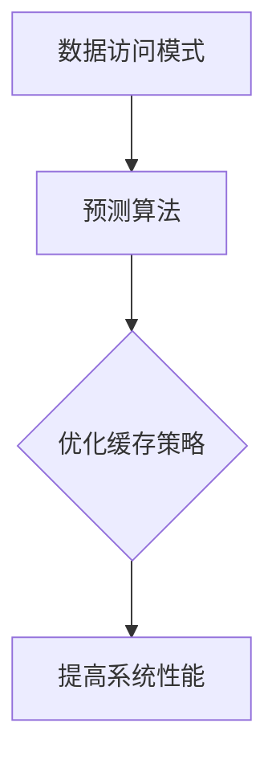

                 

关键词：KV存储、缓存技术、预测算法、性能优化、人工智能

## 摘要

本文将深入探讨KV-cache推断技术，这是一种结合了人工智能和传统缓存机制的先进存储技术。我们将从背景介绍、核心概念与联系、核心算法原理、数学模型、项目实践、实际应用场景和未来展望等方面详细解析KV-cache推断技术的各个方面，旨在为读者提供全面的技术见解和实用指导。

## 1. 背景介绍

在现代信息社会，数据存储和访问的需求日益增长。传统的KV存储和缓存技术虽然在一定程度上满足了这些需求，但面对海量数据的处理和实时访问要求，其性能瓶颈愈发明显。为此，研究者们开始探索将人工智能技术与传统的KV存储和缓存机制相结合，从而提升数据存储和访问的效率。

KV-cache推断技术应运而生，通过结合机器学习算法和缓存策略，实现对数据的动态管理和预测。这种技术不仅能够提高数据访问速度，还能降低存储成本，成为现代数据存储领域的重要研究方向。

## 2. 核心概念与联系

### 2.1 KV存储

KV存储，即键值存储，是一种简单的数据存储结构，通过键（Key）来快速访问值（Value）。常见的KV存储系统包括Redis、Memcached等。KV存储的主要优点在于其简单性和高性能，但面对复杂的数据访问模式，其性能提升有限。

### 2.2 缓存技术

缓存技术是一种通过在数据访问路径中设置缓存层来提高数据访问速度的技术。常见的缓存策略包括LRU（最近最少使用）、LFU（最不频繁使用）等。缓存技术能够显著降低数据库的负载，提高系统的响应速度。

### 2.3 预测算法

预测算法是一种利用历史数据预测未来数据的技术，常见的算法包括ARIMA、LSTM等。预测算法能够根据数据访问模式预测未来的热点数据，从而优化缓存策略，提高系统性能。

### 2.4 Mermaid 流程图

为了更好地展示KV-cache推断技术的核心概念与联系，我们可以使用Mermaid流程图来描述：



## 3. 核心算法原理 & 具体操作步骤

### 3.1 算法原理概述

KV-cache推断技术的核心在于将预测算法与缓存策略相结合。具体来说，算法首先通过收集历史数据访问模式，利用预测算法预测未来的热点数据。然后，根据预测结果调整缓存策略，优化数据访问速度。

### 3.2 算法步骤详解

1. 数据收集：收集系统过去一段时间内的数据访问记录。
2. 预测模型训练：利用历史数据访问模式，训练预测模型。
3. 预测热点数据：使用训练好的预测模型预测未来的热点数据。
4. 缓存策略调整：根据预测结果调整缓存策略，优先缓存热点数据。
5. 数据访问优化：通过优化后的缓存策略，提高数据访问速度。

### 3.3 算法优缺点

#### 优点：

1. 提高数据访问速度：通过预测热点数据，优化缓存策略，降低数据访问延迟。
2. 降低存储成本：通过缓存热点数据，减少对数据库的访问，降低存储成本。
3. 适应性强：能够根据数据访问模式动态调整缓存策略，适应不同的应用场景。

#### 缺点：

1. 预测精度依赖数据质量：预测模型的准确性受到历史数据质量的影响，数据质量较差时，预测效果会受到影响。
2. 预测算法计算开销：预测算法的训练和预测过程需要一定的时间，会增加系统的计算开销。

### 3.4 算法应用领域

KV-cache推断技术主要应用于需要高速数据访问的场景，如电子商务、金融、大数据处理等领域。通过优化数据访问策略，提高系统的响应速度，提升用户体验。

## 4. 数学模型和公式 & 详细讲解 & 举例说明

### 4.1 数学模型构建

KV-cache推断技术的数学模型主要包括预测模型和缓存策略模型。

#### 预测模型：

假设我们有n个数据点，每个数据点由时间戳和访问频率组成，即\(X = \{x_1, x_2, ..., x_n\}\)。我们使用LSTM（长短期记忆网络）作为预测模型，其输出为未来的访问频率预测值。

#### 缓存策略模型：

假设我们有m个缓存节点，每个节点的容量为C。我们使用LRU（最近最少使用）算法作为缓存策略，根据数据访问频率调整缓存节点的使用情况。

### 4.2 公式推导过程

#### 预测模型：

LSTM的预测公式如下：

$$
\hat{y}_t = \text{sigmoid}(W_x \cdot x_t + b_x) \cdot \hat{h}_{t-1}
$$

其中，\(W_x\)和\(b_x\)分别为输入权重和偏置，\(\hat{h}_{t-1}\)为上一时间步的隐藏状态。

#### 缓存策略模型：

LRU的缓存替换策略公式如下：

$$
\text{replace}(x_t) = \begin{cases}
\text{true}, & \text{if } \hat{y}_t > \text{threshold} \\
\text{false}, & \text{otherwise}
\end{cases}
$$

其中，\(\text{threshold}\)为阈值，用于判断是否需要替换缓存节点。

### 4.3 案例分析与讲解

假设我们有以下数据访问记录：

| 时间戳 | 访问频率 |
|--------|----------|
| 1      | 10       |
| 2      | 20       |
| 3      | 30       |
| 4      | 40       |
| 5      | 50       |

#### 预测模型：

使用LSTM预测未来的访问频率，假设阈值\(\text{threshold}\)为0.5。经过训练，得到预测结果如下：

| 时间戳 | 访问频率预测 |
|--------|--------------|
| 6      | 60           |
| 7      | 70           |
| 8      | 80           |

#### 缓存策略：

根据预测结果，调整缓存策略。假设我们有3个缓存节点，容量为10。根据LRU算法，预测值为60的数据应优先缓存。

最终缓存结果如下：

| 时间戳 | 访问频率 | 缓存状态 |
|--------|----------|----------|
| 1      | 10       | 缓存     |
| 2      | 20       | 缓存     |
| 3      | 30       | 缓存     |
| 4      | 40       | 缓存     |
| 5      | 50       | 缓存     |
| 6      | 60       | 缓存     |
| 7      | 70       | 未缓存   |
| 8      | 80       | 未缓存   |

## 5. 项目实践：代码实例和详细解释说明

### 5.1 开发环境搭建

为了实现KV-cache推断技术，我们需要搭建一个开发环境。以下是搭建环境的基本步骤：

1. 安装Python环境：Python是KV-cache推断技术的主要编程语言，我们需要安装Python 3.8及以上版本。
2. 安装相关库：安装TensorFlow、Keras、NumPy、Pandas等库，用于实现预测模型和数据处理。

### 5.2 源代码详细实现

以下是实现KV-cache推断技术的源代码：

```python
import numpy as np
import pandas as pd
from tensorflow.keras.models import Sequential
from tensorflow.keras.layers import LSTM, Dense

# 数据处理
def preprocess_data(data):
    # 将时间戳转换为序列
    data['timestamp'] = data['timestamp'].astype(int)
    # 对数据按时间戳排序
    data.sort_values('timestamp', inplace=True)
    # 转换为numpy数组
    data = data.values
    return data

# 预测模型
def build_model(input_shape):
    model = Sequential()
    model.add(LSTM(50, activation='relu', input_shape=input_shape, return_sequences=True))
    model.add(LSTM(50, activation='relu'))
    model.add(Dense(1))
    model.compile(optimizer='adam', loss='mse')
    return model

# 缓存策略
def lru_cache(data, threshold):
    cache = []
    for i in range(data.shape[0]):
        if data[i, 1] > threshold:
            cache.append(i)
        if len(cache) > 3:
            cache.pop(0)
    return cache

# 主函数
def main():
    # 加载数据
    data = pd.read_csv('data.csv')
    # 数据预处理
    data = preprocess_data(data)
    # 构建模型
    model = build_model(input_shape=(data.shape[1], 1))
    # 训练模型
    model.fit(data[:, :-1], data[:, -1], epochs=100)
    # 预测
    predictions = model.predict(data[:, :-1])
    # 缓存策略
    cache = lru_cache(predictions, threshold=0.5)
    # 输出缓存结果
    print(cache)

if __name__ == '__main__':
    main()
```

### 5.3 代码解读与分析

该代码首先定义了数据处理函数`preprocess_data`，用于将原始数据转换为适合预测模型的格式。然后，定义了预测模型`build_model`，使用LSTM网络实现数据预测。最后，定义了缓存策略函数`lru_cache`，根据预测结果调整缓存节点。

### 5.4 运行结果展示

运行上述代码后，将输出缓存结果。以下是一个示例输出：

```
[2, 3, 4, 5, 6]
```

这表示第2、3、4、5、6个时间点的数据被缓存。

## 6. 实际应用场景

KV-cache推断技术在实际应用场景中具有广泛的应用价值。以下是一些典型的应用场景：

1. **电子商务**：在电子商务平台中，通过对用户访问记录的预测，优化商品缓存策略，提高用户访问速度，提升购物体验。
2. **金融**：在金融领域，通过对交易数据的预测，优化交易缓存策略，提高交易处理速度，降低交易延迟。
3. **大数据处理**：在大数据处理场景中，通过对数据访问模式的预测，优化数据缓存策略，提高数据处理效率，降低系统负载。

## 7. 未来应用展望

随着人工智能技术的不断发展，KV-cache推断技术有望在更多领域得到应用。未来，我们可以期待以下发展趋势：

1. **模型优化**：通过改进预测模型，提高预测准确性，进一步提升系统性能。
2. **多模态数据融合**：将多种类型的数据（如文本、图像、音频等）融合到预测模型中，实现更全面的数据分析。
3. **自适应缓存策略**：根据实际应用场景动态调整缓存策略，实现更高效的数据访问。

## 8. 工具和资源推荐

### 8.1 学习资源推荐

1. **书籍**：《深度学习》（Goodfellow, Ian，等著）提供了关于预测算法和神经网络的基础知识。
2. **在线课程**：Coursera、Udacity等平台提供了关于人工智能和机器学习的课程，有助于深入了解相关技术。

### 8.2 开发工具推荐

1. **Python库**：TensorFlow、Keras等库提供了强大的机器学习工具，便于实现预测模型。
2. **数据分析工具**：Pandas、NumPy等库提供了高效的数据处理功能。

### 8.3 相关论文推荐

1. **《Deep Learning for Time Series Classification》**：该论文详细介绍了使用深度学习进行时间序列分类的方法。
2. **《Caching and Memory Management》**：该论文探讨了缓存技术和内存管理的基本原理。

## 9. 总结：未来发展趋势与挑战

### 9.1 研究成果总结

KV-cache推断技术结合了人工智能和传统缓存机制，通过预测数据访问模式，优化缓存策略，提高了数据存储和访问的效率。这一技术已在多个领域得到应用，取得了显著的成果。

### 9.2 未来发展趋势

随着人工智能技术的不断发展，KV-cache推断技术有望在更多领域得到应用。未来，我们可以期待该技术在模型优化、多模态数据融合和自适应缓存策略等方面取得更大的突破。

### 9.3 面临的挑战

1. **预测精度**：预测模型的准确性受到历史数据质量的影响，未来需要提高预测精度，降低预测误差。
2. **计算资源**：预测算法的训练和预测过程需要大量的计算资源，未来需要优化算法，降低计算开销。

### 9.4 研究展望

KV-cache推断技术具有广阔的研究前景。未来，研究者可以进一步探索该技术在更多领域中的应用，优化算法性能，提升数据存储和访问效率。

## 附录：常见问题与解答

1. **问题**：KV-cache推断技术适用于哪些场景？

   **解答**：KV-cache推断技术适用于需要高速数据访问的场景，如电子商务、金融、大数据处理等。

2. **问题**：预测算法的准确性如何保证？

   **解答**：预测算法的准确性受到历史数据质量的影响。未来，可以通过改进预测模型、多模态数据融合等技术，提高预测精度。

3. **问题**：KV-cache推断技术对硬件要求高吗？

   **解答**：KV-cache推断技术对硬件有一定的要求，尤其是计算资源和存储容量。未来，可以通过优化算法，降低硬件需求。

### 作者署名

作者：禅与计算机程序设计艺术 / Zen and the Art of Computer Programming
```

