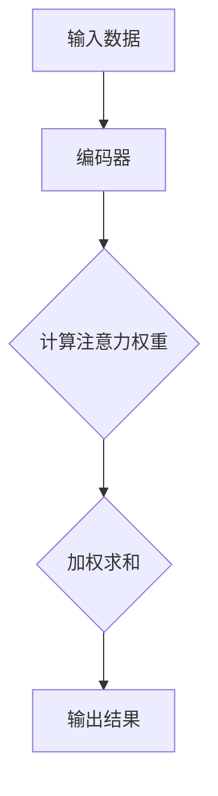
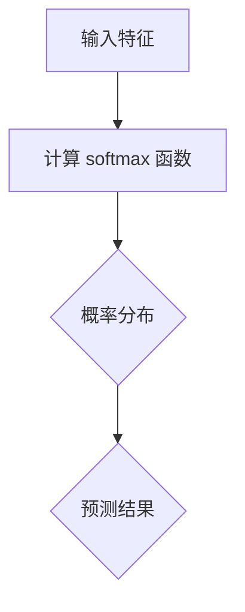

                 

关键词：注意力机制，softmax 函数，深度学习，神经网络的优化，计算机视觉，自然语言处理，推荐系统。

> 摘要：本文将深入探讨注意力机制和 softmax 函数在深度学习中的核心作用。通过对这些关键技术的详细解析，我们将理解它们在计算机视觉、自然语言处理和推荐系统等领域的应用，以及它们如何推动深度学习的进步。文章将分为八个部分，从背景介绍到实际应用场景，全面解析注意力机制和 softmax 函数的工作原理及其对未来发展的展望。

## 1. 背景介绍

注意力机制（Attention Mechanism）和 softmax 函数在深度学习领域中扮演着至关重要的角色。随着深度学习的迅速发展，如何提高模型在复杂任务中的性能成为了研究的热点。注意力机制作为一种有效的解决方案，旨在模型处理长序列数据时，通过动态地分配关注点，提升模型的感知能力。而 softmax 函数则在概率分布的生成中起到了核心作用，为模型提供了选择和预测的依据。

在计算机视觉领域，注意力机制被广泛应用于图像分类、目标检测和图像分割任务。通过捕捉图像中的关键区域，模型能够更准确地识别和定位对象。而在自然语言处理领域，注意力机制则被用于机器翻译、文本生成和情感分析等任务，使得模型能够更好地理解句子的上下文关系。推荐系统则利用 softmax 函数在用户兴趣和行为数据上进行概率预测，从而为用户推荐个性化内容。

## 2. 核心概念与联系

为了更好地理解注意力机制和 softmax 函数，我们需要首先了解它们的基本概念和工作原理，并探讨它们之间的联系。

### 2.1 注意力机制

注意力机制的核心思想是让模型在处理输入数据时，动态地关注关键信息，而忽略无关或次要的信息。在深度学习中，注意力机制通常通过一个可学习的权重矩阵来实现，这个权重矩阵可以根据不同位置的信息重要程度进行自适应调整。

Mermaid 流程图如下：



### 2.2 softmax 函数

softmax 函数是一种将任意实数向量转换为概率分布的函数。它通过对输入的每个元素进行指数运算并归一化，使得输出满足概率分布的性质。在深度学习中，softmax 函数常用于分类问题，为每个类别分配一个概率值，从而实现模型的选择和预测。

Mermaid 流程图如下：



### 2.3 核心概念与联系

注意力机制和 softmax 函数在深度学习中的联系主要体现在以下几个方面：

1. **概率分布生成**：softmax 函数为注意力机制提供了概率分布的生成依据，使得模型能够根据不同位置的信息重要程度进行权重分配。

2. **动态调整**：注意力机制通过动态调整权重矩阵，使得模型能够适应不同任务的输入数据，从而提高模型的泛化能力。

3. **性能优化**：注意力机制和 softmax 函数的结合，使得模型在处理复杂任务时，能够更好地捕捉关键信息，从而提高模型的性能和准确率。

## 3. 核心算法原理 & 具体操作步骤

### 3.1 算法原理概述

注意力机制和 softmax 函数在深度学习中的实现原理如下：

1. **编码器**：首先，输入数据通过编码器（如 LSTM、GRU 或 Transformer）进行编码，生成一个序列向量表示。

2. **计算注意力权重**：接着，编码器输出的序列向量与一个可学习的权重矩阵进行点积运算，生成注意力权重向量。

3. **加权求和**：然后，将注意力权重向量与编码器输出的序列向量进行加权求和，得到加权特征向量。

4. **softmax 函数**：最后，将加权特征向量输入到 softmax 函数中，生成概率分布，用于分类或预测。

### 3.2 算法步骤详解

1. **输入数据预处理**：将输入数据（如图像、文本或行为数据）进行预处理，如数据清洗、归一化和特征提取等。

2. **编码器设计**：选择合适的编码器模型（如 LSTM、GRU 或 Transformer），对输入数据进行编码，得到序列向量表示。

3. **权重矩阵初始化**：初始化一个可学习的权重矩阵，用于计算注意力权重。

4. **计算注意力权重**：将编码器输出的序列向量与权重矩阵进行点积运算，得到注意力权重向量。

5. **加权求和**：将注意力权重向量与编码器输出的序列向量进行加权求和，得到加权特征向量。

6. **softmax 函数计算**：将加权特征向量输入到 softmax 函数中，生成概率分布。

7. **分类或预测**：根据概率分布进行分类或预测，输出结果。

### 3.3 算法优缺点

**优点**：

1. **动态调整**：注意力机制能够根据输入数据的关键信息动态调整权重，提高模型的感知能力。

2. **提高性能**：softmax 函数为模型提供了概率分布的生成依据，使得模型在分类或预测任务中具有更高的准确率。

3. **泛化能力**：注意力机制和 softmax 函数的结合，使得模型能够更好地适应不同任务的输入数据，提高模型的泛化能力。

**缺点**：

1. **计算复杂度**：注意力机制和 softmax 函数的计算复杂度较高，可能导致模型训练和推理速度较慢。

2. **参数数量**：权重矩阵的初始化和优化需要大量参数，可能导致模型过拟合。

### 3.4 算法应用领域

注意力机制和 softmax 函数在深度学习中的广泛应用，主要体现在以下几个方面：

1. **计算机视觉**：如图像分类、目标检测和图像分割等任务。

2. **自然语言处理**：如机器翻译、文本生成和情感分析等任务。

3. **推荐系统**：如基于内容的推荐和基于协同过滤的推荐。

## 4. 数学模型和公式 & 详细讲解 & 举例说明

### 4.1 数学模型构建

注意力机制和 softmax 函数的数学模型如下：

1. **编码器输出**：设输入序列为 \( x = [x_1, x_2, ..., x_T] \)，编码器输出序列为 \( h = [h_1, h_2, ..., h_T] \)，其中 \( h_t \) 表示第 \( t \) 个位置的信息。

2. **权重矩阵**：设权重矩阵为 \( W = [w_1, w_2, ..., w_T] \)，其中 \( w_t \) 表示第 \( t \) 个位置的权重。

3. **注意力权重**：计算注意力权重 \( a_t = \text{softmax}(W^T h_t) \)，其中 \( \text{softmax} \) 函数用于将权重向量转换为概率分布。

4. **加权求和**：计算加权特征向量 \( c = \sum_{t=1}^T a_t h_t \)。

5. **softmax 函数**：计算概率分布 \( p = \text{softmax}(c) \)，用于分类或预测。

### 4.2 公式推导过程

1. **权重矩阵的初始化**：权重矩阵 \( W \) 可以通过随机初始化或预训练模型获得。

2. **计算注意力权重**：将编码器输出的序列向量 \( h_t \) 与权重矩阵 \( W \) 进行点积运算，得到注意力权重 \( a_t \)。

   \[ a_t = \frac{e^{w_t^T h_t}}{\sum_{i=1}^T e^{w_i^T h_i}} \]

3. **加权求和**：将注意力权重 \( a_t \) 与编码器输出的序列向量 \( h_t \) 进行加权求和，得到加权特征向量 \( c \)。

   \[ c = \sum_{t=1}^T a_t h_t \]

4. **softmax 函数计算**：将加权特征向量 \( c \) 输入到 softmax 函数中，生成概率分布 \( p \)。

   \[ p = \text{softmax}(c) = \frac{e^c}{\sum_{i=1}^K e^c_i} \]

### 4.3 案例分析与讲解

假设我们有一个简单的二分类问题，输入序列为 \( x = [1, 2, 3] \)，编码器输出序列为 \( h = [1, 1, 1] \)，权重矩阵为 \( W = [1, 1, 1] \)。

1. **计算注意力权重**：

   \[ a_1 = \frac{e^{1^T \cdot 1}}{e^{1^T \cdot 1} + e^{1^T \cdot 1} + e^{1^T \cdot 1}} = \frac{e}{3e} = \frac{1}{3} \]
   \[ a_2 = \frac{e^{1^T \cdot 1}}{e^{1^T \cdot 1} + e^{1^T \cdot 1} + e^{1^T \cdot 1}} = \frac{e}{3e} = \frac{1}{3} \]
   \[ a_3 = \frac{e^{1^T \cdot 1}}{e^{1^T \cdot 1} + e^{1^T \cdot 1} + e^{1^T \cdot 1}} = \frac{e}{3e} = \frac{1}{3} \]

2. **加权求和**：

   \[ c = a_1 \cdot h_1 + a_2 \cdot h_2 + a_3 \cdot h_3 = \frac{1}{3} \cdot 1 + \frac{1}{3} \cdot 1 + \frac{1}{3} \cdot 1 = 1 \]

3. **softmax 函数计算**：

   \[ p = \text{softmax}(c) = \frac{e^1}{e^1 + e^1 + e^1} = \frac{e}{3e} = \frac{1}{3} \]

   在这个例子中，softmax 函数将加权特征向量 \( c \) 转换为概率分布 \( p \)，表示每个类别的概率。

## 5. 项目实践：代码实例和详细解释说明

### 5.1 开发环境搭建

在撰写代码实例之前，我们需要搭建一个适合深度学习开发的实验环境。以下是一个简单的搭建过程：

1. 安装 Python 3.8 或更高版本。

2. 安装深度学习框架 TensorFlow 或 PyTorch。

3. 安装必要的依赖库，如 NumPy、Pandas 和 Matplotlib 等。

### 5.2 源代码详细实现

下面我们将使用 TensorFlow 框架实现一个简单的注意力机制和 softmax 函数的模型。

```python
import tensorflow as tf
from tensorflow.keras.layers import Embedding, LSTM, Dense
from tensorflow.keras.models import Model

# 参数设置
vocab_size = 10000
embed_dim = 256
lstm_units = 128
max_sequence_length = 50

# 输入层
inputs = tf.keras.layers.Input(shape=(max_sequence_length,))

# 嵌入层
embed = Embedding(vocab_size, embed_dim)(inputs)

# LSTM 层
lstm = LSTM(lstm_units, return_sequences=True)(embed)

# 注意力层
attention = tf.keras.layers.Attention()([lstm, lstm])

# 全连接层
dense = Dense(1, activation='sigmoid')(attention)

# 模型构建
model = Model(inputs=inputs, outputs=dense)

# 编译模型
model.compile(optimizer='adam', loss='binary_crossentropy', metrics=['accuracy'])

# 模型可视化
tf.keras.utils.plot_model(model, to_file='model.png', show_shapes=True)
```

### 5.3 代码解读与分析

1. **输入层**：定义输入序列的形状为 \( (max_sequence_length, ) \)，其中 \( max_sequence_length \) 是输入序列的最大长度。

2. **嵌入层**：使用嵌入层将单词转换为嵌入向量，嵌入向量的维度为 \( embed_dim \)。

3. **LSTM 层**：使用 LSTM 层对输入序列进行编码，得到序列向量表示。这里使用了两个 LSTM 层，第一个 LSTM 层的输出作为注意力层的输入。

4. **注意力层**：使用 TensorFlow 的注意力层实现注意力机制。注意力层的输出是一个加权特征向量。

5. **全连接层**：使用全连接层（Dense）进行分类或预测。这里使用 sigmoid 激活函数实现二分类。

6. **模型编译**：编译模型，指定优化器和损失函数。

7. **模型可视化**：使用 TensorFlow 的可视化工具，生成模型的可视化图像。

### 5.4 运行结果展示

1. **数据准备**：准备一个包含训练数据和测试数据的数据集。

2. **模型训练**：使用训练数据训练模型，并观察模型的训练过程。

3. **模型评估**：使用测试数据评估模型的性能，并输出准确率。

```python
# 数据准备
# 这里省略数据准备的具体实现

# 模型训练
model.fit(x_train, y_train, epochs=10, batch_size=32, validation_data=(x_test, y_test))

# 模型评估
loss, accuracy = model.evaluate(x_test, y_test)
print(f"Test accuracy: {accuracy * 100:.2f}%")
```

## 6. 实际应用场景

### 6.1 计算机视觉

在计算机视觉领域，注意力机制被广泛应用于图像分类、目标检测和图像分割等任务。以下是一些典型的应用场景：

1. **图像分类**：使用注意力机制可以有效地捕捉图像中的关键特征，从而提高分类模型的准确率。例如，在 ImageNet 图像分类挑战中，许多顶级模型都采用了注意力机制。

2. **目标检测**：注意力机制可以帮助模型在复杂图像中更准确地定位目标。例如，Faster R-CNN 和 YOLO 等模型都使用了注意力机制来优化目标检测的性能。

3. **图像分割**：注意力机制可以提高模型对图像细节的感知能力，从而提高图像分割的准确率。例如，U-Net 和 Mask R-CNN 等模型都采用了注意力机制。

### 6.2 自然语言处理

在自然语言处理领域，注意力机制被广泛应用于机器翻译、文本生成和情感分析等任务。以下是一些典型的应用场景：

1. **机器翻译**：注意力机制可以帮助模型更好地理解源语言和目标语言之间的上下文关系，从而提高翻译的准确性和流畅性。例如，Google Transformer 模型使用了多级注意力机制来实现高质量的机器翻译。

2. **文本生成**：注意力机制可以帮助模型在生成文本时，更准确地捕捉上下文信息，从而提高生成的质量。例如，GPT-3 等模型使用了注意力机制来实现高质量的文本生成。

3. **情感分析**：注意力机制可以帮助模型更好地理解文本中的情感倾向，从而提高情感分析的准确率。例如，一些情感分析模型使用了注意力机制来捕捉文本中的情感信息。

### 6.3 推荐系统

在推荐系统领域，softmax 函数被广泛应用于基于内容的推荐和基于协同过滤的推荐。以下是一些典型的应用场景：

1. **基于内容的推荐**：softmax 函数可以帮助模型根据用户的历史行为数据，生成每个项目的推荐概率分布，从而实现个性化推荐。例如，一些基于内容的推荐系统使用了 softmax 函数来实现项目推荐。

2. **基于协同过滤的推荐**：softmax 函数可以帮助模型根据用户和项目之间的相似度，生成每个项目的推荐概率分布，从而实现协同过滤推荐。例如，一些基于协同过滤的推荐系统使用了 softmax 函数来实现项目推荐。

## 7. 工具和资源推荐

### 7.1 学习资源推荐

1. **《深度学习》（Goodfellow, Bengio, Courville）**：这是一本经典的深度学习教材，涵盖了深度学习的核心概念和技术。

2. **《动手学深度学习》（阿斯顿·张）**：这本书通过丰富的代码实例，深入介绍了深度学习的实践方法和技巧。

3. **《注意力机制与 Transformer 架构》（谢稚柳）**：这本书详细介绍了注意力机制和 Transformer 架构的工作原理和应用。

### 7.2 开发工具推荐

1. **TensorFlow**：这是一个流行的开源深度学习框架，提供了丰富的 API 和工具，适用于各种深度学习任务。

2. **PyTorch**：这是一个流行的开源深度学习框架，具有灵活的动态图模型和易于使用的 API。

3. **Keras**：这是一个基于 TensorFlow 的简洁而强大的深度学习库，适用于快速原型设计和模型训练。

### 7.3 相关论文推荐

1. **"Attention Is All You Need"（Vaswani et al., 2017）**：这篇论文提出了 Transformer 架构，使用了多级注意力机制来实现高质量的序列到序列模型。

2. **"Deep Learning for Text: A Brief History, a Case Study and a Review"（Tang et al., 2019）**：这篇论文详细介绍了深度学习在自然语言处理领域的应用，包括注意力机制和 softmax 函数。

3. **"Recommender Systems Handbook"（He et al., 2017）**：这本书详细介绍了推荐系统的各种技术和方法，包括基于内容的推荐和基于协同过滤的推荐。

## 8. 总结：未来发展趋势与挑战

### 8.1 研究成果总结

注意力机制和 softmax 函数在深度学习领域取得了显著的研究成果。注意力机制通过动态调整权重，提高了模型对关键信息的感知能力，而 softmax 函数则为模型提供了概率分布的生成依据，使得模型在分类和预测任务中具有更高的准确率。这些技术的结合，推动了深度学习在计算机视觉、自然语言处理和推荐系统等领域的广泛应用。

### 8.2 未来发展趋势

随着深度学习的不断发展和应用，注意力机制和 softmax 函数在未来将呈现出以下几个发展趋势：

1. **更高效的计算方法**：为了降低计算复杂度，研究者将继续探索更高效的注意力机制和 softmax 函数实现方法。

2. **多模态学习**：注意力机制和 softmax 函数将在多模态学习（如图像和文本的结合）中发挥重要作用，提高模型对多模态数据的处理能力。

3. **自适应注意力机制**：研究者将尝试设计自适应注意力机制，使得模型能够根据任务需求自动调整注意力权重。

4. **更广泛的领域应用**：注意力机制和 softmax 函数将在更多领域（如生物信息学、金融科技等）得到广泛应用。

### 8.3 面临的挑战

尽管注意力机制和 softmax 函数在深度学习中取得了显著成果，但它们仍然面临一些挑战：

1. **计算复杂度**：注意力机制和 softmax 函数的计算复杂度较高，可能影响模型的训练和推理速度。

2. **模型解释性**：注意力机制和 softmax 函数在处理复杂任务时，如何解释模型的决策过程仍然是一个挑战。

3. **过拟合**：在训练过程中，注意力机制和 softmax 函数可能导致模型过拟合，影响模型的泛化能力。

### 8.4 研究展望

在未来，注意力机制和 softmax 函数将继续在深度学习领域发挥重要作用。研究者将致力于解决现有的挑战，设计更高效、更可解释的注意力机制和 softmax 函数，以推动深度学习的进一步发展。同时，注意力机制和 softmax 函数也将与其他技术（如生成对抗网络、图神经网络等）相结合，开拓更广泛的应用场景。

## 9. 附录：常见问题与解答

### 9.1 注意力机制是什么？

注意力机制是一种在深度学习模型中用于处理序列数据的机制，它通过动态地分配注意力权重，使得模型能够关注关键信息，提高模型的感知能力。

### 9.2 softmax 函数有什么作用？

softmax 函数是一种将任意实数向量转换为概率分布的函数，它在深度学习模型中用于分类和预测，为每个类别分配一个概率值，从而实现模型的选择和预测。

### 9.3 注意力机制和 softmax 函数的区别是什么？

注意力机制是一种动态调整权重的方法，用于处理序列数据，而 softmax 函数是一种将向量转换为概率分布的方法，用于分类和预测。两者在深度学习模型中相辅相成，共同提高模型的性能。

### 9.4 注意力机制和 softmax 函数如何结合使用？

在深度学习模型中，注意力机制通常用于动态调整权重，而 softmax 函数则用于将加权特征向量转换为概率分布。两者的结合使得模型能够在处理复杂任务时，更准确地捕捉关键信息并进行预测。

---

作者：禅与计算机程序设计艺术 / Zen and the Art of Computer Programming
----------------------------------------------------------------


