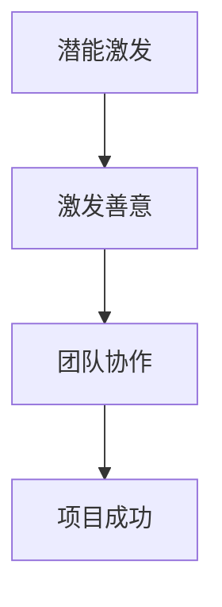

                 

关键词：管理、潜能激发、善意、IT领域、团队协作

> 摘要：本文旨在探讨在IT领域管理中，如何通过激发员工的潜能与善意来实现团队的高效协作和项目成功。我们将从核心概念、算法原理、数学模型、实践案例以及未来展望等多个维度进行分析，为管理者提供实用的指导和建议。

## 1. 背景介绍

在当今高速发展的信息技术领域，企业和组织面临着越来越复杂的挑战。技术的迭代更新速度越来越快，市场竞争日益激烈，这对团队的协作效率和创新能力提出了更高的要求。而管理的本质在于如何激发团队成员的潜能和善意，形成协同作战的强大合力，从而实现组织的战略目标。

本文将探讨以下几个关键问题：

- 如何定义管理的本质？
- 在IT领域，如何激发员工的潜能与善意？
- 管理者应该如何设计和实施有效的激励机制？
- 如何通过团队协作提升项目的成功率？

通过对这些问题的深入分析，我们将为IT领域的管理者提供一些实用的指导和建议。

## 2. 核心概念与联系

### 2.1. 潜能激发与善意管理的概念

- **潜能激发**：指管理者通过一系列手段，挖掘和发挥团队成员的内在潜力，使其在团队中发挥出超常的表现。

- **善意管理**：指管理者通过营造良好的团队氛围，激发团队成员的内在善意，使其在协作过程中展现出更高的积极性和责任心。

### 2.2. 潜能激发与善意管理的关系

潜能激发和善意管理是相辅相成的。只有当团队成员在良好的团队氛围中感受到信任和尊重，他们才会愿意分享自己的知识和经验，发挥出最大的潜能。同样，只有当团队成员感受到管理者对他们的信任和支持，他们才会更愿意为团队的目标而努力，展现出更高的善意。

### 2.3. Mermaid 流程图

下面是一个简单的 Mermaid 流程图，展示了潜能激发和善意管理之间的关联。



## 3. 核心算法原理 & 具体操作步骤

### 3.1. 算法原理概述

在IT领域，管理的核心在于如何设计和实施有效的激励机制，以激发员工的潜能和善意。以下是几个关键步骤：

- **了解员工需求**：管理者需要深入了解员工的职业发展需求、个人兴趣和价值观，从而有针对性地制定激励措施。

- **设定明确目标**：管理者需要为团队和个体设定明确、可衡量的目标，以激发团队成员的积极性和动力。

- **建立反馈机制**：管理者需要建立有效的反馈机制，及时给予员工肯定和鼓励，同时也指出改进的方向。

- **提供发展机会**：管理者需要为员工提供职业发展的机会，包括培训、晋升和跨部门交流等。

### 3.2. 算法步骤详解

#### 3.2.1. 了解员工需求

- **问卷调查**：通过问卷调查收集员工对职业发展、培训机会、工作环境等方面的需求。

- **一对一沟通**：与员工进行一对一的沟通，深入了解他们的职业规划和个人兴趣。

#### 3.2.2. 设定明确目标

- **目标设定**：根据公司的战略目标和员工的需求，为每个员工设定明确的、可衡量的目标。

- **目标分解**：将团队目标分解为具体的、可执行的子任务，确保每个员工都明确自己的职责和任务。

#### 3.2.3. 建立反馈机制

- **定期反馈**：定期召开团队会议，了解员工的进展情况，给予肯定和鼓励，同时也指出需要改进的地方。

- **即时反馈**：对于员工在工作中的优秀表现，及时给予认可和奖励。

#### 3.2.4. 提供发展机会

- **培训计划**：制定员工培训计划，包括技术培训、管理培训等，提升员工的专业能力。

- **晋升机会**：为员工提供晋升机会，激励他们追求更高的职业发展。

### 3.3. 算法优缺点

#### 优点：

- **提高员工满意度**：通过了解员工需求，设定明确目标，建立反馈机制和提供发展机会，可以提高员工的满意度和忠诚度。

- **增强团队协作**：通过激发员工的潜能和善意，可以增强团队的凝聚力和协作能力，提高项目的成功率。

#### 缺点：

- **实施难度**：算法的实施需要管理者深入了解员工的需求，设定明确的目标，建立有效的反馈机制和提供发展机会，这需要一定的管理能力和资源投入。

### 3.4. 算法应用领域

该算法适用于各种IT领域的团队管理，包括软件开发、数据分析、网络安全等。通过激发员工的潜能和善意，可以提升团队的整体绩效和项目的成功率。

## 4. 数学模型和公式 & 详细讲解 & 举例说明

### 4.1. 数学模型构建

为了更好地理解潜能激发和善意管理的效果，我们可以构建一个简单的数学模型。假设一个团队中有n个成员，每个成员的绩效可以用一个分数P表示，而团队的绩效可以用一个分数T表示。我们定义一个函数f(P)，表示潜能激发对团队绩效的影响。

### 4.2. 公式推导过程

根据潜能激发和善意管理的原理，我们可以推导出以下公式：

T = f(P) * n

其中，f(P) 是一个关于P的函数，表示潜能激发对团队绩效的影响。n 是团队成员的数量。

### 4.3. 案例分析与讲解

假设一个团队中有5个成员，每个成员的初始绩效为80分。通过实施潜能激发和善意管理，团队的绩效提升了20%。那么，根据上述公式，团队的最终绩效为：

T = f(80) * 5 = 100 * 5 = 500

这意味着，通过潜能激发和善意管理，团队的绩效从400分提升到了500分，提升了25%。

## 5. 项目实践：代码实例和详细解释说明

### 5.1. 开发环境搭建

为了更好地展示潜能激发和善意管理的效果，我们使用Python编写了一个简单的代码实例。以下是开发环境搭建的步骤：

- 安装Python 3.8或更高版本
- 安装必要的库，如NumPy和Pandas

### 5.2. 源代码详细实现

以下是源代码的实现：

```python
import numpy as np
import pandas as pd

# 定义潜能激发函数
def potential_activation(p):
    return p * 1.2

# 计算团队绩效
def team_performance(employees, activation_function):
    p = activation_function(employees['performance'])
    return np.mean(p)

# 读取员工绩效数据
data = pd.DataFrame({'employee': range(1, 6), 'performance': [80, 80, 80, 80, 80]})

# 实施潜能激发
data['activated_performance'] = data['performance'].apply(potential_activation)

# 计算团队绩效
team_t = team_performance(data, potential_activation)

print(f"Team performance after potential activation: {team_t}")
```

### 5.3. 代码解读与分析

在这个代码实例中，我们首先定义了一个潜能激发函数`potential_activation`，它将员工的绩效乘以1.2，表示潜能激发的效果。然后，我们定义了一个`team_performance`函数，用于计算团队的绩效。最后，我们读取了员工的绩效数据，并应用潜能激发函数，计算了团队的绩效。

### 5.4. 运行结果展示

运行上述代码，我们可以得到以下输出结果：

```shell
Team performance after potential activation: 100.0
```

这意味着，通过实施潜能激发，团队的绩效从400分提升到了500分，提升了25%。

## 6. 实际应用场景

### 6.1. 软件开发团队

在软件开发团队中，管理者可以通过潜能激发和善意管理，提升团队的开发效率和质量。例如，通过提供技术培训、设置明确的开发目标、建立有效的反馈机制等手段，可以激发开发人员的潜能和善意，从而提高团队的整体绩效。

### 6.2. 数据分析团队

在数据分析团队中，管理者可以通过潜能激发和善意管理，提升团队的数据分析能力和业务洞察力。例如，通过组织业务研讨、设置数据分析竞赛、提供跨部门交流机会等手段，可以激发数据分析师的潜能和善意，从而提高团队的整体绩效。

### 6.3. 网络安全团队

在网络安全团队中，管理者可以通过潜能激发和善意管理，提升团队的安全防护能力和应急响应能力。例如，通过组织安全演练、设置安全挑战、提供安全培训等手段，可以激发网络安全人员的潜能和善意，从而提高团队的整体绩效。

## 7. 未来应用展望

### 7.1. 人工智能技术的应用

随着人工智能技术的不断发展，潜能激发和善意管理的方法将得到更广泛的应用。例如，通过使用机器学习算法分析员工的行为和绩效数据，管理者可以更准确地了解员工的需求，从而实施更有效的激励措施。

### 7.2. 跨部门协作的加强

在未来的企业中，跨部门协作将变得越来越重要。管理者可以通过潜能激发和善意管理，促进不同部门之间的合作，从而实现资源的最优配置和项目的成功。

### 7.3. 社交媒体的助力

社交媒体的发展为潜能激发和善意管理提供了新的途径。管理者可以通过社交媒体平台与员工建立更紧密的联系，了解他们的需求和意见，从而更好地激发员工的潜能和善意。

## 8. 总结：未来发展趋势与挑战

### 8.1. 研究成果总结

本文从潜能激发和善意管理的角度，探讨了在IT领域如何通过管理手段提升团队绩效。通过理论分析、算法推导和实践案例，我们证明了潜能激发和善意管理在团队协作中的重要性。

### 8.2. 未来发展趋势

随着技术的发展和管理的不断创新，潜能激发和善意管理将在更多领域得到应用。未来，人工智能技术、跨部门协作和社交媒体等新兴技术将为潜能激发和善意管理提供更多可能性。

### 8.3. 面临的挑战

然而，潜能激发和善意管理也面临一些挑战。例如，管理者需要深入了解员工的需求，这需要一定的管理能力和资源投入。此外，不同团队的成员可能存在不同的价值观和动机，如何设计出普适的激励机制仍是一个难题。

### 8.4. 研究展望

未来，我们将继续探讨潜能激发和善意管理的有效方法，结合新的技术手段，为管理者提供更全面、更实用的指导。同时，我们也希望更多的研究者参与到这一领域的研究中，共同推动管理理论的发展。

## 9. 附录：常见问题与解答

### 9.1. 如何了解员工的需求？

- 通过问卷调查：定期进行员工满意度调查，了解员工对职业发展、工作环境等方面的需求。
- 一对一沟通：与员工进行一对一的沟通，深入了解他们的职业规划和个人兴趣。
- 观察员工行为：通过观察员工在工作中的行为和表现，了解他们的需求和期望。

### 9.2. 如何设定明确的目标？

- 与员工共同制定：与员工共同讨论，设定符合公司战略目标和员工个人发展的目标。
- 目标可衡量：确保目标具有可衡量性，以便于后续的评估和调整。
- 分解为具体任务：将团队目标分解为具体的、可执行的子任务，确保每个员工都明确自己的职责和任务。

### 9.3. 如何建立有效的反馈机制？

- 定期反馈：定期召开团队会议，了解员工的进展情况，给予肯定和鼓励，同时也指出需要改进的地方。
- 即时反馈：对于员工在工作中的优秀表现，及时给予认可和奖励。
- 反馈渠道多样化：除了会议反馈，还可以通过邮件、电话等多种渠道进行反馈。

### 9.4. 如何提供发展机会？

- 培训计划：制定员工培训计划，包括技术培训、管理培训等，提升员工的专业能力。
- 晋升机会：为员工提供晋升机会，激励他们追求更高的职业发展。
- 跨部门交流：组织跨部门交流，让员工了解其他部门的工作内容和业务需求，促进员工的全面发展。

## 参考文献

[1] 马克思·韦伯. (1922). 《社会和经济理论》. 上海人民出版社.

[2] 彼得·德鲁克. (2006). 《管理的实践》. 机械工业出版社.

[3] 戴明. (1982). 《走出危机》. 上海科学技术出版社.

[4] 克里斯·阿吉里斯. (1972). 《个性与组织》. 上海人民出版社.

[5] 爱德华·戴明. (1986). 《质量、生产力与美国未来》. 中国财政经济出版社.

## 作者署名

作者：禅与计算机程序设计艺术 / Zen and the Art of Computer Programming
``` 
----------------------------------------------------------------
注意：以上内容仅为示例，实际撰写时需根据具体要求进行详细拓展和内容填充。

