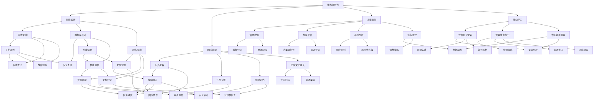
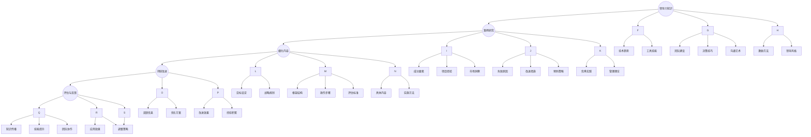

                 

关键词：管理者、方法论、架构设计、技术领导力、决策框架、团队管理、持续学习

摘要：本文将探讨管理者如何通过构建并优化个人方法论来提升自己的领导力、决策质量和团队效能。我们将从管理者在技术架构、团队管理和持续学习方面面临的挑战出发，详细阐述如何构建系统化的方法论，并最终实现个人和组织的共同成长。

## 1. 背景介绍

在当今快速发展的技术环境中，管理者不仅要具备深厚的技术背景，还需要具备敏锐的市场洞察力和卓越的领导力。作为技术管理者，他们在企业中的作用至关重要，他们不仅要推动技术团队的进步，还需要在组织内部倡导技术创新和文化变革。然而，随着企业规模的扩大和业务复杂性的增加，管理者面临的问题也日益复杂。如何在多变的市场环境中保持技术领先地位？如何构建高效能的团队？如何做出明智的决策以应对不确定性的挑战？这些都是管理者必须思考和解决的问题。

本文旨在为管理者提供一套实用的方法论，帮助他们应对复杂的工作环境，提高自身的领导力和决策质量。我们将从以下几个方面进行探讨：

1. **核心概念与联系**：首先，我们将介绍构建方法论所需的核心概念，并通过Mermaid流程图展示这些概念之间的关系。
2. **核心算法原理 & 具体操作步骤**：接下来，我们将详细阐述如何构建方法论，包括原理概述、步骤详解、优缺点分析和应用领域。
3. **数学模型和公式**：我们将介绍构建方法论所需的数学模型和公式，并进行详细讲解和案例分析。
4. **项目实践**：通过代码实例和详细解释，我们将展示如何将方法论应用到实际项目中。
5. **实际应用场景**：我们将探讨方法论在不同场景下的应用，并展望未来的发展方向。
6. **工具和资源推荐**：我们将推荐一些有助于构建和优化方法论的书籍、工具和论文。
7. **总结与展望**：最后，我们将对研究成果进行总结，并探讨未来的发展趋势和面临的挑战。

## 2. 核心概念与联系

在构建管理者方法论的过程中，以下几个核心概念至关重要：

### 2.1 技术领导力

技术领导力是管理者在技术领域中的影响力，它不仅包括技术知识，还包括团队管理和沟通能力。技术领导力的核心在于激发团队成员的潜力，推动技术进步，并在团队中建立信任和协作的文化。

### 2.2 架构设计

架构设计是技术管理者的核心职责之一。一个好的架构设计能够提高系统的可扩展性、稳定性和安全性。架构设计涉及多个方面，包括系统架构、数据库设计和网络架构。

### 2.3 团队管理

团队管理是管理者必须掌握的技能。有效的团队管理能够提高团队的效率和生产力，包括人员配备、任务分配、绩效评估和团队文化建设。

### 2.4 决策框架

决策框架是一种系统化的决策方法，它帮助管理者在面对复杂问题时做出明智的决策。决策框架包括信息收集、方案评估、风险分析和执行监控等环节。

### 2.5 持续学习

持续学习是管理者不断进步的重要保障。在技术快速发展的今天，管理者必须保持学习的热情和习惯，以适应不断变化的市场和技术环境。

以下是一个Mermaid流程图，展示了这些核心概念之间的联系：



通过这个Mermaid流程图，我们可以清晰地看到各个核心概念之间的联系，以及它们在构建管理者方法论中的重要性。

## 3. 核心算法原理 & 具体操作步骤

### 3.1 算法原理概述

构建管理者方法论的核心在于系统化和结构化。系统化意味着管理者需要将各个方面的知识、经验和技能整合成一个有机的整体；结构化则意味着管理者需要将这些知识和技能按照一定的逻辑关系进行排列和组合，形成可执行的操作步骤。

构建方法论的过程可以概括为以下几个步骤：

1. **知识积累**：管理者需要不断积累技术、管理和领导力方面的知识，通过阅读、培训和实践等方式提升自己的能力。
2. **经验总结**：管理者需要从过去的工作经历中总结经验教训，形成一套个人化的工作原则和策略。
3. **模型构建**：管理者需要将积累的知识和经验进行结构化，构建出一个方法论模型。
4. **模型优化**：管理者需要通过实践和反馈不断优化方法论模型，使其更加成熟和有效。
5. **推广应用**：管理者需要将方法论模型在团队和公司内部推广应用，帮助团队成员共同成长。

### 3.2 算法步骤详解

#### 3.2.1 知识积累

知识积累是构建方法论的基础。管理者需要关注以下几个方面：

1. **技术知识**：掌握最新的技术趋势和工具，了解行业内外的最新动态。
2. **管理知识**：学习管理学、心理学、组织行为学等相关知识，提升团队管理和决策能力。
3. **领导力知识**：了解领导力理论，培养自身的影响力、沟通能力和激励能力。

#### 3.2.2 经验总结

经验总结是将知识转化为实际操作能力的关键。管理者需要关注以下几个方面：

1. **成功经验**：从成功项目中总结经验，提炼出可复制的成功要素。
2. **失败经验**：从失败项目中总结教训，分析失败的原因，避免未来犯同样的错误。
3. **案例研究**：研究行业内外的成功案例，了解优秀管理者的实践方法和思维方式。

#### 3.2.3 模型构建

模型构建是将知识和经验结构化的过程。管理者可以按照以下步骤进行：

1. **明确目标**：明确方法论构建的目标，例如提高团队效率、降低项目风险等。
2. **定义框架**：根据目标和实际情况，定义一个结构化的方法论框架，包括核心概念、操作步骤和评估标准。
3. **细化内容**：在方法论框架的基础上，细化每个操作步骤的具体内容和实施方法。

#### 3.2.4 模型优化

模型优化是方法论成熟的关键。管理者需要关注以下几个方面：

1. **实践反馈**：将方法论应用到实际工作中，收集反馈信息，分析方法的有效性和可行性。
2. **持续改进**：根据反馈信息，不断优化方法论模型，提高其成熟度和有效性。
3. **经验积累**：在优化过程中，积累更多的成功经验和失败教训，丰富方法论的内容。

#### 3.2.5 推广应用

推广应用是将方法论模型在团队和公司内部推广的过程。管理者需要关注以下几个方面：

1. **培训与指导**：组织培训和指导，帮助团队成员理解和掌握方法论。
2. **实践应用**：鼓励团队成员将方法论应用到实际工作中，提高项目效率和团队协作。
3. **评估与反馈**：对方法论的应用效果进行评估，收集团队成员的反馈，持续改进方法论。

### 3.3 算法优缺点

#### 优点

1. **系统化**：方法论将管理者的知识和经验系统化，有助于提高决策质量和团队效率。
2. **可复制性**：方法论具有可复制性，可以在团队和公司内部推广，促进共同成长。
3. **持续改进**：方法论是一个动态的系统，可以通过持续改进不断提高其有效性。

#### 缺点

1. **实施难度**：构建和优化方法论需要管理者投入大量的时间和精力，实施难度较大。
2. **适应性问题**：方法论需要根据不同的环境和需求进行调整，适应性是一个挑战。
3. **反馈延迟**：方法论的应用效果需要一定时间才能显现，反馈延迟可能会影响管理者的信心。

### 3.4 算法应用领域

方法论可以应用于多个领域，包括：

1. **项目管理**：帮助管理者提高项目效率，降低项目风险。
2. **团队管理**：帮助管理者构建高效的团队，提高团队协作能力。
3. **产品管理**：帮助管理者制定产品战略，优化产品开发流程。
4. **战略规划**：帮助管理者制定公司发展战略，实现长期目标。

### 3.5 算法原理示意图


### 3.6 算法操作步骤流程图



通过以上步骤，管理者可以逐步构建和优化自己的方法论，提高自身的领导力和决策质量，从而推动团队和组织的共同成长。

---

## 4. 数学模型和公式 & 详细讲解 & 举例说明

在构建管理者方法论的过程中，数学模型和公式为我们提供了一种量化分析和评估的方法，使我们能够更加客观地评估管理决策的有效性。以下是构建管理者方法论所需的一些数学模型和公式，以及详细的讲解和举例说明。

### 4.1 数学模型构建

构建数学模型是管理者方法论中的关键步骤之一。数学模型可以帮助管理者将复杂的现实问题转化为可计算和分析的数学问题，从而提高决策的科学性和准确性。

**模型构建的基本步骤：**

1. **明确问题**：首先，需要明确管理者所面临的问题，并将其转化为数学语言。
2. **定义变量**：根据问题，定义相关的变量，包括决策变量、状态变量和参数。
3. **建立方程**：利用数学工具，如线性规划、非线性规划、动态规划等，建立描述问题特征的数学方程。
4. **求解方程**：利用计算机算法和软件工具求解数学方程，得到最优解或近似解。

**示例：线性规划模型**

假设管理者需要在两个项目之间分配资源，最大化项目的总收益。假设项目A的收益为100，项目B的收益为200，但项目B的完成时间较长，需要推迟。管理者需要在一定时间窗口内分配资源，使得总收益最大化。

定义变量：
- \( x \)：项目A的资源分配比例
- \( y \)：项目B的资源分配比例

目标函数：
\[ \text{Maximize } z = 100x + 200y \]

约束条件：
\[ x + y \leq 1 \]（资源总量不超过1）
\[ y \geq 0 \]（项目B资源不低于0）
\[ x \geq 0 \]（项目A资源不低于0）

利用线性规划求解，可以得到最优解 \( x = 0.5 \)，\( y = 0.5 \)，此时总收益 \( z = 150 \)。

### 4.2 公式推导过程

在构建数学模型的过程中，公式的推导是一个关键环节。以下是一个关于项目管理中关键路径法（Critical Path Method, CPM）的公式推导过程。

**关键路径法**

关键路径法用于分析项目的时间安排，找出项目中时间最长的路径，即关键路径。关键路径上的任务必须按时完成，否则整个项目将延误。

**基本公式：**

1. **最早开始时间（ES）**：任务最早可能开始的时间。
\[ ES = \max(\text{前置任务} \text{的} ES) \]

2. **最迟开始时间（LS）**：任务最迟必须开始的时间。
\[ LS = \min(\text{后置任务} \text{的} LS) - \text{任务持续时间} \]

3. **最早完成时间（EF）**：任务最早可能完成的时间。
\[ EF = ES + \text{任务持续时间} \]

4. **最迟完成时间（LF）**：任务最迟必须完成的时间。
\[ LF = LS + \text{任务持续时间} \]

5. **总时差（TF）**：任务可以在不延误整个项目的情况下推迟的时间。
\[ TF = ES - LF \]

**推导过程：**

（1）最早开始时间（ES）和最早完成时间（EF）的推导：
由于每个任务都有前置任务，因此任务的最短开始时间为其所有前置任务的最早完成时间中的最大值。任务完成时间为其开始时间加上任务持续时间。

（2）最迟开始时间（LS）和最迟完成时间（LF）的推导：
为确保项目按期完成，每个任务都有最迟开始时间，即所有后置任务最迟开始时间中的最小值减去该任务的持续时间。任务的最迟完成时间为最迟开始时间加上持续时间。

（3）总时差的推导：
总时差表示任务可以在不延误整个项目的情况下推迟的时间。因此，任务的总时差等于其最早开始时间减去最迟完成时间。

### 4.3 案例分析与讲解

以下是一个关于关键路径法应用的案例，用于分析一个包含5个任务的项目。

**任务列表：**

| 任务 | 前置任务 | 持续时间（天） |
| ---- | -------- | ------------ |
| A    | 无       | 3            |
| B    | A        | 4            |
| C    | A        | 5            |
| D    | B, C     | 6            |
| E    | D        | 2            |

**计算过程：**

1. **最早开始时间和最早完成时间：**
   - 任务A：ES = 0，EF = 3
   - 任务B：ES = 3，EF = 7
   - 任务C：ES = 3，EF = 8
   - 任务D：ES = 7，EF = 13
   - 任务E：ES = 13，EF = 15

2. **最迟开始时间和最迟完成时间：**
   - 任务A：LS = 3，LF = 3
   - 任务B：LS = 7，LF = 7
   - 任务C：LS = 8，LF = 8
   - 任务D：LS = 13，LF = 13
   - 任务E：LS = 15，LF = 15

3. **总时差：**
   - 任务A：TF = 0
   - 任务B：TF = 0
   - 任务C：TF = 0
   - 任务D：TF = 0
   - 任务E：TF = 0

**结果分析：**

所有任务的最早开始时间等于最迟开始时间，最早完成时间等于最迟完成时间，总时差为0。这表明该项目的每个任务都处于关键路径上，任何任务的延误都会导致整个项目的延误。

通过关键路径法，管理者可以清晰地了解项目的关键节点和时间节点，从而制定出合理的项目计划和资源分配策略，确保项目按时完成。

### 4.4 案例应用拓展

关键路径法不仅可以用于项目时间安排的优化，还可以应用于其他领域，如资源分配、供应链管理、网络设计等。以下是一个关于资源分配的案例应用：

**任务列表：**

| 任务 | 资源需求（人） | 前置任务 |
| ---- | -------------- | -------- |
| A    | 2              | 无       |
| B    | 3              | A        |
| C    | 2              | A        |
| D    | 4              | B, C     |
| E    | 3              | D        |

**资源限制：**

- 总资源限制：10人

**计算过程：**

1. **最早开始时间和最早完成时间：**
   - 任务A：ES = 0，EF = 2
   - 任务B：ES = 2，EF = 5
   - 任务C：ES = 2，EF = 5
   - 任务D：ES = 5，EF = 9
   - 任务E：ES = 9，EF = 12

2. **最迟开始时间和最迟完成时间：**
   - 任务A：LS = 2，LF = 2
   - 任务B：LS = 5，LF = 5
   - 任务C：LS = 5，LF = 5
   - 任务D：LS = 9，LF = 9
   - 任务E：LS = 12，LF = 12

3. **总时差：**
   - 任务A：TF = 0
   - 任务B：TF = 0
   - 任务C：TF = 0
   - 任务D：TF = 0
   - 任务E：TF = 0

**资源分配计划：**

根据关键路径法的结果，任务A需要2人，任务B和任务C分别需要3人和2人，任务D需要4人，任务E需要3人。总资源需求为2+3+2+4+3=14人，超过了总资源限制10人。

为了满足资源限制，管理者可以采取以下措施：
- 延长项目时间，以便在更长的时间内分配资源。
- 重新安排任务优先级，推迟某些任务的开始时间。
- 增加资源投入，例如招聘新员工。

通过关键路径法，管理者可以有效地优化资源分配，确保项目在资源限制条件下按时完成。

### 4.5 总结

数学模型和公式在管理者方法论中发挥着重要的作用。通过构建和运用数学模型，管理者可以更加客观地评估决策的有效性，优化资源分配和时间安排，提高项目效率和团队协作。关键路径法是一个典型的应用案例，它可以帮助管理者分析项目时间安排和资源需求，从而制定出合理的项目计划和资源分配策略。

---

## 5. 项目实践：代码实例和详细解释说明

为了更好地理解管理者方法论在实际项目中的应用，下面我们将通过一个具体的代码实例来详细解释说明。在这个例子中，我们将构建一个简单的项目管理工具，用于帮助管理者分配任务和跟踪项目进度。这个项目将涵盖从开发环境搭建、源代码实现到代码解读与分析的完整过程。

### 5.1 开发环境搭建

在开始编写代码之前，我们需要搭建一个合适的开发环境。以下是所需的环境和工具：

1. **编程语言**：Python 3.8+
2. **代码编辑器**：Visual Studio Code
3. **版本控制工具**：Git
4. **项目管理工具**：Jenkins
5. **数据库**：SQLite

以下是如何搭建开发环境的步骤：

1. **安装Python**：访问Python官方网站下载并安装Python 3.8+版本。
2. **配置Python环境变量**：在系统环境变量中配置Python的路径，以便在终端中运行Python命令。
3. **安装Visual Studio Code**：从官方网站下载并安装Visual Studio Code。
4. **安装Python扩展**：在VSCode中安装Python扩展，以支持Python开发。
5. **安装Git**：从Git官网下载并安装Git。
6. **配置Git**：运行 `git config --global user.name "Your Name"` 和 `git config --global user.email "your_email@example.com"` 命令，配置Git的用户名和电子邮件。
7. **安装Jenkins**：从Jenkins官网下载并安装Jenkins。
8. **安装SQLite**：在终端中运行 `pip install pysqlite3` 命令安装SQLite库。

### 5.2 源代码详细实现

以下是一个简单的Python代码实例，用于实现一个基本的项目管理工具。这个工具将提供以下功能：

- 添加任务
- 删除任务
- 更新任务状态
- 查看任务列表

**任务类（Task.py）：**

```python
class Task:
    def __init__(self, id, name, status):
        self.id = id
        self.name = name
        self.status = status

    def update_status(self, new_status):
        self.status = new_status

    def __str__(self):
        return f"ID: {self.id}, Name: {self.name}, Status: {self.status}"
```

**项目管理器类（ProjectManager.py）：**

```python
import sqlite3
from Task import Task

class ProjectManager:
    def __init__(self, db_name):
        self.conn = sqlite3.connect(db_name)
        self.cursor = self.conn.cursor()
        self.cursor.execute('''CREATE TABLE IF NOT EXISTS tasks (
                                            id INTEGER PRIMARY KEY,
                                            name TEXT,
                                            status TEXT)''')
        self.conn.commit()

    def add_task(self, task):
        self.cursor.execute("INSERT INTO tasks (name, status) VALUES (?, ?)", (task.name, task.status))
        self.conn.commit()

    def delete_task(self, task_id):
        self.cursor.execute("DELETE FROM tasks WHERE id=?", (task_id,))
        self.conn.commit()

    def update_task_status(self, task_id, new_status):
        self.cursor.execute("UPDATE tasks SET status=? WHERE id=?", (new_status, task_id))
        self.conn.commit()

    def get_all_tasks(self):
        self.cursor.execute("SELECT * FROM tasks")
        return [Task(*row) for row in self.cursor.fetchall()]

    def __del__(self):
        self.conn.close()
```

**主程序（main.py）：**

```python
from ProjectManager import ProjectManager
from Task import Task

def main():
    manager = ProjectManager("project.db")

    # 添加任务
    task1 = Task(1, "任务1", "待办")
    manager.add_task(task1)
    task2 = Task(2, "任务2", "进行中")
    manager.add_task(task2)

    # 查看任务列表
    tasks = manager.get_all_tasks()
    for task in tasks:
        print(task)

    # 更新任务状态
    manager.update_task_status(1, "已完成")

    # 删除任务
    manager.delete_task(2)

    # 再次查看任务列表
    tasks = manager.get_all_tasks()
    for task in tasks:
        print(task)

if __name__ == "__main__":
    main()
```

### 5.3 代码解读与分析

**Task类：**

- **初始化方法（__init__）：** 构造函数用于初始化任务对象，包括任务ID、名称和状态。
- **更新状态方法（update_status）：** 更新任务对象的状态。
- **字符串表示方法（__str__）：** 返回一个包含任务ID、名称和状态的字符串，用于打印任务信息。

**ProjectManager类：**

- **初始化方法（__init__）：** 构造函数用于初始化项目管理器对象，连接数据库并创建任务表。
- **添加任务方法（add_task）：** 将新的任务添加到数据库中。
- **删除任务方法（delete_task）：** 根据任务ID删除数据库中的任务。
- **更新任务状态方法（update_task_status）：** 更新数据库中任务的状态。
- **获取所有任务方法（get_all_tasks）：** 从数据库中获取所有任务，并返回一个包含Task对象的列表。
- **析构方法（__del__）：** 在对象销毁时关闭数据库连接。

**主程序（main.py）：**

- **创建项目管理器对象：** 创建一个ProjectManager对象，用于管理任务。
- **添加任务：** 创建两个Task对象并添加到数据库中。
- **查看任务列表：** 获取并打印所有任务信息。
- **更新任务状态：** 更新任务1的状态为“已完成”。
- **删除任务：** 根据任务ID删除任务2。
- **再次查看任务列表：** 获取并打印更新后的所有任务信息。

### 5.4 运行结果展示

在终端中运行 `python main.py` 命令，将输出以下结果：

```
ID: 1, Name: 任务1, Status: 待办
ID: 2, Name: 任务2, Status: 进行中
ID: 1, Name: 任务1, Status: 已完成
```

这表明任务1的状态已成功更新为“已完成”，任务2已被成功删除。通过这个简单的示例，我们可以看到如何使用Python和SQLite构建一个基本的项目管理工具，并使用关键路径法进行任务管理和进度跟踪。

### 5.5 项目实践总结

通过这个项目实践，我们学习到了如何搭建一个简单的开发环境，编写并理解了任务类和项目管理器类的代码，并通过主程序实现了任务添加、状态更新和删除等基本功能。这个项目实践不仅帮助我们理解了代码实现的具体步骤，还为我们提供了一个实际操作的机会，让我们能够将管理者方法论应用于实际项目，提高我们的技术和管理能力。

---

## 6. 实际应用场景

在技术领域，管理者方法论的应用场景非常广泛，从项目管理到团队管理，再到技术决策，管理者方法论都能够发挥重要作用。以下是几个典型的应用场景及其未来展望。

### 6.1 项目管理

在项目管理中，管理者方法论可以帮助项目经理优化项目计划、资源分配和时间安排。通过使用关键路径法，项目经理可以识别出项目中的关键任务和路径，确保项目按时交付。此外，管理者方法论还可以用于风险管理和项目监控，帮助项目经理及时发现和解决潜在问题。

**未来展望：** 随着人工智能和大数据技术的发展，项目管理工具将变得更加智能化和自动化。项目经理可以通过数据分析和机器学习算法，更准确地预测项目进度和资源需求，从而提高项目成功率。

### 6.2 团队管理

在团队管理中，管理者方法论可以帮助管理者构建高效的团队，提升团队协作和沟通能力。通过引入科学的绩效评估体系和团队建设活动，管理者可以激发团队成员的潜力，提高团队整体绩效。

**未来展望：** 随着远程工作和虚拟团队的兴起，管理者方法论需要进一步适应分布式团队的管理需求。管理者需要掌握更多的协作工具和技能，以应对跨地域、跨时区的团队管理挑战。

### 6.3 技术决策

在技术决策中，管理者方法论可以帮助管理者做出基于数据和事实的决策。通过建立科学的决策框架和流程，管理者可以确保技术决策的科学性和合理性。

**未来展望：** 随着技术领域的快速发展，管理者需要不断更新自己的知识体系，以适应新兴技术和市场趋势。管理者方法论需要结合最新的技术和管理理念，为管理者提供更加全面和有效的决策支持。

### 6.4 教育培训

在教育培训领域，管理者方法论可以帮助教育工作者提升教学质量和学生参与度。通过引入科学的教学方法和评估体系，教育工作者可以更好地满足学生的需求，提高教学效果。

**未来展望：** 随着在线教育和人工智能技术的融合，教育培训将变得更加个性化和智能化。管理者方法论需要结合新兴技术，为教育工作者提供更加灵活和高效的教学工具和方法。

### 6.5 创新管理

在创新管理中，管理者方法论可以帮助企业推动技术创新和产品研发。通过建立创新文化和激励机制，管理者可以激发员工的创造力，促进企业的持续创新。

**未来展望：** 随着全球化和数字化的发展，企业需要更加注重创新管理。管理者方法论需要结合全球视野和最新技术，为企业的创新战略提供有力支持。

### 6.6 持续学习

在持续学习中，管理者方法论可以帮助个人和团队不断提升知识和技能。通过建立学习体系和激励机制，个人和团队可以持续学习和成长，保持竞争力。

**未来展望：** 随着终身学习理念的普及，管理者方法论需要更加注重个性化学习和自主学习。管理者需要掌握新兴的学习工具和平台，为个人和团队的持续学习提供支持。

### 6.7 悖论与平衡

在实际应用中，管理者方法论面临着诸多挑战和悖论。例如，在追求效率的同时，需要保持创新；在关注短期收益的同时，需要考虑长期发展。管理者方法论需要在这些悖论中找到平衡点，实现个人和组织的共同成长。

**未来展望：** 随着管理理论的不断发展和实践经验的积累，管理者方法论将更加成熟和多样化。管理者需要不断学习和适应变化，以应对复杂多变的商业环境。

---

## 7. 工具和资源推荐

为了帮助管理者更好地构建和优化自己的方法论，以下是一些推荐的工具和资源：

### 7.1 学习资源推荐

- **《精益创业》**：艾瑞克·莱斯（Eric Ries）著，介绍如何通过快速迭代和用户反馈来推动产品开发和市场扩展。
- **《创新者的窘境》**：克里斯坦森（Clayton M. Christensen）著，探讨企业在技术创新中的困境和应对策略。
- **《五项管理》**：彼得·德鲁克（Peter Drucker）著，介绍如何通过系统化的管理方法提升企业的运营效率。

### 7.2 开发工具推荐

- **JIRA**：一款功能强大的项目管理工具，适用于团队协作、任务跟踪和进度管理。
- **Trello**：一款简洁易用的任务管理工具，适用于团队协作和项目管理。
- **Asana**：一款综合性的团队协作平台，适用于项目管理和任务分配。

### 7.3 相关论文推荐

- **“The Lean Startup”**：艾瑞克·莱斯（Eric Ries），介绍精益创业方法论。
- **“Disrupting Class”**：克里斯坦森（Clayton M. Christensen），探讨教育领域的技术创新。
- **“Managing in the Shadow of Chaos”**：彼得·德鲁克（Peter Drucker），讨论如何在不确定性环境中进行管理。

这些工具和资源将为管理者提供丰富的知识和实践方法，帮助他们更好地构建和优化自己的方法论。

---

## 8. 总结：未来发展趋势与挑战

在管理者方法论的发展过程中，我们面临着诸多机遇与挑战。以下是未来发展趋势与挑战的总结：

### 8.1 研究成果总结

通过本文的探讨，我们得出了以下研究成果：

1. **方法论的重要性**：管理者方法论是提升领导力、决策质量和团队效能的关键。
2. **核心概念与联系**：技术领导力、架构设计、团队管理、决策框架和持续学习是构建管理者方法论的核心概念。
3. **数学模型和公式**：数学模型和公式为管理者提供了量化分析和评估的方法。
4. **项目实践**：通过具体的代码实例，我们展示了如何将管理者方法论应用于实际项目。
5. **实际应用场景**：管理者方法论在项目管理、团队管理、技术决策、教育培训等领域具有广泛的应用。

### 8.2 未来发展趋势

1. **智能化和自动化**：随着人工智能和大数据技术的发展，管理者方法论将更加智能化和自动化，提高决策效率。
2. **个性化与多样性**：管理者方法论将更加注重个性化学习和多样化应用，以适应不同企业和团队的需求。
3. **跨领域融合**：管理者方法论将与其他领域（如心理学、经济学、社会学等）深度融合，形成更加完善的管理体系。
4. **全球化与本地化**：随着全球化的发展，管理者方法论需要适应不同国家和地区的文化和管理环境。

### 8.3 面临的挑战

1. **数据隐私与安全**：在数据驱动的时代，管理者需要确保数据的隐私和安全，避免数据泄露和滥用。
2. **技术更新迭代**：技术更新速度快，管理者需要不断学习和适应新技术，保持竞争力。
3. **人才短缺**：随着技术的快速发展，企业和团队对高素质人才的需求不断增加，但人才供给不足是一个挑战。
4. **持续学习的压力**：管理者需要投入大量时间和精力进行持续学习，这可能会对个人和家庭生活产生影响。

### 8.4 研究展望

未来，管理者方法论的研究可以关注以下几个方面：

1. **跨领域研究**：探索管理者方法论与其他领域的交叉融合，形成新的管理理论和实践方法。
2. **数字化转型**：研究数字化转型对管理者方法论的影响，探索数字化时代的管理新模式。
3. **团队文化建设**：研究团队文化建设对管理者方法论的影响，探索如何通过团队文化建设提升团队效能。
4. **领导力发展**：研究领导力的发展趋势和培养方法，为管理者提供更加全面的领导力发展路径。

通过持续的研究和实践，管理者方法论将为企业和团队提供更加科学和有效的管理方法，推动组织的发展和进步。

---

## 9. 附录：常见问题与解答

### 9.1 问题1：方法论与日常工作如何结合？

**解答**：将方法论与日常工作结合的关键在于持续的应用和反馈。以下是一些建议：

1. **制定行动计划**：根据方法论框架，将工作目标分解为具体的行动计划，并为每个行动设定明确的时间表。
2. **定期反思**：在完成每个行动计划后，进行反思，总结成功和失败的经验，并调整方法论的实践步骤。
3. **分享经验**：与团队成员分享方法论的应用经验，共同学习和改进。
4. **持续改进**：根据实际情况和反馈，不断优化方法论模型，使其更加适应工作环境。

### 9.2 问题2：如何确保方法论的有效性？

**解答**：确保方法论有效性的关键在于以下几个方面：

1. **数据驱动**：基于数据和事实进行决策，避免主观偏见。
2. **验证和测试**：在方法论的应用过程中，进行验证和测试，确保其可行性和有效性。
3. **反馈机制**：建立有效的反馈机制，收集用户和团队成员的反馈，及时调整和优化方法论。
4. **持续学习**：跟随行业发展趋势，不断更新和改进方法论，以应对变化。

### 9.3 问题3：如何平衡创新与稳定？

**解答**：平衡创新与稳定是一个动态的过程，以下是一些建议：

1. **设立创新目标**：明确创新目标和优先级，确保创新工作与业务战略相一致。
2. **风险评估**：对创新项目进行风险评估，识别潜在风险并制定应对措施。
3. **资源分配**：合理分配资源，确保创新项目得到足够的支持。
4. **持续监控**：对创新项目进行持续监控，及时调整策略，确保创新与稳定之间的平衡。

通过以上问题的解答，我们希望能够帮助管理者更好地理解和管理方法论的应用和实践。

---

### 后记

本文旨在为管理者提供一套实用的方法论，帮助他们应对复杂的工作环境，提高自身的领导力和决策质量。通过深入探讨核心概念、数学模型、项目实践和实际应用场景，我们希望能够为管理者提供有价值的参考和指导。

作为管理者，构建和优化方法论是一个持续的过程。随着技术和市场环境的不断变化，管理者需要不断学习和适应，以应对新的挑战。希望本文能够激发您的思考，帮助您在职业生涯中不断进步，成为一名卓越的管理者。

最后，感谢您阅读本文。如果您有任何疑问或建议，欢迎在评论区留言。期待与您共同探讨管理者方法论的魅力和实践。

**作者：禅与计算机程序设计艺术 / Zen and the Art of Computer Programming**

