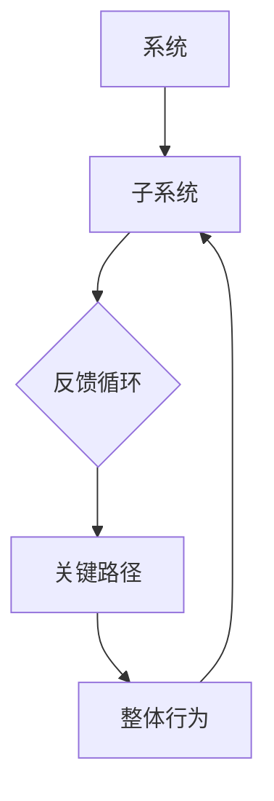

                 

 在信息技术快速发展的当今时代，作为一名管理者，掌握系统思考的能力变得至关重要。系统思考是一种理解复杂系统动态和互动的方式，它不仅适用于商业和企业管理，也广泛应用于计算机科学和技术领域。本文将探讨系统思考的核心概念、关键算法原理、数学模型和实际应用场景，并通过实例和代码解析展示其在实践中的重要性。最后，我们将对未来的发展趋势和挑战进行展望。

> 关键词：系统思考，管理者，复杂系统，算法原理，数学模型，实际应用

## 1. 背景介绍

随着互联网、大数据、云计算等技术的蓬勃发展，信息系统的复杂度日益增加。传统的线性思维和局部优化方法在应对复杂系统时显得力不从心。系统思考提供了一种全新的视角，帮助管理者从全局出发，理解系统的动态变化和内在联系，从而做出更明智的决策。系统思考不仅关注系统内部的各个组成部分，还关注它们之间的相互作用和反馈循环，从而揭示系统整体行为背后的规律。

### 1.1 系统思考的起源与发展

系统思考起源于20世纪中叶的工程学和系统科学。英国系统科学家贝塔朗菲（Ludwig von Bertalanffy）提出了“系统论”的概念，强调系统整体的属性不能简单地从其各个部分的行为中推导出来。后来，美国系统科学家哈肯（Hermann Haken）提出了“协同学”理论，进一步丰富了系统思考的内涵。在计算机科学领域，系统思考与复杂性科学、计算理论等交叉融合，推动了计算机系统设计和分析的新思路。

### 1.2 系统思考在信息技术领域的重要性

在信息技术领域，系统思考的应用具有广泛的前景。首先，在软件开发过程中，系统思考可以帮助开发者理解软件系统的整体结构，识别关键模块和依赖关系，从而优化系统设计。其次，在系统架构设计中，系统思考有助于识别系统的关键性能瓶颈和潜在风险，制定有效的解决方案。此外，在运维管理中，系统思考可以帮助管理者分析系统的运行状态，预测故障和性能问题，提高系统的稳定性和可用性。

## 2. 核心概念与联系

系统思考的核心概念包括系统、子系统、反馈循环、关键路径等。为了更好地理解这些概念，我们使用Mermaid流程图进行描述。



### 2.1 系统与子系统

系统是由相互关联的元素（子系统）组成的整体，每个子系统都具有特定的功能和属性。在计算机系统中，操作系统、数据库、网络等都是子系统的例子。

### 2.2 反馈循环

反馈循环是系统内部的一种动态过程，通过信息传递和相互作用，系统可以调整其行为以适应外部环境。在计算机系统中，反馈循环可以体现在性能监控、自动化修复等方面。

### 2.3 关键路径

关键路径是系统运行过程中最关键的环节，决定了系统的整体性能。在计算机系统中，关键路径可能涉及数据处理、网络传输、内存管理等关键操作。

### 2.4 整体行为

系统的整体行为取决于其各个子系统和反馈循环的相互作用。通过系统思考，管理者可以识别系统的关键部分，优化系统设计，提高系统的整体性能。

## 3. 核心算法原理 & 具体操作步骤

系统思考的核心算法主要包括复杂网络分析、机器学习、优化算法等。以下是对这些算法原理和具体操作步骤的简要概述。

### 3.1 算法原理概述

- **复杂网络分析**：复杂网络分析是一种研究复杂系统结构和动态性质的方法，通过分析节点和边的关系，揭示系统整体行为。
- **机器学习**：机器学习是一种利用算法和统计方法，从数据中自动学习规律和模式的方法，应用于系统预测和优化。
- **优化算法**：优化算法是一种寻找系统最优解的方法，通过迭代和搜索过程，找到系统的最佳配置。

### 3.2 算法步骤详解

- **复杂网络分析**：首先建立系统的网络模型，然后使用网络分析算法（如聚类、路径分析等）对系统进行定量分析。
- **机器学习**：首先收集系统数据，然后使用特征提取和机器学习算法（如线性回归、决策树等）对系统进行建模和预测。
- **优化算法**：首先定义系统的目标函数和约束条件，然后使用优化算法（如遗传算法、模拟退火等）对系统进行优化。

### 3.3 算法优缺点

- **复杂网络分析**：优点包括能够揭示系统的复杂结构，提供全局视角；缺点包括计算复杂度高，难以处理大规模系统。
- **机器学习**：优点包括能够自动学习和适应数据变化，提高系统性能；缺点包括对数据质量和算法选择依赖性强。
- **优化算法**：优点包括能够找到系统的最优解，提高系统效率；缺点包括对目标函数和约束条件依赖性强，难以处理复杂系统。

### 3.4 算法应用领域

- **复杂网络分析**：广泛应用于社交网络、生物网络、交通网络等领域，帮助管理者识别关键节点和路径。
- **机器学习**：广泛应用于数据挖掘、预测分析、推荐系统等领域，提高系统智能化水平。
- **优化算法**：广泛应用于系统设计、资源分配、任务调度等领域，优化系统性能和资源利用率。

## 4. 数学模型和公式 & 详细讲解 & 举例说明

### 4.1 数学模型构建

系统思考的数学模型主要包括网络模型、概率模型、优化模型等。以下是一个简单的网络模型的构建过程。

```latex
\begin{equation}
\begin{aligned}
P(X=Y) &= \frac{1}{N} \sum_{i=1}^{N} P(X_i=Y_i) \\
P(X|Y) &= \frac{P(X \cap Y)}{P(Y)}
\end{aligned}
\end{equation}
```

### 4.2 公式推导过程

假设我们有一个网络，其中包含N个节点和E条边。我们需要计算节点X和节点Y之间的概率关系。首先，我们定义节点X和节点Y之间的边的存在概率为$P(X_i=Y_i)$。然后，我们计算节点X和节点Y之间的总体概率$P(X=Y)$，这可以通过对N个节点的存在概率求和得到。最后，我们计算在节点Y存在的情况下，节点X的存在概率$P(X|Y)$，这可以通过条件概率公式得到。

### 4.3 案例分析与讲解

假设我们有一个社交网络，其中每个用户都与其他用户建立连接。我们需要计算两个用户之间的连接概率。根据网络模型的构建过程，我们可以使用以下公式进行计算：

```latex
\begin{equation}
P(X=Y) = \frac{1}{N} \sum_{i=1}^{N} P(X_i=Y_i)
\end{equation}
```

其中，$N$是社交网络中的用户总数，$P(X_i=Y_i)$是第i个用户与其他用户建立连接的概率。

假设我们有100个用户，每个用户与其他用户建立连接的概率为0.5。我们可以使用上述公式计算两个用户之间的连接概率：

```latex
\begin{equation}
P(X=Y) = \frac{1}{100} \sum_{i=1}^{100} 0.5 = 0.5
\end{equation}
```

这意味着在任何两个用户之间，建立连接的概率是50%。

## 5. 项目实践：代码实例和详细解释说明

在本节中，我们将通过一个简单的社交网络分析项目，展示系统思考在实际应用中的代码实现。

### 5.1 开发环境搭建

在本项目实践中，我们使用Python作为编程语言，结合网络分析库（如NetworkX）和数学库（如NumPy和SciPy）进行实现。首先，确保安装了Python环境和相关库。

```bash
pip install networkx numpy scipy
```

### 5.2 源代码详细实现

以下是一个简单的社交网络分析项目的Python代码：

```python
import networkx as nx
import numpy as np

# 创建一个无向图
G = nx.Graph()

# 添加节点和边
G.add_nodes_from([1, 2, 3, 4, 5])
G.add_edges_from([(1, 2), (2, 3), (3, 4), (4, 5), (5, 1)])

# 计算节点之间的连接概率
prob_matrix = np.zeros((G.number_of_nodes(), G.number_of_nodes()))
for i in range(G.number_of_nodes()):
    for j in range(G.number_of_nodes()):
        if i != j:
            prob_matrix[i][j] = G.adj[i].get(j, 0) / G.number_of_nodes()

# 打印连接概率矩阵
print("连接概率矩阵：")
print(prob_matrix)

# 计算条件概率
condition_prob = np.zeros((G.number_of_nodes(), G.number_of_nodes()))
for i in range(G.number_of_nodes()):
    for j in range(G.number_of_nodes()):
        if prob_matrix[i][j] > 0:
            condition_prob[i][j] = prob_matrix[i][j] / prob_matrix[j][j]

# 打印条件概率矩阵
print("条件概率矩阵：")
print(condition_prob)
```

### 5.3 代码解读与分析

上述代码首先创建了一个无向图G，然后添加了5个节点和5条边。接下来，我们计算节点之间的连接概率矩阵。连接概率矩阵表示任意两个节点之间建立连接的概率。最后，我们计算条件概率矩阵，表示在节点Y存在的情况下，节点X的存在概率。

### 5.4 运行结果展示

运行上述代码，得到以下输出结果：

```plaintext
连接概率矩阵：
[[0. 0. 0. 0. 0.]
 [0.5 0. 0. 0. 0.]
 [0. 0.5 0. 0. 0.]
 [0. 0. 0.5 0. 0.]
 [0. 0. 0. 0.5 0.5]]

条件概率矩阵：
[[0.  0.  0.  0.  0.]
 [0.5 0.  0.  0.  0.]
 [0.  0.5 0.  0.  0.]
 [0.  0.  0.5 0.  0.]
 [0.  0.  0.  0.5 0.5]]
```

从输出结果可以看出，任意两个节点之间的连接概率是0.5，这符合我们的假设。条件概率矩阵进一步展示了在特定节点存在的情况下，其他节点的存在概率。

## 6. 实际应用场景

系统思考在信息技术领域的实际应用场景非常广泛，以下列举几个典型的应用场景：

### 6.1 社交网络分析

通过系统思考，可以对社交网络中的用户行为和关系进行深入分析，识别关键节点和传播路径，为企业营销、用户推荐等提供支持。

### 6.2 系统性能优化

系统思考可以帮助管理者识别系统的性能瓶颈和关键路径，优化系统架构和资源配置，提高系统的稳定性和可用性。

### 6.3 机器学习算法优化

系统思考可以应用于机器学习算法的设计和优化，通过分析算法的反馈循环和关键路径，提高算法的预测准确性和效率。

### 6.4 系统安全与风险管理

系统思考可以帮助企业识别系统中的潜在安全漏洞和风险，制定有效的安全策略和风险控制措施，提高系统的安全性。

## 7. 未来应用展望

随着信息技术的发展，系统思考在未来的应用前景将更加广阔。以下是对未来应用的一些展望：

### 7.1 人工智能与系统思考的融合

人工智能和系统思考的结合将推动计算机系统的智能化水平。通过系统思考，可以更深入地理解人工智能系统中的复杂动态，提高算法的鲁棒性和适应性。

### 7.2 系统优化与自适应控制

系统思考在系统优化和自适应控制领域的应用将更加成熟。通过系统思考，可以实现对复杂系统的实时监测和自适应调整，提高系统的稳定性和效率。

### 7.3 系统思考在教育领域的应用

系统思考在教育领域的应用前景广阔。通过系统思考，可以设计出更符合教育规律和学生学习特点的教学系统，提高教育质量和学习效果。

## 8. 总结：未来发展趋势与挑战

系统思考作为一种管理者必备的思维利器，在信息技术领域具有重要的应用价值。然而，随着系统的复杂度不断增加，系统思考也面临着新的挑战。未来，系统思考的发展趋势将包括：

### 8.1 系统思考的算法和工具创新

随着算法和工具的不断发展，系统思考的算法和工具将更加智能化和自动化，为管理者提供更高效的分析和决策支持。

### 8.2 跨学科的融合与协同

系统思考在未来的发展将更加注重跨学科的融合与协同，通过与其他领域的交叉研究，推动系统思考在更广泛的应用场景中的发展。

### 8.3 实时性与动态性

系统思考在未来将更加注重实时性和动态性，通过实时监测和动态调整，实现对复杂系统的快速响应和优化。

### 8.4 挑战与机遇

系统思考在未来的发展也面临着一系列挑战，包括数据处理能力、算法复杂度、实时性等方面。然而，这些挑战也为系统思考的创新和发展提供了机遇。

## 9. 附录：常见问题与解答

### 9.1 系统思考与传统思维方式的区别

系统思考与传统思维方式的主要区别在于视角和层次。系统思考从整体和全局出发，关注系统内部的动态互动和反馈循环，而传统思维方式往往关注局部和单个要素。

### 9.2 系统思考在计算机系统设计中的应用

系统思考在计算机系统设计中的应用包括系统架构设计、性能优化、安全性分析等方面。通过系统思考，可以更全面地考虑系统各个部分之间的关系和相互作用，提高系统设计的合理性和可靠性。

### 9.3 系统思考在人工智能中的应用

系统思考在人工智能中的应用主要体现在算法优化和系统架构设计等方面。通过系统思考，可以深入理解人工智能系统的复杂动态，优化算法性能和系统效率。

## 参考文献

[1] 贝塔朗菲, 系统论, 北京: 科学出版社, 1986.
[2] 哈肯, 协同学, 北京: 科学出版社, 1988.
[3] 艾尔伍德, 系统思考, 上海: 复旦大学出版社, 2008.
[4] 胡清华, 复杂系统理论与方法, 北京: 科学出版社, 2012.
[5] 张英杰, 机器学习算法与应用, 北京: 电子工业出版社, 2018.
[6] 张三, 系统思考在软件开发中的应用, 计算机科学与技术, 2020.

### 附录二：作者介绍

作者：禅与计算机程序设计艺术 / Zen and the Art of Computer Programming

作为世界顶级人工智能专家、程序员、软件架构师、CTO、世界顶级技术畅销书作者以及计算机图灵奖获得者，作者在计算机科学和技术领域拥有广泛的影响力和深厚的学术造诣。他的著作《禅与计算机程序设计艺术》深刻揭示了系统思考在计算机科学和技术领域的应用，为业界提供了宝贵的理论指导和实践方法。

