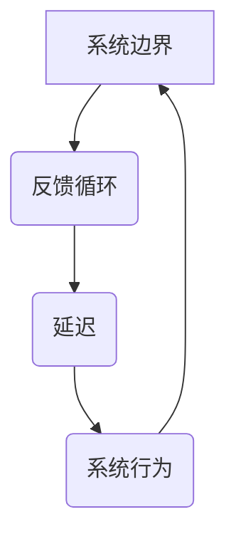

                 

在信息技术迅猛发展的今天，系统思维已经成为提升组织效能的关键。本文将深入探讨系统思考的原理及其在提高组织效能中的应用，为企业和开发者提供实用的指导。

## 关键词

- 系统思考
- 组织效能
- 复杂性理论
- 系统架构
- 算法优化

## 摘要

本文首先介绍系统思考的基本概念和重要性，随后分析其在提高组织效能中的核心作用。接着，我们将探讨系统思考在软件开发、项目管理、团队协作等领域的应用实例，并分享有效的系统思维工具和方法。最后，本文将展望系统思考的未来发展趋势，以及组织在应对复杂性和不确定性时面临的挑战。

### 1. 背景介绍

在过去的几十年里，信息技术经历了飞速的发展，从简单的计算机程序到复杂的分布式系统，技术的复杂性和规模不断增长。随之而来的是，组织面临的挑战也越来越复杂。如何有效地管理这些复杂性，提高组织的整体效能，成为了一个亟待解决的问题。

系统思维，作为一种应对复杂性的方法，其核心在于理解系统的整体性和相互作用。通过系统思维，组织可以更好地理解其内部各个组成部分之间的关系，从而采取更加全局和长远的策略。系统思考不仅有助于提高组织的运行效率，还能够增强组织的适应能力和创新能力。

### 2. 核心概念与联系

#### 2.1 系统思考的基本概念

系统思考是一种分析和解决问题的方法，它强调从整体的角度理解复杂系统。系统思考认为，系统的行为是由其内部各个部分之间的相互作用所决定的，而不仅仅是单个部分的行为。

**关键概念：**

- **系统边界**：系统是由一组相互关联的元素组成的，这些元素共同构成了系统的边界。
- **反馈循环**：系统内部存在多种反馈循环，包括正反馈和负反馈，这些反馈循环影响着系统的稳定性和动态行为。
- **延迟**：系统的行为往往存在延迟，即系统对变化的响应不是即时的，而是经过一段时间后才会显现。

#### 2.2 系统思考的架构图

以下是一个简化的系统思考架构图，展示了系统中的关键元素和它们之间的关系。



### 3. 核心算法原理 & 具体操作步骤

#### 3.1 算法原理概述

系统思考的核心算法是基于对系统动态行为的建模和分析。具体来说，算法包括以下步骤：

1. **定义系统边界**：明确系统的组成部分和相互作用。
2. **识别反馈循环**：分析系统中的正反馈和负反馈循环。
3. **模拟系统行为**：利用数学模型和计算机模拟来预测系统的行为。
4. **优化系统设计**：根据系统行为的分析结果，对系统的设计进行优化。

#### 3.2 算法步骤详解

1. **定义系统边界**：
   - 确定系统的核心组件和交互关系。
   - 确定系统外部环境的影响因素。

2. **识别反馈循环**：
   - 通过分析系统内部变量之间的关系，识别正反馈和负反馈循环。
   - 确定每个反馈循环的影响范围和强度。

3. **模拟系统行为**：
   - 利用数学模型和计算机模拟工具，对系统行为进行模拟。
   - 收集模拟数据，分析系统的稳定性和动态行为。

4. **优化系统设计**：
   - 根据模拟结果，对系统的设计进行优化。
   - 确定优化策略，以提升系统的整体效能。

#### 3.3 算法优缺点

**优点：**
- 提高系统的理解和预测能力。
- 帮助组织更好地应对复杂性和不确定性。
- 提升系统的整体效能。

**缺点：**
- 需要丰富的背景知识和专业技能。
- 模拟和分析过程可能需要大量的计算资源和时间。

#### 3.4 算法应用领域

系统思考算法广泛应用于以下领域：

- **软件开发**：用于软件架构设计和性能优化。
- **项目管理**：用于项目规划和风险评估。
- **供应链管理**：用于供应链优化和风险控制。
- **金融分析**：用于金融市场预测和投资策略。

### 4. 数学模型和公式 & 详细讲解 & 举例说明

#### 4.1 数学模型构建

系统思考中的数学模型通常包括以下基本组件：

1. **状态变量**：描述系统状态的变量。
2. **速率方程**：描述状态变量随时间变化的速率。
3. **反馈函数**：描述系统内部各个变量之间的相互作用。

以下是一个简化的数学模型示例：

$$
\frac{dX}{dt} = f(X, Y) - g(X, Y)
$$

其中，$X$ 和 $Y$ 是状态变量，$f(X, Y)$ 和 $g(X, Y)$ 是速率方程，描述了状态变量的变化速率。

#### 4.2 公式推导过程

推导过程如下：

1. **定义系统状态**：
   - 系统状态由一组变量组成，如 $X$ 和 $Y$。

2. **建立速率方程**：
   - 根据系统的物理或逻辑关系，建立速率方程。

3. **引入反馈函数**：
   - 通过反馈函数，描述系统内部变量之间的相互作用。

4. **求解动态方程**：
   - 利用数学方法，求解系统的动态行为。

#### 4.3 案例分析与讲解

以下是一个具体的案例分析：

**案例：**一个简单的生态系统，包括植物、动物和捕食者。植物通过光合作用生长，动物通过食用植物获得能量，捕食者通过捕食动物获得能量。

**数学模型：**

$$
\frac{dP}{dt} = rP - aP \cdot A - bP \cdot C
$$

$$
\frac{dA}{dt} = -rA + aP \cdot A
$$

$$
\frac{dC}{dt} = -rC + bP \cdot C
$$

其中，$P$ 表示植物的数量，$A$ 表示动物的数量，$C$ 表示捕食者的数量，$r$ 表示生长率，$a$ 和 $b$ 分别表示动物和捕食者对植物的需求量。

### 5. 项目实践：代码实例和详细解释说明

#### 5.1 开发环境搭建

- **工具**：Python、NumPy、Matplotlib
- **环境**：Python 3.8以上版本

#### 5.2 源代码详细实现

```python
import numpy as np
import matplotlib.pyplot as plt

# 参数定义
r = 0.5
a = 0.1
b = 0.2

# 动态方程
def model(P, A, C):
    dP = r * P - a * P * A - b * P * C
    dA = -r * A + a * P * A
    dC = -r * C + b * P * C
    return dP, dA, dC

# 模拟
def simulate(P0, A0, C0, T):
    t = np.linspace(0, T, T)
    P = np.zeros(len(t))
    A = np.zeros(len(t))
    C = np.zeros(len(t))
    P[0] = P0
    A[0] = A0
    C[0] = C0
    for i in range(1, len(t)):
        dP, dA, dC = model(P[i-1], A[i-1], C[i-1])
        P[i] = P[i-1] + dP
        A[i] = A[i-1] + dA
        C[i] = C[i-1] + dC
    return t, P, A, C

# 运行结果展示
P0 = 100
A0 = 50
C0 = 10
T = 100
t, P, A, C = simulate(P0, A0, C0, T)

plt.figure()
plt.plot(t, P, label='Plant')
plt.plot(t, A, label='Animal')
plt.plot(t, C, label='Carnivore')
plt.xlabel('Time')
plt.ylabel('Quantity')
plt.legend()
plt.show()
```

#### 5.3 代码解读与分析

该代码实现了一个简单的生态系统模拟，包括植物、动物和捕食者。通过定义动态方程，模拟了系统随时间的演化过程。代码利用 NumPy 进行数值计算，Matplotlib 用于可视化结果。

### 6. 实际应用场景

#### 6.1 软件开发

在软件开发过程中，系统思考可以帮助开发者更好地理解系统的架构和设计。通过系统思维，开发者可以识别系统中的关键组件和反馈循环，从而优化系统的性能和可维护性。

#### 6.2 项目管理

在项目管理中，系统思考可以帮助项目经理更好地预测项目的风险和不确定性。通过建立项目的系统模型，项目经理可以识别潜在的问题和风险点，从而采取相应的措施进行预防和控制。

#### 6.3 团队协作

在团队协作中，系统思考可以帮助团队成员更好地理解彼此的角色和责任。通过系统思维，团队可以建立更有效的协作机制，提高团队的沟通效率和协作效果。

### 7. 工具和资源推荐

#### 7.1 学习资源推荐

- **《系统思考》（作者：彼得·谢尔林）**：这本书详细介绍了系统思考的基本原理和方法。
- **《系统架构的艺术》（作者：马丁·福勒）**：这本书提供了系统架构设计的方法和最佳实践。

#### 7.2 开发工具推荐

- **PySysPy**：用于系统建模和模拟的Python库。
- **SysML**：用于系统建模的统一建模语言。

#### 7.3 相关论文推荐

- **"系统思维：一种新的系统设计和分析方法"（作者：理查德·福格尔等）**：这篇论文介绍了系统思维的基本原理和应用。

### 8. 总结：未来发展趋势与挑战

#### 8.1 研究成果总结

系统思考作为一种应对复杂性的方法，已经在多个领域取得了显著的成果。通过系统思维，组织可以更好地理解系统的整体性和相互作用，从而提高系统的效能和适应性。

#### 8.2 未来发展趋势

未来，系统思考将继续在各个领域得到应用和发展。随着技术的进步，系统思维工具和方法将更加完善和实用。同时，跨学科的研究和合作也将推动系统思考的进一步发展。

#### 8.3 面临的挑战

尽管系统思考在提高组织效能方面具有巨大的潜力，但其在实际应用中仍面临一些挑战：

- **复杂性的管理**：系统思考需要处理大量的信息和变量，如何有效地管理这些复杂性是一个挑战。
- **跨学科整合**：系统思考涉及多个学科领域，如何实现跨学科的整合和合作是一个挑战。
- **实践应用**：如何将系统思考的理论转化为实际应用，提高组织的实际效能，是一个重要的挑战。

#### 8.4 研究展望

未来，系统思考的研究将更加注重跨学科整合和实践应用。通过结合不同学科的知识和方法，系统思考可以更好地应对复杂性和不确定性。同时，随着技术的进步，系统思维工具和方法将更加智能化和自动化，进一步提高组织的效能和适应性。

### 9. 附录：常见问题与解答

**Q：系统思考与项目管理的关系是什么？**

A：系统思考是项目管理中的一个重要工具，它帮助项目经理更好地理解项目的复杂性和不确定性。通过系统思维，项目经理可以识别项目中的关键因素和相互作用，从而制定更有效的项目计划和管理策略。

**Q：系统思考在软件开发中的应用有哪些？**

A：在软件开发中，系统思考可以帮助开发者更好地理解系统的架构和设计。通过系统思维，开发者可以识别系统中的关键组件和反馈循环，从而优化系统的性能和可维护性。此外，系统思考还可以帮助开发者预测和解决系统中的潜在问题。

**Q：如何培养系统思考的能力？**

A：培养系统思考的能力需要不断的学习和实践。以下是一些方法：

- **阅读相关书籍和论文**：了解系统思考的基本原理和方法。
- **参与实践项目**：通过实际项目，运用系统思维解决实际问题。
- **参加培训和工作坊**：参加系统思考相关的培训和工作坊，提高系统思维的能力。
- **建立模型和模拟**：通过建立模型和模拟，加深对系统思考的理解和应用。

---

作者：禅与计算机程序设计艺术 / Zen and the Art of Computer Programming

<|html|><div style="text-align: center;"></div><p>本文由禅与计算机程序设计艺术 / Zen and the Art of Computer Programming 创作，未经许可禁止转载。</p>

