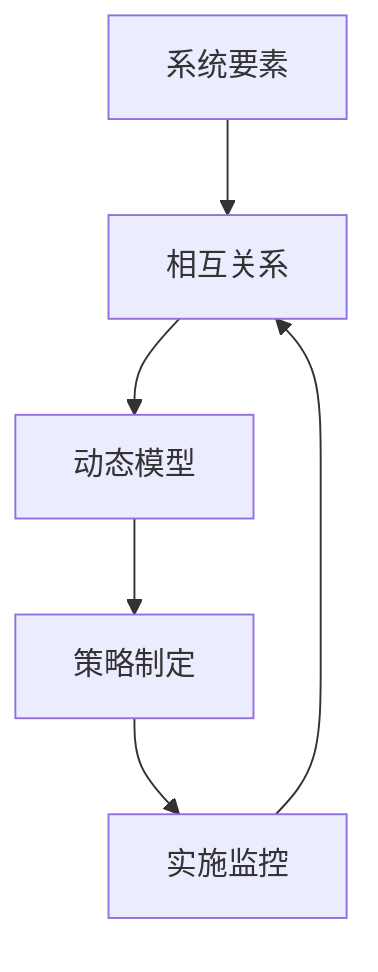

                 

关键词：系统思考、项目管理、复杂项目、IT管理、系统架构、组织协同、决策制定

> 摘要：本文旨在探讨系统思考在管理复杂项目中的重要性。系统思考是一种通过理解系统内各元素间的相互关系和互动来进行分析、规划和决策的方法。在复杂项目的管理中，系统思考能够帮助我们更好地应对不确定性、减少错误决策、提高项目的成功率。本文将详细阐述系统思考的概念、应用场景、关键技巧和实践方法，为项目管理者和IT专业人士提供指导。

## 1. 背景介绍

在当今信息时代，随着技术的快速发展，项目变得越来越复杂。无论是在IT行业、制造业、金融业还是其他行业，复杂项目已经成为企业成功的核心驱动力。复杂项目通常涉及多个团队、多个部门和跨职能的合作，需要处理大量的数据、信息和资源。然而，复杂项目也面临着诸多挑战，如不确定性、资源限制、沟通障碍和时间压力等。

传统的项目管理方法通常依赖于线性思维和局部优化，这往往导致项目管理者和团队在应对复杂问题时力不从心。为了更好地管理复杂项目，系统思考作为一种全面的思维方式，被越来越多地应用于项目管理中。系统思考强调全局视角、动态理解和跨部门协作，能够帮助我们更全面、更深入地理解复杂系统的运作机制。

## 2. 核心概念与联系

### 2.1 系统思考的定义

系统思考是一种基于系统论的思维方式，它通过识别系统中的相互关系和反馈循环来理解系统的行为。系统思考不仅关注系统的组成部分，更关注组成部分之间的相互作用和反馈机制。它强调通过整体视角来理解问题，从而实现更有效的分析和决策。

### 2.2 系统思考与项目管理

在项目管理中，系统思考可以帮助我们：

- **理解复杂性问题**：通过系统思考，我们可以将复杂项目分解成多个组成部分，并理解它们之间的相互作用。
- **识别反馈循环**：在项目中，可能会出现正反馈（增强问题）和负反馈（缓解问题）的循环。系统思考可以帮助我们识别这些反馈循环，并制定相应的策略。
- **提高协作效率**：系统思考强调跨部门和跨职能的合作，有助于减少沟通障碍，提高项目团队的协作效率。
- **制定适应性策略**：面对不确定性，系统思考可以帮助我们制定更灵活、适应性更强的项目计划。

### 2.3 系统思考的架构

为了更好地应用系统思考，我们可以将其分解为以下几个关键部分：

1. **系统要素**：识别系统中的关键要素，如人员、流程、技术、资源和信息。
2. **相互关系**：理解要素之间的相互关系，包括依赖关系、相互作用和反馈机制。
3. **动态模型**：构建系统的动态模型，模拟要素间的变化和反馈过程。
4. **策略制定**：基于系统模型，制定适应性和灵活性的策略。
5. **实施监控**：在项目实施过程中，持续监控系统状态，并根据实际情况调整策略。

下面是一个简化的Mermaid流程图，展示了系统思考的核心架构：



## 3. 核心算法原理 & 具体操作步骤

### 3.1 算法原理概述

系统思考的核心在于理解系统的动态行为，这需要我们采用一系列的算法和方法来模拟和分析系统。其中，常见的算法包括：

- **系统动力学**：通过构建系统方程，模拟系统内部各要素的变化和相互作用。
- **流程图分析**：使用流程图来表示系统内部各要素的相互关系和动态过程。
- **因果回路分析**：识别系统中的因果回路，理解系统行为的反馈机制。

### 3.2 算法步骤详解

以下是系统思考的基本步骤：

1. **问题定义**：明确项目或问题的目标和范围。
2. **要素识别**：识别系统中的关键要素，如人员、流程、技术等。
3. **相互关系分析**：分析要素之间的相互关系，包括依赖关系、相互作用和反馈机制。
4. **构建动态模型**：基于分析结果，构建系统的动态模型。
5. **模拟和验证**：使用模拟工具验证模型的有效性，并根据反馈调整模型。
6. **策略制定**：基于模型，制定适应性和灵活性的项目策略。
7. **实施和监控**：在项目实施过程中，持续监控系统状态，并根据实际情况调整策略。

### 3.3 算法优缺点

**优点**：

- **全面性**：系统思考从整体视角出发，能够帮助我们更全面地理解复杂系统的行为。
- **适应性**：系统思考强调灵活性和适应性，能够应对不确定性。
- **协作性**：系统思考强调跨部门和跨职能的合作，有助于提高团队协作效率。

**缺点**：

- **复杂性**：系统思考涉及多个环节和多种算法，可能需要较高的技术能力和专业知识。
- **时间成本**：构建和验证系统模型可能需要较长时间。

### 3.4 算法应用领域

系统思考在多个领域都有广泛的应用，如：

- **项目管理**：用于分析和规划复杂项目，提高项目成功率。
- **业务流程优化**：用于分析和改进业务流程，提高效率。
- **组织变革**：用于理解和应对组织变革中的复杂问题。
- **可持续发展**：用于分析和规划可持续发展战略。

## 4. 数学模型和公式 & 详细讲解 & 举例说明

### 4.1 数学模型构建

系统思考中的数学模型通常包括以下几个关键部分：

- **状态变量**：表示系统的状态，如资源数量、任务进度等。
- **关系方程**：描述状态变量之间的相互作用，如因果关系、依赖关系等。
- **反馈循环**：描述系统内部正反馈和负反馈的循环过程。

### 4.2 公式推导过程

以下是一个简单的系统动力学模型，用于描述资源消耗和再生的过程：

$$
R(t+1) = R(t) - C(t) + R_{\text{in}}
$$

其中，$R(t)$ 表示时间 $t$ 的资源数量，$C(t)$ 表示时间 $t$ 的资源消耗，$R_{\text{in}}$ 表示时间 $t$ 的资源再生。

### 4.3 案例分析与讲解

假设我们有一个项目，需要消耗100单位资源，每周再生10单位资源。我们可以使用上述公式来模拟项目的资源消耗过程。

初始状态 $R(0) = 100$，每周的消耗 $C(t) = 10$。根据公式，我们可以得到：

$$
R(1) = R(0) - C(0) + R_{\text{in}} = 100 - 10 + 10 = 100
$$

$$
R(2) = R(1) - C(1) + R_{\text{in}} = 100 - 10 + 10 = 100
$$

可以看出，即使每周消耗10单位资源，由于再生速度与消耗速度相同，资源数量保持不变。

如果消耗速度增加，例如每周消耗20单位资源，则：

$$
R(1) = R(0) - C(0) + R_{\text{in}} = 100 - 20 + 10 = 90
$$

$$
R(2) = R(1) - C(1) + R_{\text{in}} = 90 - 20 + 10 = 80
$$

随着消耗速度的增加，资源数量开始减少。这个简单的例子展示了系统动力学模型的基本原理。

## 5. 项目实践：代码实例和详细解释说明

### 5.1 开发环境搭建

为了演示系统思考在项目中的实际应用，我们将使用Python编写一个简单的项目模拟器。以下是搭建开发环境所需的步骤：

1. 安装Python 3.8及以上版本。
2. 安装Python的集成开发环境（如PyCharm、VSCode等）。
3. 安装必要的Python库，如NumPy、Matplotlib等。

### 5.2 源代码详细实现

下面是一个简单的Python代码实例，用于模拟项目资源消耗和再生的过程：

```python
import numpy as np
import matplotlib.pyplot as plt

# 初始化参数
initial_resources = 100
weekly_consumption = 10
weekly_replenishment = 10
time_steps = 10

# 初始化资源数组
resources = np.full(time_steps, initial_resources)

# 模拟资源消耗和再生
for t in range(1, time_steps):
    resources[t] = resources[t - 1] - weekly_consumption + weekly_replenishment

# 绘制资源变化图
plt.plot(range(time_steps), resources)
plt.xlabel('Time (weeks)')
plt.ylabel('Resources')
plt.title('Resource Consumption and Replenishment')
plt.grid(True)
plt.show()
```

### 5.3 代码解读与分析

这段代码首先导入了NumPy和Matplotlib库，用于数值计算和绘图。然后，我们初始化了项目的初始资源数量、每周消耗和再生量，以及模拟的时间步数。

在模拟过程中，我们使用了一个for循环来更新每个时间步的的资源数量。具体来说，每个时间步的资源数量等于前一个时间步的资源数量减去每周消耗量再加上每周再生量。

最后，我们使用Matplotlib库绘制了资源变化图，展示了资源数量随时间的变化。

### 5.4 运行结果展示

运行上述代码后，我们将看到一个简单的资源变化图。在初始阶段，资源数量保持不变，因为消耗和再生速度相同。然而，当消耗速度增加时，资源数量开始逐渐减少。这个简单的实例展示了系统动力学模型在实际应用中的效果。

## 6. 实际应用场景

系统思考在项目管理中具有广泛的应用场景。以下是一些典型的应用案例：

- **项目风险评估**：通过系统思考，我们可以识别项目中的关键风险因素，并分析它们之间的相互作用。这有助于我们制定更有效的风险管理策略。
- **资源优化**：系统思考可以帮助我们优化项目中的资源分配，提高资源利用率。例如，通过分析资源的消耗和再生过程，我们可以找到优化资源再生的方法。
- **团队协作**：系统思考强调跨部门和跨职能的合作。通过系统思考，我们可以识别项目中的协作障碍，并制定相应的改进措施，提高团队协作效率。
- **项目进度管理**：系统思考可以帮助我们构建项目进度模型，预测项目完成时间，并制定适应性策略来应对不确定性。

## 7. 工具和资源推荐

### 7.1 学习资源推荐

- **《系统思考：领导者必读的21本书》**：这本书汇集了系统思考领域的经典著作，适合初学者深入了解系统思考。
- **《系统动力学：计算机模拟方法》**：这本书详细介绍了系统动力学的基本原理和计算机模拟方法，适合有一定数学基础的读者。
- **《系统思考与实践：从复杂性中寻找解决方案》**：这本书通过案例研究和实际应用，展示了系统思考在解决复杂问题中的价值。

### 7.2 开发工具推荐

- **MATLAB/Simulink**：强大的系统动力学模拟和可视化工具，适合进行复杂的系统建模和仿真。
- **Python**：灵活的编程语言，适合进行数据分析、建模和可视化。

### 7.3 相关论文推荐

- **"System Dynamics: Modeling and Simulation of Dynamic Systems"**：这是一篇经典的系统动力学论文，详细介绍了系统动力学的基本原理和建模方法。
- **"Using System Dynamics to Improve Project Management"**：这篇文章探讨了系统思考在项目管理中的应用，提供了实用的方法和案例。

## 8. 总结：未来发展趋势与挑战

### 8.1 研究成果总结

系统思考作为一种强大的思维方式，已经在多个领域取得了显著的成果。通过系统思考，我们可以更好地理解复杂系统的行为，提高项目管理的成功率，优化资源利用，增强团队协作等。然而，系统思考在项目管理中的应用仍有许多挑战和改进空间。

### 8.2 未来发展趋势

- **人工智能与系统思考的结合**：未来，人工智能技术将越来越多地应用于系统思考，提高建模、模拟和预测的准确性。
- **跨学科研究**：系统思考将继续与其他学科（如心理学、社会学、经济学等）相结合，形成更全面的系统思考理论体系。
- **实践应用推广**：随着系统思考的普及，越来越多的企业和组织将采用系统思考方法来管理复杂项目。

### 8.3 面临的挑战

- **技术门槛**：系统思考涉及多个环节和多种算法，需要较高的技术能力和专业知识。如何降低系统思考的实施门槛，使其更易于普及和应用，是一个重要挑战。
- **数据依赖**：系统思考依赖于大量准确的数据和模型。在数据获取和处理方面，如何确保数据的可靠性和准确性，是一个关键问题。
- **人员培训**：系统思考需要项目团队具备相应的思维能力和专业知识。如何对项目团队成员进行有效的培训，提高他们的系统思考能力，是一个重要挑战。

### 8.4 研究展望

未来，系统思考在项目管理中的应用将更加深入和广泛。随着技术的发展和跨学科研究的进展，系统思考将形成更全面、更实用的理论体系，为项目管理者和IT专业人士提供更强大的工具和方法。

## 9. 附录：常见问题与解答

### 9.1 什么是系统思考？

系统思考是一种基于系统论的思维方式，通过理解系统内各元素间的相互关系和互动来进行分析、规划和决策。

### 9.2 系统思考在项目管理中有什么作用？

系统思考在项目管理中的作用包括：理解复杂性问题、识别反馈循环、提高协作效率和制定适应性策略。

### 9.3 系统思考与项目管理有哪些联系？

系统思考与项目管理密切相关。项目管理中的许多问题，如资源管理、风险管理、进度管理等，都可以通过系统思考的方法得到更好的解决。

### 9.4 如何应用系统思考来管理复杂项目？

应用系统思考来管理复杂项目需要以下几个步骤：问题定义、要素识别、相互关系分析、构建动态模型、模拟和验证、策略制定和实施监控。

### 9.5 系统思考在哪些领域有应用？

系统思考在多个领域有应用，包括项目管理、业务流程优化、组织变革、可持续发展等。

---

作者：禅与计算机程序设计艺术 / Zen and the Art of Computer Programming

本文基于系统思考在项目管理中的应用，详细探讨了系统思考的概念、应用场景、关键技巧和实践方法。通过数学模型和代码实例，我们展示了系统思考在实际项目中的效果。未来，随着技术的发展和跨学科研究的进展，系统思考在项目管理中的应用将更加深入和广泛。希望本文能为项目管理者和IT专业人士提供有益的参考和启示。

