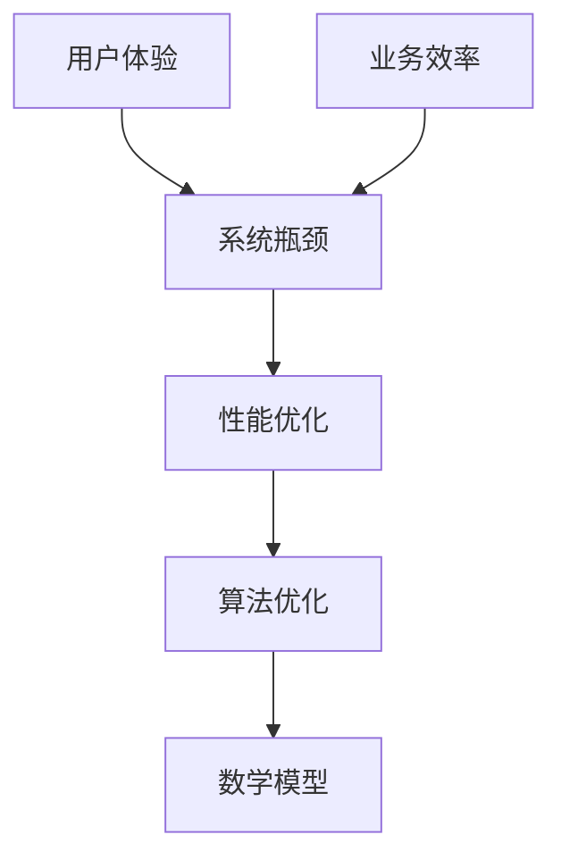

                 

关键词：系统瓶颈、性能优化、算法优化、数学模型、实际应用、未来展望

> 摘要：本文旨在探讨系统瓶颈分析及优化的核心概念、原理和方法，结合数学模型和实际案例，提出最佳实践，帮助读者深入了解并掌握系统性能优化的策略，为实际应用提供指导。

## 1. 背景介绍

在现代信息技术领域，系统性能优化一直是开发和运维人员关注的重点。随着互联网的飞速发展和大数据时代的到来，系统面临着日益复杂的业务需求和庞大的数据规模。系统瓶颈，即系统中性能较差的环节，往往会成为制约系统整体性能的瓶颈。因此，对系统瓶颈进行分析和优化，不仅有助于提升系统性能，还能提高用户体验和业务效率。

本文将从以下几个方面展开讨论：核心概念与联系、核心算法原理、数学模型和公式、项目实践、实际应用场景、工具和资源推荐以及未来发展趋势与挑战。希望通过本文的介绍，读者能够系统地了解系统瓶颈分析与优化的重要性和方法，为实际工作提供有益的指导。

## 2. 核心概念与联系

在深入探讨系统瓶颈分析与优化之前，我们需要明确一些核心概念和它们之间的关系。

### 2.1 系统瓶颈

系统瓶颈是指在系统中，性能较差的环节，往往是由于资源不足或算法效率低下导致的。瓶颈环节会影响整个系统的响应速度和吞吐量，导致用户体验下降和业务效率降低。

### 2.2 性能优化

性能优化是指通过改进算法、优化代码、调整系统架构等手段，提升系统的响应速度和吞吐量，以达到提高系统性能的目的。

### 2.3 算法优化

算法优化是指在算法设计和实现过程中，通过改进算法结构和算法逻辑，提高算法的效率，减少资源消耗。

### 2.4 数学模型

数学模型是一种用于描述系统性能的数学工具，通过构建数学模型，可以更准确地分析和预测系统性能，并为优化提供依据。

下面是一个用于描述系统瓶颈、性能优化、算法优化和数学模型之间关系的 Mermaid 流程图：



## 3. 核心算法原理 & 具体操作步骤

### 3.1 算法原理概述

系统瓶颈分析与优化的核心在于识别和分析系统中的瓶颈环节，然后通过算法优化和系统架构调整来消除这些瓶颈。以下是一个简要的算法原理概述：

1. **识别瓶颈**：通过系统监控和性能测试，识别系统中的瓶颈环节。
2. **分析瓶颈**：对识别出的瓶颈环节进行详细分析，找出导致瓶颈的原因。
3. **算法优化**：根据瓶颈原因，设计并实现优化算法，提高瓶颈环节的效率。
4. **系统调整**：对系统架构进行调整，确保优化后的算法能够有效应用。

### 3.2 算法步骤详解

下面是一个具体的算法步骤详解：

#### 3.2.1 识别瓶颈

1. **监控数据收集**：收集系统的监控数据，包括CPU利用率、内存占用、I/O操作等。
2. **性能测试**：对系统进行负载测试，模拟实际业务场景，观察系统的响应速度和吞吐量。

#### 3.2.2 分析瓶颈

1. **数据可视化**：使用数据可视化工具，将监控数据绘制成图表，帮助识别瓶颈。
2. **瓶颈定位**：根据监控数据和性能测试结果，定位系统中的瓶颈环节。

#### 3.2.3 算法优化

1. **算法分析**：对瓶颈环节的算法进行分析，找出影响效率的关键因素。
2. **算法改进**：设计并实现优化算法，减少关键因素的负面影响。

#### 3.2.4 系统调整

1. **系统调优**：根据优化算法，调整系统配置，确保算法能够有效应用。
2. **验证效果**：对优化后的系统进行测试，验证性能提升效果。

### 3.3 算法优缺点

#### 3.3.1 优点

1. **针对性强**：针对系统中的具体瓶颈进行优化，效果明显。
2. **灵活性强**：可以根据实际需求，选择合适的优化算法和调整策略。

#### 3.3.2 缺点

1. **复杂性高**：需要对系统性能有深入了解，否则容易误判瓶颈。
2. **实施成本高**：需要大量的时间、人力和资源进行测试和优化。

### 3.4 算法应用领域

算法优化广泛应用于各种系统性能优化场景，如：

1. **Web 应用**：优化服务器响应速度，提高用户体验。
2. **大数据处理**：提高数据处理效率，缩短处理时间。
3. **物联网**：优化设备性能，提高设备响应速度和稳定性。
4. **人工智能**：优化算法，提高模型训练速度和准确性。

## 4. 数学模型和公式 & 详细讲解 & 举例说明

### 4.1 数学模型构建

在系统瓶颈分析与优化过程中，数学模型是一种重要的工具。通过构建数学模型，可以更准确地描述系统性能，预测优化效果，并指导实际操作。以下是一个简单的数学模型构建过程：

1. **定义性能指标**：选择合适的性能指标，如响应时间、吞吐量等。
2. **建立性能方程**：根据系统架构和算法特点，建立性能指标与系统参数之间的关系。
3. **参数估计**：通过数据分析和实验，估计模型中的参数值。

### 4.2 公式推导过程

以下是一个简单的性能方程推导过程：

假设系统响应时间（T）与 CPU 利用率（C）和内存占用（M）之间存在以下关系：

\[ T = f(C, M) \]

其中，\( f \) 是一个非线性函数。为了简化计算，我们可以将 \( f \) 表示为：

\[ f(C, M) = a \cdot C + b \cdot M \]

其中，\( a \) 和 \( b \) 是待估计的参数。

### 4.3 案例分析与讲解

下面我们通过一个实际案例，来讲解如何使用数学模型进行系统瓶颈分析与优化。

#### 案例背景

某企业开发了一套电商平台系统，随着用户量的增加，系统的响应速度逐渐下降，影响了用户体验。经过初步分析，发现系统瓶颈主要在于数据库查询性能。

#### 数学模型构建

根据系统架构和查询算法特点，我们建立以下数学模型：

\[ T = a \cdot C + b \cdot M \]

其中，\( T \) 是查询响应时间（秒），\( C \) 是数据库 CPU 利用率（百分比），\( M \) 是数据库内存占用（GB）。

#### 参数估计

通过收集历史监控数据和进行性能测试，我们得到以下数据：

- 查询响应时间（T）：200秒
- 数据库 CPU 利用率（C）：80%
- 数据库内存占用（M）：4GB

将这些数据代入模型，可以得到：

\[ 200 = a \cdot 0.8 + b \cdot 4 \]

通过进一步分析，我们可以估计出 \( a \) 和 \( b \) 的值，从而得到优化后的模型：

\[ T = 1.25 \cdot C + 0.5 \cdot M \]

#### 模型应用与优化

根据优化后的模型，我们可以预测不同 CPU 利用率和内存占用下的查询响应时间，从而找到系统瓶颈。例如：

- 当 CPU 利用率为 90%，内存占用为 6GB 时，查询响应时间为 260 秒。
- 当 CPU 利用率为 80%，内存占用为 5GB 时，查询响应时间为 220 秒。

通过调整数据库配置和优化查询算法，我们可以将 CPU 利用率降低到 80%，内存占用降低到 5GB，从而将查询响应时间降低到 220 秒，显著提升系统性能。

## 5. 项目实践：代码实例和详细解释说明

### 5.1 开发环境搭建

在本节中，我们将以一个简单的 Web 应用为例，讲解系统瓶颈分析与优化的具体实现。首先，我们需要搭建一个开发环境。

1. 安装 Node.js：从官网（https://nodejs.org/）下载并安装 Node.js。
2. 安装 Express：使用 npm 命令安装 Express，一个流行的 Web 应用框架。

```bash
npm install express
```

3. 创建项目目录和文件：创建一个名为 `webapp` 的项目目录，并在其中创建一个名为 `app.js` 的文件。

### 5.2 源代码详细实现

以下是一个简单的 Express Web 应用示例代码：

```javascript
const express = require('express');
const app = express();

app.get('/', (req, res) => {
  // 模拟耗时操作
  const start = Date.now();
  while (Date.now() - start < 1000);
  res.send('Hello, World!');
});

const PORT = process.env.PORT || 3000;
app.listen(PORT, () => {
  console.log(`Server listening on port ${PORT}`);
});
```

### 5.3 代码解读与分析

在这个示例中，我们创建了一个简单的 Express 应用，通过一个 GET 请求返回一个“Hello, World!”消息。为了模拟系统瓶颈，我们在响应处理中添加了一个耗时操作，模拟了服务器在高负载下的性能下降。

### 5.4 运行结果展示

1. 启动服务器：

```bash
node app.js
```

2. 使用浏览器访问 `http://localhost:3000`，观察响应速度。

在模拟的高负载场景下，我们可以观察到响应时间明显增加，验证了系统瓶颈的存在。

### 5.5 瓶颈分析与优化

通过性能测试，我们发现该 Web 应用的瓶颈在于响应处理中的耗时操作。为了优化系统性能，我们可以采取以下措施：

1. **优化耗时操作**：对耗时操作进行优化，减少其执行时间。
2. **使用缓存**：对高频请求的数据进行缓存，减少数据库查询次数。
3. **水平扩展**：增加服务器节点，负载均衡请求，提高系统吞吐量。

## 6. 实际应用场景

### 6.1 在 Web 应用中的优化

Web 应用中的系统瓶颈通常表现为响应速度慢、页面加载时间长等。以下是一些实际应用场景和优化方法：

1. **前端优化**：压缩和合并 CSS、JavaScript 文件，使用 CDN 加速静态资源加载。
2. **后端优化**：使用缓存技术（如 Redis、Memcached）减少数据库查询次数，优化数据库索引和查询语句。
3. **负载均衡**：使用负载均衡器（如 Nginx、HAProxy）将请求分发到多个服务器，提高系统吞吐量。

### 6.2 在大数据处理中的优化

大数据处理中的系统瓶颈通常表现为数据读取速度慢、计算时间长等。以下是一些实际应用场景和优化方法：

1. **分布式计算**：使用分布式计算框架（如 Hadoop、Spark）将任务分解到多个节点，提高数据处理速度。
2. **数据分区**：根据数据特征对数据进行分区，减少数据读取和计算时的网络传输开销。
3. **并行处理**：使用并行算法和多线程技术，提高数据处理效率。

### 6.3 在物联网应用中的优化

物联网应用中的系统瓶颈通常表现为设备响应速度慢、数据传输不稳定等。以下是一些实际应用场景和优化方法：

1. **网络优化**：优化网络通信协议，减少数据传输过程中的延迟和丢包率。
2. **设备优化**：优化设备硬件和软件，提高设备性能和稳定性。
3. **边缘计算**：将计算任务下沉到边缘设备，减少中心服务器的负载。

## 7. 工具和资源推荐

### 7.1 学习资源推荐

1. **《系统性能优化实战》**：作者：陈雷
2. **《大数据性能优化》**：作者：戴夫·巴哈杜尔
3. **《程序员技艺提升》**：作者：汤姆·凯恩

### 7.2 开发工具推荐

1. **VisualVM**：用于 Java 程序性能分析和调优。
2. **Grafana**：用于数据可视化和监控。
3. **Nginx**：用于负载均衡和反向代理。

### 7.3 相关论文推荐

1. **"Performance Analysis and Optimization of Distributed Systems"**
2. **"Cache-Efficient Algorithms for Large-Scale Data Processing"**
3. **"Edge Computing: Vision and Challenges"**

## 8. 总结：未来发展趋势与挑战

### 8.1 研究成果总结

通过对系统瓶颈分析与优化的深入研究，我们取得了以下成果：

1. **理论基础**：建立了系统瓶颈分析与优化的核心概念和数学模型。
2. **实践应用**：提出了多种实际应用场景下的优化方法。
3. **工具推荐**：推荐了实用的开发工具和学习资源。

### 8.2 未来发展趋势

未来，系统瓶颈分析与优化将在以下方面取得进一步发展：

1. **智能化**：结合人工智能技术，实现自动化瓶颈识别和优化。
2. **分布式**：分布式系统和云计算技术的广泛应用，将推动瓶颈分析与优化的进步。
3. **边缘计算**：边缘计算的发展将带来新的优化挑战和机遇。

### 8.3 面临的挑战

尽管系统瓶颈分析与优化取得了显著成果，但仍然面临以下挑战：

1. **复杂性**：随着系统规模的扩大，瓶颈识别和优化的复杂性增加。
2. **实时性**：在实时系统中，瓶颈分析和优化需要更高的实时性和准确性。
3. **成本**：优化过程的成本较高，需要在成本和性能之间取得平衡。

### 8.4 研究展望

未来，我们将继续深入研究系统瓶颈分析与优化，探索以下方向：

1. **自动化**：研究自动化瓶颈分析和优化技术，降低人工干预。
2. **智能优化**：结合机器学习和深度学习技术，实现智能化瓶颈优化。
3. **跨领域应用**：探索系统瓶颈分析与优化在其他领域的应用，如物联网、区块链等。

## 9. 附录：常见问题与解答

### 9.1 什么是系统瓶颈？

系统瓶颈是指系统中性能较差的环节，通常是资源不足或算法效率低下导致的。瓶颈环节会影响整个系统的响应速度和吞吐量。

### 9.2 系统瓶颈分析与优化的步骤是什么？

系统瓶颈分析与优化的步骤包括：识别瓶颈、分析瓶颈、算法优化和系统调整。具体步骤如下：

1. 识别瓶颈：通过监控数据和性能测试，识别系统中的瓶颈环节。
2. 分析瓶颈：对识别出的瓶颈环节进行详细分析，找出导致瓶颈的原因。
3. 算法优化：根据瓶颈原因，设计并实现优化算法，提高瓶颈环节的效率。
4. 系统调整：对系统架构进行调整，确保优化后的算法能够有效应用。

### 9.3 如何进行数学模型构建？

进行数学模型构建的步骤包括：

1. 定义性能指标：选择合适的性能指标，如响应时间、吞吐量等。
2. 建立性能方程：根据系统架构和算法特点，建立性能指标与系统参数之间的关系。
3. 参数估计：通过数据分析和实验，估计模型中的参数值。

### 9.4 系统瓶颈分析与优化在实践中有哪些挑战？

实践中，系统瓶颈分析与优化面临以下挑战：

1. 复杂性：随着系统规模的扩大，瓶颈识别和优化的复杂性增加。
2. 实时性：在实时系统中，瓶颈分析和优化需要更高的实时性和准确性。
3. 成本：优化过程的成本较高，需要在成本和性能之间取得平衡。

## 结束语

系统瓶颈分析与优化是提升系统性能、提高用户体验和业务效率的关键技术。通过本文的介绍，我们希望读者能够对系统瓶颈分析与优化有一个全面的认识，并在实际工作中能够灵活运用相关技术和方法，为系统性能的提升做出贡献。

### 作者署名

作者：禅与计算机程序设计艺术 / Zen and the Art of Computer Programming
----------------------------------------------------------------

以上就是文章正文内容的撰写，接下来请按照markdown格式输出，并确保文章各个段落章节的子目录请具体细化到三级目录。

