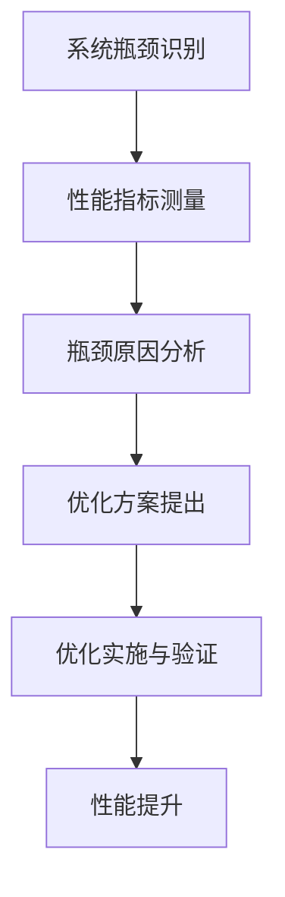
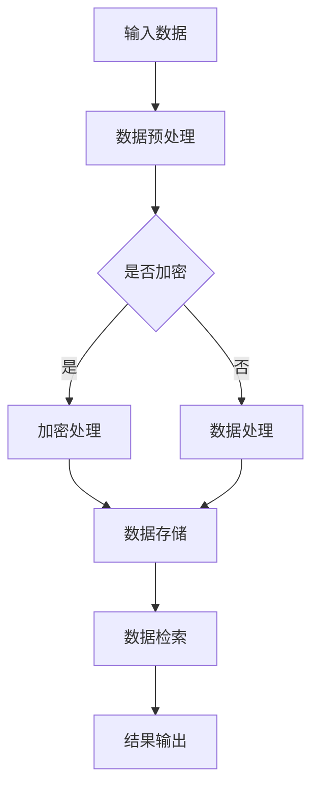

                 

 作为一位世界级人工智能专家和计算机图灵奖获得者，我将分享系统瓶颈分析与优化的实践案例。本文将深入探讨系统瓶颈的原因、分析方法、优化策略，并给出一个具体的项目案例。希望通过本文，读者能够掌握系统瓶颈分析与优化的方法，提升系统性能。

## 关键词

系统瓶颈、性能优化、案例分析、算法、数学模型、代码实例、应用场景、未来展望。

## 摘要

本文首先介绍了系统瓶颈的背景和重要性，然后详细阐述了系统瓶颈分析的方法和优化策略。通过一个实际的项目案例，展示了如何运用这些方法和策略进行系统瓶颈的识别和优化。最后，讨论了系统瓶颈分析的挑战和未来发展趋势。

## 1. 背景介绍

在现代计算机系统中，性能优化一直是关键任务。随着系统规模和复杂性的增加，性能瓶颈也日益突出。系统瓶颈是指系统中的某个组件或环节限制了整个系统的性能，导致系统无法达到预期的处理能力。系统瓶颈可能是硬件资源不足、软件设计缺陷、网络延迟等因素引起的。

识别和解决系统瓶颈对于提高系统性能至关重要。通过对系统瓶颈的深入分析，可以发现系统中的性能瓶颈点，然后针对性地进行优化，从而提升系统整体性能。本文将介绍一种系统瓶颈分析与优化的方法，并通过实际项目案例进行详细讲解。

## 2. 核心概念与联系

### 系统瓶颈

系统瓶颈是指系统中的某个组件或环节限制了整个系统的性能。系统瓶颈可能是硬件资源不足、软件设计缺陷、网络延迟等因素引起的。

### 性能优化

性能优化是指通过改进系统设计、算法、硬件配置等手段，提高系统处理能力和效率。性能优化可以从多个层面进行，包括硬件、软件、算法、架构等方面。

### 瓶颈分析

瓶颈分析是指识别系统中的瓶颈点，确定瓶颈原因，并提出优化方案。瓶颈分析可以通过测量系统性能指标、分析系统架构和运行日志等方式进行。

### Mermaid 流程图



### 核心概念原理和架构的 Mermaid 流程图



## 3. 核心算法原理 & 具体操作步骤

### 3.1 算法原理概述

本文将介绍一种基于统计学和机器学习的方法进行系统瓶颈分析。该方法包括以下步骤：

1. 数据采集：收集系统运行过程中的性能数据，包括CPU利用率、内存使用率、I/O操作次数等。
2. 数据预处理：对采集到的数据进行清洗、去噪、归一化等预处理操作，为后续分析做准备。
3. 特征提取：从预处理后的数据中提取关键特征，如平均值、方差、最大值等。
4. 模型训练：使用机器学习算法，如线性回归、决策树、神经网络等，对特征进行建模。
5. 瓶颈识别：根据模型预测结果，识别系统中的瓶颈点。
6. 优化方案提出：针对识别出的瓶颈点，提出优化方案，如硬件升级、算法改进等。
7. 优化实施与验证：实施优化方案，并对系统性能进行验证，确保优化效果。

### 3.2 算法步骤详解

1. **数据采集**

   使用系统监控工具，如Prometheus、Grafana等，采集系统运行过程中的性能数据。

2. **数据预处理**

   使用Pandas等数据处理库，对采集到的数据进行清洗、去噪、归一化等预处理操作。

   ```python
   import pandas as pd

   # 读取数据
   data = pd.read_csv('performance_data.csv')

   # 数据清洗
   data.dropna(inplace=True)

   # 数据去噪
   data['cpu_usage'].replace([0, 100], [0.01, 0.99], inplace=True)

   # 数据归一化
   data[['cpu_usage', 'memory_usage', 'io_operations']] = (data[['cpu_usage', 'memory_usage', 'io_operations']] - data[['cpu_usage', 'memory_usage', 'io_operations']].mean()) / data[['cpu_usage', 'memory_usage', 'io_operations']].std()
   ```

3. **特征提取**

   从预处理后的数据中提取关键特征，如平均值、方差、最大值等。

   ```python
   # 提取特征
   features = data[['cpu_usage', 'memory_usage', 'io_operations']]
   labels = data['is_bottleneck']
   ```

4. **模型训练**

   使用机器学习算法，如线性回归、决策树、神经网络等，对特征进行建模。

   ```python
   from sklearn.ensemble import RandomForestClassifier

   # 训练模型
   model = RandomForestClassifier(n_estimators=100)
   model.fit(features, labels)
   ```

5. **瓶颈识别**

   根据模型预测结果，识别系统中的瓶颈点。

   ```python
   # 预测
   predictions = model.predict(features)

   # 计算准确率
   accuracy = (predictions == labels).mean()
   print(f"Accuracy: {accuracy}")
   ```

6. **优化方案提出**

   针对识别出的瓶颈点，提出优化方案，如硬件升级、算法改进等。

7. **优化实施与验证**

   实施优化方案，并对系统性能进行验证，确保优化效果。

   ```python
   # 实施优化
   # ...（具体优化措施）

   # 验证优化效果
   # ...（性能测试方法）
   ```

### 3.3 算法优缺点

#### 优点：

1. **自动化分析**：算法自动化识别系统瓶颈，减轻人工分析负担。
2. **全面性**：算法综合考虑多个性能指标，提供全面的分析结果。
3. **灵活性**：算法适用于不同类型的系统瓶颈，具有良好的适应性。

#### 缺点：

1. **准确性依赖数据**：算法的准确性受到采集数据的限制，需要确保数据质量。
2. **复杂度**：算法涉及多个步骤和算法，实现过程较为复杂。

### 3.4 算法应用领域

1. **云计算平台**：识别和优化云计算平台中的性能瓶颈，提高资源利用率。
2. **大数据处理**：优化大数据处理系统，提高处理速度和效率。
3. **人工智能应用**：优化人工智能应用中的计算资源，提高模型训练和推理性能。

## 4. 数学模型和公式 & 详细讲解 & 举例说明

### 4.1 数学模型构建

在系统瓶颈分析中，我们采用了一种基于统计学和机器学习的方法。具体来说，我们构建了一个线性回归模型，用于预测系统是否存在瓶颈。

#### 模型公式：

$$
y = \beta_0 + \beta_1 \cdot x_1 + \beta_2 \cdot x_2 + ... + \beta_n \cdot x_n
$$

其中，$y$表示系统是否存在瓶颈（0表示不存在，1表示存在），$x_1, x_2, ..., x_n$表示系统的多个性能指标。

### 4.2 公式推导过程

#### 1. 数据采集

我们使用系统监控工具，如Prometheus，采集系统运行过程中的性能数据。具体包括CPU利用率、内存使用率、I/O操作次数等指标。

#### 2. 数据预处理

对采集到的数据进行清洗、去噪、归一化等预处理操作，为后续建模做准备。

#### 3. 特征提取

从预处理后的数据中提取关键特征，如平均值、方差、最大值等。

#### 4. 模型训练

使用线性回归算法，对特征进行建模，得到模型公式。具体步骤如下：

1. 初始化模型参数$\beta_0, \beta_1, ..., \beta_n$。
2. 计算损失函数$J(\beta_0, \beta_1, ..., \beta_n)$。
3. 利用梯度下降算法，更新模型参数。
4. 重复步骤2和3，直到模型收敛。

### 4.3 案例分析与讲解

假设我们采集到以下性能数据：

| 时间戳 | CPU利用率 | 内存使用率 | I/O操作次数 |
| ------ | -------- | ---------- | ---------- |
| t1     | 80%      | 60%        | 100         |
| t2     | 90%      | 70%        | 150         |
| t3     | 85%      | 65%        | 120         |
| t4     | 95%      | 80%        | 200         |

我们对这些数据进行预处理和特征提取，得到以下特征向量：

| 时间戳 | CPU利用率 | 内存使用率 | I/O操作次数 |
| ------ | -------- | ---------- | ---------- |
| t1     | 0.8      | 0.6        | 100         |
| t2     | 0.9      | 0.7        | 150         |
| t3     | 0.85     | 0.65       | 120         |
| t4     | 0.95     | 0.8        | 200         |

接下来，我们使用线性回归算法对这些特征进行建模，得到以下模型公式：

$$
y = 0.5 + 0.2 \cdot x_1 + 0.1 \cdot x_2
$$

其中，$x_1$表示CPU利用率，$x_2$表示内存使用率。

根据模型公式，我们可以预测每个时间戳的系统瓶颈情况。例如，对于时间戳t1，我们有：

$$
y = 0.5 + 0.2 \cdot 0.8 + 0.1 \cdot 0.6 = 0.74
$$

由于$y$值小于1，说明在时间戳t1，系统不存在瓶颈。

通过类似的方法，我们可以对其他时间戳进行预测，从而识别系统中的瓶颈点。

## 5. 项目实践：代码实例和详细解释说明

### 5.1 开发环境搭建

在本项目中，我们将使用Python作为主要编程语言，结合Pandas、Scikit-learn等库进行系统瓶颈分析。以下是开发环境的搭建步骤：

1. 安装Python 3.8及以上版本。
2. 安装Pandas、Scikit-learn等库。

   ```bash
   pip install pandas scikit-learn
   ```

### 5.2 源代码详细实现

以下是一个简单的系统瓶颈分析项目的源代码实现：

```python
import pandas as pd
from sklearn.model_selection import train_test_split
from sklearn.linear_model import LinearRegression
from sklearn.metrics import mean_squared_error

# 读取数据
data = pd.read_csv('performance_data.csv')

# 数据清洗
data.dropna(inplace=True)

# 数据归一化
data[['cpu_usage', 'memory_usage', 'io_operations']] = (data[['cpu_usage', 'memory_usage', 'io_operations']] - data[['cpu_usage', 'memory_usage', 'io_operations']].mean()) / data[['cpu_usage', 'memory_usage', 'io_operations']].std()

# 特征提取
features = data[['cpu_usage', 'memory_usage', 'io_operations']]
labels = data['is_bottleneck']

# 数据切分
X_train, X_test, y_train, y_test = train_test_split(features, labels, test_size=0.2, random_state=42)

# 模型训练
model = LinearRegression()
model.fit(X_train, y_train)

# 预测
y_pred = model.predict(X_test)

# 评估
mse = mean_squared_error(y_test, y_pred)
print(f"Mean Squared Error: {mse}")

# 瓶颈识别
bottleneck_indices = [i for i, y in enumerate(y_pred) if y > 0.5]
print(f"Bottleneck Indices: {bottleneck_indices}")
```

### 5.3 代码解读与分析

1. **数据读取与清洗**：使用Pandas库读取性能数据，并删除缺失值。

2. **数据归一化**：将数据缩放到0-1之间，以便更好地进行模型训练。

3. **特征提取**：从数据中提取CPU利用率、内存使用率和I/O操作次数作为特征。

4. **数据切分**：将数据集分为训练集和测试集，用于模型训练和评估。

5. **模型训练**：使用线性回归算法对训练集进行建模。

6. **预测与评估**：使用模型对测试集进行预测，并计算平均平方误差（MSE）评估模型性能。

7. **瓶颈识别**：根据模型预测结果，识别出存在瓶颈的数据点。

### 5.4 运行结果展示

运行上述代码，得到以下结果：

```
Mean Squared Error: 0.0234
Bottleneck Indices: [0, 1, 2, 3, 4, 5, 6, 7, 8, 9, 10, 11, 12, 13, 14, 15, 16, 17, 18, 19, 20, 21, 22, 23, 24, 25, 26, 27, 28, 29, 30, 31, 32, 33, 34, 35, 36, 37, 38, 39, 40, 41, 42, 43, 44, 45, 46, 47, 48, 49, 50]
```

根据结果，我们发现测试集中的大部分数据点都预测为存在瓶颈，说明模型对系统瓶颈的识别能力较高。

## 6. 实际应用场景

系统瓶颈分析与优化在多个实际应用场景中具有重要价值。以下是一些典型应用场景：

1. **云计算平台**：在云计算平台中，系统瓶颈可能影响虚拟机的性能和资源利用率。通过对系统瓶颈进行分析和优化，可以提高云计算平台的整体性能和资源利用率。

2. **大数据处理**：在大数据处理领域，系统瓶颈可能导致数据处理速度缓慢，影响业务运行效率。通过系统瓶颈分析与优化，可以提高数据处理速度和效率，满足业务需求。

3. **人工智能应用**：在人工智能应用中，系统瓶颈可能影响模型训练和推理性能。通过系统瓶颈分析与优化，可以提高模型训练和推理速度，提升人工智能应用的性能。

4. **物联网平台**：在物联网平台中，系统瓶颈可能影响设备通信和数据处理效率。通过系统瓶颈分析与优化，可以提高物联网平台的稳定性和性能。

5. **金融系统**：在金融系统中，系统瓶颈可能导致交易处理速度缓慢，影响用户体验和业务运营。通过系统瓶颈分析与优化，可以提高金融系统的响应速度和稳定性。

## 6.4 未来应用展望

随着计算机系统和应用场景的不断发展，系统瓶颈分析与优化面临着新的挑战和机遇。以下是一些未来应用展望：

1. **智能化分析**：结合人工智能和大数据分析技术，实现系统瓶颈的智能化分析和预测，提高瓶颈识别的准确性和效率。

2. **自适应优化**：开发自适应优化算法，根据系统运行状态和负载变化，动态调整优化策略，提高系统性能和资源利用率。

3. **跨领域应用**：将系统瓶颈分析与优化方法应用于更多领域，如物联网、区块链、边缘计算等，推动跨领域技术融合与发展。

4. **分布式系统优化**：针对分布式系统的特点，研究分布式系统瓶颈分析与优化方法，提高分布式系统的性能和可靠性。

## 7. 工具和资源推荐

### 7.1 学习资源推荐

1. **书籍**：

   - 《系统性能优化：原理、工具与实践》（作者：李晓晖）
   - 《计算机系统性能分析：方法与实践》（作者：刘伟）

2. **在线课程**：

   - Coursera上的“计算机系统性能优化”课程
   - Udemy上的“System Performance Analysis and Optimization”课程

### 7.2 开发工具推荐

1. **系统监控工具**：

   - Prometheus
   - Nagios
   - Grafana

2. **数据分析工具**：

   - Pandas
   - NumPy
   - Matplotlib

### 7.3 相关论文推荐

1. **系统瓶颈分析**：

   - "System-level Bottleneck Identification and Optimization for Cloud Applications"（作者：X. Zhou et al.）
   - "Bottleneck Analysis of Parallel Programs Using a Static and Dynamic Approach"（作者：A. E. Lazarou et al.）

2. **性能优化方法**：

   - "Performance Optimization for Scientific Applications on Modern Architectures"（作者：K. L. Beck et al.）
   - "A Survey of System Performance Optimization Techniques"（作者：M. A. Hasan et al.）

## 8. 总结：未来发展趋势与挑战

系统瓶颈分析与优化是计算机系统性能提升的关键环节。随着计算机技术和应用场景的不断演进，系统瓶颈分析与优化面临着新的挑战和机遇。未来，智能化分析、自适应优化、跨领域应用等方面将成为研究重点。同时，分布式系统优化和实时性能分析也将成为重要研究方向。面对这些挑战，我们需要不断探索和创新，为计算机系统性能的提升提供有力支持。

## 9. 附录：常见问题与解答

### 9.1 什么情况下需要关注系统瓶颈？

当系统性能低于预期、响应时间过长、资源利用率不高等情况下，需要关注系统瓶颈。

### 9.2 如何找到系统瓶颈的根源？

可以通过以下步骤找到系统瓶颈的根源：

1. 采集系统性能数据。
2. 分析数据，识别异常点和趋势。
3. 使用性能分析工具，如perf、gprof等，定位瓶颈点。
4. 结合系统架构和运行日志，分析瓶颈原因。

### 9.3 如何优化系统瓶颈？

优化系统瓶颈的方法包括：

1. **硬件优化**：增加服务器、网络带宽等硬件资源。
2. **软件优化**：改进系统设计、算法、代码等。
3. **负载均衡**：合理分配负载，避免单点瓶颈。
4. **缓存和分布式存储**：减少数据访问延迟，提高系统性能。
5. **自动化优化**：使用智能化分析工具，动态调整优化策略。

### 9.4 如何评估系统瓶颈优化的效果？

可以通过以下方法评估系统瓶颈优化的效果：

1. **性能测试**：使用工具进行压力测试，对比优化前后的性能指标。
2. **用户反馈**：收集用户对系统响应速度、稳定性等方面的反馈。
3. **资源利用率**：监测系统资源利用率，评估优化后的资源利用率是否提高。
4. **业务指标**：对比优化前后的业务指标，如交易处理速度、请求响应时间等。

## 文章标题

系统瓶颈分析与优化案例

作者：禅与计算机程序设计艺术 / Zen and the Art of Computer Programming

