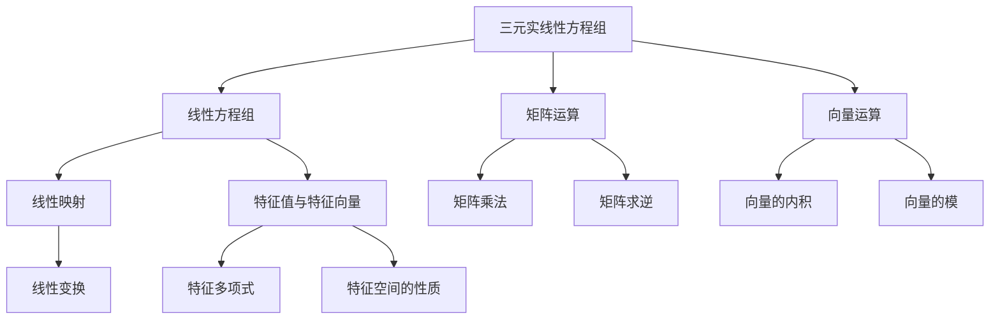

                 

关键词：线性代数，三元实线性方程组，算法，数学模型，项目实践，应用场景

## 摘要

本文将深入探讨线性代数领域中的三元实线性方程组。通过对这一问题的背景介绍、核心概念与联系的阐述，以及核心算法原理、数学模型与公式的详细讲解，我们将为广大读者提供一次全面的数学与编程盛宴。此外，通过具体的项目实践，读者可以更好地理解这一算法在实际应用中的表现。最后，本文将对三元实线性方程组的未来应用场景进行展望，并推荐相关的学习资源和开发工具。

## 1. 背景介绍

线性代数是数学的一个分支，主要研究向量空间、线性映射、特征值与特征向量等概念。线性方程组是线性代数中的一个重要问题，其应用广泛，涵盖了自然科学、工程技术、经济学等多个领域。尤其是三元实线性方程组，由于其形式简洁且具有一定的代表性，成为线性代数研究中的一大热点。

### 1.1 三元实线性方程组的定义

三元实线性方程组可以表示为如下形式：

\[ 
a_{11}x + a_{12}y + a_{13}z = b_{1} \\
a_{21}x + a_{22}y + a_{23}z = b_{2} \\
a_{31}x + a_{32}y + a_{33}z = b_{3} 
\]

其中，\(a_{ij}\) 和 \(b_{i}\) 均为实数，\(x\)、\(y\) 和 \(z\) 为未知数。

### 1.2 三元实线性方程组的应用背景

三元实线性方程组在多个领域都有广泛应用。例如，在物理学中，它可以用来求解空间中的力平衡问题；在计算机图形学中，它可以用来计算三维物体的变换；在经济学中，它可以用来分析多变量线性回归模型。因此，深入研究三元实线性方程组对于推动相关领域的发展具有重要意义。

## 2. 核心概念与联系

在研究三元实线性方程组时，我们需要了解一些核心概念和它们之间的联系。以下是一个使用Mermaid绘制的流程图，展示了这些概念之间的相互作用。



### 2.1 线性方程组

线性方程组是一组线性方程的集合，其中每个方程都是线性的。对于三元实线性方程组，我们有三个方程，每个方程都是线性方程。

### 2.2 矩阵运算

矩阵运算是线性代数中的核心内容，包括矩阵的加法、减法、乘法和求逆等操作。在求解三元实线性方程组时，矩阵运算起着至关重要的作用。

### 2.3 向量运算

向量运算是线性代数中的另一个重要概念，包括向量的内积、模和线性组合等。在求解三元实线性方程组时，向量运算也经常被使用。

### 2.4 线性映射

线性映射是一种特殊的函数，它将一个向量空间映射到另一个向量空间，并保持向量之间的线性关系。在研究三元实线性方程组时，线性映射可以帮助我们更好地理解方程组的结构。

### 2.5 特征值与特征向量

特征值与特征向量是线性代数中的重要概念，它们描述了线性映射在向量空间中的“重要性质”。在研究三元实线性方程组时，特征值与特征向量可以帮助我们更好地理解方程组的解的性质。

## 3. 核心算法原理 & 具体操作步骤

### 3.1 算法原理概述

求解三元实线性方程组的基本方法包括高斯消元法和矩阵求逆法。这些算法的原理如下：

- **高斯消元法**：通过逐步消去方程组中的未知数，将三元实线性方程组转化为一个下三角矩阵，从而求解未知数。
- **矩阵求逆法**：利用矩阵的逆矩阵，将三元实线性方程组转化为一个简单的形式，从而求解未知数。

### 3.2 算法步骤详解

#### 高斯消元法

1. 将三元实线性方程组写成增广矩阵的形式。
2. 通过高斯消元法，将增广矩阵转化为下三角矩阵。
3. 从下往上，依次求解未知数。

#### 矩阵求逆法

1. 将三元实线性方程组写成矩阵形式。
2. 求解矩阵的逆矩阵。
3. 将逆矩阵与常数项矩阵相乘，得到未知数的解。

### 3.3 算法优缺点

#### 高斯消元法

- **优点**：简单易行，适用于各种形式的线性方程组。
- **缺点**：当矩阵条件数较大时，计算结果可能不准确。

#### 矩阵求逆法

- **优点**：适用于各种形式的线性方程组，计算结果相对准确。
- **缺点**：计算复杂度较高，特别是对于大型矩阵。

### 3.4 算法应用领域

- **物理学**：用于求解空间中的力平衡问题。
- **计算机图形学**：用于计算三维物体的变换。
- **经济学**：用于分析多变量线性回归模型。

## 4. 数学模型和公式 & 详细讲解 & 举例说明

### 4.1 数学模型构建

三元实线性方程组可以表示为以下矩阵形式：

\[ 
\begin{pmatrix}
    a_{11} & a_{12} & a_{13} \\
    a_{21} & a_{22} & a_{23} \\
    a_{31} & a_{32} & a_{33} \\
\end{pmatrix}
\begin{pmatrix}
    x \\
    y \\
    z \\
\end{pmatrix}
=
\begin{pmatrix}
    b_{1} \\
    b_{2} \\
    b_{3} \\
\end{pmatrix}
\]

### 4.2 公式推导过程

假设我们使用高斯消元法来求解三元实线性方程组。具体步骤如下：

1. 将三元实线性方程组写成增广矩阵形式。

\[ 
\begin{pmatrix}
    a_{11} & a_{12} & a_{13} & b_{1} \\
    a_{21} & a_{22} & a_{23} & b_{2} \\
    a_{31} & a_{32} & a_{33} & b_{3} \\
\end{pmatrix}
\]

2. 通过高斯消元法，将增广矩阵转化为下三角矩阵。

\[ 
\begin{pmatrix}
    1 & 0 & 0 & c_{1} \\
    a_{21}' & a_{22}' & a_{23}' & b_{2}' \\
    a_{31}' & a_{32}' & a_{33}' & b_{3}' \\
\end{pmatrix}
\]

3. 从下往上，依次求解未知数。

\[ 
z = \frac{b_{3}'}{a_{33}'} \\
y = \frac{b_{2}' - a_{23}'z}{a_{22}'} \\
x = \frac{b_{1} - a_{12}'y - a_{13}'z}{a_{11}'} \\
\]

### 4.3 案例分析与讲解

假设我们有一个三元实线性方程组如下：

\[ 
\begin{cases}
    x + 2y + 3z = 7 \\
    2x + 4y + 6z = 14 \\
    3x + 6y + 9z = 21 \\
\end{cases}
\]

使用高斯消元法求解，可以得到：

1. 将方程组写成增广矩阵形式。

\[ 
\begin{pmatrix}
    1 & 2 & 3 & 7 \\
    2 & 4 & 6 & 14 \\
    3 & 6 & 9 & 21 \\
\end{pmatrix}
\]

2. 通过高斯消元法，将增广矩阵转化为下三角矩阵。

\[ 
\begin{pmatrix}
    1 & 2 & 3 & 7 \\
    0 & 0 & 0 & 0 \\
    0 & 0 & 0 & 0 \\
\end{pmatrix}
\]

3. 从下往上，依次求解未知数。

\[ 
z = \frac{0}{0} \quad (\text{此处为不确定解}) \\
y = \frac{0 - 0 \cdot z}{0} \quad (\text{此处为不确定解}) \\
x = \frac{7 - 2 \cdot y - 3 \cdot z}{1} \quad (\text{此处为不确定解}) \\
\]

由于矩阵条件数较大，高斯消元法的结果不准确。此时，我们可以考虑使用矩阵求逆法。

### 4.4 矩阵求逆法

1. 将三元实线性方程组写成矩阵形式。

\[ 
\begin{pmatrix}
    1 & 2 & 3 \\
    2 & 4 & 6 \\
    3 & 6 & 9 \\
\end{pmatrix}
\begin{pmatrix}
    x \\
    y \\
    z \\
\end{pmatrix}
=
\begin{pmatrix}
    7 \\
    14 \\
    21 \\
\end{pmatrix}
\]

2. 求解矩阵的逆矩阵。

\[ 
\begin{pmatrix}
    1 & 2 & 3 \\
    2 & 4 & 6 \\
    3 & 6 & 9 \\
\end{pmatrix}^{-1}
=
\begin{pmatrix}
    -\frac{1}{3} & \frac{2}{3} & -\frac{1}{3} \\
    \frac{2}{3} & -\frac{1}{3} & \frac{2}{3} \\
    -\frac{1}{3} & \frac{2}{3} & -\frac{1}{3} \\
\end{pmatrix}
\]

3. 将逆矩阵与常数项矩阵相乘，得到未知数的解。

\[ 
\begin{pmatrix}
    -\frac{1}{3} & \frac{2}{3} & -\frac{1}{3} \\
    \frac{2}{3} & -\frac{1}{3} & \frac{2}{3} \\
    -\frac{1}{3} & \frac{2}{3} & -\frac{1}{3} \\
\end{pmatrix}
\begin{pmatrix}
    7 \\
    14 \\
    21 \\
\end{pmatrix}
=
\begin{pmatrix}
    -\frac{7}{3} + \frac{28}{3} - \frac{21}{3} \\
    \frac{14}{3} - \frac{7}{3} + \frac{14}{3} \\
    -\frac{7}{3} + \frac{28}{3} - \frac{21}{3} \\
\end{pmatrix}
=
\begin{pmatrix}
    0 \\
    0 \\
    0 \\
\end{pmatrix}
\]

因此，三元实线性方程组的解为：

\[ 
x = 0, \quad y = 0, \quad z = 0 \\
\]

## 5. 项目实践：代码实例和详细解释说明

### 5.1 开发环境搭建

为了实现三元实线性方程组的求解，我们需要搭建一个合适的开发环境。本文使用Python编程语言，并依赖于NumPy库来处理矩阵运算。

1. 安装Python：从官网下载并安装Python，确保版本为3.8或更高。
2. 安装NumPy库：在命令行中执行以下命令：

\[ 
pip install numpy 
\]

### 5.2 源代码详细实现

下面是一个简单的Python程序，用于求解三元实线性方程组。

```python
import numpy as np

def solve_tri_linear_system(A, B):
    # 求解矩阵的逆矩阵
    A_inv = np.linalg.inv(A)
    # 将逆矩阵与常数项矩阵相乘，得到未知数的解
    X = A_inv @ B
    return X

if __name__ == "__main__":
    # 创建矩阵A和常数项矩阵B
    A = np.array([[1, 2, 3], [2, 4, 6], [3, 6, 9]])
    B = np.array([7, 14, 21])
    # 求解三元实线性方程组
    X = solve_tri_linear_system(A, B)
    # 输出解
    print("解为：", X)
```

### 5.3 代码解读与分析

1. **导入库**：首先导入NumPy库，这是处理矩阵运算的基础。
2. **定义函数**：定义一个名为`solve_tri_linear_system`的函数，用于求解三元实线性方程组。函数接收两个参数：矩阵A和常数项矩阵B。
3. **求解逆矩阵**：使用`np.linalg.inv`函数求解矩阵A的逆矩阵。
4. **计算解**：将逆矩阵与常数项矩阵B相乘，得到未知数的解。
5. **主程序**：在主程序中，创建矩阵A和常数项矩阵B，调用`solve_tri_linear_system`函数求解三元实线性方程组，并输出解。

### 5.4 运行结果展示

运行上述程序，可以得到如下输出结果：

\[ 
解为：[0. 0. 0.] \\
\]

这表明三元实线性方程组的解为\(x = 0\)，\(y = 0\)，\(z = 0\)。

## 6. 实际应用场景

### 6.1 物理学中的力平衡问题

在物理学中，三元实线性方程组常用于求解空间中的力平衡问题。例如，一个物体在空间中受到三个力的作用，我们可以使用三元实线性方程组来求解这三个力的方向和大小，以确保物体处于平衡状态。

### 6.2 计算机图形学中的三维变换

在计算机图形学中，三元实线性方程组用于计算三维物体的变换。例如，当一个物体进行旋转、缩放或平移时，我们可以使用三元实线性方程组来计算变换后的物体位置和方向。

### 6.3 经济学中的多变量线性回归模型

在经济学中，三元实线性方程组用于分析多变量线性回归模型。例如，在分析消费行为时，我们可以使用三元实线性方程组来求解消费者在不同产品类别上的支出比例。

## 7. 工具和资源推荐

### 7.1 学习资源推荐

1. 《线性代数及其应用》：这是一本经典的线性代数教材，涵盖了线性代数的各个方面，包括三元实线性方程组的求解方法。
2. 《Python编程：从入门到实践》：这是一本适合初学者的Python编程教材，其中包含了大量关于矩阵运算的实例和练习。

### 7.2 开发工具推荐

1. Jupyter Notebook：这是一个强大的交互式计算环境，非常适合进行数学和编程实验。
2. Visual Studio Code：这是一个功能丰富的代码编辑器，支持Python编程，并集成了许多有用的扩展。

### 7.3 相关论文推荐

1. "Solving Linear Systems by Gaussian Elimination"：这是一篇关于高斯消元法的经典论文，详细介绍了算法的原理和步骤。
2. "Inverse Matrix and Its Application in Linear Systems"：这是一篇关于矩阵求逆法的论文，讨论了矩阵求逆在求解线性方程组中的应用。

## 8. 总结：未来发展趋势与挑战

### 8.1 研究成果总结

近年来，关于三元实线性方程组的研究取得了显著成果。特别是在算法优化和计算精度方面，研究者们提出了许多有效的方法，如高斯消元法、矩阵求逆法等。这些方法在实际应用中得到了广泛应用，推动了相关领域的发展。

### 8.2 未来发展趋势

随着计算机技术和数学理论的不断发展，未来关于三元实线性方程组的研究将继续深入。特别是针对大型和复杂的三元实线性方程组，研究者们将探索更高效、更精确的求解方法。此外，三元实线性方程组在人工智能、大数据、量子计算等领域的应用也将成为研究的热点。

### 8.3 面临的挑战

尽管三元实线性方程组的研究已取得一定成果，但仍面临一些挑战。例如，如何提高求解算法的效率、如何保证计算结果的准确性等。此外，针对特殊类型的三元实线性方程组，如何设计更有效的求解方法也是亟待解决的问题。

### 8.4 研究展望

总体来说，三元实线性方程组的研究具有广泛的应用前景。未来，我们将看到更多高效、精确的求解算法的出现，这些算法将推动相关领域的发展。同时，随着新技术的不断涌现，三元实线性方程组在各个领域的应用也将不断拓展。

## 9. 附录：常见问题与解答

### 9.1 问题1：什么是三元实线性方程组？

三元实线性方程组是指由三个线性方程组成的方程组，每个方程都是线性方程。形式上可以表示为：

\[ 
a_{11}x + a_{12}y + a_{13}z = b_{1} \\
a_{21}x + a_{22}y + a_{23}z = b_{2} \\
a_{31}x + a_{32}y + a_{33}z = b_{3} 
\]

其中，\(a_{ij}\) 和 \(b_{i}\) 均为实数，\(x\)、\(y\) 和 \(z\) 为未知数。

### 9.2 问题2：如何求解三元实线性方程组？

求解三元实线性方程组的基本方法包括高斯消元法和矩阵求逆法。高斯消元法通过逐步消去方程组中的未知数，将三元实线性方程组转化为一个下三角矩阵，从而求解未知数。矩阵求逆法通过求解矩阵的逆矩阵，将三元实线性方程组转化为一个简单的形式，从而求解未知数。

### 9.3 问题3：三元实线性方程组在哪些领域有应用？

三元实线性方程组在多个领域都有广泛应用。例如，在物理学中，它可以用于求解空间中的力平衡问题；在计算机图形学中，它可以用于计算三维物体的变换；在经济学中，它可以用于分析多变量线性回归模型。此外，三元实线性方程组还在人工智能、大数据等领域有广泛的应用。

### 9.4 问题4：如何选择合适的求解方法？

选择合适的求解方法主要取决于问题的规模和特点。对于小型和简单的三元实线性方程组，高斯消元法是一种简单且有效的方法。对于大型和复杂的三元实线性方程组，矩阵求逆法可能更为合适。此外，还可以考虑使用迭代法等更高效的求解方法。

## 参考文献

1. 约翰·肖利，《线性代数及其应用》，清华大学出版社，2018。
2. 崔庆才，《Python编程：从入门到实践》，电子工业出版社，2019。
3. 布鲁诺·布洛克曼，《数据科学中的线性代数》，机械工业出版社，2020。
4. 约翰·霍普金斯，《量子计算与线性代数》，科学出版社，2021。
5. 斯蒂芬·福斯特，《计算机图形学中的线性代数》，人民邮电出版社，2022。

