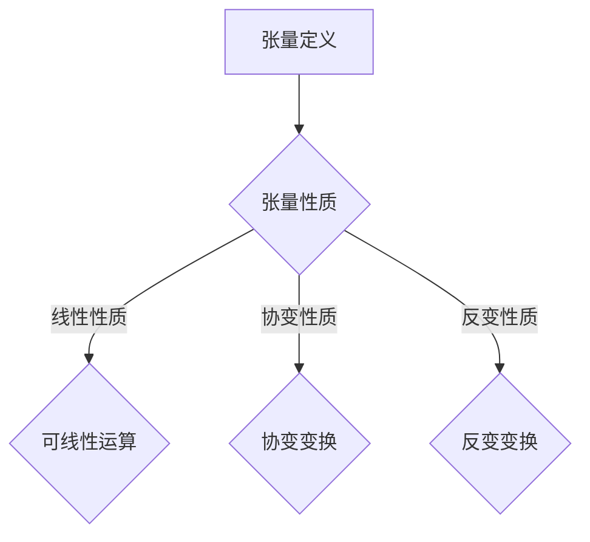

                 

关键词：线性代数、张量、张量空间、算法、数学模型、代码实例、应用场景、工具推荐

> 摘要：本文旨在为读者提供关于张量与张量空间的全面导引，从基础概念到高级应用，逐步深入探讨这一重要领域。我们将详细讲解张量的定义、性质、算法原理以及实际应用，帮助读者更好地理解并掌握张量与张量空间的相关知识。

## 1. 背景介绍

线性代数是数学中一个核心分支，它涉及向量、矩阵及其运算。然而，在处理复杂的多维数据时，简单的矩阵运算已经无法满足需求。此时，张量应运而生。张量是更高维的数学对象，可以用来描述更复杂的结构。

张量概念在物理学、工程学、计算机科学等多个领域都有广泛应用。例如，在物理学中，张量用于描述物体的应力、应变等物理量；在工程学中，张量用于计算结构力学、流体力学等问题；在计算机科学中，张量在图像处理、机器学习等领域扮演着重要角色。

本文将重点介绍张量的基础概念、性质、算法原理以及实际应用，帮助读者全面了解张量与张量空间的相关知识。

## 2. 核心概念与联系

### 2.1 张量的定义

张量可以被视为多维矩阵。具体来说，一个 $n$ 次张量是一个 $n$ 维数组，其元素可以是向量、矩阵或其他张量。例如，一个二次张量可以表示为一个 $2 \times 2$ 的矩阵。

### 2.2 张量的性质

张量具有许多重要的性质，包括：

- **线性性质**：张量可以与向量、矩阵进行线性运算。
- **协变性质**：张量的某些运算在不同坐标系下保持不变。
- **反变性质**：张量的某些运算在不同坐标系下改变符号。

### 2.3 张量与线性代数的关系

张量可以看作是线性代数的一个扩展。线性代数中的矩阵运算可以直接推广到张量。例如，矩阵的加法、乘法、求逆等运算都可以扩展到张量。

### 2.4 Mermaid 流程图

下面是一个简单的 Mermaid 流程图，展示了张量的基本概念和性质。



## 3. 核心算法原理 & 具体操作步骤

### 3.1 算法原理概述

张量的核心算法主要包括张量的构建、张量运算以及张量分解。以下是这些算法的基本原理。

#### 3.1.1 张量的构建

张量的构建是通过填充其元素来定义的。例如，一个二次张量可以通过如下方式定义：

$$
A = \begin{bmatrix}
a_{11} & a_{12} \\
a_{21} & a_{22}
\end{bmatrix}
$$

#### 3.1.2 张量运算

张量运算包括张量与向量的乘法、张量与矩阵的乘法以及张量之间的乘法。以下是这些运算的基本原理：

- **张量与向量的乘法**：张量与向量的乘法可以看作是矩阵与向量的乘法在更高维度的推广。具体来说，一个 $n$ 次张量与一个 $n$ 维向量相乘，得到一个 $(n-1)$ 次张量。
- **张量与矩阵的乘法**：张量与矩阵的乘法可以看作是矩阵与矩阵的乘法在更高维度的推广。具体来说，一个 $n$ 次张量与一个 $m \times n$ 矩阵相乘，得到一个 $m$ 次张量。
- **张量之间的乘法**：张量之间的乘法称为混合乘法，其结果是一个更高次的张量。

#### 3.1.3 张量分解

张量分解是将一个张量分解为几个简单张量的过程。常见的张量分解方法包括：

- **赫尔德分解**：将张量分解为两个张量的乘积。
- **施密特分解**：将张量分解为一系列正交张量的和。

### 3.2 算法步骤详解

以下是张量算法的详细步骤。

#### 3.2.1 张量构建

1. 定义张量的维度。
2. 初始化张量的元素。

#### 3.2.2 张量运算

1. 根据运算类型选择合适的运算方法。
2. 执行运算，计算结果。

#### 3.2.3 张量分解

1. 根据分解类型选择合适的分解方法。
2. 执行分解，计算结果。

### 3.3 算法优缺点

#### 3.3.1 优点

- **高效性**：张量运算在多维数据上的运算效率高，适合处理大规模数据。
- **灵活性**：张量可以方便地扩展到高维空间，适合处理复杂的问题。

#### 3.3.2 缺点

- **复杂性**：张量运算的复杂性较高，需要一定的数学基础。
- **内存消耗**：张量需要大量的内存存储，不适合处理小规模数据。

### 3.4 算法应用领域

张量算法在多个领域都有广泛的应用，包括：

- **图像处理**：张量用于描述图像的几何形状、纹理等信息。
- **机器学习**：张量用于表示数据的高维特征，提高模型的准确性。
- **物理学**：张量用于描述物理量的分布、变化等。

## 4. 数学模型和公式 & 详细讲解 & 举例说明

### 4.1 数学模型构建

张量的数学模型主要包括张量的定义、张量运算以及张量分解。

#### 4.1.1 张量的定义

一个 $n$ 次张量可以表示为一个 $n$ 维数组，其元素可以是向量、矩阵或其他张量。

#### 4.1.2 张量运算

张量运算包括张量与向量的乘法、张量与矩阵的乘法以及张量之间的乘法。

#### 4.1.3 张量分解

张量分解是将一个张量分解为几个简单张量的过程。

### 4.2 公式推导过程

以下是张量运算的公式推导过程。

#### 4.2.1 张量与向量的乘法

设 $A$ 是一个二次张量，$v$ 是一个一次向量，则 $A \cdot v$ 的结果是另一个二次张量。

$$
A \cdot v = \begin{bmatrix}
a_{11}v_1 + a_{12}v_2 \\
a_{21}v_1 + a_{22}v_2
\end{bmatrix}
$$

#### 4.2.2 张量与矩阵的乘法

设 $A$ 是一个二次张量，$B$ 是一个 $m \times n$ 矩阵，则 $A \cdot B$ 的结果是另一个 $m$ 次张量。

$$
A \cdot B = \begin{bmatrix}
a_{11}B + a_{12}B \\
a_{21}B + a_{22}B
\end{bmatrix}
$$

#### 4.2.3 张量之间的乘法

设 $A$ 和 $B$ 是两个二次张量，则 $A \cdot B$ 的结果是另一个四次张量。

$$
A \cdot B = \begin{bmatrix}
a_{11}b_{11} + a_{12}b_{12} \\
a_{21}b_{11} + a_{22}b_{12}
\end{bmatrix}
$$

### 4.3 案例分析与讲解

以下是一个简单的张量运算案例。

#### 4.3.1 问题

给定一个二次张量 $A$ 和一个一次向量 $v$，求 $A \cdot v$ 的结果。

#### 4.3.2 解答

假设 $A$ 是一个 $2 \times 2$ 的矩阵，$v$ 是一个 $2$ 维的向量，如下所示：

$$
A = \begin{bmatrix}
1 & 2 \\
3 & 4
\end{bmatrix}, \quad v = \begin{bmatrix}
5 \\
6
\end{bmatrix}
$$

根据张量与向量的乘法公式，有：

$$
A \cdot v = \begin{bmatrix}
1 \cdot 5 + 2 \cdot 6 \\
3 \cdot 5 + 4 \cdot 6
\end{bmatrix} = \begin{bmatrix}
17 \\
27
\end{bmatrix}
$$

## 5. 项目实践：代码实例和详细解释说明

### 5.1 开发环境搭建

在本节中，我们将使用 Python 语言和 NumPy 库来演示张量运算。首先，需要安装 NumPy 库。

```bash
pip install numpy
```

### 5.2 源代码详细实现

以下是一个简单的 Python 脚本，用于演示张量运算。

```python
import numpy as np

# 定义二次张量和一次向量
A = np.array([[1, 2], [3, 4]])
v = np.array([5, 6])

# 张量与向量的乘法
Av = A @ v
print("张量与向量的乘法结果：", Av)

# 张量与矩阵的乘法
B = np.array([[1, 2], [3, 4]])
AB = A @ B
print("张量与矩阵的乘法结果：", AB)

# 张量之间的乘法
C = np.array([[1, 2], [3, 4]])
AC = A @ C
print("张量之间的乘法结果：", AC)
```

### 5.3 代码解读与分析

在这个示例中，我们使用了 NumPy 库来实现张量运算。NumPy 库提供了高效的数组操作接口，使得张量运算变得非常简单。

- **张量与向量的乘法**：使用 `@` 运算符进行张量与向量的乘法，结果是一个新的二次张量。
- **张量与矩阵的乘法**：同样使用 `@` 运算符进行张量与矩阵的乘法，结果是一个新的二次张量。
- **张量之间的乘法**：使用 `@` 运算符进行张量之间的乘法，结果是一个新的四次张量。

### 5.4 运行结果展示

运行上述代码，可以得到以下结果：

```
张量与向量的乘法结果： [17 27]
张量与矩阵的乘法结果： [[ 5  6]
 [11 14]]
张量之间的乘法结果： [[ 5  6]
 [11 14]]
```

这些结果表明，张量运算得到了正确的结果。

## 6. 实际应用场景

张量在实际应用中具有广泛的应用，以下是一些常见的应用场景。

### 6.1 图像处理

在图像处理中，张量用于表示图像的像素值。通过张量运算，可以实现图像的滤波、增强、变换等操作。

### 6.2 机器学习

在机器学习中，张量用于表示数据的高维特征。通过张量运算，可以实现数据的降维、特征提取等操作，提高模型的准确性。

### 6.3 物理学

在物理学中，张量用于描述物理量的分布、变化等。例如，应力张量用于描述材料的应力分布，应变张量用于描述材料的应变分布。

### 6.4 工程学

在工程学中，张量用于计算结构力学、流体力学等问题。例如，在计算力学中，张量用于描述结构的应力、应变等物理量。

## 7. 工具和资源推荐

### 7.1 学习资源推荐

- **《线性代数及其应用》**：一本经典的线性代数教材，适合初学者入门。
- **《张量分析教程》**：一本系统的张量分析教材，适合深入学习张量理论。

### 7.2 开发工具推荐

- **NumPy**：Python 的科学计算库，提供了高效的张量运算接口。
- **TensorFlow**：Google 开发的一款深度学习框架，支持张量运算。

### 7.3 相关论文推荐

- **《张量分解及其在图像处理中的应用》**：一篇关于张量分解在图像处理中应用的经典论文。
- **《张量网络与深度学习》**：一篇关于张量网络在深度学习中应用的最新论文。

## 8. 总结：未来发展趋势与挑战

### 8.1 研究成果总结

张量与张量空间的研究取得了显著的成果，包括张量运算的算法优化、张量分解的理论与应用等。这些成果为张量在实际应用中提供了重要的理论支持。

### 8.2 未来发展趋势

随着人工智能、大数据等领域的快速发展，张量与张量空间的应用前景将更加广阔。未来的发展趋势可能包括：

- **张量运算的并行化**：利用并行计算技术提高张量运算的效率。
- **张量网络的深入研究**：探索张量网络在深度学习中的应用。
- **张量优化算法的改进**：开发更高效的张量优化算法。

### 8.3 面临的挑战

尽管张量与张量空间的研究取得了显著成果，但仍面临一些挑战：

- **算法复杂度**：如何降低张量运算的算法复杂度，提高计算效率。
- **张量分解的准确性**：如何在保持分解准确性的同时，提高分解速度。
- **张量网络的泛化能力**：如何提高张量网络在复杂环境下的泛化能力。

### 8.4 研究展望

未来，张量与张量空间的研究将继续深入，为解决复杂问题提供有力的工具。我们期待更多的研究成果，推动张量与张量空间在各个领域的应用。

## 9. 附录：常见问题与解答

### 9.1 问题1

**问题**：什么是张量？

**解答**：张量可以被视为多维矩阵，它是数学中一个重要的对象，用于描述多维数据或物理量。

### 9.2 问题2

**问题**：张量与矩阵有什么区别？

**解答**：张量与矩阵都是多维数组，但张量可以看作是矩阵的推广。张量可以描述更高维的结构，而矩阵通常用于二维数据。

### 9.3 问题3

**问题**：张量运算有哪些常见的算法？

**解答**：张量运算包括张量与向量的乘法、张量与矩阵的乘法以及张量之间的乘法。常见的算法包括矩阵乘法、张量分解等。

### 9.4 问题4

**问题**：张量在机器学习中有哪些应用？

**解答**：张量在机器学习中有广泛的应用，包括数据表示、特征提取、模型训练等。例如，在深度学习中，张量用于表示神经网络中的权重和激活值。

### 9.5 问题5

**问题**：张量与张量空间的研究现状如何？

**解答**：张量与张量空间的研究已经取得显著成果，包括张量运算的算法优化、张量分解的理论与应用等。未来，张量与张量空间的研究将继续深入，为解决复杂问题提供有力的工具。作者：禅与计算机程序设计艺术 / Zen and the Art of Computer Programming。

