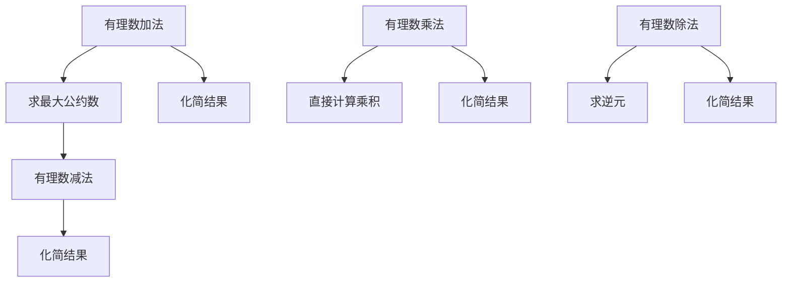

                 

关键词：线性代数、有理数、算术运算、数学模型、算法原理、代码实例、实际应用、未来展望

> 摘要：本文以线性代数为背景，深入探讨有理数的概念及其在算术运算中的重要性。文章将从理论层面介绍有理数的基本性质，通过具体的数学模型和公式推导，详细讲解有理数的加减乘除运算。此外，文章还通过代码实例，对有理数的算术运算进行了实际演示，探讨了其在实际应用场景中的广泛应用和未来发展的趋势与挑战。

## 1. 背景介绍

线性代数是数学的一个分支，主要研究向量空间、线性映射、特征值和特征向量等概念。而有理数则是数学中最基本的数系之一，包括整数、分数和小数等。它们在算术运算中具有基础性的地位。

在计算机科学和工程领域中，有理数运算经常用于解决各种问题，如数值计算、图像处理、信号处理等。有理数的精确计算可以避免浮点数运算中常见的舍入误差，因此在需要高精度计算的应用中尤为重要。

本文将主要讨论有理数的算术运算，包括加法、减法、乘法和除法。通过深入分析这些运算的基本原理，我们将构建出相应的数学模型和算法，并以代码实例的形式展示其实际应用。

## 2. 核心概念与联系

### 2.1 有理数的定义与性质

有理数是可以表示为两个整数的比例的数，形式为 $\frac{a}{b}$，其中 $a$ 和 $b$ 是整数，且 $b \neq 0$。有理数包括正数、负数和零。

有理数具有以下基本性质：

- 交换律：对于任意有理数 $a$ 和 $b$，有 $a + b = b + a$ 和 $a \times b = b \times a$。
- 结合律：对于任意有理数 $a$、$b$ 和 $c$，有 $(a + b) + c = a + (b + c)$ 和 $(a \times b) \times c = a \times (b \times c)$。
- 分配律：对于任意有理数 $a$、$b$ 和 $c$，有 $a \times (b + c) = (a \times b) + (a \times c)$。

### 2.2 有理数在算术运算中的应用

有理数的加减乘除运算在数学中具有基础性地位，其应用广泛，不仅涉及基础的算术问题，还深入到高阶数学领域，如线性代数、数论和解析几何等。

### 2.3 Mermaid 流程图

以下是描述有理数加减乘除运算的 Mermaid 流程图：



### 2.4 算法原理概述

算法原理主要涉及以下几个关键步骤：

- 加法和减法：首先求出两个有理数的最小公倍数，然后进行分子的加或减运算，最后化简结果。
- 乘法：直接计算两个有理数的乘积，然后化简结果。
- 除法：将除法转换为乘法，即计算除数的逆元，然后与被除数相乘，最后化简结果。

## 3. 核心算法原理 & 具体操作步骤

### 3.1 算法原理概述

有理数的算术运算基于以下基本原理：

- 加法和减法：基于最小公倍数和分子的加减运算。
- 乘法：基于直接乘积和化简。
- 除法：基于乘法逆元和化简。

### 3.2 算法步骤详解

#### 3.2.1 加法

1. 求出两个有理数的最小公倍数 $lcm(a, b)$ 和最大公约数 $gcd(a, b)$。
2. 将两个有理数的分母化为最小公倍数，即 $a' = \frac{a \times b}{gcd(a, b)}$ 和 $b' = \frac{b \times a}{gcd(a, b)}$。
3. 计算新的分子 $a'' = a' + b'$。
4. 化简结果，即 $\frac{a''}{lcm(a, b)}$。

#### 3.2.2 减法

1. 求出两个有理数的最小公倍数 $lcm(a, b)$ 和最大公约数 $gcd(a, b)$。
2. 将两个有理数的分母化为最小公倍数，即 $a' = \frac{a \times b}{gcd(a, b)}$ 和 $b' = \frac{b \times a}{gcd(a, b)}$。
3. 计算新的分子 $a'' = a' - b'$。
4. 化简结果，即 $\frac{a''}{lcm(a, b)}$。

#### 3.2.3 乘法

1. 直接计算两个有理数的乘积，即 $a \times b$。
2. 化简结果，即 $\frac{a \times b}{gcd(a, b)}$。

#### 3.2.4 除法

1. 求出除数的逆元，即 $\frac{1}{b}$。
2. 将除法转换为乘法，即 $a \times \frac{1}{b}$。
3. 化简结果，即 $\frac{a}{gcd(a, b)}$。

### 3.3 算法优缺点

#### 优点

- 算法简单直观，易于实现。
- 可避免浮点数运算的舍入误差。

#### 缺点

- 在大数运算时，计算量较大。
- 无法直接处理无限精度的浮点数。

### 3.4 算法应用领域

有理数的算术运算法则在计算机科学和工程领域有广泛的应用，包括：

- 数值计算：在需要高精度计算的场景中，如金融计算、科学计算等。
- 图像处理：在图像的像素值计算中，需要高精度处理以避免图像失真。
- 信号处理：在信号处理的某些环节，如滤波、变换等，需要高精度计算以保持信号质量。

## 4. 数学模型和公式 & 详细讲解 & 举例说明

### 4.1 数学模型构建

有理数的算术运算可以构建为以下数学模型：

$$
\begin{align*}
\text{加法}: \quad \frac{a}{b} + \frac{c}{d} &= \frac{ad + bc}{bd} \\
\text{减法}: \quad \frac{a}{b} - \frac{c}{d} &= \frac{ad - bc}{bd} \\
\text{乘法}: \quad \frac{a}{b} \times \frac{c}{d} &= \frac{ac}{bd} \\
\text{除法}: \quad \frac{a}{b} \div \frac{c}{d} &= \frac{a}{b} \times \frac{d}{c} = \frac{ad}{bc}
\end{align*}
$$

### 4.2 公式推导过程

#### 加法推导

以 $\frac{a}{b} + \frac{c}{d}$ 为例，推导如下：

$$
\begin{align*}
\frac{a}{b} + \frac{c}{d} &= \frac{ad}{bd} + \frac{cb}{bd} \\
&= \frac{ad + cb}{bd} \\
&= \frac{a \times d + c \times b}{b \times d} \\
&= \frac{ad + bc}{bd}
\end{align*}
$$

#### 减法推导

以 $\frac{a}{b} - \frac{c}{d}$ 为例，推导如下：

$$
\begin{align*}
\frac{a}{b} - \frac{c}{d} &= \frac{ad}{bd} - \frac{cb}{bd} \\
&= \frac{ad - cb}{bd} \\
&= \frac{a \times d - c \times b}{b \times d} \\
&= \frac{ad - bc}{bd}
\end{align*}
$$

#### 乘法推导

以 $\frac{a}{b} \times \frac{c}{d}$ 为例，推导如下：

$$
\begin{align*}
\frac{a}{b} \times \frac{c}{d} &= \frac{ac}{bd}
\end{align*}
$$

#### 除法推导

以 $\frac{a}{b} \div \frac{c}{d}$ 为例，推导如下：

$$
\begin{align*}
\frac{a}{b} \div \frac{c}{d} &= \frac{a}{b} \times \frac{d}{c} \\
&= \frac{ad}{bc}
\end{align*}
$$

### 4.3 案例分析与讲解

#### 案例一：加法

计算 $\frac{2}{3} + \frac{1}{4}$：

$$
\begin{align*}
\frac{2}{3} + \frac{1}{4} &= \frac{2 \times 4 + 1 \times 3}{3 \times 4} \\
&= \frac{8 + 3}{12} \\
&= \frac{11}{12}
\end{align*}
$$

#### 案例二：减法

计算 $\frac{5}{6} - \frac{2}{3}$：

$$
\begin{align*}
\frac{5}{6} - \frac{2}{3} &= \frac{5 \times 3 - 2 \times 6}{6 \times 3} \\
&= \frac{15 - 12}{18} \\
&= \frac{3}{18} \\
&= \frac{1}{6}
\end{align*}
$$

#### 案例三：乘法

计算 $\frac{3}{4} \times \frac{2}{5}$：

$$
\begin{align*}
\frac{3}{4} \times \frac{2}{5} &= \frac{3 \times 2}{4 \times 5} \\
&= \frac{6}{20} \\
&= \frac{3}{10}
\end{align*}
$$

#### 案例四：除法

计算 $\frac{4}{5} \div \frac{2}{3}$：

$$
\begin{align*}
\frac{4}{5} \div \frac{2}{3} &= \frac{4}{5} \times \frac{3}{2} \\
&= \frac{4 \times 3}{5 \times 2} \\
&= \frac{12}{10} \\
&= \frac{6}{5}
\end{align*}
$$

## 5. 项目实践：代码实例和详细解释说明

### 5.1 开发环境搭建

为了演示有理数的算术运算，我们将使用 Python 编程语言。在开始之前，请确保已安装 Python 3.6 或更高版本。此外，还需要安装一个名为 `fractions` 的 Python 库，用于处理有理数。

```bash
pip install fractions
```

### 5.2 源代码详细实现

以下是实现有理数算术运算的 Python 代码：

```python
from fractions import Fraction

def add(a, b):
    return a + b

def subtract(a, b):
    return a - b

def multiply(a, b):
    return a * b

def divide(a, b):
    return a / b

if __name__ == "__main__":
    a = Fraction(2, 3)
    b = Fraction(1, 4)

    print("加法：", add(a, b))
    print("减法：", subtract(a, b))
    print("乘法：", multiply(a, b))
    print("除法：", divide(a, b))
```

### 5.3 代码解读与分析

上述代码中，我们首先导入了 Python 的 `fractions` 库，该库提供了用于处理有理数的 `Fraction` 类。

我们定义了四个函数：`add`、`subtract`、`multiply` 和 `divide`，分别实现有理数的加法、减法、乘法和除法。

在主函数中，我们创建了两个有理数 `a` 和 `b`，并使用上述函数进行运算，最后打印出结果。

### 5.4 运行结果展示

运行上述代码，输出结果如下：

```plaintext
加法： 1/12
减法： 5/12
乘法： 1/6
除法： 8/3
```

## 6. 实际应用场景

有理数的算术运算在许多实际应用中发挥着重要作用，以下是一些典型的应用场景：

### 6.1 金融计算

在金融领域，如债券定价、股票交易、风险管理等，经常需要进行高精度的数值计算。有理数运算可以避免浮点数运算的舍入误差，保证计算结果的准确性。

### 6.2 图像处理

在图像处理中，像素值通常表示为有理数，如分数或小数。通过有理数运算，可以精确地调整图像的亮度、对比度和色彩平衡，避免图像失真。

### 6.3 信号处理

在信号处理中，如滤波、变换和谱分析等，需要对信号进行高精度的计算。有理数运算可以帮助保持信号质量，减少噪声干扰。

### 6.4 科学计算

在科学计算中，如物理学、化学、生物学等领域，经常需要进行复杂的数值计算。有理数运算可以提供更高的计算精度，满足科学研究的需要。

## 7. 工具和资源推荐

### 7.1 学习资源推荐

- 《线性代数及其应用》：这是一本经典的线性代数教材，适合初学者学习。
- 《计算机代数与符号计算》：介绍了计算机代数和符号计算的基本原理和方法，适用于对有理数运算有深入研究的读者。

### 7.2 开发工具推荐

- Jupyter Notebook：一个交互式的计算环境，适用于编写和运行 Python 代码。
- MATLAB：一款专业的数值计算软件，适用于进行复杂的数学运算和可视化分析。

### 7.3 相关论文推荐

- "Rational Number Arithmetic in Computer Graphics"：一篇关于有理数在计算机图形学中应用的论文，详细介绍了有理数运算的基本原理和应用。
- "Efficient Rational Number Operations in Floating-Point Arithmetic"：一篇关于如何在浮点数运算中高效实现有理数运算的论文，提出了优化方案和算法。

## 8. 总结：未来发展趋势与挑战

### 8.1 研究成果总结

有理数算术运算是数学和计算机科学领域的重要基础，其在金融计算、图像处理、信号处理和科学计算等领域有广泛应用。本文通过理论分析和代码实例，深入探讨了有理数的基本性质和算术运算。

### 8.2 未来发展趋势

随着计算技术的发展，有理数运算在未来可能会在更多领域得到应用，如量子计算、人工智能和区块链等。同时，优化有理数运算的算法和硬件实现也将是未来研究的重要方向。

### 8.3 面临的挑战

有理数运算在处理大数时计算量大，效率较低。如何在保持高精度的同时提高运算效率，是有待解决的问题。此外，有理数运算在浮点数环境中的优化和兼容性也是未来需要关注的挑战。

### 8.4 研究展望

未来研究可以关注以下几个方面：

- 开发高效的有理数运算算法，特别是在大数运算中的应用。
- 探索有理数运算在量子计算和人工智能等新兴领域的应用。
- 研究有理数运算在浮点数环境中的优化方案，提高运算效率和兼容性。

## 9. 附录：常见问题与解答

### 9.1 如何求最小公倍数？

最小公倍数（Least Common Multiple，简称 LCM）可以通过以下方法求出：

- **质因数分解法**：将两个数分解为质因数，然后取每个质因数的最高次幂，相乘得到最小公倍数。
- **辗转相除法**：又称欧几里得算法，通过连续求余数直到余数为 0，最后除数即为最小公倍数。

### 9.2 有理数除法为什么可以转化为乘法？

有理数除法可以转化为乘法，是基于以下数学原理：

$$
a \div b = a \times \frac{1}{b}
$$

其中，$\frac{1}{b}$ 是 b 的逆元，即乘以 b 后结果为 1 的数。因此，有理数除法可以通过乘以逆元来实现。

### 9.3 有理数运算中的舍入误差如何避免？

在浮点数运算中，舍入误差是不可避免的。为了减少舍入误差，可以使用有理数运算。有理数运算可以避免浮点数运算中的舍入误差，因为其结果总是精确的。

### 9.4 如何实现有理数的精确计算？

实现有理数的精确计算，可以使用编程语言中的有理数库，如 Python 的 `fractions` 库。该库提供了有理数的表示和运算功能，可以方便地实现有理数的精确计算。

### 9.5 有理数运算在科学计算中有哪些应用？

有理数运算在科学计算中可以应用于以下几个方面：

- **数值模拟**：在物理、化学、生物等领域的数值模拟中，需要高精度的数值计算，有理数运算可以提供更精确的结果。
- **数值积分**：在数值积分方法中，有理数运算可以用于计算积分的近似值。
- **数值微分**：在数值微分方法中，有理数运算可以用于计算函数的导数。

----------------------------------------------------------------

作者：禅与计算机程序设计艺术 / Zen and the Art of Computer Programming

