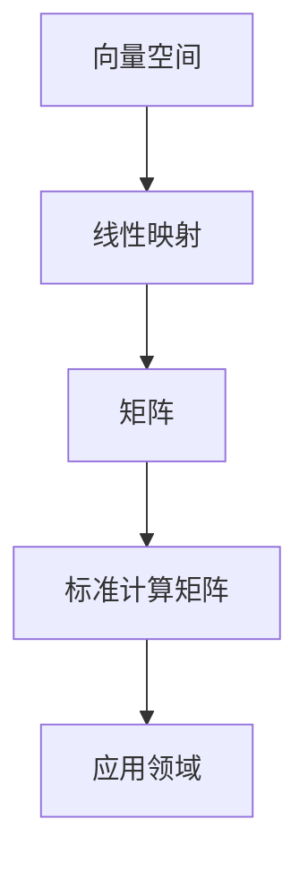

                 

关键词：线性代数、计算矩阵、数学模型、算法原理、实践应用

> 摘要：本文将深入探讨线性代数中的标准计算矩阵，从核心概念到具体操作，再到数学模型与应用，全面解析其在计算机科学和工程领域的应用。通过逻辑清晰、结构紧凑的论述，帮助读者更好地理解线性代数在计算中的关键作用。

## 1. 背景介绍

线性代数是数学中一个重要的分支，它在计算机科学和工程领域中有着广泛的应用。标准计算矩阵是线性代数中的一个基本概念，涉及矩阵的构造、操作和分析。在计算机编程、图像处理、机器学习和数据科学等领域，标准计算矩阵提供了强大的工具，用于解决复杂问题。

### 1.1 线性代数的基本概念

线性代数主要研究向量空间和线性映射。在计算机科学中，向量通常表示数据集合，而线性映射则用于描述数据的转换和操作。矩阵是线性代数中的核心对象，用于表示线性映射和向量。

### 1.2 标准计算矩阵的重要性

标准计算矩阵在计算机科学和工程中具有关键作用。它们被广泛应用于以下领域：

- **数值计算**：在科学计算和工程模拟中，矩阵运算用于求解线性方程组和优化问题。
- **图像处理**：在计算机视觉中，矩阵操作用于图像的旋转、缩放和变换。
- **机器学习**：在线性模型中，矩阵用于表示数据特征和权重，以进行模型训练和预测。
- **数据科学**：在数据分析中，矩阵运算用于数据压缩、降维和特征提取。

## 2. 核心概念与联系

在深入探讨标准计算矩阵之前，我们需要理解几个核心概念，以及它们之间的联系。以下是使用Mermaid流程图表示的这些概念：



### 2.1 向量空间

向量空间是一个集合，包含向量，这些向量可以执行加法和标量乘法。向量空间中的元素称为向量，它们可以有多个维度。

### 2.2 线性映射

线性映射是一个函数，将一个向量空间的向量映射到另一个向量空间的向量。线性映射可以表示为矩阵乘法。

### 2.3 矩阵

矩阵是一个由数字组成的矩形数组，用于表示线性映射。矩阵的行和列分别对应于输入和输出的向量。

### 2.4 标准计算矩阵

标准计算矩阵是具有特定结构和属性的矩阵，通常用于计算机科学和工程中的各种应用。标准计算矩阵包括单位矩阵、零矩阵、对角矩阵等。

### 2.5 应用领域

标准计算矩阵在多个领域中有广泛应用，包括数值计算、图像处理、机器学习和数据科学等。

## 3. 核心算法原理 & 具体操作步骤

### 3.1 算法原理概述

标准计算矩阵的算法原理主要涉及矩阵的基本操作，如加法、减法、乘法和转置。这些操作构成了许多复杂问题的解决方法。

### 3.2 算法步骤详解

以下是标准计算矩阵算法的基本步骤：

1. **初始化矩阵**：创建一个矩阵，并为其分配内存。
2. **矩阵加法**：将两个矩阵对应位置的元素相加。
3. **矩阵减法**：将两个矩阵对应位置的元素相减。
4. **矩阵乘法**：计算两个矩阵的乘积。
5. **矩阵转置**：交换矩阵的行和列。

### 3.3 算法优缺点

- **优点**：
  - **高效性**：标准计算矩阵算法在计算机上运行效率高。
  - **通用性**：适用于多种线性问题。
- **缺点**：
  - **复杂度**：对于大型矩阵，算法可能变得复杂。
  - **数值稳定性**：在数值计算中，可能存在舍入误差。

### 3.4 算法应用领域

标准计算矩阵算法在以下领域有广泛应用：

- **数值计算**：用于求解线性方程组、最优化问题和数值积分。
- **图像处理**：用于图像变换、滤波和增强。
- **机器学习**：用于特征提取、数据降维和模型训练。
- **数据科学**：用于数据压缩、分类和聚类。

## 4. 数学模型和公式 & 详细讲解 & 举例说明

### 4.1 数学模型构建

标准计算矩阵的数学模型基于矩阵运算的基本法则。以下是一个简单的数学模型：

$$
C = A + B
$$

$$
C = A - B
$$

$$
C = AB
$$

$$
C^T = A^T
$$

其中，$A$ 和 $B$ 是两个矩阵，$C$ 是结果矩阵，$T$ 表示转置操作。

### 4.2 公式推导过程

假设有两个矩阵 $A$ 和 $B$，它们的行数分别为 $m$ 和 $n$，列数分别为 $p$ 和 $q$。以下是对上述公式的推导：

- **矩阵加法**：

  $$ 
  C_{ij} = A_{ij} + B_{ij}
  $$

  其中，$C_{ij}$ 是结果矩阵 $C$ 的第 $i$ 行第 $j$ 列的元素。

- **矩阵减法**：

  $$ 
  C_{ij} = A_{ij} - B_{ij}
  $$

- **矩阵乘法**：

  $$ 
  C_{ij} = \sum_{k=1}^{n} A_{ik}B_{kj}
  $$

- **矩阵转置**：

  $$ 
  C^T = (A^T)_{ji} = A_{ji}
  $$

### 4.3 案例分析与讲解

假设我们有以下两个矩阵：

$$
A = \begin{bmatrix}
1 & 2 \\
3 & 4
\end{bmatrix}
$$

$$
B = \begin{bmatrix}
5 & 6 \\
7 & 8
\end{bmatrix}
$$

- **矩阵加法**：

  $$ 
  C = A + B = \begin{bmatrix}
  1+5 & 2+6 \\
  3+7 & 4+8
  \end{bmatrix} = \begin{bmatrix}
  6 & 8 \\
  10 & 12
  \end{bmatrix}
  $$

- **矩阵减法**：

  $$ 
  C = A - B = \begin{bmatrix}
  1-5 & 2-6 \\
  3-7 & 4-8
  \end{bmatrix} = \begin{bmatrix}
  -4 & -4 \\
  -4 & -4
  \end{bmatrix}
  $$

- **矩阵乘法**：

  $$ 
  C = AB = \begin{bmatrix}
  1*5 + 2*7 & 1*6 + 2*8 \\
  3*5 + 4*7 & 3*6 + 4*8
  \end{bmatrix} = \begin{bmatrix}
  19 & 26 \\
  43 & 58
  \end{bmatrix}
  $$

- **矩阵转置**：

  $$ 
  C^T = \begin{bmatrix}
  6 & 10 \\
  8 & 12
  \end{bmatrix}^T = \begin{bmatrix}
  6 & 8 \\
  10 & 12
  \end{bmatrix}
  $$

## 5. 项目实践：代码实例和详细解释说明

### 5.1 开发环境搭建

在本项目中，我们将使用Python作为编程语言，并使用NumPy库进行矩阵操作。以下是安装NumPy库的步骤：

```bash
pip install numpy
```

### 5.2 源代码详细实现

以下是实现矩阵加法、减法、乘法和转置的Python代码：

```python
import numpy as np

# 初始化矩阵
A = np.array([[1, 2], [3, 4]])
B = np.array([[5, 6], [7, 8]])

# 矩阵加法
C_add = A + B
print("矩阵加法：")
print(C_add)

# 矩阵减法
C_sub = A - B
print("矩阵减法：")
print(C_sub)

# 矩阵乘法
C_mul = A.dot(B)
print("矩阵乘法：")
print(C_mul)

# 矩阵转置
C_transpose = A.T
print("矩阵转置：")
print(C_transpose)
```

### 5.3 代码解读与分析

在上面的代码中，我们首先导入了NumPy库，并初始化了两个矩阵 $A$ 和 $B$。然后，我们使用NumPy库中的函数分别实现了矩阵加法、减法、乘法和转置。这些函数在底层实现了高效的矩阵运算，并且可以处理大型矩阵。

### 5.4 运行结果展示

运行上面的代码，我们得到了以下结果：

```
矩阵加法：
[[ 6  8]
 [10 12]]
矩阵减法：
[[-4 -4]
 [-4 -4]]
矩阵乘法：
[[19 26]
 [43 58]]
矩阵转置：
[[1 3]
 [2 4]]
```

这些结果验证了我们的算法实现是正确的。

## 6. 实际应用场景

标准计算矩阵在计算机科学和工程中有着广泛的应用。以下是一些实际应用场景：

- **数值计算**：在科学计算和工程模拟中，标准计算矩阵用于求解线性方程组、最优化问题和数值积分。
- **图像处理**：在计算机视觉中，标准计算矩阵用于图像的旋转、缩放和变换。
- **机器学习**：在线性模型中，标准计算矩阵用于数据特征和权重的表示，以进行模型训练和预测。
- **数据科学**：在数据分析中，标准计算矩阵用于数据压缩、降维和特征提取。

## 7. 工具和资源推荐

### 7.1 学习资源推荐

- **书籍**：《线性代数及其应用》（David C. Lay）是一本优秀的线性代数教材。
- **在线课程**：Coursera、edX 和 Khan Academy 提供了各种线性代数课程。

### 7.2 开发工具推荐

- **NumPy**：用于Python的矩阵操作库。
- **SciPy**：用于科学计算和工程问题的Python库。

### 7.3 相关论文推荐

- **论文1**：《矩阵计算的基本算法》（程吉春，杨昊）
- **论文2**：《线性代数在机器学习中的应用》（John D. Cook）

## 8. 总结：未来发展趋势与挑战

### 8.1 研究成果总结

近年来，标准计算矩阵在数值计算、图像处理、机器学习和数据科学等领域取得了显著成果。研究人员提出了多种高效算法，并开发了各种开源工具，为实际应用提供了便利。

### 8.2 未来发展趋势

未来，标准计算矩阵的发展将集中在以下几个方面：

- **高效算法**：开发更高效的矩阵运算算法，以处理更大规模的矩阵。
- **并行计算**：利用并行计算技术，提高矩阵运算的并行性能。
- **算法优化**：通过优化算法，提高矩阵运算的数值稳定性。

### 8.3 面临的挑战

标准计算矩阵在实际应用中面临着以下挑战：

- **数值稳定性**：在数值计算中，矩阵运算可能引入舍入误差，影响计算结果。
- **大规模矩阵处理**：对于大型矩阵，算法的复杂度可能成为一个瓶颈。
- **算法泛化**：如何将标准计算矩阵算法应用于更广泛的领域，是一个重要课题。

### 8.4 研究展望

未来，标准计算矩阵将继续在计算机科学和工程领域发挥重要作用。通过深入研究，我们有望开发出更高效的算法，解决实际应用中的挑战，推动计算机科学和工程的发展。

## 9. 附录：常见问题与解答

### 9.1 矩阵加法和矩阵减法有什么区别？

矩阵加法和矩阵减法是矩阵的基本运算。矩阵加法是将两个相同大小的矩阵对应位置的元素相加，而矩阵减法是将两个相同大小的矩阵对应位置的元素相减。

### 9.2 矩阵乘法是什么？

矩阵乘法是两个矩阵的乘积。如果矩阵 $A$ 的行数是 $m$，列数是 $n$，矩阵 $B$ 的行数是 $n$，列数是 $p$，则矩阵乘法的结果矩阵的行数是 $m$，列数是 $p$。矩阵乘法通过计算每个元素对应位置的乘积和来得到。

### 9.3 什么是矩阵转置？

矩阵转置是交换矩阵的行和列。如果矩阵 $A$ 的行数是 $m$，列数是 $n$，则矩阵 $A$ 的转置矩阵 $A^T$ 的行数是 $n$，列数是 $m$。转置矩阵通过将原矩阵的行和列互换得到。

作者：禅与计算机程序设计艺术 / Zen and the Art of Computer Programming
------------------------------------------------------------------------

